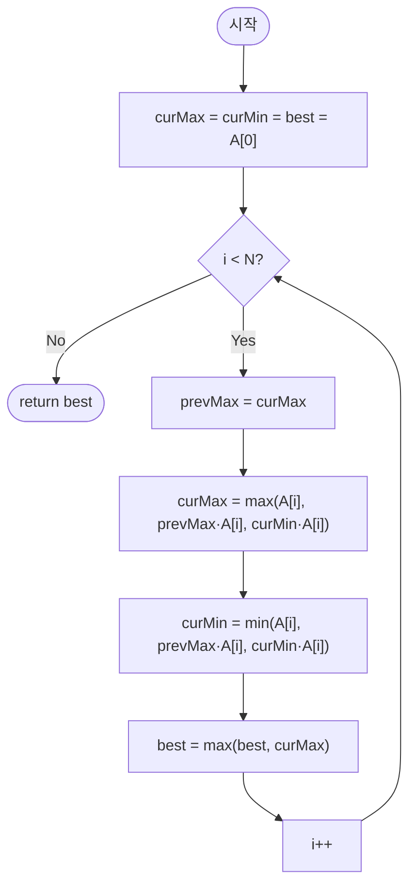

import { AlgorithmSimulation } from "#guide-sim";

# maximumProductSubarray — 곱셈에서는 최솟값도 최댓값의 후보가 되는 이유

## 한눈에 보는 컨셉

정수 배열에서 연속 부분 배열의 곱 중 최댓값을 찾는 문제예요. 핵심 관찰은 하나입니다 — **곱에서는 음수 × 음수가 양수로 뒤집히므로, "지금까지의 최댓값"만 들고 다니면 다음 순간 최댓값이 될 뻔한 최솟값(큰 음수)을 놓칩니다.** 그래서 위치마다 최댓값과 최솟값을 **동시에** 갱신하면, 배열을 한 번만 훑고도(`O(N)` 시간, `O(1)` 공간) 답을 구할 수 있어요.

## 출발점: 가장 순진한 방법부터

문제를 정확히 잡고 갈게요.

```ts
function maximumProductSubarray(A: number[]): number
```

| 파라미터 | 의미 | 제약 |
|----------|------|------|
| `A` | 정수 배열 | $1 \leq N \leq 100{,}000$, $-10 \leq A[i] \leq 10$ |

**반환값**: 비어 있지 않은 연속 부분 배열의 곱 중 최댓값. 부분 배열은 하나 이상의 원소를 반드시 포함해야 합니다 — "아무것도 선택하지 않기"는 선택지가 아니에요.

"구간의 최댓값을 찾는 문제"를 처음 보면 가장 정직한 접근은 **모든 구간을 직접 나열해 곱을 계산**하는 것입니다. 구간이 $\binom{N}{2} + N = O(N^2)$개이므로, 왼쪽 끝을 고정하고 오른쪽 끝을 늘려가며 누적곱을 유지하면 구간 하나당 $O(1)$씩 총 $O(N^2)$에 답을 구할 수 있어요.

```ts
function maximumProductSubarrayNaive(A: number[]): number {
  let best = A[0]!;
  for (let l = 0; l < A.length; l++) {
    let prod = 1;
    for (let r = l; r < A.length; r++) {
      prod *= A[r]!;              // 왼쪽 끝 l 고정, 오른쪽 끝 r을 늘리며 누적곱 유지
      best = Math.max(best, prod);
    }
  }
  return best;
}
```

이 방식이 왜 막히는지 작은 예시로 체감해 봅시다. $N = 5$면 구간이 $15$개뿐이라 멀쩡하지만, 제약의 상한 $N = 100{,}000$을 넣으면 사정이 달라져요.

```text
N = 5   → 구간 수 ≈ N²/2 =    12~15개           → 즉시 끝남
N = 100,000 → 구간 수 ≈ N²/2 = 5 × 10^9개        → 1초 제한에서 시간 초과
```

이중 루프 자체는 각 구간을 $O(1)$에 처리하니 나쁘지 않은데, **구간의 개수 자체가 $O(N^2)$**이라 손쓸 도리가 없어요. 합의 최대 부분 배열(Kadane's algorithm)이 단일 패스로 끝나던 걸 떠올리면, "굳이 모든 구간을 나열하지 않고, 각 위치에서 끝나는 최적 구간만 기억하면 되지 않을까?"라는 낌새가 듭니다. 다음 절에서 이 낌새를 그대로 곱에 옮겨 보고, 왜 그렇게 간단히는 안 되는지부터 확인해 볼게요.

## 아이디어 자세히 들여다보기

### 곱에서는 최솟값도 최댓값의 후보가 된다 — 수식과 그림

합의 Kadane's algorithm은 "위치 $i$에서 끝나는 구간의 최대 합"만 기억하면 충분했습니다. 곱에서도 똑같이 해 볼까요?

```ts
function maximumProductSubarrayBrokenSingleVar(A: number[]): number {
  let curMax = A[0]!;
  let best = A[0]!;
  for (let i = 1; i < A.length; i++) {
    curMax = Math.max(A[i]!, curMax * A[i]!); // 합 Kadane을 곱에 그대로 옮긴 것
    best = Math.max(best, curMax);
  }
  return best;
}
```

작은 예로 바로 검증해 봅시다. `A = [3, -2, -5]`를 넣으면:

```text
i=0: curMax=3,  best=3
i=1: A[1]=-2 → candidates(-2, 3*-2=-6)   → curMax=-2,  best=3
i=2: A[2]=-5 → candidates(-5, -2*-5=10) → curMax=10,  best=10

단일 변수 결과: 10
```

그런데 진짜 정답은 전체 구간 `[3,-2,-5]`의 곱 $3 \times (-2) \times (-5) = 30$이에요. 단일 변수 버전은 `10`을 반환해 **정답 `30`을 놓칩니다.** 원인은 명확합니다 — $i=1$에서 `curMax=-2`가 됐지만, 그 순간 버려진 `curMin`이 될 뻔한 값 $3 \times (-2) = -6$을 아무도 기억하지 않았어요. $i=2$에서 $A[2]=-5$(음수)를 만났을 때는 "지금까지의 최댓값"이 아니라 "**지금까지의 최솟값**"에 곱해야 부호가 반전되어 커지는데, 최솟값을 버렸으니 $(-6) \times (-5) = 30$을 계산할 기회 자체가 없었던 거예요.

> 잠깐 확인 하나만 해 볼까요? `curMax`뿐 아니라 `curMin`도 같이 들고 다녔다면, $i=1$에서 `curMin`은 얼마가 됐을까요? — 후보는 $A[1]=-2$와 $3 \times (-2) = -6$ 둘뿐이니 `curMin = min(-2, -6) = -6`입니다. 이 $-6$을 $i=2$의 $-5$와 곱하면 정확히 $30$이 나와요.

이제 정식으로 상태를 정의합니다. 두 값을 위치마다 유지해요.

$$mx[i] = \text{위치 } i \text{에서 끝나는 연속 부분 배열의 곱의 최댓값}$$
$$mn[i] = \text{위치 } i \text{에서 끝나는 연속 부분 배열의 곱의 최솟값}$$

왜 하필 "끝 위치 고정"이라는 형태를 택했는지도 짚어 둘게요. 만약 대신 "시작 위치 고정"으로 정의했다면 $i$가 늘어날 때마다 이전에 고정해 둔 모든 시작점에 대해 값을 갱신해야 해서 다시 $O(N^2)$이 됩니다. **끝 위치를 고정**하면 $mx[i]$와 $mn[i]$가 오직 $mx[i-1]$, $mn[i-1]$, $A[i]$에만 의존하게 되어 $O(1)$ 갱신이 가능해져요. 두 개의 값(최댓값·최솟값)만으로 충분한 이유는, 위치 $i$에서 끝나는 구간을 만드는 방법이 딱 세 가지 후보로 좁혀지기 때문입니다 — 이건 바로 다음 점화식에서 보여드릴게요.

$i = 1, 2, \ldots, N-1$에 대해, 이전 값을 $prevMax$로 먼저 저장해 두고 계산합니다.

$$mx[i] = \max\bigl(A[i],\; prevMax \cdot A[i],\; mn[i-1] \cdot A[i]\bigr)$$
$$mn[i] = \min\bigl(A[i],\; prevMax \cdot A[i],\; mn[i-1] \cdot A[i]\bigr)$$

각 항이 뜻하는 상황은 이렇습니다.

- $A[i]$ 단독 — 이전 구간을 통째로 버리고 $i$에서 새로 시작
- $prevMax \cdot A[i]$ — 이전 최댓값에 이어 붙임 ($A[i] > 0$이면 유리)
- $mn[i-1] \cdot A[i]$ — 이전 최솟값에 이어 붙임 ($A[i] < 0$이면 부호 반전으로 유리)

`A = [2, 3, -2, 4]`로 표를 직접 채워 봅시다(실제 실행으로 검증된 값입니다).

```text
i        0     1      2       3
A[i]     2     3     -2       4
mx[i]    2     6     -2       4
mn[i]    2     3    -12     -48
best     2     6      6       6
```

> 확인 질문: $i=2$에서 $mn[2] = -12$가 나온 근거는 뭘까요? — 후보는 $A[2]=-2$, $prevMax \cdot A[2] = 6 \times (-2) = -12$, $mn[1] \cdot A[2] = 3 \times (-2) = -6$ 셋입니다. 이 중 최솟값이 $-12$예요. 반대로 $mx[2]$는 같은 세 후보 중 최댓값인 $-2$입니다.

### 왜 모순 없이 작동하는가

귀납으로 $mx[i]$, $mn[i]$의 정의가 항상 성립함을 보입니다.

**기저**: $mx[0] = mn[0] = A[0]$은 원소가 하나뿐인 구간의 유일한 곱이므로 자명하게 성립합니다.

**귀납 가정**: $mx[i-1]$과 $mn[i-1]$이 각각 위치 $i-1$에서 끝나는 모든 연속 부분 배열 곱의 최댓값·최솟값이라고 가정합니다.

**귀납 단계 — 경우의 완전성**: 위치 $i$에서 끝나는 연속 부분 배열은 딱 두 종류뿐입니다. (a) $A[i]$ 하나만으로 이루어진 구간, (b) 위치 $i-1$에서 끝나는 어떤 구간의 뒤에 $A[i]$를 이어 붙인 구간. 이 두 종류 밖의 경우는 존재하지 않습니다 — "$i$에서 끝나는 구간"의 정의상 시작점이 $i$ 자신이거나 $i$보다 앞이어야 하고, 후자는 반드시 $i-1$에서 끝나는 어떤 구간에 $A[i]$를 이어 붙인 형태로 표현되기 때문입니다.

**귀납 단계 — 각 경우의 최적성**: (b)의 곱은 (이전 구간의 곱) $\times A[i]$로 표현되는데, 귀납 가정에 의해 이전 구간의 곱 중 최댓값 후보는 $mx[i-1]$, 최솟값 후보는 $mn[i-1]$뿐입니다. $A[i] > 0$이면 곱셈이 순서를 보존하므로 $mx[i-1] \times A[i]$가 (b) 종류 중 최댓값이고, $A[i] < 0$이면 곱셈이 순서를 뒤집으므로 $mn[i-1] \times A[i]$가 (b) 종류 중 최댓값입니다. $A[i] = 0$이면 둘 다 $0$이라 구분이 무의미해집니다. 이제 (a)와 (b)를 합쳐 세 후보 $A[i]$, $prevMax \cdot A[i]$, $mn[i-1] \cdot A[i]$ 중 최댓값을 취하면, $A[i]$의 부호와 무관하게 항상 진짜 최댓값을 포함하므로 $mx[i]$가 정확합니다. 같은 논리로 $mn[i]$도 정확합니다.

여기서 **헷갈리기 쉬운 포인트는 `curMax`와 `curMin`을 갱신하는 순서**입니다. 코드에서는 `curMax`와 `curMin`을 같은 반복에서 함께 갱신하는데, `curMax`를 먼저 갱신해 버리면 `curMin` 계산에 필요한 "갱신 전 curMax"가 사라집니다. 실제로 어떻게 틀리는지 `A = [-7, 2, -1, -8]`로 봅시다(실제 실행 값입니다).

```text
                 정답(prevMax 저장)          버그(prevMax 미저장)
i=1: x=2      curMax=2,  curMin=-14        curMax=2,   curMin=-14   (아직 안 갈림)
i=2: x=-1     curMax=14, curMin=-2         curMax=14,  curMin=-14   ← curMin이 여기서 갈림
i=3: x=-8     curMax=16, curMin=-112       curMax=112, curMin=-896

최종 반환값:   16 (정답)                    112 (오답)
```

$i=2$에서 버그 버전은 `curMin`을 계산할 때 방금 갱신된 `curMax=14`를 써서 `min(-1, 14*-1=-14, curMin_old(-14)*-1=14) = -14`를 얻습니다. 정답 버전은 갱신 전의 `prevMax=2`를 써서 `min(-1, 2*-1=-2, -14*-1=14) = -2`를 얻고요. 이 한 스텝의 차이가 $i=3$까지 전파되어 최종 결과가 `16`이어야 할 것이 `112`로 부풀려집니다. **반드시 `prevMax = curMax`를 먼저 저장한 뒤에 두 값을 계산해야** 하는 이유입니다.

두 번째로 자주 하는 실수는 `best`의 초기값입니다. `best`를 `0`으로 초기화하면, 원소가 하나뿐이고 그 값이 음수인 `A = [-3]`에서 루프가 아예 돌지 않으니 `0`을 그대로 반환해 버립니다(실제 정답은 `-3`입니다). 부분 배열은 반드시 하나 이상을 포함해야 하므로 "아무것도 선택하지 않은 값" $0$은 애초에 후보가 아니에요. 그래서 `best`는 반드시 `A[0]`으로 시작해야 합니다.

엣지 케이스도 정의 위에서 점검해 둘게요(모두 실제 실행으로 확인된 값입니다).

```text
[-3]        → -3   (원소 1개, 선택 안 할 수 없음)
[-2,-3,-4]  → 12   (부분 구간 [-3,-4]의 곱 (-3)*(-4)=12가 전체 구간 (-2)*(-3)*(-4)=-24보다 큼)
[2,0,3]     → 3    (0이 구간을 [2]와 [3]으로 분리, 그중 3이 최대)
[-2,0,-1]   → 0    (0을 포함한 단일 원소 [0]이 어떤 조합보다 크다)
```

## 아이디어를 코드로 옮기기

앞 절의 점화식을 그대로 옮기면 됩니다. 두 변수만 유지하면 되고, 배열 전체를 저장할 필요가 없어요(그래서 `mx[i]`, `mn[i]` 대신 `curMax`, `curMin` 스칼라로 씁니다).

```ts
function maximumProductSubarray(A: number[]): number {
  let curMax = A[0]!;
  let curMin = A[0]!;
  let best = A[0]!;

  for (let i = 1; i < A.length; i++) {
    const prevMax = curMax; // 동시 갱신 충돌 방지: curMax를 덮어쓰기 전에 이전 값을 저장
    const x = A[i]!;
    curMax = Math.max(x, prevMax * x, curMin * x);
    curMin = Math.min(x, prevMax * x, curMin * x);
    best = Math.max(best, curMax);
  }

  return best;
}
```

**가장 실수가 잦은 줄은 `const prevMax = curMax;`입니다.** 이 줄이 없으면 앞 절에서 본 것처럼 `curMin` 계산이 이미 갱신된 `curMax`를 참조해 조용히 틀립니다. 그 외 결정 지점은 두 가지입니다 — 초기값을 `A[0]`(인덱스 `0` 원소)으로 맞추는 것(빈 배열은 제약상 들어오지 않으므로 `A[0]`이 항상 존재), 그리고 루프가 `i = 1`부터 시작해 `i = 0`을 다시 처리하지 않는 것입니다.

한 가지 트레이드오프를 짚고 갈게요. 이 문제는 $-10 \leq A[i] \leq 10$으로 원소 범위가 좁게 제한되어 있지만, 일반적으로 $N$개를 계속 곱하면 값이 $10^N$ 규모까지 자랄 수 있어 $N$이 커지면 JavaScript의 배정밀도 부동소수점 표현 범위(약 $1.8 \times 10^{308}$)를 넘어설 수 있습니다. 이 가이드의 제약 $N \leq 100{,}000$에서는 극단적으로 큰 값이 나오는 입력(예: 원소가 모두 $10$인 배열)에서 이론상 이 범위를 넘길 수 있어요 — 정확한 큰 정수 값이 꼭 필요하다면 `BigInt`나 로그 변환을 고려해야 하는 지점이지만, 이 가이드에서는 다루지 않습니다.

이미 각 원소를 최소 한 번은 읽어야 답을 알 수 있으므로(하한 $\Omega(N)$), 위 구현은 시간 $O(N)$·공간 $O(1)$로 점근적으로 최적입니다. 그래서 이 문제에는 "더 빠르게 만들 단서를 찾는" 별도의 최적화 사다리가 없습니다 — 여기서 바로 시각화와 흐름도로 넘어갈게요.

## 실행 시각화

입력 `A = [2, 3, -2, 4]`에 대해 최댓값·최솟값을 동시에 추적하며 최대 곱 부분 배열을 구하는 과정입니다. `array` 패널의 `highlight`(빨강)는 현재 원소 `A[i]`이고, `keyValue` 패널은 위치 `i`에서 끝나는 곱의 `curMax`/`curMin`과 전역 `best`의 스냅샷이에요. 실제 반환값은 `6`이며(부분 배열 `[2,3]`의 곱), 아래 마지막 프레임의 `best`와 일치합니다.

> 대화형 시뮬레이션은 MDX 런타임에서 표시됩니다.

export const A = [2, 3, -2, 4];

export const steps = [
  {
    title: "초기화 (i=0)",
    detail: "curMax = curMin = best = A[0] = 2.",
    array: A,
    highlight: [0],
    marked: [0],
    entries: [
      { label: "curMax", value: 2 },
      { label: "curMin", value: 2 },
      { label: "best", value: 2 },
    ],
  },
  {
    title: "i=1: A[1]=3",
    detail: "후보 3, prevMax*3=6, curMin*3=6. curMax=6, curMin=3. best=max(2,6)=6.",
    array: A,
    highlight: [1],
    marked: [0, 1],
    entries: [
      { label: "curMax", value: 6 },
      { label: "curMin", value: 3 },
      { label: "best", value: 6 },
    ],
  },
  {
    title: "i=2: A[2]=-2",
    detail: "prevMax=6. 후보 -2, 6*-2=-12, 3*-2=-6. curMax=max=-2, curMin=min=-12. best=6 유지.",
    array: A,
    highlight: [2],
    marked: [0, 1],
    entries: [
      { label: "curMax", value: -2 },
      { label: "curMin", value: -12 },
      { label: "best", value: 6 },
    ],
  },
  {
    title: "i=3: A[3]=4",
    detail: "prevMax=-2. 후보 4, -2*4=-8, -12*4=-48. curMax=4, curMin=-48. best=6 유지.",
    array: A,
    highlight: [3],
    marked: [0, 1],
    entries: [
      { label: "curMax", value: 4 },
      { label: "curMin", value: -48 },
      { label: "best", value: 6 },
    ],
  },
  {
    title: "완료: best = 6",
    detail: "순회 종료. 최대 곱은 부분 배열 [2,3]의 2*3 = 6.",
    array: A,
    marked: [0, 1],
    entries: [
      { label: "결과 best", value: 6 },
      { label: "최적 구간", value: "[0..1]" },
    ],
  },
];

<AlgorithmSimulation view={["array", "keyValue"]} steps={steps} title="최대 곱 부분 배열: A=[2,3,-2,4]" />

## 흐름 한눈에 보기


```mermaid
flowchart TD
    A(["시작"]) --> B["curMax = curMin = best = A[0]"]
    B --> C{"i < N?"}
    C -- No --> I(["return best"])
    C -- Yes --> D["prevMax = curMax"]
    D --> E["curMax = max(A[i], prevMax·A[i], curMin·A[i])"]
    E --> F["curMin = min(A[i], prevMax·A[i], curMin·A[i])"]
    F --> G["best = max(best, curMax)"]
    G --> H["i++"]
    H --> C
```

## 스스로 점검하기

1. `A = [-4, -3, 1, 2]`에서 `curMax`, `curMin`, `best`가 `i = 0`부터 `i = 3`까지 어떻게 바뀌는지 손으로 따라가 보세요. (`i=0`: `(-4,-4,-4)` → `i=1`: `(12,-3,12)` → `i=2`: `(12,-3,12)` → `i=3`: `(24,-6,24)`. 최종 반환값은 `24`입니다.)
2. 앞서 본 `A = [-7, 2, -1, -8]` 예시에서, `prevMax`를 저장하지 않고 `curMax`를 먼저 갱신한 뒤 그 값으로 `curMin`을 계산하면 `i=2`에서 정확히 무엇이 달라지나요? 그 한 스텝의 오차가 `i=3`의 최종 결과를 `16`에서 얼마로 바꾸는지까지 짚어 보세요.
3. 배열이 원형(circular)이라서 마지막 원소 다음이 다시 첫 원소로 이어진다면, 즉 부분 배열이 끝을 넘어 앞쪽으로 이어 붙을 수 있다면 이 알고리즘을 어떻게 확장해야 할까요? (힌트: 합의 최대 원형 부분 배열 문제에서 "전체 합 − 최소 부분 배열 합" 트릭을 곱에도 그대로 쓸 수 있을지, $0$이 배열에 있을 때는 어떻게 되는지 생각해 보세요.)
