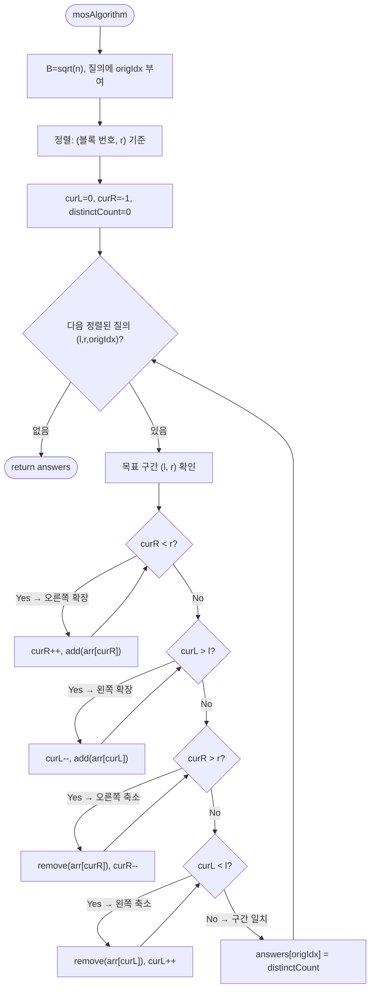

import { AlgorithmSimulation } from "#guide-sim";

# Mo's Algorithm — 질의를 정렬하면 포인터 이동이 √n배 줄어드는 이유

## 한눈에 보는 컨셉

구간 질의가 **미리 전부 주어져 있을 때(오프라인)**, 질의를 영리한 순서로 재배열한 뒤 두 포인터로 구간을 조금씩 늘리고 줄이며 답을 유지하는 기법이에요. 원소 하나를 구간에 넣고 빼는 연산이 `O(1)`이기만 하면, 전체가 `O((n+q)√n)`에 끝납니다. 알고리즘이 하는 일의 본질은 단 하나 — **"질의를 처리하는 순서"를 바꿔서 포인터의 왕복 낭비를 없애는 것**입니다.

## 출발점: 가장 순진한 방법부터

문제를 먼저 정확히 잡을게요.

```ts
function mosAlgorithm(arr: number[], queries: [number, number][]): number[]
```

각 질의 `[l, r]`에 대해 그 구간 안에 **서로 다른 원소가 몇 종류** 있는지(distinct count)를, 질의가 들어온 원래 순서대로 반환합니다. `n`과 `q`는 각각 최대 `10^4`.

가장 정직한 방법은 질의마다 구간을 처음부터 세는 겁니다.

```text
질의마다:  Set을 하나 만들고  l..r 을 순회하며 담는다  →  크기가 답
비용:      질의당 O(n)  ×  q개  =  O(qn) ≈ 10^8        →  시간 초과 위험
```

코드로 그대로 옮기면 이렇습니다.

```ts
function mosAlgorithmNaive(arr: number[], queries: [number, number][]): number[] {
  return queries.map(([l, r]) => {
    const seen = new Set<number>();
    for (let i = l; i <= r; i++) seen.add(arr[i]); // 구간을 매번 처음부터 순회
    return seen.size;
  });
}
```

왜 이게 느린가: 질의마다 구간 `[l, r]`을 처음부터 끝까지 다시 순회해 `Set`을 새로 채우므로, 질의당 `O(n)`이 `q`번 반복되어 총 `O(qn)`입니다.

"구간 합이면 접두사 합으로 전처리하면 되잖아?"라는 생각이 자연스럽게 들 텐데, 여기서 첫 번째 벽을 만납니다. **distinct count는 접두사로 분해되지 않아요.**

```text
arr = [1, 2, 1]

distinct([0..2]) = |{1,2}| = 2
distinct([0..0]) = |{1}|   = 1
차이              = 1        그런데 실제 distinct([1..2]) = |{2,1}| = 2  ✗

두 접두사의 "차"에서는 어떤 원소가 양쪽에 걸쳐 있는지 알 길이 없다
```

그래서 질의마다 새로 세는 수밖에 없어 보입니다. 그런데 나열해 보면 낌새가 하나 보여요. `[1, 4]`를 센 직후에 `[2, 5]`를 **완전히 처음부터** 다시 세는 건 이상합니다 — 두 구간은 대부분 겹치는데 말이죠. **"겹치는 부분의 계산을 버리지 않을 수 없을까?"** 이것이 이번 알고리즘의 출발 단서입니다.

### 순서를 바꾸는 방법은 여럿이다 — 왜 하필 이 기준인가

포인터를 이어 쓰기로 했다면 그다음 물음은 **"어떤 순서로 처리할 것인가"**입니다. 여기서 자연스럽게 떠오르는 후보가 셋 있어요. 전부 실제로 돌려서 **포인터가 움직인 칸 수**(= `add`/`remove` 호출 횟수)를 셌습니다.

```text
arr = [1, 3, 2, 3, 1, 2, 1, 3]  (n = 8, B = ⌊√8⌋ = 2)
질의 4개: [0,7] [5,6] [1,3] [4,7]

정렬 안 함(입력 순서)   [0,7]→[5,6]→[1,3]→[4,7]    28칸
l 오름차순만            [0,7]→[1,3]→[4,7]→[5,6]    22칸
r 오름차순만            [1,3]→[5,6]→[0,7]→[4,7]    22칸
(블록 번호, r) — Mo's   [1,3]→[0,7]→[5,6]→[4,7]    18칸
```

작은 입력에서는 차이가 작아 보이죠. 그런데 이 셋은 **커질수록 갈라집니다.** `n = q`로 두고 무작위 질의를 준 실측입니다.

```text
n = q          정렬 안 함      l만 정렬      r만 정렬       Mo's      Mo's+홀짝
 1,000          534,153       227,056      220,478      40,838      27,354
 4,000        8,341,213     3,513,827    3,546,697     326,993     211,291
16,000      135,933,801    56,861,257   56,999,688   2,671,021   1,702,321

성장률 r = C(4n)/C(n)   ← n을 4배로 키우면 비용이 몇 배가 되는가
 정렬 안 함    15.62, 16.30      r ≈ 16 = 4²  →  O(n²)
 l만 정렬      15.48, 16.18      r ≈ 16       →  O(n²)
 r만 정렬      16.09, 16.07      r ≈ 16       →  O(n²)
 Mo's           8.01,  8.17      r ≈ 8  = 4^1.5 →  O(n^1.5) = O(n√n)
 Mo's+홀짝      7.72,  8.06      r ≈ 8        →  O(n√n)
```

`l`만 정렬하면 왜 지는지 손으로 짚으면 이렇습니다. `l`이 오름차순이니 `curL`은 얌전히 전진하는데, **`r`에 아무 제약이 없어 `curR`이 매 질의마다 배열을 통째로 왕복**합니다. `r`만 정렬하면 정확히 반대로 `curR`은 단조 전진하지만 `curL`이 날뜁니다. **한쪽을 재우면 다른 쪽이 깨어나요** — 두 포인터를 동시에 묶는 기준이 필요하다는 뜻입니다.

그러니 이 알고리즘이 실제로 푸는 문제는 *"어떻게 세는가"* 가 아니라 **"두 포인터를 동시에 재우는 처리 순서가 있는가"** 입니다. `l`만·`r`만이 각각 절반씩 성공했다는 사실이 다음 절의 출발점이에요.

## 아이디어 자세히 들여다보기

### 구간을 버리지 않고 옮기기 — 수식과 그림

현재 세어 둔 구간 `[curL, curR]`을 버리지 말고, 다음 질의 구간까지 **한 칸씩 옮겨** 봅시다. 상태로 두 가지를 유지합니다.

- `freq[x]` — 현재 구간 안에서 원소 `x`가 등장한 횟수
- `distinctCount` — 현재 구간의 distinct 원소 수

한 칸 이동은 원소 하나를 넣거나(`add`) 빼는(`remove`) 일이고, 각각 `O(1)`에 답을 갱신할 수 있어요.

$$\text{add}(x):\;\; \text{freq}[x] \mathrel{+}= 1,\quad \text{freq}[x] = 1 \text{이 되면 } \text{distinctCount} \mathrel{+}= 1$$

$$\text{remove}(x):\;\; \text{freq}[x] \mathrel{-}= 1,\quad \text{freq}[x] = 0 \text{이 되면 } \text{distinctCount} \mathrel{-}= 1$$

**왜 `freq`가 필요할까요? distinct만 세려면 "있다/없다" 한 비트면 될 것 같은데요.** 빼는 쪽을 생각하면 답이 나옵니다. `arr = [1, 3, 1]`에서 `1`을 하나 지웠을 때 distinct가 줄어야 하는지 아닌지는, **`1`이 아직 남아 있는지**를 알아야 결정됩니다. 한 비트로는 "몇 개 남았는지"를 모르니 판단이 안 서요. 그래서 상태를 **횟수**로 잡고, distinct는 그 횟수가 $0 \leftrightarrow 1$ 경계를 넘을 때만 움직입니다.

그림으로 보면 이렇습니다.

```text
arr:     1    3    2    3    1    2
             [curL=1 -------- curR=4]      distinctCount = 3

다음 질의가 [2, 5]라면:

  add(arr[5]=2)    : freq[2] 1→2, 원래 있던 값   → distinct 그대로
  remove(arr[1]=3) : freq[3] 2→1, 아직 남아 있음 → distinct 그대로

arr:     1    3    2    3    1    2
                  [curL=2 -------- curR=5]  이동 2칸으로 끝 (다시 세지 않음)
```

**손으로 한 번 해 보세요.** 위 그림의 상태에서 다음 질의가 `[2, 3]`이라면 `curR`을 5에서 3까지 줄여야 합니다. `remove(arr[5]=2)`와 `remove(arr[4]=1)` 중 **distinctCount를 실제로 줄이는 것은 어느 쪽일까요?** (`freq[2]`는 2였다가 1이 되고, `freq[1]`은 1이었다가 0이 됩니다 — 경계를 넘는 쪽은 후자예요.)

그런데 이 방법만으로는 부족합니다. **질의가 주어진 순서 그대로** 처리하면, 심술궂은 입력에서 포인터가 배열을 통째로 왕복해요.

```text
질의 순서:  [0, n-1] → [0, 0] → [0, n-1] → [0, 0] → ...
curR 이동:      n칸  ←  n칸  →   n칸  ←  n칸       질의당 O(n), 총 O(qn)
```

포인터를 유지하는 아이디어 자체는 좋은데, **처리 순서가 나쁘면 아무 소용이 없다** — 앞 절의 실측이 이걸 수치로 보여 준 것이고, 이것이 두 번째 단서입니다.

### 단서를 설명해 주는 이론 — 오프라인 처리와 평방 분할

두 번째 단서를 해소하는 재료는 이미 이론화되어 있습니다. 두 가지를 조합해요.

**오프라인 처리(offline processing)**: 질의가 미리 전부 주어져 있다면, 굳이 들어온 순서대로 처리할 의무가 없습니다. **우리가 유리한 순서로 재배열해서 처리하고, 답만 원래 순서로 되돌려 놓으면** 돼요. "순서를 바꿀 자유"가 생기는 순간, 문제는 "포인터 총 이동량을 최소화하는 처리 순서 찾기"로 바뀝니다.

**평방 분할(sqrt decomposition)**: 배열을 크기 $B$짜리 블록으로 잘라, "블록 안에서의 작은 비용"과 "블록을 건너는 큰 비용"의 균형을 맞추는 설계 기법입니다. Mo's algorithm은 이 기법을 **질의 정렬 기준**에 적용합니다.

$$B = \lfloor\sqrt{n}\rfloor, \qquad \text{정렬 키} = \left(\left\lfloor \frac{l}{B} \right\rfloor,\; r\right)$$

즉 1차 기준은 "`l`이 속한 블록 번호", 2차 기준은 "`r` 오름차순"입니다. 앞 절에서 `l`만·`r`만 정렬이 각각 절반씩 성공했던 것을 떠올리면, 이 키가 하는 일이 보여요 — **1차 기준이 `curL`을 블록 폭 안에 가두고, 2차 기준이 그 안에서 `curR`을 단조 전진시킵니다.** 두 포인터를 동시에 묶는 기준이 이것입니다.

```text
n = 6, B = ⌊√6⌋ = 2  →  블록:  | 0 1 | 2 3 | 4 5 |
                                 블록0  블록1  블록2

이 정렬이 만드는 포인터 이동의 상한:

curR:  같은 블록 안에서는 r이 오름차순 → 뒤로 되돌아가지 않는다
       블록 하나를 처리하는 동안 curR 이동 ≤ n
       블록이 √n개               →  총 O(n·√n)

curL:  같은 블록 안에서는 l이 블록 폭 B 안에서만 오간다 → 질의당 ≤ B
       블록이 바뀌는 순간도 ≤ 2B
       질의가 q개                →  총 O(q·B) = O(q·√n)

합계:  O((n + q)√n)      n = q = 10^4이면 ≈ 2×10^6  ✓
```

**왜 하필 √n일까요?** 블록 크기 $B$를 변수로 두고 비용을 보면, `curR` 쪽은 블록 수에 비례해 $O(n \cdot n/B) = O(n^2/B)$, `curL` 쪽은 $O(qB)$입니다. 여기서 `curR`의 $O(n^2/B)$에는 같은 블록 안의 단조 전진뿐 아니라 **블록이 바뀌는 순간 `curR`이 최대 $n$칸 후진하는 비용**도 포함돼요(블록마다 한 번, 블록이 $n/B$개). 뒤에서 볼 홀짝 정렬 트릭이 손대는 대상이 바로 이 블록 경계의 후진이라는 점을 기억해 두세요.

$B$를 키우면 앞이 줄고 뒤가 늘어나는 **시소 관계**이므로, 두 비용이 같아지는 지점이 최선이에요. 일반적으로 $n^2/B = qB$를 풀면 $B \approx n/\sqrt{q}$이고 이때 전체는 $O(n\sqrt{q})$입니다. $n \approx q$인 경우 이 값이 $B = \sqrt{n}$, 전체 $O((n+q)\sqrt{n})$으로 정리돼요 — 즉 $B=\sqrt{n}$은 $q = \Theta(n)$일 때의 선택입니다. **이 가이드는 $n, q \le 10^4$이고 $q$가 $n$과 비슷한 규모라고 전제**하므로 $B=\sqrt{n}$을 씁니다. 이 "**두 비용을 같게 만드는 블록 크기 고르기**"가 평방 분할 계열 전체를 관통하는 사고방식이니 기억해 두세요.

한 가지 더 — 위 $O((n+q)\sqrt{n})$은 **포인터 이동 비용**만 센 값입니다. 정확히는 질의를 정렬하는 $O(q \log q)$가 앞에 붙어 전체는 $O(q \log q + (n+q)\sqrt{n})$이고, 통상 $\sqrt{n}$ 항이 지배해 흔히 생략됩니다. 또 `freq`에 쓰는 `Map` 갱신은 **기대 `O(1)`**일 뿐 최악을 보장하지는 않아요(해시 충돌이 몰리면 느려질 수 있습니다). 값 범위가 좁아 좌표 압축 후 배열을 쓰면 최악까지 `O(1)`로 조일 수 있습니다.

### 셈을 맡는 자료구조 — 빈도표

상태 `freq`는 "원소 값 → 등장 횟수"의 대응이 필요합니다. 원소 값의 범위가 정수 전체라 배열 인덱스로 바로 쓸 수 없으므로 해시 맵(`Map`)을 사용해요(값 범위가 좁다면 좌표 압축 후 배열도 가능합니다). 해시 맵 자체가 궁금하다면 이 프로젝트의 [hashMapChaining 가이드](../../../data-structures/hash/hashMapChaining/hashMapChaining-guide.mdx)를 참고하세요 — 여기서는 "평균 `O(1)`로 읽고 쓰는 빈도표"로만 쓰면 충분합니다.

### 왜 모순 없이 작동하는가

이 알고리즘이 지키는 약속(불변식)은 하나입니다.

> 질의에 답하는 시점마다 `freq`와 `distinctCount`는 현재 구간 `[curL, curR]`의 실제 상태와 정확히 일치한다.

정식으로 쓰면 다음과 같습니다.

$$\text{freq}[v] = \big|\{\, i \in [\text{curL}, \text{curR}] : arr[i] = v \,\}\big|, \qquad \text{distinctCount} = \big|\{\, v : \text{freq}[v] > 0 \,\}\big|$$

$\text{freq}[v]$는 현재 구간 안에서 값 $v$가 등장한 횟수를 정확히 세는 함수이고, $\text{distinctCount}$는 그중 빈도가 양수인 값의 개수(즉 구간에 실제로 존재하는 서로 다른 값의 수)입니다.

이것이 항상 성립함을 **귀납으로** 확인해 볼게요.

**기저**: 시작 상태는 `curL = 0`, `curR = -1`입니다. 구간 $[0, -1]$은 빈 구간이므로 모든 $v$에 대해 $\text{freq}[v] = 0$이어야 하는데, `freq`가 비어 있으니 참입니다. 빈 구간의 distinct는 0이고 `distinctCount = 0`으로 시작하니 이것도 참이에요.

**귀납 가정**: 어떤 시점에 `freq`와 `distinctCount`가 현재 구간 `[curL, curR]`에 대해 위 두 식을 만족한다고 합시다.

**귀납 단계**: 구간이 변하는 통로는 `add`와 `remove` 둘뿐이고, 각각 **한 칸씩만** 움직입니다. 그러니 두 경우만 따지면 충분해요 — 이것이 경우의 완전성입니다.

- `add(x)`로 구간이 한 칸 넓어진 경우. 구간에 $x$가 하나 늘었으므로 $\text{freq}[x]$가 1 커지는 것이 맞습니다. distinct는 어떨까요? 갱신 후 $\text{freq}[x] = 1$이라면 갱신 전은 0, 즉 $x$는 **구간에 없다가 방금 처음 들어온** 값이니 distinct가 1 늘어야 합니다. 갱신 후 $\text{freq}[x] \ge 2$라면 갱신 전에도 1 이상이었으므로 $x$는 이미 구간에 있었고, "있는 값의 개수"는 변하지 않습니다. 두 경우 모두 코드의 `if (f === 1) distinctCount++`와 일치해요.
- `remove(x)`로 구간이 한 칸 좁아진 경우. 대칭입니다. 갱신 후 $\text{freq}[x] = 0$이면 $x$가 구간에서 **완전히 사라진** 것이니 distinct가 1 줄어야 하고, 갱신 후 $\text{freq}[x] \ge 1$이면 아직 남아 있으므로 그대로입니다.

두 경우 다 갱신 후에도 두 식이 성립하므로, 불변식은 모든 이동을 거쳐 유지됩니다. 논증의 핵심은 하나로 압축돼요 — **distinct가 변하는 경계는 정확히 $0 \leftrightarrow 1$ 순간뿐이고, `add`/`remove`가 한 번에 한 칸만 움직이므로 그 경계를 건너뛸 수 없다.**

여기서 **헷갈리기 쉬운 포인트**가 둘 있습니다.

**첫째, 이동 순서 — 확장을 먼저, 축소를 나중에.** 네 개의 while 루프를 확장 둘·축소 둘 순으로 두면 구간이 중간에 비지 않습니다.

```text
현재 [3, 5], 목표 [0, 1]

확장부터 하면:  curL: 3 → 0 먼저 (구간이 커지기만 함) → 그다음 curR: 5 → 1
                구간이 빈 적이 없어 위 불변식이 매 순간 성립  ✓

축소부터 하면:  curL을 먼저 밀어 curL > curR 인 순간이 생긴다
                이때 remove 는 구간 밖 원소를 빼고, freq 가 음수로 내려간다
```

음수가 실제로 나는지 돌려서 확인했습니다. `arr = [1,2,3,4,5,6]`에 질의 `[3,5]`·`[0,1]`을 주면 처리 순서가 `[0,1] → [3,5]`가 되는데, 축소 먼저로 두면 `remove(arr[2]=3)`이 구간 `[2,1]`(빈 구간)에서 호출되어 **`freq[3] = -1`** 이 됩니다.

**그런데 이 문제에서는 답이 틀리지 않습니다.** 축소 먼저 버전으로 무작위 입력 40만 건을 돌려 정답과 대조했지만 반례가 나오지 않았어요. 이유는 위 귀납 논증 안에 있습니다 — distinct는 $0 \leftrightarrow 1$ 경계만 보는데, 음수로 내려간 값은 나중에 확장 루프가 다시 올려 주므로 **질의에 답하는 시점에는 오차가 상쇄**됩니다. 불변식이 깨지는 것은 **중간 상태**뿐이에요.

그러면 왜 확장 먼저를 쓸까요. **`add`/`remove`를 다른 질의로 갈아 끼울 때 중간 상태의 불변식이 필요하기 때문**입니다. 이 틀의 값어치는 "distinct 대신 최빈값·쌍의 개수를 넣어도 그대로 돌아간다"는 데 있는데, $\text{freq}$ 값 자체를 읽는 확장에서는 음수 상태가 그대로 답에 새어 나옵니다. 지금 문제에서 우연히 살아남는다고 순서를 바꾸면, **틀은 그대로인데 다른 질의에서만 터지는** 코드가 됩니다. 초기 상태를 `curL = 0, curR = -1`로 두는 것도 같은 이유예요 — 첫 질의에서 확장 루프가 먼저 돌며 자연스럽게 구간이 만들어집니다.

**둘째, 답은 원래 순서로 되돌려 놓아야 합니다.** 질의를 재배열했으므로, 각 질의에 원래 인덱스 `origIdx`를 붙여 두고 `answers[origIdx]`에 저장해야 해요. 정렬된 순서대로 `answers`를 채우면 반환 순서가 뒤섞입니다. 이쪽은 **실제로 답이 틀리고**, 구체적인 값은 구현 절에서 보겠습니다.

엣지 케이스도 불변식 위에서 확인해 두면:

```text
l == r 인 질의        → 원소 1개, distinct = 1
모든 원소가 같은 배열 → 어떤 질의든 distinct = 1
queries가 빈 배열     → 루프가 돌지 않고 빈 배열 반환
같은 구간이 반복 질의 → 정렬 후 인접하므로 포인터 이동 0칸에 답만 복사
```

## 아이디어를 코드로 옮기기

```ts
function mosAlgorithm(arr: number[], queries: [number, number][]): number[] {
  const n = arr.length;
  const q = queries.length;
  const B = Math.max(1, Math.floor(Math.sqrt(n))); // n=0 보호 (⌊√0⌋=0 → 0-나눗셈 방지)

  const indexed = queries.map(([l, r], i) => ({ l, r, i }));
  indexed.sort((a, b) => {
    const blockA = Math.floor(a.l / B);
    const blockB = Math.floor(b.l / B);
    if (blockA !== blockB) return blockA - blockB; // 1차: l의 블록
    return a.r - b.r;                              // 2차: r 오름차순
  });

  const freq = new Map<number, number>();
  let distinctCount = 0;

  const add = (x: number) => {
    const f = (freq.get(x) ?? 0) + 1;
    freq.set(x, f);
    if (f === 1) distinctCount++;
  };
  const remove = (x: number) => {
    const f = (freq.get(x) ?? 0) - 1;
    freq.set(x, f);
    if (f === 0) distinctCount--;
  };

  const answers = new Array<number>(q);
  let curL = 0;
  let curR = -1; // 빈 구간에서 시작

  for (const { l, r, i } of indexed) {
    while (curR < r) { curR++; add(arr[curR]); }    // ① 오른쪽 확장
    while (curL > l) { curL--; add(arr[curL]); }    // ② 왼쪽 확장
    while (curR > r) { remove(arr[curR]); curR--; } // ③ 오른쪽 축소
    while (curL < l) { remove(arr[curL]); curL++; } // ④ 왼쪽 축소
    answers[i] = distinctCount; // 원래 질의 인덱스에 저장
  }

  return answers;
}
```

**가장 중요한 부분은 `answers[i] = distinctCount` 한 줄입니다.** 네 개의 while 루프는 틀리면 값이 눈에 띄게 어긋나는데, 이 줄은 **틀려도 예외가 안 나고 자릿수도 그럴듯해서** 조용히 지나갑니다.

`i`를 빠뜨리고 정렬된 순서대로 `push`하면 어떻게 되는지, 실제로 돌린 값입니다.

```text
arr     = [1, 2, 3, 3, 1, 2, 3]
queries = [[3,6], [0,3], [1,2]]

정답             [3, 3, 2]
push 로 채우면   [2, 3, 3]     ← 예외 없음. 값만 자리를 바꿔 앉았다
```

세 값이 전부 "그럴 법한" 범위라 눈으로는 못 잡습니다. 테스트가 없으면 이 실수는 살아남아요. **`answers`는 정렬된 순서가 아니라 원래 순서를 채운다** — 한 줄로 기억해 두면 됩니다.

그 외에 놓치기 쉬운 지점:

- 확장 두 개가 먼저, 축소 두 개가 나중(①②③④)입니다. 앞 절에서 본 "구간이 비는 순간"을 막는 배치예요.
- `B = max(1, ...)` — `n = 0`이면 `⌊√0⌋`이 0이 되어 `l / B`에서 0으로 나누기가 발생합니다(빈 배열 방어). `max(1, ...)`로 하한을 1로 고정해 막아요.
- `curR++`가 `add`보다 **먼저**(새 칸을 구간에 넣은 뒤 그 값을 세팅), `remove`는 `curR--`보다 **먼저**(빼는 값은 아직 구간에 있는 칸)입니다. 증감과 add/remove의 앞뒤가 네 루프에서 서로 다르다는 점, 직접 손으로 한 번 따라가 보세요.

## 더 빠르게 만들 단서 찾기

블록이 바뀌는 순간의 `curR`을 관찰해 봅시다. 같은 블록 안에서 `r` 오름차순으로 처리하니, 블록이 끝날 무렵 `curR`은 오른쪽 끝 근처까지 가 있어요. 그런데 다음 블록의 첫 질의는 `r`이 작을 수 있습니다.

```text
블록 0 처리:  curR   →→→→→→→→→→  n-1 근처까지 전진
블록 1 시작:  curR   ←←←←←←←←←   작은 r까지 통째로 후진   ← 낭비!
블록 1 처리:  curR   →→→→→→→→→→  다시 전진
```

블록 경계마다 "끝까지 갔다가 처음으로 되돌아오는" 왕복이 생깁니다. 앞서 평방 분할 절에서 $O(n^2/B)$ 안에 **블록 경계의 후진 비용**이 포함된다고 했던 바로 그 항이에요. 복잡도 상한 안에 있긴 하지만, 실측 시간을 갉아먹는 뚜렷한 낭비 패턴입니다.

## 단서를 최적화로 연결하기

후진이 낭비라면, **다음 블록은 아예 내림차순으로 처리해서 후진 자체를 활용**하면 됩니다. 짝수 번째 블록은 `r` 오름차순, 홀수 번째 블록은 `r` 내림차순 — `curR`이 톱니처럼 지그재그로 움직이게 만드는 겁니다.

```text
                블록0        블록1        블록2
curR 이동:   →→→→→→→→↘                 ↗→→→→→→
                        ←←←←←←←←(내림차순)
             전진해 둔 위치에서 그대로 이어받는다 — 블록 경계의 큰 왕복을 줄인다
```

이를 **홀짝 정렬 트릭(odd-even trick)**이라고 부릅니다. 점근 복잡도는 그대로 `O((n+q)√n)`이지만, 블록 경계에서 벌어지던 큰 왕복을 줄여 `curR` 이동의 상수항을 낮추는 **휴리스틱**이에요. 앞 절 실측 표의 마지막 두 열이 이 효과입니다 — `n = 16,000`에서 2,671,021칸이 1,702,321칸으로 약 **36% 줄었고**, 성장률은 `r ≈ 8`로 그대로입니다(점근은 안 바뀌고 상수만 줄었다는 뜻이에요). 효과의 크기는 질의 분포와 구현에 따라 달라집니다.

## 최적화 코드

바뀌는 곳은 **정렬 비교 함수 한 곳**뿐입니다.

```ts
indexed.sort((a, b) => {
  const blockA = Math.floor(a.l / B);
  const blockB = Math.floor(b.l / B);
  if (blockA !== blockB) return blockA - blockB;
  return blockA % 2 === 0
    ? a.r - b.r  // 짝수 블록: r 오름차순
    : b.r - a.r; // 홀수 블록: r 내림차순
});
```

**가장 중요한 줄은 `blockA % 2` 로 갈라지는 삼항 연산자입니다.** 여기서 홀짝을 `blockA`가 아니라 `a.l`이나 `a.r`로 판단하는 실수가 잦아요. 그러면 **같은 블록 안에서 질의마다 정렬 방향이 뒤바뀝니다.**

이 실수는 답을 틀리게 만들지 않습니다 — 어떤 순서로 처리하든 각 질의의 구간은 정확히 맞춰지니까요. 대신 **`curR`이 블록 안에서 매번 앞뒤로 튀어** 단조 전진이 깨지고, 복잡도 논증의 "블록 하나당 `curR` 이동 ≤ n"이 무너집니다. 답은 맞는데 느려지는, 테스트로는 안 잡히는 종류의 버그예요. **홀짝은 질의가 아니라 블록의 성질이다** — 이렇게 기억하면 헷갈리지 않습니다.

주의할 점 하나 더 — 내림차순 블록에서도 네 while 루프는 그대로 동작합니다. `curR > r`이면 축소 루프가 알아서 처리하니 본문 코드는 손댈 필요가 없어요.

홀짝 정렬까지 적용한 지금, 앞서 평방 분할 절에서 세운 목표 $O((n+q)\sqrt{n})$을 그대로 달성했습니다 — $n=q=10^4$ 기준 애초 목표였던 약 200만 회 규모의 add/remove 포인터 이동 상한 안에 들어오고(정렬 비용 $O(q\log q)$는 이 항에 지배되어 별도), 홀짝 트릭은 이 점근 상한을 유지한 채 실측 상수만 줄인 것입니다.

더 최적화할 여지가 있을까요? Mo's algorithm 자체로는 여기가 사실상 끝입니다(블록 크기 미세 조정 정도). 참고로 "구간 distinct count"라는 **이 특정 문제**에는 오프라인 스윕 + Fenwick Tree로 `O((n+q) log n)`을 내는 특화 해법도 존재합니다. 그럼에도 Mo's를 배우는 이유는 **범용성**이에요 — add/remove만 `O(1)`로 정의할 수 있으면 구간 최빈값, 구간 내 쌍의 개수처럼 접두사로 분해되지 않는 온갖 질의에 같은 틀을 재사용할 수 있습니다. 앞 절에서 "축소 먼저로 바꾸면 지금은 살아남아도 다른 질의에서 터진다"고 한 것이 정확히 이 재사용을 지키기 위한 이야기였어요.

## 실행 시각화

입력 `arr = [1, 3, 2, 3, 1, 2]`, `queries = [[1,4], [0,2], [2,5]]`에 대한 진행 과정입니다. 블록 크기 `B = ⌊√6⌋ = 2`이고, 질의는 `(블록 번호, r)` 기준으로 `[0,2](orig 1) → [1,4](orig 0) → [2,5](orig 2)` 순서로 재배열됩니다. array 패널의 `pointers`는 `curL`/`curR`, 회색(`marked`)은 현재 활성 구간이에요. 최종 반환값은 원래 질의 순서로 `[3, 3, 3]`이며 마지막 프레임과 일치합니다.

> 대화형 시뮬레이션은 MDX 런타임에서 표시됩니다.

export const A = [1, 3, 2, 3, 1, 2];

export const steps = [
  {
    title: "초기화 / 정렬",
    detail: "B=2. 정렬된 순서: [0,2], [1,4], [2,5]. curL=0, curR=-1, distinctCount=0.",
    array: A,
    pointers: { curL: 0 },
    entries: [
      { label: "정렬 순서", value: "[0,2],[1,4],[2,5]" },
      { label: "distinctCount", value: 0 },
      { label: "answers", value: "[_, _, _]" },
    ],
  },
  {
    title: "질의 [0,2] (orig 1): curR 확장",
    detail: "add 1,3,2 → freq 각 1. distinctCount=3. 구간 {1,3,2}.",
    array: A,
    pointers: { curL: 0, curR: 2 },
    marked: [0, 1, 2],
    entries: [
      { label: "구간", value: "[0,2] = {1,3,2}" },
      { label: "distinctCount", value: 3 },
      { label: "answers[1]", value: 3 },
    ],
  },
  {
    title: "질의 [1,4] (orig 0): curR 확장",
    detail: "add arr[3]=3(freq2), arr[4]=1(freq2) → 중복, distinctCount 유지 3.",
    array: A,
    pointers: { curL: 0, curR: 4 },
    marked: [0, 1, 2, 3, 4],
    entries: [
      { label: "add", value: "3→freq2, 1→freq2 (중복)" },
      { label: "distinctCount", value: 3 },
    ],
  },
  {
    title: "질의 [1,4] (orig 0): curL 축소",
    detail: "remove arr[0]=1 (freq 2→1) → 여전히 존재, distinctCount 유지. curL=1. 구간 {3,2,1}.",
    array: A,
    pointers: { curL: 1, curR: 4 },
    marked: [1, 2, 3, 4],
    entries: [
      { label: "구간", value: "[1,4] = {3,2,1}" },
      { label: "distinctCount", value: 3 },
      { label: "answers[0]", value: 3 },
    ],
  },
  {
    title: "질의 [2,5] (orig 2): curR 확장",
    detail: "add arr[5]=2 (freq 1→2 중복) → distinctCount 유지 3.",
    array: A,
    pointers: { curL: 1, curR: 5 },
    marked: [1, 2, 3, 4, 5],
    entries: [
      { label: "add", value: "2→freq2 (중복)" },
      { label: "distinctCount", value: 3 },
    ],
  },
  {
    title: "질의 [2,5] (orig 2): curL 축소",
    detail: "remove arr[1]=3 (freq 2→1) → 여전히 존재. curL=2. 구간 {2,3,1}.",
    array: A,
    pointers: { curL: 2, curR: 5 },
    marked: [2, 3, 4, 5],
    entries: [
      { label: "구간", value: "[2,5] = {2,3,1}" },
      { label: "distinctCount", value: 3 },
      { label: "answers[2]", value: 3 },
    ],
  },
  {
    title: "완료: answers = [3, 3, 3]",
    detail: "모든 질의 처리 종료. 원래 질의 순서로 복원된 distinct count.",
    array: A,
    entries: [
      { label: "answers (orig 순서)", value: "[3, 3, 3]" },
    ],
  },
];

<AlgorithmSimulation view={["array", "keyValue"]} steps={steps} title="Mo's Algorithm: arr=[1,3,2,3,1,2]" />

## 흐름 한눈에 보기



## 스스로 점검하기

1. `arr = [5, 5, 5, 5]`, `queries = [[0,3], [1,2]]`일 때 정렬 후 처리 순서를 적고, 각 질의의 결과값(distinctCount)을 손으로 구해 보세요. (모든 원소가 같으므로 두 질의 모두 distinct = 1입니다. 참고로 정렬 처리 순서는 `[1,2] → [0,3]`이고, 이때 포인터 이동 칸 수는 각각 4칸·2칸으로 결과값과는 별개예요.)
2. 본문은 `l`만 정렬하는 방식이 `O(n²)`으로 지는 이유를 "`curR`이 매 질의마다 배열을 왕복하기 때문"이라고 했습니다. 그렇다면 **`l`만 정렬하되 같은 `l` 안에서는 `r` 오름차순**으로 2차 기준을 주면 어떨까요? 이것으로 `curR`의 왕복이 사라지는지, 사라지지 않는다면 어떤 질의 분포에서 여전히 무너지는지 따져 보세요. (힌트: 2차 기준은 1차 키가 **정확히 같을 때만** 발동합니다. `l`이 서로 다른 질의 사이에서는 몇 번 발동할까요? 이 물음의 답이 곧 "왜 `l` 자체가 아니라 `l`이 속한 **블록**으로 묶는가"의 답입니다.)
3. 본문은 "축소 먼저로 바꿔도 이 문제에서는 답이 틀리지 않는다"고 하면서도 확장 먼저를 씁니다. `add`/`remove`를 **구간 최빈값의 등장 횟수**를 유지하도록 바꾼다면(힌트: `freq`의 빈도별 개수를 함께 들고 다닙니다), 축소 먼저 순서에서 `freq`가 음수로 내려간 중간 상태가 왜 이번에는 답에까지 새어 나오는지 설명해 보세요.
