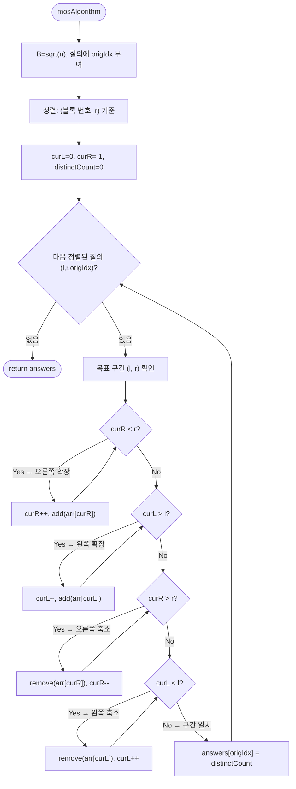

import { AlgorithmSimulation } from "#guide-sim";

# Mo's Algorithm — 질의를 정렬하면 포인터 이동이 √n배 줄어드는 이유

## 한눈에 보는 컨셉

구간 질의가 **미리 전부 주어져 있을 때(오프라인)**, 질의를 영리한 순서로 재배열한 뒤 두 포인터로 구간을 조금씩 늘리고 줄이며 답을 유지하는 기법이에요. 원소 하나를 구간에 넣고 빼는 연산이 `O(1)`이기만 하면, 전체가 `O((n+q)√n)`에 끝납니다. 알고리즘이 하는 일의 본질은 단 하나 — **"질의를 처리하는 순서"를 바꿔서 포인터의 왕복 낭비를 없애는 것**입니다.

## 출발점: 가장 순진한 방법부터

문제를 먼저 정확히 잡을게요.

```ts
function mosAlgorithm(arr: number[], queries: [number, number][]): number[]
```

각 질의 `[l, r]`에 대해 그 구간 안에 **서로 다른 원소가 몇 종류** 있는지(distinct count)를, 질의가 들어온 원래 순서대로 반환합니다. `n`과 `q`는 각각 최대 `10^4`.

가장 정직한 방법은 질의마다 구간을 처음부터 세는 겁니다.

```text
질의마다:  Set을 하나 만들고  l..r 을 순회하며 담는다  →  크기가 답
비용:      질의당 O(n)  ×  q개  =  O(qn) ≈ 10^8        →  시간 초과 위험
```

"구간 합이면 접두사 합으로 전처리하면 되잖아?"라는 생각이 자연스럽게 들 텐데, 여기서 첫 번째 벽을 만납니다. **distinct count는 접두사로 분해되지 않아요.**

```text
arr = [1, 2, 1]

distinct([0..2]) = |{1,2}| = 2
distinct([0..0]) = |{1}|   = 1
차이              = 1        그런데 실제 distinct([1..2]) = |{2,1}| = 2  ✗

두 접두사의 "차"에서는 어떤 원소가 양쪽에 걸쳐 있는지 알 길이 없다
```

그래서 질의마다 새로 세는 수밖에 없어 보입니다. 그런데 나열해 보면 낌새가 하나 보여요. `[1, 4]`를 센 직후에 `[2, 5]`를 **완전히 처음부터** 다시 세는 건 이상합니다 — 두 구간은 대부분 겹치는데 말이죠. **"겹치는 부분의 계산을 버리지 않을 수 없을까?"** 이것이 이번 알고리즘의 출발 단서입니다.

## 아이디어 자세히 들여다보기

### 구간을 버리지 않고 옮기기 — 두 포인터와 add/remove

현재 세어 둔 구간 `[curL, curR]`을 버리지 말고, 다음 질의 구간까지 **한 칸씩 옮겨** 봅시다. 상태로 두 가지를 유지합니다.

- `freq[x]` — 현재 구간 안에서 원소 `x`가 등장한 횟수
- `distinctCount` — 현재 구간의 distinct 원소 수

한 칸 이동은 원소 하나를 넣거나(`add`) 빼는(`remove`) 일이고, 각각 `O(1)`에 답을 갱신할 수 있어요.

$$\text{add}(x):\;\; \text{freq}[x] \mathrel{+}= 1,\quad \text{freq}[x] = 1 \text{이 되면 } \text{distinctCount} \mathrel{+}= 1$$

$$\text{remove}(x):\;\; \text{freq}[x] \mathrel{-}= 1,\quad \text{freq}[x] = 0 \text{이 되면 } \text{distinctCount} \mathrel{-}= 1$$

그림으로 보면 이렇습니다.

```text
arr:     1    3    2    3    1    2
             [curL=1 -------- curR=4]      distinctCount = 3

다음 질의가 [2, 5]라면:

  add(arr[5]=2)    : freq[2] 1→2, 원래 있던 값   → distinct 그대로
  remove(arr[1]=3) : freq[3] 2→1, 아직 남아 있음 → distinct 그대로

arr:     1    3    2    3    1    2
                  [curL=2 -------- curR=5]  이동 2칸으로 끝 (다시 세지 않음)
```

그런데 이 방법만으로는 부족합니다. **질의가 주어진 순서 그대로** 처리하면, 심술궂은 입력에서 포인터가 배열을 통째로 왕복해요.

```text
질의 순서:  [0, n-1] → [0, 0] → [0, n-1] → [0, 0] → ...
curR 이동:      n칸  ←  n칸  →   n칸  ←  n칸       질의당 O(n), 총 O(qn)
```

포인터를 유지하는 아이디어 자체는 좋은데, **처리 순서가 나쁘면 아무 소용이 없다** — 이것이 두 번째 단서입니다.

### 단서를 설명해 주는 이론 — 오프라인 처리와 평방 분할

두 번째 단서를 해소하는 재료는 이미 이론화되어 있습니다. 두 가지를 조합해요.

**오프라인 처리(offline processing)**: 질의가 미리 전부 주어져 있다면, 굳이 들어온 순서대로 처리할 의무가 없습니다. **우리가 유리한 순서로 재배열해서 처리하고, 답만 원래 순서로 되돌려 놓으면** 돼요. "순서를 바꿀 자유"가 생기는 순간, 문제는 "포인터 총 이동량을 최소화하는 처리 순서 찾기"로 바뀝니다.

**평방 분할(sqrt decomposition)**: 배열을 크기 $B$짜리 블록으로 잘라, "블록 안에서의 작은 비용"과 "블록을 건너는 큰 비용"의 균형을 맞추는 설계 기법입니다. Mo's algorithm은 이 기법을 **질의 정렬 기준**에 적용합니다.

$$B = \lfloor\sqrt{n}\rfloor, \qquad \text{정렬 키} = \left(\left\lfloor \frac{l}{B} \right\rfloor,\; r\right)$$

즉 1차 기준은 "`l`이 속한 블록 번호", 2차 기준은 "`r` 오름차순"입니다.

```text
n = 6, B = ⌊√6⌋ = 2  →  블록:  | 0 1 | 2 3 | 4 5 |
                                 블록0  블록1  블록2

이 정렬이 만드는 포인터 이동의 상한:

curR:  같은 블록 안에서는 r이 오름차순 → 뒤로 되돌아가지 않는다
       블록 하나를 처리하는 동안 curR 이동 ≤ n
       블록이 √n개               →  총 O(n·√n)

curL:  같은 블록 안에서는 l이 블록 폭 B 안에서만 오간다 → 질의당 ≤ B
       블록이 바뀌는 순간도 ≤ 2B
       질의가 q개                →  총 O(q·B) = O(q·√n)

합계:  O((n + q)√n)      n = q = 10^4이면 ≈ 2×10^6  ✓
```

**왜 하필 √n일까요?** 블록 크기 $B$를 변수로 두고 비용을 보면, `curR` 쪽은 블록 수에 비례해 $O(n \cdot n/B)$, `curL` 쪽은 $O(qB)$입니다. $B$를 키우면 앞이 줄고 뒤가 늘어나는 **시소 관계**이므로, 두 비용이 같아지는 지점이 최선이에요. $n \approx q$일 때 $n^2/B = qB$를 풀면 $B = \sqrt{n}$ 근방이 나옵니다. 이 "**두 비용을 같게 만드는 블록 크기 고르기**"가 평방 분할 계열 전체를 관통하는 사고방식이니 기억해 두세요.

### 셈을 맡는 자료구조 — 빈도표

상태 `freq`는 "원소 값 → 등장 횟수"의 대응이 필요합니다. 원소 값의 범위가 정수 전체라 배열 인덱스로 바로 쓸 수 없으므로 해시 맵(`Map`)을 사용해요(값 범위가 좁다면 좌표 압축 후 배열도 가능합니다). 해시 맵 자체가 궁금하다면 이 프로젝트의 [hashMapChaining 가이드](../../../data-structures/hash/hashMapChaining/hashMapChaining-guide.mdx)를 참고하세요 — 여기서는 "평균 `O(1)`로 읽고 쓰는 빈도표"로만 쓰면 충분합니다.

### 왜 모순 없이 작동하는가

이 알고리즘이 지키는 약속(불변식)은 하나입니다.

> 어느 시점이든 `freq`와 `distinctCount`는 현재 구간 `[curL, curR]`의 실제 상태와 정확히 일치한다.

**유지되는 이유**: 구간이 변하는 유일한 통로가 `add`/`remove`입니다. `add(x)` 후 `freq[x] = 1`이라면 `x`는 방금 구간에 처음 등장한 것이니 distinct가 1 늘어나는 게 맞고, 그 외에는 이미 있던 값의 중복이 늘었을 뿐입니다. `remove(x)` 후 `freq[x] = 0`이라면 `x`가 구간에서 완전히 사라진 것이니 1 줄이는 게 맞아요. **distinct가 변하는 경계는 정확히 0↔1 순간뿐**이라는 사실이 핵심입니다.

여기서 **헷갈리기 쉬운 포인트**가 둘 있습니다.

- **이동 순서: 확장을 먼저, 축소를 나중에.** 순서를 지키지 않으면 중간에 `curR`이 `curL`보다 작아지는 순간이 생겨, `remove`가 구간에 없는 원소를 빼는(빈도가 음수가 되는) 사고가 날 수 있어요.

```text
현재 [3, 5], 목표 [0, 1]

축소부터 하면:  curR: 5 → 1 로 줄이는 동안 curR < curL(=3) 상태 발생
                이때 remove(arr[2])는 애초에 구간에 없던 원소를 뺀다  ✗

확장부터 하면:  curL: 3 → 0 먼저 (구간이 커지기만 함) → 그다음 curR: 5 → 1
                구간이 빈 적이 없어 항상 안전  ✓
```

  초기 상태를 `curL = 0, curR = -1`(빈 구간)로 두는 것도 같은 이유예요 — 첫 질의에서 확장 루프가 먼저 돌며 자연스럽게 구간이 만들어집니다.

- **답은 원래 순서로 되돌려 놓아야 합니다.** 질의를 재배열했으므로, 각 질의에 원래 인덱스 `origIdx`를 붙여 두고 `answers[origIdx]`에 저장해야 해요. 정렬된 순서대로 `answers`를 채우면 반환 순서가 뒤섞입니다.

엣지 케이스도 불변식 위에서 확인해 두면:

```text
l == r 인 질의        → 원소 1개, distinct = 1
모든 원소가 같은 배열 → 어떤 질의든 distinct = 1
queries가 빈 배열     → 루프가 돌지 않고 빈 배열 반환
같은 구간이 반복 질의 → 정렬 후 인접하므로 포인터 이동 0칸에 답만 복사
```

## 아이디어를 코드로 옮기기

```ts
function mosAlgorithm(arr: number[], queries: [number, number][]): number[] {
  const n = arr.length;
  const q = queries.length;
  const B = Math.max(1, Math.floor(Math.sqrt(n))); // n=0,1 보호

  const indexed = queries.map(([l, r], i) => ({ l, r, i }));
  indexed.sort((a, b) => {
    const blockA = Math.floor(a.l / B);
    const blockB = Math.floor(b.l / B);
    if (blockA !== blockB) return blockA - blockB; // 1차: l의 블록
    return a.r - b.r;                              // 2차: r 오름차순
  });

  const freq = new Map<number, number>();
  let distinctCount = 0;

  const add = (x: number) => {
    const f = (freq.get(x) ?? 0) + 1;
    freq.set(x, f);
    if (f === 1) distinctCount++;
  };
  const remove = (x: number) => {
    const f = (freq.get(x) ?? 0) - 1;
    freq.set(x, f);
    if (f === 0) distinctCount--;
  };

  const answers = new Array<number>(q);
  let curL = 0;
  let curR = -1; // 빈 구간에서 시작

  for (const { l, r, i } of indexed) {
    while (curR < r) { curR++; add(arr[curR]); }    // ① 오른쪽 확장
    while (curL > l) { curL--; add(arr[curL]); }    // ② 왼쪽 확장
    while (curR > r) { remove(arr[curR]); curR--; } // ③ 오른쪽 축소
    while (curL < l) { remove(arr[curL]); curL++; } // ④ 왼쪽 축소
    answers[i] = distinctCount; // 원래 질의 인덱스에 저장
  }

  return answers;
}
```

**가장 중요한 부분은 네 개의 while 루프와 그 순서(①②③④)입니다.** 확장 두 개가 먼저, 축소 두 개가 나중 — 앞 절에서 본 "구간이 비는 순간"을 막는 배치예요. 그 외에 놓치기 쉬운 지점:

- `answers[i]`의 `i`는 **정렬 전의 원래 인덱스**입니다. `indexed`를 만들 때 붙여 둔 값이에요. 이걸 빠뜨리고 순서대로 push하면 조용히 틀립니다.
- `B = max(1, ...)` — `n = 0`이나 `1`이면 `⌊√n⌋`이 0이 되어 0으로 나누기가 발생합니다.
- `curR++`가 `add`보다 **먼저**(새 칸을 구간에 넣은 뒤 그 값을 세팅), `remove`는 `curR--`보다 **먼저**(빼는 값은 아직 구간에 있는 칸)입니다. 증감과 add/remove의 앞뒤가 네 루프에서 서로 다르다는 점, 직접 손으로 한 번 따라가 보세요.

## 더 빠르게 만들 단서 찾기

블록이 바뀌는 순간의 `curR`을 관찰해 봅시다. 같은 블록 안에서 `r` 오름차순으로 처리하니, 블록이 끝날 무렵 `curR`은 오른쪽 끝 근처까지 가 있어요. 그런데 다음 블록의 첫 질의는 `r`이 작을 수 있습니다.

```text
블록 0 처리:  curR   →→→→→→→→→→  n-1 근처까지 전진
블록 1 시작:  curR   ←←←←←←←←←   작은 r까지 통째로 후진   ← 낭비!
블록 1 처리:  curR   →→→→→→→→→→  다시 전진
```

블록 경계마다 "끝까지 갔다가 처음으로 되돌아오는" 왕복이 생깁니다. 복잡도 분석의 상한 안에 있긴 하지만, 실측 시간을 갉아먹는 뚜렷한 낭비 패턴이에요.

## 단서를 최적화로 연결하기

후진이 낭비라면, **다음 블록은 아예 내림차순으로 처리해서 후진 자체를 활용**하면 됩니다. 짝수 번째 블록은 `r` 오름차순, 홀수 번째 블록은 `r` 내림차순 — `curR`이 톱니처럼 지그재그로 움직이게 만드는 겁니다.

```text
                블록0        블록1        블록2
curR 이동:   →→→→→→→→↘                 ↗→→→→→→
                        ←←←←←←←←(내림차순)
             전진해 둔 위치에서 그대로 이어받는다 — 통째 후진이 사라짐
```

이를 **홀짝 정렬 트릭(odd-even trick)**이라고 부릅니다. 점근 복잡도는 그대로 `O((n+q)√n)`이지만, `curR` 이동의 상수가 크게 줄어 실전에서 2배 가까이 빨라지는 경우가 흔해요.

## 최적화 코드

바뀌는 곳은 **정렬 비교 함수 한 곳**뿐입니다.

```ts
indexed.sort((a, b) => {
  const blockA = Math.floor(a.l / B);
  const blockB = Math.floor(b.l / B);
  if (blockA !== blockB) return blockA - blockB;
  return blockA % 2 === 0
    ? a.r - b.r  // 짝수 블록: r 오름차순
    : b.r - a.r; // 홀수 블록: r 내림차순
});
```

주의할 점 하나 — 내림차순 블록에서도 네 while 루프는 그대로 동작합니다. `curR > r`이면 축소 루프가 알아서 처리하니 본문 코드는 손댈 필요가 없어요.

더 최적화할 여지가 있을까요? Mo's algorithm 자체로는 여기가 사실상 끝입니다(블록 크기 미세 조정 정도). 참고로 "구간 distinct count"라는 **이 특정 문제**에는 오프라인 스윕 + Fenwick Tree로 `O((n+q) log n)`을 내는 특화 해법도 존재합니다. 그럼에도 Mo's를 배우는 이유는 **범용성**이에요 — add/remove만 `O(1)`로 정의할 수 있으면 구간 최빈값, 구간 내 쌍의 개수처럼 접두사로 분해되지 않는 온갖 질의에 같은 틀을 재사용할 수 있습니다.

## 실행 시각화

입력 `arr = [1, 3, 2, 3, 1, 2]`, `queries = [[1,4], [0,2], [2,5]]`에 대한 진행 과정입니다. 블록 크기 `B = ⌊√6⌋ = 2`이고, 질의는 `(블록 번호, r)` 기준으로 `[0,2](orig 1) → [1,4](orig 0) → [2,5](orig 2)` 순서로 재배열됩니다. array 패널의 `pointers`는 `curL`/`curR`, 회색(`marked`)은 현재 활성 구간이에요. 최종 반환값은 원래 질의 순서로 `[3, 3, 3]`이며 마지막 프레임과 일치합니다.

> 대화형 시뮬레이션은 MDX 런타임에서 표시됩니다.

export const A = [1, 3, 2, 3, 1, 2];

export const steps = [
  {
    title: "초기화 / 정렬",
    detail: "B=2. 정렬된 순서: [0,2], [1,4], [2,5]. curL=0, curR=-1, distinctCount=0.",
    array: A,
    pointers: { curL: 0 },
    entries: [
      { label: "정렬 순서", value: "[0,2],[1,4],[2,5]" },
      { label: "distinctCount", value: 0 },
      { label: "answers", value: "[_, _, _]" },
    ],
  },
  {
    title: "질의 [0,2] (orig 1): curR 확장",
    detail: "add 1,3,2 → freq 각 1. distinctCount=3. 구간 {1,3,2}.",
    array: A,
    pointers: { curL: 0, curR: 2 },
    marked: [0, 1, 2],
    entries: [
      { label: "구간", value: "[0,2] = {1,3,2}" },
      { label: "distinctCount", value: 3 },
      { label: "answers[1]", value: 3 },
    ],
  },
  {
    title: "질의 [1,4] (orig 0): curR 확장",
    detail: "add arr[3]=3(freq2), arr[4]=1(freq2) → 중복, distinctCount 유지 3.",
    array: A,
    pointers: { curL: 0, curR: 4 },
    marked: [0, 1, 2, 3, 4],
    entries: [
      { label: "add", value: "3→freq2, 1→freq2 (중복)" },
      { label: "distinctCount", value: 3 },
    ],
  },
  {
    title: "질의 [1,4] (orig 0): curL 축소",
    detail: "remove arr[0]=1 (freq 2→1) → 여전히 존재, distinctCount 유지. curL=1. 구간 {3,2,1}.",
    array: A,
    pointers: { curL: 1, curR: 4 },
    marked: [1, 2, 3, 4],
    entries: [
      { label: "구간", value: "[1,4] = {3,2,1}" },
      { label: "distinctCount", value: 3 },
      { label: "answers[0]", value: 3 },
    ],
  },
  {
    title: "질의 [2,5] (orig 2): curR 확장",
    detail: "add arr[5]=2 (freq 1→2 중복) → distinctCount 유지 3.",
    array: A,
    pointers: { curL: 1, curR: 5 },
    marked: [1, 2, 3, 4, 5],
    entries: [
      { label: "add", value: "2→freq2 (중복)" },
      { label: "distinctCount", value: 3 },
    ],
  },
  {
    title: "질의 [2,5] (orig 2): curL 축소",
    detail: "remove arr[1]=3 (freq 2→1) → 여전히 존재. curL=2. 구간 {2,3,1}.",
    array: A,
    pointers: { curL: 2, curR: 5 },
    marked: [2, 3, 4, 5],
    entries: [
      { label: "구간", value: "[2,5] = {2,3,1}" },
      { label: "distinctCount", value: 3 },
      { label: "answers[2]", value: 3 },
    ],
  },
  {
    title: "완료: answers = [3, 3, 3]",
    detail: "모든 질의 처리 종료. 원래 질의 순서로 복원된 distinct count.",
    array: A,
    entries: [
      { label: "answers (orig 순서)", value: "[3, 3, 3]" },
    ],
  },
];

<AlgorithmSimulation view={["array", "keyValue"]} steps={steps} title="Mo's Algorithm: arr=[1,3,2,3,1,2]" />

## 흐름 한눈에 보기



## 스스로 점검하기

1. `arr = [5, 5, 5, 5]`, `queries = [[0,3], [1,2]]`일 때 정렬 후 처리 순서와 각 질의에서의 포인터 이동 칸 수를 손으로 세어 보세요. (답은 둘 다 1이어야 합니다.)
2. 네 while 루프의 순서를 "축소 먼저"로 바꾸면, `[3,5]`에서 `[0,1]`로 이동할 때 정확히 어느 시점에 무엇이 잘못되는지 짚어 보세요.
3. "구간 안 최빈값의 등장 횟수"를 같은 틀로 풀려면 `add`/`remove`에 어떤 상태를 추가해야 할까요? (힌트: `freq`의 빈도별 개수)
