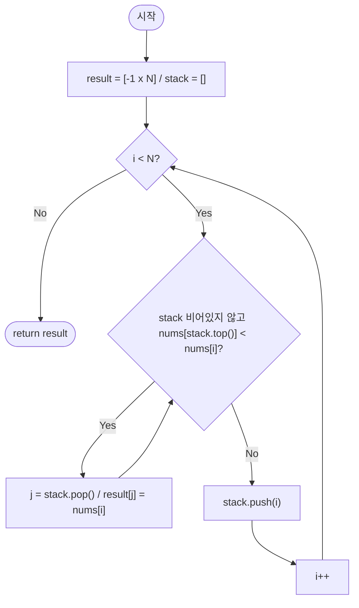

import { AlgorithmSimulation } from "#guide-sim";

# nextGreaterElement — 스택에서 튕겨 나가는 순간이 곧 정답인 이유

## 한눈에 보는 컨셉

각 원소에 대해 "오른쪽에서 처음 만나는 더 큰 값"을 구하는 문제예요. 핵심 관찰은 "아직 답을 못 찾은 인덱스들을 스택에 쌓아 두면, 더 큰 값이 등장하는 바로 그 순간 스택 top부터 차례로 답이 확정된다"는 것입니다. 이 덕분에 각 원소가 스택에 최대 한 번 push, 한 번 pop되는 것만으로 전체를 `O(N)`에 끝낼 수 있어요.

## 출발점: 가장 순진한 방법부터

문제를 먼저 정확히 잡을게요.

```ts
function nextGreaterElement(nums: number[]): number[]
```

- `nums` — 정수 배열. $1 \leq N \leq 100{,}000$, $-10^9 \leq nums[i] \leq 10^9$.
- 반환 — 길이 $N$의 배열. `result[i]`는 `nums[i]`보다 오른쪽에 있는 원소 중 처음으로 **엄격하게** 큰 값이고, 없으면 `-1`이에요. 같은 값은 "더 크다"에 포함되지 않습니다.

"각 원소보다 오른쪽에서 처음 나오는 더 큰 값"이라는 말을 그대로 코드로 옮기면 제일 정직한 방법이 나와요 — 자기 오른쪽을 처음부터 끝까지 훑으며 조건을 만족하는 첫 원소를 찾는 겁니다.

```ts
function nextGreaterElementNaive(nums: number[]): number[] {
  const n = nums.length;
  const result = new Array<number>(n).fill(-1);
  for (let i = 0; i < n; i++) {
    for (let j = i + 1; j < n; j++) {
      if (nums[j]! > nums[i]!) {
        result[i] = nums[j]!;
        break; // 처음 만난 더 큰 값에서 즉시 멈춘다
      }
    }
  }
  return result;
}
```

작은 예로 비용을 체감해 볼게요. `nums = [5, 4, 3, 2, 1]`(단조 감소)이면 어떤 `i`에서도 오른쪽에 더 큰 값이 없어서, 매 위치마다 오른쪽 끝까지 헛수고로 훑습니다.

```text
i=0: j=1,2,3,4 훑고 실패  (4번 비교)
i=1: j=2,3,4   훑고 실패  (3번 비교)
i=2: j=3,4     훑고 실패  (2번 비교)
i=3: j=4       훑고 실패  (1번 비교)
                          -----------
                          총 4+3+2+1 = 10번  ≈ N(N-1)/2

N = 100,000이면 약 5×10^9번 비교 → 시간 제한(보통 1~2초) 초과
```

`i`마다 오른쪽을 처음부터 다시 훑는 게 문제예요. 그런데 자세히 보면, `i=0`에서 훑은 `j=1,2,3,4` 구간과 `i=1`에서 훑는 `j=2,3,4` 구간은 대부분 겹칩니다. **"이전에 이미 본 정보를 버리지 않고 재사용할 수는 없을까?"** — 이것이 이번 알고리즘의 출발 단서예요. 목표는 각 원소를 평균적으로 상수 번만 건드리는 `O(N)`입니다.

## 아이디어 자세히 들여다보기

### 아직 답을 못 찾은 후보들을 쌓아 두기 — 수식과 그림

왼쪽에서 오른쪽으로 한 번만 순회하면서, "아직 자기보다 큰 값을 못 만난 인덱스들"을 스택에 쌓아 둡시다. 새 원소 `nums[i]`가 스택 top의 값보다 크면, top은 방금 자신의 답을 찾은 것이니 pop해서 확정하고, 그다음 top과도 비교를 계속합니다.

$$\text{스택 내 인덱스} \; s_0 < s_1 < \cdots < s_k \;\; \text{에 대해} \;\; nums[s_0] \geq nums[s_1] \geq \cdots \geq nums[s_k]$$

즉 스택은 항상 "아래에서 위로 값이 단조 감소"하는 상태를 유지해요. 그림으로 보면 이렇습니다.

```text
nums = [2, 1, 2, 4, 3]
                     idx: 0  1  2  3  4
                     val: 2  1  2  4  3

i=2까지 순회한 시점의 스택(인덱스, 아래→위):

  top → [ 2 ]  nums[2]=2
        [ 0 ]  nums[0]=2
                └─ 아래에서 위로 2 ≥ 2, 단조 감소 유지
```

**왜 하필 "단조 감소"여야 할까요?** 만약 스택을 단조 증가로 유지한다면, top이 현재 값보다 작아지는 경우가 거의 항상 발생해서 pop 조건 자체가 무의미해져요. 단조 감소를 유지해야만, "현재 값이 top보다 크다"는 단 하나의 조건만 확인해도 됩니다 — top이 밀려나면 그다음 원소도 자동으로 확인 대상이 되니까요(스택이 단조 감소이므로 top 다음 원소도 여전히 pop 후보인지 자연스럽게 이어집니다).

확인 삼아 손으로 채워 볼까요? `nums = [2, 1, 2, 4, 3]`에서 `i=3`(값 4)에 도달했을 때 스택은 `[0, 2]`(값으로는 `[2, 2]`)입니다. `nums[3]=4`는 스택 top인 `nums[2]=2`보다 크니 pop되고, 그다음 top `nums[0]=2`도 4보다 작으니 또 pop됩니다 — 두 인덱스 모두 `result`가 `4`로 확정돼요.

### 셈을 맡는 자료구조 — 단조 스택

여기서 쓰는 보조 구조는 "값이 아니라 인덱스를 저장하는, 단조 감소를 유지하는 스택"이에요. 이 문제에서 이 자료구조가 맡는 역할은 딱 하나 — **"아직 오른쪽 답을 못 찾은 인덱스들의 대기열"**을 유지하는 것입니다. 이 자료구조 자체에 대한 더 자세한 설명(스펙, 다른 변형 질의, 다른 자료구조와의 구분)은 이 프로젝트의 [monotonicStack 가이드](../../../data-structures/linear/monotonicStack/monotonicStack-guide.mdx)를 참고하세요. 여기서는 "값이 단조 감소로 유지되는, 인덱스를 담는 스택"이라는 사실만 알면 충분합니다.

### 왜 모순 없이 작동하는가

이 알고리즘이 정확하다는 것을 인덱스 개수에 대한 귀납으로 확인해 볼게요.

**기저**: `N = 0`이면 빈 배열을 그대로 반환합니다 — 확정할 것이 없으니 자명하게 맞습니다. `N = 1`이면 오른쪽에 아무것도 없으므로 `result = [-1]`이고, 스택에는 인덱스 0만 남은 채 순회가 끝나 초기화값 `-1`이 그대로 유지됩니다.

**귀납 단계**: `i-1`까지 순회한 결과가 모두 맞다고 가정하고, `nums[i]`를 처리하는 순간을 봅니다. 이 순간 스택 top에서 일어날 수 있는 경우는 정확히 두 가지뿐입니다(스택이 비어 있는 경우도 "pop할 top이 없다"는 세 번째 경우로 포함).

1. **`nums[stack.top()] < nums[i]`인 경우**: top인 인덱스 `j`를 pop하고 `result[j] = nums[i]`로 확정합니다. 왜 옳은가 — `j`와 `i` 사이의 모든 인덱스 `k`(`j < k < i`)는 귀납 가정에 의해 이미 스택에서 처리되었거나 여전히 스택에 남아 있는데, 만약 `nums[k] > nums[j]`였다면 `k`를 순회하는 시점에 `j`가 이미 pop되어 스택에 없었을 것이므로, 지금 시점에 `j`가 여전히 스택에 있다는 사실 자체가 `nums[k] \leq nums[j]`(모든 `j<k<i`)임을 보장합니다. 따라서 `i`가 `j`보다 오른쪽에서 처음 나오는 엄격히 큰 값, 즉 정확한 NGE입니다.
2. **`nums[stack.top()] \geq nums[i]`이거나 스택이 빈 경우**: 아무것도 pop하지 않고 `i`를 push합니다. `i`는 아직 자신의 답을 못 찾은 새 후보로 등록되는 것이고, 이는 정의 그대로입니다.

이 두 경우가 스택 top에서 벌어질 수 있는 전부이고(비교 결과는 `<` 아니면 `\geq` 둘 중 하나), 각 경우 모두 `result`의 정의를 그대로 만족하므로 `i`까지의 순회 후에도 `result`가 정확합니다.

순회가 끝난 뒤 스택에 남은 인덱스들은 그 오른쪽 어디에도 자신보다 큰 값이 없었다는 뜻이라, `result`를 `-1`로 미리 초기화해 둔 값이 그대로 정답이 됩니다.

여기서 **헷갈리기 쉬운 포인트는 pop 조건을 `<=`로 바꿔도 되지 않을까 하는 생각**입니다. "같은 값도 어차피 순서상 나중 것이 먼저 나온 것보다 늦게 오니 괜찮지 않나" 싶을 수 있지만, 문제는 "엄격하게 큰" 값만 NGE로 인정한다는 것이에요. `nums = [5, 5, 5]`에서 pop 조건을 `<=`로 바꾸면 어떻게 되는지 실제로 따라가 보면:

```text
pop 조건을 `<=`로 바꾼 경우, nums = [5, 5, 5]:

i=0: 스택=[] → push 0            stack=[0]
i=1: nums[0]=5 <= nums[1]=5 → pop 0, result[0]=5 (오답! 5는 5보다 크지 않다)
     → push 1                    stack=[1]
i=2: nums[1]=5 <= nums[2]=5 → pop 1, result[1]=5 (오답)
     → push 2                    stack=[2]

버그 버전 결과: [5, 5, -1]
정답:           [-1, -1, -1]
```

같은 값끼리는 서로의 NGE가 될 수 없는데, `<=`는 이를 어기고 동일한 값도 답으로 확정해 버립니다. 조건은 반드시 `<`(엄격한 부등호)여야 해요.

엣지 케이스도 이 논증 위에서 바로 확인됩니다.

```text
nums = []          → 순회할 것이 없음 → result = [] 그대로 반환
nums = [7]         → 오른쪽이 없어 push만 하고 끝 → result = [-1]
nums = [1, 2]      → i=1에서 nums[0]=1 < nums[1]=2 → pop 0, result[0]=2
                      스택에 1만 남고 순회 종료 → result = [2, -1]
```

## 아이디어를 코드로 옮기기

```ts
function nextGreaterElement(nums: number[]): number[] {
  const n = nums.length;
  const result = new Array<number>(n).fill(-1);
  const stack: number[] = []; // 인덱스 저장, nums[stack[k]]는 아래→위 단조 감소

  for (let i = 0; i < n; i++) {
    while (stack.length > 0 && nums[stack[stack.length - 1]!]! < nums[i]!) {
      const j = stack.pop()!;
      result[j] = nums[i]!; // i가 j의 첫 번째 엄격히 큰 원소
    }
    stack.push(i);
  }
  return result;
}
```

결정 지점 위주로 짚을게요.

- **초기값**: `result`를 처음부터 `-1`로 채워 둡니다. 이렇게 하면 순회가 끝난 뒤 스택에 남은 인덱스를 따로 처리할 필요가 없어요 — "NGE 없음"이 곧 초기값이니까요.
- **스택에 값이 아니라 인덱스를 저장**: `result[j] = ...`에 쓰려면 `j`라는 위치 정보가 필요합니다. 값만 저장하면 어느 위치의 답인지 알 수 없어요.
- **순회 방향**: 왼쪽에서 오른쪽. "오른쪽에서 처음 나오는 큰 값"을 구하는 거라 이 방향이 자연스럽습니다(오른쪽에서 왼쪽으로도 풀 수 있지만 로직이 더 꼬입니다 — 아래 트레이드오프에서 다룹니다).
- **while과 push의 순서**: `while` 루프로 조건을 만족하는 만큼 전부 pop한 **다음에** `push(i)`합니다. 순서를 바꿔 먼저 push하면 자기 자신이 자신의 pop 대상에 낄 수 있어 무한 루프나 오답이 됩니다.

**가장 실수가 잦은 줄은 `while` 조건의 비교 연산자입니다.** `nums[stack.top()] < nums[i]`를 `<=`로 바꾸면, 앞 절에서 실측한 것처럼 `[5, 5, 5]`가 `[5, 5, -1]`이라는 오답으로 조용히 바뀝니다 — 에러 없이 틀린 값만 나오는 함정이라 더 위험해요.

이 구현은 각 인덱스가 스택에 최대 한 번 push되고 최대 한 번 pop되므로, `while` 루프의 반복 횟수를 전부 더해도 `N`을 넘지 않습니다. 바깥 `for` 루프의 `N`번과 합쳐 전체는 `O(N)` 시간, 스택과 `result`에 각각 `O(N)` 공간이에요. 그런데 어떤 알고리즘도 `N`개의 원소를 한 번씩은 읽어야 답을 낼 수 있으므로 시간 하한은 이미 `\Omega(N)`이고, 이 구현은 그 하한에 도달했습니다 — 이 문제에서 점근적으로 더 빠른 방법은 없습니다. 그래서 이 가이드에는 "더 빠르게 만드는" 추가 단계가 없어요.

다만 트레이드오프는 짚어 둘게요. 위 구현은 왼쪽에서 오른쪽으로 순회하면서 "미래(오른쪽)의 정보를 스택으로 대신 저장"하는 방식인데, 반대로 오른쪽에서 왼쪽으로 순회하면서 "이미 스택에 쌓인, 즉 이미 본 오른쪽 값들 중 현재보다 큰 것"을 직접 조회하는 방식으로도 같은 결과를 낼 수 있어요. 점근 복잡도는 동일하지만 pop 조건과 스택에 담는 의미가 달라져서 코드가 더 헷갈리기 쉬우므로, 왼쪽에서 오른쪽 방향을 기본으로 삼는 것이 낫습니다. 그리고 같은 "단조 스택으로 대기 중인 후보를 관리한다"는 틀은 이 문제의 변형에도 그대로 옮겨 붙습니다 — 부등호 방향을 뒤집으면 Previous Greater Element(왼쪽에서 처음 나오는 더 큰 값)나 Next Smaller Element를 같은 코드 골격으로 풀 수 있고, 배열이 순환한다고 가정하면 배열을 두 번 이어 붙이거나 인덱스를 `% N`으로 두 바퀴 순회하는 식으로 확장할 수 있습니다.

## 실행 시각화

입력 `nums = [2, 1, 2, 4, 3]`에 대해 단조 감소 스택으로 각 원소의 NGE를 구하는 과정이에요. array 패널의 `highlight`(빨강)는 현재 순회 인덱스 `i`, `marked`(회색)는 아직 NGE를 못 찾아 스택에 남아 있는 인덱스들입니다. keyValue 패널은 그 시점의 스택 내용과 `result` 스냅샷이에요. 실제 반환값은 `[4, 2, 4, -1, -1]`이며, 마지막 프레임의 `result`와 일치합니다.

> 대화형 시뮬레이션은 MDX 런타임에서 표시됩니다.

export const N = [2, 1, 2, 4, 3];

export const steps = [
  {
    title: "초기화",
    detail: "result = [-1, -1, -1, -1, -1], 스택 = [].",
    array: N,
    entries: [
      { label: "스택(인덱스)", value: "[]" },
      { label: "result", value: "[-1, -1, -1, -1, -1]" },
    ],
  },
  {
    title: "i=0: push 0",
    detail: "스택 비어 있음. 인덱스 0(값 2) push.",
    array: N,
    highlight: [0],
    marked: [0],
    entries: [
      { label: "스택(인덱스)", value: "[0]" },
      { label: "result", value: "[-1, -1, -1, -1, -1]" },
    ],
  },
  {
    title: "i=1: nums[0]=2 ≥ nums[1]=1 → push 1",
    detail: "pop 조건(top < cur) 불충족. 인덱스 1(값 1) push.",
    array: N,
    highlight: [1],
    marked: [0, 1],
    entries: [
      { label: "스택(인덱스)", value: "[0, 1]" },
      { label: "result", value: "[-1, -1, -1, -1, -1]" },
    ],
  },
  {
    title: "i=2: nums[1]=1 < nums[2]=2 → pop 1",
    detail: "j=1 pop. result[1]=2. 다음 top nums[0]=2 not< 2 → 멈춤. 인덱스 2 push.",
    array: N,
    highlight: [2],
    marked: [0, 2],
    entries: [
      { label: "스택(인덱스)", value: "[0, 2]" },
      { label: "result", value: "[-1, 2, -1, -1, -1]" },
    ],
  },
  {
    title: "i=3: nums[2]=2 < nums[3]=4 → pop 2",
    detail: "j=2 pop. result[2]=4. 다음 top nums[0]=2 < 4 → 계속.",
    array: N,
    highlight: [3],
    marked: [0],
    entries: [
      { label: "스택(인덱스)", value: "[0]" },
      { label: "result", value: "[-1, 2, 4, -1, -1]" },
    ],
  },
  {
    title: "i=3: nums[0]=2 < nums[3]=4 → pop 0",
    detail: "j=0 pop. result[0]=4. 스택 비어 멈춤. 인덱스 3 push.",
    array: N,
    highlight: [3],
    marked: [3],
    entries: [
      { label: "스택(인덱스)", value: "[3]" },
      { label: "result", value: "[4, 2, 4, -1, -1]" },
    ],
  },
  {
    title: "i=4: nums[3]=4 ≥ nums[4]=3 → push 4",
    detail: "pop 조건 불충족. 인덱스 4(값 3) push.",
    array: N,
    highlight: [4],
    marked: [3, 4],
    entries: [
      { label: "스택(인덱스)", value: "[3, 4]" },
      { label: "result", value: "[4, 2, 4, -1, -1]" },
    ],
  },
  {
    title: "완료: result = [4, 2, 4, -1, -1]",
    detail: "순회 종료. 스택에 남은 인덱스 3, 4는 NGE 없음 → -1 유지.",
    array: N,
    marked: [3, 4],
    entries: [
      { label: "남은 스택", value: "[3, 4] → -1" },
      { label: "result", value: "[4, 2, 4, -1, -1]" },
    ],
  },
];

<AlgorithmSimulation view={["array", "keyValue"]} steps={steps} title="Next Greater Element: nums=[2,1,2,4,3]" />

## 흐름 한눈에 보기



## 스스로 점검하기

1. `nums = [2, 7, 3, 5, 1, 6]`에 대해 위 알고리즘을 손으로 따라가며 각 인덱스가 언제 push/pop되는지 적고, 최종 `result`를 구해 보세요. (정답: `[7, -1, 5, 6, 6, -1]`)
2. `while` 조건을 `nums[stack.top()] <= nums[i]`로 바꾸면 `nums = [3, 3, 3, 5]`에서 `result`가 어떻게 잘못 나오는지, 어느 인덱스에서 처음 틀어지는지 짚어 보세요. (정답: 버그 버전은 `[3, 3, 5, -1]`, 정답은 `[5, 5, 5, -1]`입니다. 힌트: 인덱스 0이 같은 값인 인덱스 1에게 너무 일찍 pop되어 "진짜 답"인 5를 만나기 전에 3으로 확정돼 버립니다.)
3. 배열이 순환한다고 가정하고(마지막 원소 다음이 다시 첫 원소) 같은 `nums = [2, 1, 2, 4, 3]`에 대해 순환 NGE를 구하면 인덱스 4(값 3)의 답이 어떻게 바뀔까요? 같은 스택 골격을 어떻게 확장하면 될지 생각해 보세요. (힌트: 배열을 두 번 이어 붙이거나 인덱스를 두 바퀴 `i % N`으로 순회합니다.)
