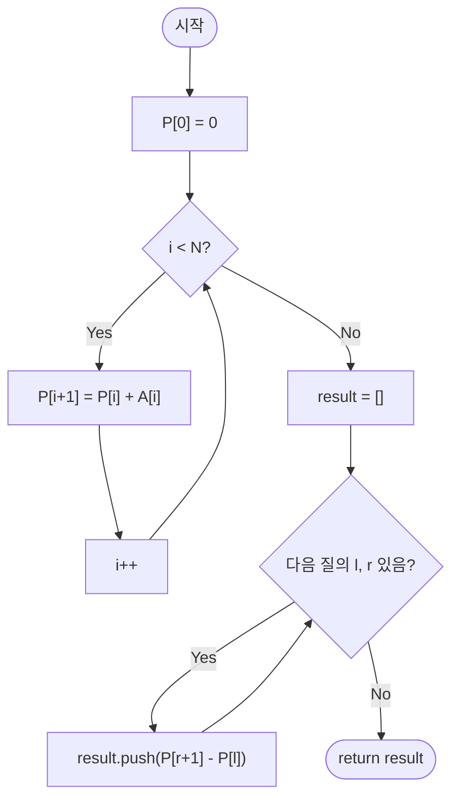

import { AlgorithmSimulation } from "#guide-sim";

# prefixSumRangeQuery — 구간 합 질의 (정적 배열)

## 성능 목표 예측

| 항목 | 값 |
|------|-----|
| 배열 길이 | $1 \leq N \leq 100{,}000$ |
| 질의 수 | $1 \leq Q \leq 100{,}000$ |
| 원소 범위 | $-10{,}000 \leq A[i] \leq 10{,}000$ |

**naive 접근의 문제점**: 각 질의 $(l, r)$마다 $A[l..r]$을 직접 합산하면 $O(N)$이다. $Q$개의 질의에 전체 $O(NQ) = 10^{10}$으로 시간 초과가 발생한다.

**목표 복잡도**: 전처리 $O(N)$, 질의당 $O(1)$, 전체 $O(N+Q)$. 배열이 정적(갱신 없음)이므로 누적합 한 번으로 모든 질의를 상수 시간에 처리한다.

**공간 복잡도**: 누적합 배열 $P$ 하나 $O(N+1)$이면 충분하다.

---

## 목표 함수

```ts
function prefixSumRangeQuery(A: number[], queries: Array<[number, number]>): number[]
```

| 파라미터 | 의미 | 제약 |
|----------|------|------|
| `A` | 정수 배열 (정적) | $1 \leq N \leq 100{,}000$ |
| `queries` | 질의 배열 $[(l, r), \ldots]$ | $1 \leq Q \leq 100{,}000$, $0 \leq l \leq r \leq N-1$ |

**반환값**: 각 질의 $(l, r)$에 대해 $A[l] + A[l+1] + \ldots + A[r]$을 담은 배열.

**엣지케이스**:

| 입력 | 기대 출력 | 이유 |
|------|-----------|------|
| `queries=[]` | `[]` | 질의 없음 |
| `l == r` | `[A[l]]` | 단일 원소 |
| `l=0, r=N-1` | `[sum(A)]` | 전체 배열 합 |
| 음수 원소 포함 | 올바른 합 | 차분 계산이 음수에서도 동작 |

---

## 핵심 아이디어

**핵심 아이디어**: "구간 합은 두 접두어 합의 차이로 표현되므로, 미리 누적합 배열을 만들면 모든 질의를 O(1)에 답할 수 있다."

배열이 변하지 않는 정적 환경에서 구간 합 질의가 반복될 때, 매번 구간을 합산하면 O(NQ)가 된다. P[0]=0, P[i]=A[0]+...+A[i-1]로 누적합 배열을 O(N)에 미리 계산해두면, sum(l,r) = P[r+1] - P[l]로 O(1)에 답할 수 있다.

**풀이 구조**
1. 크기 N+1의 누적합 배열 P를 만들고 P[0]=0으로 초기화한다.
2. i=0..N-1에 대해 `P[i+1] = P[i] + A[i]`로 전처리한다.
3. 각 질의 (l, r)에 대해 `P[r+1] - P[l]`을 반환한다.

**조건**: 배열이 정적(갱신 없음)이어야 한다. 갱신이 있다면 Fenwick Tree 또는 세그먼트 트리를 사용해야 한다.

**대표 예시**: `A=[1,3,5,7,9], query=(1,3)`
P = [0,1,4,9,16,25]. sum(1,3) = P[4] - P[1] = 16 - 1 = 15. 실제로 3+5+7=15.

**언제 쓰나**
정적 배열에서 구간 합을 반복적으로 조회하는 문제에서 사용한다. 2D로 확장해 직사각형 구간 합도 같은 방식으로 O(1) 질의가 가능하며, 누적합은 차분 배열·Fenwick Tree·세그먼트 트리 등 더 복잡한 자료구조의 기초가 된다.

---

### 원형 아이디어와 naive 접근

각 질의마다 직접 합산한다.

```
for each (l, r) in queries:
    s = 0
    for i from l to r:
        s += A[i]
    result.push(s)
```

$Q$개의 질의, 각각 최대 $O(N)$이므로 전체 $O(NQ) = 10^{10}$이다. 같은 구간을 여러 번 합산하는 중복 계산이 낭비의 원인이다.

### 어떤 관찰이 돌파구가 되는가

- **관찰 1**: 구간 합 $\text{sum}(l, r)$을 전체 합의 차이로 표현할 수 있다: $\text{sum}(l, r) = \text{sum}(0, r) - \text{sum}(0, l-1)$. 두 개의 접두어 합으로 분해된다.
- **관찰 2**: 배열이 정적이면 모든 접두어 합을 $O(N)$에 미리 계산해 배열에 저장할 수 있다. 이후 각 질의는 배열 두 원소의 차이만으로 $O(1)$에 답할 수 있다.
- **관찰 3**: 경계 조건을 통일하기 위해 $P[0] = 0$으로 정의하면 $l = 0$인 질의도 특수 처리 없이 $P[r+1] - P[0] = P[r+1]$로 계산된다.

### 관찰을 형식화: 상태/구조 정의

누적합 배열 $P$를 길이 $N+1$로 정의한다.

$$P[0] = 0$$
$$P[i] = \sum_{k=0}^{i-1} A[k] = P[i-1] + A[i-1] \quad (1 \leq i \leq N)$$

즉, $P[i]$는 $A[0..i-1]$의 합이다.

이 정의가 왜 이 형태여야 하는가: 1-indexed 누적합 $P[i] = A[0..i-1]$로 정의하면 구간 합이 $P[r+1] - P[l]$로 균일하게 표현된다. $P[i] = A[0..i]$로 정의하면 $l=0$인 경우 $P[-1]$에 접근해야 하는 특수 케이스가 생긴다.

질의 $(l, r)$에 대해:

$$\text{sum}(l, r) = P[r+1] - P[l]$$

$P[r+1]$은 $A[0..r]$의 합이고, $P[l]$은 $A[0..l-1]$의 합이다. 차이가 $A[l..r]$의 합이다.

### 점화식 또는 핵심 연산

**전처리 단계** ($N$번, 각 $O(1)$):

$$P[i+1] = P[i] + A[i] \quad (i = 0, 1, \ldots, N-1)$$

**질의 단계** ($Q$번, 각 $O(1)$):

$$\text{answer}(l, r) = P[r+1] - P[l]$$

- $P[i+1] = P[i] + A[i]$: 이전 누적합에 현재 원소를 더해 다음 누적합을 계산
- $P[r+1] - P[l]$: 오른쪽 경계 직후 누적합에서 왼쪽 경계 누적합을 빼면 구간 합이 됨

### 정당성 — 왜 이것이 옳은가

귀납적으로 $P[i] = \sum_{k=0}^{i-1} A[k]$임을 증명한다. 기저: $P[0] = 0 = $ 빈 합. 귀납 단계: $P[i] = \sum_{k=0}^{i-1} A[k]$이면 $P[i+1] = P[i] + A[i] = \sum_{k=0}^{i} A[k]$.

질의 정확성: $P[r+1] - P[l] = \sum_{k=0}^{r} A[k] - \sum_{k=0}^{l-1} A[k] = \sum_{k=l}^{r} A[k]$. 배열이 정적이므로 전처리 후 $P$는 변하지 않아 임의의 순서로 질의해도 항상 올바른 결과를 반환한다.

음수 원소: 차분 계산이 음수에서도 동일하게 동작한다.

### 구현 디테일과 최적화

- $P$를 $N+1$ 크기로 할당해야 한다. $N$ 크기로 하면 $P[N]$에 접근 시 범위 오류가 발생한다.
- **함정**: $P[r+1]$에서 `r = N-1`이면 $P[N]$에 접근한다. 배열 크기가 $N+1$이어야 하는 이유다.
- **함정**: 질의 인덱스가 0-indexed임을 확인한다. $l = 0$이면 $P[0] = 0$이므로 $P[r+1] - 0 = P[r+1]$이 올바르다.
- 전처리를 in-place로 수행하려면 $A$ 배열 자체를 누적합으로 덮어쓸 수 있지만, 원본 배열이 필요한 경우 별도 배열 $P$를 사용한다.
- 갱신이 필요한 경우: Fenwick Tree나 Segment Tree를 사용해야 한다. 정적 배열에서만 누적합이 $O(1)$ 질의를 보장한다.

---

## 시뮬레이션

입력 `A = [1, 3, 5, 7, 9]`, `queries = [[1,3], [0,4]]`에 대해 누적합 배열로 구간 합을 처리하는 과정이다. 위쪽 array 패널은 누적합 배열 `P`(길이 N+1=6), keyValue 패널은 전처리/질의 진행 상태다. `highlight`(빨강)는 이번 단계에서 채워지거나 참조되는 `P` 인덱스다.

실제 반환값은 `[15, 25]` 이며(`sum(1,3)=3+5+7=15`, `sum(0,4)=1+3+5+7+9=25`), 시뮬레이션 마지막 프레임의 결과와 일치한다.

> 대화형 시뮬레이션은 MDX 런타임에서 표시됩니다.

export const P = [0, 1, 4, 9, 16, 25];

export const steps = [
  {
    title: "전처리 P[0] = 0",
    detail: "누적합 배열 P (길이 6) 초기화. P[0]=0.",
    array: [0, null, null, null, null, null],
    highlight: [0],
    entries: [
      { label: "단계", value: "전처리" },
      { label: "P", value: "[0, _, _, _, _, _]" },
    ],
  },
  {
    title: "P[1] = P[0] + A[0] = 0+1 = 1",
    detail: "첫 1개 원소의 합.",
    array: [0, 1, null, null, null, null],
    highlight: [1],
    entries: [
      { label: "단계", value: "전처리" },
      { label: "P", value: "[0, 1, _, _, _, _]" },
    ],
  },
  {
    title: "P[2] = P[1] + A[1] = 1+3 = 4",
    detail: "첫 2개 원소의 합.",
    array: [0, 1, 4, null, null, null],
    highlight: [2],
    entries: [
      { label: "단계", value: "전처리" },
      { label: "P", value: "[0, 1, 4, _, _, _]" },
    ],
  },
  {
    title: "P[3] = P[2] + A[2] = 4+5 = 9",
    detail: "첫 3개 원소의 합.",
    array: [0, 1, 4, 9, null, null],
    highlight: [3],
    entries: [
      { label: "단계", value: "전처리" },
      { label: "P", value: "[0, 1, 4, 9, _, _]" },
    ],
  },
  {
    title: "P[4] = P[3] + A[3] = 9+7 = 16",
    detail: "첫 4개 원소의 합.",
    array: [0, 1, 4, 9, 16, null],
    highlight: [4],
    entries: [
      { label: "단계", value: "전처리" },
      { label: "P", value: "[0, 1, 4, 9, 16, _]" },
    ],
  },
  {
    title: "P[5] = P[4] + A[4] = 16+9 = 25",
    detail: "전처리 완료. P = [0, 1, 4, 9, 16, 25].",
    array: P,
    highlight: [5],
    entries: [
      { label: "단계", value: "전처리 완료" },
      { label: "P", value: "[0, 1, 4, 9, 16, 25]" },
    ],
  },
  {
    title: "질의 (1,3): P[4] - P[1] = 16 - 1 = 15",
    detail: "구간 합 A[1..3] = 3+5+7 = 15.",
    array: P,
    highlight: [1, 4],
    entries: [
      { label: "단계", value: "질의" },
      { label: "answer(1,3)", value: 15 },
    ],
  },
  {
    title: "질의 (0,4): P[5] - P[0] = 25 - 0 = 25",
    detail: "전체 배열 합 A[0..4] = 25.",
    array: P,
    highlight: [0, 5],
    entries: [
      { label: "단계", value: "질의" },
      { label: "answer(0,4)", value: 25 },
    ],
  },
  {
    title: "완료: result = [15, 25]",
    detail: "모든 질의 처리 종료.",
    array: P,
    entries: [
      { label: "결과", value: "[15, 25]" },
    ],
  },
];

<AlgorithmSimulation view={["array", "keyValue"]} steps={steps} title="누적합 구간 질의: A=[1,3,5,7,9]" />

## 수도 코드와 Activity Diagram

### 의사코드

```
function prefixSumRangeQuery(A, queries):
    N ← len(A)
    P ← 크기 N+1의 배열                // 불변식: P[i] = A[0..i-1]의 합
    P[0] ← 0

    for i from 0 to N-1:
        P[i+1] ← P[i] + A[i]           // 불변식: P[i+1] = 첫 i+1개 원소의 합

    result ← []
    for each (l, r) in queries:
        result.push(P[r+1] - P[l])      // 불변식: 반환값 = A[l..r]의 합

    return result
```

### Activity Diagram



**핵심 불변식**: 전처리 완료 후 $P[i] = \sum_{k=0}^{i-1} A[k]$이 $0 \leq i \leq N$에 대해 항상 성립하며, $P$는 질의 단계에서 변경되지 않는다.

---

## 복잡도 분석 심화

| 접근 방식 | 시간 | 공간 | 비고 |
|-----------|------|------|------|
| naive (질의마다 선형 탐색) | $O(NQ)$ | $O(1)$ | $N=Q=10^5$에서 불가 |
| 누적합 (정적) | $O(N+Q)$ | $O(N)$ | 최적 — 갱신 없을 때 |
| Fenwick Tree (동적) | $O((N+Q)\log N)$ | $O(N)$ | 갱신 있을 때 |

**누적합의 한계**: 배열 원소가 갱신되면 $P$ 전체를 재계산해야 하므로 갱신당 $O(N)$이다. 동적 갱신이 필요하면 Fenwick Tree 또는 Segment Tree를 사용한다.

**2D 누적합**: 2D 배열 $A[i][j]$에서 직사각형 구간 합을 $O(1)$에 처리할 수 있다.

$$P2[i][j] = \sum_{r \leq i,\, c \leq j} A[r][c]$$

$$\text{sum}(r1,c1,r2,c2) = P2[r2][c2] - P2[r1-1][c2] - P2[r2][c1-1] + P2[r1-1][c1-1]$$

포함-배제 원리를 적용한 확장으로, 전처리 $O(nm)$, 질의 $O(1)$이다.
