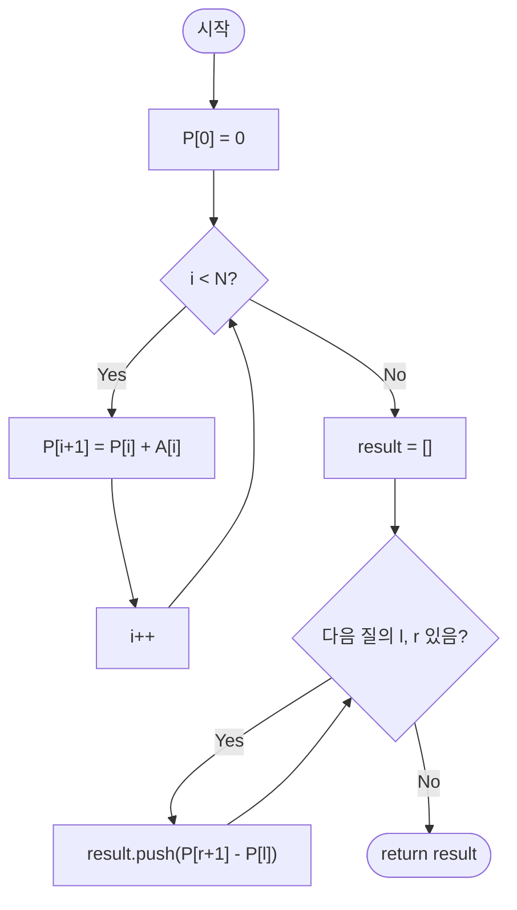

import { AlgorithmSimulation } from "#guide-sim";

# prefixSumRangeQuery — 구간 합이 두 번의 뺄셈으로 끝나는 이유

## 한눈에 보는 컨셉

배열이 바뀌지 않는다면, "0번부터 여기까지의 합"을 미리 표로 만들어 둔 뒤 **두 표 값의 차이**만으로 어떤 구간의 합이든 구할 수 있어요. 전처리에 `O(N)`을 한 번 쓰고 나면, 이후의 모든 질의는 배열 두 칸을 읽고 빼는 `O(1)`로 끝납니다. 이 트릭이 성립하는 유일한 전제는 "배열이 질의 도중 바뀌지 않는다"는 것입니다.

## 출발점: 가장 순진한 방법부터

문제를 먼저 정확히 잡을게요.

```ts
function prefixSumRangeQuery(A: number[], queries: Array<[number, number]>): number[]
```

각 질의 `[l, r]`에 대해 `A[l] + A[l+1] + ... + A[r]`을 계산해서, 질의가 들어온 순서대로 반환합니다. 제약은 `1 ≤ N ≤ 100,000`(배열 길이), `1 ≤ Q ≤ 100,000`(질의 수), `-10,000 ≤ A[i] ≤ 10,000`이고, 배열 `A`는 질의 도중 절대 바뀌지 않습니다(정적).

구간 합을 구하라는 요청을 받으면 가장 정직한 방법은 그 구간을 직접 더해 보는 거예요. 질의가 하나뿐이라면 이걸로 충분합니다.

```ts
function prefixSumRangeQueryNaive(A: number[], queries: Array<[number, number]>): number[] {
  return queries.map(([l, r]) => {
    let s = 0;
    for (let i = l; i <= r; i++) s += A[i]; // 매 질의마다 구간을 처음부터 순회
    return s;
  });
}
```

작은 예로 비용을 직접 세어 봅시다. `A = [1, 3, 5, 7, 9]`에서 질의 `(1,3)`은 3칸(3+5+7), `(0,4)`는 5칸을 훑습니다.

```text
A = [1, 3, 5, 7, 9]

질의 (1,3):  A[1]+A[2]+A[3]           →  3칸 순회
질의 (0,4):  A[0]+A[1]+A[2]+A[3]+A[4] →  5칸 순회

비용:  질의당 최대 O(N)  ×  Q개  =  O(NQ)
```

이제 이걸 문제 규모에 그대로 대입해 보면 왜 이 방법이 위험한지 보여요. `N = Q = 100,000`이면

```text
O(N × Q) = 100,000 × 100,000 = 10,000,000,000 (10^10)
```

1초에 통상 처리 가능한 연산이 대략 `10^8` 수준이니, `10^10`은 100배 넘게 초과합니다. 같은 구간이 겹쳐서 여러 번 질의될 때마다 겹치는 부분까지 매번 처음부터 다시 더하는 것이 낭비의 정체예요. **"이미 한 번 계산해 둔 부분합을 재사용할 수는 없을까?"** — 이것이 다음 절로 넘어가는 단서입니다.

## 아이디어 자세히 들여다보기

### 접두어 합의 차이로 구간을 잘라내기 — 수식과 그림

직관은 간단해요. 구간 `[l, r]`의 합은 "0부터 r까지의 합"에서 "0부터 l-1까지의 합"을 뺀 것과 같습니다 — 마치 긴 자를 두 지점에서 눈금을 읽고 빼면 그 사이 길이가 나오는 것과 같은 이치예요.

이를 정식으로 쓰기 위해 길이 `N+1`인 누적합 배열 `P`를 정의합니다.

$$P[0] = 0$$
$$P[i] = \sum_{k=0}^{i-1} A[k] = P[i-1] + A[i-1] \quad (1 \leq i \leq N)$$

즉 `P[i]`는 "`A`의 앞 `i`개 원소의 합"입니다. 그림으로 보면 이렇습니다.

```text
A:        1    3    5    7    9
index:    0    1    2    3    4

P[0] = 0                                (아무것도 안 더함)
P[1] = A[0]                       = 1
P[2] = A[0]+A[1]                  = 4
P[3] = A[0]+A[1]+A[2]              = 9
P[4] = A[0]+A[1]+A[2]+A[3]         = 16
P[5] = A[0]+A[1]+A[2]+A[3]+A[4]    = 25

P = [0, 1, 4, 9, 16, 25]   (길이 N+1 = 6)
```

`P`를 한 번 만들어 두면, 질의 `(l, r)`의 답은 배열 두 칸의 뺄셈이 됩니다.

$$\text{sum}(l, r) = P[r+1] - P[l]$$

`P[r+1]`은 `A[0..r]`의 합이고 `P[l]`은 `A[0..l-1]`의 합이니, 둘의 차이는 정확히 `A[l..r]`의 합만 남습니다.

**왜 하필 `P[0]=0`, 길이 `N+1`인 형태여야 할까요?** 만약 `P[i] = A[0..i]`(즉 자기 자신 포함, 길이 `N`)로 정의했다면 `l=0`인 질의에서 `P[l-1] = P[-1]`이라는 존재하지 않는 칸을 참조해야 하는 특수 케이스가 생겨요. `P[0]=0`을 "빈 구간의 합"으로 미리 넣어 두면, `l=0`이든 아니든 항상 같은 공식 `P[r+1]-P[l]`로 처리할 수 있습니다. 경계를 위한 특수 분기를 아예 없애 버리는 설계예요.

잠깐, 확인 하나만 해 볼까요? 위 `P` 배열에서 질의 `(2,3)`(즉 `A[2]+A[3] = 5+7 = 12`)의 답은 `P[?] - P[?]`로 어떻게 쓸까요? 정답은 `P[4] - P[2] = 16 - 4 = 12`입니다.

### 왜 모순 없이 작동하는가

`P`가 정의대로 채워진다는 것을 귀납적으로 확인해 봅시다.

- **기저**: `P[0] = 0`은 "빈 구간의 합"이므로 정의 그대로 성립합니다.
- **귀납 단계**: `P[i] = \sum_{k=0}^{i-1} A[k]`가 성립한다고 가정하면, `P[i+1] = P[i] + A[i] = \sum_{k=0}^{i-1} A[k] + A[i] = \sum_{k=0}^{i} A[k]`이므로 `i+1`에서도 정의가 성립합니다. 전처리 루프는 `i=0`부터 `N-1`까지 이 관계를 하나씩 적용할 뿐이라, 다른 경우의 수가 끼어들 여지가 없습니다.

이제 질의 정확성입니다. `P[r+1] - P[l] = \sum_{k=0}^{r} A[k] - \sum_{k=0}^{l-1} A[k]`인데, 두 합은 `k=0..l-1` 구간을 공통으로 갖고 있어서 뺄셈하면 정확히 `\sum_{k=l}^{r} A[k]`만 남습니다. 배열이 정적이므로 전처리가 끝난 뒤 `P`는 어떤 질의를 몇 번을 처리하든 변하지 않고, 그래서 질의 순서와 무관하게 항상 같은 값을 돌려줍니다.

여기서 **헷갈리기 쉬운 포인트**가 둘 있습니다.

- **배열 크기를 `N`으로 잘못 잡는 실수.** `r`이 최댓값 `N-1`인 질의에서는 `P[r+1] = P[N]`에 접근해야 합니다. `P`를 `N` 크기로만 할당하면 `P[N]`은 배열 범위 밖이에요. 실제로 손으로 확인해 보면, `A = [1,3,5,7,9]`(N=5)에서 크기 `N`짜리 잘못된 배열을 만들면 `wrongP.length = 5`가 되고, 질의 `(0,4)`가 요구하는 `wrongP[5]`는 `undefined`가 되어 정답 `25` 대신 조용히 깨진 값을 돌려줍니다. `P`가 반드시 `N+1` 크기여야 하는 이유가 여기 있습니다.
- **`l=0`을 특수 케이스로 착각하는 실수.** 앞 절에서 봤듯 `P[0]=0`이 이미 "왼쪽 경계가 없다"는 의미를 담고 있어서, `l=0`이어도 `P[r+1] - P[0] = P[r+1]`로 자연스럽게 처리됩니다. 별도 `if (l === 0)` 분기를 추가할 필요가 없어요.

엣지 케이스도 정의 위에서 그대로 확인됩니다.

```text
queries = []                → 루프가 돌지 않고 빈 배열 반환
l == r (예: (2,2))          → P[3]-P[2] = 9-4 = 5 = A[2] 하나만 남음
l=0, r=N-1                  → P[N]-P[0] = 전체 배열 합
음수 원소 포함 (예: A=[-1,2,-3,4]) → 뺄셈이 그대로 부호까지 반영, sum(0,3)=P[4]-P[0]=2
```

## 아이디어를 코드로 옮기기

```ts
function prefixSumRangeQuery(A: number[], queries: Array<[number, number]>): number[] {
  const N = A.length;
  const P = new Array<number>(N + 1);
  P[0] = 0;
  for (let i = 0; i < N; i++) {
    P[i + 1] = P[i] + A[i]; // 누적합 전처리
  }

  const result: number[] = [];
  for (const [l, r] of queries) {
    result.push(P[r + 1] - P[l]); // 구간 합 O(1) 질의
  }
  return result;
}
```

**가장 중요한 줄은 `P[i + 1] = P[i] + A[i]`와 `P[r + 1] - P[l]` 두 줄입니다.** 첫 줄은 "이전 누적합에 현재 원소를 더한다"는 점화식 그대로이고, 인덱스가 `i`가 아니라 `i+1`에 쓰인다는 점(왼쪽이 항상 오른쪽보다 한 칸 앞섬)을 놓치면 배열이 한 칸씩 밀려 전체가 틀어집니다. 둘째 줄은 앞서 증명한 뺄셈 공식 그대로예요. 그 외에 챙길 지점은:

- `new Array<number>(N + 1)` — 크기를 `N`으로 줄이면 앞서 본 함정 그대로 `P[N]` 접근에서 깨집니다.
- `P[0] = 0`을 루프 밖에서 먼저 채워야 합니다. 루프 안에서 `P[i+1] = P[i] + A[i]`를 돌리려면 `P[0]`이 미리 정의돼 있어야 하기 때문이에요.
- 전처리 루프와 질의 루프는 완전히 분리돼 있습니다 — 전처리가 끝나기 전에 질의를 처리하면 아직 채워지지 않은 `P` 칸을 읽게 됩니다.

전처리 `O(N)` + 질의당 `O(1)` × `Q`번 = `O(N+Q)`로, 맨 처음 세운 목표를 그대로 달성했습니다. 이 이상 줄일 여지는 없어요 — 배열 원소를 한 번씩은 읽어야 `P`를 만들 수 있으니 전처리 `O(N)`은 피할 수 없는 하한이고, 질의당 `O(1)`보다 더 빠른 단위는 없습니다. 다만 이 최적성은 "배열이 갱신되지 않는다"는 전제에 전적으로 기댄 것이라, 원소가 중간에 바뀌는 문제라면 `P` 전체를 다시 `O(N)`에 계산해야 해서 갱신이 잦으면 오히려 비효율적이에요. 갱신과 구간 질의를 동시에 빠르게 하고 싶다면 Fenwick Tree나 Segment Tree처럼 갱신·질의 모두 `O(log N)`에 처리하는 자료구조로 넘어가야 합니다. 또한 같은 아이디어를 2차원으로 확장하면(포함-배제 원리 적용) 직사각형 구간 합도 `O(1)`에 답하는 2D 누적합을 만들 수 있어요 — 이번 가이드에서 다룬 1D 누적합이 그 확장의 기초가 됩니다.

## 실행 시각화

입력 `A = [1, 3, 5, 7, 9]`, `queries = [[1,3], [0,4]]`에 대해 누적합 배열로 구간 합을 처리하는 과정입니다. 위쪽 array 패널은 누적합 배열 `P`(길이 N+1=6), keyValue 패널은 전처리/질의 진행 상태를 보여줍니다. `highlight`(빨강)는 이번 단계에서 채워지거나 참조되는 `P` 인덱스예요. 실제 반환값은 `[15, 25]`이며(`sum(1,3)=3+5+7=15`, `sum(0,4)=1+3+5+7+9=25`), 시뮬레이션 마지막 프레임의 결과와 일치합니다.

> 대화형 시뮬레이션은 MDX 런타임에서 표시됩니다.

export const P = [0, 1, 4, 9, 16, 25];

export const steps = [
  {
    title: "전처리 P[0] = 0",
    detail: "누적합 배열 P (길이 6) 초기화. P[0]=0.",
    array: [0, null, null, null, null, null],
    highlight: [0],
    entries: [
      { label: "단계", value: "전처리" },
      { label: "P", value: "[0, _, _, _, _, _]" },
    ],
  },
  {
    title: "P[1] = P[0] + A[0] = 0+1 = 1",
    detail: "첫 1개 원소의 합.",
    array: [0, 1, null, null, null, null],
    highlight: [1],
    entries: [
      { label: "단계", value: "전처리" },
      { label: "P", value: "[0, 1, _, _, _, _]" },
    ],
  },
  {
    title: "P[2] = P[1] + A[1] = 1+3 = 4",
    detail: "첫 2개 원소의 합.",
    array: [0, 1, 4, null, null, null],
    highlight: [2],
    entries: [
      { label: "단계", value: "전처리" },
      { label: "P", value: "[0, 1, 4, _, _, _]" },
    ],
  },
  {
    title: "P[3] = P[2] + A[2] = 4+5 = 9",
    detail: "첫 3개 원소의 합.",
    array: [0, 1, 4, 9, null, null],
    highlight: [3],
    entries: [
      { label: "단계", value: "전처리" },
      { label: "P", value: "[0, 1, 4, 9, _, _]" },
    ],
  },
  {
    title: "P[4] = P[3] + A[3] = 9+7 = 16",
    detail: "첫 4개 원소의 합.",
    array: [0, 1, 4, 9, 16, null],
    highlight: [4],
    entries: [
      { label: "단계", value: "전처리" },
      { label: "P", value: "[0, 1, 4, 9, 16, _]" },
    ],
  },
  {
    title: "P[5] = P[4] + A[4] = 16+9 = 25",
    detail: "전처리 완료. P = [0, 1, 4, 9, 16, 25].",
    array: P,
    highlight: [5],
    entries: [
      { label: "단계", value: "전처리 완료" },
      { label: "P", value: "[0, 1, 4, 9, 16, 25]" },
    ],
  },
  {
    title: "질의 (1,3): P[4] - P[1] = 16 - 1 = 15",
    detail: "구간 합 A[1..3] = 3+5+7 = 15.",
    array: P,
    highlight: [1, 4],
    entries: [
      { label: "단계", value: "질의" },
      { label: "answer(1,3)", value: 15 },
    ],
  },
  {
    title: "질의 (0,4): P[5] - P[0] = 25 - 0 = 25",
    detail: "전체 배열 합 A[0..4] = 25.",
    array: P,
    highlight: [0, 5],
    entries: [
      { label: "단계", value: "질의" },
      { label: "answer(0,4)", value: 25 },
    ],
  },
  {
    title: "완료: result = [15, 25]",
    detail: "모든 질의 처리 종료.",
    array: P,
    entries: [
      { label: "결과", value: "[15, 25]" },
    ],
  },
];

<AlgorithmSimulation view={["array", "keyValue"]} steps={steps} title="누적합 구간 질의: A=[1,3,5,7,9]" />

## 흐름 한눈에 보기


```mermaid
flowchart TD
    A([시작]) --> B["P[0] = 0"]
    B --> C{"i < N?"}
    C -- Yes --> D["P[i+1] = P[i] + A[i]"]
    D --> E["i++"]
    E --> C
    C -- No --> F["result = []"]
    F --> G{"다음 질의 l, r 있음?"}
    G -- Yes --> H["result.push(P[r+1] - P[l])"]
    H --> G
    G -- No --> I([return result])
```

## 스스로 점검하기

1. `A = [2, 4, 6, 8]`에 대해 누적합 배열 `P`를 손으로 채워 보고, 질의 `(1,2)`의 답을 `P[?] - P[?]` 형태로 구해 보세요. (정답: `P = [0,2,6,12,20]`, `sum(1,2) = P[3]-P[1] = 12-2 = 10`이며 실제로 `A[1]+A[2]=4+6=10`입니다.)
2. `P`를 크기 `N`으로(즉 `N+1`이 아니라) 할당하면 `A=[1,3,5,7,9]`에서 질의 `(0,4)`를 처리할 때 정확히 어느 시점에 무엇이 잘못되는지 짚어 보세요. (힌트: `P[r+1]`에서 `r=4`이면 `P[5]`에 접근합니다.)
3. 만약 2차원 배열에서 직사각형 구간의 합을 구해야 한다면, 1차원 누적합의 어떤 부분을 확장해야 할까요? 뺄셈이 한 번이 아니라 몇 번 필요할지, 왜 그런지 생각해 보세요. (힌트: 포함-배제 원리)
