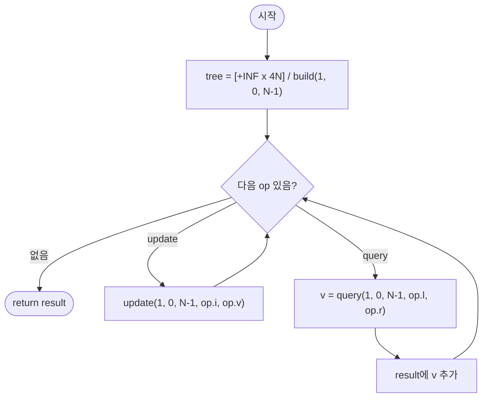

import { AlgorithmSimulation } from "#guide-sim";

# segmentTreeRangeMin — 구간을 반씩 접어 트리로 쌓으면 갱신도 질의도 O(log N)에 끝나는 이유

## 한눈에 보는 컨셉

배열 위에 완전 이진 트리를 하나 씌워, 각 노드가 자기 담당 구간의 최솟값을 미리 계산해 들고 있게 만드는 기법이에요. 질의가 들어오면 담당 구간이 질의와 겹치지 않는 가지는 통째로 버리고, 완전히 포함된 노드는 저장해 둔 값을 즉시 돌려줘 `O(log N)`만에 끝납니다. 갱신도 리프에서 루트까지 `O(log N)`개 노드만 고쳐 쓰면 되므로, 점 갱신과 구간 최솟값 질의가 뒤섞인 동적 상황의 표준 해법이에요.

## 출발점: 가장 순진한 방법부터

문제를 먼저 정확히 잡을게요.

```ts
type SegOp =
  | { type: "update"; i: number; v: number }
  | { type: "query"; l: number; r: number };

function segmentTreeRangeMin(A: number[], ops: SegOp[]): number[]
```

| 파라미터 | 의미 | 제약 |
|----------|------|------|
| `A` | 초기 정수 배열 | $1 \leq N \leq 100{,}000$ ($N$은 `A`의 길이) |
| `ops` | 순서대로 처리할 연산 목록 | $0 \leq Q \leq 100{,}000$ ($Q$는 `ops`의 길이) |
| `A[i]`, `v` | 원소·갱신 값 | $-10^9 \leq A[i], v \leq 10^9$ |

`update` 연산은 $0 \leq i < N$, `query` 연산은 $0 \leq l \leq r < N$을 만족합니다. **반환값**은 `query` 연산의 결과만 등장 순서대로 담은 배열이에요 — `update`는 결과에 포함되지 않습니다.

| 입력 | 기대 출력 | 이유 |
|------|-----------|------|
| `ops`에 `query`만 있음 | 초기 배열 기반 구간 최솟값 | 갱신 없음 |
| `ops`가 빈 배열 | `[]` | `query`가 없어 결과 없음 |
| `l == r`인 `query` | 단일 원소 | 길이 1 구간도 유효한 질의 |
| `update` 후 같은 구간 `query` | 갱신 반영된 최솟값 | 동적 갱신 정확성 |

최솟값을 묻는 문제니까, 가장 정직한 출발은 매번 구간을 직접 순회하며 최솟값을 찾는 거예요.

```ts
function segmentTreeRangeMinNaive(A: number[], ops: SegOp[]): number[] {
  const arr = A.slice();
  const result: number[] = [];
  for (const op of ops) {
    if (op.type === "update") {
      arr[op.i] = op.v;
    } else {
      let m = Infinity;
      for (let k = op.l; k <= op.r; k++) m = Math.min(m, arr[k]); // 구간을 매번 처음부터 순회
      result.push(m);
    }
  }
  return result;
}
```

```text
update(i, v):  arr[i] = v                                O(1)
query(l, r):   arr[l..r]을 직접 순회해 최솟값 계산          O(r - l + 1) ≤ O(N)

최악 케이스 N = Q = 100,000:
  query 1회 최대 100,000칸 순회 × 최대 100,000회 질의 = 10^10 회 비교
  1초에 처리 가능한 연산은 대략 10^8~10^9회 → 10~100배 초과
```

"합 문제라면 누적합(prefix sum)으로 전처리하면 되잖아?"라는 생각이 자연스럽게 들 텐데, 최솟값은 그 길이 막혀 있어요.

```text
prefixMin[i] = min(A[0..i])

prefixMin으로 만들 수 있는 것: min(A[0..r])   (왼쪽 끝이 항상 0으로 고정)
prefixMin으로 만들 수 없는 것: min(A[l..r])   (l > 0인 임의 구간)

sum은 뺄셈으로 구간을 복원한다:  sum(l,r) = prefix[r] - prefix[l-1]
min에는 뺄셈이 없다 — "이 구간의 최솟값에서 저 구간의 최솟값을 뺀다"는 연산 자체가 존재하지 않는다
```

그러면 정적 Sparse Table(빌드 `O(N log N)`, 질의 `O(1)`)은 어떨까요? 갱신이 없다면 이상적이지만, 이 문제는 갱신이 섞여 있습니다.

```text
Sparse Table: 정적 배열이면 build O(N log N), query O(1) — 갱신 없을 때는 이상적
update 한 번마다 통째로 재구성해야 한다 → O(N log N) per update
Q번 갱신이면 최악 O(NQ log N) ≈ 100,000 × 100,000 × 17 ≈ 1.7×10^11  → naive보다도 나쁨
```

정적 구조는 전부 막혔습니다. 그런데 naive를 다시 보면 낌새가 하나 보여요. `query(1, 4)`를 계산할 때 `A[2..3]`의 최솟값을 구해 뒀다가, 다음 질의가 `A[2..5]`라면 그 부분 결과를 재사용할 수 있지 않을까요? **구간을 미리 절반씩 쪼개 답을 캐시해 두면, 갱신이 있어도 영향받는 조각만 고쳐 쓸 수 있지 않을까** — 이것이 이번 알고리즘의 출발 단서입니다.

## 아이디어 자세히 들여다보기

### 절반씩 쪼개 담당 구간을 나누기 — 수식과 그림

배열 `A`(길이 $N$)를 완전 이진 트리 하나로 감쌉니다. 트리 배열 $tree$의 각 노드 $node$는 자기 담당 구간 $[s, e]$의 최솟값을 저장해요.

$$tree[node] = \min(A[s], A[s+1], \ldots, A[e]) \quad (\text{node가 구간 } [s, e] \text{를 담당})$$

- 루트: $node = 1$, 담당 구간 $[0, N-1]$
- 노드 $node$의 왼쪽 자식: $2 \cdot node$, 담당 $[s, mid]$
- 노드 $node$의 오른쪽 자식: $2 \cdot node + 1$, 담당 $[mid+1, e]$ (단, $mid = \lfloor (s+e)/2 \rfloor$)
- 리프($s = e$): $tree[node] = A[s]$

$A = [1, 3, 2, 7, 9, 11]$ ($N=6$)로 직접 채워 보면 이렇습니다(`bun`으로 실제 빌드해 확인한 값이에요).

```text
A = [1, 3, 2, 7, 9, 11]   인덱스:  0  1  2  3  4  5

                    node1 [0,5] = 1
                   /                \
            node2 [0,2] = 1      node3 [3,5] = 7
             /        \             /        \
      node4[0,1]=1  node5[2,2]=2  node6[3,4]=7  node7[5,5]=11
       /      \                    /      \
  node8[0,0]=1 node9[1,1]=3  node12[3,3]=7 node13[4,4]=9
```

확인 질문 하나 — 노드5는 구간 `[2,2]`를 담당하는 리프인데, 왜 자식 노드10·11에는 값이 없을까요? 리프는 $s=e$에서 재귀가 멈추기 때문에, 애초에 자식을 만들지 않아서예요.

**왜 하필 이 형태여야 하는가**: 모든 구간 `[l,r]` 쌍의 답을 표로 미리 만들어 두면 `O(1)` 질의가 되지만 `O(N^2)` 공간이 필요해 100,000 규모에서는 불가능합니다. 반대로 답을 전혀 캐시하지 않으면 naive처럼 매번 `O(N)`이 걸리고요. 세그먼트 트리는 그 중간 지점입니다 — 딱 `O(N)`개(정확히는 $4N$개까지 할당) 노드에만 부분 최솟값을 캐시해 두고, 나머지는 캐시된 값들을 조합해서 구합니다. 배열 인덱싱(`2*node`, `2*node+1`)으로 트리를 표현하면 포인터도 필요 없어요.

이 정의에서 자식 관계가 성립하는 이유는 최솟값 연산의 결합 법칙 때문입니다.

$$tree[node] = \min\bigl(tree[2 \cdot node],\; tree[2 \cdot node + 1]\bigr)$$

### 단서를 설명해 주는 이론 — 분할 정복과 구간의 canonical 분해

방금 쓴 "겹치지 않으면 버리고, 완전히 포함되면 즉시 반환한다"는 판단은 사실 분할 정복(divide and conquer)을 구간 문제에 적용한 일반적인 논증이에요. 이 이론을 제대로 짚어야 질의가 왜 `O(N)`이 아니라 `O(log N)`인지 납득할 수 있습니다.

질의 `[l, r]`을 트리에서 처리할 때, 재귀가 "계속 파고드는"(부분 겹침) 노드는 각 레벨(깊이)마다 최대 2개뿐이에요 — 질의의 왼쪽 경계에 걸친 노드 하나, 오른쪽 경계에 걸친 노드 하나입니다. 그 사이에 완전히 들어간 노드는 즉시 저장값을 반환하고, 완전히 벗어난 노드는 즉시 무시됩니다.

```text
레벨 0 (루트):    질의와 겹치는 노드 1개        → 보통 부분 겹침, 파고든다
레벨 1:           경계에 걸친 노드 최대 2개      → 부분 겹침, 파고든다
레벨 2:           경계에 걸친 노드 최대 2개      → 나머지는 완전 포함(즉시 반환) 또는 미겹침(즉시 버림)
   ...
레벨 log N (리프): 도달하면 종료

트리 깊이가 O(log N)이고, 레벨마다 "더 파고드는" 노드가 O(1)개뿐이므로
방문(재귀 호출)하는 노드의 총합은 O(log N)입니다.
```

이 구조가 진짜 강력한 이유는 `min`에만 묶여 있지 않다는 점이에요. 필요한 성질은 단 하나, **병합 연산이 결합 법칙을 만족한다**는 것뿐입니다($\min(a, \min(b,c)) = \min(\min(a,b), c)$). 이 성질만 있으면 `min`을 `sum`, `max`, `gcd`로 바꿔도 트리 구조와 복잡도 논증이 그대로 통합니다 — 이 사실은 최적화 절 마지막에 "이 알고리즘의 가치가 어디에 있는지"를 이야기할 때 다시 소환할 테니 기억해 두세요.

### 왜 모순 없이 작동하는가

귀납적으로 $tree[node]$가 담당 구간 $[s,e]$의 정확한 최솟값임을 보입니다.

**기저**: 리프($s=e$)에서 $tree[node] = A[s]$는 원소 하나짜리 구간의 최솟값이 자기 자신이라는 뜻이라 자명하게 참입니다.

**귀납 단계**: 내부 노드 $[s,e]$는 정확히 두 자식 $[s,mid]$, $[mid+1,e]$로 나뉘고, 이 둘이 $[s,e]$를 빠짐없이 겹침 없이 덮습니다 — 경우의 완전성은 $mid$가 항상 $[s,e-1]$ 범위에 있어 양쪽 다 비어 있지 않은 데서 나옵니다. 귀납 가정으로 두 자식이 각각 자기 구간의 최솟값을 정확히 담고 있다면, $\min$의 결합 법칙에 의해 $\min(tree[2 \cdot node], tree[2 \cdot node+1])$은 곧 $[s,e]$ 전체의 최솟값입니다. 이걸로 각 경우의 정확성도 확인됩니다.

**갱신**: 리프 하나만 실제로 바뀌고, 그 리프에서 루트까지의 경로($O(\log N)$개 노드)만 재계산합니다. 경로 밖의 노드는 자기 서브트리 안 원소가 하나도 바뀌지 않았으므로 불변식이 그대로 유지됩니다.

**질의**: "미겹침 → `+INF`", "완전 포함 → 저장값", "부분 겹침 → 재귀"라는 세 경우는 구간 `[s,e]`와 `[l,r]`의 관계를 놓고 볼 때 서로 배타적이고 완전합니다(둘이 겹치지 않거나, 한쪽이 다른 쪽을 완전히 포함하거나, 부분적으로만 겹치거나 — 이 셋 중 정확히 하나만 성립합니다).

여기서 **헷갈리기 쉬운 포인트**가 둘 있습니다.

첫째, **query의 미겹침 조건은 반드시 `||`(OR)여야 합니다.** `r < s || e < l`을 `&&`(AND)로 잘못 쓰면 어떻게 될까요? 실제로 돌려서 확인해 봤습니다 — `A=[1,3,2,7]`에서 `query(0,0)`은 정답이 `1`인데, 조건을 AND로 바꾼 버전은 정상적으로 끝나지 않고 `RangeError: Maximum call stack size exceeded`로 죽습니다.

```text
r < s && e < l  ← 버그: 두 조건이 동시에 참이어야 "미겹침"으로 판단

리프(s == e)에 도달해도 이 조건이 좀처럼 동시에 참이 되지 않아 "미겹침"으로 멈추지 못하고,
mid = (s+e)>>1 = s인 채로 자식을 계속 호출한다 → 재귀 깊이가 끝없이 늘어나 스택 오버플로우
```

둘째, **update에서 상향 재계산 줄을 빠뜨리면 부모가 조용히 낡은 값을 들고 있습니다.** `A=[1,3,2,7]`에서 `update(i=2, v=0)` 후 `query(1,3)`을 해 보면, 정답은 `min(3,0,7)=0`인데 재계산 누락 버전은 `2`를 반환합니다.

```text
Before update(i=2, v=0):  node3[2,3] = min(A[2]=2, A[3]=7) = 2

리프 tree[6]만 0으로 바뀌고 tree[3] = min(tree[6], tree[7]) 줄이 빠지면:
After (버그):   node3[2,3] = 2   ← 여전히 옛 값 (리프는 바뀌었는데 부모는 안 바뀜)
정답이라면:      node3[2,3] = min(0, 7) = 0

query(1,3): 버그 버전은 min(node2=3, node3=2) = 2 를 반환 — 정답 0과 다르다
```

엣지 케이스에서도 위 불변식이 그대로 성립하는지 확인해 둘게요.

```text
N = 1 (원소 1개)  → 루트가 곧 리프. build/update/query 모두 s==e 분기만 타서 정상 동작
ops = []          → 루프가 한 번도 안 돌고 result = [] 즉시 반환
l == r인 query    → 어느 지점에서든 l<=s && e<=r 이 만족되는 순간 리프 값을 그대로 반환
update만 있는 ops → query가 없으니 result는 계속 [] — 트리는 갱신되지만 반환값과 무관
```

## 아이디어를 코드로 옮기기

```ts
function segmentTreeRangeMinRecursive(A: number[], ops: SegOp[]): number[] {
  const N = A.length;
  const INF = Number.MAX_SAFE_INTEGER;
  const tree = new Array<number>(4 * N).fill(INF);

  function build(node: number, s: number, e: number): void {
    if (s === e) {
      tree[node] = A[s]!;
      return;
    }
    const mid = (s + e) >> 1;
    build(2 * node, s, mid);
    build(2 * node + 1, mid + 1, e);
    tree[node] = Math.min(tree[2 * node]!, tree[2 * node + 1]!); // 불변식 유지: 상향 재계산
  }

  function update(node: number, s: number, e: number, i: number, v: number): void {
    if (s === e) {
      tree[node] = v;
      return;
    }
    const mid = (s + e) >> 1;
    if (i <= mid) update(2 * node, s, mid, i, v);
    else update(2 * node + 1, mid + 1, e, i, v);
    tree[node] = Math.min(tree[2 * node]!, tree[2 * node + 1]!); // 불변식 유지: 상향 재계산
  }

  function query(node: number, s: number, e: number, l: number, r: number): number {
    if (r < s || e < l) return INF; // 미겹침
    if (l <= s && e <= r) return tree[node]!; // 완전 포함
    const mid = (s + e) >> 1;
    return Math.min(
      query(2 * node, s, mid, l, r),
      query(2 * node + 1, mid + 1, e, l, r),
    );
  }

  build(1, 0, N - 1);
  const result: number[] = [];
  for (const op of ops) {
    if (op.type === "update") update(1, 0, N - 1, op.i, op.v);
    else result.push(query(1, 0, N - 1, op.l, op.r));
  }
  return result;
}
```

결정 지점 위주로 짚을게요.

- **초기값**: `INF`는 미겹침 가지를 `min` 계산에서 무해하게 만들기 위한 값입니다. 원소 범위($-10^9 \leq A[i] \leq 10^9$)보다 훨씬 큰 `Number.MAX_SAFE_INTEGER`를 써서, 실제 최솟값과 절대 헷갈리지 않게 합니다.
- **1-indexed 루트**: 루트를 `1`로 시작합니다. `0`을 루트로 쓰면 자식이 `2*0=0`, `2*0+1=1`이 되어 자기 자신 혹은 원치 않는 노드를 가리키는 구조가 깨집니다.
- **트리 크기 4N**: `N`이 2의 거듭제곱이 아니면 완전 이진 트리가 아니라서 마지막 레벨 노드 인덱스가 `2N`을 넘어설 수 있습니다. `4N`으로 넉넉히 잡아야 인덱스 초과가 나지 않습니다.

**가장 실수가 잦은 부분은 build와 update 양쪽에 있는 `tree[node] = Math.min(tree[2 * node], tree[2 * node + 1])` 줄입니다.** 앞서 헷갈리기 쉬운 포인트에서 실제로 확인했듯, 이 줄을 빠뜨리면 리프는 바뀌어도 부모가 낡은 값을 들고 있게 되어 질의가 조용히 틀립니다.

## 더 빠르게 만들 단서 찾기

방금 짠 재귀 구현은 정확하고 점근적으로 이미 `O(log N)`이에요. 그런데 실제로 이 함수가 어떻게 실행되는지 관찰해 보면 두 가지 낭비가 보입니다.

첫째, 재귀 호출 하나마다 `(node, s, e, l, r)` 다섯 개의 인자를 스택 프레임에 쌓고, JS 엔진은 이 프레임을 매번 새로 할당·해제합니다. `update`/`query`가 `Q=100{,}000`번 반복되고 각각 최대 `O(log N) ≈ 17`단계까지 내려가니, 순수 함수 호출 오버헤드만 누적돼도 무시할 수 없는 비용이에요.

둘째, 트리 배열 크기가 필요보다 큽니다.

```text
N = 6일 때
  4N 배열:  24개 슬롯 할당 (실제 쓰는 노드는 1..13, 13개뿐 — 나머지는 낭비)
  최소 필요: 내부 N-1개 + 리프 N개 = 2N-1개면 충분
```

이 두 관찰(함수 호출 오버헤드, 두 배 가까이 낭비되는 공간)이 다음 최적화의 단서예요 — **재귀와 4N 배열 없이, 반복문과 2N 배열만으로 같은 일을 할 수 있지 않을까?**

## 단서를 최적화로 연결하기

리프를 고정된 위치에 나란히 놓으면 재귀 없이도 트리를 오갈 수 있습니다. 원소 `i`의 리프를 인덱스 `N + i`에 두면, 부모로 가는 길은 그냥 인덱스를 2로 나누는 것뿐이에요(`pos >>= 1`). `s`, `e` 경계를 인자로 넘길 필요 자체가 없어집니다.

```text
Before (재귀):  query(node, s, e, l, r)  — 매 호출마다 구간 경계(s, e)를 함께 넘긴다
After (반복):   query(l, r)              — lo = l+N, hi = r+N에서 시작해 두 포인터를 절반씩 접어 올린다
```

질의는 두 포인터 `lo`, `hi`를 리프 레벨(`+N`)에서 시작해 동시에 부모로 접어 올리면서, "짝을 짓지 못하고 남는" 경계 원소만 그때그때 답에 반영합니다.

```text
매 반복에서:
  lo가 홀수  → lo는 "오른쪽 형제" 위치라는 뜻. 왼쪽 형제(lo-1)를 기다릴 필요 없이
               지금 tree[lo]를 답에 반영하고 lo를 오른쪽으로 한 칸(lo++) 옮긴 뒤 부모로 간다.
  hi가 홀수  → hi는 (반개구간 기준) "질의에 포함된 마지막 원소의 오른쪽 형제" 위치.
               먼저 hi를 왼쪽으로 한 칸(--hi) 옮겨 질의에 포함된 노드를 가리키게 한 뒤 답에 반영한다.
  그 다음    → lo >>= 1, hi >>= 1 로 둘 다 부모 레벨로 이동한다.
```

이렇게 하면 반복마다 구간 폭(`hi - lo`)이 대략 절반으로 줄어들고, 매 반복에서 답에 반영되는 노드는 최대 2개뿐입니다. 그러니 전체 반복 횟수도 `O(log N)`으로 유지돼요 — 재귀 호출 대신 while 루프 한 번, s/e 경계 계산 대신 `>>= 1` 한 번으로 같은 일을 하는 셈입니다.

## 최적화 코드

빌드부터 질의까지 반복문 기반으로 다시 짭니다. 트리 크기도 `4N`에서 `2N`으로 줄어들어요.

```ts
function segmentTreeRangeMinIterative(A: number[], ops: SegOp[]): number[] {
  const N = A.length;
  const INF = Number.MAX_SAFE_INTEGER;
  const tree = new Array<number>(2 * N).fill(INF);

  for (let i = 0; i < N; i++) tree[N + i] = A[i]!;           // 리프를 N..2N-1에 고정 배치
  for (let i = N - 1; i >= 1; i--) {
    tree[i] = Math.min(tree[2 * i]!, tree[2 * i + 1]!);      // 아래에서 위로 한 번에 빌드
  }

  function update(pos: number, v: number): void {
    let i = pos + N;
    tree[i] = v;
    for (i >>= 1; i >= 1; i >>= 1) {
      tree[i] = Math.min(tree[2 * i]!, tree[2 * i + 1]!);
    }
  }

  function query(l: number, rExclusive: number): number {
    let res = INF;
    let lo = l + N;
    let hi = rExclusive + N; // 반개구간 [l, rExclusive)
    while (lo < hi) {
      if (lo & 1) res = Math.min(res, tree[lo++]!);
      if (hi & 1) res = Math.min(res, tree[--hi]!);
      lo >>= 1;
      hi >>= 1;
    }
    return res;
  }

  const result: number[] = [];
  for (const op of ops) {
    if (op.type === "update") update(op.i, op.v);
    else result.push(query(op.l, op.r + 1)); // 문제의 폐구간 [l,r] → 반개구간 [l,r+1)
  }
  return result;
}
```

**가장 중요한 두 줄은 `if (lo & 1) res = Math.min(res, tree[lo++]);`와 `if (hi & 1) res = Math.min(res, tree[--hi]);`입니다.** 증가·감소의 위치가 서로 반대라는 점이 핵심이에요 — `lo`는 "먼저 읽고 나중에 증가"(반개구간의 왼쪽 끝이라 그 자리가 곧 포함 대상), `hi`는 "먼저 감소하고 나중에 읽는다"(반개구간의 오른쪽 끝은 제외 대상이라 한 칸 당겨야 포함 대상이 됩니다). 이 순서를 서로 뒤바꾸면 실제로 값이 틀립니다 — `A=[1,3,2,7,9,11]`에서 `query(1,4)`(정답 `2`)를 이 두 줄의 순서를 바꿔 계산하면 `1`이 나오고, 게다가 `lo`가 한 번도 증가하지 않는 경로가 생겨 종료 조건 `lo < hi`가 영원히 참으로 남는 위험까지 있습니다.

이 지점에서 세그먼트 트리 자체의 최적화는 사실상 끝입니다. 갱신 한 번은 최소 리프 하나를 반드시 고쳐야 하고, 그 변화를 답에 반영하려면 조상 노드도 최소 하나는 다시 읽어야 하니 — 트리 높이가 `O(log N)`인 이상 `O(log N)`보다 눈에 띄게 빠른 비교 기반 갱신·질의는 기대하기 어렵습니다(엄밀한 하한 증명이라기보다, 구조상 자연스럽게 납득되는 한계예요). 참고로 "구간 최솟값"이라는 이 특정 문제만 놓고 보면, 값의 범위가 좁을 때 `sqrt` 분해나 특수한 자료구조로 상수를 더 줄이는 접근도 있습니다. 그럼에도 세그먼트 트리를 표준으로 배우는 이유는 **범용성**이에요 — 3.2절에서 짚었듯 병합 연산이 결합 법칙만 만족하면(`sum`, `max`, `gcd` 등) 같은 틀을 그대로 재사용할 수 있습니다.

## 실행 시각화

입력 `A = [1, 3, 2, 7]` (N=4)로 세그먼트 트리를 빌드한 뒤 `ops = [query(1,3), update(i=2,v=0), query(1,3)]`을 처리합니다. `array` 패널은 1-indexed 트리 배열(노드 1=루트 `[0,3]`, 2=`[0,1]`, 3=`[2,3]`, 4..7=리프 `[0,0]`,`[1,1]`,`[2,2]`,`[3,3]`; 인덱스 0 미사용), `highlight`(빨강)는 현재 방문·재계산 중인 노드, `keyValue` 패널은 논리 배열 `A`와 진행 상태예요.

실제 반환값은 `[2, 0]`입니다(첫 `query`는 `min(3,2,7)=2`, `update`로 `A[2]`가 `2→0`이 된 뒤 두 번째 `query`는 `min(3,0,7)=0`) — `bun`으로 위 재귀 구현을 직접 실행해 확인한 값이고, 시뮬레이션 마지막 프레임과 일치합니다.

> 대화형 시뮬레이션은 MDX 런타임에서 표시됩니다.

export const steps = [
  {
    title: "build 완료",
    detail: "리프 4..7 = [1,3,2,7]. 내부: 노드2=min(1,3)=1, 노드3=min(2,7)=2, 루트1=min(1,2)=1.",
    array: ["_", 1, 1, 2, 1, 3, 2, 7],
    entries: [
      { label: "A (논리 배열)", value: "[1, 3, 2, 7]" },
      { label: "결과", value: "[]" },
    ],
  },
  {
    title: "query(1,3): 루트 노드1 [0,3]",
    detail: "질의 [1,3]이 [0,3]에 부분 겹침 → 두 자식으로 분할.",
    array: ["_", 1, 1, 2, 1, 3, 2, 7],
    highlight: [1],
    entries: [
      { label: "현재 노드/구간", value: "1 / [0,3]" },
      { label: "상태", value: "부분 겹침 → 분할" },
    ],
  },
  {
    title: "query(1,3): 노드2 [0,1]",
    detail: "[1,3]과 [0,1] 부분 겹침 → 분할. 노드4 [0,0]은 겹치지 않음(+INF), 노드5 [1,1]은 완전 포함 → 3 반환.",
    array: ["_", 1, 1, 2, 1, 3, 2, 7],
    highlight: [2, 5],
    entries: [
      { label: "노드5 [1,1]", value: 3 },
      { label: "노드2 반환", value: 3 },
    ],
  },
  {
    title: "query(1,3): 노드3 [2,3]",
    detail: "[1,3]이 [2,3]을 완전 포함 → 저장값 2를 즉시 반환.",
    array: ["_", 1, 1, 2, 1, 3, 2, 7],
    highlight: [3],
    entries: [
      { label: "노드3 [2,3]", value: 2 },
      { label: "현재 누적 min", value: "min(3, 2) = 2" },
    ],
  },
  {
    title: "query(1,3) 결과 = 2",
    detail: "min(노드2=3, 노드3=2) = 2. 결과 배열에 추가.",
    array: ["_", 1, 1, 2, 1, 3, 2, 7],
    entries: [
      { label: "query(1,3)", value: 2 },
      { label: "결과", value: "[2]" },
    ],
  },
  {
    title: "update(i=2,v=0): 리프 노드6",
    detail: "인덱스 2 → 리프 노드6 [2,2]. tree[6] = 0으로 수정.",
    array: ["_", 1, 1, 2, 1, 3, 0, 7],
    highlight: [6],
    entries: [
      { label: "A (논리 배열)", value: "[1, 3, 0, 7]" },
      { label: "수정 노드", value: "6 = 0" },
    ],
  },
  {
    title: "update: 노드3 재계산",
    detail: "노드3 = min(노드6=0, 노드7=7) = 0. 상향 갱신.",
    array: ["_", 1, 1, 0, 1, 3, 0, 7],
    highlight: [3],
    entries: [
      { label: "노드3 [2,3]", value: 0 },
    ],
  },
  {
    title: "update: 루트1 재계산",
    detail: "루트1 = min(노드2=1, 노드3=0) = 0. 경로 재계산 완료.",
    array: ["_", 0, 1, 0, 1, 3, 0, 7],
    highlight: [1],
    entries: [
      { label: "루트1 [0,3]", value: 0 },
    ],
  },
  {
    title: "query(1,3) 다시: 결과 = 0",
    detail: "동일 분할. 노드5=3, 노드3=0. min(3, 0) = 0.",
    array: ["_", 0, 1, 0, 1, 3, 0, 7],
    highlight: [3, 5],
    entries: [
      { label: "query(1,3)", value: 0 },
      { label: "결과", value: "[2, 0]" },
    ],
  },
  {
    title: "완료: 결과 = [2, 0]",
    detail: "모든 op 처리 완료. query 결과만 순서대로 반환한다.",
    array: ["_", 0, 1, 0, 1, 3, 0, 7],
    entries: [
      { label: "A (논리 배열)", value: "[1, 3, 0, 7]" },
      { label: "결과", value: "[2, 0]" },
    ],
  },
];

<AlgorithmSimulation view={["array", "keyValue"]} steps={steps} title="Segment Tree 구간 최솟값: A=[1,3,2,7]" />

## 흐름 한눈에 보기



## 스스로 점검하기

1. `A = [4, 2, 6, 1, 5]`에서 `query(1, 3)`의 값을 손으로 구해 보세요. (힌트: `A[1..3] = [2, 6, 1]`이니 최솟값은 `1`이에요.) 이어서 `update(i=3, v=10)` 후 같은 `query(1, 3)`을 다시 구해 보면 답이 어떻게 바뀌나요?
2. `query`의 미겹침 조건 `r < s || e < l`을 `&&`로 잘못 쓰면 왜 무한 재귀에 빠지는지, 본문의 `RangeError` 사례를 참고해 리프에 도달한 순간부터 다시 추적해 보세요. 정확히 어느 시점에 "멈춰야 하는데 못 멈추는" 상황이 되나요?
3. 이 트리를 구간 최댓값(`max`)에 쓰려면 재귀 구현·반복 구현에서 각각 정확히 어느 줄을 고쳐야 할까요? (힌트: 3.2절에서 짚은 "결합 법칙만 만족하면 재사용 가능하다"는 성질을 떠올려 보세요 — `Math.min`이 등장하는 자리를 모두 찾으면 됩니다.)
