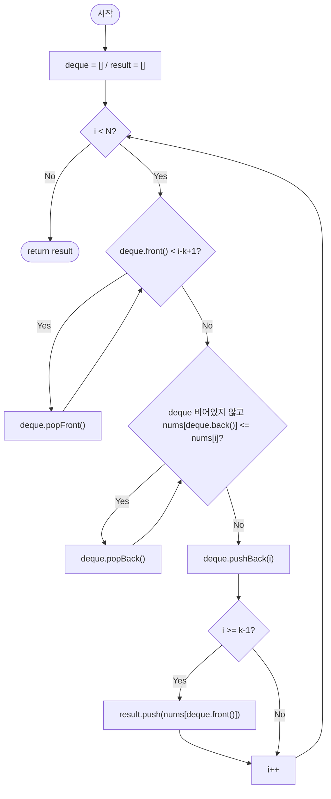

import { AlgorithmSimulation } from "#guide-sim";

# slidingWindowMaximum — 이길 수 없는 후보를 그 자리에서 지우는 이유

## 한눈에 보는 컨셉

크기 `k`의 윈도우가 배열을 한 칸씩 슬라이드할 때마다 최댓값을 물어보는 문제예요. 핵심 관찰은 "현재 원소보다 작으면서 더 왼쪽에 있는 원소는 앞으로 어떤 윈도우에서도 다시는 최댓값이 될 수 없다"는 것입니다. 이런 원소를 발견하는 즉시 후보에서 지워 버리면, 남는 후보들이 값 기준으로 항상 한 방향(단조 감소)으로 정렬된 덱을 이루고, 그 맨 앞이 곧 현재 윈도우의 최댓값이 되어 `O(N)`에 전체 문제가 끝납니다.

## 출발점: 가장 순진한 방법부터

문제를 먼저 정확히 잡을게요.

```ts
function slidingWindowMaximum(nums: number[], k: number): number[]
```

| 파라미터 | 의미 | 제약 |
|----------|------|------|
| `nums` | 정수 배열 | $1 \leq N \leq 100{,}000$, $-10{,}000 \leq nums[i] \leq 10{,}000$ |
| `k` | 윈도우 크기 | $1 \leq k \leq N$ |

**반환값**: 윈도우가 왼쪽부터 오른쪽으로 한 칸씩 이동할 때 각 위치의 최댓값을 담은 배열. 길이는 정확히 $N - k + 1$입니다.

| 입력 | 기대 출력 | 이유 |
|------|-----------|------|
| `k=1` | `nums` 그대로 | 윈도우 크기가 1이라 원소 자신이 곧 최댓값 |
| `k=N` | `[max(nums)]` | 전체 배열이 하나의 윈도우 |
| `[1,1,1,1]`, `k=2` | `[1,1,1]` | 모두 같은 값이어도 정의대로 동작 |
| `[5,4,3,2,1]`, `k=3` | `[5,4,3]` | 단조 감소 입력 |

"윈도우 안의 최댓값"이라는 말을 들으면 가장 정직한 반응은 "그럼 매 윈도우를 그냥 다 훑어보자"예요. 작은 예로 직접 나열해 봅시다.

```text
nums = [4, 9, 2, 7, 5], k = 3

윈도우 [4,9,2] → 4,9,2 세 번 비교 → max 9
윈도우 [9,2,7] → 9,2,7 세 번 비교 → max 9   (9,2는 방금도 봤다!)
윈도우 [2,7,5] → 2,7,5 세 번 비교 → max 7   (2,7은 방금도 봤다!)

원소는 5개뿐인데 비교는 3×3=9번 — 겹치는 구간을 매번 처음부터 다시 본다
```

코드로 옮기면 이렇습니다.

```ts
function slidingWindowMaximumNaive(nums: number[], k: number): number[] {
  const result: number[] = [];
  for (let i = 0; i <= nums.length - k; i++) {
    let maxVal = nums[i]!;
    for (let j = i + 1; j < i + k; j++) {
      if (nums[j]! > maxVal) maxVal = nums[j]!;
    }
    result.push(maxVal);
  }
  return result;
}
```

윈도우마다 $k$번 비교하고 윈도우가 $N-k+1$개이므로 전체 $O(Nk)$예요. 실제 제약 규모로 체감해 보면:

```text
N = 100,000, k = 50,000  (딱 중간 크기)

naive: O(Nk) ≈ 100,000 × 50,000 = 5 × 10^9 번 비교
       1초에 대략 10^8~10^9 번 연산이 한계이니 시간 제한을 훌쩍 넘긴다

목표: O(N) 시간, O(k) 공간
       각 원소가 후보 목록에 최대 한 번 들어가고 한 번 나가게만 관리하면
       윈도우 크기 k와 무관하게 총 작업량이 N에 비례한다
```

인접한 두 윈도우는 $k-1$개의 원소를 공유하는데, 그 공유 부분의 최댓값을 매번 처음부터 다시 계산하는 게 낭비의 정체예요. **"방금 본 원소를 버리지 않고 계속 들고 갈 수는 없을까?"** — 이게 다음 절의 출발점입니다.

### 같은 목표를 노리는 설계가 둘 더 있다 — 둘 다 답은 맞는다

덱을 꺼내기 전에, **훨씬 먼저 떠오르는 설계 둘**을 실명으로 세워 봅시다. 앞의 두 편(`houseRobber`·`longestCommonSubsequence`)에서는 경쟁 설계가 **틀렸는데**, 이번에는 둘 다 **답이 항상 맞습니다.** 갈리는 것은 비용뿐이에요.

```text
직전 최댓값 재사용   최댓값 인덱스를 기억해 둔다. 그것이 윈도우 밖으로 안 나갔으면
                    새로 들어온 원소 하나만 비교하고, 나갔을 때만 윈도우를 다시 훑는다
                    "매번 다 훑을 필요는 없잖아 — 최댓값이 살아 있으면 그냥 두면 되지"

최대 힙 + 지연 삭제   (값, 인덱스) 쌍을 최대 힙에 넣는다. 꼭대기가 윈도우 밖 인덱스면
                    버리고 다시 본다. 안에 있으면 그게 답이다
                    "최댓값을 계속 물어보는 문제니까 우선순위 큐 아닌가"
```

**세 설계와 순진한 순회를 같은 입력에 돌려 원소 접근 횟수를 셌습니다.** 넷이 매번 같은 배열을 돌려주는지도 함께 대조했어요. 먼저 무작위 입력입니다.

```text
무작위 입력, k = N/4         순진한 순회    직전 최댓값 재사용   최대 힙+지연삭제      단조 덱
N =  2,000                    750,500            3,996            4,881        3,993
N =  8,000                 12,002,000           13,997           18,332       15,994
N = 32,000                192,008,000           63,996           73,373       63,991

성장률 r = C(4N)/C(N)          16.00              3.50, 4.57      3.76, 4.00   4.01, 4.00
```

**무작위 입력에서는 셋이 사실상 같습니다.** `N = 32,000`에서 직전 최댓값 재사용이 `63,996`, 단조 덱이 `63,991` — 다섯 번의 차이예요. 여기까지만 재고 "간단한 쪽이 낫다"고 결론 내리면 그대로 당합니다.

```text
적대적 입력(단조 감소), k = N/4   순진한 순회    직전 최댓값 재사용   최대 힙+지연삭제      단조 덱
N =  2,000                       750,500          750,500           27,435        3,500
N =  8,000                    12,002,000       12,002,000          133,719       14,000
N = 32,000                   192,008,000      192,008,000          630,855       56,000

성장률 r = C(4N)/C(N)             16.00            16.00           4.87, 4.72   4.00, 4.00
```

**`[N, N-1, ..., 2, 1]` 같은 단조 감소 배열에서 직전 최댓값 재사용은 순진한 순회와 비용이 한 자리도 다르지 않습니다.** 750,500 대 750,500이에요.

```text
nums = [5, 4, 3, 2, 1],  k = 3

윈도우 [5,4,3]  최댓값 인덱스 0
윈도우 [4,3,2]  인덱스 0 이 밖으로 나갔다  →  윈도우 전체 재스캔
윈도우 [3,2,1]  인덱스 1 이 밖으로 나갔다  →  윈도우 전체 재스캔
                 ↑ 최댓값이 항상 왼쪽 끝이라 매 스텝 밖으로 밀려난다.
                   "재스캔은 가끔만 일어난다"는 전제가 통째로 깨진다
```

힙은 무너지지 않지만 `log` 인수가 붙습니다 — 적대적 입력 `N = 32,000`에서 `630,855` 대 덱 `56,000`으로 11배예요. 성장률도 4.87·4.72로 4를 넘습니다.

| 설계 | 최악 복잡도 | 답 | 무너지는 조건 |
| --- | --- | --- | --- |
| 순진한 순회 | $O(Nk)$ | 정확 | 항상 |
| 직전 최댓값 재사용 | $O(Nk)$ | 정확 | 최댓값이 자주 윈도우를 벗어날 때(단조 감소) |
| 최대 힙 + 지연 삭제 | $O(N \log N)$ | 정확 | 무너지진 않으나 $\log$ 인수가 남는다 |
| 단조 덱 | $O(N)$ | 정확 | 없음 |

**이 편의 경쟁 설계는 "틀린 답"이 아니라 "무너지는 조건"으로 갈립니다.** 그러니 반례를 찾을 것이 아니라 **최악 입력을 지어내야** 하고, 그것이 다음 절에서 세울 관찰의 동기예요 — *최댓값이 밖으로 나가도 다시 훑지 않으려면 무엇을 들고 있어야 하는가.*

## 아이디어 자세히 들여다보기

### 이길 수 없는 후보를 그 자리에서 지우기 — 수식과 그림

직관은 간단해요. 어떤 원소가 새로 들어왔을 때, 그보다 왼쪽에 있으면서 값도 더 작은 원소는 "나이도 많고 힘도 약한" 후보라서 앞으로 절대 최댓값이 될 일이 없습니다 — 그러니 그 자리에서 후보 목록에서 지워 버려도 안전해요.

이 관찰을 세 단계로 쌓아 봅시다.

- **관찰 1**: 윈도우가 오른쪽으로 한 칸 이동하면 왼쪽 원소 하나가 빠지고 오른쪽 원소 하나가 들어옵니다. 최댓값 후보를 잘 관리해 두면 매번 다시 훑지 않고 $O(1)$에 최댓값을 얻을 수 있을 것 같습니다.
- **관찰 2**: 현재 윈도우 안에서 인덱스 $j < i$이고 $nums[j] \leq nums[i]$이면, $j$는 앞으로 어떤 윈도우에서도 최댓값이 될 수 없습니다. $i$가 $j$보다 더 오른쪽에 있어서, $j$가 윈도우 안에 남아 있는 한 $i$도 항상 같이 남아 있고 값은 $i$가 더 크거나 같기 때문이에요.
- **관찰 3**: 이 규칙을 계속 적용하면 살아남는 후보 인덱스들의 `nums` 값이 자연스럽게 앞→뒤로 단조 감소하는 덱(deque)이 만들어집니다. 덱의 맨 앞이 항상 현재 윈도우의 최댓값이에요.

```text
관찰 2 를 눈으로 — 인덱스 j < i 이고 nums[j] <= nums[i] 인 상황

     j           i
     ↓           ↓
 ... 4 ......... 9 ...        윈도우가 오른쪽으로만 움직인다는 것이 전제다

  j 가 윈도우 안에 있다  →  j 보다 오른쪽인 i 도 반드시 윈도우 안에 있다
  그런데 값은 i 가 크거나 같다  →  j 가 최댓값이 되는 윈도우는 존재하지 않는다
  따라서 j 를 지금 지워도 어떤 답도 잃지 않는다
```

이 상태를 정식으로 적어 보면, 덱 안 인덱스 $d_0 < d_1 < \ldots < d_m$에 대해

$$nums[d_0] \geq nums[d_1] \geq \ldots \geq nums[d_m]$$

이 성립합니다. 지켜야 할 불변식은 세 가지이고, 그 아래 그림이 셋을 한 장에 담은 것이에요.

1. 덱 내 모든 인덱스는 현재 윈도우 $[i-k+1,\, i]$ 안에 있다.
2. 덱 내 `nums` 값은 앞에서 뒤로 단조 비증가다.
3. 덱이 비어 있지 않으면 `nums[deque.front()]`가 현재 윈도우의 최댓값이다.

```text
현재 윈도우:  [ i-k+1 .................. i ]
덱(인덱스):         d0     d1      d2         ← 전부 윈도우 안, 오름차순
값:                 9      5       5           ← 앞→뒤 단조 비증가
                    ↑
              front = 현재 윈도우의 최댓값
```

**왜 하필 단조 감소여야 할까요?** 만약 반대로 단조 증가 덱을 쓰면 맨 앞은 최솟값이 되어 버려서, 최댓값을 읽으려면 덱 전체를 $O(k)$에 훑어야 합니다. 최댓값을 앞에서 $O(1)$에 읽고 싶다면, 최댓값 후보가 항상 맨 앞에 있도록 정렬 방향을 맞춰야 해요.

**후보가 사라지는 이유는 두 가지뿐이고, 둘은 서로 다른 성질을 봅니다.** 하나는 나이고 하나는 힘이에요.

```text
후보 하나가 탈락하는 두 가지 사유

  나이로 탈락    윈도우가 지나가 버려 구간 밖으로 나갔다
                 값이 아무리 커도 소용없다 — 셀 자격 자체를 잃는다
                 가장 오래된 후보에게만 일어난다 (덱의 앞쪽)

  힘으로 탈락    자기보다 오른쪽에 있으면서 값도 크거나 같은 후보가 나타났다
                 관찰 2 — 그 후보가 살아 있는 한 나는 절대 못 이긴다
                 가장 최근 후보들에게 일어난다 (덱의 뒤쪽)
```

두 사유가 덱의 **양 끝**에서 각각 일어난다는 것이 이 자료구조가 덱이어야 하는 이유입니다. 한쪽만 열려 있으면 둘 중 하나를 처리할 수 없어요.

> 앞(front)은 나이로 지우고, 뒤(back)는 힘으로 지운다.

`nums = [1, 3, -1, -3, 5]`, `k = 3`의 한 시점을 스냅샷으로 보면 두 사유가 한 장에 들어옵니다.

```text
윈도우가 [2, 4] 로 막 옮겨 온 순간, 후보 자리에 있던 값들:  3, -1, -3   그리고 새 값 5 도착

  3   나이로 탈락 — 3 은 인덱스 1 에 있고 윈도우는 인덱스 2 부터다. 값이 가장 컸는데도 나간다
 -1   힘으로 탈락 — 오른쪽에 5 가 있고 -1 < 5 다
 -3   힘으로 탈락 — 같은 이유
  5   남는다

남은 후보 집합 = {5}       윈도우 [2,4] = [-1, -3, 5] 의 최댓값 5  ✓
```

**여기서 값이 가장 큰 `3`이 탈락한다는 것이 이 절의 요점이에요.** 후보 자격은 값만으로 정해지지 않습니다 — 구간 안에 있어야 한다는 조건이 먼저고, 그 조건은 값을 보지 않아요. 실제 코드가 이 두 사유를 어떤 순서로 어떻게 판정하는지는 뒤의 트레이스 절에서 값과 함께 따라갑니다.

### 단서를 설명해 주는 이론 — 상환 분석(Amortized Analysis)

방금 세운 알고리즘을 코드로 옮기기 전에, "정말 $O(N)$이 맞는지"를 짚고 넘어가야 해요. 한 스텝에서 뒤쪽 청소(`popBack`)가 몇 번 일어날지는 미리 알 수 없습니다 — 극단적으로는 덱에 쌓여 있던 후보 전부가 한 번에 지워질 수도 있어요. 이렇게 **스텝 하나의 비용은 들쭉날쭉한데 전체 비용은 안정적으로 작다**는 걸 증명하는 도구가 상환 분석이고, 그중 가장 단순한 방법이 **총합법(aggregate method)**입니다: 개별 연산 하나하나의 비용을 재는 대신, $N$번의 연산 전체가 쓰는 총비용을 한 번에 세어 평균을 냅니다.

이 문제에 적용하면 이렇습니다.

- **pushBack은 정확히 $N$번** 일어납니다 — 반복문이 $i=0..N-1$을 돌면서 매번 정확히 한 번씩 `deque.push(i)`를 호출하기 때문이에요.
- **popBack과 popFront를 합친 횟수는 최대 $N$번**입니다 — 인덱스 하나는 덱에 최대 한 번 들어가고, 들어간 뒤에는 popBack 아니면 popFront로 딱 한 번만 나갈 수 있습니다(한 번 나가면 다시는 들어오지 않아요). 그러니 "나가는 사건"의 총합은 "들어온 사건"의 총합인 $N$을 넘을 수 없습니다.

```text
인덱스 하나의 일생

  들어온다(pushBack)  →  덱에 머문다  →  나간다(popBack 또는 popFront)  →  끝
       정확히 1번                              최대 1번            다시 안 들어온다

  들어온 사건 총합 = N        나간 사건 총합 ≤ N        합 ≤ 2N
```

두 개를 더하면 전체 덱 연산 횟수는 $N + N = 2N$번을 넘지 않고, 이것이 $O(N)$입니다. 대표 예시 `nums=[1,3,-1,-3,5,3,6,7]`, `k=3`에서 실제로 세어 보면 `pushBack=8`, `popFront=1`, `popBack=6`, 합계 `15`회로 상한 $2N=16$ 안에 들어옵니다. $N=100{,}000$짜리 무작위 배열로 재현해도 총합은 `199,993`회로 $2N=200{,}000$을 넘지 않습니다.

**여기서 기억해 둘 것**은, 이 상환 분석이 보장하는 건 "덱에서 원소를 밀어 넣고 빼는 **횟수**가 $O(N)$"이라는 점이지, "각 연산 **한 번의 비용**이 항상 $O(1)$"이라는 보장은 아니라는 사실이에요. 이 구분이 나중에 "더 빠르게 만들 단서 찾기"에서 다시 등장합니다.

### 셈을 맡는 자료구조 — 단조 큐와 덱

지금까지 설계한 "값이 앞→뒤로 단조 비증가인 인덱스 덱"은 이 프로젝트에 이미 전용 가이드가 있는 자료구조예요. 정식 이름은 **단조 큐(Monotonic Queue)**이고, 앞뒤 양쪽에서 $O(1)$에 넣고 뺄 수 있어야 한다는 요구는 **덱(Deque)**의 역할입니다. 두 가이드 모두 여기서 다시 설명하지 않고 링크로 남겨 둘게요.

- [MonotonicQueue 가이드](../../../data-structures/linear/monotonicQueue/monotonicQueue-guide.mdx) — 이 절에서 세운 불변식·연산의 정식 스펙.
- [Deque 가이드](../../../data-structures/linear/deque/deque-guide.mdx) — 앞뒤 $O(1)$ 삽입·삭제를 실제로 구현하는 방법(뒤에서 "최적화 코드"를 만들 때 다시 참고합니다).

### 왜 모순 없이 작동하는가

덱의 맨 앞이 항상 현재 윈도우의 최댓값이라는 사실을 귀납으로 증명해 볼게요.

**기저**: $i=0$ 직전, 덱은 비어 있습니다. 세 불변식 모두 공허하게 성립합니다.

**귀납 가정**: $i$번째 반복을 시작하기 직전까지 불변식이 성립한다고 합시다.

**귀납 단계**: $i$번째 반복에서 일어나는 사건은 정확히 세 가지뿐이고, 이 세 가지 말고 덱을 바꾸는 다른 경로는 없습니다(경우의 완전성).

1. **앞쪽 만료 제거**: `deque.front() < i-k+1`인 동안 `popFront`합니다. 제거되는 인덱스는 이제 윈도우 밖이므로 더는 후보일 수 없고, 앞에서만 제거하므로 남은 인덱스의 순서·단조성은 그대로 유지됩니다.
2. **뒤쪽 값 청소**: `nums[deque.back()] <= nums[i]`인 동안 `popBack`합니다. 제거되는 인덱스 $j$는 관찰 2에 의해 다시는 최댓값이 될 수 없으므로 제거해도 정답을 잃지 않습니다. 이 루프가 멈추면 남은 덱의 모든 값이 $nums[i]$ 이상이므로, $i$를 뒤에 붙여도 단조 비증가가 그대로 유지됩니다.
3. **현재 인덱스 추가**: `pushBack(i)`. $i$는 정의상 현재 윈도우 안이므로 불변식 1이 유지됩니다.

세 사건이 끝나면 불변식 1~3이 모두 다시 성립하고, 불변식 3에 의해 `nums[deque.front()]`는 정확히 현재 윈도우의 최댓값입니다. $i \geq k-1$일 때만 기록하므로, 기록되는 값은 항상 완성된 윈도우의 최댓값입니다.

**여기서 헷갈리기 쉬운 포인트**를 두 가지 짚어 둘게요.

- **윈도우가 아직 채워지지 않았는데 기록해 버리는 실수입니다.** `i >= k-1` 가드를 빼면, 아직 $k$개가 모이지 않은 상태에서도 매 스텝 결과를 기록하게 됩니다. 실제로 대표 예시에 이 가드를 빼고 돌리면 `[1, 3, 3, 3, 5, 5, 6, 7]`(길이 8)이 나와요 — 정답 `[3, 3, 5, 5, 6, 7]`(길이 6)과 비교하면 앞에 `1`과 `3`이 잘못 끼어들고, 전체 결과의 인덱스도 밀립니다.
- **앞쪽 만료 조건의 부등호 방향입니다.** `deque.front() < i-k+1`이 맞는 조건인데, 실수로 `<=`를 쓰면 아직 윈도우 안에 남아 있어야 할 왼쪽 경계 인덱스까지 지워 버립니다. 같은 대표 예시로 이 실수를 재현하면 두 번째 결과가 `3`이 아니라 `-1`로 나옵니다(`[3, -1, 5, 5, 6, 7]`) — 아직 유효한 후보 `nums[1]=3`을 성급하게 지워서, 그보다 값이 작은 `-1`이 대신 최댓값 자리를 차지해 버린 거예요.

```text
두 실수의 실제 반환값 (nums=[1,3,-1,-3,5,3,6,7], k=3, 정답 [3, 3, 5, 5, 6, 7])

  ④ 가드 누락        [1, 3, 3, 3, 5, 5, 6, 7]   길이 8 — 앞에 1·3 이 끼고 전체가 밀린다
  ② 를 <= 로         [3, -1, 5, 5, 6, 7]        길이는 맞고 두 번째 값만 틀린다
                          ↑ 아직 유효한 nums[1]=3 을 성급히 지워 -1 이 대표가 됐다
```

참고로 뒤쪽 청소 조건은 `<=` 대신 `<`를 써도(즉 같은 값을 밀어내지 않아도) 반환되는 **값**은 동일합니다 — 어느 인덱스가 대표로 남는지만 달라질 뿐, 최댓값 자체는 바뀌지 않기 때문이에요. 다만 `<=`를 쓰면 중복값에서 덱이 길어지는 것을 막을 수 있어 권장됩니다.

```text
전부 같은 값 2,000개 · k = 100 에서 덱의 최대 길이

  <= 로 청소:    1     같은 값이 오면 앞엣것을 밀어내므로 후보가 하나만 남는다
  <  로 청소:  100     같은 값을 안 밀어내므로 윈도우 크기만큼 그대로 쌓인다

값은 같지만 공간이 k 배 차이 난다 — 정답이 아니라 비용에서 갈리는 선택이다
```

엣지 케이스도 불변식 위에서 점검해 볼게요.

```text
k=1                     → 매 스텝 자기 자신만 윈도우 → 입력 배열 그대로 반환
k=N                     → 윈도우가 하나뿐 → 전체 최댓값 하나만 반환
전부 동일값 [1,1,1,1]    → 뒤쪽 청소가 <=이므로 항상 새 값이 이전 값을 대체 → 정상 동작
단조 감소 [5,4,3,2,1]    → 뒤쪽 청소가 거의 일어나지 않아 덱이 윈도우 크기만큼 계속 자람
                           (이 패턴이 바로 뒤에서 다룰 성능 함정의 무대입니다)
```

## 아이디어를 코드로 옮기기

앞 절에서 세운 규칙을 그대로 옮겨 봅니다. 덱은 가장 직관적인 형태 — 인덱스를 담는 배열 — 로 표현하고, 앞에서 빼는 연산은 `Array.prototype.shift()`를 씁니다.

```ts
function slidingWindowMaximumShiftDeque(nums: number[], k: number): number[] {
  const result: number[] = [];
  const deque: number[] = []; // 인덱스 저장, 앞→뒤 값 단조 비증가

  for (let i = 0; i < nums.length; i++) {                                    // ① 남은 원소가 있는가
    while (deque.length > 0 && deque[0]! < i - k + 1) {                      // ② 앞쪽 만료 — 범위로 지운다
      deque.shift();
    }
    while (deque.length > 0 && nums[deque[deque.length - 1]!]! <= nums[i]!) { // ③ 뒤쪽 청소 — 값으로 지운다
      deque.pop();
    }
    deque.push(i); // 현재 인덱스 추가
    if (i >= k - 1) {                                                        // ④ 윈도우가 완성됐는가
      result.push(nums[deque[0]!]!);
    }
  }
  return result;
}
```

**가장 실수가 잦은 줄은 ④의 `i >= k - 1` 가드입니다.** 이 가드가 없으면 윈도우가 채워지기도 전에 결과를 기록해 길이와 값이 모두 어긋나요 — 대표 예시에서 정답 `[3, 3, 5, 5, 6, 7]`(길이 6) 대신 `[1, 3, 3, 3, 5, 5, 6, 7]`(길이 8)이 나옵니다.

이 절은 코드를 **정적으로** 읽습니다. 실제로 덱이 어떻게 움직이는지는 다음 절이 끝까지 보여 줄게요.

```text
덱에 담는 것    값이 아니라 인덱스다. ② 가 "이 후보가 얼마나 오래됐는가"를 물어야 하는데
                값만 담으면 그 정보를 되짚을 수단이 없다

② 와 ③ 이 while  한 스텝에서 여러 개가 한꺼번에 밀려나거나 청소될 수 있다
                (뒤 트레이스 T6 에서 ② 한 번 + ③ 두 번이 같은 스텝에 일어난다)

② 와 ③ 의 이유    ② 는 범위로 지우고 ③ 은 값으로 지운다. 조건식이 보는 대상 자체가 다르다
                — ② 는 인덱스를, ③ 은 nums 값을 본다
```

## 코드를 한 번 끝까지 굴려 보기

고정 입력 `nums = [1, 3, -1, -3, 5, 3, 6, 7]`, `k = 3`에 위 기본 구현을 넣고 끝까지 굴려 봅니다. 아래 `실행 시각화` 절의 시뮬레이션과 **같은 입력**이에요.

```text
인덱스 :  0   1   2   3   4   5   6   7
nums   :  1   3  -1  -3   5   3   6   7      k = 3, 윈도우 왼쪽 경계 L = i-k+1
```

**T1 — 초기화.** 덱과 결과 배열이 둘 다 비어 있습니다.

```text
T1   덱 = []   결과 = []
```

**T2 — `i = 0`. ②③④가 전부 거짓이라 넣기만 합니다.**

```text
T2   ① 0 < 8 참
     ② front 없음         → 건너뜀
     ③ back 없음          → 건너뜀
     pushBack 0           덱=[0]  값=[1]
     ④ 0 >= 2 ? 거짓      → 기록 안 함 (윈도우 미완성)
     결과=[]
```

**T3 — `i = 1`. ③이 처음으로 참이 됩니다.**

```text
T3   ① 1 < 8 참
     ② front=0 < L=-1 ? 거짓
     ③ nums[back=0]=1 <= nums[1]=3 ? 참  →  popBack 0
        "더 왼쪽에 있는데 값도 작다" — 앞으로 어떤 윈도우에서도 못 이긴다
     pushBack 1           덱=[1]  값=[3]
     ④ 1 >= 2 ? 거짓
     결과=[]
```

**T4 — `i = 2`. ④가 처음으로 참이 되어 첫 답이 나옵니다.**

```text
T4   ① 2 < 8 참
     ② front=1 < L=0 ? 거짓
     ③ nums[back=1]=3 <= nums[2]=-1 ? 거짓  →  3 은 -1 에게 안 밀린다
     pushBack 2           덱=[1, 2]  값=[3, -1]   ← 단조 비증가가 유지된다
     ④ 2 >= 2 ? 참        →  result.push(nums[front=1]=3)
     결과=[3]
```

**T5 — `i = 3`. 덱이 가장 길어지는 자리입니다.**

```text
T5   ① 3 < 8 참
     ② front=1 < L=1 ? 거짓   ← 경계 위에 딱 걸쳐 있다. < 이지 <= 가 아닌 이유가 여기다
     ③ nums[back=2]=-1 <= nums[3]=-3 ? 거짓
     pushBack 3           덱=[1, 2, 3]  값=[3, -1, -3]
     ④ 3 >= 2 ? 참        →  result.push(3)
     결과=[3, 3]
```

**T6 — `i = 4`. ②와 ③이 같은 스텝에서 세 개를 치우는 자리입니다.**

```text
T6   ① 4 < 8 참
     ② front=1 < L=2 ? 참   →  popFront 1
        값이 작아서가 아니다 — 3 은 덱에서 가장 큰 값이었다. 너무 오래돼서 나간다
     ③ nums[back=3]=-3 <= nums[4]=5 ? 참  →  popBack 3
        nums[back=2]=-1 <= nums[4]=5 ? 참  →  popBack 2
     pushBack 4           덱=[4]  값=[5]
     ④ 4 >= 2 ? 참        →  result.push(5)
     결과=[3, 3, 5]
```

②와 ③이 **서로 다른 이유로** 원소를 치운다는 것이 이 한 스텝에 다 들어 있어요 — ②는 나이 때문에 맨 앞을, ③은 값 때문에 맨 뒤를 지웁니다.

**T7 — `i = 5`. 둘 다 거짓이라 덱이 자랍니다.**

```text
T7   ① 5 < 8 참
     ② front=4 < L=3 ? 거짓
     ③ nums[back=4]=5 <= nums[5]=3 ? 거짓
     pushBack 5           덱=[4, 5]  값=[5, 3]
     ④ 5 >= 2 ? 참        →  result.push(5)
     결과=[3, 3, 5, 5]
```

**T8 — `i = 6`. ③이 두 개를 연달아 치웁니다.**

```text
T8   ① 6 < 8 참
     ② front=4 < L=4 ? 거짓
     ③ nums[back=5]=3 <= nums[6]=6 ? 참  →  popBack 5
        nums[back=4]=5 <= nums[6]=6 ? 참  →  popBack 4
     pushBack 6           덱=[6]  값=[6]
     ④ 6 >= 2 ? 참        →  result.push(6)
     결과=[3, 3, 5, 5, 6]
```

**T9 — `i = 7`. 마지막 스텝입니다.**

```text
T9   ① 7 < 8 참
     ② front=6 < L=5 ? 거짓
     ③ nums[back=6]=6 <= nums[7]=7 ? 참  →  popBack 6
     pushBack 7           덱=[7]  값=[7]
     ④ 7 >= 2 ? 참        →  result.push(7)
     결과=[3, 3, 5, 5, 6, 7]
```

**T10 — ① 거짓, 반환.**

```text
T10  ① 8 < 8 거짓 → 탈출
     반환 [3, 3, 5, 5, 6, 7]      길이 N-k+1 = 8-3+1 = 6  ✓

     검산  윈도우 [1,3,-1]→3 · [3,-1,-3]→3 · [-1,-3,5]→5 · [-3,5,3]→5 · [5,3,6]→6 · [3,6,7]→7
```

네 자리 ①②③④를 참·거짓 양쪽으로 모두 밟았습니다 — ①은 T2~T9에서 참이고 T10에서 거짓, ②는 T6에서 참이고 T3~T5·T7~T9에서 거짓, ③은 T3·T6·T8·T9에서 참이고 T4·T5·T7에서 거짓, ④는 T4~T9에서 참이고 T2·T3에서 거짓이에요. 반환값은 아래 시뮬레이션의 마지막 프레임과 같습니다.

## 더 빠르게 만들 단서 찾기

알고리즘 자체는 맞습니다 — 상환 분석이 보장하듯 `push`/`pop` **횟수**는 $O(N)$이에요. 그런데 **T6의 `popFront`** 한 줄이 실제로 무슨 일을 하는지 봅시다. `Array.prototype.shift()`입니다.

```text
T6 의 popFront:  덱 = [1, 2, 3]  →  shift() 로 1 제거

내부적으로 일어나는 일:
  2 → 자리 0으로,  3 → 자리 1로
  (남은 원소 전부를 한 칸씩 밀어야 "배열의 인덱스 0이 항상 맨 앞"이라는 배열의 규약이 유지된다)

→ shift() 한 번의 비용은 O(그 시점 덱 길이) — 상수 시간이 아니다
```

T6에서는 덱이 세 개뿐이라 두 칸만 밀면 됐어요. 문제는 **덱이 계속 크게 유지되는 입력**입니다. 앞 절 엣지 케이스에서 예고한 단조 감소 배열이 정확히 그 무대예요 — ③이 거의 안 일어나 덱이 $k$에 가깝게 부풀어 있는데, ②는 매 스텝 앞에서 하나씩 빼냅니다.

```text
단조 감소 입력, k = N/2 에서 shift 가 실제로 옮긴 칸 수

      N     popFront 호출 횟수     옮긴 칸 수      원형 버퍼로 바꾸면
  2,000                 1,000         999,000              0
  8,000                 4,000      15,996,000              0
 32,000                16,000     255,984,000              0
                          ↑ N 이하 — 상환 분석이 보장한 그대로다
                                        ↑ 성장률 16 = O(N²) 로 돌아갔다
```

앞 절에서 *"상환 분석이 보장하는 건 연산 **횟수**가 $O(N)$이라는 것이지, 연산 한 번의 **비용**이 $O(1)$이라는 뜻은 아니다"* 라고 미리 일러둔 게 이 지점이에요. **호출 횟수는 약속을 지켰는데 총비용이 $O(Nk)$로 돌아갔습니다** — 그리고 그 값이 이 절 첫머리에서 순진한 순회를 눕혔던 바로 그 규모예요.

## 단서를 최적화로 연결하기

"뒤로 밀어 자리를 맞추는" 작업이 낭비라면, 애초에 그 자리를 맞출 필요가 없도록 만들면 됩니다. 배열의 실제 원소를 옮기는 대신, "지금 유효한 구간이 어디부터 어디까지인가"를 **포인터 두 개**로만 표시하는 겁니다.

```text
Before (shift 기반):           After (포인터 기반):

buf = [i1,i2,i3,i4,i5]         buf = [i1,i2,i3,i4,i5]  (칸 수는 고정)
        ↑ shift 시 전부 이동      head ─┘        └─ tail (다음에 쓸 자리, 계속 증가)

popFront: head++  만 하면 끝 (원소 이동 없음)
popBack : tail--  만 하면 끝 (원소 이동 없음)
```

여기서 목표 복잡도(공간 $O(k)$)를 잊으면 안 됩니다. 덱은 정의상 어느 시점에도 원소가 최대 $k$개뿐이에요(윈도우 크기 자체가 $k$이니, 후보가 그보다 많이 살아남을 수 없습니다). 그러니 배열을 딱 $k$칸만 고정으로 마련하고, `head`·`tail`은 계속 증가하는 논리적 포인터로 두되 **실제 배열 접근은 `포인터 % k`로 순환**시키면 됩니다 — [MonotonicQueue 가이드](../../../data-structures/linear/monotonicQueue/monotonicQueue-guide.mdx)의 범용 덱이 쓰는 "낭비 공간이 쌓이면 압축한다"는 절차조차 필요 없습니다. 이 문제는 최대 크기를 미리 알고 있으니, 원형 버퍼(circular buffer)로 처음부터 칸을 재사용하면 됩니다. 유지할 불변식은 하나: **`buf[head % k .. (tail-1) % k]`가 항상 현재 윈도우의 유효한 후보 구간**이라는 것.

## 최적화 코드

바뀌는 곳은 덱의 표현뿐입니다. 배열+`shift`/`pop`/`push`를, 크기 $k$짜리 원형 버퍼+`head`/`tail` 두 정수(모듈로 접근)로 바꿉니다.

```ts
function slidingWindowMaximum(nums: number[], k: number): number[] {
  const n = nums.length;
  const result: number[] = [];
  const buf = new Array<number>(k); // 덱은 어느 시점에도 최대 k개만 담으므로 크기 k로 충분
  let head = 0; // 논리적 포인터(계속 증가) — 실제 접근은 buf[포인터 % k]
  let tail = 0;

  for (let i = 0; i < n; i++) {                                     // ① 남은 원소가 있는가
    while (tail > head && buf[head % k]! < i - k + 1) {             // ② 앞쪽 만료 — 범위로 지운다
      head++; // popFront: 포인터만 전진, 원소 이동 없음
    }
    while (tail > head && nums[buf[(tail - 1) % k]!]! <= nums[i]!) { // ③ 뒤쪽 청소 — 값으로 지운다
      tail--; // popBack: 포인터만 후진
    }
    buf[tail % k] = i; // pushBack
    tail++;
    if (i >= k - 1) {                                               // ④ 윈도우가 완성됐는가
      result.push(nums[buf[head % k]!]!);
    }
  }
  return result;
}
```

트레이스로 대조하면 **①②③④의 판정이 글자 그대로 남고, 덱을 만지는 방식만 바뀝니다.**

| 트레이스 | `shift` 기반이 한 일 | 원형 버퍼가 하는 일 |
| --- | --- | --- |
| T6 ② `popFront 1` | 남은 두 원소를 한 칸씩 당긴다 | `head++` — 원소는 그대로 |
| T6 ③ `popBack 3`·`popBack 2` | `pop()` 두 번(끝에서 빼는 것은 원래 싸다) | `tail--` 두 번 |
| T6 `pushBack 4` | `push()` | `buf[tail % k] = 4` |
| T4 ④ `nums[front]` 읽기 | `deque[0]` | `buf[head % k]` |

**바뀐 것은 ②뿐이에요.** ③④는 원래도 끝에서만 만지니 쌀 수밖에 없고, 비싼 것은 앞에서 빼는 ② 하나였습니다.

```text
단조 감소 입력, k = N/2 에서 옮긴 칸 수

      N     shift 기반      원형 버퍼
  2,000        999,000             0
  8,000     15,996,000             0
 32,000    255,984,000             0

성장률 16 = O(N²)  →  0. 옮길 일이 아예 없어졌으므로 배율이 아니라 항이 사라진 것이다
```

**가장 중요한 줄은 `while (tail > head && ...)`의 종료 조건입니다.** `deque.length > 0` 대신 `tail > head`로 "비어있음"을 판정해요 — 물리적으로 원소를 지우지 않으니 배열 길이가 아니라 두 논리적 포인터의 차이가 곧 덱의 실제 크기입니다.

이 조건을 `tail >= head`처럼 잘못 쓰면 `head === tail`(빈 덱)인데도 루프가 한 번 더 돌아 존재하지 않는 원소를 읽게 됩니다. 그 외에 놓치기 쉬운 지점 하나 — **배열 접근은 항상 `% k`를 거칩니다.**

```text
head · tail   원형 버퍼 한 바퀴를 넘어 계속 커지는 논리적 값이다
실제 칸 번호   buf[head % k], buf[tail % k] — 나머지 연산은 접근할 때만 붙인다

% k 를 빼먹으면 tail 이 k 를 넘는 순간 존재하지 않는 칸에 쓴다
공간은 크기 k 짜리 배열 하나 — 애초 목표였던 O(k) 를 그대로 지킨다
```

더 최적화할 여지가 있을까요? 이 알고리즘은 이미 입력을 한 번만 훑고(각 인덱스 상수 시간 처리), 출력 $N-k+1$개를 전부 채워야 하므로 $\Omega(N)$ 하한을 갖습니다 — 이미 그 하한에 도달했으니 점근적으로 더 줄일 수 없습니다. 참고로 "임의의 구간 $[l, r]$에 대한 최댓값"처럼 **윈도우가 슬라이드하지 않고 아무 데나 질의**하는 문제라면 희소 테이블(Sparse Table)로 전처리 $O(N \log N)$ + 질의당 $O(1)$을 내는 특화 해법이 따로 있습니다. 그럼에도 이 알고리즘을 배우는 이유는 **한 번의 순회로 끝나는 스트리밍 성격**이에요 — 전처리 없이 데이터가 들어오는 대로 바로 처리할 수 있다는 점이 슬라이딩 전용 문제에서는 더 유리합니다.

## 실행 시각화

입력 `nums = [1, 3, -1, -3, 5, 3, 6, 7]`, `k = 3`에 대해 단조 감소 덱으로 각 윈도우의 최댓값을 구하는 과정입니다. `array` 패널에서 `highlight`(빨강)는 현재 처리 중인 인덱스 `i`, `pointers`는 윈도우 왼쪽 경계 `L = i-k+1`과 `i`, `marked`(회색)는 현재 윈도우 구간입니다. `keyValue` 패널은 덱(인덱스, 앞→뒤 단조 감소)과 결과 배열이에요. 프레임마다 대응하는 트레이스 단계를 `trace` 필드에 적어 두었어요. 실제 반환값은 `[3, 3, 5, 5, 6, 7]`(길이 `N-k+1 = 6`)이며, 시뮬레이션 마지막 프레임의 결과와 일치합니다.

> 대화형 시뮬레이션은 MDX 런타임에서 표시됩니다.

export const nums = [1, 3, -1, -3, 5, 3, 6, 7];

export const steps = [
  {
    trace: "T2",
    title: "i=0: nums[0]=1",
    detail: "덱 비어있음 → 0 추가. 윈도우 미완성(i<k-1).",
    array: nums,
    highlight: [0],
    pointers: { i: 0 },
    entries: [
      { label: "덱 (인덱스)", value: "[0]" },
      { label: "덱 값", value: "[1]" },
      { label: "결과", value: "[]" },
    ],
  },
  {
    trace: "T3",
    title: "i=1: nums[1]=3",
    detail: "뒤에서 nums[0]=1 <= 3 제거. 1 추가. 윈도우 미완성.",
    array: nums,
    highlight: [1],
    pointers: { i: 1 },
    entries: [
      { label: "덱 (인덱스)", value: "[1]" },
      { label: "덱 값", value: "[3]" },
      { label: "결과", value: "[]" },
    ],
  },
  {
    trace: "T4",
    title: "i=2: nums[2]=-1, 윈도우 [0,2] 완성",
    detail: "뒤에서 nums[1]=3 > -1 유지. 2 추가. i>=k-1 → 앞 nums[1]=3 기록.",
    array: nums,
    highlight: [2],
    marked: [0, 1, 2],
    pointers: { L: 0, i: 2 },
    entries: [
      { label: "덱 (인덱스)", value: "[1, 2]" },
      { label: "덱 값", value: "[3, -1]" },
      { label: "결과", value: "[3]" },
    ],
  },
  {
    trace: "T5",
    title: "i=3: nums[3]=-3, 윈도우 [1,3]",
    detail: "앞 1은 윈도우 내(>=L=1) 유지. 뒤 nums[2]=-1 > -3 유지. 3 추가. 앞 nums[1]=3 기록.",
    array: nums,
    highlight: [3],
    marked: [1, 2, 3],
    pointers: { L: 1, i: 3 },
    entries: [
      { label: "덱 (인덱스)", value: "[1, 2, 3]" },
      { label: "덱 값", value: "[3, -1, -3]" },
      { label: "결과", value: "[3, 3]" },
    ],
  },
  {
    trace: "T6",
    title: "i=4: nums[4]=5, 윈도우 [2,4]",
    detail: "앞 1 < L=2 → 제거. 뒤에서 -3,-1,(이전 front 3 제거됨) 모두 <=5 제거. 4 추가. 앞 nums[4]=5 기록.",
    array: nums,
    highlight: [4],
    marked: [2, 3, 4],
    pointers: { L: 2, i: 4 },
    entries: [
      { label: "덱 (인덱스)", value: "[4]" },
      { label: "덱 값", value: "[5]" },
      { label: "결과", value: "[3, 3, 5]" },
    ],
  },
  {
    trace: "T7",
    title: "i=5: nums[5]=3, 윈도우 [3,5]",
    detail: "앞 4 >= L=3 유지. 뒤 nums[4]=5 > 3 유지. 5 추가. 앞 nums[4]=5 기록.",
    array: nums,
    highlight: [5],
    marked: [3, 4, 5],
    pointers: { L: 3, i: 5 },
    entries: [
      { label: "덱 (인덱스)", value: "[4, 5]" },
      { label: "덱 값", value: "[5, 3]" },
      { label: "결과", value: "[3, 3, 5, 5]" },
    ],
  },
  {
    trace: "T8",
    title: "i=6: nums[6]=6, 윈도우 [4,6]",
    detail: "앞 4 >= L=4 유지. 뒤에서 nums[5]=3<=6, nums[4]=5<=6 모두 제거. 6 추가. 앞 nums[6]=6 기록.",
    array: nums,
    highlight: [6],
    marked: [4, 5, 6],
    pointers: { L: 4, i: 6 },
    entries: [
      { label: "덱 (인덱스)", value: "[6]" },
      { label: "덱 값", value: "[6]" },
      { label: "결과", value: "[3, 3, 5, 5, 6]" },
    ],
  },
  {
    trace: "T9",
    title: "i=7: nums[7]=7, 윈도우 [5,7]",
    detail: "앞 6 >= L=5 유지. 뒤 nums[6]=6<=7 제거. 7 추가. 앞 nums[7]=7 기록.",
    array: nums,
    highlight: [7],
    marked: [5, 6, 7],
    pointers: { L: 5, i: 7 },
    entries: [
      { label: "덱 (인덱스)", value: "[7]" },
      { label: "덱 값", value: "[7]" },
      { label: "결과", value: "[3, 3, 5, 5, 6, 7]" },
    ],
  },
  {
    trace: "T10",
    title: "완료: 결과 = [3, 3, 5, 5, 6, 7]",
    detail: "순회 종료. 길이 N-k+1 = 6의 각 윈도우 최댓값 배열을 반환한다.",
    array: nums,
    marked: [5, 6, 7],
    entries: [
      { label: "결과", value: "[3, 3, 5, 5, 6, 7]" },
    ],
  },
];

<AlgorithmSimulation view={["array", "keyValue"]} steps={steps} title="슬라이딩 윈도우 최댓값: nums=[1,3,-1,-3,5,3,6,7], k=3" />

## 흐름 한눈에 보기



**핵심 불변식**: 임의 시점에 덱 내 인덱스들은 앞에서 뒤로 `nums` 값이 단조 비증가이며, 모두 현재 윈도우 $[i-k+1, i]$ 안에 있습니다. 덱이 비어 있지 않으면 `nums[deque.front()]`가 정확히 현재 윈도우의 최댓값입니다.

## 스스로 점검하기

1. `nums = [9, 4, 8, 2, 6]`, `k = 2`일 때 각 스텝의 덱(인덱스·값)과 최종 결과를 손으로 채워 보세요. (힌트: `i=1`에서 `nums[0]=9`는 `nums[1]=4`보다 크므로 뒤쪽 청소에서 살아남습니다. 최종 결과는 `[9, 8, 8, 6]`입니다.)
2. 앞쪽 만료 조건 `deque.front() < i-k+1`을 실수로 `deque.front() <= i-k+1`로 쓰면, 대표 예시 `nums=[1,3,-1,-3,5,3,6,7]`, `k=3`에서 두 번째 결과값이 왜 `3`이 아니라 `-1`이 되는지 어느 인덱스가 성급하게 지워지는지 짚어 추적해 보세요.
3. 이 배열이 **원형(circular)**이어서 마지막 원소 다음이 다시 첫 원소로 이어진다면, 즉 윈도우가 배열 끝을 넘어 앞쪽으로 다시 진입할 수 있다면, 지금의 인덱스 기반 만료 판정(`< i-k+1`)을 어떻게 바꿔야 할까요? (힌트: 인덱스를 실제 배열 길이의 두 배까지 가상으로 확장하고 `nums[i % N]`으로 접근하는 방법을 생각해 보세요.)
