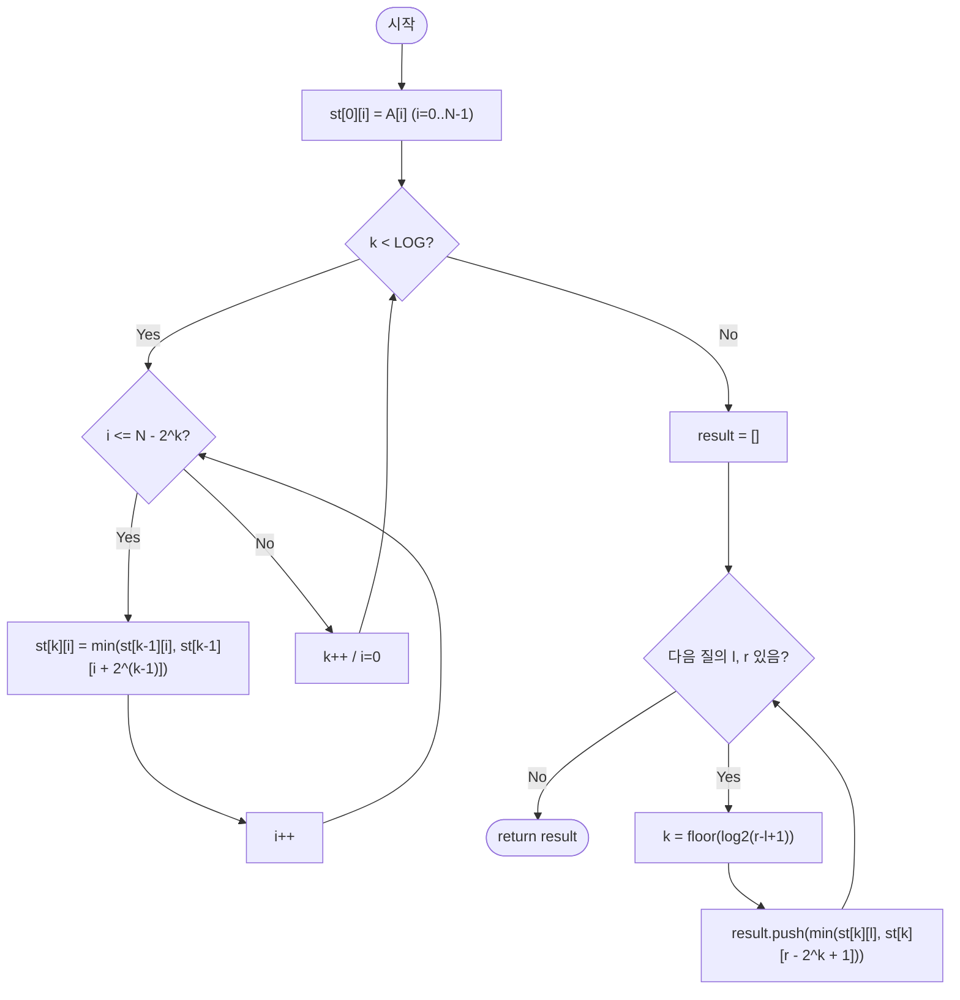

import { AlgorithmSimulation } from "#guide-sim";

# sparseTableRangeMin — 겹쳐도 상관없는 두 구간이면 답이 흔들리지 않는 이유

## 한눈에 보는 컨셉

배열이 더는 바뀌지 않는다면, 질의가 아무리 많이 들어와도 매번 처음부터 훑을 필요가 없어요. `min` 연산은 같은 원소를 두 번 세어도 결과가 그대로인 성질(멱등성)이 있는데, 이 성질 덕분에 임의의 구간 `[l, r]`을 길이가 `2^k`인 두 구간으로 — 서로 겹치더라도 상관없이 — 덮어버리면 답이 나옵니다. 전처리에 `O(N log N)`을 투자해 두면, 이후 모든 질의를 `O(1)`에 끝낼 수 있어요.

## 출발점: 가장 순진한 방법부터

문제를 정확히 잡고 갈게요.

```ts
function sparseTableRangeMin(A: number[], queries: Array<[number, number]>): number[]
```

| 파라미터 | 의미 | 제약 |
|----------|------|------|
| `A` | 정적 정수 배열(질의 중 변경되지 않음) | $1 \leq N \leq 100{,}000$, $-10^9 \leq A[i] \leq 10^9$ |
| `queries` | 질의 목록 $[(l, r), \ldots]$ | $0 \leq Q \leq 100{,}000$, $0 \leq l \leq r \leq N-1$ |

**반환값**: 각 질의 구간 $[l, r]$의 최솟값을 입력 순서대로 담은 배열입니다.

"구간의 최솟값을 구하라"는 문제를 받으면 가장 정직한 첫 반응은 "그 구간을 직접 훑으면서 최솟값을 갱신하자"예요. 그대로 옮기면 이렇습니다.

```ts
function sparseTableRangeMinNaive(A: number[], queries: Array<[number, number]>): number[] {
  return queries.map(([l, r]) => {
    let m = A[l];
    for (let i = l + 1; i <= r; i++) if (A[i] < m) m = A[i]; // 구간을 매번 처음부터 순회
    return m;
  });
}
```

작은 예로 비용을 체감해 봅시다.

```text
A = [2, 4, 3, 1, 6, 7],  query = (0, 4)

l=0에서 시작해서 r=4까지 5칸을 전부 훑는다:
  m=2 → 4?아님 → 3?아님 → 1?갱신(m=1) → 6?아님   →  5번 비교, O(len)
```

이 비용이 질의마다 반복됩니다. `queries=(l,r)`마다 구간 길이만큼 훑으므로 질의당 `O(N)`이고, 질의가 `Q`개면 총 `O(NQ)`입니다. $N, Q \leq 100{,}000$이면 최악의 경우 $NQ = 10^{10}$ — 1초 제한 안에서는 어림도 없는 규모예요.

"구간 합이면 접두사 합을 한 번 만들어 두고 뺄셈으로 끝내면 되잖아?"라는 생각이 자연스럽게 들 텐데, 여기서 첫 번째 벽을 만납니다. **최솟값에는 "빼기"가 없어요.**

```text
A = [2, 4, 3, 1, 6, 7]

prefixMin(r) = min(A[0..r])
prefixMin(4) = min(2,4,3,1,6) = 1
prefixMin(1) = min(2,4)       = 2

원하는 값 min(A[2..4]) = min(3,1,6) = 1인데,
prefixMin(4)와 prefixMin(1) 두 값만으로는 이 값을 복원할 방법이 없다
— 접두사 최솟값에는 "이 최솟값이 어느 인덱스에서 나왔는지"가 지워져 있기 때문이다
```

접두사 트릭이 막히니 다른 관점이 필요합니다. 목표 복잡도는 전처리 $O(N \log N)$, 질의당 $O(1)$, 총 $O(N \log N + Q)$ — $N=Q=100{,}000$이면 약 $1.8 \times 10^6$ 규모로 줄이는 것입니다. 정적 배열이라는 조건을 최대한 활용하면 이게 가능합니다. **"값이 안 바뀌는데, 매번 처음부터 다시 훑어야 할까?"**가 이번 알고리즘의 출발 단서예요.

## 아이디어 자세히 들여다보기

### 구간을 2^k 크기 블록 두 개로 덮기 — 수식과 그림

핵심 아이디어는 이렇습니다 — 원하는 구간에 정확히 맞아떨어지는 블록을 찾으려 애쓰는 대신, 살짝 겹쳐도 괜찮으니 미리 계산해 둔 두 개의 블록으로 구간 전체를 통째로 덮어버리자는 거예요.

정식으로 정의하면, Sparse Table $st$는 다음을 만족하는 2차원 배열입니다.

$$st[k][i] = \min\bigl(A[i], A[i+1], \ldots, A[i + 2^k - 1]\bigr)$$

즉 $st[k][i]$는 인덱스 $i$에서 시작하는 길이 $2^k$인 구간의 최솟값입니다. 유효 범위는 $0 \leq k \leq \lfloor \log_2 N \rfloor$, $0 \leq i \leq N - 2^k$예요.

```text
A = [2, 4, 3, 1, 6, 7]   (인덱스 0..5)

st[0] (길이 1): [2, 4, 3, 1, 6, 7]
st[1] (길이 2): [min(2,4), min(4,3), min(3,1), min(1,6), min(6,7)]
              = [2,       3,       1,       1,       6]
st[2] (길이 4): [min(st1[0],st1[2]), min(st1[1],st1[3]), min(st1[2],st1[4])]
              = [1,                  1,                  1]
```

잠깐, 확인 하나만 해 볼까요? `st[1][2]`는 무엇일까요? — 정의대로면 인덱스 2에서 시작하는 길이 2 구간의 최솟값이니 `min(A[2], A[3]) = min(3, 1) = 1`입니다. 위 표의 `st[1]` 세 번째 칸과 정확히 일치하죠.

**왜 하필 "$2^k$ 길이"만 저장할까요?** 가능한 모든 구간을 저장하면 $O(N^2)$개나 되어 공간이 감당되지 않습니다. 반대로 정확히 필요한 길이만 딱 맞게 저장하려 하면(예: Segment Tree처럼 겹치지 않는 조각으로 분해) 임의 구간을 $O(\log N)$개의 조각으로 나눠 합쳐야 하고, 그 합치는 과정 자체가 $O(\log N)$이 됩니다. $2^k$ 길이 구간만 $O(N \log N)$개 저장해 두고, "겹쳐도 되니 딱 두 개만 골라 통째로 덮는다"는 전략을 쓰면 합치는 과정 자체가 필요 없어지고 질의가 $O(1)$로 끝나요. 이 "겹침 허용"이 성립하려면 연산이 멱등해야 하는데(뒤에서 자세히 봅니다), Segment Tree는 갱신이 있는 대신 이 조건 없이도 동작하고, Sparse Table은 갱신을 포기하는 대신 질의를 $O(1)$까지 낮추는 트레이드오프 관계입니다.

임의 구간 $[l, r]$을 덮으려면 길이 $len = r-l+1$에 대해 $k = \lfloor \log_2 len \rfloor$로 잡습니다. 그러면 $[l, l+2^k-1]$(왼쪽에서 시작하는 블록)과 $[r-2^k+1, r]$(오른쪽에서 끝나는 블록)이 $[l, r]$ 전체를 덮습니다.

```text
질의 (0, 4), len=5, k=floor(log2(5))=2

인덱스:      0   1   2   3   4
목표 [l,r]: [■   ■   ■   ■   ■]
블록A(2^2): [■   ■   ■   ■]          = st[2][0]
블록B(2^2):     [■   ■   ■   ■]      = st[2][1]
                    ↑겹치는 구간(인덱스 1~3)↑

min(st[2][0], st[2][1]) = min(1, 1) = 1  →  min(A[0..4]) = 1과 일치
```

### 단서를 설명해 주는 이론 — 이진 도약(Binary Lifting)

앞서 "$2^k$ 길이만 저장한다"는 선택은 사실 이미 이름이 있는 일반 기법을 이 문제에 적용한 것입니다. **이진 도약(binary lifting / doubling)**은, 한 칸씩 이동하는 대신 미리 $2^0, 2^1, 2^2, \ldots$칸을 한 번에 이동하는 정보를 저장해 두면 어떤 거리도 이진수 자릿수만큼의 도약으로 표현할 수 있다는 관찰입니다. 트리에서 조상을 찾을 때 "부모 포인터를 따라 한 칸씩" 대신 $2^k$칸 위 조상을 저장해 두는 LCA(최소 공통 조상) 테이블, 접미사 배열을 만들 때 정렬 구간을 $2^k$씩 두 배로 넓혀가는 doubling 기법이 모두 같은 골격을 씁니다.

이 문제와의 대응은 이렇습니다. 어떤 정수든 이진수로 쓰면 $2^k$들의 합으로 유일하게 분해되므로, "$2^k$ 길이 정보를 미리 계산해 둔다"는 준비 자체는 이진 도약과 완전히 같은 발상이에요. 다만 LCA의 이진 도약은 목표까지 서로 다른 $2^k$ 점프 여러 개를 순서대로 이어 붙여야 해서 결합에 $O(\log N)$이 걸립니다. 반면 여기서 결합하는 연산은 min이고, min은 멱등이라 "정확히 필요한 만큼만" 이어 붙일 필요가 없어요 — 그냥 구간을 통째로 덮는 가장 큰 블록 두 개만 고르면 충분합니다(개수가 항상 정확히 2개로 고정됩니다). 그래서 질의가 $O(\log N)$이 아니라 $O(1)$로 끝나는 것이죠. **멱등 연산이면 이진 도약의 결합 비용이 통째로 사라진다**는 이 차이를 기억해 두세요 — gcd나 max처럼 멱등한 다른 연산에도 그대로 재사용할 수 있다는 뜻입니다.

### 왜 모순 없이 작동하는가

**전처리가 옳다는 것부터 귀납으로 증명해 봅시다.**

- **기저 ($k=0$)**: $st[0][i] = A[i]$는 원소 하나짜리 구간의 최솟값이므로 정의 그대로 성립합니다.
- **귀납 단계**: $st[k-1][\cdot]$이 모든 유효한 인덱스에서 옳다고 가정합니다. 길이 $2^k$인 구간 $[i, i+2^k-1]$을 정확히 절반으로 나누면 $[i, i+2^{k-1}-1]$과 $[i+2^{k-1}, i+2^k-1]$, 이 두 조각뿐입니다 — 짝수 길이를 절반으로 나누는 방법은 이 한 가지뿐이므로 다른 경우가 남아 있지 않습니다(경우의 완전성). 귀납 가정에 의해 각 반쪽의 최솟값은 정확히 $st[k-1][i]$와 $st[k-1][i+2^{k-1}]$이고, 두 조각을 합치면 전체 구간이 되므로 전체 최솟값은 두 반쪽 최솟값의 min과 같습니다(min의 결합 법칙). 따라서 $st[k][i] = \min(st[k-1][i], st[k-1][i+2^{k-1}])$은 항상 옳습니다.

**질의가 옳다는 것도 확인합니다.** $k = \lfloor \log_2(r-l+1) \rfloor$로 두면 $2^k \leq r-l+1 < 2^{k+1}$이 성립합니다(자연수의 정수 부분을 취하는 연산이므로 이런 $k$는 항상 유일하게 존재합니다 — 경우의 완전성). 이때 $[l, l+2^k-1]$과 $[r-2^k+1, r]$ 두 구간이 겹치는지는 $l+2^k-1 \geq r-2^k+1$인지로 확인할 수 있고, 이는 $2^{k+1} \geq r-l+2$와 동치입니다. $2^{k+1} > r-l+1$이므로 $2^{k+1} \geq r-l+2$가 성립하고, 두 구간은 겹치거나 맞닿아서 $[l, r]$ 전체를 빈틈없이 덮습니다. 겹치는 부분이 있어도 min의 멱등성($\min(x, x) = x$) 덕분에 결과가 왜곡되지 않으므로 두 블록의 min이 곧 전체 구간의 min입니다.

여기서 **헷갈리기 쉬운 포인트**가 두 가지 있습니다.

- **"겹치면 최솟값이 이상해지지 않을까?"** — 오해입니다. 시뮬레이션의 질의 `(2,5)`를 보면, $k=2$일 때 두 블록이 정확히 같은 구간 `st[2][2]`를 두 번 참조합니다(길이가 정확히 $2^k$인 경우). `min(st[2][2], st[2][2]) = min(1, 1) = 1`로, 같은 값을 두 번 비교해도 결과는 그대로예요. 어떤 원소를 몇 번 세든 최솟값 자체는 변하지 않기 때문입니다.
- **"이 겹침 트릭을 합(sum)에도 그대로 쓸 수 있지 않을까?"** — 이건 실제로 틀립니다. `A=[2,4,3,1,6]`에서 구간 `[0,4]`를 겹치는 두 블록 `[0,3]`과 `[1,4]`의 합으로 구해 보면:

```text
sum([0,3]) = 2+4+3+1 = 10
sum([1,4]) = 4+3+1+6 = 14
겹침 허용한 "합의 합"  = 10 + 14 = 24

실제 sum([0,4]) = 2+4+3+1+6 = 16

24 ≠ 16  →  겹치는 구간 [1,3]이 두 번 카운트되어 오답
```

  합은 멱등하지 않으므로(같은 값을 두 번 더하면 결과가 바뀌므로) 겹침이 허용되지 않습니다. 합 구간 질의에는 누적합이나 Fenwick Tree처럼 겹치지 않게 분해하는 자료구조를 써야 해요.

엣지 케이스도 정당성 논증 위에서 그대로 확인됩니다.

```text
l == r (len=1, k=0)          → st[0][l] = A[l]                 → 단일 원소 그대로
N = 1                        → st는 st[0]만 존재                → queries=[[0,0]] → [A[0]]
queries = []                 → 질의 루프가 돌지 않음             → [] 반환
음수 원소 포함                → Math.min이 음수에서도 정상 동작   → 부호와 무관하게 정확
```

## 아이디어를 코드로 옮기기

```ts
function sparseTableRangeMinBasic(A: number[], queries: Array<[number, number]>): number[] {
  const N = A.length;
  const LOG = Math.floor(Math.log2(N)) + 1;
  const st: number[][] = Array.from({ length: LOG }, () => new Array(N).fill(0));

  for (let i = 0; i < N; i++) st[0][i] = A[i]; // 기저: 길이 1 구간

  for (let k = 1; k < LOG; k++) {
    for (let i = 0; i + (1 << k) <= N; i++) {  // 경계: i+2^k가 N을 넘으면 안 됨
      st[k][i] = Math.min(st[k - 1][i], st[k - 1][i + (1 << (k - 1))]);
    }
  }

  const result: number[] = [];
  for (const [l, r] of queries) {
    const len = r - l + 1;
    const k = Math.floor(Math.log2(len));
    result.push(Math.min(st[k][l], st[k][r - (1 << k) + 1]));
  }
  return result;
}
```

결정 지점만 짚을게요. `st[0]`은 원본 배열을 그대로 복사하는 기저 레벨이고, `k` 루프는 반드시 **바깥**, `i` 루프는 **안쪽**이어야 합니다 — `st[k][i]`가 `st[k-1][...]`을 참조하므로 이전 레벨이 완전히 채워진 뒤에야 다음 레벨을 계산할 수 있기 때문이에요. 질의 처리는 `k`를 구한 뒤 `st[k][l]`과 `st[k][r-2^k+1]` 두 값을 비교하는 것으로 끝납니다.

**가장 실수가 잦은 줄은 `i + (1 << k) <= N`입니다.** 이 경계 가드를 빼고 `i`를 그냥 `0..N-1`까지 전부 순회하면 무슨 일이 벌어지는지 직접 확인해 봅시다. `A=[2,4,3,1,6,7]`(N=6)에서 가드 없이 `k=2` 레벨을 채우면:

```text
가드 있음(정상):  st[2] = [1, 1, 1]                (유효한 i는 0,1,2뿐)
가드 없음(버그):  st[2] = [1, 1, 1, NaN, NaN, NaN]  (i=3,4,5에서 st[1][i+2]가 배열 범위를 벗어남)

st[2][5] = Math.min(st[1][5], st[1][7])
                              ↑ 배열 밖 인덱스 → undefined
Math.min(어떤 값, undefined) = NaN   ← 이후 계산에 조용히 섞여 들어간다
```

경계를 넘은 인덱스는 `undefined`를 돌려주고, `Math.min`에 `undefined`가 섞이면 결과가 `NaN`이 되어 이후 질의 결과까지 조용히 오염시킵니다. 예외가 던져지지 않아서 발견하기 더 까다로운 함정이에요.

## 더 빠르게 만들 단서 찾기

위 구현을 그대로 관찰해 보면, 질의마다 `Math.floor(Math.log2(len))`을 매번 새로 계산하고 있습니다.

```text
질의 100,000개 중 다수가 len=1024인 상황이라면

질의 #1: Math.floor(Math.log2(1024))  ← 부동소수점 로그 함수 호출
질의 #2: Math.floor(Math.log2(1024))  ← 또 계산 (결과는 항상 10으로 같은데)
질의 #3: Math.floor(Math.log2(1024))  ← ... Q번 반복
```

그런데 `len`이 가질 수 있는 값은 $1$부터 $N$까지, 많아야 $N$가지뿐입니다. 같은 `len`에 대해 `Math.log2`를 몇 번이고 다시 계산하는 대신, `1..N` 범위의 `floor(log2(len))` 값을 미리 표로 만들어 두면 어떨까요? 전처리에 $O(N)$만 더 들이면, 질의 하나하나는 부동소수점 함수 호출 없이 배열 접근 한 번으로 끝납니다.

## 단서를 최적화로 연결하기

Before/After로 비교하면 이렇습니다.

```text
Before: 질의 루프 안에서 매번  k = Math.floor(Math.log2(len))
After:  전처리에서 한 번만    log2Table[1..N] 구축
        질의 루프에서는       k = log2Table[len]   (배열 접근 O(1))
```

`log2Table[i] = floor(log2(i))`를 재귀적으로 채우는 불변식은 다음과 같습니다.

$$\text{log2Table}[i] = \text{log2Table}[i \gg 1] + 1 \quad (i \geq 2)$$

$i$를 이진수로 보면 $i \gg 1$(오른쪽으로 1비트 밀기)은 최상위 비트의 위치를 그대로 유지한 채 자릿수를 하나 줄인 값이에요. 최상위 비트 위치가 곧 $\lfloor \log_2 i \rfloor$이므로, "절반으로 줄인 값의 log2에 1을 더한 값"이 정확히 원래 값의 log2와 같습니다.

## 최적화 코드

바뀌는 곳은 **전처리에 룩업 테이블을 하나 추가하고, 질의에서 그 테이블을 참조하는 부분**뿐입니다.

```ts
const log2Table = new Array<number>(N + 1).fill(0);
for (let i = 2; i <= N; i++) log2Table[i] = log2Table[i >> 1] + 1; // ★ 정수 연산만으로 log2 대체

// ...(st 전처리는 기본 구현과 동일)...

const result: number[] = [];
for (const [l, r] of queries) {
  const k = log2Table[r - l + 1]; // Math.log2 호출 없이 O(1) 조회
  result.push(Math.min(st[k][l], st[k][r - (1 << k) + 1]));
}
```

**가장 중요한 줄은 `log2Table[i] = log2Table[i >> 1] + 1`입니다.** 여기서 `i >> 1` 대신 실수로 `i - 1`을 쓰면 어떻게 될까요? 직접 계산해 보면:

```text
정확한 재귀 (i >> 1):  log2Table = [0, 0, 1, 1, 2, 2, 2, ...]   (N=6 기준, 인덱스 0..6)
실수한 재귀 (i - 1):    log2Table = [0, 0, 1, 2, 3, 4, 5, ...]

인덱스 4에서:  정확 = 2 (2^2=4가 정확히 맞음)  vs  실수 = 3 (2^3=8은 4보다 크다)
```

`i - 1`로 쓰면 절반씩 줄어드는 대신 매번 1씩만 줄어들어서, `log2Table[i]`가 사실상 `i-1`과 같아져 버립니다. 결과적으로 존재하지 않는 레벨(`st[3]`처럼 범위를 벗어난 `k`)을 가리키거나, `2^k`가 실제 구간 길이보다 커져서 `r - 2^k + 1 < l`이 되는 등 조용히 틀린 값을 만듭니다.

> 배로 줄어드는 값엔 절반(`>> 1`)을 써야 한다 — 하나씩 줄이는 `- 1`이 아니다.

더 최적화할 여지가 있을까요? 질의당 $O(1)$은 이 문제(정적 배열 최솟값 질의)에서 이론적으로 더 줄일 수 없는 하한입니다 — 출력 자체가 질의마다 하나씩, 총 $Q$개이므로 질의 처리에는 최소 $O(Q)$가 필요하고, 우리는 이미 그 하한에 도달했습니다. 남은 것은 전처리 쪽인데, 실제로 전처리까지 $O(N)$으로 줄이고 질의는 그대로 $O(1)$을 유지하는 **±1 RMQ**(Farach-Colton & Bender, Cartesian Tree와 LCA를 결합하는 기법)가 존재합니다. 다만 구현이 훨씬 복잡합니다. Sparse Table을 배우는 이유는 그 자리를 대신할 만큼의 **단순함과 범용성**이에요 — min을 max나 gcd로 바꿔도 `st` 전처리 로직 한 줄(연산자)만 바꾸면 그대로 재사용할 수 있습니다.

## 실행 시각화

입력 `A = [2, 4, 3, 1, 6, 7]`로 Sparse Table을 전처리한 뒤 `queries = [(0,4), (2,5)]`를 처리하는 과정입니다. `array` 패널은 원본 배열 `A`이고, `highlight`(빨강)는 현재 질의/계산이 덮는 두 개의 `2^k` 구간 인덱스, `marked`(회색)는 질의 구간 `[l, r]`입니다. `keyValue` 패널은 전처리된 테이블 레벨(`st[k]`)과 진행 상태를 보여줍니다.

실제 반환값은 `[1, 1]`이며(`min(A[0..4])=1`, `min(A[2..5])=1`), 시뮬레이션 마지막 프레임과 일치합니다.

> 대화형 시뮬레이션은 MDX 런타임에서 표시됩니다.

export const A = [2, 4, 3, 1, 6, 7];

export const steps = [
  {
    title: "st[0] = A (길이 1 구간)",
    detail: "기저 레벨: st[0][i] = A[i].",
    array: A,
    entries: [
      { label: "st[0]", value: "[2, 4, 3, 1, 6, 7]" },
    ],
  },
  {
    title: "st[1] 계산 (길이 2 구간)",
    detail: "st[1][i] = min(st[0][i], st[0][i+1]) for i=0..4.",
    array: A,
    entries: [
      { label: "st[0]", value: "[2, 4, 3, 1, 6, 7]" },
      { label: "st[1]", value: "[2, 3, 1, 1, 6]" },
    ],
  },
  {
    title: "st[2] 계산 (길이 4 구간)",
    detail: "st[2][i] = min(st[1][i], st[1][i+2]) for i=0..2. 전처리 완료.",
    array: A,
    entries: [
      { label: "st[1]", value: "[2, 3, 1, 1, 6]" },
      { label: "st[2]", value: "[1, 1, 1]" },
    ],
  },
  {
    title: "query(0,4): k 계산",
    detail: "len = 4-0+1 = 5. k = floor(log2(5)) = 2. 두 구간 [0,3]과 [1,4]로 [0,4]를 덮는다.",
    array: A,
    marked: [0, 1, 2, 3, 4],
    entries: [
      { label: "len", value: 5 },
      { label: "k", value: 2 },
    ],
  },
  {
    title: "query(0,4): 두 구간 결합",
    detail: "min(st[2][0]=min(A[0..3])=1, st[2][r-2^k+1]=st[2][1]=min(A[1..4])=1) = 1.",
    array: A,
    marked: [0, 1, 2, 3, 4],
    highlight: [0, 1, 2, 3, 4],
    entries: [
      { label: "st[2][0]", value: 1 },
      { label: "st[2][1]", value: 1 },
      { label: "결과", value: "[1]" },
    ],
  },
  {
    title: "query(2,5): k 계산",
    detail: "len = 5-2+1 = 4. k = floor(log2(4)) = 2. r-2^k+1 = 5-4+1 = 2.",
    array: A,
    marked: [2, 3, 4, 5],
    entries: [
      { label: "len", value: 4 },
      { label: "k", value: 2 },
    ],
  },
  {
    title: "query(2,5): 두 구간 결합",
    detail: "min(st[2][2]=min(A[2..5])=1, st[2][2]=1) = 1. (두 구간이 완전히 겹치는 정확히 2^k 길이 케이스)",
    array: A,
    marked: [2, 3, 4, 5],
    highlight: [2, 3, 4, 5],
    entries: [
      { label: "st[2][2]", value: 1 },
      { label: "결과", value: "[1, 1]" },
    ],
  },
  {
    title: "완료: 결과 = [1, 1]",
    detail: "모든 질의 처리 완료. 각 구간 최솟값 배열을 반환한다.",
    array: A,
    entries: [
      { label: "결과", value: "[1, 1]" },
    ],
  },
];

<AlgorithmSimulation view={["array", "keyValue"]} steps={steps} title="Sparse Table 구간 최솟값: A=[2,4,3,1,6,7]" />

## 흐름 한눈에 보기



## 스스로 점검하기

1. `A = [5, 2, 6, 1, 8, 3]`에 대해 `st[0]`, `st[1]`, `st[2]`를 손으로 채워 보세요. 그다음 질의 `(1, 4)`의 `k`와 결과를 구해 보세요. (힌트: `len = 4`, `k = floor(log2(4)) = 2`. `r - 2^k + 1 = 4 - 4 + 1 = 1`이라 두 블록의 인덱스가 `l=1`로 똑같이 겹칩니다 — `len`이 정확히 `2^k`와 같은 경계 케이스예요. `st[2][1] = min(A[1..4]) = min(2,6,1,8) = 1`이므로 정답은 `1`입니다.)
2. `log2Table`을 `log2Table[i] = log2Table[i - 1] + 1`로 잘못 채웠다고 합시다. `N = 8`일 때 `log2Table[8]`은 몇이 나올까요? 그 값을 그대로 질의에 쓰면 `st[k]`의 어느 부분에서 문제가 생기는지 짚어 보세요. (실제 정확한 값은 `log2Table[8] = 3`인데, 잘못된 재귀로는 `7`이 나옵니다 — `st[7]`은 애초에 존재하지 않는 레벨이라 `undefined`에 접근하게 됩니다.)
3. 만약 이 배열이 "원형(circular)"이어서 질의가 `l > r`인 경우(끝에서 시작해 앞으로 넘어가는 구간)도 허용해야 한다면, 지금의 `st[k][i] = min(A[i..i+2^k-1])` 정의를 그대로 쓸 수 있을까요? 어떤 부분을 바꿔야 할지 생각해 보세요. (힌트: 배열을 두 번 이어붙인 길이 `2N` 배열에 대해 Sparse Table을 만들고, 질의를 `[l, l + (r-l+N) mod N]` 형태로 변환하는 접근을 떠올려 보세요.)
