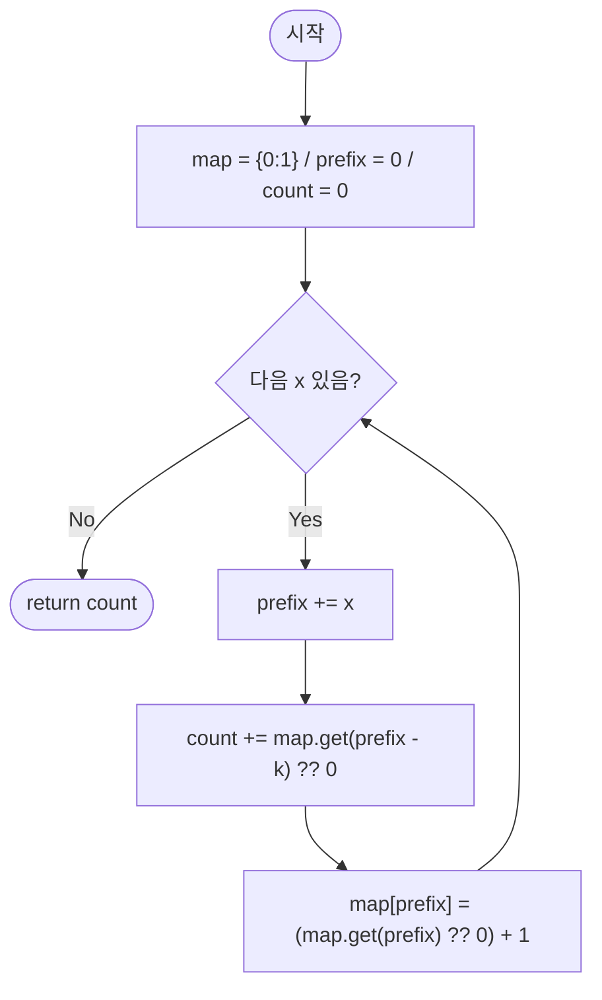

import { AlgorithmSimulation } from "#guide-sim";

# subarraySumEqualsK — 구간 합을 두 누적합의 차이로 바꾸면 해시맵 조회 한 번으로 끝나는 이유

## 한눈에 보는 컨셉

정수 배열에서 합이 정확히 `k`인 연속 부분 배열의 개수를 세는 문제예요. 구간 `[i, j]`의 합은 누적합 두 개의 차이 `prefix[j+1] - prefix[i]`로 다시 쓸 수 있다는 관찰이 돌파구인데, 이렇게 바꾸면 "합이 `k`인 구간을 찾기"가 "지금까지 등장한 누적합 중 `현재 누적합 - k`인 값이 몇 번 나왔는지 세기"로 바뀝니다. 그 개수를 해시맵에 실시간으로 기록해 두면, 배열을 한 번만 훑으면서 `O(N)`에 답을 구할 수 있어요.

## 출발점: 가장 순진한 방법부터

문제부터 정확히 고정할게요.

```ts
function subarraySumEqualsK(nums: number[], k: number): number
```

| 항목 | 값 |
|------|-----|
| `nums` | 정수 배열, $1 \leq N \leq 100{,}000$, $-10{,}000 \leq nums[i] \leq 10{,}000$ |
| `k` | 목표 합, $-10^9 \leq k \leq 10^9$ |
| 반환값 | 합이 정확히 `k`인 연속 부분 배열(subarray)의 개수 |

엣지 케이스도 미리 짚어 둡니다.

| 입력 | 기대 출력 | 이유 |
|------|-----------|------|
| `nums=[1,2,3], k=3` | `2` | `[1,2]`와 `[3]`이 합 3 |
| `nums=[1], k=0` | `0` | 합 0인 부분 배열 없음 (`N=1`이라 빈 배열은 후보가 아님) |
| `nums=[0,0,0], k=0` | `6` | 길이 1·2·3짜리 구간이 각각 3·2·1개, 합계 6 |
| `nums=[-1,1], k=0` | `1` | 음수 원소가 있어도 정상 작동해야 함 |

"합이 정확히 `k`인 구간의 개수를 세라"는 문제를 처음 보면, 가장 정직한 접근은 **후보 구간을 전부 나열해서 하나씩 검사하는 것**입니다. 시작점 `i`와 끝점 `j`를 모두 고정하고 그 구간의 합을 실제로 계산해 보는 거예요.

```ts
function subarraySumEqualsKNaive(nums: number[], k: number): number {
  let count = 0;
  for (let i = 0; i < nums.length; i++) {
    let s = 0;
    for (let j = i; j < nums.length; j++) {
      s += nums[j]; // 구간 [i, j]의 합을 i부터 다시 누적
      if (s === k) count++;
    }
  }
  return count;
}
```

작은 예로 직접 검사해 봅시다. `nums = [1, 2, 3], k = 3`이라면:

```text
nums = [1, 2, 3], k = 3

i=0: j=0 → 1          j=1 → 1+2=3 ✓        j=2 → 1+2+3=6
i=1:                   j=1 → 2              j=2 → 2+3=5
i=2:                                         j=2 → 3 ✓

검사한 구간: 6개 (= 3·4/2)   일치: 2개 → count = 2
```

문제는 이 방법이 구간 쌍 `(i, j)`를 전부 열거한다는 점이에요. 구간 개수는 $N(N+1)/2$이고, $N = 100{,}000$이면 약 $5 \times 10^9$번의 덧셈·비교가 필요합니다. 시간 제한 1초 안에는 어림도 없어요. 이 문제가 요구하는 목표 복잡도는 시간 $O(N)$, 공간 $O(N)$ 정도까지입니다 — 배열을 한 번(또는 상수 번) 훑는 수준이어야 합니다.

"합을 다루는 문제니까 투 포인터(슬라이딩 윈도우)로 왼쪽·오른쪽을 움직이면 되지 않을까?"라는 생각이 자연스럽게 들 수 있어요. 비음수 배열이라면 실제로 그렇게 풀립니다. 그런데 이 문제는 음수 원소를 허용해요. 왜 이게 치명적인지 직접 따라가 봅시다.

```text
nums = [1, -1, 1], k = 1   (윈도우 합을 유지하며 "합 > k면 왼쪽을 당긴다"는 전형적인 투 포인터라면)

r=0: sum = 1              → sum == k, 후보
r=1: sum = 1 + (-1) = 0   → sum이 오히려 줄어듦(!) "sum > k"가 될 지점이 없다
r=2: sum = 0 + 1 = 1      → sum == k, 후보

오른쪽으로 넓힐수록 sum이 커진다는 보장이 없다
→ "언제 왼쪽을 당겨야 하는가"를 판단할 기준 자체가 사라진다
```

음수가 섞이면 윈도우를 넓힐 때 합이 줄어들 수도 있어서, "합이 커지면 줄이고 작아지면 늘린다"는 슬라이딩 윈도우의 전제(단조성) 자체가 무너집니다. 그래서 투 포인터는 이 문제에 쓸 수 없어요.

다시 naive 코드를 들여다보면 진짜 낭비가 보입니다. `i`를 하나씩 옮길 때마다 `s`를 `0`부터 다시 채워 넣고 있어요. 구간 `[i, j]`의 합은 사실 "배열 앞부분 전체의 합"들의 차이로도 쓸 수 있을 텐데, 이 관찰을 밀어붙이면 매번 다시 더할 필요가 없어지지 않을까요? 이게 다음 절의 출발점입니다.

## 아이디어 자세히 들여다보기

### 구간 합을 두 누적합의 차이로 바꾸기 — 수식과 그림

누적합(prefix sum) $P$를 다음과 같이 정의합니다.

$$P[0] = 0, \qquad P[j] = \sum_{t=0}^{j-1} nums[t] \quad (1 \leq j \leq N)$$

즉 $P[j]$는 `nums`의 앞 $j$개 원소의 합이에요. 이렇게 정의하면 구간 $[i, j-1]$(0-indexed, $i \leq j-1$)의 합은 두 누적합의 차이로 정확히 표현됩니다.

$$\sum_{t=i}^{j-1} nums[t] = P[j] - P[i]$$

`nums = [1, 2, 3]`으로 직접 채워 봅시다.

```text
nums:    [ 1,  2,  3]
인덱스:    0   1   2

P[0]=0   P[1]=1   P[2]=3   P[3]=6

구간 [0,1]의 합 = nums[0]+nums[1] = 1+2 = 3
              = P[2] - P[0] = 3 - 0 = 3   ✓
구간 [1,2]의 합 = nums[1]+nums[2] = 2+3 = 5
              = P[3] - P[1] = 6 - 1 = 5   ✓
```

왜 하필 이 형태로 정의할까요? 원소를 직접 배열에 저장해 두고 매번 $O(j-i)$로 더하는 대신, "누적합의 차"라는 형태로 문제를 바꾸면 한쪽 항($P[j]$)을 고정했을 때 나머지 항($P[i]$)을 **셀 수 있는 대상**으로 만들 수 있습니다. 합이 `k`인 구간을 찾는 조건 $P[j] - P[i] = k$를 $P[i]$에 대해 풀면 다음과 같아요.

$$P[i] = P[j] - k$$

즉 오른쪽 끝 $j$를 하나씩 고정해 나가면서, "지금까지 나온 누적합 중 $P[j]-k$와 같은 값이 몇 개였는지"만 세면 그게 곧 $j$가 오른쪽 끝인 구간들의 답 기여분이에요. 이 개수 세기를 $O(1)$에 하기 위한 도구가 다음 절의 해시맵입니다.

> 확인 질문 하나 — `nums = [1, 2, 3]`에서 `P[2] - P[0]`은 어떤 구간의 합일까요? 정답은 구간 `[0, 1]`(즉 `nums[0]+nums[1] = 3`)입니다. 인덱스가 하나씩 밀려 있다는 점(`P`는 "앞의 몇 개"를 세는 배열이라 실제 배열보다 인덱스가 1 크다는 점)을 확인해 보세요.

### 셈을 맡는 자료구조 — 해시맵(빈도표)

이 알고리즘이 반복해서 던지는 질문은 "$P[j]-k$라는 값이 지금까지 몇 번 나왔는가"예요. 이건 정확히 "빈도표" 자료구조가 하는 일입니다. 키는 지금까지 등장한 누적합 값, 값은 그 누적합이 등장한 횟수로 두면 됩니다.

배열로 직접 인덱싱하지 못하는 이유도 짚고 갈게요. `nums[i]`는 $[-10{,}000, 10{,}000]$ 범위지만, 누적합 $P[j]$는 최대 $N \times 10{,}000 = 10^9$까지 커질 수 있고 음수도 됩니다. 배열 인덱스로 쓰기엔 범위가 너무 크고 음수 인덱스도 없어요. 그래서 임의의 정수를 키로 받는 해시맵이 필요합니다. 해시맵 자체의 원리(체이닝, 평균 `O(1)` 삽입/조회)가 궁금하다면 이 프로젝트의 [hashMapChaining 가이드](../../../data-structures/hash/hashMapChaining/hashMapChaining-guide.mdx)를 참고하세요 — 여기서는 "평균 `O(1)`로 읽고 쓰는 빈도표"로만 쓰면 충분합니다.

### 왜 모순 없이 작동하는가

이 알고리즘이 루프 내내 지키는 불변식은 하나예요.

> 인덱스 $j$를 처리하기 **직전** 시점에, `map[v]`는 $P[0], P[1], \ldots, P[j-1]$ 중 값이 $v$인 것의 개수와 정확히 같다.

기저(base): 루프에 들어가기 전 `map = {0: 1}`인데, 이 시점에 이미 계산된 누적합은 $P[0] = 0$ 하나뿐이므로 "$P[0..{-1}]$ 중 값이 $v$인 개수"는 $v=0$일 때 1, 그 외엔 0입니다. `map`의 초기 상태와 정확히 일치해요.

귀납 단계: 불변식이 $j$ 시점까지 성립한다고 가정합니다. $j$를 처리할 때 알고리즘은 두 가지만 합니다.

1. **조회**: `count += map[P[j] - k]`. 불변식에 의해 `map[P[j]-k]`는 $P[0..j-1]$ 중 $P[j]-k$와 같은 값의 개수, 즉 $P[i] = P[j] - k$를 만족하는 $i < j$의 개수입니다. 이는 정의상 구간 $[i, j-1]$의 합이 $P[j]-P[i]=k$인 경우의 수와 정확히 같아요.
2. **기록**: `map[P[j]] += 1`. 이제 $P[0..j]$까지 반영됐으니, 불변식이 $j+1$ 시점으로 그대로 넘어갑니다.

두 단계를 모든 $j = 1, \ldots, N$에 대해 반복하면, "오른쪽 끝이 $j-1$이고 합이 $k$인 구간"이 $j$를 처리하는 시점에 정확히 한 번씩 `count`에 더해집니다. 가능한 구간은 반드시 어떤 오른쪽 끝 $j-1$을 가지므로, 이 열거에 빠지는 경우는 없습니다(완전성). 그리고 같은 구간이 서로 다른 $j$에서 두 번 세어질 수도 없습니다 — 오른쪽 끝이 $j-1$로 고정된 순간에만 그 구간이 세어지기 때문이에요(정확성). 그러므로 루프가 끝난 시점의 `count`는 합이 `k`인 모든 구간의 개수와 정확히 같습니다.

여기서 **헷갈리기 쉬운 포인트**가 둘 있습니다.

- **조회와 기록의 순서.** "조회 먼저, 기록은 그다음"이 반드시 지켜져야 해요. 순서를 바꿔서 기록부터 하면 방금 계산한 $P[j]$ 자신이 조회 대상에 섞여 들어가, $i = j$인 "길이 0 구간"이 잘못 세어집니다. `nums=[0,0,0], k=0`으로 순서를 바꿔 실행해 보면 정답 `6` 대신 `9`가 나옵니다 — 매 위치에서 자기 자신과의 가짜 매칭이 하나씩 추가로 세어지기 때문이에요.
- **`map[0] = 1` 초기화를 빠뜨리는 실수.** $i = 0$에서 시작하는 구간(즉 $[0, j-1]$)은 $P[i] = P[0] = 0$을 조회해야 잡힙니다. 이 초기화를 빼먹으면 배열 맨 앞에서 시작하는 구간이 통째로 누락돼요. `nums=[1,2,3], k=3`으로 확인하면, 초기화가 없을 때는 정답 `2` 대신 `1`만 나옵니다 — `[0,1]`(`P[2]-P[0]`으로 잡히는 구간)이 통째로 빠지는 거예요.

엣지 케이스도 불변식 위에서 확인해 둡니다.

```text
N=1, nums=[5], k=5     → j=1에서 P[1]=5, 조회 키 0 → map[0]=1 → count=1  ✓
모든 원소가 0, k=0     → 어떤 구간을 골라도 합이 0 → 길이별로 전부 세어짐
음수 원소, 음수 k       → map의 키/값이 음수여도 해시맵은 그대로 동작
```

## 아이디어를 코드로 옮기기

```ts
function subarraySumEqualsK(nums: number[], k: number): number {
  const map = new Map<number, number>();
  map.set(0, 1); // P[0] = 0을 미리 기록해 둔다

  let prefix = 0;
  let count = 0;

  for (const x of nums) {
    prefix += x;
    count += map.get(prefix - k) ?? 0;              // ① 조회: P[i] = prefix - k인 개수
    map.set(prefix, (map.get(prefix) ?? 0) + 1);     // ② 기록: 현재 누적합을 남긴다
  }

  return count;
}
```

**가장 실수가 잦은 줄은 ①과 ②의 순서입니다.** 조회가 먼저 오고 기록이 그다음이어야, 방금 계산한 `prefix` 자신이 조회에 섞이지 않아요. 그 밖에 결정 지점 몇 가지를 짚습니다.

- `map.set(0, 1)` 초기화는 루프 시작 전, 딱 한 번만 필요합니다 — 앞서 본 것처럼 이걸 빠뜨리면 배열 시작부터의 구간이 누락됩니다.
- `map.get(prefix - k) ?? 0`에서 `??`가 없으면 처음 보는 키에서 `undefined`가 반환돼 `count`가 `NaN`으로 오염됩니다.
- `for...of`로 왼쪽에서 오른쪽으로 한 번만 훑습니다. 순회 방향을 바꿀 이유는 없어요 — `P[j]`는 앞쪽 원소들의 누적이므로 왼쪽에서 오른쪽으로 가는 순서 자체가 정의에 들어 있습니다.

이 구현이 이미 이 문제의 최종 형태예요. 시간은 원소마다 해시맵 조회·삽입을 상수 번(평균 `O(1)`) 하니 총 `O(N)`이고, 공간은 해시맵에 최대 `N+1`개의 서로 다른 누적합이 쌓이니 `O(N)`입니다. 더 줄일 여지가 있을까요? 답을 내려면 배열의 모든 원소를 최소 한 번은 읽어야 하므로(원소 하나를 아예 안 보면 그 원소가 관여하는 구간을 판정할 수 없습니다) 시간은 $\Omega(N)$이 하한이고, 지금 구현이 그 하한과 일치합니다. 점근적으로 더 빠르게 만들 방법은 없다는 뜻이에요. 다만 트레이드오프는 있습니다 — 지금처럼 원소를 읽으며 즉시 조회·기록하는 대신, 누적합 배열 `P[0..N]`을 먼저 통째로 만들어 둔 다음 해시맵을 채우는 2단계 구현도 가능해요. 결과는 같지만 원소를 스트리밍으로 처리할 수 없다는(전체 배열이 미리 있어야 한다는) 제약이 생기므로, 지금의 1-패스 방식이 더 범용적입니다.

## 실행 시각화

입력 `nums = [1, -1, 1]`, `k = 1`에 대해 누적합 + 해시맵으로 합이 `k`인 부분 배열을 세는 과정입니다. `highlight`(빨강)는 현재 처리 중인 원소 `x`이고, keyValue 패널은 누적합 `prefix`, 조회 키 `prefix - k`, 그 키의 맵 값, 누적 `count`, 그리고 맵의 현재 스냅샷을 보여줍니다(조회 후 기록 순서 그대로).

실제 반환값은 `3`이며(합이 1인 구간 `[0,0]`, `[0,2]`, `[2,2]`), 시뮬레이션 마지막 프레임의 `count`와 일치합니다.

> 대화형 시뮬레이션은 MDX 런타임에서 표시됩니다.

export const N = [1, -1, 1];

export const steps = [
  {
    title: "초기화",
    detail: "map = {0: 1}, prefix = 0, count = 0.",
    array: N,
    entries: [
      { label: "prefix", value: 0 },
      { label: "count", value: 0 },
      { label: "map", value: "{0:1}" },
    ],
  },
  {
    title: "i=0: x=1",
    detail: "prefix = 0+1 = 1. 조회 키 prefix-k = 1-1 = 0 → map[0]=1, count += 1 = 1.",
    array: N,
    highlight: [0],
    entries: [
      { label: "prefix", value: 1 },
      { label: "조회 prefix-k", value: 0 },
      { label: "map[0]", value: 1 },
      { label: "count", value: 1 },
    ],
  },
  {
    title: "i=0: 맵 기록",
    detail: "map[1] += 1 → map = {0:1, 1:1}.",
    array: N,
    highlight: [0],
    marked: [0],
    entries: [
      { label: "count", value: 1 },
      { label: "map", value: "{0:1, 1:1}" },
    ],
  },
  {
    title: "i=1: x=-1",
    detail: "prefix = 1+(-1) = 0. 조회 키 0-1 = -1 → map[-1]=0(없음), count 유지 = 1.",
    array: N,
    highlight: [1],
    entries: [
      { label: "prefix", value: 0 },
      { label: "조회 prefix-k", value: -1 },
      { label: "map[-1]", value: 0 },
      { label: "count", value: 1 },
    ],
  },
  {
    title: "i=1: 맵 기록",
    detail: "map[0] += 1 → map = {0:2, 1:1}.",
    array: N,
    highlight: [1],
    entries: [
      { label: "count", value: 1 },
      { label: "map", value: "{0:2, 1:1}" },
    ],
  },
  {
    title: "i=2: x=1",
    detail: "prefix = 0+1 = 1. 조회 키 1-1 = 0 → map[0]=2, count += 2 = 3.",
    array: N,
    highlight: [2],
    entries: [
      { label: "prefix", value: 1 },
      { label: "조회 prefix-k", value: 0 },
      { label: "map[0]", value: 2 },
      { label: "count", value: 3 },
    ],
  },
  {
    title: "i=2: 맵 기록",
    detail: "map[1] += 1 → map = {0:2, 1:2}.",
    array: N,
    highlight: [2],
    marked: [0, 1, 2],
    entries: [
      { label: "count", value: 3 },
      { label: "map", value: "{0:2, 1:2}" },
    ],
  },
  {
    title: "완료: count = 3",
    detail: "순회 종료. 합 1인 구간: [0,0], [0,2], [2,2] → 3개.",
    array: N,
    marked: [0, 1, 2],
    entries: [
      { label: "결과 count", value: 3 },
      { label: "구간", value: "[0,0] [0,2] [2,2]" },
    ],
  },
];

<AlgorithmSimulation view={["array", "keyValue"]} steps={steps} title="부분합=K 개수: nums=[1,-1,1], k=1" />

## 흐름 한눈에 보기



## 스스로 점검하기

1. `nums = [3, 4, 7, 2, -3, 1, 4, 2]`, `k = 7`일 때 정답은 `4`입니다. 어떤 네 구간이 합 7을 만드는지 손으로 찾아보세요. (힌트: 누적합을 `P = [0, 3, 7, 14, 16, 13, 14, 18, 20]`으로 먼저 채우고, `P[j] - P[i] = 7`인 쌍 `(i, j)`를 찾아보면 `[0,1]`, `[2,2]`, `[2,5]`, `[5,7]` 네 구간이 나옵니다.)
2. 조회와 기록의 순서를 바꿔서 "기록 먼저, 조회는 그다음"으로 구현했다고 해 봅시다. `nums = [0, 0, 0], k = 0`을 넣으면 정답 `6` 대신 몇이 나올지, 왜 그런 값이 나오는지 각 스텝의 `count` 증가분을 따라가며 설명해 보세요.
3. 이 문제를 살짝 바꿔서 "합이 `k`의 배수(합을 `k`로 나눈 나머지가 0)인 구간의 개수"를 센다면, 지금의 해시맵 키를 어떻게 바꿔야 할까요? (힌트: `prefix - k` 대신 `prefix % k`를 키로 쓰는 쪽으로 생각을 옮겨 보세요. 이때 자바스크립트의 `%`가 음수에 대해 음수를 반환할 수 있다는 점도 함께 고려해야 합니다.)
