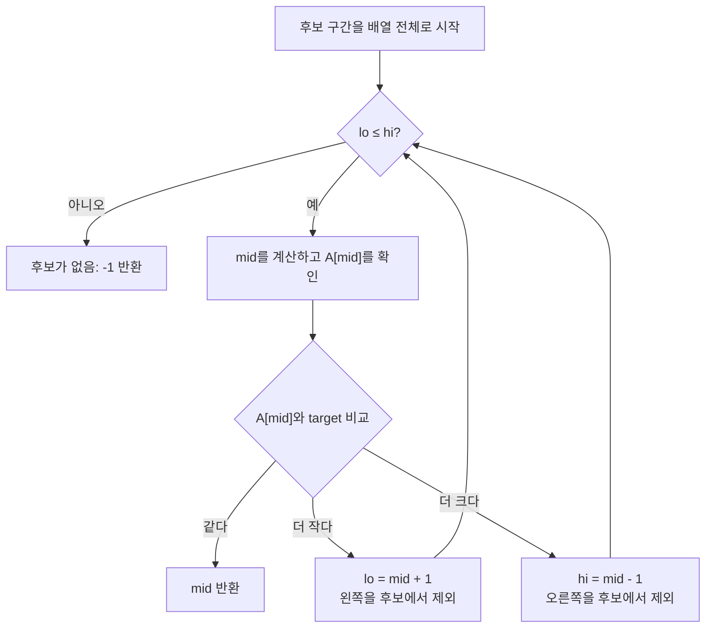

import { AlgorithmSimulation } from "#guide-sim";

# Binary Search — 정렬이 알려주는 "아닌 절반"을 통째로 버리는 법

## 한눈에 보는 컨셉

정렬된 배열에서 값을 찾을 때, 가운데 원소 하나만 비교해도 그 원소가 속한 절반 전체를 "정답일 수 없음"으로 증명할 수 있어요. 그래서 매번 후보 구간을 절반으로 접으며 좁혀 가면 되는데, 이 반토막 과정을 `O(log N)`번만 반복하면 후보가 하나 이하로 줄어듭니다. 핵심은 "원소 하나를 봤을 뿐인데 왜 그 옆 절반까지 통째로 버려도 안전한가"를 정렬이라는 전제가 보장해 준다는 점이에요.

## 출발점: 가장 순진한 방법부터

먼저 무엇을 만들어야 하는지부터 정확히 잡고 갈게요.

```ts
function binarySearch(A: number[], target: number): number
```

- `A` — 오름차순으로 정렬된 정수 배열입니다. 이 전제가 이 문제 전체를 떠받칩니다.
- `target` — 찾고자 하는 정수입니다.
- 반환값 — `A[i] === target`인 인덱스 `i` 하나(중복이 있다면 그중 아무 인덱스나 허용). 없으면 `-1`입니다.
- 제약 규모 — 배열 길이 `N`은 $0 \le N \le 10^{6}$, 원소와 `target`은 32비트 정수 범위, 시간 제한 1초입니다.

가장 자연스러운 출발은 "정렬됐다는 사실을 아직 안 믿고" 왼쪽부터 하나씩 확인해 보는 겁니다. 배열에 순서가 있든 없든 항상 통하는, 가장 정직한 방법이니까요.

```ts
function linearSearchNaive(A: number[], target: number): number {
  for (let i = 0; i < A.length; i += 1) {
    if (A[i] === target) return i;
  }
  return -1;
}
```

이 방법은 틀리지 않습니다. 문제는 비용이에요. `target`이 배열 맨 끝에 있거나 아예 없으면 원소를 처음부터 끝까지 다 확인해야 합니다.

```text
A = [1, 3, 5, 7, 9, ...], target이 배열에 없거나 맨 끝에 있는 경우
확인 순서:  A[0] → A[1] → A[2] → ... → A[N-1]   (한 칸도 건너뛰지 못함)
비용:       최악 N번 비교
```

**여기서 잠깐, 목표 복잡도를 먼저 예측해 볼까요?** 이 문제는 `N`이 최대 `10^6`, 시간 제한은 1초예요.

```text
N = 10^6, 시간 제한 1초

선형 탐색  최악 비교 횟수 ≈ 10^6
이진 탐색  최악 비교 횟수 ≈ log2(10^6) ≈ 20      (2^20 = 1,048,576 ≥ 10^6)
```

호출을 딱 한 번만 한다면 `10^6`번 비교도 1초 안에 널널히 끝나긴 합니다. 하지만 이진 탐색을 배우는 진짜 이유는 **이 함수가 반복 사용되는 상황**에 있어요. 정렬된 배열 하나를 두고 조회를 여러 번 하는 것이 이진 탐색의 표준 사용 패턴이거든요. 조회를 `Q`번 한다고 하면 선형 탐색은 `O(N·Q)`, 이진 탐색은 `O(Q log N)`으로 격차가 기하급수적으로 벌어집니다. `N = Q = 10^6`이면 선형은 `10^{12}`번 비교로 명백히 시간 초과이고, 이진은 약 `2×10^7`번으로 여유 있게 통과해요. 그러니 이 문제가 진짜로 요구하는 목표는 "정렬을 활용해 매 조회를 `O(log N)`에 끝내는 것"입니다. 지금부터 그 방법을 찾아봅시다.

## 아이디어 자세히 들여다보기

### 후보 구간을 반씩 접기 — 수식과 그림

배열 가운데 인덱스를 `m`이라고 두면, `A[m]`과 `target`을 비교했을 때 나올 수 있는 경우는 정확히 셋뿐이에요.

$$
A[m] = \text{target} \implies \text{답을 찾음}, \qquad
A[m] < \text{target} \implies \text{target} \notin A[0..m], \qquad
A[m] > \text{target} \implies \text{target} \notin A[m..N-1]
$$

그림으로 보면 이렇습니다.

```text
Before (아직 모름):
  [ 1   3   5   7   9 ]
    lo              hi
        가운데 A[2]=5 를 target=8과 비교

After (5 < 8 이므로 왼쪽 절반은 통째로 제외):
  [ 1   3  |5|  7   9 ]
              lo=3   hi
    ---- 버림 ----   ---- 여기만 후보 ----
```

핵심은 **가운데 원소 하나가 "그 자신이 답인가"만 알려 주는 게 아니라, "어느 절반이 답일 수 없는가"까지 증명해 준다는 점**이에요. `A[m] < target`이면 정렬 때문에 `A[0], ..., A[m]`은 전부 `target`보다 작다는 사실이 자동으로 성립합니다 — 각각을 다시 비교할 필요가 없어요.

**왜 하필 닫힌 구간 `[lo, hi]`로 표현할까요?** 후보 인덱스 범위를 표현하는 방법은 닫힌 구간(`lo`, `hi` 둘 다 포함)과 반열린 구간(`lo` 포함, `hi` 제외) 두 가지가 있는데, 이 가이드는 닫힌 구간을 씁니다. 반열린 구간을 쓰면 종료 조건이 `lo < hi`로 바뀌고, `mid`를 찾았을 때가 아닌 경우의 갱신식도 함께 달라져야 해요(스스로 점검하기 2번에서 직접 확인해 봅니다). 어느 쪽을 골라도 정확성은 같지만, 하나의 구현 안에서 정의와 갱신식이 서로 일관돼야 한다는 점이 중요합니다.

처음에는 배열 전체가 후보이므로 `lo = 0`, `hi = A.length - 1`로 시작합니다. `mid`는 `lo + Math.floor((hi - lo) / 2)`로 잡고요.

```text
A[mid] < target  → lo = mid + 1   (왼쪽 절반, mid 포함해서 버림)
A[mid] > target  → hi = mid - 1   (오른쪽 절반, mid 포함해서 버림)
A[mid] === target → mid 반환
```

잠깐 확인해 볼까요? `A = [2, 4, 6, 8, 10]`에서 `target = 4`라면, 첫 `mid`는 `2`(값 `6`)입니다. `6 > 4`이니 어느 쪽 절반이 버려질까요? — 오른쪽(`hi = mid - 1 = 1`)이 버려지고, 다음 후보 구간은 `[0, 1]`이 됩니다.

### 왜 모순 없이 작동하는가

반복문이 매번 지키는 약속은 하나뿐이에요.

> `target`이 배열 안에 존재한다면, 그 인덱스는 항상 `[lo, hi]` 안에 있다.

**기저(초기화).** 처음 구간은 배열 전체인 `[0, N-1]`입니다. `target`이 존재한다면 당연히 이 안에 있으니 약속은 처음부터 성립합니다.

**귀납 단계.** 한 번의 비교에서 나올 수 있는 경우는 위에서 본 셋(`같다`, `작다`, `크다`)뿐이고, 이 셋이 전부입니다 — 정수 비교에 네 번째 결과는 없어요. 각 경우가 약속을 어떻게 지키는지 봅시다.

- `A[mid] === target`이면 그 자리에서 즉시 반환합니다. 답을 실제로 찾았으니 옳습니다.
- `A[mid] < target`이면, 배열이 오름차순이므로 `A[0..mid]`의 모든 값이 `A[mid]` 이하, 즉 `target`보다 작습니다. 그러니 이 구간 안에는 `target`이 있을 수 없고, `lo = mid + 1`로 옮겨도 "존재한다면 `[lo, hi]` 안"이라는 약속이 그대로 유지됩니다.
- `A[mid] > target`이면 대칭적으로 `A[mid..N-1]`이 전부 `target`보다 크므로, `hi = mid - 1`로 옮겨도 안전합니다.

**종료.** 같지 않은 두 경우 모두 `mid`를 포함한 한쪽 전체를 후보에서 제거하므로, 구간 길이 `hi - lo + 1`은 매 반복마다 최소 1 이상 줄어듭니다. 유한한 배열에서 이 과정은 반드시 끝나고, `lo > hi`가 되어 구간이 비면 약속에 따라 `target`은 존재할 수 없습니다 — 그래서 그 시점에 `-1`을 반환하는 것이 정당합니다.

**여기서 헷갈리기 쉬운 포인트는, `lo = mid`나 `hi = mid`처럼 `mid` 자신을 다음 구간에 남겨 두는 것입니다.** 방금 확인한 `A[mid]`는 이미 `target`이 아니라고 검증이 끝났으니 다시 후보로 남겨 둘 이유가 없는데, `mid`를 포함시키면 구간이 줄지 않는 경우가 생겨 무한 반복에 빠집니다.

```text
A = [1, 2], target = 3, 만약 lo = mid 로 잘못 갱신한다면:

lo=0, hi=1, mid=0, A[0]=1 < 3 → (잘못) lo = mid = 0   ← hi도 lo도 그대로!
lo=0, hi=1, mid=0, A[0]=1 < 3 → (잘못) lo = mid = 0   ← 같은 상태 반복
...                                                     무한 루프
```

엣지 케이스에서도 같은 약속이 그대로 작동하는지 점검해 봅시다.

```text
빈 배열:        lo=0, hi=-1              → 처음부터 lo > hi, 한 번도 비교 안 하고 -1
원소 1개, 일치:  lo=0, hi=0, mid=0, 일치  → 즉시 반환
원소 1개, 불일치: lo=0, hi=0, mid=0, 불일치 → lo=1 또는 hi=-1 로 구간이 비고 -1
중복값 존재:      A[mid] === target 이면 그 인덱스를 그대로 반환 (계약상 "아무 인덱스나" 허용)
```

## 아이디어를 코드로 옮기기

```ts
function binarySearch(A: number[], target: number): number {
  let lo = 0;
  let hi = A.length - 1;

  while (lo <= hi) {
    const mid = lo + Math.floor((hi - lo) / 2);

    if (A[mid] === target) return mid;
    if (A[mid] < target) lo = mid + 1;
    else hi = mid - 1;
  }

  return -1;
}
```

결정 지점만 짚어 볼게요.

- 초기값은 `lo = 0`, `hi = A.length - 1`입니다. 빈 배열이면 `hi = -1`이 되어 아래 `while` 조건이 처음부터 거짓이 되고, 이 자체가 빈 배열 방어입니다(따로 분기하지 않아도 됩니다).
- `mid = lo + Math.floor((hi - lo) / 2)`처럼 `lo`를 기준으로 더하는 형태를 씁니다. `(lo + hi) / 2`도 수학적으로는 같지만, 아주 큰 인덱스에서 `lo + hi`가 표현 범위를 넘는 사고를 피하려는 관용적 형태예요.
- 가드 순서는 "같다 → 작다 → 크다"입니다. 같다를 가장 먼저 확인해야 찾은 즉시 반환할 수 있어요.

**가장 실수가 잦은 줄은 `while (lo <= hi)`의 비교 연산자와 `lo = mid + 1` / `hi = mid - 1`의 `+1`, `-1`입니다.** `while (lo < hi)`로 쓰면 후보가 원소 하나만 남은 `[k, k]` 구간을 검사하지 못하고 루프를 빠져나가 버립니다. 그리고 `lo = mid`나 `hi = mid`로 쓰면(방금 본 헷갈리기 쉬운 포인트) `lo === mid`인 상황에서 구간이 줄지 않아 무한 반복에 빠질 수 있어요.

이 구현으로 목표 복잡도를 달성했는지 확인해 볼까요? 한 번 비교할 때마다 후보 구간의 길이가 거의 절반으로 줄어드므로, `N`개에서 시작하면 최대 `⌈log₂(N+1)⌉`번 반복 후 구간이 빕니다. 곧 시간 복잡도는 `O(log N)`이고, 포인터 `lo`, `hi`, `mid` 세 개만 추가로 쓰므로 공간 복잡도는 `O(1)`입니다. 앞서 예측한 목표(`N = 10^6`에서 약 20번 비교)를 정확히 만족합니다.

더 빠르게 만들 여지가 있을까요? 이 알고리즘은 사실상 여기가 끝입니다. "정렬된 배열에서 하나의 값을 비교 연산만으로 찾는" 문제는 **비교 기반 탐색의 정보 이론적 하한**에 걸려 있어요. 매 비교는 "같다 / 작다 / 크다" 중 하나의 결과만 내놓는데, `N`개의 원소 중 정답의 위치(또는 "없음")를 구분하려면 최소 `log₂(N+1)`번의 비교가 필요하다는 것이 결정 트리 논증의 결론입니다(비교 결과 하나가 정보 1비트 미만을 주므로, `N+1`가지 가능성을 구분하는 데 필요한 비교 횟수는 `log₂(N+1)`보다 적을 수 없습니다). 이진 탐색은 이 하한에 상수 배 안으로 이미 도달해 있으므로, 선형 탐색 → 이진 탐색처럼 "한 단계 더 개선"할 중간 단계가 존재하지 않습니다. (해시 기반 탐색처럼 비교가 아닌 다른 연산을 쓰는 특화 기법은 평균 `O(1)`도 가능하지만, 그건 "정렬된 순서 자체"라는 정보를 버리고 다른 자료구조를 새로 만드는 별개의 접근입니다.)

## 실행 시각화

아래 재생은 `A = [1, 3, 5, 7, 9]`, `target = 8`에 위 코드를 그대로 적용한 것입니다. `8`은 배열에 없는 값이라, 후보 구간이 끝까지 좁혀지다 비어서 반환값은 `-1`이 됩니다. `pointers` 패널의 `lo`/`mid`/`hi`를 따라가면 매 프레임 후보 구간이 어떻게 줄어드는지 보이고, 회색(`marked`)은 이미 제외되어 다시 보지 않는 인덱스예요.

> 대화형 시뮬레이션은 MDX 런타임에서 표시됩니다.

export const binarySearchMissingSteps = [
  {
    title: "전체 배열이 후보",
    detail: "lo = 0, hi = 4. target이 있다면 아직 [0, 4] 안에 있다.",
    array: [1, 3, 5, 7, 9],
    pointers: { lo: 0, hi: 4 },
  },
  {
    title: "가운데 값 5와 비교",
    detail: "mid = 2, A[2] = 5. 5 < 8이므로 0부터 2까지는 모두 후보에서 제외한다.",
    array: [1, 3, 5, 7, 9],
    highlight: [2],
    pointers: { lo: 0, mid: 2, hi: 4 },
  },
  {
    title: "왼쪽 절반을 버림",
    detail: "lo = mid + 1 = 3. 정렬되어 있으므로 [1, 3, 5]에는 8이 없다.",
    array: [1, 3, 5, 7, 9],
    marked: [0, 1, 2],
    pointers: { lo: 3, hi: 4 },
  },
  {
    title: "7도 너무 작음",
    detail: "mid = 3, A[3] = 7. 따라서 인덱스 3도 제외하고 lo를 4로 옮긴다.",
    array: [1, 3, 5, 7, 9],
    marked: [0, 1, 2],
    highlight: [3],
    pointers: { lo: 3, mid: 3, hi: 4 },
  },
  {
    title: "9는 너무 큼",
    detail: "mid = 4, A[4] = 9. hi = 3이 되어 후보 구간이 비고, -1을 반환한다.",
    array: [1, 3, 5, 7, 9],
    marked: [0, 1, 2, 3, 4],
    highlight: [4],
    pointers: { lo: 4, hi: 3 },
  },
];

<AlgorithmSimulation view="array" steps={binarySearchMissingSteps} title="이진 탐색: 8이 없는 경우" />

## 흐름 한눈에 보기



## 스스로 점검하기

1. `target = 0`이고 배열의 모든 값이 양수라면, 첫 비교 뒤 어느 절반을 버릴 수 있을까요? (힌트: `A[mid]`는 항상 양수이므로 `A[mid] > 0 = target`입니다 — 오른쪽 절반이 매번 버려집니다.)
2. `while (lo < hi)`를 쓰는 반열린 구간 스타일로 바꾸고 싶다면, 반환 규칙과 `lo`/`hi` 갱신식을 각각 어떻게 바꿔야 `[k, k]` 하나 남은 구간도 놓치지 않을까요?
3. 중복값 중 **가장 왼쪽** 인덱스를 찾으려면, `A[mid] === target`일 때 왜 바로 반환하면 안 될까요? 그 대신 어떤 규칙으로 탐색을 이어가야 할까요?
