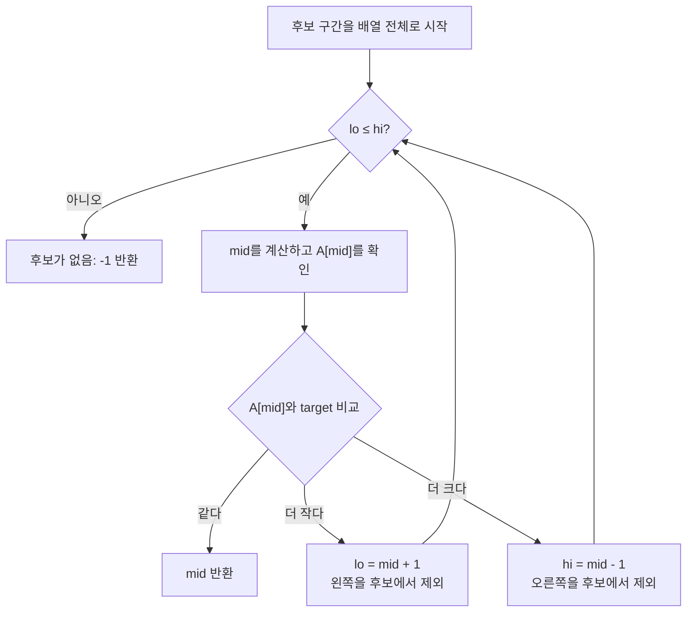

import { AlgorithmSimulation } from "#guide-sim";

# Binary Search — 정렬이 알려 주는 쪽만 남기는 법

## 먼저 문제를 한 문장으로

오름차순 배열 `A`에서 `target`과 같은 값을 가진 위치 하나를 찾아 그 인덱스를 반환하고, 없으면 `-1`을 반환한다. 배열에 같은 값이 여러 개 있을 수 있다면 이 문제의 계약은 **그중 아무 인덱스 하나**면 충분하다.

여기서 가장 중요한 전제는 배열이 이미 정렬되어 있다는 사실이다. 이 전제가 없었다면 어떤 원소를 살펴본 뒤에도 나머지 원소를 버릴 근거가 없다.

## 처음 생각해 볼 방법과 막히는 지점

가장 자연스러운 출발은 왼쪽부터 한 칸씩 확인하는 것이다.

```ts
for (let i = 0; i < A.length; i += 1) {
  if (A[i] === target) return i;
}
return -1;
```

이 방법은 틀리지 않는다. 다만 찾는 값이 마지막에 있거나 아예 없으면 배열 원소를 `N`개 모두 비교한다. 이 문제의 최대 길이는 `10^6`이므로 선형 탐색도 한 번만 실행한다면 제한 시간 안에 들어갈 가능성이 크다. 그럼에도 이 문제에서 더 좋은 답을 찾는 이유는, 정렬이라는 정보를 가진 상태에서 이미 “아닌 곳”을 계속 확인하는 낭비를 없앨 수 있기 때문이다.

## 돌파구가 되는 관찰

배열 가운데를 `m`이라고 하자. `A[m]`과 `target`을 비교하면 세 경우뿐이다.

- `A[m] === target`이면 답을 찾았다.
- `A[m] < target`이면 `m`의 왼쪽에는 `target`이 있을 수 없다. 오름차순이므로 그곳의 모든 값은 `A[m]` 이하, 즉 `target`보다 작기 때문이다.
- `A[m] > target`이면 `m`의 오른쪽에는 `target`이 있을 수 없다. 그곳의 모든 값이 `A[m]` 이상이기 때문이다.

핵심은 가운데 원소 하나가 답인지 알려 주는 데서 끝나지 않는다는 점이다. **가운데 원소는 답일 수 없는 절반을 증명해 준다.** 그래서 다음 비교는 살아남은 절반에서만 하면 된다.

## 관찰을 알고리즘으로 바꾸기

아직 후보인 인덱스 범위를 닫힌 구간 `[lo, hi]`로 표현한다. 처음에는 배열 전체가 후보이므로 `lo = 0`, `hi = A.length - 1`이다.

반복하는 동안 지킬 약속은 하나다.

> `target`이 배열 안에 존재한다면, 그 인덱스는 항상 `[lo, hi]` 안에 있다.

중간 인덱스는 `mid = lo + Math.floor((hi - lo) / 2)`로 잡는다. 그리고 비교 결과에 따라 다음처럼 구간을 바꾼다.

```text
A[mid] < target  → lo = mid + 1
A[mid] > target  → hi = mid - 1
A[mid] === target → mid 반환
```

`mid`를 포함하지 않고 `mid + 1`, `mid - 1`로 건너뛰는 이유가 중요하다. 현재 비교에서 `A[mid]`는 `target`이 아님을 이미 확인했으므로, 그 칸을 다시 후보로 남길 이유가 없다. 이렇게 해야 구간이 매번 확실히 줄어들어 반복문도 멈춘다.

## 실행 시각화

아래 재생은 앞의 의사코드를 `A = [1, 3, 5, 7, 9]`, `target = 8`에 적용한 것이다. 현재 문제의 원본 함수는 아직 구현되지 않았으므로, 이 단계는 가이드에서 제시한 반복형 이진 탐색을 기준으로 한다. 마지막에 후보 구간이 비고 반환값은 `-1`이 된다.

> 대화형 시뮬레이션은 MDX 런타임에서 표시됩니다.

export const binarySearchMissingSteps = [
  {
    title: "전체 배열이 후보",
    detail: "lo = 0, hi = 4. target이 있다면 아직 [0, 4] 안에 있다.",
    array: [1, 3, 5, 7, 9],
    pointers: { lo: 0, hi: 4 },
  },
  {
    title: "가운데 값 5와 비교",
    detail: "mid = 2, A[2] = 5. 5 < 8이므로 0부터 2까지는 모두 후보에서 제외한다.",
    array: [1, 3, 5, 7, 9],
    highlight: [2],
    pointers: { lo: 0, mid: 2, hi: 4 },
  },
  {
    title: "왼쪽 절반을 버림",
    detail: "lo = mid + 1 = 3. 정렬되어 있으므로 [1, 3, 5]에는 8이 없다.",
    array: [1, 3, 5, 7, 9],
    marked: [0, 1, 2],
    pointers: { lo: 3, hi: 4 },
  },
  {
    title: "7도 너무 작음",
    detail: "mid = 3, A[3] = 7. 따라서 인덱스 3도 제외하고 lo를 4로 옮긴다.",
    array: [1, 3, 5, 7, 9],
    marked: [0, 1, 2],
    highlight: [3],
    pointers: { lo: 3, mid: 3, hi: 4 },
  },
  {
    title: "9는 너무 큼",
    detail: "mid = 4, A[4] = 9. hi = 3이 되어 후보 구간이 비고, -1을 반환한다.",
    array: [1, 3, 5, 7, 9],
    marked: [0, 1, 2, 3, 4],
    highlight: [4],
    pointers: { lo: 4, hi: 3 },
  },
];

<AlgorithmSimulation view="array" steps={binarySearchMissingSteps} title="이진 탐색: 8이 없는 경우" />

## 알고리즘의 흐름 한눈에 보기



## 예제로 끝까지 따라가기

`A = [1, 3, 5, 7, 9]`, `target = 8`을 보자. 이번에는 없는 값을 고른다. 찾는 경우만 보면 마지막 반환 `-1`이 왜 정당한지 놓치기 쉽기 때문이다.

| 단계 | 후보 구간 | `mid`와 비교 | 버리는 이유 | 다음 구간 |
| --- | --- | --- | --- | --- |
| 시작 | `[0, 4]` | `mid = 2`, `A[2] = 5` | `5 < 8`이므로 `0..2`의 값도 모두 8보다 작다 | `[3, 4]` |
| 2 | `[3, 4]` | `mid = 3`, `A[3] = 7` | `7 < 8`이므로 `3`도 후보가 아니다 | `[4, 4]` |
| 3 | `[4, 4]` | `mid = 4`, `A[4] = 9` | `9 > 8`이므로 `4`도 후보가 아니다 | `[4, 3]` |

이제 `lo = 4`, `hi = 3`이라 후보 구간이 비었다. 앞선 매 단계에서 가능한 위치만 제거했으므로, 남은 후보가 없다는 것은 곧 배열에 `8`이 없다는 뜻이다. 따라서 `-1`을 반환한다.

배열이 비어 있을 때도 같은 논리가 작동한다. 처음부터 `lo = 0`, `hi = -1`이라 후보 구간이 비어 있으므로 한 번도 비교하지 않고 `-1`을 반환한다.

## 왜 항상 맞는가

반복문이 시작할 때마다 “`target`이 있다면 `[lo, hi]` 안에 있다”는 약속이 유지됨을 보이면 충분하다.

**초기화.** 처음 구간은 전체 배열 `[0, N - 1]`이다. `target`이 존재한다면 당연히 이 안에 있다.

**유지.** `A[mid] < target`인 경우, 정렬 때문에 `mid` 이하의 모든 원소는 `target`보다 작다. 그쪽은 답이 될 수 없으므로 `lo`를 `mid + 1`로 옮겨도 답을 버리지 않는다. `A[mid] > target`일 때는 대칭적으로 `mid` 이상의 원소가 모두 너무 크므로 `hi`를 `mid - 1`로 옮겨도 안전하다. 같다면 실제로 `A[mid] === target`이므로 즉시 반환한 값이 정답이다.

**종료.** 같지 않은 경우에는 `mid`까지 포함한 한쪽을 버린다. 따라서 후보 구간의 길이는 매번 줄어든다. 유한한 배열에서 이 과정은 끝나며, 구간이 비었을 때는 약속상 `target`이 존재할 수 없다. 그때 `-1`을 반환하는 것이 맞다.

## 구현할 때 놓치기 쉬운 점

```ts
export function binarySearch(A: number[], target: number): number {
  let lo = 0;
  let hi = A.length - 1;

  while (lo <= hi) {
    const mid = lo + Math.floor((hi - lo) / 2);

    if (A[mid] === target) return mid;
    if (A[mid] < target) lo = mid + 1;
    else hi = mid - 1;
  }

  return -1;
}
```

- `while (lo <= hi)`여야 원소가 하나 남은 `[k, k]`도 비교한다. `<`로 쓰면 마지막 후보를 보지 못한다.
- `A[mid] < target`일 때 `lo = mid`로 갱신하면 `lo === mid`인 상황에서 구간이 줄지 않아 무한 반복에 빠질 수 있다. 반드시 `mid + 1`로 넘긴다.
- 이 구현은 중복값 중 임의의 한 위치를 돌려준다. “가장 왼쪽 위치”가 필요하다면, 발견해도 바로 반환하지 않고 왼쪽 절반을 더 탐색하는 별도 규칙이 필요하다.

테스트에서는 빈 배열, 한 원소 배열, 첫·마지막 원소, 배열에 없는 값까지 확인해야 한다. 이들은 각각 초기 구간과 반복 조건, 포인터 갱신이 경계를 넘을 때의 동작을 검증한다.

## 복잡도

한 번 비교할 때마다 후보 수가 거의 절반이 된다. `N`개에서 시작하면 약 `log₂ N`번 후 후보가 하나 이하가 되므로 시간 복잡도는 `O(log N)`이다. 포인터 세 개만 추가로 쓰므로 공간 복잡도는 `O(1)`이다.

## 이 패턴을 다시 만났을 때

“정렬돼 있다”만 기억하기보다, **한 번의 판단으로 어느 구간이 답이 될 수 없다고 증명할 수 있는가**를 먼저 묻자. 답이 예라면 이진 탐색을 고려할 신호다. 값이 아니라 “조건을 만족하는 가장 작은 시간”처럼 답에 대한 판정이 참·거짓으로 단조롭게 바뀌는 문제도 같은 생각으로 풀 수 있다.

## 스스로 점검하기

1. `target = 0`이고 배열의 모든 값이 양수라면 첫 비교 뒤 어느 구간을 버릴 수 있는가?
2. `while (lo < hi)`를 쓰고 싶다면, 어떤 반환 규칙과 포인터 갱신을 함께 바꿔야 할까?
3. 중복값 중 가장 왼쪽 인덱스를 찾으려면 `A[mid] === target`일 때 왜 바로 반환하면 안 될까?
