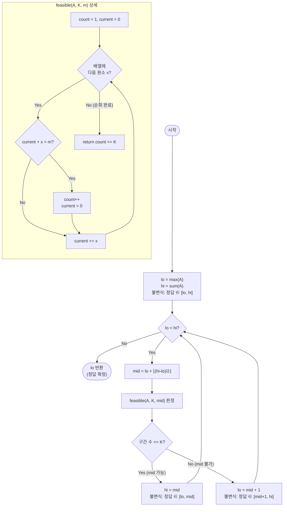

import { AlgorithmSimulation } from "#guide-sim";

# Parametric Binary Search — 해설 (Split Array Largest Sum)

## 성능 목표 예측

| 항목 | 값 |
|------|-----|
| 입력 크기 | $1 \leq N \leq 10^5$ |
| 원소 값 범위 | $0 \leq A[i] \leq 10^6$ |
| 분할 개수 | $1 \leq K \leq N$ |
| 답의 범위 | $\max(A) \leq \text{ans} \leq \sum A \leq 10^{11}$ |
| 목표 시간 복잡도 | $O(N \log(\sum A))$ |
| 목표 공간 복잡도 | $O(1)$ |

**naive 접근의 한계 분석**: $A$를 $K$개의 연속 구간으로 나누는 방법의 수는 조합론적으로 $\binom{N-1}{K-1}$이다. $N = 10^5$, $K = 50000$이면 이 값은 천문학적으로 커진다. 설령 각 분할을 $O(N)$으로 평가한다 해도, 모든 분할을 열거하는 것은 불가능하다.

동적 계획법(DP)으로 접근하면 $\text{dp}[i][j]$를 "첫 $i$개 원소를 $j$개 구간으로 나눈 최솟값"으로 정의하여 $O(N^2 K)$ 시간에 풀 수 있지만, $10^5 \times 10^5 \times 10^5 = 10^{15}$는 명백한 시간 초과다.

**목표 복잡도 달성**: 답의 범위 $[max(A), \sum A]$의 크기는 최대 $10^{11}$이다. 이를 이진 탐색하면 $\log_2(10^{11}) \approx 37$번 반복이면 충분하다. 각 반복에서 판정 함수는 배열을 한 번 선형 순회하므로 $O(N)$이다. 전체 $O(N \log(\sum A)) \approx 3.7 \times 10^6$ 연산으로 충분히 빠르다.

**공간 복잡도**: 탐색 구간 포인터와 판정 함수 내 변수 몇 개만 필요하므로 $O(1)$이다.

---

## 목표 함수

```typescript
function parametricBinarySearch(A: number[], K: number): number
```

| 파라미터 | 의미 | 제약 |
|----------|------|------|
| `A` | 음이 아닌 정수 배열 | $1 \leq N \leq 10^5$, $A[i] \geq 0$ |
| `K` | 분할할 연속 부분 배열의 개수 | $1 \leq K \leq N$ |
| **반환** | 가능한 모든 $K$-분할에서 "각 부분 배열 합의 최댓값"의 최솟값 | 양의 정수 |

**엣지케이스**:

| 케이스 | 입력 예시 | 기대 출력 | 이유 |
|--------|-----------|-----------|------|
| $K = 1$ (분할 없음) | `A=[1,2,3]`, `K=1` | `6` | 전체가 하나의 구간, 합 = $\sum A$ |
| $K = N$ (최대 분할) | `A=[1,2,3]`, `K=3` | `3` | 각 원소가 하나의 구간, 최댓값 = $\max(A)$ |
| 단일 원소 | `A=[7]`, `K=1` | `7` | 유일한 분할, 결과 = $A[0]$ |
| $A[i] = 0$ | `A=[0,0,0]`, `K=2` | `0` | 모든 합이 0 |
| 최대 입력 | $N=10^5$, $A[i]=10^6$, $K=1$ | $10^{11}$ | 전체 합이 최대 |

---

## 핵심 아이디어

**핵심 아이디어**: "최적값을 직접 구성하는 대신, '이 값이 가능한가?'라는 예/아니오 질문으로 바꾸고 그 경계를 이진 탐색으로 찾는다."

최적 분할을 직접 구성하면 경우의 수가 폭발하지만, "구간 합이 $m$을 넘지 않으면서 $K$개 이하로 나눌 수 있는가?"라는 판정 문제는 탐욕 순회 한 번으로 $O(N)$에 해결된다. 이 판정 함수가 $m$에 대해 단조성을 가지므로, 정답이 되는 최솟값 $m$을 이진 탐색으로 빠르게 찾을 수 있다.

**풀이 구조**
1. 탐색 범위를 `lo = max(A)`, `hi = sum(A)`로 설정한다.
2. `mid`에 대해 `feasible(mid)`: 합이 `mid`를 넘지 않도록 탐욕적으로 나눴을 때 구간 수가 $K$ 이하인지 확인한다.
3. `feasible(mid) == true`이면 더 작은 값도 가능한지 보기 위해 `hi = mid`, 아니면 `lo = mid + 1`로 좁힌다.
4. `lo == hi`가 되면 그 값이 정답이다.

**조건**: 판정 함수가 단조성을 가져야 한다. 즉 `feasible(m) = true`이면 `feasible(m') = true` (모든 `m' > m`)가 성립해야 한다.

**대표 예시**: 배열 `[7, 2, 5, 10, 8]`을 `K = 2`개로 나눌 때 최솟값 구하기
`lo = 10`, `hi = 32`. `mid = 21` → 탐욕 분할 시 구간 수 2 ≤ 2, `hi = 21`. 반복하면 정답 `18`로 수렴한다. 직접 열거 없이 이진 탐색 약 5회만으로 해결.

**언제 쓰나**
"최솟값/최댓값을 구하라"는 최적화 문제인데, 직접 구성이 어렵지만 "이 값이 가능한가?"는 탐욕이나 그리디로 쉽게 판정할 수 있을 때 파라메트릭 이진 탐색을 적용한다.

---

### 원형 아이디어와 naive 접근

직접적인 접근은 $A$를 $K$개의 연속 구간으로 나누는 모든 방법을 열거하고, 각 분할에서 "구간 합의 최댓값"을 계산한 뒤 그 중 최솟값을 고르는 것이다.

```
best ← ∞
for each partition (i₁, i₂, ..., iₖ₋₁) of cut-points:
    maxSum ← max of sums of each segment
    best ← min(best, maxSum)
return best
```

분할점을 선택하는 경우의 수가 $\binom{N-1}{K-1}$이므로 이는 지수적으로 폭발한다. DP로 줄여도 $O(N^2 K)$ 수준이어서 $N = 10^5$에서는 현실적이지 않다.

여기서 핵심적인 질문이 생긴다: **"최적 분할을 직접 구성"하는 대신 "정답이 될 수 있는 값의 범위를 좁혀가는" 것이 가능한가?**

### 어떤 관찰이 돌파구가 되는가

- **관찰 1 (답의 단조성)**: "각 구간의 합이 $m$을 넘지 않도록" 탐욕적으로 분할했을 때 필요한 구간 수를 $g(m)$이라 하자. $m$이 커질수록 한 구간에 더 많은 원소를 담을 수 있으므로 $g(m)$은 단조 감소한다. 즉 $g$는 $m$에 대해 단조성을 가진다.
- **관찰 2 (판정 문제의 단순성)**: "이 $m$이 정답이 될 수 있는가?"는 $O(N)$ 탐욕 순회로 판정 가능하다. 최적 분할을 구성할 필요 없이, 단순히 "탐욕적 분할 시 구간 수 $\leq K$인가?"만 확인하면 된다.
- **관찰 3 (탐색 공간의 유한성)**: 정답의 하한은 $\max(A)$ (어떤 분할에서도 가장 큰 원소를 포함하는 구간이 있으므로), 상한은 $\sum A$ ($K=1$인 분할). 이 유한한 정수 범위에서 이진 탐색이 가능하다.

### 관찰을 형식화: 상태/구조 정의

판정 함수를 형식화한다:

$$\text{feasible}(m) = \begin{cases}
  \text{true} & \text{탐욕적으로 분할했을 때 구간 수} \leq K \\
  \text{false} & \text{그 외}
\end{cases}$$

탐욕 분할 알고리즘: 왼쪽부터 순서대로 원소를 현재 구간에 추가하되, 합이 $m$을 초과하면 새 구간을 시작한다.

**이진 탐색 구간**: $\text{lo} = \max(A)$, $\text{hi} = \sum A$로 설정하고, $\text{feasible}(\text{mid})$의 결과에 따라 구간을 줄인다. 구간은 정수 범위이므로, 최소 $m$을 찾는 문제가 된다.

*왜 이 정의여야 하는가*: 판정 함수가 단조성을 가져야 이진 탐색이 적용 가능하다. "구간 수 $\leq K$"라는 조건은 $m$에 대해 단조 증가하므로, 단조성이 보장된다. 구간 수가 아닌 다른 기준(예: 구간 수 == K)으로 정의하면 단조성이 깨진다.

### 점화식 또는 핵심 연산

이진 탐색의 전이:

$$\text{mid} = \text{lo} + \left\lfloor \frac{\text{hi} - \text{lo}}{2} \right\rfloor$$

$$(\text{lo}', \text{hi}') = \begin{cases}
  (\text{lo}, \text{mid}) & \text{feasible}(\text{mid}) = \text{true} \quad \text{(더 작은 값 탐색)} \\
  (\text{mid} + 1, \text{hi}) & \text{feasible}(\text{mid}) = \text{false} \quad \text{(더 큰 값 탐색)}
\end{cases}$$

각 항의 의미:
- $\text{feasible}(\text{mid}) = \text{true}$: mid가 가능하므로 정답은 $[\text{lo}, \text{mid}]$ 안에 있다. `hi = mid`로 좁힌다 (`mid - 1`이 아님: mid 자체가 정답일 수 있으므로).
- $\text{feasible}(\text{mid}) = \text{false}$: mid는 불가능하므로 정답은 $[\text{mid}+1, \text{hi}]$ 안에 있다.

판정 함수의 연산:

$$g(m) = \text{최소 분할 구간 수} = 1 + \text{(} A \text{ 순회 중 합이 } m \text{ 초과하는 횟수)}$$

$$g(m) \leq K \Leftrightarrow \text{feasible}(m) = \text{true}$$

### 정당성 — 왜 이것이 옳은가

**탐욕 판정의 최적성**: $\text{feasible}(m)$을 판정할 때, 한 구간을 가능한 한 길게 늘리는 탐욕 전략이 최적 분할 수를 달성함을 보인다. 조기에 구간을 잘라도 (합이 아직 $m$ 이하인데 미리 자르면) 이후 구간 수가 같거나 많아질 수 있으므로, 탐욕이 분할 수를 최소화한다. 즉, 탐욕으로 구한 구간 수가 최솟값이다.

**이진 탐색의 정당성**: 종료 시 `lo == hi`이고, 이 값 $m^*$에 대해 $\text{feasible}(m^*) = \text{true}$이지만 $\text{feasible}(m^* - 1) = \text{false}$이다. $g$의 단조성에 의해 $m^*$보다 작은 값은 모두 불가능하고, $m^*$은 가능하므로, $m^*$이 최솟값임이 확정된다.

**$A[i] = 0$ 케이스**: 합에 0이 더해져도 분할 횟수는 변하지 않는다. 탐욕 분할이 `current + 0 > m`을 만족할 일이 없으므로 (음수 원소가 없으므로), $m = 0$이 아닌 이상 정상적으로 동작한다. $m = \max(A) \geq 0$이므로 하한 설정에도 문제없다.

**단일 원소 배열 ($N = 1$)**: `lo = hi = A[0]`, 루프가 시작 전에 종료되어 `A[0]`이 반환된다.

### 구현 디테일과 최적화

- **루프 종료 조건**: `while (lo < hi)`를 쓴다. `lo == hi`이면 답이 확정된 것이다. `while (lo <= hi)`를 쓰면 종료 후 `lo`와 `hi`가 교차하여 별도의 반환 로직이 필요해진다.
- **`hi = mid` vs `hi = mid - 1`**: `feasible(mid) == true`일 때 `hi = mid - 1`로 하면, mid 자체가 정답인 경우를 놓친다. 반드시 `hi = mid`로 설정한다.
- **오버플로**: $\sum A \leq 10^{11}$은 JavaScript의 `Number.MAX_SAFE_INTEGER`($\approx 9 \times 10^{15}$) 이내이므로 문제없다. `lo + hi`의 합산 시에도 $2 \times 10^{11}$ 정도이므로 안전하다.
- **함정**: feasible 함수에서 각 원소 $A[i]$가 $m$보다 크면 어떤 묶음에도 들어갈 수 없다. 그런데 `lo = max(A)`로 설정했으므로, mid가 어떤 $A[i]$보다 작아질 수 없다. 이진 탐색 범위가 이 케이스를 자동으로 배제한다.
- **공간 최적화**: 별도의 prefix sum 배열 없이 순회하면서 누적합을 갱신하면 $O(1)$ 공간이 된다.

---

## 시뮬레이션

고정 입력 `A = [7, 2, 5, 10, 8]`, `K = 2`에 대해 파라메트릭 이진 탐색을 실행하는 과정이다. 탐색 대상은 "답 후보값 m"의 정수 범위 `[lo, hi]`이며, 배열로 표현했다. 각 프레임의 `mid`(빨강)에 대해 판정 함수 `feasible(mid)`를 실행해 탐욕 분할 구간 수가 K 이하인지 확인하고, 결과에 따라 구간을 좁힌다. 회색은 정답이 될 수 없어 제거된 후보값 범위다.

소스 코드는 `lo = max(A) = 10`, `hi = sum(A) = 32`에서 시작해 `while (lo <= hi)` 루프에서 `feasible`이면 `hi = mid - 1`, 아니면 `lo = mid + 1`로 좁히고 최종적으로 `lo`를 반환한다. 실제 반환값은 `18` 이며, 시뮬레이션 마지막 프레임의 `lo` 위치와 일치한다.

> 대화형 시뮬레이션은 MDX 런타임에서 표시됩니다.

export const candidates = [10, 11, 12, 13, 14, 15, 16, 17, 18, 19, 20, 21, 22, 23, 24, 25, 26, 27, 28, 29, 30, 31, 32];

export const idx = (m) => m - 10;

export const steps = [
  {
    title: "초기화",
    detail: "lo = max(A) = 10, hi = sum(A) = 32. 정답은 이 범위 안에 있다.",
    array: candidates,
    pointers: { lo: idx(10), hi: idx(32) },
  },
  {
    title: "mid = 21 판정",
    detail: "feasible(21): 탐욕 분할 → [7,2,5],[10,8] 구간 2개 ≤ K=2 → true. hi = mid - 1 = 20.",
    array: candidates,
    highlight: [idx(21)],
    pointers: { lo: idx(10), mid: idx(21), hi: idx(32) },
  },
  {
    title: "21 가능 → 상위 절반 제거",
    detail: "21이 가능하므로 더 작은 값을 찾는다. 후보 [21..32] 제거, 구간 [10, 20].",
    array: candidates,
    marked: [idx(21), idx(22), idx(23), idx(24), idx(25), idx(26), idx(27), idx(28), idx(29), idx(30), idx(31), idx(32)],
    pointers: { lo: idx(10), hi: idx(20) },
  },
  {
    title: "mid = 15 판정",
    detail: "feasible(15): 탐욕 분할 → [7,2,5],[10],[8] 구간 3개 > K=2 → false. lo = mid + 1 = 16.",
    array: candidates,
    marked: [idx(21), idx(22), idx(23), idx(24), idx(25), idx(26), idx(27), idx(28), idx(29), idx(30), idx(31), idx(32)],
    highlight: [idx(15)],
    pointers: { lo: idx(10), mid: idx(15), hi: idx(20) },
  },
  {
    title: "15 불가능 → 하위 절반 제거",
    detail: "15는 불가능하므로 더 큰 값이 필요하다. 후보 [10..15] 제거, 구간 [16, 20].",
    array: candidates,
    marked: [idx(10), idx(11), idx(12), idx(13), idx(14), idx(15), idx(21), idx(22), idx(23), idx(24), idx(25), idx(26), idx(27), idx(28), idx(29), idx(30), idx(31), idx(32)],
    pointers: { lo: idx(16), hi: idx(20) },
  },
  {
    title: "mid = 18 판정",
    detail: "feasible(18): 탐욕 분할 → [7,2,5],[10,8] (10+8=18) 구간 2개 ≤ K=2 → true. hi = mid - 1 = 17.",
    array: candidates,
    marked: [idx(10), idx(11), idx(12), idx(13), idx(14), idx(15), idx(21), idx(22), idx(23), idx(24), idx(25), idx(26), idx(27), idx(28), idx(29), idx(30), idx(31), idx(32)],
    highlight: [idx(18)],
    pointers: { lo: idx(16), mid: idx(18), hi: idx(20) },
  },
  {
    title: "mid = 16 판정",
    detail: "구간 [16, 17], mid = 16. feasible(16): [7,2,5],[10],[8] 구간 3개 > K=2 → false. lo = mid + 1 = 17.",
    array: candidates,
    marked: [idx(10), idx(11), idx(12), idx(13), idx(14), idx(15), idx(19), idx(20), idx(21), idx(22), idx(23), idx(24), idx(25), idx(26), idx(27), idx(28), idx(29), idx(30), idx(31), idx(32)],
    highlight: [idx(16)],
    pointers: { lo: idx(16), mid: idx(16), hi: idx(17) },
  },
  {
    title: "mid = 17 판정",
    detail: "구간 [17, 17], mid = 17. feasible(17): [7,2,5],[10],[8] 구간 3개 > K=2 → false. lo = mid + 1 = 18.",
    array: candidates,
    marked: [idx(10), idx(11), idx(12), idx(13), idx(14), idx(15), idx(16), idx(19), idx(20), idx(21), idx(22), idx(23), idx(24), idx(25), idx(26), idx(27), idx(28), idx(29), idx(30), idx(31), idx(32)],
    highlight: [idx(17)],
    pointers: { lo: idx(17), mid: idx(17), hi: idx(17) },
  },
  {
    title: "종료 → lo = 18 반환",
    detail: "lo = 18 > hi = 17 이므로 루프 종료. lo = 18 이 정답. 18보다 작은 값은 모두 불가능, 18은 가능하다.",
    array: candidates,
    marked: [idx(10), idx(11), idx(12), idx(13), idx(14), idx(15), idx(16), idx(17), idx(19), idx(20), idx(21), idx(22), idx(23), idx(24), idx(25), idx(26), idx(27), idx(28), idx(29), idx(30), idx(31), idx(32)],
    highlight: [idx(18)],
    pointers: { lo: idx(18) },
  },
];

<AlgorithmSimulation view="array" steps={steps} title="파라메트릭 이진 탐색: 최소 최대구간합" />

## 수도 코드와 Activity Diagram

### 의사코드

```
function parametricBinarySearch(A, K):
    lo ← max(A)          // 불변식: 정답 ∈ [lo, hi]
    hi ← sum(A)          // 어떤 분할에서도 정답 ≥ max(A), ≤ sum(A)

    while lo < hi:       // lo == hi이면 정답 확정
        mid ← lo + floor((hi - lo) / 2)

        if feasible(A, K, mid):
            hi ← mid    // mid가 가능: 더 작은 값 탐색 (mid 포함)
                         // 불변식: 정답 ∈ [lo, mid]
        else:
            lo ← mid + 1 // mid가 불가능: 더 큰 값 탐색
                          // 불변식: 정답 ∈ [mid+1, hi]

    return lo            // lo == hi == 최솟값


function feasible(A, K, m):
    // 탐욕: 합이 m을 초과하지 않도록 최대한 이어 붙임
    count ← 1            // 불변식: 현재까지 만든 구간 수
    current ← 0          // 불변식: 현재 구간에 누적된 합

    for x in A:
        if current + x > m:
            count ← count + 1   // 새 구간 시작
            current ← 0         // 현재 합 초기화
        current ← current + x   // x를 현재 구간에 추가

    return count <= K    // K개 이하로 분할 가능하면 true
```

**핵심 불변식**: 루프의 모든 시점에서 정답은 $[\text{lo}, \text{hi}]$ 구간 안에 있다.

### Activity Diagram



**핵심 불변식**: $\text{lo} \leq \text{정답} \leq \text{hi}$ — 루프 종료 시 $\text{lo} = \text{hi} = \text{정답}$
