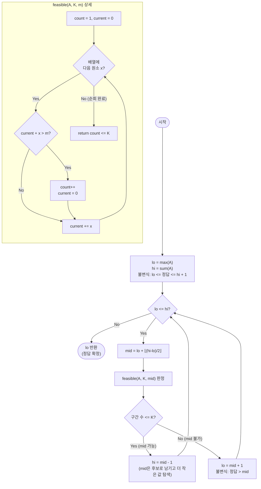

import { AlgorithmSimulation } from "#guide-sim";

# Parametric Binary Search — 최적값을 직접 만들지 않고 "가능한가?"로 되물으면 이진 탐색이 되는 이유

## 한눈에 보는 컨셉

배열을 `K`개의 연속 구간으로 나눌 때 "구간 합의 최댓값"을 최소화하는 값을 직접 구성하려 들면 분할 경우의 수가 폭발해요. 대신 "구간 합이 `m`을 넘지 않도록 `K`개 이하로 나눌 수 있는가?"라는 예/아니오 질문으로 바꾸면, 이 답은 `m`이 커질수록 아니오에서 예로 **단 한 번만** 뒤집히는 단조성을 가지므로 이진 탐색으로 그 경계값을 `O(N log(∑A))`에 찾을 수 있습니다. 판정 자체는 탐욕 순회 한 번, `O(N)`이면 충분해요.

## 출발점: 가장 순진한 방법부터

문제부터 정확히 붙잡고 갈게요.

```ts
function parametricBinarySearch(A: number[], K: number): number
```

| 항목 | 의미 | 제약 |
|------|------|------|
| `A` | 음이 아닌 정수 배열 | $1 \leq N \leq 10^5$, $0 \leq A[i] \leq 10^6$ |
| `K` | 나눌 연속 부분 배열의 개수 | $1 \leq K \leq N$ |
| 반환 | 가능한 모든 $K$-분할 중 "부분 배열 합의 최댓값"의 최솟값 | 양의 정수, $\max(A) \leq \text{답} \leq \sum A \leq 10^{11}$ |

"최댓값을 최소화하라"는 문제를 만나면 가장 정직한 출발은 **가능한 분할을 전부 나열하고 각각의 최댓값을 비교**하는 것입니다. 작은 예로 손을 움직여 볼게요.

```text
A = [7, 2, 5, 10, 8], K = 2  → 자를 위치 4곳(원소 사이) 중 1곳을 고른다

cut 뒤 0   : [7]        | [2,5,10,8]   합 7,  25   → max 25
cut 뒤 1   : [7,2]      | [5,10,8]     합 9,  23   → max 23
cut 뒤 2   : [7,2,5]    | [10,8]       합 14, 18   → max 18   ← 최소
cut 뒤 3   : [7,2,5,10] | [8]          합 24, 8    → max 24

최선 = min(25, 23, 18, 24) = 18
```

이걸 코드로 그대로 옮기면 이렇습니다.

```ts
function parametricBinarySearchNaive(A: number[], K: number): number {
  const N = A.length;
  let best = Infinity;

  function trySplit(startIdx: number, cutsLeft: number, cuts: number[]): void {
    if (cutsLeft === 0) {
      const boundaries = [...cuts, N];
      let prev = 0;
      let maxSum = 0;
      for (const b of boundaries) {
        let sum = 0;
        for (let i = prev; i < b; i++) sum += A[i]!;
        maxSum = Math.max(maxSum, sum);
        prev = b;
      }
      best = Math.min(best, maxSum);
      return;
    }
    for (let i = startIdx; i <= N - cutsLeft; i++) {
      trySplit(i + 1, cutsLeft - 1, [...cuts, i]);
    }
  }

  trySplit(1, K - 1, []);
  return best;
}
```

`N = 5`짜리 예시는 자를 위치 4곳 중 1곳만 고르면 되니 경우의 수가 4개뿐이라 만만해 보입니다. 그런데 `N`과 `K`가 커지면 사정이 완전히 달라져요. 자를 위치는 `N-1`곳이고 그중 `K-1`곳을 고르는 조합이므로,

```text
경우의 수 = C(N-1, K-1)

N = 5,  K = 2  → C(4, 1)     = 4               (방금 손으로 다 세어 봄)
N = 10^5, K = 5×10^4 → C(99999, 49999)  ≈ 사실상 무한대 (지수적으로 폭발)
```

동적 계획법으로 바꿔서 `dp[i][j] = 첫 i개를 j구간으로 나눈 최솟값`을 정의해도 상태 전이마다 이전 구간 시작점을 훑어야 해서 시간이 이렇습니다.

```text
O(N^2 K) 로 어림잡으면
N = K = 10^5 일 때  10^5 × 10^5 × 10^5 = 10^15

1초 제한에서 감당 가능한 연산량은 보통 10^8 안팎 → 10^15는 그보다 10,000,000배 넘게 큼
```

직접 나열도, DP도 막힙니다. 그런데 여기서 낌새가 하나 보여요 — **"최적 분할을 직접 구성하지 말고, 정답의 후보값 하나를 놓고 '이 값이 가능한가?'만 판별할 수는 없을까?"** 이 질문이 다음 절의 출발점입니다.

## 아이디어 자세히 들여다보기

### "가능한가?"로 되묻기 — 수식과 그림

정답 후보값 `m`을 하나 정하고, "구간 합이 `m`을 넘지 않도록 탐욕적으로 최대한 길게 이어 붙였을 때 필요한 구간 수"를 $g(m)$이라고 정의할게요. 탐욕 규칙은 단순합니다 — 왼쪽부터 순서대로 원소를 현재 구간에 넣되, 다음 원소를 넣으면 합이 `m`을 넘는 순간 새 구간을 시작합니다.

$$
g(m) = 1 + \#\{\text{탐욕 순회 중 새 구간을 시작해야 했던 순간}\}
$$

$$
\text{feasible}(m) \iff g(m) \leq K
$$

`A = [7, 2, 5, 10, 8]`에 대해 `m`을 10부터 32까지 하나씩 늘려가며 $g(m)$을 직접 계산해 표로 채워 보면 이렇습니다(실측값입니다).

```text
m     : 10 11 12 13 | 14 15 16 17 | 18 19 20 21 22 23 24 25 26 27 28 29 30 31 | 32
g(m)  :  4  4  4  4  |  3  3  3  3 |  2  2  2  2  2  2  2  2  2  2  2  2  2  2 |  1

K = 2 라면 -----------------------^ m=18에서 처음 g(m) <= 2 (여기가 정답)
```

계단이 **내려가기만 하고 다시 올라가지 않는다**는 것이 눈에 보이시나요? `m`이 커질수록 한 구간에 더 많은 원소를 욱여넣을 수 있으니 구간 수는 줄어들거나 그대로일 뿐, 절대 늘어나지 않습니다. 이 단조 감소가 이번 절 전체의 근거예요.

잠깐, 확인 질문 하나만 해 볼까요? 표에서 `g(24)`와 `g(28)`은 둘 다 2인데, 왜 같은 값이 이렇게 넓게 이어질까요? — 답: $g(m)$은 "**필요한 최소** 구간 수"이지 "정확히 이 개수"가 아니기 때문입니다. 여유(`m - 실제 필요한 합`)가 늘어나도 이미 2개로 충분하면 굳이 더 쪼갤 이유가 없어요.

**왜 하필 "≤ K"로 정의할까요?** "정확히 K개로 나눈 최댓값이 m 이하인가"로 정의해도 답은 같지만, 이 표현은 탐욕이 만들어 내는 값과 바로 비교하기 어렵습니다. 탐욕은 "최소 몇 개가 필요한가"를 계산할 뿐이고, 그 최솟값이 `K` 이하라면 남는 여유는 (원소가 비음수이므로) 기존 구간을 더 잘게 쪼개서 정확히 `K`개로 채울 수 있습니다. 그래서 "$g(m) \leq K$"라는 형태가 탐욕의 계산 결과와 곧바로 맞아떨어지는 자연스러운 정의예요.

### 단서를 설명해 주는 이론 — 단조 판정 위의 이진 탐색

방금 만든 단서 — "판정 결과가 후보값에 대해 단조적으로 뒤집힌다" — 는 이미 일반적인 설계 기법으로 정리되어 있습니다. **결정 문제로 바꾼 최적화(decision-based optimization)**, 혹은 **이진 탐색 온 답(binary search on the answer)** 이라고 부르는 방식이에요. Nimrod Megiddo가 계산기하학에서 정식화한 파라메트릭 서치(parametric search) 계열도 같은 뿌리에서 나온 아이디어입니다. 절차는 세 단계로 정리됩니다.

1. "최솟값/최댓값 `X`를 구하라"는 최적화 문제를, "`X`가 `t` 이하로 가능한가?"라는 결정 문제 $P(t)$로 바꾼다.
2. $P(t)$가 `t`에 대해 단조임을 보인다 — 어떤 경계 $t^*$ 기준으로 그 이전은 전부 거짓, 그 이후는 전부 참(또는 반대).
3. $P(t)$ 판정 비용이 $C$라면, 전체 비용은 이진 탐색 반복 횟수 $\times C = O(\log(\text{탐색 범위}) \times C)$.

이 문제에 그대로 대응시켜 볼게요. `t = m`, $P(m) = \text{feasible}(m)$, 탐색 범위는 $[\max(A), \sum A]$, 판정 비용 $C$는 탐욕 순회 한 번인 $O(N)$입니다.

```text
탐색 범위 크기 = ∑A - max(A) + 1 ≤ 10^11
이진 탐색 반복 횟수 ≈ log2(10^11) ≈ 36.5 → 약 37회

전체 비용 ≈ N × 37 ≈ 10^5 × 37 = 3.7×10^6

1초 제한의 여유 연산량(보통 10^8 안팎) 안에 넉넉히 들어옴  ✓
```

목표로 삼았던 $O(N \log(\sum A))$를 실제 수치로 확인했습니다 — naive의 $10^{15}$과는 자릿수가 8~9개나 차이 나요. 이 "**반복 횟수가 입력 값과 무관하게 약 37회로 고정된다**"는 사실, 뒤에서 최적화 단서를 찾을 때 다시 쓰이니 기억해 두세요.

### 왜 모순 없이 작동하는가

이 알고리즘이 옳다는 것을 보이려면 두 가지를 증명해야 해요. 하나는 "탐욕 판정이 정말 최소 구간 수를 구하는가", 다른 하나는 "이진 탐색이 정말 정답에 수렴하는가"입니다.

**탐욕 판정의 최적성.** 탐욕이 구한 구간 수 $g(m)$이 실제 최솟값임을 귀납으로 보입니다.

- *기저*: 탐욕의 첫 구간은 "합이 `m`을 넘지 않는 한 가장 멀리까지" 뻗습니다. 어떤 분할이든 첫 구간의 합은 `m` 이하여야 하므로, 그 어떤 분할의 첫 구간도 탐욕의 첫 구간보다 더 멀리 갈 수 없습니다. 즉 탐욕의 첫 경계 $c_1$은 다른 어떤 분할의 첫 경계 $d_1$보다 뒤에 있거나 같습니다($c_1 \geq d_1$).
- *귀납 단계*: $i-1$번째 경계까지 탐욕이 항상 뒤처지지 않았다고($c_{i-1} \geq d_{i-1}$) 가정해 볼게요. 탐욕의 $i$번째 구간은 $c_{i-1}+1$에서 시작하고, 비교 대상 분할의 $i$번째 구간은 $d_{i-1}+1$에서 시작합니다. $c_{i-1} \geq d_{i-1}$이므로 탐욕은 **더 늦게 출발**하고, 원소가 모두 비음수이므로 늦게 출발할수록 같은 지점까지의 누적 합은 작거나 같습니다(먼저 지나간 원소들을 덜어냈으니까요). 따라서 탐욕은 같은 `m` 제한 안에서 적어도 $d_i$까지는 갈 수 있고, 결국 $c_i \geq d_i$가 유지됩니다.
- *경우의 완전성*: 각 구간은 "탐욕이 이미 뒤처지지 않은 상태에서 한 칸 더 진행하는 경우" 하나뿐이며, 이는 모든 구간 인덱스에 예외 없이 적용됩니다.
- *결론*: 마지막 구간까지 $c_i \geq d_i$가 유지되므로, 어떤 분할이 $p$개의 구간으로 끝낼 수 있다면 탐욕도 $p$개 이하로 끝낼 수 있습니다. 즉 탐욕이 구한 개수가 곧 최솟값 $g(m)$입니다.

여기서 **원소가 비음수라는 조건이 핵심적으로 쓰입니다** — "늦게 출발할수록 누적 합이 작거나 같다"는 성질은 중간에 뺀 원소들이 절대 음수가 아닐 때만 성립해요. (이 지점은 아래 "스스로 점검하기" 3번 문제에서 다시 다룹니다.)

**이진 탐색의 정당성.** 정답을 $m^*$(가능한 가장 작은 실행 가능값)이라 하면, 루프 내내 다음 불변식이 유지됩니다.

$$
\text{lo} \leq m^* \leq \text{hi} + 1
$$

- *기저*: 시작 시 `lo = max(A)`, `hi = sum(A)`입니다. 최댓값을 포함하는 구간의 합은 최소 `max(A)`이므로 그보다 작은 `m`은 항상 실패 — 즉 $m^* \geq \text{max}(A) = \text{lo}$. 전체를 한 구간으로 두는 것(`K=1`에 해당하는 분할)은 항상 가능하므로 $m^* \leq \text{sum}(A) = \text{hi} \leq \text{hi}+1$. 기저 성립.
- *귀납 — `feasible(mid)`가 참일 때*: `mid`가 가능하다는 것은 정의상 $m^* \leq \text{mid}$라는 뜻입니다(더 작은 실행 가능값이 있을 수도 있지만, 적어도 mid 자체는 실행 가능). `hi`를 `mid - 1`로 줄이므로, 새 불변식 $m^* \leq \text{hi}' + 1 = \text{mid}$는 방금 보인 사실과 정확히 같습니다. `lo`는 그대로이므로 $\text{lo} \leq m^*$도 유지됩니다.
- *귀납 — `feasible(mid)`가 거짓일 때*: `mid`가 불가능하다는 것은 $m^* > \text{mid}$, 즉 $m^* \geq \text{mid}+1$이라는 뜻입니다. `lo`를 `mid+1`로 올리므로 $\text{lo}' = \text{mid}+1 \leq m^*$가 유지됩니다. `hi`는 그대로이므로 $m^* \leq \text{hi}+1$도 유지됩니다.
- *경우의 완전성*: `feasible(mid)`는 참 또는 거짓 둘 중 하나이고, 위 두 경우가 그 전부를 다룹니다.
- *종료*: 루프는 `lo > hi`, 즉 $\text{lo} \geq \text{hi}+1$일 때 끝납니다. 불변식 $\text{lo} \leq m^* \leq \text{hi}+1 \leq \text{lo}$를 모으면 $m^* = \text{lo}$가 강제됩니다.

이제 실제로 헷갈리는 지점 두 곳을 짚을게요.

**여기서 헷갈리기 쉬운 포인트는 `hi = mid`와 `hi = mid - 1`을 혼동하는 것입니다.** 이 알고리즘은 `while (lo <= hi)` 루프를 쓰므로 반드시 `hi = mid - 1`이어야 해요. 만약 "mid도 후보로 남겨야 하니까"라는 생각으로 `hi = mid`를 쓰면 어떻게 될까요? `lo`와 `hi`가 같아지는 순간(예: `lo = hi = 18`)에 `mid = 18`이 되고, `feasible(18)`이 참이면 `hi = mid = 18`로 **값이 그대로**입니다. 그러면 `lo <= hi` 조건이 영원히 참으로 남아 루프가 끝나지 않습니다. 실제로 `A=[7,2,5,10,8], K=2`에 이 버그 버전을 돌려 보면 51번 반복해도 종료 조건을 만나지 못하고 무한히 돕니다(직접 실행해 확인한 값입니다).

```text
Before(옳음): feasible(mid)=true → hi = mid - 1   (lo=hi=18일 때 hi=17이 되어 lo>hi로 종료)
After(버그) : feasible(mid)=true → hi = mid       (lo=hi=18일 때 hi=18 그대로 → 무한 루프)
```

> 기억법: "`lo <= hi`로 도는 루프는 반드시 `-1`로 한 칸 물러나야 끝난다."

**두 번째로 헷갈리기 쉬운 포인트는 판정 조건의 부등호입니다.** `feasible` 안의 `current + x > m`을 `current + x >= m`으로 바꾸면 어떻게 될까요? 이제 "정확히 `m`이 되는 순간"도 새 구간을 강제로 시작합니다. `A=[7,2,5,10,8], K=2`, `m=18`일 때 두 번째 구간은 `10+8=18`로 딱 `m`과 같은데, `>=` 버전은 이걸 초과로 취급해 `[7,2,5],[10],[8]` 세 구간으로 쪼개 버립니다. 그 결과 `feasible(18)`이 거짓으로 잘못 판정되고, 이진 탐색은 18을 건너뛰어 실제로 **19**를 반환합니다(정답 18보다 큰 오답 — 직접 실행해 확인한 값입니다).

```text
정답 판정: current(10) + x(8) = 18, m = 18  →  18 > 18 은 거짓 → 같은 구간에 남는다  (옳음)
버그 판정: current(10) + x(8) = 18, m = 18  →  18 >= 18 은 참  → 새 구간 시작        (틀림)
```

엣지 케이스도 불변식 위에서 하나씩 확인해 둘게요.

```text
K = 1 (분할 없음)        : lo = max(A), hi = sum(A). 정답 = sum(A) = 전체 합
K = N (최대 분할)        : 각 원소가 한 구간. 정답 = max(A)
원소 1개 (N = 1)          : lo = hi = A[0]. 루프가 아예 안 돌고 lo = A[0] 반환
A[i] = 0 이 섞여 있음     : 합에 0을 더해도 구간 수는 그대로. 정상 동작
최대 입력 (N=10^5, A[i]=10^6, K=1) : 정답 = 10^11, JS 안전 정수 범위(약 9×10^15) 안
```

## 아이디어를 코드로 옮기기

방금 정의한 아이디어를 그대로 옮기면 이렇습니다. 이해를 돕기 위해 "실제로 구간을 배열로 만들어서" 개수를 세는 버전부터 시작할게요.

```ts
function feasibleBasic(A: number[], K: number, m: number): boolean {
  const segments: number[][] = [[]];
  let current = 0;
  for (const x of A) {
    if (current + x > m) {
      segments.push([]);
      current = 0;
    }
    segments[segments.length - 1]!.push(x);
    current += x;
  }
  return segments.length <= K;
}

function boundsBasic(A: number[]): { lo: number; hi: number } {
  return { lo: Math.max(...A), hi: A.reduce((a, b) => a + b, 0) };
}

function parametricBinarySearchBasic(A: number[], K: number): number {
  let { lo, hi } = boundsBasic(A);
  while (lo <= hi) {
    const mid = lo + Math.floor((hi - lo) / 2);
    if (feasibleBasic(A, K, mid)) {
      hi = mid - 1; // mid는 가능 → 후보로 기억하고 더 작은 값 탐색
    } else {
      lo = mid + 1; // mid는 불가능 → 더 큰 값 탐색
    }
  }
  return lo;
}
```

가장 실수가 잦은 줄은 `if (current + x > m)`의 **부등호 방향**과, `hi = mid - 1`의 **`-1` 유무**입니다. 둘 다 앞 절에서 실측으로 확인한 함정이에요. 그 외 결정 지점을 짚으면:

- 초기값 `current = 0`, `segments = [[]]` — 빈 구간 하나로 시작해 첫 원소부터 채웁니다.
- 순회 방향은 왼쪽에서 오른쪽 한 방향뿐입니다. 탐욕은 "뒤로 되돌아가지 않는다"는 성질에 의존하므로 방향을 바꾸면 증명 자체가 무너집니다.
- `current + x > m` 검사가 항상 `push`/`+=` **이전에** 옵니다 — 검사 순서를 바꾸면 이미 넘친 합에 원소를 먼저 넣어 버립니다.

## 더 빠르게 만들 단서 찾기

이 기본 구현을 그대로 실행에 옮긴다고 상상해 볼게요. 이진 탐색은 앞서 이론 절에서 계산한 대로 약 37번 반복하고, `feasible` 함수는 반복마다 한 번씩 — 즉 총 37번 호출됩니다. 그런데 `feasibleBasic`은 호출될 때마다 `segments`라는 **새 배열들의 배열**을 처음부터 만듭니다.

```text
반복 1: feasible(mid1) 호출 → segments 배열 새로 생성, 원소 N개 push
반복 2: feasible(mid2) 호출 → segments 배열 또 새로 생성, 원소 N개 push
...
반복 37: 또 새로 생성

같은 정보(구간 개수)만 알면 되는데, 37번 모두 O(N) 크기의 배열 뭉치를 새로 할당하고 버린다
```

우리가 실제로 최종 답에서 쓰는 정보는 "구간이 몇 개 필요한가"라는 숫자 하나뿐이에요. 구간에 어떤 원소들이 담겼는지는 답을 계산하는 데 전혀 필요하지 않습니다. 배열을 통째로 만드는 건 **판정 한 번에 O(N) 추가 공간을 썼다가 버리는** 낭비입니다.

## 단서를 최적화로 연결하기

배열 대신 **숫자 두 개**(현재까지 만든 구간 수 `count`, 현재 구간에 쌓인 합 `current`)만 유지하면 같은 판정을 할 수 있습니다.

```text
Before: segments: number[][] 전체를 유지  →  O(N) 공간, 원소마다 push
After : count, current 두 스칼라만 유지    →  O(1) 공간, 원소마다 비교·덧셈만
```

이 교체가 안전한 이유는 `feasibleBasic`이 실제로 배열 내용을 다시 들여다보는 곳이 `segments.length`, 즉 **개수**뿐이기 때문입니다. 각 원소를 담은 뒤에는 그 원소가 어느 구간에 있었는지 다시 참조하지 않으므로(판정이 끝날 때까지 각 구간은 "지금 채우는 중"이라는 상태 하나만 가지면 충분), 구간 전체를 기억할 필요 없이 진행 중인 구간의 누적 합만 알면 됩니다. 여기에 더해, 이미 만든 구간 수가 `K`를 넘는 순간 더 볼 필요가 없다는 것도 이용할 수 있어요 — 남은 원소를 마저 세어 봐야 답은 어차피 "불가능"이니까요.

## 최적화 코드

바뀌는 곳은 `feasible` 함수 하나뿐입니다.

```ts
function feasible(A: number[], K: number, m: number): boolean {
  let count = 1;
  let current = 0;
  for (const x of A) {
    if (current + x > m) {
      count++;
      if (count > K) return false; // 이미 K를 넘었으니 더 볼 필요 없다
      current = 0;
    }
    current += x;
  }
  return true; // 끝까지 세었는데 count <= K 였다는 뜻
}

function bounds(A: number[]): { lo: number; hi: number } {
  let maxA = A[0]!;
  let total = 0;
  for (const x of A) {
    if (x > maxA) maxA = x;
    total += x;
  }
  return { lo: maxA, hi: total };
}

function parametricBinarySearch(A: number[], K: number): number {
  let { lo, hi } = bounds(A);
  while (lo <= hi) {
    const mid = lo + Math.floor((hi - lo) / 2);
    if (feasible(A, K, mid)) {
      hi = mid - 1;
    } else {
      lo = mid + 1;
    }
  }
  return lo;
}
```

가장 중요한 줄은 `if (count > K) return false;`입니다. 조기 종료 자체가 없어도 정답은 똑같이 나오지만(최종적으로 `count > K`가 되면 마지막에 `return count <= K`가 어차피 거짓을 반환하므로), 이 줄이 있으면 이미 실패가 확정된 뒤에 남은 원소를 억지로 다 훑는 낭비를 막습니다. `bounds`도 `max`와 `sum`을 배열 한 번의 순회로 함께 구해, 두 번 훑을 것을 한 번으로 줄였어요.

공간 복잡도가 $O(N)$에서 $O(1)$로 줄어든 근거를 다시 정리하면 — 판정 한 번은 지금 진행 중인 구간의 누적 합(`current`)과 지금까지 만든 구간 수(`count`)라는 스칼라 두 개 외에는 아무 것도 참조하지 않습니다. 배열에 저장해 뒀던 과거 구간의 내용은 이후 계산에 전혀 쓰이지 않으므로 안전하게 버릴 수 있어요.

시간 복잡도는 여전히 이론 절에서 확인한 $O(N \log(\sum A)) \approx 3.7 \times 10^6$ 그대로입니다 — 조기 종료와 공간 절약은 이 점근 상한 안에서 상수항과 부가 공간을 줄인 것이지, 반복 횟수나 점근 복잡도 자체를 바꾸지는 않습니다.

더 최적화할 여지가 있을까요? 이진 탐색 반복 횟수는 탐색 범위의 로그이므로 더 줄이기 어렵고, 판정 자체도 배열을 한 번 훑어야 하니 $\Omega(N)$ 아래로 내려갈 수 없습니다(원소 하나만 바꿔도 정답이 바뀔 수 있으니, 모든 원소를 적어도 한 번은 봐야 해요). 이 문제(split array largest sum)에 특화하면 비용 함수가 특정 부등식(quadrangle inequality)을 만족한다는 걸 증명해 분할 정복 최적화나 SMAWK류 기법으로 더 빠른 특화 해법을 만들 수도 있습니다. 다만 그 증명과 구현은 훨씬 복잡해요. 파라메트릭 이진 탐색의 진짜 가치는 여기 있습니다 — "판정 함수가 단조이고 $O(N)$ 안에 계산 가능하다"는 조건만 갖추면, 문제마다 매번 새 증명을 만들 필요 없이 **같은 틀을 재사용**할 수 있다는 범용성이에요.

## 실행 시각화

고정 입력 `A = [7, 2, 5, 10, 8]`, `K = 2`에 대해 파라메트릭 이진 탐색을 실행하는 과정입니다. 시각화 대상은 "답 후보값 `m`"의 정수 범위 `[lo, hi]`이며, 배열로 표현했습니다. 각 프레임의 `mid`(빨강)에 대해 `feasible(mid)`를 판정해 탐욕 분할 구간 수가 `K` 이하인지 확인하고, 결과에 따라 `hi = mid - 1` 또는 `lo = mid + 1`로 범위를 좁힙니다. 회색은 이미 정답이 될 수 없다고 확정되어 제거된 후보값입니다.

`lo = max(A) = 10`, `hi = sum(A) = 32`에서 시작해 `while (lo <= hi)` 루프를 돌며, 위 최적화 코드를 그대로 실행하면 `mid`가 `21 → 15 → 18 → 16 → 17` 순서로 판정되고 최종적으로 `lo = 18`에서 종료합니다. 실제 반환값도 `18`이며(본문 코드를 추출해 직접 실행해 확인한 값), 시뮬레이션 마지막 프레임의 `lo` 위치와 일치합니다.

> 대화형 시뮬레이션은 MDX 런타임에서 표시됩니다.

export const candidates = [10, 11, 12, 13, 14, 15, 16, 17, 18, 19, 20, 21, 22, 23, 24, 25, 26, 27, 28, 29, 30, 31, 32];

export const idx = (m) => m - 10;

export const steps = [
  {
    title: "초기화",
    detail: "lo = max(A) = 10, hi = sum(A) = 32. 정답은 이 범위 안에 있다.",
    array: candidates,
    pointers: { lo: idx(10), hi: idx(32) },
  },
  {
    title: "mid = 21 판정",
    detail: "feasible(21): 탐욕 분할 → [7,2,5],[10,8] 구간 2개 ≤ K=2 → true. hi = mid - 1 = 20.",
    array: candidates,
    highlight: [idx(21)],
    pointers: { lo: idx(10), mid: idx(21), hi: idx(32) },
  },
  {
    title: "21 가능 → 상위 절반 제거",
    detail: "21이 가능하므로 더 작은 값을 찾는다. 후보 [21..32] 제거, 구간 [10, 20].",
    array: candidates,
    marked: [idx(21), idx(22), idx(23), idx(24), idx(25), idx(26), idx(27), idx(28), idx(29), idx(30), idx(31), idx(32)],
    pointers: { lo: idx(10), hi: idx(20) },
  },
  {
    title: "mid = 15 판정",
    detail: "feasible(15): 탐욕 분할 → [7,2,5],[10],[8] 구간 3개 > K=2 → false. lo = mid + 1 = 16.",
    array: candidates,
    marked: [idx(21), idx(22), idx(23), idx(24), idx(25), idx(26), idx(27), idx(28), idx(29), idx(30), idx(31), idx(32)],
    highlight: [idx(15)],
    pointers: { lo: idx(10), mid: idx(15), hi: idx(20) },
  },
  {
    title: "15 불가능 → 하위 절반 제거",
    detail: "15는 불가능하므로 더 큰 값이 필요하다. 후보 [10..15] 제거, 구간 [16, 20].",
    array: candidates,
    marked: [idx(10), idx(11), idx(12), idx(13), idx(14), idx(15), idx(21), idx(22), idx(23), idx(24), idx(25), idx(26), idx(27), idx(28), idx(29), idx(30), idx(31), idx(32)],
    pointers: { lo: idx(16), hi: idx(20) },
  },
  {
    title: "mid = 18 판정",
    detail: "feasible(18): 탐욕 분할 → [7,2,5],[10,8] (10+8=18) 구간 2개 ≤ K=2 → true. hi = mid - 1 = 17.",
    array: candidates,
    marked: [idx(10), idx(11), idx(12), idx(13), idx(14), idx(15), idx(21), idx(22), idx(23), idx(24), idx(25), idx(26), idx(27), idx(28), idx(29), idx(30), idx(31), idx(32)],
    highlight: [idx(18)],
    pointers: { lo: idx(16), mid: idx(18), hi: idx(20) },
  },
  {
    title: "mid = 16 판정",
    detail: "구간 [16, 17], mid = 16. feasible(16): [7,2,5],[10],[8] 구간 3개 > K=2 → false. lo = mid + 1 = 17.",
    array: candidates,
    marked: [idx(10), idx(11), idx(12), idx(13), idx(14), idx(15), idx(19), idx(20), idx(21), idx(22), idx(23), idx(24), idx(25), idx(26), idx(27), idx(28), idx(29), idx(30), idx(31), idx(32)],
    highlight: [idx(16)],
    pointers: { lo: idx(16), mid: idx(16), hi: idx(17) },
  },
  {
    title: "mid = 17 판정",
    detail: "구간 [17, 17], mid = 17. feasible(17): [7,2,5],[10],[8] 구간 3개 > K=2 → false. lo = mid + 1 = 18.",
    array: candidates,
    marked: [idx(10), idx(11), idx(12), idx(13), idx(14), idx(15), idx(16), idx(19), idx(20), idx(21), idx(22), idx(23), idx(24), idx(25), idx(26), idx(27), idx(28), idx(29), idx(30), idx(31), idx(32)],
    highlight: [idx(17)],
    pointers: { lo: idx(17), mid: idx(17), hi: idx(17) },
  },
  {
    title: "종료 → lo = 18 반환",
    detail: "lo = 18 > hi = 17 이므로 루프 종료. lo = 18 이 정답. 18보다 작은 값은 모두 불가능, 18은 가능하다.",
    array: candidates,
    marked: [idx(10), idx(11), idx(12), idx(13), idx(14), idx(15), idx(16), idx(17), idx(19), idx(20), idx(21), idx(22), idx(23), idx(24), idx(25), idx(26), idx(27), idx(28), idx(29), idx(30), idx(31), idx(32)],
    highlight: [idx(18)],
    pointers: { lo: idx(18) },
  },
];

<AlgorithmSimulation view="array" steps={steps} title="파라메트릭 이진 탐색: 최소 최대구간합" />

## 흐름 한눈에 보기


```mermaid
flowchart TD
    A([시작]) --> B["lo = max(A)\nhi = sum(A)\n불변식: lo <= 정답 <= hi + 1"]
    B --> C{"lo <= hi?"}
    C -- No --> G(["lo 반환\n(정답 확정)"])
    C -- Yes --> D["mid = lo + ⌊(hi-lo)/2⌋"]
    D --> E["feasible(A, K, mid) 판정"]
    E --> F{구간 수 <= K?}
    F -- "Yes (mid 가능)" --> H["hi = mid - 1\n(mid은 후보로 남기고 더 작은 값 탐색)"]
    F -- "No (mid 불가)" --> I["lo = mid + 1\n불변식: 정답 > mid"]
    H --> C
    I --> C

    subgraph feasible["feasible(A, K, m) 상세"]
        direction TB
        P["count = 1, current = 0"] --> Q
        Q{배열에\n다음 원소 x?} -- Yes --> R{"current + x > m?"}
        R -- Yes --> S["count++\ncurrent = 0"]
        R -- No --> T["current += x"]
        S --> T
        T --> Q
        Q -- "No (순회 완료)" --> U["return count <= K"]
    end
```

## 스스로 점검하기

1. `A = [1, 2, 3, 4, 5]`, `K = 2`일 때 `lo`, `hi` 초기값과 첫 번째 `mid`, 그리고 `feasible(mid)`의 참/거짓을 손으로 계산해 보세요. (힌트: `lo = 5`, `hi = 15`이므로 `mid = 10`입니다. `1+2+3+4=10`까지는 한 구간에 담기고 `5`를 더하면 `15 > 10`이라 새 구간이 필요해 `count = 2`, `feasible(10) = true`가 됩니다. 참고로 이 배열의 최종 정답은 `9`예요.)
2. `feasible` 안의 조건을 `current + x > m`에서 `current + x >= m`으로 바꾸면 `A=[7,2,5,10,8], K=2`에서 몇 번째 판정부터 결과가 달라지고, 최종 반환값이 정답 `18`과 얼마나 어긋나는지 짚어 보세요.
3. 위 "왜 모순 없이 작동하는가"의 탐욕 최적성 증명은 "원소가 비음수"라는 조건에 기대고 있습니다. 만약 배열에 음수가 허용된다면, 증명의 어느 문장("늦게 출발할수록 누적 합이 작거나 같다")이 깨지는지, 그리고 그 결과 탐욕이 더 이상 최소 구간 수를 보장하지 못하는 구체적인 예를 하나 만들어 보세요.
