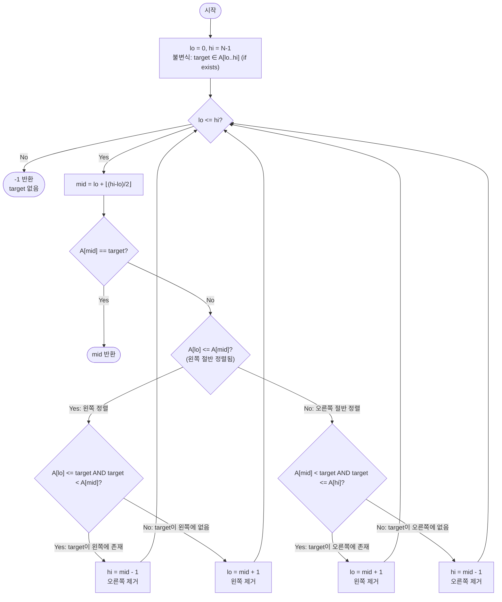

import { AlgorithmSimulation } from "#guide-sim";

# Search in Rotated Sorted Array — 회전된 배열도 절반은 반드시 정렬되어 있다는 사실

## 한눈에 보는 컨셉

회전된 정렬 배열은 전체로 보면 무질서해 보이지만, 아무 지점 `mid`로 나누면 두 절반 중 하나는 반드시 완전히 정렬되어 있어요. 정렬된 절반은 양 끝 값 비교만으로 target이 그 안에 있는지를 `O(1)`에 판정할 수 있으므로, 이 정보를 근거로 매 반복마다 절반을 통째로 버리는 이진 탐색이 가능합니다. 그 결과 `O(N)` 선형 탐색 대신 `O(log N)`에 정답을 찾아냅니다.

## 출발점: 가장 순진한 방법부터

문제를 먼저 정확히 잡을게요.

```ts
function searchInRotatedSortedArray(A: number[], target: number): number
```

| 파라미터 | 의미 | 제약 |
|----------|------|------|
| `A` | 알 수 없는 지점에서 회전된 오름차순 정렬 배열 | $1 \leq N \leq 10^6$, 모든 원소가 서로 다름 |
| `target` | 찾을 목표값 | $-10^4 \leq \text{target} \leq 10^4$ |
| **반환** | `A[i] === target`을 만족하는 인덱스 `i`; 없으면 `-1` | — |

작은 예로 감을 잡아 봅시다. `A = [4, 5, 6, 7, 0, 1, 2]`는 원래 `[0,1,2,4,5,6,7]`이 인덱스 4에서 회전된 배열이에요. 여기서 나올 수 있는 입력 모양을 표로 미리 확인해 둡니다.

| 케이스 | 입력 예시 | 기대 출력 | 이유 |
|--------|-----------|-----------|------|
| 회전 없음(완전 정렬) | `A=[1,2,3,4,5]`, `target=3` | `2` | 일반 이진 탐색과 동일 |
| 회전 후 첫 원소 | `A=[4,5,6,7,0,1,2]`, `target=4` | `0` | 회전점 직후 첫 원소 |
| 회전 후 마지막 원소 | `A=[4,5,6,7,0,1,2]`, `target=2` | `6` | 원래 배열의 마지막 원소 |
| target 없음 | `A=[4,5,6,7,0,1,2]`, `target=3` | `-1` | 존재하지 않는 값 |
| 단일 원소, 일치 | `A=[1]`, `target=1` | `0` | 크기 1, 일치 |
| 단일 원소, 불일치 | `A=[1]`, `target=0` | `-1` | 크기 1, 불일치 |
| 회전점이 배열 중간 | `A=[3,4,5,1,2]`, `target=1` | `3` | 오른쪽 절반에서 발견 |

가장 정직한 방법은 배열을 처음부터 끝까지 하나씩 비교하는 것입니다. 회전이 됐든 안 됐든 상관없이 무조건 정답을 찾아내니까요.

```ts
function searchNaive(A: number[], target: number): number {
  for (let i = 0; i < A.length; i++) {
    if (A[i] === target) return i;
  }
  return -1;
}
```

이 방법의 비용을 수치로 체감해 볼게요.

```text
N = 10^6, target이 배열 뒤쪽에 있거나 아예 없는 경우
비교 횟수:  1, 2, 3, ..., 999999, 1000000  →  최악 100만 번 비교
```

$N$이 최대 $10^6$이면 100만 번 비교가 일어날 수 있는데, 목표 복잡도 $O(\log N)$과는 거리가 멉니다. $N=10^6$일 때 $\log_2 N \approx 20$이니, 목표는 겨우 20번 안팎의 비교로 끝나는 방법이에요.

더 중요한 문제는 따로 있습니다. 이 배열은 완전히 무작위가 아니에요 — 원래 오름차순으로 정렬돼 있다가, 어느 한 지점에서 통째로 잘려 앞뒤가 바뀐 것뿐이죠. **선형 탐색은 이 "원래 정렬돼 있었다"는 구조를 전혀 쓰지 않습니다.** 이 구조를 활용하면 매번 절반씩 버릴 방법이 있지 않을까요?

## 아이디어 자세히 들여다보기

### 절반은 반드시 정렬되어 있다 — 수식과 그림

배열 $A$가 원래 오름차순 배열 $S$를 회전점 $k$ ($0 \le k < N$)에서 회전한 것이라면, 다음이 성립합니다.

$$A[i] = S[(i + k) \bmod N]$$

회전점은 딱 하나뿐이라는 점이 핵심이에요 — $A$ 전체를 훑을 때 "이전 원소보다 작아지는" 지점(내리막)이 단 한 곳뿐입니다. 그러니 구간 $[\text{lo}, \text{hi}]$ 안에서 아무 지점 `mid`를 잡아도, 그 내리막(회전점)은 왼쪽 절반 $[\text{lo}, \text{mid}]$과 오른쪽 절반 $[\text{mid}, \text{hi}]$ 중 **최대 한쪽에만** 있을 수 있어요. 나머지 한쪽은 내리막이 없으니 완전히 오름차순입니다.

두 가지 경우를 그림으로 봅시다.

```text
case 1: 회전점이 오른쪽에 있음 → 왼쪽 절반이 완전히 정렬됨

  인덱스:   0   1   2   3   4   5   6
  A     : [ 4   5   6   7 | 0   1   2 ]
            └───lo..mid───┘
            4 ≤ 5 ≤ 6 ≤ 7  (오름차순 유지, 내리막 없음)
            내리막(7 → 0)은 mid 오른쪽에 있음
```

```text
case 2: 회전점이 왼쪽에 있음 → 오른쪽 절반이 완전히 정렬됨

  인덱스:   0   1   2   3   4   5   6
  A     : [ 6   7   0   1 | 2   4   5 ]
                        └──mid..hi──┘
                        1 ≤ 2 ≤ 4 ≤ 5  (오름차순 유지)
            내리막(7 → 0)은 mid 왼쪽에 있음
```

확인 질문 하나 풀어 볼까요? `A = [30, 40, 50, 10, 20]`에서 `lo=0, hi=4, mid=2`(`A[2]=50`)라면 어느 절반이 정렬돼 있을까요? — 왼쪽 `[30,40,50]`은 오름차순이고, 오른쪽 `[50,10,20]`은 `50 > 10`이라 내리막이 있습니다. 즉 **왼쪽이 정렬된 절반**입니다.

이제 정렬된 절반을 알면, 그 절반의 양 끝 값만 보고 target이 그 안에 있는지를 $O(1)$로 판정할 수 있어요.

$$\text{왼쪽 } [\text{lo}, \text{mid}] \text{ 정렬됨} \;\Rightarrow\; \text{target} \in [\text{lo}, \text{mid}] \iff A[\text{lo}] \le \text{target} \le A[\text{mid}]$$

여기서 탐색 구간을 **닫힌 구간** $[\text{lo}, \text{hi}]$로 정의하는 이유를 짚고 갈게요. 만약 반열린 구간 $[\text{lo}, \text{hi})$로 정의하면 배열의 마지막 원소(`hi = N`)를 표현할 방법이 없거나, 매 갱신마다 경계를 따로 보정해야 해서 코드가 지저분해집니다. 닫힌 구간을 쓰면 "구간이 원소 1개짜리(`lo == hi`)까지 줄어들 때"와 "구간이 빈 상태(`lo > hi`)"를 각각 `A[lo]` 접근 가능 여부로 명확히 구분할 수 있어요.

### 왜 모순 없이 작동하는가

이 알고리즘이 끝까지 지키는 약속(불변식)은 하나입니다.

> **불변식**: target이 배열 $A$ 안에 존재한다면, 루프의 모든 시점에서 반드시 $A[\text{lo} \ldots \text{hi}]$ 구간 안에 있다.

**기저**: 처음에 $\text{lo}=0$, $\text{hi}=N-1$이므로 배열 전체가 구간이고, target이 있다면 당연히 이 구간 안에 있습니다.

**귀납 단계**: 구간 $[\text{lo}, \text{hi}]$에서 불변식이 성립한다고 가정하고, 한 번의 반복 후에도 성립함을 보입니다. `mid`에서 `A[lo] <= A[mid]`인지 아닌지로 정확히 두 경우가 나뉘는데, 이 두 조건은 서로 배타적이면서 모든 경우를 덮습니다(**경우의 완전성**) — 셋 이상으로 갈라질 여지가 없어요.

- **Case 1 (`A[lo] <= A[mid]`, 왼쪽 절반이 정렬됨)**: `A[lo] <= target < A[mid]`이면 정렬된 왼쪽 절반 안에 target이 있다고 확정할 수 있으므로(양 끝 값 비교로 $O(1)$ 판정), target이 있다면 반드시 $[\text{lo}, \text{mid}-1]$ 안에 있어 `hi = mid - 1`로 줄여도 안전합니다. 조건이 거짓이면 정렬된 왼쪽 절반에는 target이 없다고 확정되므로, target이 있다면 반드시 오른쪽 $[\text{mid}+1, \text{hi}]$ 안에 있어 `lo = mid + 1`로 줄여도 안전합니다(**각 경우의 정확성**).
- **Case 2 (`A[mid] < A[lo]`, 오른쪽 절반이 정렬됨)**: 대칭적으로, `A[mid] < target <= A[hi]`이면 target은 정렬된 오른쪽 절반 안에 있으므로 `lo = mid + 1`, 아니면 왼쪽 $[\text{lo}, \text{mid}-1]$에 있으므로 `hi = mid - 1`로 줄입니다.

두 경우 모두 갱신 후에도 "target이 있다면 새 구간 안에 있다"가 유지되므로, 불변식이 반복마다 보존됩니다. 그리고 `lo = mid + 1` 또는 `hi = mid - 1`은 구간을 최소 1 줄이므로 유한 번 안에 `lo > hi`가 되어 종료합니다.

여기서 **헷갈리기 쉬운 포인트**가 하나 있습니다 — `A[lo] <= A[mid]`에서 등호를 빠뜨리고 `A[lo] < A[mid]`로 쓰면 어떻게 될까요? `lo == mid`인 순간(구간 크기가 1 또는 2일 때)에는 항상 `A[lo] == A[mid]`인데, 등호가 없으면 이 경우가 Case 2(오른쪽 정렬)로 잘못 분류됩니다. 실제로 값이 틀어지는 걸 봅시다.

```text
A = [3, 1], target = 1        (정답 인덱스는 1)

등호 있음(A[lo] <= A[mid], 올바름):
  lo=0, hi=1, mid=0, A[mid]=3
  A[lo]=3 <= A[mid]=3 → Case 1(왼쪽 정렬)
  target=1 >= A[lo]=3?  거짓  → lo = mid+1 = 1
  lo=1, hi=1, mid=1, A[mid]=1 == target → return 1   ✓

등호 없음(A[lo] < A[mid], 버그):
  lo=0, hi=1, mid=0, A[lo]=3, A[mid]=3
  A[lo] < A[mid]?  3 < 3  거짓 → Case 2(오른쪽 정렬)로 잘못 분기
  A[mid]=3 < target=1?  거짓  → hi = mid-1 = -1
  lo=0 > hi=-1 → 루프 종료 → return -1              ✗ (정답 1을 놓침)
```

등호 하나 때문에 정답 `1` 대신 `-1`을 반환하는, 겉으로는 티가 안 나는 실패입니다. **모든 원소가 유일**하다는 제약 덕분에 `A[lo] == A[mid]`가 성립하는 유일한 경우는 `lo == mid`(구간이 1~2 크기)뿐이고, 이때 왼쪽은 원소 1개짜리 구간이라 자명하게 정렬돼 있으므로 Case 1로 처리하는 것이 맞습니다.

엣지 케이스에서도 같은 불변식이 그대로 작동하는지 점검해 볼게요.

```text
N = 1              → lo=hi=0, mid=0, 한 번에 A[0]과 target 비교 후 종료
회전 없음(k=0)     → 항상 A[lo] <= A[mid] → Case 1만 실행 → 일반 이진 탐색과 동일
target이 없음      → 매 반복 구간이 줄다가 lo > hi가 되어 -1 반환
회전점이 lo 또는 hi → 두 경우 중 하나로 자연스럽게 분류될 뿐, 별도 처리 불필요
```

## 아이디어를 코드로 옮기기

앞의 관찰을 가장 직접적으로 코드로 옮기면 이렇게 됩니다 — "회전점을 먼저 찾고, 그다음 올바른 절반에서 평범한 이진 탐색을 한다"는 2단계 구성입니다.

```ts
function findRotationPivot(A: number[]): number {
  let lo = 0;
  let hi = A.length - 1;
  while (lo < hi) {
    const mid = lo + Math.floor((hi - lo) / 2);
    if (A[mid]! > A[hi]!) {
      lo = mid + 1; // 최솟값은 mid보다 오른쪽에 있음
    } else {
      hi = mid; // 최솟값은 mid이거나 그 왼쪽에 있음
    }
  }
  return lo; // 회전점(최솟값의 인덱스)
}

function binarySearchPlain(A: number[], lo: number, hi: number, target: number): number {
  while (lo <= hi) {
    const mid = lo + Math.floor((hi - lo) / 2);
    if (A[mid] === target) return mid;
    if (A[mid]! < target) lo = mid + 1;
    else hi = mid - 1;
  }
  return -1;
}

function searchTwoPass(A: number[], target: number): number {
  const n = A.length;
  const pivot = findRotationPivot(A);
  if (pivot === 0) {
    return binarySearchPlain(A, 0, n - 1, target); // 회전 없음
  }
  if (target >= A[0]!) {
    return binarySearchPlain(A, 0, pivot - 1, target); // 왼쪽 정렬 구간
  }
  return binarySearchPlain(A, pivot, n - 1, target); // 오른쪽 정렬 구간
}
```

`findRotationPivot`은 "최솟값을 찾는 이진 탐색"이에요. `A[mid] > A[hi]`이면 mid까지도 내리막을 아직 못 지났다는 뜻이라 최솟값이 `mid`보다 오른쪽에 있고, 그렇지 않으면 최솟값이 `mid`이거나 그 왼쪽에 있습니다. 이걸로 회전점(최솟값의 인덱스) `pivot`을 얻으면, 배열은 `[0, pivot-1]`과 `[pivot, n-1]`이라는 두 개의 완전히 정렬된 구간으로 쪼개집니다.

**가장 실수가 잦은 부분은 `target >= A[0]` 분기입니다.** 등호를 빼먹으면 `target === A[0]`인 경우(예: 예시 표의 "회전 후 첫 원소" 케이스, `target=4`, `A[0]=4`)에 `[0, pivot-1]` 구간을 검사해야 하는데 오른쪽 구간으로 잘못 넘어가 정답을 놓칩니다. `A[0]`은 왼쪽 구간에 포함되는 값이므로 `>=`가 맞습니다.

## 더 빠르게 만들 단서 찾기

이 2단계 구현을 $N=10^6$ 기준으로 관찰해 봅시다.

```text
1단계 findRotationPivot:  약 log2(10^6) ≈ 20회 반복
2단계 binarySearchPlain:  약 log2(10^6) ≈ 20회 반복
합계:                     최악 약 40회 반복
```

점근 복잡도는 여전히 $O(\log N)$이라 목표를 만족하긴 합니다. 그런데 뭔가 낭비가 보이지 않나요? `findRotationPivot`의 루프도 매 `mid`마다 사실상 "왼쪽이 정렬됐는가, 오른쪽이 정렬됐는가"와 성격이 비슷한 판정(`A[mid] > A[hi]`)을 하고 있어요. 그리고 두 번째 루프에서도 결국 "target이 어느 쪽에 있는가"라는 또 다른 판정을 반복합니다. **회전점이라는 하나의 정보를 얻으려고 통째로 한 번 루프를 돌고, 그 정보를 쓰려고 또 한 번 루프를 돈다** — 이 두 루프를 하나로 합칠 수 있지 않을까요?

## 단서를 최적화로 연결하기

앞서 3.4에서 이미 증명한 불변식(target이 있다면 $A[\text{lo}..\text{hi}]$ 안에 있다)을 다시 봅시다. 이 불변식은 회전점이 뭔지 몰라도, **매 반복마다 "이번 mid 기준으로 어느 절반이 정렬됐는가"만 즉석에서 판정하면** 그대로 유지할 수 있어요. 즉 회전점을 미리 구해 둘 필요가 아예 없습니다 — 정렬된 절반 판정과 target 위치 판정을 **같은 루프, 같은 mid에서 동시에** 처리하면 됩니다.

```text
Before (2-pass):  [pivot 찾기 루프 ~20회] → [일반 이진 탐색 루프 ~20회]  = 순차 2회 루프

After  (1-pass):  [mid에서 "정렬된 절반 판정" + "target 위치 판정"을 동시에 처리하는 루프 ~20회]
                  = 루프 1개로 통합, 반복 횟수도 약 절반
```

## 최적화 코드

```ts
function searchInRotatedSortedArray(A: number[], target: number): number {
  let lo = 0;
  let hi = A.length - 1;

  while (lo <= hi) {
    const mid = lo + Math.floor((hi - lo) / 2);

    if (A[mid] === target) return mid;

    if (A[lo]! <= A[mid]!) {
      // 왼쪽 절반 [lo, mid]이 정렬됨
      if (A[lo]! <= target && target < A[mid]!) {
        hi = mid - 1; // target이 정렬된 왼쪽 안 → 오른쪽 제거
      } else {
        lo = mid + 1; // target이 왼쪽에 없음 → 왼쪽 제거
      }
    } else {
      // 오른쪽 절반 [mid, hi]이 정렬됨
      if (A[mid]! < target && target <= A[hi]!) {
        lo = mid + 1; // target이 정렬된 오른쪽 안 → 왼쪽 제거
      } else {
        hi = mid - 1; // target이 오른쪽에 없음 → 오른쪽 제거
      }
    }
  }
  return -1;
}
```

기본 구현과 비교하면, `findRotationPivot`과 `binarySearchPlain` 두 함수가 사라지고 **단 하나의 루프**로 합쳐졌습니다. **가장 중요한 줄은 `A[lo] <= A[mid]`입니다.** 이 한 줄이 "이번 반복에서 어느 절반이 정렬됐는가"를 결정하고, 그 판정에 따라 target이 어디 있을지를 곧바로 좁혀 나갑니다. 앞서 3.4에서 본 것처럼 등호를 빠뜨리면 `A=[3,1], target=1`에서 정답 `1` 대신 `-1`을 반환하는 조용한 실패로 이어집니다.

> 기억법: "왼쪽 끝이 mid보다 작거나 **같으면** 왼쪽은 무조건 정렬 — 원소 하나짜리 구간도 정렬이다."

더 최적화할 여지가 있을까요? 비교 기반 탐색은 $N$개의 후보 중 하나(또는 "없음")를 구별해야 하므로, 결정 트리의 정보 이론적 하한에 의해 최악의 경우 $\Omega(\log N)$번의 비교가 필요합니다. 이미 $O(\log N)$, $O(1)$ 공간에 도달했으니 점근적으로 더 줄일 여지는 없습니다. 참고로 배열에 **중복 원소가 허용되는 변형**은 `A[lo] == A[mid] == A[hi]`인 경우 어느 절반이 정렬됐는지 판별이 불가능해져, 이때는 `lo++`로 한 칸씩 물러나는 예외 처리가 필요하고 최악 $O(N)$이 됩니다 — 더 빠른 특화 해법이 아니라 오히려 더 까다로운 변형이라, 이 가이드의 "모든 원소가 유일하다"는 전제가 $O(\log N)$을 보장해 주는 핵심 조건임을 알 수 있습니다.

## 실행 시각화

고정 입력 `A = [4, 5, 6, 7, 0, 1, 2]`(인덱스 4에서 회전), `target = 0`에 대해 위 최적화 코드를 실행하는 과정입니다. 실제 반환값은 `4`이며, 패널의 `pointers`는 현재 `lo`/`mid`/`hi`를, 회색(`marked`)은 이미 제거된 인덱스를, 빨강(`highlight`)은 이번 반복에서 검사 중인 `mid`를 나타냅니다.

> 대화형 시뮬레이션은 MDX 런타임에서 표시됩니다.

export const arr = [4, 5, 6, 7, 0, 1, 2];

export const steps = [
  {
    title: "초기화",
    detail: "lo = 0, hi = 6. 전체 구간에서 탐색 시작. target = 0.",
    array: arr,
    pointers: { lo: 0, hi: 6 },
  },
  {
    title: "mid = 3, 왼쪽 절반 정렬 판정",
    detail: "A[3] = 7 ≠ 0. A[lo]=4 <= A[mid]=7 → 왼쪽 절반 [0,3] 정렬됨.",
    array: arr,
    highlight: [3],
    pointers: { lo: 0, mid: 3, hi: 6 },
  },
  {
    title: "target이 왼쪽 범위 밖 → 왼쪽 제거",
    detail: "0 은 [A[lo]=4, A[mid]=7) 범위에 없다. target은 오른쪽에 있다. lo = mid + 1 = 4.",
    array: arr,
    marked: [0, 1, 2, 3],
    pointers: { lo: 4, hi: 6 },
  },
  {
    title: "mid = 5, 왼쪽 절반 정렬 판정",
    detail: "A[5] = 1 ≠ 0. A[lo]=0 <= A[mid]=1 → 왼쪽 절반 [4,5] 정렬됨.",
    array: arr,
    marked: [0, 1, 2, 3],
    highlight: [5],
    pointers: { lo: 4, mid: 5, hi: 6 },
  },
  {
    title: "target이 왼쪽 범위 안 → 오른쪽 제거",
    detail: "A[lo]=0 <= 0 < A[mid]=1 이므로 target은 정렬된 왼쪽에 있다. hi = mid - 1 = 4.",
    array: arr,
    marked: [0, 1, 2, 3, 5, 6],
    pointers: { lo: 4, hi: 4 },
  },
  {
    title: "mid = 4, 발견",
    detail: "구간 [4,4], mid = 4. A[4] = 0 == target. 인덱스 4를 반환한다.",
    array: arr,
    marked: [0, 1, 2, 3, 5, 6],
    highlight: [4],
    pointers: { mid: 4 },
  },
];

<AlgorithmSimulation view="array" steps={steps} title="회전 정렬 배열 탐색: target = 0" />

## 흐름 한눈에 보기



## 스스로 점검하기

1. `A = [5, 6, 7, 8, 9, 1, 2, 3, 4]`, `target = 8`일 때 최적화 코드가 거치는 `lo, hi, mid` 값을 손으로 따라가 보세요. (힌트: `mid=4`(`A[4]=9`)에서 왼쪽이 정렬된 걸 확인하고 시작합니다. 정답 인덱스는 `3`입니다.)
2. 본문의 "왜 모순 없이 작동하는가"에서 본 것처럼 `A[lo] <= A[mid]`의 등호를 빼고 `A[lo] < A[mid]`로 바꾸면, `A = [3, 1]`, `target = 1`에서 정확히 어느 지점부터 판정이 틀어져 최종적으로 `-1`을 반환하게 되는지 추적해 보세요.
3. 만약 문제가 "target을 찾아라"가 아니라 "회전점(원래 배열의 최솟값 인덱스)을 구하라"로 바뀐다면, 지금까지 본 코드 중 어떤 부분만 남기고 무엇을 지워야 할까요?
