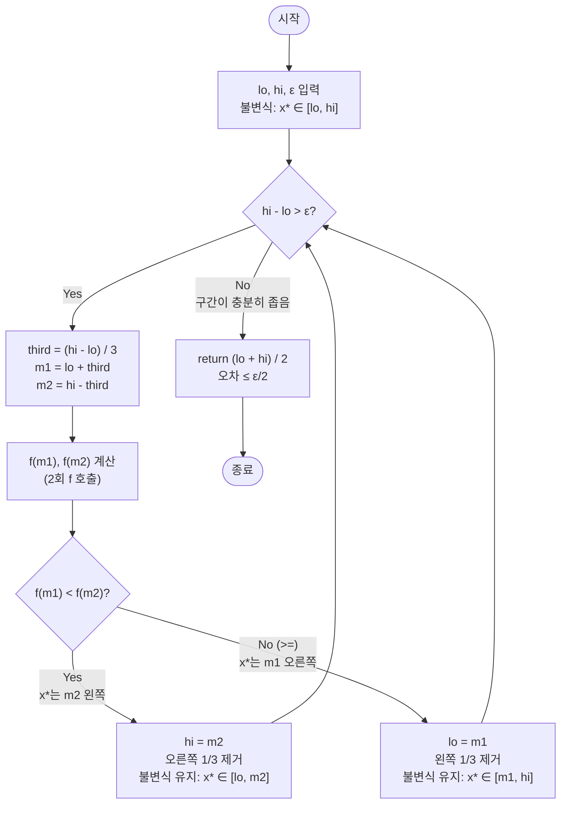

import { AlgorithmSimulation } from "#guide-sim";

# Ternary Search — 해설 (단봉 함수의 극값 탐색)

## 성능 목표 예측

| 항목 | 값 |
|------|-----|
| 탐색 구간 | $[\text{lo}, \text{hi}]$, 초기 길이 $L = \text{hi} - \text{lo}$ |
| 허용 오차 | $\varepsilon > 0$ |
| 목표 시간 복잡도 | $O\!\left(\log_{3/2}(L/\varepsilon)\right)$회의 $f$ 호출 |
| 목표 공간 복잡도 | $O(1)$ |

**naive 접근의 한계 분석**: 함수 $f$가 연속이지만 닫힌 형태의 도함수가 없거나, 샘플 점에서만 $f$를 평가할 수 있는 블랙박스 함수라고 가정한다. 가장 단순한 접근은 $[\text{lo}, \text{hi}]$를 $n$개의 균등 간격 점으로 나누어 $f$를 모두 평가하는 격자 탐색(grid search)이다:

$$x_k = \text{lo} + k \cdot \frac{\text{hi} - \text{lo}}{n}, \quad k = 0, 1, \ldots, n$$

정밀도 $\varepsilon$을 달성하려면 $n = \lceil L / \varepsilon \rceil$개의 점이 필요하다. $L = 100$, $\varepsilon = 10^{-6}$이면 $10^8$번의 $f$ 평가가 필요하다. $f$가 계산 비용이 높다면 이는 치명적이다.

**이진 탐색을 바로 쓸 수 없는 이유**: 이진 탐색은 "단조 함수"에만 적용 가능하다. 단봉 함수는 최솟값의 왼쪽에서 감소하고 오른쪽에서 증가하므로, 임의의 한 점 $f(m)$만으로는 최솟값이 왼쪽에 있는지 오른쪽에 있는지 알 수 없다.

**목표 복잡도 달성**: 매 반복마다 두 내부점 $m_1$, $m_2$를 비교하면, 최솟값이 없는 1/3 구간을 제거할 수 있다. 구간이 매 반복마다 $2/3$ 배가 되므로, $k$번 반복 후 구간 길이는 $L \cdot (2/3)^k$이다. 이를 $\varepsilon$ 이하로 만들려면:

$$L \cdot \left(\frac{2}{3}\right)^k \leq \varepsilon \Rightarrow k \geq \log_{3/2}\frac{L}{\varepsilon}$$

$\log_{3/2}(L/\varepsilon) = \frac{\ln(L/\varepsilon)}{\ln(3/2)} \approx 2.41 \ln(L/\varepsilon)$이므로, $O(\log(1/\varepsilon))$ 회의 반복으로 충분하다. 매 반복마다 $f$를 2회 호출하므로 총 $f$ 호출 횟수는 $2 \times O(\log(1/\varepsilon))$이다.

**공간 복잡도**: 포인터 변수 `lo`, `hi`, `m1`, `m2`만 사용하므로 $O(1)$이다.

---

## 목표 함수

```typescript
function ternarySearch(
  f: (x: number) => number,
  lo: number,
  hi: number,
  epsilon: number,
): number
```

| 파라미터 | 의미 | 제약 |
|----------|------|------|
| `f` | $[\text{lo}, \text{hi}]$ 위에서 단봉이며 유일한 최솟값을 가지는 실수 함수 | 단봉 보장 |
| `lo` | 탐색 구간의 왼쪽 끝 | $\text{lo} < \text{hi}$ |
| `hi` | 탐색 구간의 오른쪽 끝 | $\text{hi} > \text{lo}$ |
| `epsilon` | 허용 오차: $\text{hi} - \text{lo} \leq \varepsilon$이면 종료 | $\varepsilon > 0$ |
| **반환** | $f$를 최소화하는 $x$의 근사값 (종료 시 구간 중점 $(\text{lo} + \text{hi}) / 2$) | — |

**엣지케이스**:

| 케이스 | 입력 예시 | 기대 출력 | 이유 |
|--------|-----------|-----------|------|
| 초기 구간이 이미 $\varepsilon$ 이내 | `lo=0, hi=1e-7, eps=1e-6` | `(lo+hi)/2` | 루프 진입 전 종료 |
| 최솟값이 구간 왼쪽 끝 근방 | $f(x) = x^2$, `lo=-0.001, hi=10` | $\approx 0$ | lo 근방에 수렴 |
| 최솟값이 구간 오른쪽 끝 근방 | $f(x) = (x-10)^2$, `lo=0, hi=10.001` | $\approx 10$ | hi 근방에 수렴 |
| 매우 좁은 $\varepsilon$ | $\varepsilon = 10^{-9}$, 부동소수점 한계 | 근사값 | 부동소수점 오차 누적 가능 |
| $f(m_1) = f(m_2)$ | 대칭적 단봉 함수에서 대칭 내부점 | 구간 중점 | 어느 방향으로 좁혀도 무방 |

---

## 핵심 아이디어

**핵심 아이디어**: "단봉 함수는 두 내부점의 함수값을 비교하는 것만으로 최솟값이 절대 없는 1/3 구간을 논리적으로 제거할 수 있다."

단봉 함수는 최솟값을 기준으로 왼쪽은 감소, 오른쪽은 증가하는 구조다. 구간을 1/3, 2/3 지점에서 각각 평가하면 두 값의 대소 관계만으로 최솟값이 어느 쪽에 있는지 알 수 있다. 매 반복마다 구간이 2/3로 줄어들어 기하급수적으로 수렴한다.

**풀이 구조**
1. 탐색 구간 `[lo, hi]`와 허용 오차 `epsilon`을 초기화한다.
2. `hi - lo > epsilon`인 동안 반복한다.
3. 구간의 1/3 지점 `m1`과 2/3 지점 `m2`를 계산해 `f(m1)`과 `f(m2)`를 비교한다.
4. `f(m1) < f(m2)`이면 `hi = m2` (오른쪽 1/3 제거), 아니면 `lo = m1` (왼쪽 1/3 제거).
5. 루프 종료 시 구간 중점 `(lo + hi) / 2`를 반환한다.

**조건**: 함수 $f$가 단봉(unimodal)이어야 한다. 즉 구간 내에 유일한 최솟값이 존재하고, 최솟값 왼쪽에서 단조 감소, 오른쪽에서 단조 증가해야 한다.

**대표 예시**: $f(x) = (x - 3)^2$, 구간 `[0, 10]`, `epsilon = 1e-6` 탐색
`m1 = 3.33`, `m2 = 6.67` → `f(m1) = 0.11 < f(m2) = 13.4` → `hi = 6.67`. 이 과정을 반복하면 정답 `3`으로 수렴한다. 균등 격자 탐색의 수백만 번 평가 대신 약 100번 이내의 $f$ 호출로 달성.

**언제 쓰나**
미분 불가능하거나 해석적 공식이 없는 블랙박스 단봉 함수의 최솟값/최댓값 위치를 찾을 때 사용한다. 정수 구간에서 쓸 때는 구간 크기 3 이하에서 루프를 중단하고 남은 후보를 직접 비교하는 변형이 필요하다.

---

### 원형 아이디어와 naive 접근

단봉 함수의 최솟값을 찾는 가장 단순한 방법은 균등 격자 탐색이다:

```
n ← ceil((hi - lo) / epsilon)
best_x ← lo
best_f ← f(lo)
for k from 1 to n:
    x ← lo + k * (hi - lo) / n
    if f(x) < best_f:
        best_f ← f(x)
        best_x ← x
return best_x
```

$n = \lceil L / \varepsilon \rceil$회의 $f$ 평가가 필요하다. $L = 1000$, $\varepsilon = 10^{-6}$이면 $10^9$번의 평가가 필요하여 현실적으로 불가능하다.

**낭비의 원인**: 격자 탐색은 각 점의 $f$ 값이 서로 독립적인 정보로 취급되므로, 이전에 평가한 점들의 값이 이후 탐색 방향을 좁혀주지 않는다. 단봉 함수의 구조적 성질을 전혀 활용하지 않는다.

핵심 질문은 이것이다: **두 점 $f(m_1)$과 $f(m_2)$를 비교했을 때, 최솟값이 반드시 없는 구간을 논리적으로 제거할 수 있는가?**

### 어떤 관찰이 돌파구가 되는가

- **관찰 1 (단봉 함수의 단조 구조)**: 단봉 함수는 최솟값 $x^*$를 기준으로 왼쪽($x < x^*$)에서 단조 감소하고, 오른쪽($x > x^*$)에서 단조 증가한다.
- **관찰 2 (두 내부점 비교로 제거 가능)**: 두 점 $m_1 < m_2$에 대해 $f(m_1) > f(m_2)$이면, $x^*$는 $m_1$의 오른쪽에 있음이 확실하다. 왜냐하면 $x^* \leq m_1$이라 가정하면 $m_1$은 $x^*$의 오른쪽에 있으므로 $f$가 $m_1$에서 $m_2$로 갈수록 증가해야 하는데, $f(m_1) > f(m_2)$이므로 모순이다. 따라서 $x^* > m_1$이고 $[\text{lo}, m_1]$을 안전하게 제거할 수 있다.
- **관찰 3 (1/3씩 제거로 O(log) 수렴)**: 두 내부점을 구간의 1/3, 2/3 지점에 두면, 매 반복마다 구간의 1/3을 제거할 수 있다. 제거 후 구간은 원래의 2/3 크기가 되어 기하급수적으로 줄어든다.

### 관찰을 형식화: 상태/구조 정의

탐색 구간을 닫힌 구간 $[\text{lo}, \text{hi}]$로 정의하고, 루프 전체에 다음 불변식을 유지한다:

> **불변식**: 최솟값 $x^*$는 항상 $[\text{lo}, \text{hi}]$ 구간 안에 있다.

두 내부점은 다음과 같이 구간의 1/3, 2/3 지점에 위치한다:

$$m_1 = \text{lo} + \frac{\text{hi} - \text{lo}}{3}, \quad m_2 = \text{hi} - \frac{\text{hi} - \text{lo}}{3}$$

이 정의가 왜 그 형태여야 하는가: $m_1$과 $m_2$가 각각 1/3, 2/3 지점이어야 두 경우 모두에서 제거되는 구간이 정확히 1/3임이 보장된다. 만약 $m_1$을 1/4, $m_2$를 3/4 지점에 두면 한 번에 제거되는 구간이 1/4이 되어 수렴 속도가 느려진다. 더 가깝게 두면 제거량이 작아지고, 더 멀리 두면 비대칭이 생긴다.

### 점화식 또는 핵심 연산

비교 결과에 따른 구간 갱신:

$$(\text{lo}', \text{hi}') = \begin{cases}
  (\text{lo}, m_2) & f(m_1) < f(m_2) \quad \text{(오른쪽 1/3 제거)} \\
  (m_1, \text{hi}) & f(m_1) \geq f(m_2) \quad \text{(왼쪽 1/3 제거)}
\end{cases}$$

각 항의 의미:
- $f(m_1) < f(m_2)$: $x^*$가 $m_2$의 왼쪽에 있으므로 $[m_2, \text{hi}]$를 제거. 새 구간은 $[\text{lo}, m_2]$로 원래의 2/3 크기.
- $f(m_1) \geq f(m_2)$: $x^*$가 $m_1$의 오른쪽에 있으므로 $[\text{lo}, m_1]$을 제거. 새 구간은 $[m_1, \text{hi}]$로 원래의 2/3 크기.

**$f(m_1) = f(m_2)$ 처리**: 단봉 함수에서 두 점의 값이 같으면 $x^*$는 $[m_1, m_2]$ 사이에 있다. 어느 방향으로 좁혀도 불변식이 유지된다. $f(m_1) \geq f(m_2)$ 분기에 포함시키면 $\text{lo} = m_1$로 갱신되어 왼쪽을 제거하는데, 이는 안전하다.

**구간 감소량**:

$$(\text{hi}' - \text{lo}') = \frac{2}{3} \cdot (\text{hi} - \text{lo})$$

매 반복 후 구간 길이가 정확히 2/3 배가 된다.

### 정당성 — 왜 이것이 옳은가

**$f(m_1) < f(m_2)$일 때 $x^* \leq m_2$임의 증명**: 귀류법으로, $x^* > m_2$라 가정한다. 그러면 $m_1 < m_2 < x^*$이므로 $m_1$과 $m_2$ 모두 최솟값의 왼쪽에 있다. 단봉 함수는 최솟값의 왼쪽에서 단조 감소하므로 $f(m_1) > f(m_2)$여야 한다. 이는 $f(m_1) < f(m_2)$ 가정에 모순이다. 따라서 $x^* \leq m_2$이고 $[m_2, \text{hi}]$를 제거해도 $x^*$는 남는다.

**$f(m_1) > f(m_2)$일 때의 대칭 증명**: 대칭적으로 $x^* < m_2$라 가정하면 $x^* \leq m_1$을 포함해 $m_1$과 $m_2$ 모두 $x^*$의 오른쪽에 있게 된다. 단봉 함수는 $x^*$ 오른쪽에서 단조 증가하므로 $f(m_1) < f(m_2)$여야 하는데, $f(m_1) > f(m_2)$ 가정에 모순이다. 따라서 $x^* \geq m_1$이고 $[\text{lo}, m_1]$을 제거해도 안전하다.

**종료 보장**: 매 반복마다 구간 길이 $h = \text{hi} - \text{lo}$가 $\frac{2}{3} h$로 줄어든다. 기하급수적으로 줄어들므로 유한 번 반복 후 $\text{hi} - \text{lo} \leq \varepsilon$이 된다.

**오차 보증**: 종료 시 구간 길이 $\leq \varepsilon$이고 $x^* \in [\text{lo}, \text{hi}]$이므로, 반환값 $(\text{lo} + \text{hi}) / 2$는 $x^*$와 $\varepsilon / 2$ 이내의 오차를 가진다.

**까다로운 케이스 — 부동소수점**: 컴퓨터에서 `hi - lo`는 유한 정밀도로 표현되므로, 이론상 무한히 줄어드는 구간이 실제로는 수렴 후 변화가 없어지는 상황이 발생할 수 있다. $\varepsilon$을 기계 엡실론($\approx 2.2 \times 10^{-16}$)보다 훨씬 크게 설정하면 이를 방지할 수 있다.

### 구현 디테일과 최적화

- **반복 횟수 제한 변형**: `while (hi - lo > epsilon)` 대신 고정된 반복 횟수(예: 200번)로 루프를 도는 변형도 있다. 반복 횟수 $k = 200$이면 구간이 $(2/3)^{200} \approx 10^{-35}$ 배로 줄어 사실상 어떤 정밀도도 달성한다.
- **이진 탐색과의 반복 수 비교**: 동일 정밀도 달성에 삼진 탐색은 이진 탐색보다 약 1.71배 더 많은 반복이 필요하다. 단, 매 반복마다 $f$ 호출이 2회이므로 총 $f$ 호출 수는 약 3.4배 많다. 하지만 $f$가 단봉이기 때문에 이진 탐색을 직접 쓸 수 없으므로, 삼진 탐색이 유일한 선택이다.
- **정수 배열에서의 삼진 탐색**: 구간이 정수인 경우 `m1`과 `m2`를 `Math.floor`로 내림하고, 종료 조건을 `hi - lo > 2`로 바꾼 뒤 `lo`, `lo+1`, `hi` 세 후보 중 최솟값을 선택하는 변형을 쓴다.
- **함정 1**: `hi = m2`가 아닌 `hi = m2 - 1`로 쓰면, $x^* = m_2$인 경우에 $x^*$를 구간에서 제외하게 된다. 닫힌 구간을 유지하려면 반드시 `hi = m2`로 설정해야 한다.
- **함정 2**: `third = (hi - lo) / 3`을 매 반복마다 재계산하지 않고 상수로 사용하면, 구간이 줄어드는데도 내부점 간격이 고정되어 무한 루프가 발생한다. 반드시 매 반복마다 현재 구간 길이에 비례해 재계산해야 한다.

---

## 시뮬레이션

고정 입력으로 단봉 함수 `f(x) = (x - 3)^2`, 구간 `[0, 10]`, `epsilon = 1e-6`을 삼진 탐색하는 과정이다. 각 프레임은 현재 구간을 `[lo, m1, m2, hi]` 네 점으로 보여준다(빨강은 비교 중인 내부점 m1, m2). keyValue 패널에 두 내부점의 함수값을 표시하며, 더 작은 쪽이 최솟값 방향을 가리킨다. 매 반복 구간 길이는 2/3로 줄어 최솟값 위치 `x* = 3`으로 수렴한다.

실제 반환값은 종료 시 구간 중점 `(lo + hi) / 2`이며 `≈ 3.0`으로 수렴한다. 시뮬레이션 마지막 프레임의 구간 중점이 이 값과 일치한다(표시상 소수 둘째 자리까지 반올림).

> 대화형 시뮬레이션은 MDX 런타임에서 표시됩니다.

export const steps = [
  {
    title: "초기 구간 [0, 10]",
    detail: "lo = 0, hi = 10. third = 3.33. m1 = 3.33, m2 = 6.67.",
    array: [0, 3.33, 6.67, 10],
    highlight: [1, 2],
    entries: [
      { label: "f(m1) = f(3.33)", value: 0.11 },
      { label: "f(m2) = f(6.67)", value: 13.4 },
      { label: "결정", value: "f(m1) < f(m2) → hi = m2" },
    ],
  },
  {
    title: "오른쪽 1/3 제거 → [0, 6.67]",
    detail: "lo = 0, hi = 6.67. third = 2.22. m1 = 2.22, m2 = 4.44.",
    array: [0, 2.22, 4.44, 6.67],
    highlight: [1, 2],
    entries: [
      { label: "f(m1) = f(2.22)", value: 0.61 },
      { label: "f(m2) = f(4.44)", value: 2.07 },
      { label: "결정", value: "f(m1) < f(m2) → hi = m2" },
    ],
  },
  {
    title: "오른쪽 1/3 제거 → [0, 4.44]",
    detail: "lo = 0, hi = 4.44. third = 1.48. m1 = 1.48, m2 = 2.96.",
    array: [0, 1.48, 2.96, 4.44],
    highlight: [1, 2],
    entries: [
      { label: "f(m1) = f(1.48)", value: 2.31 },
      { label: "f(m2) = f(2.96)", value: 0.0016 },
      { label: "결정", value: "f(m1) >= f(m2) → lo = m1" },
    ],
  },
  {
    title: "왼쪽 1/3 제거 → [1.48, 4.44]",
    detail: "lo = 1.48, hi = 4.44. third = 0.99. m1 = 2.47, m2 = 3.46.",
    array: [1.48, 2.47, 3.46, 4.44],
    highlight: [1, 2],
    entries: [
      { label: "f(m1) = f(2.47)", value: 0.28 },
      { label: "f(m2) = f(3.46)", value: 0.21 },
      { label: "결정", value: "f(m1) >= f(m2) → lo = m1" },
    ],
  },
  {
    title: "왼쪽 1/3 제거 → [2.47, 4.44]",
    detail: "구간이 x* = 3 주위로 좁혀진다. 이후 반복도 동일하게 진행.",
    array: [2.47, 3.13, 3.79, 4.44],
    highlight: [1, 2],
    entries: [
      { label: "f(m1) = f(3.13)", value: 0.017 },
      { label: "f(m2) = f(3.79)", value: 0.62 },
      { label: "결정", value: "f(m1) < f(m2) → hi = m2" },
    ],
  },
  {
    title: "수렴 (구간 길이 ≤ ε)",
    detail: "약 80여 회 반복 후 hi - lo ≤ 1e-6. 중점 (lo + hi) / 2 ≈ 3.00 을 반환한다.",
    array: [3.0, 3.0, 3.0, 3.0],
    marked: [0, 1, 2, 3],
    entries: [
      { label: "x* (최솟값 위치)", value: 3.0 },
      { label: "반환값 (lo+hi)/2", value: "≈ 3.00" },
      { label: "f(3)", value: 0 },
    ],
  },
];

<AlgorithmSimulation view={["array", "keyValue"]} steps={steps} title="삼진 탐색: f(x)=(x-3)^2 최소화" />

## 수도 코드와 Activity Diagram

### 의사코드

```
function ternarySearch(f, lo, hi, epsilon):
    // 불변식: x* ∈ [lo, hi] — 최솟값은 항상 현재 구간 안에 있다
    while hi - lo > epsilon:
        third ← (hi - lo) / 3          // 매 반복마다 현재 구간 길이로 재계산
        m1 ← lo + third                // 구간 1/3 지점; lo <= m1 < m2 <= hi
        m2 ← hi - third                // 구간 2/3 지점

        if f(m1) < f(m2):
            hi ← m2                    // x*는 [lo, m2] 안에 있음 (오른쪽 1/3 제거)
                                        // 불변식 유지: x* ∈ [lo, m2]

        else:                          // f(m1) >= f(m2) (등호 포함)
            lo ← m1                    // x*는 [m1, hi] 안에 있음 (왼쪽 1/3 제거)
                                        // 불변식 유지: x* ∈ [m1, hi]

    // 종료: hi - lo <= epsilon이므로 x*와 중점의 오차는 epsilon/2 이내
    return (lo + hi) / 2
```

**핵심 불변식**: $x^* \in [\text{lo}, \text{hi}]$ — 루프의 모든 시점에서 최솟값은 현재 구간 안에 있다.

### Activity Diagram



**핵심 불변식**: $x^* \in [\text{lo}, \text{hi}]$ — 종료 시 $\text{hi} - \text{lo} \leq \varepsilon$이므로 반환값의 오차는 $\varepsilon / 2$ 이내

---

## 이진 탐색 vs 삼진 탐색 비교

| 항목 | 이진 탐색 | 삼진 탐색 |
|------|-----------|-----------|
| 적용 조건 | 단조 함수 | 단봉 함수 |
| 매 반복 $f$ 호출 수 | 1회 | 2회 |
| 구간 감소율 | $1/2$ | $2/3$ |
| $k$번 반복 후 구간 | $L \cdot (1/2)^k$ | $L \cdot (2/3)^k$ |
| 정밀도 $\varepsilon$ 달성 반복 수 | $\log_2(L/\varepsilon)$ | $\log_{3/2}(L/\varepsilon) \approx 1.71 \log_2(L/\varepsilon)$ |
| 총 $f$ 호출 수 | $\log_2(L/\varepsilon)$ | $\approx 3.4 \log_2(L/\varepsilon)$ |
| 단봉 함수에 직접 적용 가능 여부 | 불가 | 가능 |
