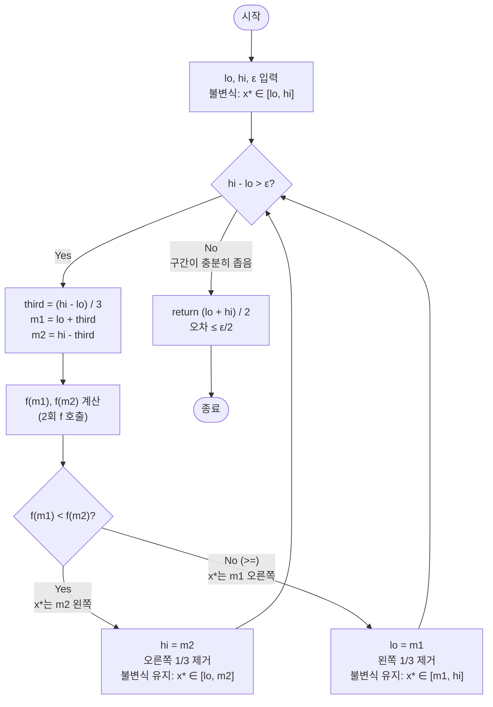

import { AlgorithmSimulation } from "#guide-sim";

# Ternary Search — 두 내부점 비교만으로 봉우리 하나를 통째로 잘라내는 이유

## 한눈에 보는 컨셉

단봉(unimodal) 함수는 최솟값을 기준으로 왼쪽에서 감소하고 오른쪽에서 증가해요. 그래서 구간을 세 등분한 두 내부점의 함숫값만 비교해도, 최솟값이 절대 없는 바깥쪽 1/3을 논리적으로 잘라낼 수 있습니다. 이걸 반복하면 구간이 매번 `2/3`배로 줄어들어, 균등 격자 탐색이라면 `O(L/ε)`번 걸릴 일을 `O(log(L/ε))`번의 함수 호출로 끝낼 수 있어요.

## 출발점: 가장 순진한 방법부터

문제를 먼저 정확히 잡고 갈게요.

```ts
function ternarySearch(
  f: (x: number) => number,
  lo: number,
  hi: number,
  epsilon: number,
): number
```

| 항목 | 의미 | 제약 |
|------|------|------|
| `f` | $[\text{lo}, \text{hi}]$ 위에서 단봉이며 유일한 최솟값을 가지는 함수 | 단봉 보장(호출부 책임) |
| `lo`, `hi` | 탐색 구간의 양 끝 | $\text{lo} < \text{hi}$ |
| `epsilon` | 허용 오차. $\text{hi} - \text{lo} \le \varepsilon$이면 종료 | $\varepsilon > 0$ |
| 반환값 | 최솟값 위치 $x^{*}$의 근사값(종료 시 구간 중점) | 오차 $\le \varepsilon/2$ |

엣지 케이스도 미리 적어 둘게요.

| 케이스 | 예시 | 기대 동작 |
|--------|------|-----------|
| 초기 구간이 이미 $\varepsilon$ 이내 | `lo=0, hi=1e-7, eps=1e-6` | 루프 진입 없이 바로 중점 반환 |
| 최솟값이 경계 근방 | `f(x)=x^2`, `lo=-0.001, hi=10` | `lo` 쪽 경계 근방으로 수렴 |
| $f(m_1) = f(m_2)$ | 대칭 단봉 함수의 대칭 내부점 | 어느 방향으로 좁혀도 무방(뒤에서 확인) |

가장 정직한 방법부터 생각해 봅시다. $f$가 미분 불가능하거나 해석적 공식이 없는 블랙박스라면, 구간을 잘게 쪼갠 격자 위에서 전부 평가해 최솟값을 찾는 게 자연스러운 첫 시도예요.

```ts
function ternarySearchNaive(
  f: (x: number) => number,
  lo: number,
  hi: number,
  epsilon: number,
): number {
  const n = Math.ceil((hi - lo) / epsilon);
  let bestX = lo;
  let bestF = f(lo);
  for (let k = 1; k <= n; k++) {
    const x = lo + (k * (hi - lo)) / n; // 균등 격자점
    const fx = f(x);
    if (fx < bestF) {
      bestF = fx;
      bestX = x;
    }
  }
  return bestX;
}
```

작은 예로 감을 잡아 볼게요. $f(x) = (x-3)^2$, 구간 `[0, 10]`을 6개 점(`step=2`)으로만 격자 탐색하면:

```text
격자(n=6, step=2):  x =  0   2   4   6   8   10
                    f =  9   1   1   9  25   49
최선(x=2 또는 4, f=1) — 실제 최솟점 x=3은 격자에 아예 없다. 오차 최대 1.
```

점 6개로는 오차가 1이나 남습니다. 오차를 $\varepsilon = 10^{-6}$까지 줄이려면 몇 개나 필요할까요?

```text
n = ⌈(hi - lo) / ε⌉ = ⌈10 / 1e-6⌉ = 10,000,000

f가 계산 비용이 큰 블랙박스라면 천만 번 호출은 현실적으로 감당 불가
```

여기서 이진 탐색을 떠올릴 수도 있는데, **이진 탐색은 단조 함수에만 통합니다.** 단봉 함수는 최솟값 왼쪽에서 감소, 오른쪽에서 증가하므로 점 하나 $f(m)$만 봐서는 최솟값이 왼쪽인지 오른쪽인지 알 수 없어요. 격자 탐색이 낭비하는 지점은 명확합니다 — **평가한 점들의 값이 서로 아무 정보도 주고받지 않는다**는 것. 단봉이라는 구조를 전혀 쓰지 않고 있어요.

핵심 질문은 이겁니다. **점 하나가 아니라 두 점을 비교하면, 최솟값이 절대 없는 구간을 논리적으로 제거할 수 있을까?** 이 단서를 풀면 목표는 격자 탐색의 $O(L/\varepsilon)$이 아니라 $O(\log(L/\varepsilon))$번의 호출로 낮아집니다.

## 아이디어 자세히 들여다보기

### 구간을 셋으로 나눠 두 점을 비교하기 — 수식과 그림

단봉 함수의 정의부터 정식으로 적어 볼게요.

$$\exists\, x^{*} \in [\text{lo}, \text{hi}] : \quad f \text{는 } [\text{lo}, x^{*}] \text{에서 단조 감소, } [x^{*}, \text{hi}] \text{에서 단조 증가}$$

구간을 1/3, 2/3 지점에서 나눠 두 내부점을 잡습니다.

$$m_1 = \text{lo} + \frac{\text{hi} - \text{lo}}{3}, \qquad m_2 = \text{hi} - \frac{\text{hi} - \text{lo}}{3}$$

```text
lo ────────── m1 ────────── m2 ────────── hi
    (1/3)          (1/3)          (1/3)
```

$f(x)=(x-3)^2$, 구간 `[0,10]`이면 `third = 10/3 ≈ 3.33`이므로 `m1 ≈ 3.33`, `m2 ≈ 6.67`이에요. 실제로 계산해 보면 `f(m1) ≈ 0.11`, `f(m2) ≈ 13.44`로, `m1` 쪽이 훨씬 작습니다. 최솟값 `x=3`이 `m1` 바로 옆이니 그럴 만하죠.

**왜 하필 정확히 1/3, 2/3 지점이어야 할까요?** 대안을 하나 생각해 봅시다. 두 내부점을 1/4, 3/4 지점에 두면 어떨까요?

> 확인 질문: `m1`을 구간의 1/4 지점, `m2`를 3/4 지점에 두면, `f(m1) < f(m2)`일 때 제거할 수 있는 구간은 얼마일까요?

답은 "바깥쪽 1/4"입니다 — `[m2, hi]`의 길이가 원래 구간의 1/4이니까요. 즉 매 반복 제거량이 1/3이 아니라 1/4로 줄어, 구간이 `2/3`배가 아니라 `3/4`배로만 줄어듭니다. 더 가깝게(예: 0.49, 0.51 지점) 잡으면 제거량이 더 줄어 수렴이 느려지고, 반대로 두 점을 지나치게 바깥에 두면(예: 거의 `lo`, `hi`에 붙이면) 애초에 비교 정보가 두 구간의 정중앙을 대변하지 못해 이후 판단이 흔들립니다. **1/3, 2/3 지점은 "제거량이 최대"가 되는 대칭점**이라고 기억해 두면 됩니다.

### 왜 모순 없이 작동하는가

이 알고리즘이 매 반복 지키는 약속(불변식)은 하나입니다.

> **불변식**: 최솟값 $x^{*}$는 항상 현재 구간 $[\text{lo}, \text{hi}]$ 안에 있다.

**기저**: 문제의 전제(단봉 함수가 $[\text{lo}, \text{hi}]$ 위에서 유일한 최솟값을 가진다)에 의해, 최초 호출 시점부터 $x^{*} \in [\text{lo}, \text{hi}]$는 참입니다.

**귀납 단계**: 임의의 반복에서 불변식이 성립한다고 가정하고, 다음 반복 후에도 성립함을 보입니다. 실수 비교는 전순서(total order)이므로 `f(m1) < f(m2)`와 `f(m1) >= f(m2)`, 이 두 경우가 전부이고 다른 경우는 없습니다(경우의 완전성).

- **`f(m1) < f(m2)`일 때 `hi = m2`가 안전한 이유**: 귀류법으로 $x^{*} > m_2$라고 가정해 봅시다. 그러면 $m_1 < m_2 < x^{*}$이므로 $m_1$, $m_2$ 모두 최솟값의 왼쪽에 있고, 단봉 함수는 그 구간에서 단조 감소하니 $f(m_1) > f(m_2)$여야 합니다. 이는 가정 $f(m_1) < f(m_2)$와 모순이에요. 따라서 $x^{*} \le m_2$이고, $[\text{lo}, m_2]$로 좁혀도 $x^{*}$는 여전히 안에 있습니다.
- **`f(m1) >= f(m2)`일 때 `lo = m1`이 안전한 이유**: 대칭적으로 $x^{*} < m_1$이라 가정하면 $x^{*} \le m_1 < m_2$이므로 $m_1$, $m_2$ 모두 최솟값의 오른쪽에 있고, 단조 증가 구간이니 $f(m_1) < f(m_2)$여야 합니다. 이는 가정과 모순이므로 $x^{*} \ge m_1$이고, $[m_1, \text{hi}]$로 좁혀도 안전합니다.

두 경우 모두 구간 길이는 정확히 $\frac{2}{3}(\text{hi}-\text{lo})$로 줄어듭니다. 이 감소가 반복될수록 기하급수적이므로, 유한 번 반복 후 반드시 $\text{hi} - \text{lo} \le \varepsilon$에 도달합니다(종료 보장). 종료 시 $x^{*} \in [\text{lo}, \text{hi}]$이고 구간 길이가 $\varepsilon$ 이하이므로, 중점 $(\text{lo}+\text{hi})/2$는 $x^{*}$와 $\varepsilon/2$ 이내로 어긋납니다.

여기서 **헷갈리기 쉬운 포인트는 `f(m1) = f(m2)`인 경우 어느 쪽으로 좁혀야 하느냐**입니다. 실제로 실행해서 확인해 볼게요. $f(x) = |x|$, 구간 `[-3, 3]`이면 `third = 2`, `m1 = -1`, `m2 = 1`이고 `f(m1) = f(m2) = 1`로 정확히 같습니다.

```text
Before: [lo=-3 ─────── m1=-1 ─────── m2=1 ─────── hi=3]   f(m1)=1, f(m2)=1 (동률)

코드는 f(m1) < f(m2)가 거짓이므로 else 분기(lo=m1)를 택한다

After:  [lo=-1 ─────────────────── hi=3]   여전히 x*=0 포함 ✓
```

동률이면 두 값이 같다는 것 자체가 "최솟값이 $[m_1, m_2]$ 사이 어딘가에 있다"는 뜻이에요. 그러니 `lo = m1`으로 좁히든 `hi = m2`로 좁히든 $x^{*}$는 그대로 남습니다 — 방향을 굳이 특별 취급할 필요가 없다는 뜻이고, 코드의 `if / else` 두 갈래만으로 이미 전순서의 모든 경우를 다뤘다는 게 이 알고리즘이 "빠짐없이" 작동하는 이유입니다.

엣지 케이스도 불변식 위에서 확인해 볼게요.

```text
초기 구간이 이미 ε 이내       → while 조건이 처음부터 거짓 → 중점 즉시 반환
최솟값이 lo 바로 옆(x*≈lo)    → m1 근처에서 f가 계속 작게 나와 lo가 거의 안 움직임
매우 작은 ε(≈기계 엡실론)     → hi-lo가 부동소수점 표현 한계에 걸려 더 못 줄어들 수 있음
```

## 아이디어를 코드로 옮기기

```ts
function ternarySearch(
  f: (x: number) => number,
  lo: number,
  hi: number,
  epsilon: number,
): number {
  while (hi - lo > epsilon) {
    const third = (hi - lo) / 3; // 매 반복 "현재" 구간 길이로 재계산
    const m1 = lo + third;
    const m2 = hi - third;

    if (f(m1) < f(m2)) {
      hi = m2; // 오른쪽 1/3 제거
    } else {
      lo = m1; // 왼쪽 1/3 제거 (동률 포함)
    }
  }
  return (lo + hi) / 2;
}
```

**가장 중요한 줄은 `const third = (hi - lo) / 3;`입니다.** 이 줄이 반복문 "안"에서, 그것도 매번 현재의 `hi - lo`로 다시 계산돼야 해요. 만약 이 값을 반복문 진입 전에 딱 한 번만 계산해 고정값으로 재사용하면 무슨 일이 벌어지는지, 실제로 실행해서 보여드릴게요.

```text
버그: third를 최초 1회만 계산 (third = 3.3333 고정, 재계산 없음)
f(x) = (x-3)^2, lo=0, hi=10

iter1: lo=0,      hi=6.6667   (third=3.3333 그대로) → hi=m2로 정상 진행
iter2: lo=3.3333, hi=6.6667   m1=m2=3.3333(구간이 third보다 좁아져 두 점이 겹침)
iter3: lo=6.6667, hi=6.6667   m1(6.6667) > m2(3.3333)로 역전! else 분기로 lo=m1

종료: lo=hi=6.6667 → 반환값 ≈ 6.6667  (참값 3과 전혀 다르다!)
```

구간이 좁아졌는데도 `third`가 그대로 3.33이면, 셋째 반복에서 `m1`이 `m2`를 앞질러 버려요. 그런데 `hi - lo`는 결국 0에 도달하니 `while` 조건은 만족되어 루프가 "정상적으로" 끝난 것처럼 보입니다. **딱 3번 반복 만에 조용히 틀린 값(≈6.67)으로 수렴**하는 겁니다 — 에러도, 무한 루프도 없이요. `lo=0, hi=9`, `f(x)=(x-2)^2`(참값 2)로 같은 버그를 돌리면 정확히 3회 만에 `lo=hi=6`으로 수렴합니다. 숫자가 매번 다르게 틀리니 디버깅하기도 까다로워요.

> third는 매 반복 다시 잰다 — 구간이 줄면 자(尺)도 같이 줄여야 한다.

## 더 빠르게 만들 단서 찾기

기본 구현을 관찰해 봅시다. 매 반복 `f`를 **2번** 호출합니다. 반복 횟수는 $\log_{3/2}(L/\varepsilon)$번 정도니, 총 호출 수는 대략 그 두 배예요. 그런데 이전 반복에서 이미 계산해 둔 `f(m1)`, `f(m2)` 값이 다음 반복에서 전혀 재사용되지 않는다는 점이 눈에 띕니다.

```text
iter1: lo=0.00, hi=10.00 → m1=3.33, m2=6.67 (여기서 f(m1), f(m2) 계산)
        판정: f(m1) < f(m2) → hi = 6.67

iter2: lo=0.00, hi=6.67  → m1'=2.22, m2'=4.44 (완전히 새 점 2개, 처음부터 다시 계산)

m1=3.33 이었던 점은 [0, 6.67] 안에 있는데도 재사용되지 않는다!
```

1/3, 2/3 분할에서는 구간을 좁혀도 새 내부점(`m1'`, `m2'`)이 이전 내부점(`m1`, `m2`)과 정확히 겹치지 않아요. 그래서 매 반복 2번의 새 함수 호출이 강제됩니다. **분할 비율을 다르게 잡으면, 두 내부점 중 하나가 다음 반복에서 재사용되도록 만들 수 있지 않을까?** 이게 다음 단서입니다.

## 단서를 최적화로 연결하기

분할 비율을 $\rho$(구간을 남길 때 남기는 쪽의 비율, $0 < \rho < 1$)라 하고, 두 내부점을 다음처럼 대칭적으로 정의합니다.

$$x_1 = \text{hi} - \rho \cdot L, \qquad x_2 = \text{lo} + \rho \cdot L, \qquad L = \text{hi} - \text{lo}$$

`f(x1) < f(x2)`이면 `hi = x2`로 좁힌다고 해 봅시다(오른쪽 제거). 새 구간의 길이는 $L' = \rho L$입니다. 이 새 구간에서 다시 "오른쪽에 가까운" 내부점(원래 정의대로라면 `x2`에 해당하는 점)을 계산하면 $\text{lo} + \rho L' = \text{lo} + \rho^2 L$이 나옵니다.

**이 값이 바로 직전에 이미 계산해 둔 옛 `x1 = \text{hi} - \rho L`과 같아지려면 어떤 $\rho$가 필요할까요?** `hi = lo + L`이었으니 옛 `x1 = lo + (1-\rho)L`이고, 이를 새 점과 같다고 놓으면:

$$\rho^2 L = (1 - \rho) L \;\;\Longrightarrow\;\; \rho^2 + \rho - 1 = 0 \;\;\Longrightarrow\;\; \rho = \frac{\sqrt{5}-1}{2} \approx 0.618$$

이 값이 바로 **황금비의 역수** $\varphi = (\sqrt5-1)/2$입니다. $\rho = \varphi$로 두 내부점을 잡으면, 구간을 좁힐 때마다 **새로 계산해야 할 점은 딱 하나뿐**이에요 — 나머지 하나는 이미 계산해 둔 값을 그대로 이어받습니다.

```text
Before (좁히기 전): [lo ── x1 ────── x2 ── hi]     f(x1), f(x2) 둘 다 이미 계산됨
                         (f(x1) < f(x2) → 오른쪽 제거, hi=x2)

After  (좁힌 후):   [lo ── x1' ── x2=이전 x1 ── hi']   x2 자리는 "재활용", x1'만 새로 계산!
```

게다가 $\varphi \approx 0.618 < 2/3 \approx 0.667$이므로, 한 번 좁힐 때 **삼진 탐색보다 구간이 더 많이 줄어듭니다.** 호출 수는 절반 가까이 줄고, 수렴 속도(반복당 축소율)는 오히려 더 빨라지는 이중 이득이 생기는 거예요. 이 기법을 **골든 섹션 탐색(golden-section search)**이라고 부릅니다.

## 최적화 코드

```ts
const PHI = (Math.sqrt(5) - 1) / 2; // ≈ 0.618

function goldenSectionSearch(
  f: (x: number) => number,
  lo: number,
  hi: number,
  epsilon: number,
): number {
  let x1 = hi - PHI * (hi - lo);
  let x2 = lo + PHI * (hi - lo);
  let f1 = f(x1);
  let f2 = f(x2); // 최초 1회만 2번 호출

  while (hi - lo > epsilon) {
    if (f1 < f2) {
      hi = x2;
      x2 = x1;      // 이전 x1을 그대로 재활용
      f2 = f1;       // f(x1) 값도 재활용 — 재계산 없음
      x1 = hi - PHI * (hi - lo);
      f1 = f(x1);    // 새로 계산하는 건 이 한 번뿐
    } else {
      lo = x1;
      x1 = x2;
      f1 = f2;
      x2 = lo + PHI * (hi - lo);
      f2 = f(x2);
    }
  }
  return (lo + hi) / 2;
}
```

**가장 중요한 부분은 `x2 = x1; f2 = f1;`(또는 반대쪽 `x1 = x2; f1 = f2;`)입니다.** 이 대입을 빼먹으면 재활용이 아니라 매번 새로 계산하는 것과 같아져서 틀리지는 않아도 이 최적화의 이득이 통째로 사라집니다. 반대로 이 대입 없이 `f`를 새로 호출하지 않고 옛 값만 엉뚱한 변수에 남겨 두면(예: `f2`를 갱신하지 않고 그대로 두는데 `x2`만 바꾸면) `f2`가 새 `x2`와 어긋나 잘못된 비교를 하게 되니, 대입 순서(위치 갱신과 함숫값 갱신을 항상 짝으로)를 지키는 게 핵심이에요.

실제로 $f(x)=(x-3)^2$, 구간 `[0,10]`, $\varepsilon=10^{-6}$으로 두 방식을 직접 실행해 비교하면:

| 방식 | 반복 횟수 | `f` 호출 수 | 반환값 |
|------|-----------|-------------|--------|
| 삼진 탐색 | 40 | 80 | 3.000000 |
| 골든 섹션 탐색 | 34 | 36 | 3.000000 |

같은 정밀도를 반복 수는 15%, 함수 호출 수는 절반 이하로 줄여 달성합니다. 반복당 축소율이 `2/3 ≈ 0.667`에서 `φ ≈ 0.618`로 줄어든 덕에 반복 횟수 자체도 줄고, 재활용 덕에 호출 수는 그보다 더 크게 줄어든 것이죠.

여기서 더 갈 수 있을까요? 순수하게 "두 점 비교"만으로 단봉 함수를 탐색하는 방식 중에서는, 미리 정해진 반복 횟수에 대해 호출 수를 최소화하는 피보나치 탐색(Fibonacci search)이 이론적 최적이라는 결과(Kiefer, 1953)가 있습니다. 다만 피보나치 탐색의 분할 비율은 반복이 늘어날수록 정확히 골든 섹션 비율로 수렴하므로, 실무에서 얻는 추가 이득은 미미해요. 이보다 더 빠르게 가려면 $f$가 매끄럽다는(미분 가능하다는) 추가 가정이 있어야 하는 포물선 보간(Brent's method) 같은 특화 기법이 필요합니다 — 이는 "블랙박스 단봉 함수"라는 이 문제의 전제 자체를 벗어나는 거예요. 그래서 골든 섹션 탐색에서 최적화를 마칩니다. 순수 삼진 탐색은 골든 섹션보다 느리지만, 분할 비율이 항상 고정된 1/3이라 구현이 더 단순하고 코드를 읽는 사람이 재활용 로직을 신경 쓰지 않아도 된다는 점에서 여전히 가르칠 가치가 있습니다.

## 실행 시각화

고정 입력 $f(x) = (x-3)^2$, 구간 `[0, 10]`, `epsilon = 1e-6`으로 삼진 탐색을 실행한 과정입니다. 각 프레임은 현재 구간을 `[lo, m1, m2, hi]` 네 점으로 보여주고(빨강 강조가 비교 중인 `m1`, `m2`), keyValue 패널에 `f(m1)`, `f(m2)`와 그 비교 결과로 정한 다음 행동을 표시합니다. 실제로 실행하면 총 40회 반복 후 종료되고, 반환값은 `(lo+hi)/2 ≈ 3.000000`으로 참값 `x*=3`과 일치합니다(아래 entries의 함숫값은 모두 실제 실행 결과를 반올림한 값입니다).

> 대화형 시뮬레이션은 MDX 런타임에서 표시됩니다.

export const steps = [
  {
    title: "초기 구간 [0, 10]",
    detail: "lo = 0, hi = 10. third = 3.33. m1 = 3.33, m2 = 6.67.",
    array: [0, 3.33, 6.67, 10],
    highlight: [1, 2],
    entries: [
      { label: "f(m1) = f(3.33)", value: 0.11 },
      { label: "f(m2) = f(6.67)", value: 13.44 },
      { label: "결정", value: "f(m1) < f(m2) → hi = m2" },
    ],
  },
  {
    title: "오른쪽 1/3 제거 → [0, 6.67]",
    detail: "lo = 0, hi = 6.67. third = 2.22. m1 = 2.22, m2 = 4.44.",
    array: [0, 2.22, 4.44, 6.67],
    highlight: [1, 2],
    entries: [
      { label: "f(m1) = f(2.22)", value: 0.60 },
      { label: "f(m2) = f(4.44)", value: 2.09 },
      { label: "결정", value: "f(m1) < f(m2) → hi = m2" },
    ],
  },
  {
    title: "오른쪽 1/3 제거 → [0, 4.44]",
    detail: "lo = 0, hi = 4.44. third = 1.48. m1 = 1.48, m2 = 2.96.",
    array: [0, 1.48, 2.96, 4.44],
    highlight: [1, 2],
    entries: [
      { label: "f(m1) = f(1.48)", value: 2.31 },
      { label: "f(m2) = f(2.96)", value: 0.0014 },
      { label: "결정", value: "f(m1) >= f(m2) → lo = m1" },
    ],
  },
  {
    title: "왼쪽 1/3 제거 → [1.48, 4.44]",
    detail: "lo = 1.48, hi = 4.44. third = 0.99. m1 = 2.47, m2 = 3.46.",
    array: [1.48, 2.47, 3.46, 4.44],
    highlight: [1, 2],
    entries: [
      { label: "f(m1) = f(2.47)", value: 0.28 },
      { label: "f(m2) = f(3.46)", value: 0.21 },
      { label: "결정", value: "f(m1) >= f(m2) → lo = m1" },
    ],
  },
  {
    title: "왼쪽 1/3 제거 → [2.47, 4.44]",
    detail: "구간이 x* = 3 주위로 좁혀진다. 이후 반복도 동일하게 진행.",
    array: [2.47, 3.13, 3.79, 4.44],
    highlight: [1, 2],
    entries: [
      { label: "f(m1) = f(3.13)", value: 0.0163 },
      { label: "f(m2) = f(3.79)", value: 0.62 },
      { label: "결정", value: "f(m1) < f(m2) → hi = m2" },
    ],
  },
  {
    title: "수렴 (구간 길이 ≤ ε)",
    detail: "실측 40회 반복 후 hi - lo ≤ 1e-6. 중점 (lo + hi) / 2 ≈ 3.000000 을 반환한다.",
    array: [3.0, 3.0, 3.0, 3.0],
    marked: [0, 1, 2, 3],
    entries: [
      { label: "x* (최솟값 위치)", value: 3.0 },
      { label: "반환값 (lo+hi)/2", value: "≈ 3.000000" },
      { label: "f(3)", value: 0 },
    ],
  },
];

<AlgorithmSimulation view={["array", "keyValue"]} steps={steps} title="삼진 탐색: f(x)=(x-3)^2 최소화" />

## 흐름 한눈에 보기


```mermaid
flowchart TD
    A([시작]) --> B["lo, hi, ε 입력\n불변식: x* ∈ [lo, hi]"]
    B --> C{"hi - lo > ε?"}
    C -- "No\n구간이 충분히 좁음" --> G["return (lo + hi) / 2\n오차 ≤ ε/2"]
    C -- Yes --> D["third = (hi - lo) / 3\nm1 = lo + third\nm2 = hi - third"]
    D --> E["f(m1), f(m2) 계산\n(2회 f 호출)"]
    E --> F{"f(m1) < f(m2)?"}
    F -- "Yes\nx*는 m2 왼쪽" --> H["hi = m2\n오른쪽 1/3 제거\n불변식 유지: x* ∈ [lo, m2]"]
    F -- "No (>=)\nx*는 m1 오른쪽" --> I["lo = m1\n왼쪽 1/3 제거\n불변식 유지: x* ∈ [m1, hi]"]
    H --> C
    I --> C
    G --> Z([종료])
```

## 스스로 점검하기

1. $f(x) = (x-1)^2$, 구간 `[0, 4]`, `epsilon = 0.5`로 첫 번째 반복만 손으로 따라가 보세요. `m1`, `m2`, `f(m1)`, `f(m2)`, 그리고 다음 구간은 어떻게 될까요? (`third = 4/3 ≈ 1.33`이므로 `m1 ≈ 1.33`, `m2 ≈ 2.67`. `f(m1) ≈ 0.11`, `f(m2) ≈ 2.78`이라 `f(m1) < f(m2)`가 성립해 `hi = m2 ≈ 2.67`이 되고, 다음 구간은 `[0, 2.67]`입니다.)
2. 위 코드 절의 "third 고정 버그"를 `lo=0, hi=9`, `f(x)=(x-2)^2`(참값 `x*=2`)에 적용하면 정확히 몇 번째 반복에서 어떤 값으로 잘못 수렴하는지 손으로 짚어 보세요. (3회 반복 만에 `lo=hi=6`으로 수렴합니다 — `m1`이 `m2`를 앞지르는 셋째 반복에서 구간이 참값과 무관한 지점에 붕괴합니다.)
3. `f`가 실수 함수가 아니라 **정수 인덱스로만 접근 가능한 단봉 수열**(배열)이라면 이 알고리즘을 어떻게 바꿔야 할까요? (힌트: `hi - lo > epsilon` 대신 구간 크기가 3 이하로 줄어드는 순간을 종료 조건으로 바꾸고, 그 안에 남은 후보 인덱스들을 직접 비교해 최솟값을 고르는 변형이 필요합니다. `epsilon`이라는 연속값 개념 자체가 정수 격자에는 적용되지 않는다는 점이 이 변형의 출발점이에요.)
