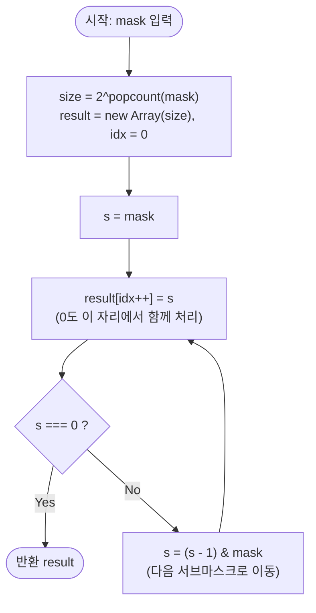

import { AlgorithmSimulation } from "#guide-sim";

# 부분집합 순회 (Submask Enumeration) — 뺄셈 한 번으로 다음 서브마스크에 점프하는 이유

## 한눈에 보는 컨셉

비트마스크 `mask`가 켜 둔 비트들의 부분집합(서브마스크)을 전부 열거해야 할 때, `s`라는 정수 하나에서 `(s - 1) & mask` 산술 한 번으로 "`s`보다 작은 서브마스크 중 가장 큰 것"으로 곧장 점프할 수 있어요. `0`부터 `mask`까지 전부 훑으며 매번 조건을 검사하는 대신, 실제로 존재하는 서브마스크 $2^k$개($k$ = 세팅된 비트 수)만 정확히 `O(2^k)`에 방문합니다. 이 관찰 하나가 비트마스크 DP에서 부분집합을 순회하는 표준 기법의 전부예요.

## 출발점: 가장 순진한 방법부터

문제를 먼저 정확히 잡을게요.

```ts
function enumerateSubmasks(mask: number): number[]
```

| 항목 | 내용 |
|------|------|
| 입력 `mask` | `0 ≤ mask ≤ 2^20`인 정수 비트마스크 |
| 반환값 | `mask`의 모든 서브마스크를 **내림차순**으로 담은 배열 |
| 서브마스크 정의 | 정수 `s`가 `mask`의 서브마스크 $\Leftrightarrow (s \,\&\, mask) = s$ (s의 세팅 비트가 모두 mask에도 세팅) |
| 계약 | 공집합 `0`은 항상 포함되고, `mask` 세팅 비트 수를 `k`라 하면 결과 개수는 정확히 $2^k$개 |

"모든 부분집합을 열거하라"는 문제를 처음 보면 가장 정직한 접근이 뭘지 생각해 봅시다. 후보를 전부 나열하고 조건을 검사하는 것입니다. `s`가 서브마스크인지 아닌지는 $(s \,\&\, mask) = s$ 하나로 즉시 판별되니, `0`부터 `mask`까지 정수를 전부 훑으면서 이 조건을 검사하면 정답을 얻을 수 있어요.

```ts
function enumerateSubmasksNaive(mask: number): number[] {
  const result: number[] = [];
  for (let s = mask; s >= 0; s--) {
    if ((s & mask) === s) result.push(s); // 서브마스크 조건을 직접 검사
  }
  return result;
}
```

이 방법은 정확합니다. 문제는 비용이에요.

```text
mask = 0b1011 = 11 이면 s = 11..0 을 전부 훑는다  → 12번 검사
   실제 서브마스크는 2^3 = 8개뿐             → 4번은 헛걸음

mask = 2^20 이면        훑는 횟수 ≈ 2^20 ≈ 10^6
비트마스크 DP처럼 2^20개의 mask 전부에 이 방식을 적용하면
   총 훑는 횟수 ≈ 2^20 × 2^20 = 2^40 ≈ 10^12   → 시간 초과 확정
```

mask 하나만 처리한다면 $10^6$번 검사는 버틸 만합니다. 하지만 비트마스크 DP는 보통 $2^n$개의 mask **전부**에 대해 서브마스크를 순회해야 하고, naive 방식을 곱하면 $O(2^{40})$으로 폭발해요. 여기서 낌새 하나를 눈여겨봐야 합니다 — **세팅된 비트가 적은 mask(k가 작음)일수록 낭비가 커진다**는 점이에요.

```text
mask = 1000000000000000 (k = 1)   서브마스크는 {0, 32768} 단 2개

   naive 훑기 :  32,769 번 검사   ← mask 크기에 비례한다
   실제 필요   :       2 번
                  ─────────
                  16,000배 헛걸음
```

### "그럼 재귀로 하면 되지 않나" — 경쟁 설계를 세워 본다

"존재하는 것만 골라 만들자"는 방향은 사실 훨씬 자연스러운 답이 하나 더 있습니다. **세팅된 비트를 모아 놓고 각각을 켤지 말지 재귀로 분기하는 DFS**예요. 부분집합을 만드는 가장 교과서적인 방법이고, 실제로 정답을 냅니다.

```ts
function enumerateSubmasksDfs(mask: number): number[] {
  const bits: number[] = [];
  for (let b = 0; b < 32; b++) if (mask & (1 << b)) bits.push(b);
  const result: number[] = [];
  (function go(i: number, cur: number) {
    if (i === bits.length) { result.push(cur); return; }
    go(i + 1, cur);                      // 이 비트를 끈다
    go(i + 1, cur | (1 << bits[i]));     // 이 비트를 켠다
  })(0, 0);
  return result;
}
```

이쪽은 `k`에 비례해서만 일하므로 naive 훑기의 재앙은 피합니다. **그런데 같은 입력에서 함수 호출 횟수를 세어 보면 비트 트릭에 집니다.**

```text
같은 mask 에서 "값을 만들어 내는 데 든 연산 횟수"

   mask         k   결과수    비트트릭   naive훑기      DFS재귀
   1011         3        8          8         12          15
   11111111     8      256        256        256         511
   (1<<12)-1   12    4,096      4,096      4,096       8,191
   (1<<16)-1   16   65,536     65,536     65,536     131,071

   1000…000     1        2          2     32,769           3
```

DFS는 **항상 정확히 $2^{k+1}-1$번** 호출됩니다 — 리프 $2^k$개를 만들려고 내부 노드 $2^k-1$개를 거치기 때문이에요. 즉 결과 하나당 호출이 두 번씩 드는 셈이고, 그 절반은 값을 만들지 않는 중간 경유지입니다.

```text
k = 3 일 때 DFS 가 밟는 자리

              go(0)                     ← 내부 노드 7개는 값을 안 만든다
          ┌─────┴─────┐
       go(1)        go(1)
      ┌──┴──┐      ┌──┴──┐
    go(2) go(2)  go(2) go(2)
     ┌┴┐   ┌┴┐    ┌┴┐   ┌┴┐
     ■ ■   ■ ■    ■ ■   ■ ■   ← 리프 8개만 결과

   호출 15회 = 내부 7 + 리프 8       비트 트릭 8회 = 리프만
```

비트 트릭은 이 내부 노드를 통째로 건너뜁니다. 정수 하나를 들고 `(s-1) & mask`로 **다음 리프로 곧장 점프**하기 때문에 중간 경유지가 아예 없어요. 게다가 호출 스택도 쓰지 않습니다. "존재하는 서브마스크만 정확히, 경유 없이 밟을 방법은 없을까?"가 다음 절의 출발점입니다.

## 아이디어 자세히 들여다보기

### 다음 서브마스크로 한 번에 점프하기 — 수식과 그림

핵심 관찰은 이겁니다. **현재 서브마스크 `s`에서, `s`보다 작은 서브마스크 중 가장 큰 것은 `(s - 1) & mask` 한 번의 연산으로 바로 구해집니다.**

왜 그런지 비트 단위로 뜯어봅시다. `s - 1`은 `s`의 최하위 1비트를 0으로 바꾸고, 그 아래 비트를 전부 1로 채우는 연산이에요.

```text
s      = 1000  (최하위 1비트가 위치 3에 있음)
s - 1  = 0111  (위치 3을 0으로, 그 아래를 전부 1로)
```

여기에 `& mask`를 적용하면 `mask`에 없는 위치(원래부터 0으로 고정된 자리)가 제거됩니다. 그 결과가 바로 "`s`보다 작으면서 `mask`의 서브마스크인 것 중 가장 큰 수"예요.

$$s_{i+1} = (s_i - 1) \,\&\, mask, \qquad s_0 = mask$$

`mask = 0b1011 = 11`, `s = 0b1000 = 8`인 경우로 직접 채워 봅시다.

```text
s          = 1000 = 8
s - 1      = 0111 = 7
mask       = 1011
(s-1)&mask = 0111 & 1011 = 0011 = 3   ← mask 밖 비트(위치 2)가 제거됨
```

`s - 1`은 `0111`이라 위치 2의 비트가 켜져 있지만, `mask`는 그 자리를 아예 갖고 있지 않으므로(`mask`의 위치 2는 0) `&`로 지워집니다. 결과 `3 = 0b0011`은 실제로 `mask`의 서브마스크이면서 `8`보다 작은 값 중 가장 큽니다.

왜 하필 이 형태여야 할까요? "그냥 `s - 1`만 쓰면 안 되나?"라는 생각이 들 수 있는데, `s - 1`은 `mask`의 서브마스크라는 보장이 없어요.

```text
s - 1 만 쓰면:   7 = 0111
                 7 & mask = 0111 & 1011 = 0011 = 3 ≠ 7    ✗ 서브마스크가 아니다
                     ↑ 위치 2가 켜져 있는데 mask 에는 그 자리가 없다

& mask 를 붙이면: (s-1) & mask = 0011 = 3
                 3 & mask = 0011 & 1011 = 0011 = 3 = 3    ✓ 서브마스크다
```

`& mask`를 붙여야만 "감소하되 mask 영역 안에만 머무는" 다음 서브마스크가 보장됩니다.

확인 하나 해 볼까요? `mask = 0b1011 = 11`, `s = 0b0011 = 3`일 때 다음 서브마스크는 무엇일까요? `s - 1 = 0010`, `& mask = 0010 & 1011 = 0010 = 2`입니다 — 이번엔 지워지는 비트가 없어서 단순히 1만 감소했어요. 이렇게 **매번 정확히 1씩 줄어드는 게 아니라, mask 모양에 따라 감소 폭이 달라진다**는 점을 기억해 두면 다음 절의 헷갈리는 포인트를 이해하기 쉽습니다.

### 왜 모순 없이 작동하는가

이 점화식이 "mask의 서브마스크를 빠짐없이, 중복 없이, 내림차순으로 만든다"는 것을 증명해 봅시다.

**불변식**: 루프가 시작하는 매 순간 `s`는 항상 `mask`의 서브마스크다. 즉 $(s \,\&\, mask) = s$.

- **기저**: $s_0 = mask$이고 $(mask \,\&\, mask) = mask$이므로 성립합니다.
- **귀납**: $(s \,\&\, mask) = s$가 성립한다고 가정합시다. $s_{\text{next}} = (s - 1) \,\&\, mask$이면,
  $$s_{\text{next}} \,\&\, mask = \big((s-1) \,\&\, mask\big) \,\&\, mask = (s-1) \,\&\, mask = s_{\text{next}}$$
  ($\&$의 멱등성 $x \,\&\, x = x$를 두 번째 등호에서 썼습니다.) 따라서 다음 값도 여전히 서브마스크입니다.

**빠짐없음(completeness)**: 방금 증명한 불변식 덕분에 $s$는 항상 `mask`의 서브마스크입니다. 이 전제가 없으면 "AND는 작은 쪽 이하로 값을 줄인다"는 진술 자체가 일반적으로 거짓이에요.

```text
반례 (전제가 없을 때):  mask = 0001
   t = 1 = 0001,  y = 2 = 0010     → t ≤ y 이지만
   t & mask = 0001 = 1
   y & mask = 0000 = 0             → t&mask > y&mask  ✗ 순서가 뒤집힌다
```

그래서 완전성 증명은 반드시 "$s$가 서브마스크"라는 전제를 사용해야 합니다.

$s$의 최하위 1비트 위치를 $p$라 하면(불변식에 의해 $p$는 `mask`에도 켜진 위치입니다), `s - 1`은 위치 $p$를 0으로 바꾸고 그 아래 모든 위치를 1로 채웁니다. 여기에 `& mask`를 적용하면 mask 밖 비트는 사라지고, **위치 $p$보다 낮은 mask 비트들만 전부 1로 남습니다.**

```text
                 위치:  … p+1  p  p-1 … 0
   s            :  A A A  1   0 0 0 0     ← p 가 최하위 1비트
   s - 1        :  A A A  0   1 1 1 1     ← p 를 끄고 아래를 전부 켠다
   mask         :  M M M  1   m m m m
   (s-1) & mask :  A A A  0   m m m m     ← 아래는 mask 비트만 남는다

   p 보다 높은 자리(A)는 s 와 s_next 가 완전히 같다
   p 자리에서만 1 → 0 으로 갈리고, 그 아래는 mask 비트 전부가 켜진 최댓값이다
```

즉 $s_{\text{next}}$는 "$s$에서 위치 $p$를 끄고 그 아래 mask 비트를 전부 켠" 값입니다. 이제 $s_{\text{next}} < t < s$인 서브마스크 $t$가 있다고 가정하고 모순을 끌어내 봅시다.

- 위치 $p$보다 높은 자리에서 $t$가 $s$(=$s_{\text{next}}$)와 다르다면, 정수 비교는 최상위 차이 비트가 결정하므로 그 자리에서 $t < s_{\text{next}}$ 또는 $t > s$ 둘 중 하나가 강제되어 가정과 모순됩니다.
- 위치 $p$보다 높은 자리가 전부 같다면 위치 $p$ 자체를 봐야 합니다. $s$는 그 자리가 1, $s_{\text{next}}$는 0이에요. $t$의 그 자리가 0이면, $t$는 위치 $p$ 아래에서 (서브마스크이므로) mask 비트의 부분집합만 가질 수 있는데 $s_{\text{next}}$는 이미 그 구간의 mask 비트를 전부 켠 최댓값이므로 $t \le s_{\text{next}}$가 되어 모순, $t$의 그 자리가 1이면 위치 $p$ 아래가 전부 0인 $s$와 위치 $p$까지 완전히 같으므로 $t \ge s$가 되어 역시 모순입니다.

두 경우가 서로를 막는 모양을 그림으로 보면 이렇습니다.

```text
                s_next  ────────────  t 가 들어갈 자리?  ────────────  s
   p 자리:        0                                                    1

   t 의 p 자리가 0 →  p 아래는 mask 비트의 부분집합뿐인데
                      s_next 가 이미 그 구간의 최댓값   →  t ≤ s_next   ✗
   t 의 p 자리가 1 →  p 아래가 전부 0 인 s 와 p 까지 같다 →  t ≥ s        ✗

   양쪽에서 막혀 사이가 비어 있다 — 그래서 건너뛰는 서브마스크는 없다
```

여기서 **헷갈리기 쉬운 포인트**는 "`s`가 매 단계 정확히 1씩 줄어든다"는 착각입니다. 바로 앞 절에서 봤듯 `mask = 0b1011`일 때 `s = 8`에서 다음 값은 `3`이에요 — **5나 줄어든 것**이지 1이 아닙니다.

```text
오해: s가 8 → 7 → 6 → 5 → 4 → 3 처럼 하나씩 내려간다  ✗
실제: s가 8 → 3 으로 한 번에 점프한다(그 사이 7,6,5,4는 mask의 서브마스크가 아니라서 건너뜀)
```

두 번째로 까다로운 지점은 `s = 0`입니다. `0`은 항상 `mask`의 서브마스크(공집합)이지만, 루프 조건이 `s > 0`(또는 이에 준하는 형태)이라면 `0` 자신은 루프 몸통에서 처리되지 않고 지나쳐 버려요. 그래서 반드시 별도로 챙겨야 합니다.

엣지 케이스도 점검해 둡시다.

```text
mask = 0  → s0 = 0, 루프가 아예 안 돎 → 0만 별도로 담아 [0] 반환 (k=0, 2^0=1개)
mask = 1  → s0 = 1, 다음은 (0)&1 = 0 → [1, 0] (k=1, 2^1=2개)
mask이 20비트 전부 세팅 → s는 mask부터 0까지 모든 정수를 하나씩 방문(연속 정수는 전부 서로소 없이 서브마스크) → 2^20개
```

## 아이디어를 코드로 옮기기

```ts
function enumerateSubmasksBasic(mask: number): number[] {
  const result: number[] = [];
  let s = mask;
  while (s > 0) {          // ① 루프 조건 — s가 0이면 여기서 빠져나간다
    result.push(s);        // ② 현재 서브마스크 수집
    s = (s - 1) & mask;    // ③ 다음 서브마스크로 점프
  }
  result.push(0);          // ④ 공집합은 루프에서 처리되지 않으므로 별도 추가
  return result;
}
```

**가장 실수가 잦은 줄은 마지막의 `result.push(0)`(④)입니다.** `while (s > 0)`(①)이라는 조건 자체가 "0은 이 루프 안에서 다루지 않겠다"는 선언이기 때문에, 루프를 빠져나온 뒤 0을 명시적으로 추가하지 않으면 결과에서 공집합이 통째로 빠집니다. 그 외 결정 지점은 두 가지예요.

- 초기값 `s = mask`: 서브마스크 나열은 항상 `mask` 자기 자신에서 시작합니다(mask도 자신의 서브마스크이므로).
- 갱신 순서: **②를 먼저 하고 ③을 그다음에** 합니다.

②③을 뒤바꾸면 어떻게 되는지는 말로 하는 것보다 값을 보는 게 빠릅니다. 실제로 돌린 결과예요.

```text
mask = 1011

   정상   ②→③ : [11, 10, 9, 8, 3, 2, 1, 0]   8개
   뒤바꿈 ③→② : [10,  9, 8, 3, 2, 1, 0, 0]   8개
                  ↑                     ↑
              11 이 빠졌다          0 이 두 번 들어왔다

   mask = 101 : [5,4,1,0]  →  [4,1,0,0]   ← 5 가 빠진다
   mask = 1   : [1,0]      →  [0,0]       ← 1 이 빠진다
```

**개수는 여전히 $2^k$개로 맞습니다.** 그래서 "결과가 8개인지" 같은 검사로는 안 잡혀요 — 빠진 것은 언제나 `mask` 자기 자신이고, 그 빈자리를 `0`의 중복이 메웁니다. ③을 먼저 하면 `s`가 이미 다음 값으로 옮겨간 뒤에 담기 때문에, 첫 값인 `mask`를 담을 기회가 영영 없습니다.

네 자리에 붙인 번호 ①②③④는 다음 절에서 "어느 자리를 밟았는지" 가리키는 데 씁니다.

## 코드를 한 번 끝까지 굴려 보기

`mask = 0b1011 = 11`을 넣고 위 코드를 처음부터 끝까지 굴려 볼게요. 아래 `실행 시각화` 절의 시뮬레이션과 **같은 입력**이라 프레임과 단계가 1:1로 대응합니다.

```text
mask = 1011          비트 위치:  3 2 1 0
                     mask 값:    1 0 1 1   ← 위치 2는 꺼져 있다
```

**T1 — 초기화.** `s = mask = 11`. `result`는 비어 있습니다. 아직 ①을 만나기 전이에요.

```text
T1   s = 1011 = 11        result = []
```

**T2 — `s = 11`.** ① `s > 0`이 `11 > 0`이라 참이므로 루프에 들어갑니다. ② `11`을 담고, ③ 다음 값을 계산해요. `s - 1 = 10 = 1010`이고 `mask`의 위치 2는 원래 0이라 지울 것이 없어서, `1010 & 1011 = 1010 = 10`이 그대로 나옵니다.

```text
T2   ① 11 > 0 참 → ② push(11) → ③ (11-1) & 11 = 1010 & 1011 = 1010 = 10
     s: 1011 → 1010          result = [11]
```

**T3~T4 — `s = 10`, `s = 9`.** 같은 자리를 두 번 더 밟습니다. 여기서는 감소 폭이 계속 1이에요 — 꺼야 할 최하위 1비트 아래에 `mask` 비트가 없어서 `& mask`가 아무것도 지우지 않기 때문입니다.

```text
T3   ① 10 > 0 참 → ② push(10) → ③ 1001 & 1011 = 1001 = 9
T4   ① 9 > 0 참  → ② push(9)  → ③ 1000 & 1011 = 1000 = 8
     result = [11, 10, 9]
```

**T5 — `s = 8`. 여기가 점프가 일어나는 자리입니다.** ① 참, ② `8`을 담고, ③에서 `s - 1 = 7 = 0111`이 됩니다. 이번에는 `0111`의 위치 2가 켜져 있는데 `mask`의 위치 2는 0이라, `& mask`가 그 비트를 **지웁니다.** 그래서 `7`이 아니라 `3`으로 건너뜁니다.

```text
T5   ① 8 > 0 참 → ② push(8) → ③ 0111 & 1011 = 0011 = 3
                                    ↑
                                 위치 2가 mask에 없어 지워진다 — 8에서 3으로 5칸 점프
     result = [11, 10, 9, 8]
```

앞 절 「왜 모순 없이 작동하는가」에서 *"$s$의 최하위 1비트 위치 $p$를 끄고 그 아래 mask 비트를 전부 켠다"*고 했던 것이 이 자리입니다. `s = 8`의 최하위 1비트는 위치 3이고, 그 아래 `mask` 비트는 위치 1·0 둘이라 `0011 = 3`이 됩니다.

**T6~T8 — `s = 3, 2, 1`.** 다시 1씩 감소합니다. `T8`의 ③에서 `0 & 1011 = 0`이 되어 `s`가 0으로 내려가요.

```text
T6   ① 3 > 0 참 → ② push(3) → ③ 0010 & 1011 = 0010 = 2
T7   ① 2 > 0 참 → ② push(2) → ③ 0001 & 1011 = 0001 = 1
T8   ① 1 > 0 참 → ② push(1) → ③ 0000 & 1011 = 0000 = 0
     result = [11, 10, 9, 8, 3, 2, 1]
```

**T9 — 루프 탈출과 공집합.** ①에서 `0 > 0`이 **거짓**이라 이번에는 루프에 들어가지 않고 빠져나옵니다. ②③을 건너뛴 채 ④가 실행되어 공집합 `0`이 붙어요. **①이 거짓이 되는 유일한 지점이고, ④가 실행되는 유일한 지점입니다.**

```text
T9   ① 0 > 0 거짓 → 루프 탈출 → ④ push(0)
     result = [11, 10, 9, 8, 3, 2, 1, 0]     ← 반환값. 8개 = 2^3 ✓
```

네 자리 ①②③④를 모두 밟았습니다 — ①은 T2~T8에서 참으로, T9에서 거짓으로 두 결과를 다 냈고, ②③은 T2~T8에서, ④는 T9에서 실행됐어요. 반환값 `[11, 10, 9, 8, 3, 2, 1, 0]`은 아래 시뮬레이션 마지막 프레임과 같습니다.

## 더 빠르게 만들 단서 찾기

이 구현은 이미 $O(2^k)$입니다 — 점근 복잡도로는 더 줄일 게 없어요. 그런데 방금 굴린 T1~T9를 다시 보면 낭비가 두 군데 보입니다.

```text
1) T2~T8 과 T9 에서 ②·④ 가 총 8번 push → 배열 최종 크기를 미리 모르는 채로 매번 push
   (동적 배열은 필요할 때마다 내부적으로 더 큰 저장 공간으로 옮겨 담을 수 있음)

2) T9 만 ④(루프 밖 push)를 밟는다 — 나머지 여덟 단계와 처리 경로가 다르다
   → "루프 안에서 담는 경우"와 "루프 밖에서 담는 경우"로 코드가 쪼개짐
```

두 번째가 특히 눈에 걸립니다. **T2~T8은 전부 ①②③으로 같은 모양인데 T9 하나만 ①④로 갈라집니다.** 담는 일 자체는 아홉 단계가 똑같이 하는데, 마지막 하나만 다른 줄에서 담는 셈이에요.

그리고 우리는 이미 결과 개수를 정확히 알고 있습니다. `mask`의 세팅 비트 수를 $k = \text{popcount}(mask)$라 하면 결과는 항상 정확히 $2^k$개예요. **크기를 미리 아는데 왜 동적으로 늘려가며 담을까요?** 이 둘이 다음 단서입니다.

## 단서를 최적화로 연결하기

두 가지를 바꿉니다.

**Before**: 크기를 모른 채 `push`로 하나씩 채우고, `s = 0` 케이스는 루프 밖에서 별도 처리.

**After**: `popcount(mask)`로 정확한 크기를 미리 계산해 배열을 한 번에 할당하고, 인덱스로 채웁니다. 그리고 `s = 0`도 같은 루프 몸통 안에서 마지막 원소로 처리하도록 **루프 형태를 바꿉니다** — "먼저 담고, 그다음에 0인지 검사해서 끝낼지 결정"하는 순서로 뒤집으면, 0도 자연스럽게 루프 안에서 담기고 별도 분기가 필요 없어집니다.

```text
Before: while (s > 0) { push(s); s = next(s); }  push(0)  ← 분기 2개
After:  for (;;)       { arr[idx++] = s; if (s === 0) break; s = next(s); }  ← 분기 1개, 크기 확정
```

popcount 자체도 같은 계열의 비트 트릭으로 $O(k)$에 구할 수 있습니다(Brian Kernighan 트릭: `x &= x - 1`은 `x`의 최하위 1비트를 정확히 하나 지웁니다 — 이번 절 전체에서 쓴 것과 같은 "빼기 한 번으로 비트를 조작한다"는 발상의 사촌입니다).

## 최적화 코드

```ts
function popcount(x: number): number {
  let c = 0;
  while (x) {
    x &= x - 1; // 최하위 1비트를 하나 지운다
    c++;
  }
  return c;
}

function enumerateSubmasksOptimized(mask: number): number[] {
  const size = 1 << popcount(mask); // 정확한 결과 개수 2^k를 미리 계산
  const result = new Array<number>(size);
  let idx = 0;
  let s = mask;
  for (;;) {
    result[idx++] = s;   // 현재 서브마스크 수집 (0도 여기서 함께 처리됨)
    if (s === 0) break;  // 공집합까지 담았으면 종료
    s = (s - 1) & mask;  // 다음 서브마스크로 점프
  }
  return result;
}
```

앞서 굴린 T1~T9와 대조하면 **T9가 나머지와 같은 모양이 됩니다.** 기본 구현에서 T9만 ④(루프 밖 push)로 갈라졌던 것이, 이제 T2~T9 여덟 단계가 전부 "담고 → 0인지 보고 → 점프" 한 경로를 밟아요. 사라지는 단계는 없고 **경로가 하나로 합쳐집니다.**

```text
기본 구현   T2~T8: ①②③   T9: ①④        ← 마지막 하나만 다른 줄에서 담는다
최적화 후   T2~T9: 담기 → 종료 검사 → 점프   ← 여덟 단계가 같은 몸통
```

**가장 중요한 줄은 `if (s === 0) break;`의 위치입니다.** 이 검사는 반드시 `result[idx++] = s`**다음**, `s = (s - 1) & mask`**이전**에 와야 해요. 순서를 지키지 않으면 어떻게 되는지 직접 계산해 봅시다.

```text
함정: if (s === 0) break; 줄을 통째로 빼먹었다고 합시다.
     s = 0에 도달해도 멈추지 않고 s = (0 - 1) & mask 를 계속 실행합니다.

     실측: (0 - 1) & 0b1011 = -1 & 11 = 11   ← mask 자기 자신으로 되돌아감!

     즉 0을 지나친 다음 다시 mask부터 같은 수열을 무한히 반복합니다 → 무한 루프
```

`-1`은 이진수로 모든 비트가 1인 수(2의 보수 표현)라서, `-1 & mask`는 그대로 `mask`가 되어 버립니다.

```text
   -1   = …1111 1111      (2의 보수 — 모든 비트가 1)
   mask =      1011
   -1 & mask = 1011 = 11  ← mask 그대로. 수열이 처음으로 되감긴다
```

`s === 0` 체크가 "이제 그만 담고 끝내라"는 유일한 탈출구예요.

> 기억법: "0을 담았으면 그 자리에서 바로 멈춘다 — 0 다음의 뺄셈은 다시 처음으로 돌아가는 함정이다."

여기서 더 최적화할 여지가 있을까요? 없습니다. 결과 배열 자체가 $2^k$개의 원소를 담아야 하므로 최소한 $2^k$번은 값을 써야 하고, 이는 **출력 크기가 강제하는 이론적 하한**입니다.

```text
mask = 1011 (k = 3)

   하한  : 결과가 2^3 = 8개 → 최소 8번은 써야 한다
   실제  : T2~T9 에서 정확히 8번 대입 + popcount 3번
                                          ─────────
                                          하한에 붙었다
```

비트마스크 DP처럼 $0$부터 $2^n-1$까지 **모든** mask에 이 함수를 적용하면 총 비용이 얼마인지도 세어 둘게요. 비트 위치 하나를 기준으로 보면 상태가 셋뿐입니다.

```text
비트 위치 하나가 가질 수 있는 상태 (mask, 서브마스크 s 의 쌍에서)

   ① mask 에 없음               → s 에도 없다
   ② mask 에는 있고 s 에는 없음
   ③ mask 에도 s 에도 있음
                                   ← ②③ 이 갈리는 것이 서브마스크 선택
   위치가 n 개이고 각각 독립이므로   3 × 3 × … × 3 = 3^n

   같은 값을 합으로 써도 같다:  Σ(m=0..2^n-1) 2^popcount(m) = 3^n
```

이 $3^n$은 존재하는 (mask, 서브마스크) 쌍의 **개수 자체**라 더 줄일 수 없는 하한이고, 우리 구현은 각 mask 호출을 정확히 그 몫만큼만 수행하므로 전체적으로도 이미 최적입니다.

부분집합을 얻는 방법이 이 비트 트릭뿐인 것은 아닙니다. 각 세팅 비트를 켤지/끌지 재귀로 분기하는 DFS로도 같은 결과를 얻을 수 있고, 순회 도중 조건별로 가지를 쳐야 하는 상황에서는 그쪽이 더 자연스러울 때도 있어요. 그럼에도 이 비트 트릭을 표준으로 배우는 이유는, 함수 호출 스택이나 분기 오버헤드 없이 정수 연산 두어 개(뺄셈 한 번, AND 한 번)만으로 같은 열거를 수행하는 **상수 인수가 훨씬 작은 반복문**이기 때문입니다 — 비트마스크 DP처럼 이 열거를 mask마다 반복해 총 $3^n$번 누적되는 상황에서는 이 상수 차이가 실제 실행 시간을 좌우합니다.

## 실행 시각화

앞서 손으로 굴린 **T1~T9와 같은 입력** `mask = 0b1011 = 11`입니다. 각 프레임의 `trace` 필드가 자기가 대응하는 단계 번호를 갖고 있어요 — 산문에서 "왜 그 갈림길로 갔는지"를 읽고, 여기서 그 순간의 상태를 눈으로 확인하면 됩니다.

`keyValue` 패널은 현재 서브마스크 `s`(2진·10진), 다음 값 `(s-1) & mask`, 그리고 지금까지 수집한 결과 배열을 보여줍니다. 실제 반환값은 `[11, 10, 9, 8, 3, 2, 1, 0]`(총 $2^3 = 8$개)이며, 시뮬레이션 마지막 프레임(T9)의 결과와 일치합니다.

> 대화형 시뮬레이션은 MDX 런타임에서 표시됩니다.

export const steps = [
  {
    title: "초기화 s = mask",
    trace: "T1",
    detail: "s = 1011 = 11. 결과 배열은 비어 있다.",
    entries: [
      { label: "s (2진)", value: "1011" },
      { label: "s (10진)", value: 11 },
      { label: "result", value: "[]" },
    ],
  },
  {
    title: "s = 11 수집",
    trace: "T2",
    detail: "11 추가. 다음: (10-1=1010) & 1011 = 1010 = 10.",
    entries: [
      { label: "s (2진)", value: "1011" },
      { label: "다음 (s-1)&mask", value: "1010 = 10" },
      { label: "result", value: "[11]" },
    ],
  },
  {
    title: "s = 10 수집",
    trace: "T3",
    detail: "10 추가. 다음: (1001) & 1011 = 1001 = 9.",
    entries: [
      { label: "s (2진)", value: "1010" },
      { label: "다음 (s-1)&mask", value: "1001 = 9" },
      { label: "result", value: "[11, 10]" },
    ],
  },
  {
    title: "s = 9 수집",
    trace: "T4",
    detail: "9 추가. 다음: (1000) & 1011 = 1000 = 8.",
    entries: [
      { label: "s (2진)", value: "1001" },
      { label: "다음 (s-1)&mask", value: "1000 = 8" },
      { label: "result", value: "[11, 10, 9]" },
    ],
  },
  {
    title: "s = 8 수집",
    trace: "T5",
    detail: "8 추가. 다음: (0111) & 1011 = 0011 = 3. mask 밖 비트 2가 제거된다.",
    entries: [
      { label: "s (2진)", value: "1000" },
      { label: "다음 (s-1)&mask", value: "0011 = 3" },
      { label: "result", value: "[11, 10, 9, 8]" },
    ],
  },
  {
    title: "s = 3 수집",
    trace: "T6",
    detail: "3 추가. 다음: (0010) & 1011 = 0010 = 2.",
    entries: [
      { label: "s (2진)", value: "0011" },
      { label: "다음 (s-1)&mask", value: "0010 = 2" },
      { label: "result", value: "[11, 10, 9, 8, 3]" },
    ],
  },
  {
    title: "s = 2 수집",
    trace: "T7",
    detail: "2 추가. 다음: (0001) & 1011 = 0001 = 1.",
    entries: [
      { label: "s (2진)", value: "0010" },
      { label: "다음 (s-1)&mask", value: "0001 = 1" },
      { label: "result", value: "[11, 10, 9, 8, 3, 2]" },
    ],
  },
  {
    title: "s = 1 수집",
    trace: "T8",
    detail: "1 추가. 다음: (0000) & 1011 = 0 → 루프 종료.",
    entries: [
      { label: "s (2진)", value: "0001" },
      { label: "다음 (s-1)&mask", value: "0000 = 0" },
      { label: "result", value: "[11, 10, 9, 8, 3, 2, 1]" },
    ],
  },
  {
    title: "공집합 0 추가 → 완료",
    trace: "T9",
    detail: "s = 0 이라 루프 종료. 공집합 0을 별도로 추가한다.",
    entries: [
      { label: "s (10진)", value: 0 },
      { label: "result", value: "[11, 10, 9, 8, 3, 2, 1, 0]" },
      { label: "개수", value: "8 = 2^3" },
    ],
  },
];

<AlgorithmSimulation view="keyValue" steps={steps} title="서브마스크 열거: mask = 1011" />

## 흐름 한눈에 보기



## 스스로 점검하기

1. `mask = 0b10010 = 18`(세팅 비트 2개, 위치 1과 4)에 대해 `s0 = mask`부터 시작해 점화식 $s_{i+1} = (s_i - 1) \,\&\, mask$를 손으로 따라가며 전체 수열을 적어 보세요. (정답: `18 → 16 → 2 → 0`, 총 $2^2 = 4$개. `18 = 10010`에서 `17 & 18 = 10001 & 10010 = 10000 = 16`, `16`에서 `15 & 18 = 01111 & 10010 = 00010 = 2`, `2`에서 `1 & 18 = 00000 = 0`으로 끝납니다.)
2. 최적화 코드의 `for (;;) { result[idx++] = s; if (s === 0) break; ... }`에서 `if (s === 0) break;` 줄을 실수로 지웠다고 합시다. `mask = 11`일 때 정확히 몇 번째 반복에서 어떤 값이 다시 나타나기 시작할까요? (힌트: `(0 - 1) & mask`를 직접 계산해 보세요. 8번째 반복에서 `0`을 담은 뒤, 9번째 반복에서 `s`가 다시 `11`로 돌아와 처음 수열이 그대로 반복됩니다.)
3. 만약 "`mask`의 서브마스크"가 아니라, 전체 `n`비트 우주 안에서 "`mask`를 포함하는 **상위집합**(supermask)"을 열거해야 한다면 이번 절의 점화식을 어떻게 바꿔야 할까요? (힌트: 서브마스크 열거는 `& mask`로 mask 밖 비트를 지워 나가는 방향이었죠. 상위집합은 반대로 mask 밖 비트를 하나씩 "켜 나가는" 방향이 되어야 합니다 — `(s + 1) | mask`가 아니라, mask의 여집합에 대해 서브마스크를 열거한 뒤 각각을 `| mask` 해주는 식으로 이번 알고리즘을 그대로 재사용할 수 있습니다.)
