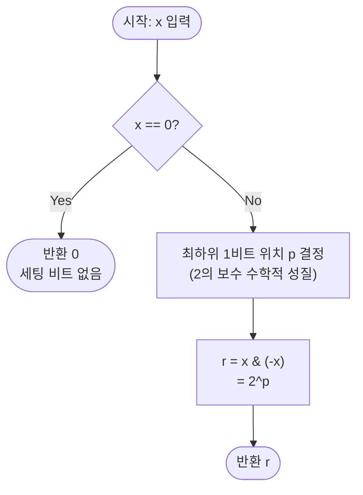

import { AlgorithmSimulation } from "#guide-sim";

# 최하위 1비트 (Lowest Set Bit) — 2의 보수가 반전을 딱 한 지점에서 멈추는 이유로 32번의 순회를 한 번의 AND로 줄이기

## 한눈에 보는 컨셉

32비트 정수 `x`에서 가장 낮은 위치의 1비트만 남기고 나머지를 전부 0으로 지우는 문제예요. 비트를 하나씩 순서대로 검사하는 대신, `x`와 그 음수 `-x`를 AND 하면 2의 보수 표현의 수학적 성질 덕분에 그 비트 하나만 정확히 살아남습니다. 검사도 반복도 없이 단일 연산 `x & (-x)`로 끝나므로 `O(1)`이고, 이는 입력을 최소 한 번은 읽어야 한다는 이론적 하한과 정확히 맞닿아 있어요.

## 출발점: 가장 순진한 방법부터

문제를 먼저 정확히 잡을게요.

```ts
function lowestSetBit(x: number): number
```

| 파라미터 | 의미 | 제약 |
|----------|------|------|
| `x` | 32비트 정수 | $-2^{31} \le x \le 2^{31}-1$ |

반환값은 `x`의 이진 표현에서 가장 낮은 자리의 1비트만 남기고 나머지를 0으로 만든 값이에요. 예를 들어 `x = 12 = 0b1100`이면 가장 낮은 1비트는 위치 2에 있으니 결과는 `0b0100 = 4`입니다. `x = 0`이면 세팅된 비트가 아예 없으므로 `0`을 반환해요.

"가장 낮은 위치의 1비트를 찾으라"는 요구를 보면, 가장 직관적인 접근은 위치를 0부터 순서대로 올려가며 실제로 1인지 검사하는 거예요. 32비트 정수이니 위치는 0부터 31까지밖에 없습니다 — "순서대로 다 확인해 보자"는 접근이 자연스러운 출발점이에요.

```ts
function lowestSetBitNaive(x: number): number {
  for (let i = 0; i < 32; i++) {
    if ((x >>> i) & 1) return 1 << i; // 처음 1을 만나는 위치가 곧 답
  }
  return 0; // 세팅된 비트가 없음
}
```

이 방법이 막히는 지점은 폭발이 아니라 **낭비**예요. 최하위 1비트 위치 $p$가 클수록(31에 가까울수록) 검사를 그만큼 많이 반복해야 합니다.

```text
x = 0b10000000000000000000000000000000  (p = 31, 최악의 경우)

검사 위치:  0  1  2  3  ...  29  30  31 ← 여기서 처음 1을 만남
                                  최악 32번 검사 후에야 답을 찾는다

비용: O(32) = O(1) 이지만, 상수 32가 p와 무관하게 항상 따라붙는다
```

입력 `x` 하나를 읽는 데만도 $\Omega(1)$이 필요하므로, 이 문제의 이론적 하한은 $O(1)$이에요. 목표는 검사 루프 없이 이 하한에 곧바로 도달하는 겁니다.

그런데 곰곰이 보면, 이 32번의 검사는 "어디에 1이 있는지" 위치를 하나하나 확인할 뿐, $x$라는 값 자체가 가진 수학적 구조는 전혀 쓰지 않고 있어요. $x$와 그 음수 $-x$를 나란히 놓고 비교하면 무슨 일이 벌어질까요? 이것이 다음 절의 실마리입니다.

## 아이디어 자세히 들여다보기

### 2의 보수가 반전을 멈추는 지점 — 수식과 그림

컴퓨터는 음의 정수를 **2의 보수(two's complement)**로 표현합니다. 정의는 이렇습니다.

$$-x = \sim x + 1$$

즉 모든 비트를 반전한 뒤 1을 더한 값이 $-x$예요. 왜 하필 이 정의여야 이번 트릭이 통할까요? 만약 **부호-크기(sign-magnitude)** 표현을 썼다면 $-x$는 부호 비트 하나만 바뀐 값이라, $x \,\&\, (-x)$를 계산해도 최하위 비트가 아니라 부호 비트를 포함한 이상한 조합이 남습니다. 2의 보수는 "반전 + 1"이라는 산술 연산이기 때문에, 아래에서 보듯 덧셈의 **올림(carry)**이 정확히 한 지점에서 멈추는 구조를 만들어 내고, 이 멈추는 지점이 바로 최하위 1비트 위치예요.

작은 예로 직접 확인해 볼게요. $x = 6$입니다.

```text
x  =    00000110   (6)
~x =    11111001   (모든 비트 반전)
+1 =    11111010   (-6, 자리올림이 위치 1에서 멈춘다)
```

위치 0은 $x$에서 이미 0이라 $\sim x$에서는 1이고, $+1$을 더하면 $1+1=10_2$이라 그 자리는 0이 되고 올림이 위로 넘어갑니다. 위치 1은 $x$에서 1이라 $\sim x$에서는 0인데, 올림을 받아 $0+1=1$이 되고 올림이 멈춰요. 위치 1이 바로 $x=6=0b110$의 최하위 1비트 위치입니다.

잠깐, 확인 하나 해볼까요? $x = 20$일 때 $-x$의 8비트 이진 표현을 손으로 구해 보세요. ($20 = 00010100$, $\sim 20 = 11101011$, 위치 2에서 올림이 멈춰 $-20 = 11101100$입니다. 실제로 $20 \,\&\, (-20) = 00000100 = 4$로, 위치 2의 비트만 남아요.)

최하위 1비트 위치를 $p$라 하고, $x$의 비트를 위치별로 나눠 보면 이렇습니다.

$$x = \underbrace{b_{31} \cdots b_{p+1}}_{p \text{ 초과, 임의}}\; \underbrace{1}_{p} \;\underbrace{0 \cdots 0}_{p \text{ 미만}}$$

이 구조를 표로 정리하면 각 구간에서 $x$와 $-x$의 비트가 어떤 관계인지 보입니다.

| 위치 | $x$의 비트 | $-x$의 비트 | $x \,\&\, (-x)$ |
|------|-----------|------------|-----------------|
| $p$ 미만 | $0$ | $0$ | $0$ |
| $p$ 번째 | $1$ | $1$ | $1$ |
| $p$ 초과 | $b_i$ (임의) | $\bar{b}_i$ (반전) | $0$ |

$p$ 초과 구간에서 $x$와 $-x$의 비트가 정확히 반전 관계이므로 AND는 항상 0이 됩니다. 왜 이 표가 성립하는지는 다음 절에서 귀납적으로 확인해요.

### 왜 모순 없이 작동하는가

**주장**: $x \neq 0$이고 최하위 1비트 위치가 $p$라면 $x \,\&\, (-x) = 2^p$이고, $x = 0$이면 $x \,\&\, (-x) = 0$이다.

$x = 0$인 경우부터 봅니다. 모든 비트가 0이므로 $\sim x$는 모든 비트가 1(즉 $-1$)이고, $-1 + 1 = 0$이라 $-x = 0$이에요. 따라서 $0 \,\&\, 0 = 0$이 되어 "세팅된 비트 없음"이 그대로 반환값에 반영됩니다.

$x \neq 0$인 경우는 $-x = \sim x + 1$의 덧셈 과정을 위치 0부터 위쪽으로 훑으며 귀납적으로 봅니다. 비트 위치는 정확히 세 구간으로 나뉘고(**$i < p$**, **$i = p$**, **$i > p$**), 32개 위치는 반드시 이 셋 중 하나에 속하므로 경우의 나눔이 빠짐없습니다.

- **기저: $i = 0$.** $p \ge 1$이면 $x$의 위치 0은 정의상 0이므로 $\sim x$의 위치 0은 1이고, $+1$의 올림 입력은 1이니 $1 + 1 = 10_2$ — 그 자리는 0, 올림은 다음 자리로 넘어갑니다. $p = 0$이면 위치 0이 바로 $x$의 최하위 1비트라 $\sim x$의 위치 0은 0이고 $0 + 1 = 1$, 올림 없이 멈춥니다.
- **귀납 단계 ($0 < i < p$):** 위치 $i-1$까지 "올림이 살아있고 결과 비트는 0"이라고 가정합니다(귀납 가정). 위치 $i$도 $p$ 미만이라 $x$에서 0, $\sim x$에서 1이고, 올림 입력이 1이니 다시 $1+1=10_2$ — 결과는 0, 올림은 계속 전파됩니다. 이 단계가 $i = p-1$까지 반복되어, $p$ 미만 전 구간에서 $-x$의 비트가 0임이 확정됩니다.
- **경계 $i = p$:** $x$의 비트는 정의상 1이므로 $\sim x$의 비트는 0입니다. 올림 입력은 (귀납으로) 1이니 $0 + 1 = 1$, 올림 없이 멈춰요. 그래서 $-x$의 위치 $p$는 1이고, 이 지점 이후로는 더 이상 올림이 전파되지 않습니다.
- **$i > p$:** 올림이 이미 위치 $p$에서 소진됐으므로 올림 입력은 0입니다. $\sim x$의 비트에 0을 더하면 값이 그대로 유지되어, $-x$의 비트는 $\sim x$의 비트, 즉 $x$ 비트의 반전 그대로예요.

세 구간을 AND에 대입하면: $p$ 미만은 $x=0, -x=0 \Rightarrow$ AND $=0$. $p$는 $x=1, -x=1 \Rightarrow$ AND $=1$. $p$ 초과는 $x$와 $-x$가 서로 정확히 반전이므로 $b_i \,\&\, \bar{b_i} = 0$. 32개 위치 중 정확히 하나(위치 $p$)만 1로 남으니 결과는 $2^p$입니다.

여기서 **헷갈리기 쉬운 포인트**는 $-x$를 그냥 $\sim x$(비트 반전만)와 같다고 착각하는 것입니다. $+1$을 빼먹으면 어떤 일이 벌어질까요? 정의상 $x \,\&\, \sim x$는 **항상** 0입니다 — 같은 값을 반전해서 AND 했으니 모든 자리가 서로 달라 자동으로 0이 나올 수밖에 없어요. 즉 $+1$을 빼먹으면 어떤 입력을 넣어도 조용히 0만 반환하는 함수가 됩니다.

```text
x = 12 = 0b00001100
~x     = 0b11110011      (반전만, +1 없음)

x & ~x = 0b00000000 = 0   ← 항상 0! ($x=12$뿐 아니라 모든 $x \ne 0$에서도 0)
x & -x = 0b00000100 = 4   ← +1까지 더한 진짜 -x를 써야 위치 p가 남는다
```

엣지 케이스도 이 불변식 위에서 확인해 둡니다.

```text
x = 0             → 0 & 0 = 0                (세팅 비트 없음, 위 증명의 기저 케이스)
x = 1             → p = 0, 1 & -1 = 1        (최하위 비트가 곧 위치 0)
x = -2^31 (최솟값) → 최상위 비트만 1인 값이므로 p = 31, 결과는 2^31
```

## 아이디어를 코드로 옮기기

```ts
function lowestSetBit(x: number): number {
  return (x & -x) >>> 0; // 부호 없는 32비트 값으로 정규화해서 반환
}
```

가장 중요한 부분은 `x & -x`, 단 하나의 연산입니다. `>>> 0`은 결과를 부호 없는 32비트 정수로 맞춰 주는 역할만 해요 — $x = -2^{31}$처럼 결과 비트 31이 세워지는 경우에도 JavaScript가 이를 음수로 재해석하지 않고 $2^{31}$이라는 값 그대로 돌려주게 만듭니다. 계산 자체는 앞 절에서 증명한 대로: `-x`가 2의 보수 연산으로 위치 $p$ 미만을 0, 위치 $p$를 1, 위치 $p$ 초과를 반전시켜 주기 때문에 AND 한 번으로 답이 나옵니다.

이 시점에서 이미 검사도 반복도 없는 $O(1)$ 코드예요 — 앞서 "출발점"에서 세운 목표(입력을 한 번 읽는 데 필요한 $\Omega(1)$ 하한)에 정확히 도달했습니다. naive 버전(위치를 하나씩 검사, 최악 32회)에서 이 최종 버전(연산 1회)으로 건너뛴 것 자체가 이 문제의 유일한 최적화 단계예요 — 이미 이론적 하한에 도달했으니 그 위에 "더 빠르게 만들 단서를 찾고, 단서를 최적화로 연결하는" 추가 단계를 반복할 여지가 없습니다. 상수 인수를 더 줄이는 특화 해법으로는 CPU의 전용 명령어(x86의 `BSF`/`TZCNT` 등, 최하위 1비트의 *위치*를 직접 돌려주는 하드웨어 명령)가 있지만, 이건 "비트를 남긴 값"이 아니라 "비트의 위치"를 구하는 다른 문제이고, 컴파일러가 `x & -x` 패턴을 인식하면 알아서 이런 명령어로 컴파일하기도 합니다. `x & (-x)`가 가진 진짜 가치는 **이식성과 범용성**이에요 — 하드웨어 명령어에 기대지 않고 어떤 언어의 정수 비트 연산에서도 똑같이 동작하고, Fenwick Tree(BIT)의 인덱스 이동(`i += i & (-i)`, `i -= i & (-i)`)이나 비트마스크 DP에서 "가장 낮은 활성 원소"를 뽑아낼 때도 그대로 재사용됩니다.

## 실행 시각화

입력 `x = 12` (`0b00001100`)에 대해 `x & (-x)`로 최하위 1비트를 추출하는 과정이에요. `keyValue` 패널은 `x`, `~x`, `-x = ~x + 1`, 그리고 비트별 AND 결과를 8비트 2진으로 보여줍니다. 최하위 1비트는 위치 `p = 2`이므로 결과는 `0b00000100 = 4`이고, 이는 실제 반환값 `4`와 일치합니다.

> 대화형 시뮬레이션은 MDX 런타임에서 표시됩니다.

export const steps = [
  {
    title: "입력 x = 12",
    detail: "최하위 1비트는 위치 p = 2 (값 4).",
    entries: [
      { label: "x (2진)", value: "00001100" },
      { label: "x (10진)", value: 12 },
    ],
  },
  {
    title: "~x 계산 (비트 반전)",
    detail: "모든 비트를 반전한다. 위치 p 미만은 모두 1이 된다.",
    entries: [
      { label: "x (2진)", value: "00001100" },
      { label: "~x (2진)", value: "11110011" },
    ],
  },
  {
    title: "-x = ~x + 1",
    detail: "1을 더하면 위치 0부터 올림이 전파되어 위치 p에서 멈춘다. 위치 p는 1, p 미만은 0.",
    entries: [
      { label: "~x (2진)", value: "11110011" },
      { label: "-x (2진)", value: "11110100" },
    ],
  },
  {
    title: "x & (-x)",
    detail: "위치 p 초과는 서로 반전이라 AND = 0, 위치 p만 둘 다 1로 남는다.",
    entries: [
      { label: "x  (2진)", value: "00001100" },
      { label: "-x (2진)", value: "11110100" },
      { label: "AND (2진)", value: "00000100" },
    ],
  },
  {
    title: "완료: 결과 = 4",
    detail: "위치 p = 2 의 비트만 남아 2^2 = 4 가 반환된다.",
    entries: [
      { label: "결과 (2진)", value: "00000100" },
      { label: "결과 (10진)", value: 4 },
      { label: "최하위 비트 위치 p", value: 2 },
    ],
  },
];

<AlgorithmSimulation view="keyValue" steps={steps} title="lowestSetBit: x & (-x), x = 12" />

## 흐름 한눈에 보기



## 스스로 점검하기

1. $x = -20$일 때 `x & (-x)`의 8비트 이진 결과와 10진 값을 손으로 구해 보세요. (힌트: 먼저 $20$의 이진 표현에서 최하위 1비트 위치 $p$를 찾고, $-20$은 $20$의 위치 $p$ 이하는 그대로, 그 위는 반전이라는 사실을 이용하세요.)
2. `x & (-x)` 대신 실수로 `x & ~x`를 구현했다면 어떤 입력에서 어떤 값이 나올까요? 왜 이 실수가 "가끔 틀리는" 게 아니라 "항상 틀리는" 버그인지 위 증명의 어느 부분이 깨지는지로 설명해 보세요.
3. Fenwick Tree(BIT)에서는 인덱스를 `i += i & (-i)`로 옮겨 다음 구간으로 점프합니다. `i = 6`일 때 `i & (-i)` 값과 다음 인덱스를 직접 구하고, 왜 이 점프 크기가 "인덱스 $i$가 담당하는 구간의 길이"와 같은 것인지 이번 가이드에서 증명한 사실(각 위치의 값이 $2^p$)을 근거로 한 문장으로 설명해 보세요.
