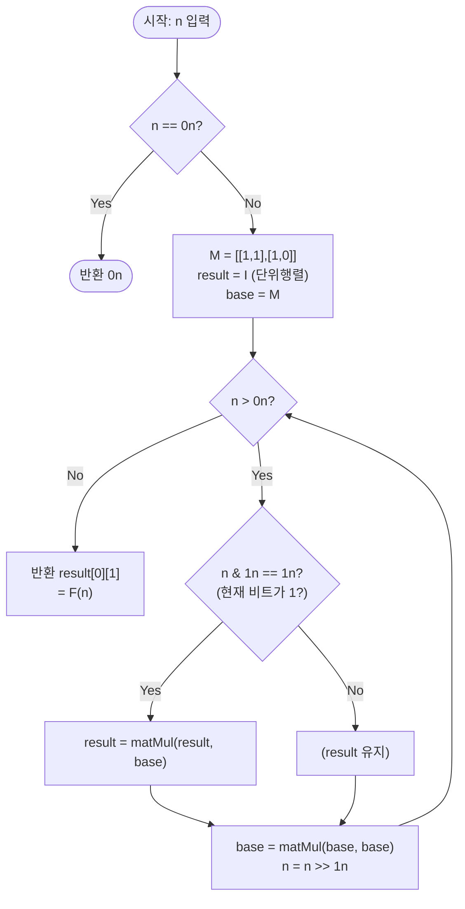

import { AlgorithmSimulation } from "#guide-sim";

# 행렬 거듭제곱 피보나치 — 한 걸음의 전진을 곱셈 하나로 바꾸면 왜 log n으로 줄어드는가

## 한눈에 보는 컨셉

피보나치 점화식 $F(n) = F(n-1) + F(n-2)$는 선형 점화식이라서, 한 칸 전진하는 과정 자체를 2×2 행렬의 곱셈으로 표현할 수 있어요. 그러면 "$F(n)$을 구하라"는 문제가 "행렬 $M$을 $n$제곱하라"는 문제로 바뀌고, 반복 제곱법(이진 거듭제곱)을 쓰면 `O(log n)`번의 행렬 곱셈만으로 $M^n$을 구할 수 있습니다. $n$이 $10^{18}$까지 가는 이 문제에서, 이 관찰 하나가 31년 걸릴 계산을 60번의 곱셈으로 줄여줍니다.

## 출발점: 가장 순진한 방법부터

문제를 먼저 정확히 잡을게요.

```ts
function matrixPowerFibonacci(n: bigint): bigint
```

`n`은 $0 \leq n \leq 10^{18}$ 범위의 정수(`bigint`)이고, 반환값은 $n$번째 피보나치 수 $F(n)$(0-인덱스, $F(0)=0$, $F(1)=1$, $F(n)=F(n-1)+F(n-2)$)이에요. 시간 제한은 1초입니다.

가장 정직한 방법은 정의를 그대로 코드로 옮기는 거예요. `a = F(i-1)`, `b = F(i)`를 유지하면서 한 칸씩 전진합니다.

```ts
function fibNaive(n: bigint): bigint {
  if (n === 0n) return 0n;
  let a = 0n;
  let b = 1n;
  for (let i = 1n; i < n; i++) {
    [a, b] = [b, a + b]; // 한 칸 전진: (F(i-1), F(i)) → (F(i), F(i+1))
  }
  return b;
}
```

`n`이 작을 때는 눈 깜짝할 사이예요.

```text
n = 6:  F(0)=0 → F(1)=1 → F(2)=1 → F(3)=2 → F(4)=3 → F(5)=5 → F(6)=8
        덧셈 6번으로 끝
```

그런데 이 문제의 `n`은 최대 $10^{18}$까지 갑니다.

```text
n = 10^18:  같은 방식이면 덧셈이 10^18번 필요
            현대 CPU ≈ 10^9회/초  →  10^18 / 10^9 = 10^9초 ≈ 31.7년
            시간 제한 1초 안에는 어림도 없다   ✗
```

$F(10^{18})$ 자체도 어마어마하게 큰 수예요(자릿수 $\approx 10^{18} \times \log_{10}\varphi \approx 2.09 \times 10^{17}$, $\varphi$는 황금비). 하지만 자릿수가 큰 건 어쩔 수 없는 출력 크기이고, 진짜 문제는 "한 칸씩 $10^{18}$번 전진"하는 절차 자체예요. 목표 복잡도는 $O(\log n)$ — $n = 10^{18}$이면 $\log_2(10^{18}) \approx 59.8$, 즉 약 60번의 연산으로 끝내야 합니다.

"한 칸씩 전진하는 대신, 여러 칸을 한 번에 건너뛸 수는 없을까?" — 이게 출발 단서예요. `[a, b] = [b, a + b]`라는 한 걸음의 전진을 "덧셈"이 아니라 "곱셈 하나"로 표현할 수 있다면, 그 곱셈을 거듭제곱하듯 빠르게 반복해서 여러 칸을 한 번에 건너뛸 수 있을 겁니다.

## 아이디어 자세히 들여다보기

### 한 걸음을 행렬 곱셈으로 바꾸기 — 수식과 그림

한 걸음의 전진 `(F(n-1), F(n)) → (F(n), F(n+1))`을 행렬 곱으로 써 봅시다.

$$\begin{pmatrix}F(n+1)\\F(n)\end{pmatrix}=\begin{pmatrix}1&1\\1&0\end{pmatrix}\begin{pmatrix}F(n)\\F(n-1)\end{pmatrix}$$

이 2×2 행렬을 $M=\begin{pmatrix}1&1\\1&0\end{pmatrix}$라고 부를게요. 이 곱을 $n$번 연속으로 적용하면 다음 항등식이 성립합니다(다음 절에서 귀납으로 증명해요).

$$M^n=\begin{pmatrix}F(n+1)&F(n)\\F(n)&F(n-1)\end{pmatrix}$$

작은 $n$으로 직접 채워 봅시다.

```text
M¹ = (1 1)              (F(2) F(1))   (1 1)
     (1 0)      기대값: (F(1) F(0)) = (1 0)     ✓ (F(2)=1, F(1)=1, F(0)=0)

M² = M¹·M¹ = (1 1)(1 1) = (1·1+1·1  1·1+1·0) = (2 1)
             (1 0)(1 0)   (1·1+0·1  1·1+0·0)   (1 1)

              (F(3) F(2))   (2 1)
     기대값:  (F(2) F(1)) = (1 1)     ✓ (F(3)=2, F(2)=1, F(1)=1)
```

잠깐, 확인 하나만 해 볼까요? $M^3 = M^2 \cdot M$을 손으로 곱하면 $\begin{pmatrix}3&2\\2&1\end{pmatrix}$가 나와야 해요($F(4)=3, F(3)=2, F(2)=1$). 실제로 $(2\cdot1+1\cdot1,\ 2\cdot1+1\cdot0)=(3,2)$, $(1\cdot1+1\cdot1,\ 1\cdot1+1\cdot0)=(2,1)$이니 맞습니다.

**왜 하필 2×2 행렬이어야 할까요?** 피보나치는 "직전 2개 항"에만 의존하는 2차 선형 점화식이라, 상태를 표현하려면 최소 2개 값 $(F(n), F(n-1))$이 필요해요. 이 상태 벡터에 곱해서 다음 상태로 보내는 선형 변환이 바로 $M$이고, 2차원 벡터를 2차원 벡터로 보내는 선형 변환은 2×2 행렬입니다. 만약 3차 선형 점화식(직전 3개 항에 의존)이었다면 상태 벡터가 3차원이 되어 3×3 행렬이 필요했을 거예요 — 점화식의 "차수"가 곧 행렬의 크기를 정합니다.

**왜 굳이 행렬(스칼라 반복이 아니라)이어야 할까요?** 스칼라 값 `a, b`를 그냥 들고 있는 것만으로는 "여러 칸을 한 번에 건너뛰기"가 안 됩니다. 반면 행렬 곱셈은 **결합법칙**이 성립하고 **항등원**(단위행렬 $I$)이 있어서, $M^a \cdot M^b = M^{a+b}$처럼 "$a$칸 전진"과 "$b$칸 전진"을 곱셈 하나로 합칠 수 있어요. 이 "합성 가능성"이 다음 절의 반복 제곱법을 가능하게 하는 재료입니다.

### 단서를 설명해 주는 이론 — 반복 제곱법(이진 거듭제곱)

앞 절에서 얻은 단서는 "$M^a \cdot M^b = M^{a+b}$로 전진을 합성할 수 있다"는 것이었어요. 이걸 일반 이론으로 승격하면 **반복 제곱법(binary exponentiation, exponentiation by squaring)**이 됩니다.

이 이론은 특정 알고리즘이 아니라, **결합법칙이 성립하고 항등원이 있는 연산**(수학적으로는 모노이드)이라면 무엇에든 적용되는 일반 기법이에요. 정수 거듭제곱 $a^n \bmod p$(모듈러 거듭제곱)에서도, 지금처럼 행렬 거듭제곱에서도 똑같이 쓰입니다.

핵심 관찰은 $n$을 이진수로 쓰면 $n = b_k 2^k + b_{k-1}2^{k-1} + \cdots + b_1 2^1 + b_0 2^0$ ($b_i \in \{0,1\}$)이라는 점이에요. 그러면

$$M^n = M^{b_0} \cdot (M^2)^{b_1} \cdot (M^4)^{b_2} \cdots (M^{2^k})^{b_k}$$

즉 $M, M^2, M^4, M^8, \ldots$처럼 **밑을 제곱해 가면서**, $n$의 이진수 각 자리가 1인 위치에서만 결과에 곱해 주면 됩니다.

```text
n = 10 = 0b1010

밑(base)의 변화:      M → M² → M⁴ → M⁸        (매 단계 제곱, 4번)
n의 비트 (LSB부터):    0    1    0    1        (1010을 뒤에서부터 읽음)
결과에 곱하는 시점:     ×          ×             (비트가 1인 곳만)

결과 = M² × M⁸ = M^(2+8) = M^10
```

곱셈 4번(제곱 4번 + 필요할 때 누적 곱 2번)으로 $M^{10}$을 구했어요. 10번 반복하는 대신 $\log_2 10 \approx 3.3$, 즉 4단계로 끝난 거죠. $n = 10^{18}$이라면 이 단계 수가 약 60개로 늘어날 뿐, 여전히 로그 규모입니다.

### 왜 모순 없이 작동하는가

이 아이디어가 실제로 옳다는 걸 두 층위에서 확인해야 해요. 하나는 "행렬 항등식 $M^n = \begin{pmatrix}F(n+1)&F(n)\\F(n)&F(n-1)\end{pmatrix}$이 모든 $n \geq 1$에서 성립하는가", 다른 하나는 "반복 제곱법 루프가 정말 $M^n$을 계산하는가"입니다.

**행렬 항등식의 귀납 증명**

- **기저 ($n=1$):** $M^1 = \begin{pmatrix}1&1\\1&0\end{pmatrix}$이고, 우변은 $\begin{pmatrix}F(2)&F(1)\\F(1)&F(0)\end{pmatrix} = \begin{pmatrix}1&1\\1&0\end{pmatrix}$. 일치합니다.
- **귀납 ($n \to n+1$):** $M^n = \begin{pmatrix}F(n+1)&F(n)\\F(n)&F(n-1)\end{pmatrix}$이 성립한다고 가정하면,

$$M^{n+1} = M^n \cdot M = \begin{pmatrix}F(n+1)&F(n)\\F(n)&F(n-1)\end{pmatrix}\begin{pmatrix}1&1\\1&0\end{pmatrix} = \begin{pmatrix}F(n+1)+F(n)&F(n+1)\\F(n)+F(n-1)&F(n)\end{pmatrix}$$

피보나치 정의 $F(n+2) = F(n+1)+F(n)$을 그대로 대입하면 $= \begin{pmatrix}F(n+2)&F(n+1)\\F(n+1)&F(n)\end{pmatrix}$이 되어, $n+1$에 대한 항등식과 정확히 일치합니다. $n=1$부터 이 과정을 무한히 반복할 수 있으므로 모든 $n \geq 1$에서 성립해요. 경우가 "기저 하나 + 귀납 단계 하나"로 완전히 나뉘고, 다른 경우는 없습니다(자연수는 1부터 +1씩만 올라가니까요).

**반복 제곱법 루프의 정당성**

루프가 유지하는 불변식은 이거예요.

> 매 반복 시작 시점에, `result × base^(아직 처리 안 한 n의 남은 비트가 나타내는 값)`은 항상 처음 요청받은 $M^n$과 같다.

매 반복에서 처리할 경우는 "현재 최하위 비트가 0" 또는 "1" 딱 두 가지뿐이고(비트는 정의상 0 또는 1이므로 경우가 완전합니다), 두 경우 모두 불변식을 지킵니다.

- 비트가 1이면 `result`에 `base`를 곱해 그 자리의 기여를 반영합니다(맞음 — 이진 전개에서 그 자리가 실제로 1이므로).
- 비트가 0이면 `result`를 그대로 둡니다(맞음 — $M^0 = I$이므로 곱해도 안 곱해도 값이 같고, 안 곱하는 쪽이 계산을 아낍니다).

그다음 `base`를 제곱하고 `n`을 오른쪽으로 1비트 밀면, "다음 비트가 나타내는 값"과 "그 자리의 밑"이 정확히 한 자리씩 앞으로 이동합니다. 루프가 끝나면(남은 비트가 없으면) `result = M^n`이 됩니다.

**여기서 헷갈리기 쉬운 포인트 1**은 "$n=0$일 때 특별 처리가 꼭 필요하다"는 생각이에요. 얼핏 단위행렬 $I=\begin{pmatrix}1&0\\0&1\end{pmatrix}$의 $(0,1)$ 위치가 우연히 0이 아닐 수도 있다고 걱정하기 쉬운데, 실제로 $I$의 $(0,1)$ 위치는 항상 0이고 이는 $F(0)=0$과 정확히 일치합니다. 피보나치를 $F(-1) = F(1)-F(0) = 1$로 한 칸 더 확장해서 보면, $M^0=I=\begin{pmatrix}F(1)&F(0)\\F(0)&F(-1)\end{pmatrix}=\begin{pmatrix}1&0\\0&1\end{pmatrix}$로 앞서 증명한 항등식이 $n=0$까지도 그대로 이어집니다. 즉 `n === 0n` 조기 반환은 수학적으로 **필수는 아니고**, 굳이 넣는다면 불필요한 반복문 진입을 피하는 조기 반환 정도의 의미예요.

**여기서 헷갈리기 쉬운 포인트 2**는 bigint와 number를 섞어 쓰는 실수입니다. `n`은 `bigint`인데 `n % 2 === 1`처럼 숫자 리터럴 `1`(number)과 섞어 연산하면 런타임 오류가 납니다.

```text
const n: bigint = 5n;
n % 2 === 1   // TypeError: Invalid mix of BigInt and other type in remainder.
```

반드시 `n % 2n` 또는 `n & 1n`처럼 **양쪽 다 bigint 리터럴**로 맞춰야 해요.

엣지 케이스도 짚어 둘게요.

```text
n = 0n:  루프가 0번 돌고 result = I,  I[0][1] = 0  = F(0)   ✓
n = 1n:  루프가 1번 돌고 result = M,  M[0][1] = 1  = F(1)   ✓
n = 2n:  루프가 2번 돌고 result = M²,  M²[0][1] = 1 = F(2)  ✓
```

## 아이디어를 코드로 옮기기

앞 절의 두 축(행렬 항등식 + 반복 제곱법)을 그대로 옮기면 이렇습니다. `n = 0`은 조기 반환으로 처리하되(수학적으로 없어도 되지만, 굳이 반복문에 들어갈 필요가 없어 조기 반환을 남겨 둡니다), 그 외에는 이진 비트를 따라가며 `base`를 제곱하고 필요할 때만 `result`에 곱합니다.

```ts
type Mat = [[bigint, bigint], [bigint, bigint]];

function matMul(A: Mat, B: Mat): Mat {
  return [
    [
      A[0][0] * B[0][0] + A[0][1] * B[1][0],
      A[0][0] * B[0][1] + A[0][1] * B[1][1],
    ],
    [
      A[1][0] * B[0][0] + A[1][1] * B[1][0],
      A[1][0] * B[0][1] + A[1][1] * B[1][1],
    ],
  ];
}

function matPow(M: Mat, n: bigint): Mat {
  let result: Mat = [[1n, 0n], [0n, 1n]]; // 단위행렬 I
  let base: Mat = M;
  let e = n;
  while (e > 0n) {
    if (e & 1n) {
      result = matMul(result, base); // 현재 비트가 1이면 먼저 반영
    }
    base = matMul(base, base); // base를 다음 자리(제곱)로 키움
    e >>= 1n;
  }
  return result;
}

function matrixPowerFibonacci(n: bigint): bigint {
  if (n === 0n) return 0n;
  const M: Mat = [[1n, 1n], [1n, 0n]];
  const result = matPow(M, n);
  return result[0][1]; // M^n의 (0,1) 위치가 F(n)
}
```

**가장 실수가 잦은 줄은 `if (e & 1n) { result = matMul(result, base); }` 다음에 오는 `base = matMul(base, base);`의 순서입니다.** 반드시 "현재 `base`로 `result`를 먼저 갱신한 뒤 → `base`를 제곱"해야 해요. 이 순서를 바꿔서 먼저 제곱하고 나중에 곱하면, 그 자리의 비트가 원래 나타내야 할 값의 **두 배** 자리를 곱하게 됩니다. 실제로 순서를 바꿔 실행하면 $F(n)$ 대신 조용히 $F(2n)$이 나옵니다.

```text
순서를 바꾼 코드로 matrixPowerFibonacci(10n)을 실행하면:
  결과 = 6765  ←  이건 F(10)=55가 아니라 F(20)=6765!
matrixPowerFibonacci(5n)도 같은 실수로 실행하면:
  결과 = 55  ←  F(5)=5가 아니라 F(10)=55!
```

> 곱하고 나서 키운다 — result는 지금 크기의 base로, base는 그다음에 두 배로.

그 외에 놓치기 쉬운 지점 하나만 더 짚을게요. 행렬 곱셈 자체는 일반적으로 교환법칙이 성립하지 않지만($AB \neq BA$가 흔함), **같은 행렬 $M$의 거듭제곱끼리는 항상 교환됩니다**($M^a M^b = M^b M^a = M^{a+b}$). 그래서 `matMul(result, base)`를 `matMul(base, result)`로 좌우를 바꿔 써도 최종 값은 같아요 — 다만 위에서 짚은 **시간축 순서**(제곱 전에 곱할지, 후에 곱할지)는 좌우 순서와 무관하게 여전히 중요합니다. 이 둘을 헷갈리지 마세요.

**더 최적화할 여지가 있을까요?** 성능 목표(출발점에서 정한 $O(\log n)$)는 이 구현만으로 이미 달성했습니다. $n = 10^{18}$이어도 반복은 약 60번뿐이라, 여기서 점근 복잡도를 더 줄일 자연스러운 다음 단계는 없어요. 참고로 "피보나치 수를 구한다"는 이 특정 문제에는 행렬 곱셈 대신 $F(2k) = F(k)\bigl(2F(k+1)-F(k)\bigr)$, $F(2k+1) = F(k+1)^2+F(k)^2$ 같은 **fast doubling** 항등식을 쓰는 특화 해법도 있습니다. 점근 복잡도는 똑같이 $O(\log n)$이지만 2×2 행렬 곱(곱셈 8회)이 아니라 스칼라 곱셈 3~4회로 매 단계를 처리해 상수항이 더 작아요. 그럼에도 행렬 거듭제곱을 배우는 이유는 **범용성**입니다 — $k$차 선형 점화식이면 무엇이든 $k \times k$ 전이 행렬만 정의하면 똑같은 반복 제곱법 틀로 $O(k^3 \log n)$에 풀 수 있어요(피보나치를 넘어 트리보나치, 임의의 선형 점화식까지).

## 실행 시각화

입력 `n = 10`(`0b1010`)에 대해 전이 행렬 `M = [[1,1],[1,0]]`의 거듭제곱을 반복 제곱법으로 계산하는 과정이에요. `keyValue` 패널은 남은 `n`의 2진 표현, 현재 비트, `base`(= $M$의 $2^k$ 제곱), 누적 `result`를 보여줍니다. 비트가 1인 위치(2¹, 2³ 자리)에서만 `result`에 `base`를 곱해요. 실제 반환값은 `55n`(= $F(10)$, $M^{10}$의 $(0,1)$ 위치)이고, 마지막 프레임의 `result[0][1]`과 일치합니다.

> 대화형 시뮬레이션은 MDX 런타임에서 표시됩니다.

export const steps = [
  {
    title: "초기화",
    detail: "result = I (단위행렬), base = M = [[1,1],[1,0]], n = 1010.",
    entries: [
      { label: "n (2진)", value: "1010" },
      { label: "base", value: "[[1,1],[1,0]]" },
      { label: "result", value: "[[1,0],[0,1]] (I)" },
    ],
  },
  {
    title: "비트 0 = 0",
    detail: "n & 1 = 0 이라 result 유지. base를 제곱: base = M^2 = [[2,1],[1,1]]. n >>= 1 → 101.",
    entries: [
      { label: "현재 비트", value: "0 (곱 안 함)" },
      { label: "base (제곱 후)", value: "[[2,1],[1,1]] = M^2" },
      { label: "result", value: "[[1,0],[0,1]] (I)" },
      { label: "n (남은, 2진)", value: "101" },
    ],
  },
  {
    title: "비트 1 = 1",
    detail: "n & 1 = 1 이라 result = I × M^2 = M^2. base 제곱: M^4 = [[5,3],[3,2]]. n >>= 1 → 10.",
    entries: [
      { label: "현재 비트", value: "1 (곱함)" },
      { label: "base (제곱 후)", value: "[[5,3],[3,2]] = M^4" },
      { label: "result", value: "[[2,1],[1,1]] = M^2" },
      { label: "n (남은, 2진)", value: "10" },
    ],
  },
  {
    title: "비트 2 = 0",
    detail: "n & 1 = 0 이라 result 유지. base 제곱: M^8 = [[34,21],[21,13]]. n >>= 1 → 1.",
    entries: [
      { label: "현재 비트", value: "0 (곱 안 함)" },
      { label: "base (제곱 후)", value: "[[34,21],[21,13]] = M^8" },
      { label: "result", value: "[[2,1],[1,1]] = M^2" },
      { label: "n (남은, 2진)", value: "1" },
    ],
  },
  {
    title: "비트 3 = 1",
    detail: "n & 1 = 1 이라 result = M^2 × M^8 = M^10 = [[89,55],[55,34]]. n >>= 1 → 0.",
    entries: [
      { label: "현재 비트", value: "1 (곱함)" },
      { label: "result", value: "[[89,55],[55,34]] = M^10" },
      { label: "n (남은, 2진)", value: "0" },
    ],
  },
  {
    title: "완료: F(10) = 55",
    detail: "n = 0 이라 루프 종료. result[0][1] = 55 = F(10) 을 반환한다.",
    entries: [
      { label: "result", value: "[[89,55],[55,34]]" },
      { label: "result[0][1] = F(10)", value: 55 },
    ],
  },
];

<AlgorithmSimulation view="keyValue" steps={steps} title="행렬 거듭제곱 피보나치: n = 10" />

## 흐름 한눈에 보기



## 스스로 점검하기

1. `n = 7`(`0b111`)을 직접 손으로 따라가 보세요. `base`를 $M \to M^2 \to M^4$로 제곱하면서, 비트가 1인 자리(전부 1이에요!)마다 `result`에 곱해 나가면 최종 `result[0][1]`은 얼마가 될까요? (힌트: $F(7)=13$이 나와야 합니다. $M^2=[[2,1],[1,1]]$, $M^4=[[5,3],[3,2]]$을 순서대로 곱해 확인해 보세요.)
2. 본문에서 "`base = matMul(base, base)`를 `result` 갱신보다 먼저 하면 $F(n)$ 대신 $F(2n)$이 나온다"고 했어요. $n=10$일 때 왜 정확히 두 배인 $n=20$의 값이 나오는지, 이진수 자리 이동의 관점에서 설명해 보세요.
3. 만약 3차 선형 점화식인 트리보나치 수열 $T(n) = T(n-1)+T(n-2)+T(n-3)$ ($T(0)=0, T(1)=0, T(2)=1$)을 같은 방법으로 $O(\log n)$에 풀고 싶다면, 전이 행렬은 몇 × 몇이어야 할까요? 상태 벡터 $(T(n), T(n-1), T(n-2))$를 다음 상태로 보내는 행렬의 각 행을 직접 채워 보세요.
