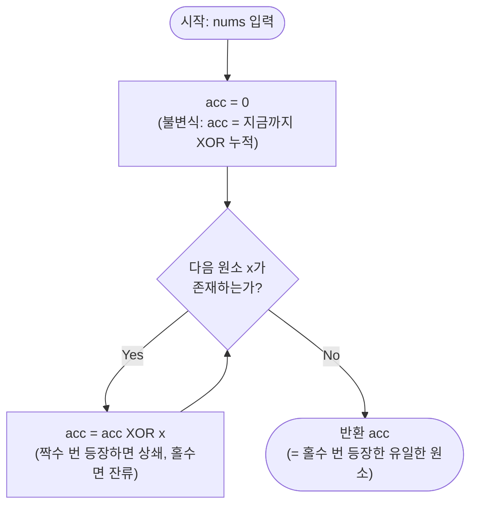

import { AlgorithmSimulation } from "#guide-sim";

# XOR 누적 트릭 (Single Number) — 짝을 지어 상쇄시키면 남는 건 하나뿐인 이유

## 한눈에 보는 컨셉

배열 안에서 정확히 하나만 홀수 번 등장하고 나머지는 모두 짝수 번 등장할 때, 그 유일한 원소를 찾는 문제예요. 관찰은 하나예요 — XOR은 같은 값을 두 번 적용하면 스스로를 지우는 연산($a \oplus a = 0$)이라, 배열 전체를 XOR로 누적하면 짝수 번 나온 값은 전부 사라지고 홀수 번 나온 값만 남습니다. 그 결과 해시맵도 정렬도 없이, 변수 하나로 `O(N)` 시간·`O(1)` 공간을 동시에 달성해요.

## 출발점: 가장 순진한 방법부터

문제를 먼저 정확히 잡을게요.

```ts
function singleNumberXor(nums: number[]): number
```

| 파라미터 | 의미 | 제약 |
|----------|------|------|
| `nums` | 32비트 정수 배열 | `1 ≤ N ≤ 10^6`, `\|nums[i]\| < 2^31` |

**반환값:** 배열에서 홀수 번 등장하는 유일한 원소.
**전제 조건:** 홀수 번 등장하는 원소가 정확히 1개 존재한다고 보장됩니다.

"어떤 값이 짝수 번인지 홀수 번인지 알아야 한다"는 요구를 그대로 받아들이면, 가장 정직한 방법은 등장 횟수를 세는 거예요.

```ts
function singleNumberNaive(nums: number[]): number {
  const freq = new Map<number, number>();
  for (const x of nums) freq.set(x, (freq.get(x) ?? 0) + 1); // 등장 횟수 누적
  for (const [v, c] of freq) if (c % 2 === 1) return v;      // 홀수 번 등장한 값 탐색
  throw new Error("홀수 번 등장 원소 없음");
}
```

작은 예로 비용을 직접 세어 볼게요. `nums = [4, 1, 2, 1, 2]`라면 `freq`는 `{4:1, 1:2, 2:2}`가 되고, 여기서 `4`를 찾아 반환합니다. 문제는 원소 종류가 많아질 때예요.

```text
N = 10^6, 원소가 전부 서로 다른 값이라면:
freq 맵 크기 → 최대 10^6개 엔트리
공간:  O(N)  ← 배열 크기만큼 커질 수 있다
```

이 방법은 `O(N)` 시간이지만 **`O(N)` 추가 공간**이 필요합니다. 정렬로 인접 원소를 비교하면 `O(1)` 공간까지는 줄일 수 있지만, 그 대신 `O(N log N)` 시간이 듭니다.

```text
정렬 후:  [1, 1, 2, 2, 4]
          ├─┤ ├─┤  ↑
          짝 짝   짝 없음 → 4가 정답
비용:     정렬 O(N log N)  ← 시간이 늘어난다
```

문제가 요구하는 목표는 **`O(N)` 시간과 `O(1)` 공간을 동시에** 만족하는 것인데, 해시맵은 공간에서, 정렬은 시간에서 걸립니다. **"짝수 번 등장한 값을 셈 없이 그 자리에서 지워버리는 연산이 있는가?"** — 이 질문이 다음 절로 가는 단서예요.

## 아이디어 자세히 들여다보기

### 스스로를 지우는 연산 — 수식과 그림

카운트 대신 **누적 연산자** 하나로 문제를 풀 수 있는지 생각해 봅시다. XOR($\oplus$)은 비트 단위로 "다르면 1, 같으면 0"을 만드는 연산인데, 같은 값끼리 XOR하면 항상 0이 됩니다.

$$a \oplus a = 0, \qquad a \oplus 0 = a$$

3비트로 직접 확인해 볼게요.

```text
  2 = 010
⊕ 2 = 010
-------
      000   ← 자기 자신과 XOR하면 완전히 사라진다

  2 = 010
⊕ 0 = 000
-------
      010   ← 0과 XOR하면 그대로 남는다(항등원)
```

이 두 성질을 합치면 누산기 하나로 "짝수 번은 지우고 홀수 번은 남기는" 셈이 가능해집니다. 누산기 `acc`를 다음과 같이 정의할게요.

$$\text{acc}_0 = 0, \qquad \text{acc}_{i+1} = \text{acc}_i \oplus \text{nums}[i]$$

왜 하필 이 형태여야 할까요? "값별로 등장 횟수를 세고 홀수인 것을 고른다"(해시맵 방식)는 **값마다 별도의 카운터**가 필요하지만, XOR 누적은 **모든 값을 같은 변수 하나에 겹쳐 쓰면서도 정보가 깨지지 않습니다** — 짝수 번 겹쳐 쓴 값은 스스로 상쇄되어 사라지기 때문이에요. 즉 카운터를 값별로 나누는 대신, "지금까지의 판정 결과"를 하나의 숫자에 압축해서 들고 다니는 셈입니다.

작은 입력 `[4, 1, 2, 1, 2]`로 직접 채워 볼게요.

```text
acc:  000
⊕ 4=100 → 100
⊕ 1=001 → 101
⊕ 2=010 → 111
⊕ 1=001 → 110   (1이 두 번째 등장 → 비트 0 상쇄)
⊕ 2=010 → 100   (2가 두 번째 등장 → 비트 1 상쇄)
결과: 100 = 4
```

잠깐, 확인 하나만 해 볼까요? 이 배열의 순서를 `[1, 2, 4, 2, 1]`로 뒤섞어도 결과가 똑같이 `4`가 나올까요? — XOR은 교환·결합 법칙을 만족하므로 어떤 순서로 누적해도 "각 값이 몇 번 등장했는가"만 결과를 결정합니다. 순서를 바꿔 봐도 `1⊕1=0`, `2⊕2=0`이 어차피 상쇄되어 `4`만 남으므로 답은 같습니다.

### 단서를 설명해 주는 이론 — XOR과 GF(2) 벡터공간

방금 쓴 "자기 자신과 XOR하면 사라진다"는 성질은 우연이 아니라, 비트 하나하나가 **모듈로 2 덧셈**을 하고 있기 때문입니다. 32비트 정수를 32개의 $\{0, 1\}$ 성분으로 보면, XOR은 이 성분들을 $\mathrm{GF}(2) = \mathbb{Z}/2\mathbb{Z}$ 위에서 각각 독립적으로 더하는 연산이에요.

$\mathrm{GF}(2)$에서는 덧셈표가 이렇습니다.

```text
+ | 0 1        같은 값끼리 더하면 항상 0
--+----        (0+0=0, 1+1=0=2 mod 2)
0 | 0 1
1 | 1 0
```

이 표에서 $1+1=0$인 이유는 "2를 2로 나누면 나머지가 0"이기 때문이에요. 그래서 이 체(field) 위에서는 **모든 원소가 자기 자신의 덧셈 역원**입니다($a+a=0$이므로 $-a=a$). 32비트 정수의 XOR은 이 $\mathrm{GF}(2)$ 덧셈을 32개 비트에 동시에(비트별로 독립적으로) 적용한 것과 같습니다 — 그래서 "값 하나를 짝수 번 더하면 사라지고 홀수 번 더하면 남는다"는 성질이 정수 전체에도 비트 단위로 그대로 성립해요. 이 사실을 뒤에서 정당성 증명의 핵심 근거로 다시 씁니다 — 기억해 두세요.

### 왜 모순 없이 작동하는가

**핵심 불변식**: 루프 $i$회 후 다음이 성립합니다.

$$\text{acc} = \text{nums}[0] \oplus \text{nums}[1] \oplus \cdots \oplus \text{nums}[i-1]$$

**기저**: $i=0$일 때 `acc = 0`이고, 빈 XOR(원소 0개의 누적)은 관례상 항등원 0이므로 식이 성립합니다.

**귀납 단계**: $i$회 후 불변식이 성립한다고 가정하면, `acc_{i+1} = acc_i ⊕ nums[i] = (nums[0] ⊕ ... ⊕ nums[i-1]) ⊕ nums[i] = nums[0] ⊕ ... ⊕ nums[i]`가 되어 $i+1$회에도 그대로 성립합니다. 루프의 각 반복은 XOR 한 번뿐이라 이 갱신 외의 다른 경우의 수가 없으므로, 이 한 단계 논증이 모든 반복을 완전히 덮습니다.

루프 종료 시(즉 $i=N$) `acc = nums[0] ⊕ nums[1] ⊕ ... ⊕ nums[N-1]`, 즉 배열 전체의 XOR입니다. 앞 절의 $\mathrm{GF}(2)$ 논증에 따라 각 값 $v$가 $k$번 등장하면 전체 XOR에 대한 $v$의 기여는 $k$가 짝수면 $0$, 홀수면 $v$입니다. 문제 조건상 짝수 번 등장한 값들의 기여는 모두 0이 되어 사라지고, 정확히 하나 존재하는 홀수 번 등장 값만 `acc`에 남습니다.

여기서 **헷갈리기 쉬운 포인트**는 "값이 3번, 5번처럼 두 번보다 많이 홀수 번 등장해도 상쇄되지 않고 그대로 남는다"는 부분입니다. 짝을 지어 없어지는 건 정확히 "두 번씩 짝지어지는 부분"뿐이고, 홀수 번이면 항상 하나가 남아요.

```text
5가 3번 등장: 5 ⊕ 5 ⊕ 5 = (5 ⊕ 5) ⊕ 5 = 0 ⊕ 5 = 5   ← 두 개가 상쇄되고 하나 남는다
5가 4번 등장: (5⊕5) ⊕ (5⊕5) = 0 ⊕ 0 = 0            ← 완전히 상쇄
```

또 하나 헷갈리기 쉬운 지점은 **음수와 0의 처리**입니다. "XOR은 양수에만 안전하지 않을까?"라고 생각하기 쉬운데, JavaScript의 `^` 연산자는 피연산자를 32비트 2의 보수로 변환해 비트 단위로 처리하므로 음수도 문제없이 동작합니다. `0`도 특별 취급이 필요 없어요 — `0`이 몇 번 등장하든 `0 ⊕ 0 = 0`이라 다른 값과 똑같은 규칙을 따릅니다.

엣지 케이스를 불변식 위에서 점검해 볼게요.

```text
nums = [x]           → acc = 0 ⊕ x = x                     (원소 1개, 그 자체가 정답)
nums = [0, 0, 0]      → acc = 0 ⊕ 0 ⊕ 0 = 0                 (0이 홀수 번이어도 정상 처리)
nums = [-1, -1, 3]    → acc = 0 ⊕ (-1) ⊕ (-1) ⊕ 3 = 0 ⊕ 3 = 3 (음수 자기상쇄)
```

## 아이디어를 코드로 옮기기

```ts
function singleNumberXor(nums: number[]): number {
  let acc = 0;
  // 불변식: 루프 i회 후 acc = nums[0] ^ nums[1] ^ ... ^ nums[i-1]
  for (let i = 0; i < nums.length; i++) {
    acc ^= nums[i]!;
  }
  return acc;
}
```

**가장 중요한 줄은 `acc ^= nums[i]!`입니다.** 이 한 줄이 "짝수 번 등장한 값을 지우고 홀수 번 등장한 값을 남기는" 셈 전체를 담당해요. 그 외에 결정 지점 두 가지만 짚을게요.

- **초기값 `acc = 0`**: 항등원에서 시작해야 첫 원소부터 그대로 흡수됩니다. `acc`를 `nums[0]`으로 초기화하고 인덱스 1부터 순회하는 변형도 결과는 같지만, 그 경우 빈 배열을 별도로 방어해야 해서 실수가 늘어납니다.
- **연산자는 반드시 `^`(XOR)**: `|`(OR)나 `&`(AND)로 잘못 적으면 상쇄가 아예 일어나지 않습니다. 예를 들어 `[4, 1, 2, 1, 2]`를 OR로 누적하면 `4|1|2|1|2 = 7`이 나와 정답 `4`와 다른 값이 됩니다 — 상쇄되어야 할 `1`, `2`의 흔적이 그대로 남기 때문이에요.

이 구현이 이미 `O(N)` 시간·`O(1)` 공간이라는 목표를 정확히 만족합니다. 배열을 한 번 순회하며 변수 하나만 갱신하니, 더 줄일 시간·공간이 남아 있지 않아요 — 배열의 모든 원소를 최소 한 번은 읽어야 정답을 판정할 수 있으므로 `O(N)`은 이 문제의 시간 하한이고, 누산기 하나 외에 다른 상태가 필요 없으므로 `O(1)` 공간도 더 줄일 여지가 없습니다. 그래서 이 알고리즘은 naive 해시맵/정렬 접근에서 곧장 이 최적해로 건너뛰고, 그 뒤로는 개선할 다음 단계 없이 여기서 끝납니다.

## 실행 시각화

예시 배열 `nums = [4, 1, 2, 1, 2]`에 대해 XOR 누적을 실행하는 과정입니다. `keyValue` 패널은 현재 처리 중인 원소 `x`, 그 2진 표현, 누산기 `acc`의 2진(3비트)·10진 값을 보여줘요. 1과 2는 각각 두 번 등장해 상쇄되고, 4만 한 번 등장해 마지막에 잔류합니다. 실제 반환값은 `4`이며, 시뮬레이션 마지막 프레임의 `acc` 값과 일치합니다.

> 대화형 시뮬레이션은 MDX 런타임에서 표시됩니다.

export const steps = [
  {
    title: "초기화",
    detail: "acc = 0 으로 시작한다.",
    entries: [
      { label: "처리 원소 x", value: "—" },
      { label: "acc (2진)", value: "000" },
      { label: "acc (10진)", value: 0 },
    ],
  },
  {
    title: "x = 4 누적",
    detail: "acc = 000 ^ 100 = 100. 4 첫 등장.",
    entries: [
      { label: "처리 원소 x", value: "4 (100)" },
      { label: "acc (2진)", value: "100" },
      { label: "acc (10진)", value: 4 },
    ],
  },
  {
    title: "x = 1 누적",
    detail: "acc = 100 ^ 001 = 101. 1 첫 등장.",
    entries: [
      { label: "처리 원소 x", value: "1 (001)" },
      { label: "acc (2진)", value: "101" },
      { label: "acc (10진)", value: 5 },
    ],
  },
  {
    title: "x = 2 누적",
    detail: "acc = 101 ^ 010 = 111. 2 첫 등장.",
    entries: [
      { label: "처리 원소 x", value: "2 (010)" },
      { label: "acc (2진)", value: "111" },
      { label: "acc (10진)", value: 7 },
    ],
  },
  {
    title: "x = 1 누적 (상쇄)",
    detail: "acc = 111 ^ 001 = 110. 1이 두 번째 등장해 비트 0이 상쇄된다.",
    entries: [
      { label: "처리 원소 x", value: "1 (001)" },
      { label: "acc (2진)", value: "110" },
      { label: "acc (10진)", value: 6 },
    ],
  },
  {
    title: "x = 2 누적 (상쇄)",
    detail: "acc = 110 ^ 010 = 100. 2가 두 번째 등장해 비트 1이 상쇄된다.",
    entries: [
      { label: "처리 원소 x", value: "2 (010)" },
      { label: "acc (2진)", value: "100" },
      { label: "acc (10진)", value: 4 },
    ],
  },
  {
    title: "완료: acc = 4",
    detail: "배열 순회 종료. 짝수 번 등장한 1, 2는 상쇄되고 홀수 번 등장한 4만 남았다.",
    entries: [
      { label: "처리 원소 x", value: "끝" },
      { label: "acc (2진)", value: "100" },
      { label: "acc (10진)", value: 4 },
    ],
  },
];

<AlgorithmSimulation view="keyValue" steps={steps} title="XOR 누적: [4, 1, 2, 1, 2]" />

## 흐름 한눈에 보기



## 스스로 점검하기

1. `nums = [5, 5, 5, 1, 1]`에 대해 `acc`가 원소를 하나씩 처리할 때마다 어떤 2진값을 거치는지 직접 손으로 따라가 보세요. (힌트: 5는 3번 등장하니 두 번은 상쇄되고 한 번은 남습니다. 답은 `5`.)
2. `singleNumberXor`의 `acc ^= nums[i]!` 줄을 실수로 `acc |= nums[i]!`로 바꿔 썼다고 해 봅시다. `[4, 1, 2, 1, 2]`에 대해 이 잘못된 코드가 반환하는 값을 손으로 계산하고, 왜 원래 코드와 다른 값이 나오는지 설명해 보세요.
3. 문제를 "정확히 하나가 아니라 정확히 두 개의 원소가 홀수 번 등장한다"로 바꾸면, XOR 누적 한 번만으로는 왜 두 값을 분리할 수 없을까요? (힌트: `acc`에는 두 값의 XOR인 `a ⊕ b`만 남습니다. 이 값의 세팅된 비트 하나를 기준으로 배열을 두 그룹으로 나누면 각 그룹 안에서 다시 XOR 누적을 적용할 수 있어요.)
