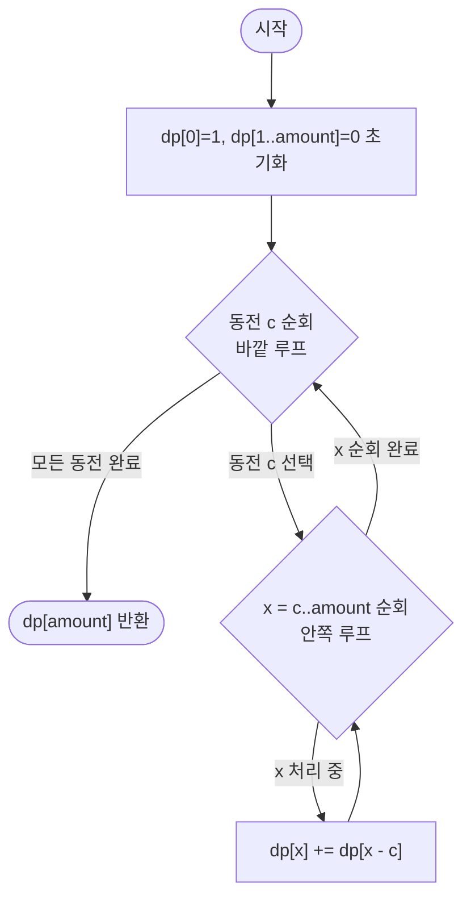

import { AlgorithmSimulation } from "#guide-sim";

# coinChangeWays — 동전을 바깥 루프로 돌리면 순서가 사라지는 이유

## 한눈에 보는 컨셉

동전 종류로 목표 금액을 만드는 **조합의 수**(순서 무관)를 세는 문제예요. 핵심 관찰은 "동전 종류를 바깥 루프, 금액을 안쪽 루프로 고정하면 이미 처리한 동전 위에 새 동전을 얹기만 하는 구조가 되어 `{1,2}`와 `{2,1}`을 저절로 한 번만 센다"는 것입니다. 이 관찰을 1차원 배열 `dp[x]`에 눌러 담으면 naive 재귀의 조합 폭발이 `O(n \cdot amount)`로 줄어듭니다.

## 출발점: 가장 순진한 방법부터

문제를 정확히 잡을게요.

```ts
function coinChangeWays(coins: number[], amount: number): number
```

| 파라미터 | 의미 | 제약 |
|----------|------|------|
| `coins` | 동전 액면가 배열 (무한 공급) | $1 \leq \|coins\| \leq 100$, $1 \leq coins[i] \leq 10^4$ |
| `amount` | 만들어야 할 목표 금액 | $0 \leq amount \leq 10^4$ |
| 반환값 | 순서를 구분하지 않는 조합의 수 | $\geq 0$ |

가장 정직한 방법은 "동전을 몇 개 인덱스까지 봤는지, 그 동전을 몇 번 썼는지"를 그대로 재귀로 열거하는 겁니다.

```ts
function coinChangeWaysNaive(coins: number[], amount: number): number {
  function count(remaining: number, coinIndex: number): number {
    if (remaining === 0) return 1; // 정확히 다 씀
    if (remaining < 0 || coinIndex >= coins.length) return 0;
    let total = 0;
    const c = coins[coinIndex]!;
    for (let k = 0; c * k <= remaining; k++) { // 이 동전을 k번 사용
      total += count(remaining - c * k, coinIndex + 1);
    }
    return total;
  }
  return count(amount, 0);
}
```

동전 인덱스를 절대 되돌아가지 않게 진행시키므로 `{1,2}`와 `{2,1}`을 같은 걸로 세는 건 이 재귀 자체가 이미 해결하고 있어요. 문제는 **속도**입니다. 실제로 `coins=[1,2,5,10,25]`로 재귀 호출 횟수를 세어 보면 이렇습니다.

```text
amount=10 → 호출 169회, 답 11
amount=20 → 호출 888회, 답 40
amount=30 → 호출 2752회, 답 102
amount=40 → 호출 6636회, 답 217
```

답 자체는 완만하게 느는데 호출 수는 훨씬 가파르게 늘어요. 같은 `(remaining, coinIndex)` 상태가 서로 다른 경로에서 반복 등장하기 때문입니다(예: 1을 3번+2를 1번 쓴 경우와 1을 1번+2를 2번 쓴 경우 모두 결국 `coinIndex`가 다음 동전으로 넘어가기 전 여러 `remaining` 값을 거치며 겹칩니다). $amount \leq 10^4$, $n \leq 100$인 실제 입력 규모에서는 이 중복이 감당할 수 없이 커져 시간 초과가 됩니다.

같은 상태를 반복 계산한다는 것 — 이것이 다음 절로 이어지는 단서입니다. 목표는 이 상태들을 표에 한 번씩만 채워 $O(n \cdot amount) = O(100 \times 10^4) = O(10^6)$ 안에 끝내는 것이에요. 현대 CPU가 초당 $10^8$~$10^9$ 연산을 처리하니 이 정도면 충분히 통과합니다.

## 아이디어 자세히 들여다보기

### 동전을 층층이 쌓아 올리기 — 수식과 그림

naive 재귀의 `(remaining, coinIndex)` 상태를 그대로 표로 옮겨 봅시다. 동전을 한 종류씩 "확정"해 나가면서, 지금까지 확정한 동전들만으로 각 금액을 얼마나 만들 수 있는지 층을 쌓듯 기록하는 거예요.

$$dp[i][x] = \text{"동전 } coins[0..i-1] \text{까지만 사용해 금액 } x \text{를 만드는 조합의 수"}$$

$$dp[i][0] = 1 \; (\text{어떤 동전도 안 쓰는 빈 조합}), \qquad dp[0][x] = 0 \; (x > 0, \text{쓸 동전이 없음})$$

$i$번째 동전 $c = coins[i-1]$을 처리하는 전이는 다음과 같습니다.

$$dp[i][x] = dp[i-1][x] + \big(x \geq c \;?\; dp[i][x - c] : 0\big)$$

두 항의 의미를 나눠 보면:
- $dp[i-1][x]$ — 새 동전 $c$를 **아예 쓰지 않는** 경우
- $dp[i][x-c]$ — 새 동전 $c$를 **한 번 더 쓰는** 경우. 여기서 같은 행 $i$를 참조하는 것이 핵심이에요 — "이미 동전 $c$를 몇 번 넣은 상태"에 한 번 더 얹는 것이므로, 무한 사용을 허용하려면 이전 행이 아니라 **지금 채우고 있는 행 자신**을 봐야 합니다.

그림으로 보면 이렇습니다. `coins=[1,2,5]`, `amount=5`일 때 표가 위에서 아래로 채워집니다.

```text
        x=0  1  2  3  4  5
i=0:     1   0  0  0  0  0     (동전 없음)
i=1(c=1):1   1  1  1  1  1     dp[1][x] = dp[0][x] + dp[1][x-1]
i=2(c=2):1   1  2  2  3  3     dp[2][x] = dp[1][x] + dp[2][x-2]
i=3(c=5):1   1  2  2  3  4     dp[3][x] = dp[2][x] + dp[3][x-5]
```

확인 질문 하나 — `dp[2][3]`이 의미하는 게 뭘까요? 동전 `{1,2}`만으로 3을 만드는 조합의 수예요. `1+1+1`과 `1+2`, 두 가지이니 `dp[2][3] = 2`이고, 위 표의 `i=2` 행 `x=3` 칸과 맞아떨어집니다.

**왜 하필 이 정의인가**: 상태에서 `coinIndex`(=여기서는 $i$) 차원을 빼고 그냥 `dp[x]` 하나만 두면 어떻게 될까요? 그러면 "$c$를 넣을 때 이미 처리한 동전이 무엇인지"를 표가 기억하지 못해서, 나중에 나오는 동전을 앞선 동전보다 먼저 쓰는 순서까지 별도로 세어버릴 위험이 있습니다(순열 중복 — 바로 다음 절에서 반례로 확인해요). $i$ 차원을 두어 "동전을 처리하는 순서"를 표 구조 자체에 못박는 것이 이 정의의 핵심이고, 그 대가로 $O(n \cdot amount)$ 메모리를 씁니다. 이 메모리를 줄이는 게 5~7단계의 과제예요.

### 단서를 설명해 주는 이론 — 무한 배낭(Unbounded Knapsack) 패턴

$dp[i][x] = dp[i-1][x] + dp[i][x-c]$처럼 **같은 행을 스스로 참조**하는 전이는 "0/1 배낭"이 아니라 "무한 배낭(unbounded knapsack)"이라 부르는 표준 패턴입니다. 두 패턴의 차이는 딱 하나, 항목(동전)을 몇 번까지 쓸 수 있느냐예요.

- **0/1 배낭**: 항목을 최대 1번만 쓴다. 전이는 $dp[i][x] = dp[i-1][x] + dp[i-1][x-c]$ — 오른쪽 항도 **이전 행**($i-1$)만 봅니다. "아직 $i$번째 항목을 반영하지 않은 상태"에서 딱 한 번만 얹으니까요.
- **무한 배낭**: 항목을 몇 번이든 쓴다. 전이는 $dp[i][x] = dp[i-1][x] + dp[i][x-c]$ — 오른쪽 항이 **현재 행**($i$)입니다. "방금 $c$를 넣은 뒤의 상태"에 또 $c$를 얹을 수 있어야 하니까, 이미 갱신 중인 자기 행을 참조해야 해요.

동전 문제는 동전을 무한히 쓸 수 있으므로 무한 배낭 패턴이고, 집계 연산이 "최댓값"이 아니라 "조합의 수(합)"라는 점만 다릅니다 — 배낭 문제의 뼈대(항목별로 이전/현재 행을 참조해 전이)는 그대로 재사용됩니다.

이 패턴을 기억해 두세요: **"이전 행만 보면 1회 한정, 현재 행을 보면 무한 사용"**이라는 구분이, 5단계에서 표를 압축할 때 "행 하나만 있으면 충분한 이유"를 설명하는 근거로 다시 쓰입니다.

### 왜 모순 없이 작동하는가

**귀납적으로 정당화**해 볼게요. 처리한 동전 개수 $i$에 대한 귀납입니다.

- **기저($i=0$)**: 쓸 수 있는 동전이 없으니 $dp[0][0]=1$(빈 조합), $dp[0][x]=0\;(x>0)$은 정의 그대로 맞습니다.
- **귀납 단계**: $dp[i-1][\cdot]$이 "동전 $coins[0..i-2]$로 각 금액을 만드는 조합 수"를 정확히 담고 있다고 가정합시다. $dp[i][x]$를 채울 때 새 동전 $c=coins[i-1]$을 **정확히 몇 번 쓰느냐**로 모든 조합을 나눌 수 있어요 — 0번, 1번, 2번, … 각각은 서로 겹치지 않고(완전성: 이 나눔이 모든 경우를 빠짐없이 담는가) 빠짐없이(정확성: 각 나눔이 올바른 개수를 세는가) 열거됩니다.

  $$dp[i][x] = \underbrace{dp[i-1][x]}_{c\text{ 0번}} + \underbrace{dp[i-1][x-c]}_{c\text{ 1번}} + \underbrace{dp[i-1][x-2c]}_{c\text{ 2번}} + \cdots$$

  이 무한 합을 재귀식 하나로 접으면 $dp[i][x] = dp[i-1][x] + dp[i][x-c]$가 됩니다 — 오른쪽 두 번째 항 $dp[i][x-c]$를 한 번 더 펼치면 $dp[i-1][x-c] + dp[i][x-2c]$가 되어 위 무한 합과 정확히 같아지기 때문이에요. 즉 재귀식이 "$c$를 0번, 1번, 2번, … 쓰는 모든 경우"를 정확히 한 번씩 담습니다.

- **순서 중복이 없는 이유**: 동전이 $i$ 순서대로만 확정되므로, $dp[i][x]$에 반영된 모든 조합은 "동전을 $coins[0], coins[1], \ldots, coins[i-1]$ 순서로 검토하며 만들어졌다"는 공통 이력을 가집니다. 같은 동전 집합이라도 검토 순서가 다른 두 경로가 따로 생기지 않으니, 순열이 아니라 조합만 세어집니다.

여기서 **헷갈리기 쉬운 포인트**가 하나 있습니다 — "동전을 안쪽 루프로 돌려도 결과가 같지 않을까?"라는 생각이에요. 실제로 확인해 봅시다. `coins=[1,2]`, `amount=3`에서:

```text
올바른 순서(동전 바깥, 금액 안쪽, 오름차순): dp[3] = 2   ({1,1,1}, {1,2})
잘못된 순서(금액 바깥, 동전 안쪽):           dp[3] = 3   ({1,1,1}, {1,2}, {2,1}을 별도로 셈)
```

금액을 바깥 루프로 돌리면 각 금액 $x$를 채울 때마다 **모든 동전을 매번 새로 훑기** 때문에, "동전을 넣는 순서"가 금액이 커짐에 따라 여러 조합으로 갈라져 버립니다. `{1,2}`를 만드는 두 경로(1을 먼저 넣고 2를 넣기 / 2를 먼저 넣고 1을 넣기)가 서로 다른 것으로 세어져 실제 값 2보다 많은 3이 나와요. 동전을 바깥 루프에 고정해야 "동전 처리 순서"가 표 구조에 못박혀 이런 갈라짐이 원천 차단됩니다.

엣지 케이스도 점검해 둘게요.

```text
amount = 0            → dp[i][0]은 모든 i에서 1 (빈 조합), 어떤 전이도 이 값을 건드리지 않음
coins의 모든 값 > amount → x >= c 조건이 항상 거짓 → dp[n][amount] = dp[0][amount] = 0
coins가 빈 배열         → i가 0에서 멈추므로 dp[0][amount]. amount=0이면 1, 아니면 0
```

## 아이디어를 코드로 옮기기

방금 정의한 2차원 표 $dp[i][x]$를 그대로 옮긴 기본 구현입니다.

```ts
function coinChangeWays2D(coins: number[], amount: number): number {
  const n = coins.length;
  // dp[i][x] = coins[0..i-1]만 사용해 금액 x를 만드는 조합 수
  const dp: number[][] = Array.from({ length: n + 1 }, () => new Array(amount + 1).fill(0));
  for (let i = 0; i <= n; i++) dp[i]![0] = 1; // 금액 0은 항상 빈 조합 1가지

  for (let i = 1; i <= n; i++) {
    const c = coins[i - 1]!;
    for (let x = 0; x <= amount; x++) {
      let ways = dp[i - 1]![x]!;               // coins[i-1]을 쓰지 않는 경우
      if (x >= c) ways += dp[i]![x - c]!;       // coins[i-1]을 한 번 더 쓰는 경우
      dp[i]![x] = ways;
    }
  }
  return dp[n]![amount]!;
}
```

가장 실수가 잦은 줄은 `if (x >= c) ways += dp[i]![x - c]!;`입니다. `dp[i - 1]`이 아니라 `dp[i]`를 참조해야 무한 사용이 되는데, 무심코 `dp[i-1][x-c]`로 적으면 조용히 "각 동전을 최대 1번만 쓰는" 0/1 배낭으로 문제가 바뀌어 버립니다. 그 외 결정 지점은 두 가지예요 — `dp[i][0] = 1` 초기화를 **모든 행**에 대해 미리 해 둬야 하고(안 그러면 $x=0$을 만드는 빈 조합이 사라짐), $x$ 루프는 $0$부터 시작해야 $x < c$인 칸도 `dp[i-1][x]` 값을 그대로 이어받습니다.

## 더 빠르게 만들 단서 찾기

$i$번째 행을 채울 때 실제로 참조하는 값을 표시해 봅시다.

```text
        x=0  1  2  3  4  5
i-2:     ?   ?  ?  ?  ?  ?     ← i번째 행을 채우는 동안 단 한 번도 안 읽힘
i-1:     1   1  1  1  1  1     ← dp[i][x]가 dp[i-1][x]를 참조 (같은 열)
i:       1   1  2  2  3  3     ← dp[i][x]가 dp[i][x-c]를 참조 (자기 행, 이미 채운 왼쪽 칸)
```

행 $i$를 채우는 동안 참조하는 건 딱 두 곳뿐이에요 — **바로 위 행**($i-1$, 같은 열)과 **지금 채우고 있는 행 자신**($i$, 왼쪽 칸). $i-2$ 이전 행은 한 번도 다시 열리지 않습니다. 앞서 3.2에서 본 "이전 행만 보면 1회, 현재 행을 보면 무한"이라는 구분을 떠올리면, 우리는 지금 무한 배낭 쪽이라 오른쪽 항이 이미 현재 행을 보고 있고, 왼쪽 항만 이전 행을 봅니다 — 즉 **동시에 두 행만 있으면 충분**하고, 그마저도 "이전 행"이 "다음 계산의 현재 행"으로 그대로 이어받을 수 있다면 한 행으로도 충분해집니다.

## 단서를 최적화로 연결하기

행 두 개를 배열 하나로 합쳐 봅시다. `dp[x]`라는 배열 하나만 두고, 동전 $c$를 처리할 때 **제자리(in-place)로** 갱신하는 겁니다.

```text
Before (2D, 두 행):  dp[i-1] = [1,1,1,1,1,1]  →  dp[i] = [1,1,2,2,3,3]  (c=2)
After  (1D, 한 행):  dp      = [1,1,1,1,1,1]  →  dp      = [1,1,2,2,3,3]  (같은 배열을 덮어씀)
```

이게 안전한 이유는 갱신 순서에 있어요. $x$를 **오름차순**으로 훑으면, `dp[x] += dp[x-c]`를 실행하는 시점에:
- `dp[x]`(갱신 전 값)는 아직 이번 라운드에서 건드리지 않았으니 여전히 "이전 행" 값 $dp[i-1][x]$와 같고,
- `dp[x-c]`는 $x-c < x$라서 **이미 이번 라운드에서 갱신된 뒤**이므로 정확히 $dp[i][x-c]$와 같습니다.

그러니 `dp[x] += dp[x-c]`(오름차순) 한 줄이 2D 전이 $dp[i][x] = dp[i-1][x] + dp[i][x-c]$를 정확히 재현합니다. 불변식으로 정리하면:

> 동전 $c$를 처리하는 루프의 어느 시점이든, 아직 방문하지 않은 열 $x' \geq x$의 `dp[x']`는 "$c$ 처리 전" 값이고, 이미 방문한 열 $x'' < x$의 `dp[x'']`는 "$c$까지 반영된" 값이다.

만약 $x$를 **내림차순**으로 훑으면 `dp[x-c]`가 아직 갱신되지 않은 "이전 행" 값이 되어 $c$를 최대 1번만 쓰는 0/1 배낭이 됩니다(3.2에서 본 구분이 여기서 방향의 문제로 나타나는 거예요). 이렇게 메모리가 $O(n \cdot amount)$에서 $O(amount)$로 줄어듭니다 — 굳이 $n+1$개 행을 다 갖고 있을 필요가 없다는 5단계의 관찰이 정확히 이 절감의 근거입니다.

## 최적화 코드

바뀐 건 2차원 표를 1차원 배열로 접고, 안쪽 루프를 오름차순으로 유지한 것뿐입니다.

```ts
function coinChangeWays(coins: number[], amount: number): number {
  const dp = new Array<number>(amount + 1).fill(0);
  dp[0] = 1; // 빈 조합 1가지
  for (const c of coins) {           // 바깥 루프: 동전 종류 (조합 보장)
    for (let x = c; x <= amount; x++) { // 안쪽 루프: 오름차순 (무한 사용 허용)
      dp[x] = dp[x]! + dp[x - c]!;
    }
  }
  return dp[amount]!;
}
```

**가장 중요한 줄은 두 루프의 순서와 방향입니다.** 동전이 바깥, 금액이 오름차순 안쪽 — 이 둘 중 하나만 바뀌어도 조용히 틀립니다. 실제로 `coins=[1,2]`, `amount=3`을 금액 바깥·동전 안쪽으로 바꿔 돌리면 정답 `2`가 아니라 `3`이 나옵니다(앞서 3.4에서 본 것과 같은 함정입니다). 기억법으로 정리하면:

> 동전 바깥, 금액 안쪽, 오름차순 — "조합이니까 순서 고정, 무한이니까 앞칸을 다시 본다."

여기서 더 빠르게 만들 수 있을까요? 시간 복잡도 $O(n \cdot amount)$는 표의 칸 $dp[x]$ 하나하나가 동전마다 갱신 여부를 검토해야 하는 이 문제의 구조상 줄이기 어렵습니다 — 표의 모든 칸을 최소 한 번씩 채워야 답을 결정할 수 있고, 칸 수 자체가 $\Theta(amount)$, 동전 수가 $\Theta(n)$이니 $\Theta(n \cdot amount)$ 미만으로는 표를 다 채울 수 없어요. 공간도 $O(amount)$로 이미 최소한의 1차원 배열만 쓰고 있습니다. $n=100$, $amount=10^4$ 기준 목표였던 $O(10^6)$ 규모에 정확히 도달했습니다.

한 가지 실무적 주의를 덧붙이자면, 조합의 수는 동전 종류가 늘수록 매우 커질 수 있어요. 실측으로 `coins = [1..100]`, `amount = 10000`을 돌려 보면 결과가 `2.268...e+91`로 `Number.MAX_SAFE_INTEGER`($9007199254740991 \approx 9 \times 10^{15}$)를 훌쩍 넘습니다. 문제가 모듈러 연산을 요구하지 않는다면 이런 큰 입력에서는 `BigInt`로 바꿔야 정확한 값을 보장할 수 있습니다.

더 빠른 특화 해법이 있을까요? 동전 액면가가 특별한 구조(예: 서로 배수 관계)를 가지면 생성함수 기반의 닫힌 형태 공식을 쓸 수 있는 경우가 있지만, 임의의 동전 집합에는 일반적으로 적용되지 않습니다. 이 DP는 동전 구성이 무엇이든 그대로 재사용할 수 있다는 **범용성**이 강점이에요.

## 실행 시각화

예시 `coins = [1, 2, 5]`, `amount = 5`에 대해 1차원 배열 `dp`가 동전을 하나씩 처리하며 누적되는 과정입니다. 각 행은 해당 동전까지 처리한 직후의 `dp[0..5]` 스냅샷이며, 열은 금액 `x = 0..5`입니다. 빨간 셀(`cells`)은 그 동전 처리로 값이 바뀐 칸이에요. 실제 반환값은 `dp[5] = 4`이며, 시뮬레이션 마지막 프레임의 마지막 칸과 일치합니다(조합: `1×5`, `1×3+2`, `1×1+2×2`, `5`).

> 대화형 시뮬레이션은 MDX 런타임에서 표시됩니다.

export const cols = [0, 1, 2, 3, 4, 5];

export const steps = [
  {
    title: "초기화",
    detail: "dp[0]=1 (빈 조합), 나머지는 0.",
    rowLabels: ["init"], colLabels: cols,
    matrix: [[1, 0, 0, 0, 0, 0]],
    entries: [{ label: "처리 동전", value: "없음" }],
  },
  {
    title: "동전 1 처리",
    detail: "x=1..5에서 dp[x] += dp[x-1]. 모든 금액을 1로만 만드는 1가지씩.",
    rowLabels: ["init", "c=1"], colLabels: cols,
    matrix: [
      [1, 0, 0, 0, 0, 0],
      [1, 1, 1, 1, 1, 1],
    ],
    cells: [[1, 1], [1, 2], [1, 3], [1, 4], [1, 5]],
    entries: [{ label: "처리 동전", value: "1" }],
  },
  {
    title: "동전 2 처리",
    detail: "x=2..5에서 dp[x] += dp[x-2]. dp=[1,1,2,2,3,3].",
    rowLabels: ["init", "c=1", "c=2"], colLabels: cols,
    matrix: [
      [1, 0, 0, 0, 0, 0],
      [1, 1, 1, 1, 1, 1],
      [1, 1, 2, 2, 3, 3],
    ],
    cells: [[2, 2], [2, 3], [2, 4], [2, 5]],
    entries: [{ label: "처리 동전", value: "2" }],
  },
  {
    title: "동전 5 처리",
    detail: "x=5에서 dp[5] += dp[0]=1. dp[5]: 3 -> 4.",
    rowLabels: ["init", "c=1", "c=2", "c=5"], colLabels: cols,
    matrix: [
      [1, 0, 0, 0, 0, 0],
      [1, 1, 1, 1, 1, 1],
      [1, 1, 2, 2, 3, 3],
      [1, 1, 2, 2, 3, 4],
    ],
    cells: [[3, 5]],
    entries: [{ label: "처리 동전", value: "5" }],
  },
  {
    title: "완료",
    detail: "모든 동전 처리 완료. dp[5]=4 조합.",
    rowLabels: ["init", "c=1", "c=2", "c=5"], colLabels: cols,
    matrix: [
      [1, 0, 0, 0, 0, 0],
      [1, 1, 1, 1, 1, 1],
      [1, 1, 2, 2, 3, 3],
      [1, 1, 2, 2, 3, 4],
    ],
    cells: [[3, 5]],
    entries: [{ label: "조합 수", value: 4 }],
  },
];

<AlgorithmSimulation view={["matrix", "keyValue"]} steps={steps} title="동전 조합 수 DP" />

## 흐름 한눈에 보기



## 스스로 점검하기

1. `coins=[1,2,3]`, `amount=4`일 때 동전을 `1 → 2 → 3` 순서로 처리하며 `dp` 배열이 어떻게 바뀌는지 직접 채워 보세요. (힌트/정답: `c=1` 처리 후 `[1,1,1,1,1]`, `c=2` 처리 후 `[1,1,2,2,3]`, `c=3` 처리 후 `[1,1,2,3,4]` — 최종 `dp[4] = 4`입니다.)
2. 루프 순서를 "금액 바깥, 동전 안쪽"으로 바꾸면 `coins=[1,2]`, `amount=3`에서 정확히 어느 시점에 무엇이 잘못 더해지는지 추적해 보세요. (본문 3.4의 헷갈리기 쉬운 포인트를 참고하면, 정답 `2` 대신 `3`이 나오는 지점을 짚을 수 있어요.)
3. 만약 각 동전을 **최대 2번까지만** 쓸 수 있다는 제약이 추가되면, 최적화 코드의 어느 부분을 어떻게 바꿔야 할까요? (힌트: 3.2의 "이전 행만 보면 1회 한정"이라는 구분을 떠올려, 안쪽 루프를 몇 번 반복해야 할지, 혹은 사용 횟수를 상태에 어떻게 반영해야 할지 생각해 보세요.)
