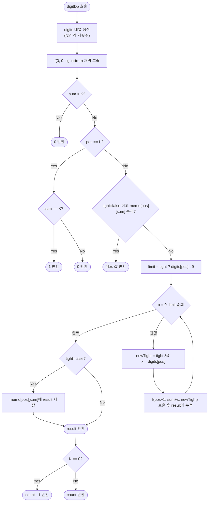

import { AlgorithmSimulation } from "#guide-sim";

# digitDp — tight 플래그 하나로 10^15가지 탐색을 자릿수 곱으로 줄이는 이유

## 한눈에 보는 컨셉

1부터 N까지 하나씩 세는 대신, N을 십진 자릿수로 쪼개 **왼쪽부터 한 자리씩 숫자를 골라 나가는** 방식이에요. 그런데 "지금까지 고른 숫자들이 N의 앞부분과 똑같은지"만 `tight`라는 참/거짓 값 하나로 기억해 두면, 그 뒤 자리들을 자유롭게 골라도 되는지 제한적으로 골라야 하는지가 즉시 결정됩니다. 이 관찰 덕분에 탐색 상태가 `(자리 위치, 누적 합, tight)` 세 값으로 압축되어, 전체 복잡도가 `O(N)`에서 `O(자릿수 × 목표합 × 10)` 수준으로 떨어져요.

## 출발점: 가장 순진한 방법부터

문제를 먼저 정확히 고정할게요.

```ts
function digitDp(N: number, K: number): number
```

| 파라미터 | 의미 | 제약 |
|----------|------|------|
| `N` | 탐색 상한 정수 | $1 \leq N \leq 10^{15}$ |
| `K` | 목표 자릿수 합 | $0 \leq K \leq 135$ |
| 반환값 | $[1, N]$ 범위에서 자릿수 합이 $K$인 수의 개수 | $\geq 0$ |

**엣지케이스**

| 입력 | 기대 출력 | 이유 |
|------|-----------|------|
| `N=9, K=9` | `1` | 1~9 중 자릿수 합이 9인 수는 9 하나 |
| `N=100, K=0` | `0` | $[1,100]$에는 자릿수 합이 0인 수가 없음(0은 범위 밖) |
| `N=999, K=28` | `0` | 세 자리 수의 최대 자릿수 합은 27이라 K=28은 애초에 불가능 |
| `N=10^{15}, K=1` | `16` | $1, 10, 100, \ldots, 10^{15}$ — $10^k$ 꼴 16개 |

"$[1, N]$ 범위에서 조건을 만족하는 수를 세라"는 문장을 보면 손이 먼저 나가는 방법이 있죠 — **그냥 하나씩 세어 보는 것**입니다. 하나씩 순회하며 자릿수 합을 계산해 K와 비교하면 되니, 정의를 그대로 코드로 옮기는 가장 정직한 접근이에요.

```ts
function digitDpNaive(N: number, K: number): number {
  let count = 0;
  for (let x = 1; x <= N; x++) {
    let s = 0;
    let v = x;
    while (v > 0) {
      s += v % 10; // 마지막 자리를 떼어내 더한다
      v = Math.floor(v / 10);
    }
    if (s === K) count++;
  }
  return count;
}
```

작은 입력에서는 멀쩡히 동작합니다. `N=20, K=2`라면 20번만 돌면 되니까요.

```text
naive: x=1부터 N까지 순회하며 자릿수 합을 확인
N=20 이면        20번 반복        →  즉시 끝남
N=10^15 이면     10^15번 반복     →  초당 10^9번 처리해도 약 1,000,000초(≈ 11.6일)
```

문제의 제약은 $N \leq 10^{15}$입니다. naive 방법의 비용은 **N의 자릿수가 아니라 N의 값 자체**에 비례해요 — 즉 입력을 표현하는 데 필요한 정보량(자릿수 15개)이 아니라, 그 정보가 나타내는 수의 크기(10^15)만큼 반복합니다. 이 둘 사이의 간극이 이 문제의 핵심 낌새예요. **"N 자체를 순회하지 않고, N을 자릿수 15개로만 다뤄서 답을 만들 수는 없을까?"**

목표 복잡도를 미리 가늠해 봅시다. $N$의 자릿수는 최대 $L=15$, 목표 합은 최대 $K=135$이니 $K+1=136$가지 값을 가질 수 있어요. 뒤에서 확인하겠지만 이 문제의 상태는 "자리 위치 × 누적 합 × N에 딱 붙어 있는지(2가지)"로 표현되고, 각 상태에서 다음 자리 숫자를 최대 10가지 시도합니다.

$$O(L \times (K+1) \times 2 \times 10) \approx 15 \times 136 \times 2 \times 10 = 40{,}800$$

naive의 $10^{15}$번과 비교하면 자릿수 $L$만으로 통제되는 상수에 가까운 규모예요 — $N$이 아무리 커져도 $L$은 최대 15를 넘지 않으니까요.

## 아이디어 자세히 들여다보기

### 자리마다 숫자를 정하되 "아직 N에 딱 붙어 있는지"를 추적하기 — 수식과 그림

N을 십진 자릿수 배열로 바꾸면 $N = d_0 d_1 \ldots d_{L-1}$처럼 최대 15개의 숫자로 표현됩니다. 이제 답이 될 수를 **왼쪽 자리(최상위)부터 오른쪽으로 한 자리씩** 채워 나간다고 생각해 봅시다.

```text
N = 99  →  digits = [9, 9],  L = 2

만들 수 있는 수를 자리별로 채운다:
  1번째 자리(십의 자리): 0, 1, 2, ..., 9 중 하나
  2번째 자리(일의 자리): 0, 1, 2, ..., 9 중 하나
```

문제는 아무 숫자나 채우면 $N$을 넘는 수까지 만들어진다는 거예요. 예를 들어 십의 자리에 9를 놓고 일의 자리에도 9를 놓으면 99까지만 만들어지지만, 만약 N이 95였다면 "9, 9"는 95를 초과합니다. **지금까지 고른 숫자들이 N의 앞부분과 정확히 같은가**를 알아야, 다음 자리에서 얼마까지 허용되는지 알 수 있습니다.

이걸 하나의 참/거짓 값으로 표현한 게 `tight`예요.

$$\text{tight} = \begin{cases} \text{true} & \text{지금까지 고른 자리 숫자가 전부 } N\text{의 해당 자리와 같다 (아직 상한에 "딱 붙어" 있다)} \\ \text{false} & \text{어느 자리에서든 } N\text{보다 작은 숫자를 이미 골랐다 (이후로는 자유)} \end{cases}$$

`tight=true`인 상태에서는 다음 자리에 $N$의 해당 자리 숫자 $d_{pos}$보다 큰 숫자를 놓을 수 없습니다(놓으면 N을 넘어서니까요). `tight=false`가 된 순간부터는 이미 앞자리에서 N보다 작아졌으니, 남은 자리는 0~9 아무 숫자나 넣어도 여전히 N보다 작습니다.

```text
N = 99, digits = [9, 9]

십의 자리에 9 선택(=digits[0])  →  tight 유지        →  일의 자리는 0~9 중 digits[1]=9까지만
십의 자리에 5 선택(<digits[0])  →  tight 해제(false)  →  일의 자리는 0~9 아무거나(자유)
```

이제 상태를 세 값의 튜플로 정의합니다.

$$f(pos,\; sum,\; tight)$$

- $pos$: 지금 결정하려는 자리 위치 (0이 최상위, $L-1$이 최하위)
- $sum$: $pos$ 이전까지 이미 정한 자리들의 숫자 합
- $tight$: 지금까지 고른 숫자들이 $N$의 해당 자리와 전부 같은지 여부

이 값은 "자리 $pos$부터 끝까지 나머지 숫자를 어떻게 채우든, 최종 자릿수 합이 $K$가 되는 채우는 방법의 수"를 나타냅니다.

**왜 하필 이 세 값이어야 할까요?** 대안으로 "지금까지 만든 접두사 값 자체"를 상태에 넣는 방법도 떠올릴 수 있어요. 하지만 접두사 값은 최대 $10^{15}$가지나 되므로 naive와 다를 게 없습니다. 반면 $sum$은 최대 $135$가지, $tight$는 2가지뿐이고, $pos$는 최대 $15$가지라 상태 전체가 $15 \times 136 \times 2 \approx 4{,}080$가지로 압축돼요. **접두사의 "정확한 값"은 필요 없고, "N을 넘었는가/아직 붙어 있는가"라는 1비트 정보와 "지금까지 합이 얼마인가"만 있으면 이후 전개를 결정하는 데 충분**하다는 게 이 압축의 근거입니다.

확인 질문 하나 — `N=245`, `digits=[2,4,5]`일 때 `pos=1`(십의 자리)에서 `tight=true`로 도착했다면, 이번 자리에서 고를 수 있는 숫자는 몇 가지일까요? 답은 `0~4`, 즉 5가지입니다(`digits[1]=4`까지). `tight=false`로 도착했다면 `0~9` 10가지 전부 가능해요.

### 단서를 설명해 주는 이론 — 상태의 마르코프성(Markov property)

방금 상태를 세 값으로 압축할 수 있었던 근거를 일반 이론의 언어로 정리해 볼게요.

**마르코프성(Markov property)**이란, "미래의 전개가 현재 상태만으로 결정되고, 현재 상태에 이르기까지의 과거 경로는 더 이상 필요하지 않다"는 성질입니다. 상태가 미래를 예측하는 데 필요한 정보를 전부 담고 있으면, 그 상태에 도달한 구체적인 경로(히스토리)는 잊어도 결과가 달라지지 않아요.

이 문제에 대응시키면: `f(pos, sum, tight)`가 정확히 이런 상태예요. 자리 $pos$부터 끝까지 몇 가지 방법으로 채울 수 있는지는 **오직** 지금까지의 합이 $sum$이라는 것과, 지금 $N$에 딱 붙어 있는지(`tight`)만으로 결정됩니다. "십의 자리에 5를 놓아서 합이 5가 됐는지, 3과 2를 놓아서 합이 5가 됐는지"는 이후 전개에 전혀 영향을 주지 않아요 — 오직 "합이 5"라는 사실만 중요합니다.

이 성질이 바로 **메모이제이션이 정당한 이유**예요. 같은 `(pos, sum, tight)`에 서로 다른 경로로 도달하더라도, 그 상태부터의 이후 전개(및 그 결과 개수)는 완전히 동일합니다. 그러니 한 번 계산한 결과를 저장해 뒀다가 재사용해도 안전해요.

한 가지만 미리 기억해 두세요 — `tight=true`인 상태들은 사실 **N을 따라가는 단 하나의 경로**에서만 나타납니다. 이 관찰이 뒤에서(5단계) 최적화의 단서가 됩니다.

### 왜 모순 없이 작동하는가

**귀납적 정당화**로 $f(pos, sum, tight)$가 정확한 값을 낸다는 것을 확인해 봅시다.

**기저(base case)**: $pos = L$, 즉 모든 자리를 다 정했을 때입니다.

$$f(L,\; sum,\; tight) = \begin{cases} 1 & sum = K \\ 0 & sum \neq K \end{cases}$$

더 채울 자리가 없으니, 지금까지의 합이 정확히 $K$인지만 보면 됩니다. 자명하게 옳습니다.

**귀납 단계**: $f(pos+1, \cdot, \cdot)$가 모두 옳다고 가정하고, $f(pos, sum, tight)$가 옳음을 보입니다.

$$f(pos,\; sum,\; tight) = \sum_{x=0}^{\,limit} f\!\left(pos+1,\; sum+x,\; tight \wedge (x = d_{pos})\right), \qquad limit = \begin{cases} d_{pos} & tight=\text{true} \\ 9 & tight=\text{false} \end{cases}$$

- **경우의 완전성**: 자리 $pos$에 놓을 수 있는 숫자는 $0$부터 $limit$까지 전부이며, 그 이상은 애초에 $N$을 넘기므로 후보가 아닙니다. $tight=\text{true}$일 때 $limit=d_{pos}$보다 큰 숫자를 놓으면 그 순간 이미 $N$을 초과하니 셈에서 제외되는 게 맞고, $tight=\text{false}$일 때는 이미 앞자리에서 $N$보다 작아졌으므로 $0$부터 $9$ 전부가 유효한 후보입니다. 나열한 $x$ 밖의 경우는 없습니다.
- **각 경우의 정확성**: 숫자 $x$를 골랐을 때 다음 상태의 tight는 $tight \wedge (x = d_{pos})$입니다. $tight=\text{true}$이고 $x = d_{pos}$면 여전히 N의 해당 자리와 일치하니 tight 유지가 맞고, $x < d_{pos}$면 이 자리에서 이미 N보다 작아졌으니 이후 자유(tight=false)가 맞습니다. 귀납 가정에 의해 $f(pos+1, sum+x, \cdot)$는 "이 선택 이후 나머지를 채우는 정확한 방법의 수"이므로, 이를 모든 $x$에 대해 합하면 "자리 $pos$부터의 방법의 수"가 정확히 나옵니다.

$sum > K$일 때 즉시 0을 반환하는 가지치기도 건전합니다 — 이후 어떤 숫자를 더해도 합은 줄지 않으므로, 이미 $K$를 넘긴 상태는 끝까지 가도 답에 기여할 수 없습니다.

마지막으로 $f(0, 0, \text{true})$는 수 $0$(자릿수 합 $0$)도 세므로, 문제가 요구하는 $[1, N]$에 맞추려면 $K=0$일 때만 1을 빼야 합니다.

$$\text{digitDp}(N, K) = f(0, 0, \text{true}) - [K = 0]$$

**여기서 헷갈리기 쉬운 포인트가 두 가지 있습니다.**

첫째, **tight 전달을 잘못하는 실수**입니다. `newTight = tight && x === digits[pos]`를 쓰지 않고 그냥 `newTight = tight`로 넘기면(즉 자리마다 N과 비교하지 않고 이전 tight를 그대로 물려주면), 실제로 N보다 작아진 뒤에도 계속 N의 자리 상한에 묶여버립니다. `N=990, K=9`로 직접 확인해 보면:

```text
정상 구현:  digitDp(990, 9) = 55
tight를 그대로 물려주는 버그:  같은 함수로 계산 = 10

55 → 10 로 뚝 떨어진다. tight=false가 될 기회를 원천봉쇄해서
     N보다 훨씬 작은 수들(예: 018, 027처럼 실제로는 18, 27)을 세지 못하게 막아버리기 때문이다.
```

둘째, **K=0일 때 0을 빼는 것을 잊는 실수**입니다. `N=100, K=0`에서 정답은 `0`인데, $f(0,0,\text{true})-[K=0]$의 뒤쪽 항을 빼먹으면 수 $0$이 그대로 카운트에 남아 `1`이 반환됩니다.

```text
정상: digitDp(100, 0) = 0
버그(1을 빼지 않음): f(0,0,true) 그대로 반환 = 1   ← 수 0을 [1,100] 범위로 착각해서 셈
```

**엣지 케이스 점검**

```text
N=1, K=1   →  digits=[1]. x=1(tight)만 허용 → f(1,1,true)=1  →  1 반환. 정상.
N=1, K=0   →  f(0,0,true)=1(수 0 포함) - [K=0]=1  →  0 반환. 정상.
N=999, K=28 → 세 자리 최대 합 27 < 28 → sum이 절대 28에 못 미치거나,
              sum>K 가지치기에 걸려 모든 경로가 0 → 0 반환. 정상.
```

## 아이디어를 코드로 옮기기

```ts
function digitDpBasic(N: number, K: number): number {
  const digits = N.toString().split("").map(Number);
  const L = digits.length;
  // memo[pos][sum][tight ? 1 : 0], -1 = 미계산
  const memo: number[][][] = Array.from({ length: L }, () =>
    Array.from({ length: K + 1 }, () => [-1, -1]),
  );

  function f(pos: number, sum: number, tight: boolean): number {
    if (sum > K) return 0;                       // 가지치기: 합이 이미 K를 넘었다
    if (pos === L) return sum === K ? 1 : 0;      // 기저: 모든 자리를 다 정했다

    const key = tight ? 1 : 0;
    const cached = memo[pos]![sum]![key];
    if (cached !== -1) return cached;

    const limit = tight ? digits[pos]! : 9;
    let result = 0;
    for (let x = 0; x <= limit; x++) {
      const newTight = tight && x === digits[pos];
      result += f(pos + 1, sum + x, newTight);
    }

    memo[pos]![sum]![key] = result;
    return result;
  }

  const total = f(0, 0, true);
  return K === 0 ? total - 1 : total; // 수 0 제외
}
```

**가장 중요한 줄은 `const newTight = tight && x === digits[pos];`입니다.** 앞 절에서 본 두 실수 중 첫 번째가 정확히 이 줄에서 갈립니다 — `tight`가 참이면서 `x`가 N의 해당 자리와 같을 때만 tight를 유지하고, 그 외에는 반드시 해제해야 합니다.

그 외 결정 지점들:
- `memo`를 `-1`로 초기화하는 이유는 "아직 계산 안 됨"을 표시하기 위해서예요. 결과가 정말 0인 경우와 구분해야 하므로 `0`이 아니라 `-1`을 씁니다.
- `sum > K` 가지치기는 재귀 진입 **맨 앞**에 있어야 합니다. `pos === L` 검사보다 뒤에 두면 불필요하게 끝까지 내려간 뒤에야 걸러지므로 낭비가 생겨요(정답은 같지만 속도가 손해입니다).
- `x`는 `0`부터 `limit`까지 순서와 상관없이 순회해도 결과는 같습니다(합산이니까요) — 다만 오름차순이 읽기에 자연스러워 그대로 둡니다.

## 더 빠르게 만들 단서 찾기

`memo[pos][sum][tight]`를 채워 나가는 과정을 관찰해 봅시다. `tight=false` 상태는 여러 갈래의 재귀 경로에서 **반복해서** 도달합니다 — 예를 들어 십의 자리에 0을 놓아도, 1을 놓아도, 2를 놓아도 모두 `tight=false`가 되어 이후로는 같은 자유 상태로 합류하니까요. 이 반복 방문이 메모이제이션이 효과를 내는 지점입니다.

그런데 `tight=true` 상태는 어떨까요? `tight=true`로 남으려면 자리마다 정확히 $d_{pos}$를 골라야 합니다. 즉 `tight=true`인 상태 `(pos, sum)`에 도달하는 경로는 **N을 그대로 따라가는 단 하나의 경로**뿐이에요.

```text
digits = [9, 9] (N=99)

tight=false 상태(pos=1, sum=*)  ←  여러 갈래(십의 자리 0,1,...,8)에서 합류  →  재사용 이득 큼
tight=true  상태(pos=1, sum=9)  ←  오직 "십의 자리=9" 한 경로에서만 도달   →  캐싱해도 재사용 0번
```

`tight=true` 상태는 애초에 **한 번만 계산되고 다시 조회될 일이 없습니다.** 캐시에 저장하는 비용(배열 접근, 초기화 공간)은 들지만, 그 캐시를 실제로 재사용하는 순간은 결코 오지 않아요. 앞서 마르코프성 절에서 예고했던 지점이 바로 여기입니다 — 메모이제이션의 이득은 "같은 상태를 여러 번 방문할 때"만 발생하는데, `tight=true` 상태는 애초에 여러 번 방문되지 않습니다.

## 단서를 최적화로 연결하기

`tight=true` 쪽 캐시가 쓸모없다는 걸 알았으니, **`tight=false` 상태만 메모이제이션하도록 줄여 봅시다.** `tight=true`일 때는 캐시를 확인하지도, 저장하지도 않고 곧장 재귀만 수행합니다.

```text
Before: memo[pos][sum][tight]   →  L × (K+1) × 2 칸       (예: 15×136×2 = 4,080)
After : memo[pos][sum]          →  L × (K+1) 칸, tight=false 전용   (예: 15×136 = 2,040)

tight=true 경로는 캐시를 거치지 않고 바로 계산 — 한 번뿐인 방문이라 손해가 없다
```

불변식은 이렇게 바뀝니다: "`memo[pos][sum]`이 채워져 있다면, 그 값은 **`tight=false`로 자리 $pos$에 도달했을 때** 나머지를 채워 합이 $K$가 되는 방법의 수다." `tight=true`로 도달한 경우는 이 불변식의 적용 대상이 아니고, 그때그때 새로 계산합니다.

이 최적화는 **시간 복잡도를 바꾸지 않습니다** — `tight=true` 경로는 최적화 전에도 캐시가 재사용되지 않아 실질적으로 이미 `O(L \times 10)`이었고, 최적화는 이 사실을 인정하고 캐시 오버헤드만 걷어낸 것이기 때문입니다. 대신 **메모리 사용량이 절반**으로 줄고(4,080칸 → 2,040칸), 매 호출마다 불필요한 캐시 조회·저장 분기가 사라집니다.

## 최적화 코드

바뀌는 부분은 메모 테이블 차원과, 캐시 조회·저장을 `tight=false`일 때만 수행하도록 감싸는 조건 두 곳입니다.

```ts
function digitDp(N: number, K: number): number {
  const digits = N.toString().split("").map(Number);
  const L = digits.length;
  // memo[pos][sum]: tight=false 상태 전용, -1 = 미계산
  const memo: number[][] = Array.from({ length: L }, () =>
    new Array(K + 1).fill(-1),
  );

  function f(pos: number, sum: number, tight: boolean): number {
    if (sum > K) return 0;
    if (pos === L) return sum === K ? 1 : 0;

    if (!tight) {
      const cached = memo[pos]![sum]!;
      if (cached !== -1) return cached; // tight=false일 때만 캐시 조회
    }

    const limit = tight ? digits[pos]! : 9;
    let result = 0;
    for (let x = 0; x <= limit; x++) {
      const newTight = tight && x === digits[pos];
      result += f(pos + 1, sum + x, newTight);
    }

    if (!tight) memo[pos]![sum] = result; // tight=false일 때만 캐시 저장
    return result;
  }

  const total = f(0, 0, true);
  return K === 0 ? total - 1 : total;
}
```

**가장 중요한 줄은 두 개의 `if (!tight)` 가드입니다.** 이 가드를 빼고 `tight` 구분 없이 `memo[pos][sum]`을 그대로 읽고 쓰면, 서로 다른 `tight` 조건에서 계산된 값이 뒤섞여 저장됩니다. `N=100, K=2`로 실제 확인해 보면:

```text
정상(tight 구분 O): digitDp(100, 2) = 3        (2, 11, 20)
버그(tight 구분 X): 같은 함수로 계산 = 4        (엉뚱한 값 하나가 더 세어진다)

pos=0에서 tight=true로 계산한 값(limit=digits[0]=1로 제한된 결과)이
캐시에 남아, 나중에 tight=false로 같은 (pos=0,sum=0)에 도달했을 때
limit=9로 다시 계산해야 할 자리에 잘못된 값을 돌려준다.
```

> 기억법: **"묶여 있을 땐(tight) 캐시에 손대지 않는다."** tight=true는 손님이 한 번만 오는 자리라, 캐시장부에 적어 둘 필요가 없습니다.

정리하면, 앞서 출발점에서 세운 시간 복잡도 목표($O(L \times (K+1) \times 2 \times 10) \approx 40{,}800$)는 기본 구현에서 이미 달성돼 있었고, 이번 최적화는 그 시간을 유지한 채 메모리를 `4{,}080`칸에서 `2{,}040`칸으로 절반으로 줄인 것입니다. digit DP 자체로 더 줄일 여지는 크지 않습니다 — 상태 수 `L × K`는 이 기법이 다루는 정보(자리 위치, 누적 합)의 최소 표현이라 더 압축하기 어렵습니다. 참고로 "자릿수 합"만 세는 이 특정 문제는 조합론(계단 함수/생성함수)으로 닫힌 형태 공식을 유도하는 특화 해법도 존재합니다. 그럼에도 digit DP를 배우는 이유는 **범용성**이에요 — "특정 숫자 포함 금지", "인접한 두 자리 합이 짝수" 같은 자릿수 조건이 조금만 복잡해져도 조합론 공식은 매번 다시 유도해야 하지만, digit DP는 상태 정의만 바꿔 같은 틀을 재사용할 수 있습니다.

## 실행 시각화

예시 `N = 99`, `K = 10`에 대해 자릿수 DP `f(pos, sum, tight)`가 위 자리부터 숫자를 채우며 자릿수 합이 10인 수를 세는 과정입니다. `digits = [9, 9]`, `L = 2`이고, matrix 패널은 `tight=false`일 때의 메모 테이블 `memo[pos][sum]`(행 pos=1,0, 열 sum=0..10)이 아래 자리부터 채워지는 모습이며, keyValue 패널은 현재 선택과 누적 count예요. 실제 반환값은 `9`이며(19, 28, 37, 46, 55, 64, 73, 82, 91), 시뮬레이션 마지막 프레임의 count와 일치합니다.

> 대화형 시뮬레이션은 MDX 런타임에서 표시됩니다.

export const cols = [0, 1, 2, 3, 4, 5, 6, 7, 8, 9, 10];
export const empty = [null, null, null, null, null, null, null, null, null, null, null];
export const last = [0, 1, 1, 1, 1, 1, 1, 1, 1, 1, 1];

export const steps = [
  {
    title: "초기화",
    detail: "digits=[9,9], 메모 테이블은 미계산(null). f(0,0,tight=true) 호출 시작.",
    rowLabels: ["pos=1", "pos=0"], colLabels: cols,
    matrix: [empty, empty],
    entries: [
      { label: "호출", value: "f(0, 0, tight)" },
      { label: "count", value: 0 },
    ],
  },
  {
    title: "최하위 자리 memo (pos=1, tight=false)",
    detail: "마지막 자리: x=0..9 중 sum+x=10이 되는 경우의 수. sum=1..10이면 1가지, sum=0이면 0.",
    rowLabels: ["pos=1", "pos=0"], colLabels: cols,
    matrix: [last, empty],
    cells: [[0, 1], [0, 2], [0, 3], [0, 4], [0, 5], [0, 6], [0, 7], [0, 8], [0, 9], [0, 10]],
    entries: [
      { label: "memo[1][sum]", value: "sum>=1 -> 1" },
      { label: "count", value: 0 },
    ],
  },
  {
    title: "tight 경로: 첫 자리 x=9",
    detail: "x=9 (=digits[0]) 선택 시 tight 유지. 두 번째 자리는 0..9 중 sum=9+x'=10 -> x'=1: 91 한 개.",
    rowLabels: ["pos=1", "pos=0"], colLabels: cols,
    matrix: [last, empty],
    entries: [
      { label: "선택", value: "십의자리=9 (tight)" },
      { label: "기여", value: "91 -> +1" },
      { label: "count", value: 1 },
    ],
  },
  {
    title: "tight 해제: 첫 자리 x=1..8",
    detail: "x<9 선택 시 tight=false. 두 번째 자리는 memo[1][10-x] 참조. x=1..8 각각 한 개씩 (19,28,...,82).",
    rowLabels: ["pos=1", "pos=0"], colLabels: cols,
    matrix: [last, empty],
    entries: [
      { label: "선택", value: "십의자리=1..8 (free)" },
      { label: "기여", value: "19,28,37,46,55,64,73,82 -> +8" },
      { label: "count", value: 9 },
    ],
  },
  {
    title: "첫 자리 x=0",
    detail: "십의자리=0이면 한 자리 수. sum=x=10은 불가(x<=9). 기여 없음. 0은 K!=0이라 별도 제외 불필요.",
    rowLabels: ["pos=1", "pos=0"], colLabels: cols,
    matrix: [last, [9, null, null, null, null, null, null, null, null, null, null]],
    cells: [[1, 0]],
    entries: [
      { label: "선택", value: "십의자리=0" },
      { label: "기여", value: "+0" },
      { label: "count", value: 9 },
    ],
  },
  {
    title: "완료",
    detail: "모든 첫 자리 선택 합산. 자릿수 합이 10인 [1,99] 내 수는 9개.",
    rowLabels: ["pos=1", "pos=0"], colLabels: cols,
    matrix: [last, [9, null, null, null, null, null, null, null, null, null, null]],
    entries: [
      { label: "반환값", value: 9 },
    ],
  },
];

<AlgorithmSimulation view={["matrix", "keyValue"]} steps={steps} title="자릿수 DP: N=99, K=10" />

## 흐름 한눈에 보기



## 스스로 점검하기

1. `N=50, K=5`일 때 $[1,50]$ 안에서 자릿수 합이 5인 수를 손으로 나열해 보세요. (힌트: 5, 14, 23, 32, 41, 50 — 총 6개입니다. 십의 자리를 0~5까지 하나씩 고정하고 일의 자리가 얼마여야 하는지 따라가 보면 손으로도 셀 수 있어요.)
2. "왜 모순 없이 작동하는가"에서 본 `tight` 전달 버그(`newTight = tight`로 고정)를 그대로 코드에 넣으면 `digitDp(990, 9)`가 `55`가 아니라 `10`을 반환합니다. 어느 자리, 어떤 선택에서 정상 구현과 갈라지는지 pos별로 손으로 추적해 근거를 대 보세요.
3. 이 문제를 "자릿수 합이 K"가 아니라 "숫자 7이 등장하지 않는 수의 개수"로 바꾸면, 상태 `f(pos, sum, tight)`의 어떤 부분을 바꿔야 할까요? (힌트: `sum`이라는 누적값 자체가 필요 없어질 수도 있습니다 — 대신 각 자리에서 무엇을 가지치기해야 할지 생각해 보세요.)
