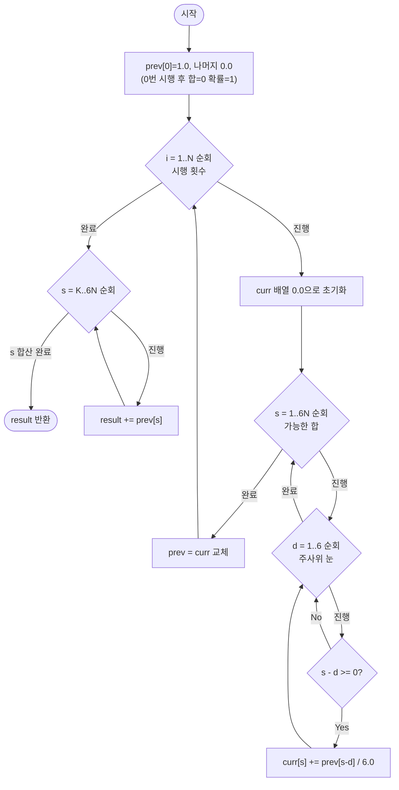

import { AlgorithmSimulation } from "#guide-sim";

# expectedValueDp — 시퀀스를 세지 않고 "합의 확률 분포"만 굴리는 이유

## 한눈에 보는 컨셉

주사위를 $N$번 던졌을 때 눈의 합이 $K$ 이상일 확률을 구하는 문제예요. 가능한 시퀀스를 전부 나열하면 $6^N$가지라 $N$이 커지는 순간 답이 안 나오지만, 사실 우리에게 필요한 건 "합이 얼마일 확률인가"라는 **분포** 하나뿐입니다. 매 시행마다 이 분포를 갱신하면 시행 횟수 $N$과 가능한 합 $6N$의 곱, 즉 `O(N^2)`만에 정확한 확률을 얻을 수 있어요.

## 출발점: 가장 순진한 방법부터

문제부터 정확히 고정할게요.

```ts
function expectedValueDp(N: number, K: number): number
```

| 파라미터 | 의미 | 제약 |
|----------|------|------|
| `N` | 주사위를 던지는 횟수 | $1 \leq N \leq 1000$ |
| `K` | 합이 이 값 이상이어야 하는 임계값 | $0 \leq K \leq 6N$ |
| 반환값 | 눈의 합이 $K$ 이상일 확률 | $[0, 1]$ 범위 실수 |

주사위는 1~6의 눈을 각각 $\frac{1}{6}$ 확률로 냅니다. $N$번의 합은 최소 $N$, 최대 $6N$이라 $K \le N$이면 확률은 무조건 `1.0`, $K > 6N$이면 무조건 `0.0`이에요. 오차는 $10^{-9}$ 이내면 정답으로 봅니다.

"확률을 구하라"는 문제를 보면 가장 정직한 접근은 **가능한 모든 경우를 나열해서 비율을 세는 것**입니다. 주사위를 $N$번 던진 결과는 $(d_1, d_2, \ldots, d_N)$의 시퀀스이고, 이 중 합이 $K$ 이상인 시퀀스의 비율이 곧 확률이에요.

```ts
function expectedValueDpBruteForce(N: number, K: number): number {
  let count = 0;
  const total = 6 ** N;
  function go(i: number, sum: number) {
    if (i === N) {
      if (sum >= K) count++;
      return;
    }
    for (let d = 1; d <= 6; d++) go(i + 1, sum + d); // 이번 시행에서 나올 수 있는 눈 1~6을 전부 시도
  }
  go(0, 0);
  return count / total;
}
```

작은 $N$에서는 잘 작동합니다. 실제로 `expectedValueDpBruteForce(2, 10)`은 `0.166667`(6/36)을 정확히 돌려줘요. 문제는 시퀀스 개수가 얼마나 빨리 불어나느냐입니다.

```text
N =    3  →  6^3   =            216         가지
N =   10  →  6^10  =     60,466,176         가지
N =   20  →  6^20  ≈ 3.66 × 10^15           가지
N = 1000  →  6^1000 ≈ (우주 나이보다 긴 시간) 가지
```

제약은 $N \le 1000$인데 브루트포스는 $N$이 20만 넘어도 이미 감당 불가능한 영역으로 들어갑니다. 목표 복잡도를 역산해 보면, 상태를 "시행 횟수 $\times$ 가능한 합"으로 잡으면 $N \times 6N$가지이고 이걸 각각 `O(6)` 연산으로 채운다면 $O(N \cdot 6N \cdot 6) = O(N^2)$이 됩니다. $N = 1000$이어도 $10^6$대라 1초 안에 충분히 끝나요. **"경우의 수를 세지 말고 확률 자체를 상태로 들고 다니자"**는 것이 이번 문제의 낌새입니다.

## 아이디어 자세히 들여다보기

### 합의 확률 분포로 상태를 압축하기 — 수식과 그림

브루트포스가 낭비하는 지점을 짚어 봅시다. $(1, 2, 3)$과 $(3, 1, 2)$와 $(2, 1, 3)$은 서로 다른 시퀀스지만 합은 똑같이 6이에요. 우리가 최종적으로 원하는 건 "합이 $K$ 이상인가"뿐이므로, **시퀀스의 순서 정보는 버려도 되고 합의 분포만 있으면 충분**합니다.

$i$번 던진 후 합이 $s$일 확률을 $p[i][s]$로 정의할게요.

$$p[i][s] = \text{주사위를 정확히 } i \text{번 던진 후, 합이 정확히 } s \text{일 확률}$$

초기 조건은 "0번 던지면 합은 확실히 0"입니다.

$$p[0][0] = 1, \qquad p[0][s] = 0 \;\; (s > 0)$$

그림으로 보면 $i$가 늘어날 때마다 분포가 옆으로 퍼지는 모양이에요.

```text
i=0:  s=0  ■(1.0)
i=1:  s=1..6에 걸쳐 각 1/6씩 퍼짐    ■ ■ ■ ■ ■ ■
i=2:  s=2..12에 걸쳐 삼각형 모양으로 퍼짐   ▂▃▅▆█▆▅▃▂
```

**왜 최종 합 하나만이 아니라 $(i, s)$ 2차원으로 정의할까요?** "최종 분포"만 저장하면 $i$번째 시행이 $i-1$번째로부터 어떻게 유도됐는지 이어 붙일 다리가 사라집니다. $p[i][s]$가 $p[i-1][\cdot]$만 보고 계산되려면, "몇 번째 시행 결과인지"를 상태에 명시해야 다음 시행을 얹을 수 있어요. 대신 계산 시점에는 바로 전 단계만 있으면 충분하다는 점은 뒤에서 공간을 줄이는 단서로 다시 씁니다.

확인 하나만 해 볼까요? $N=1$일 때 $p[1][4]$는 얼마일까요? 눈이 4가 나올 확률이므로 $\frac{1}{6} \approx 0.1667$입니다 — 문제의 예시 `expectedValueDp(1, 4) = 0.5`는 "4 **이상**"을 묻는 것이라 $p[1][4]+p[1][5]+p[1][6] = 3/6 = 0.5$가 됩니다. $p[1][4]$ 하나와 "합산 결과"를 헷갈리지 않도록 짚고 갈게요.

### 단서를 설명해 주는 이론 — 마르코프 성질과 전체 확률의 법칙

앞 절에서 쓴 "$i-1$번째 상태만 있으면 $i$번째를 계산할 수 있다"는 관찰은 이미 이름이 있는 성질입니다.

**마르코프 성질(Markov property)**: $i$번째 시행의 결과는 $i-1$번째까지의 전체 이력이 아니라 오직 "직전 상태"에만 의존합니다. 이번 문제에서는 $i$번째 주사위 눈이 이전에 어떤 눈들이 나왔는지와 무관하게 항상 $\{1,\ldots,6\}$에서 균등하게 뽑히므로, 전이가 $i-1$번째 분포 하나로 완전히 결정돼요. 전체 시퀀스 이력을 저장할 필요가 사라지는 근거가 바로 이 성질입니다.

**전체 확률의 법칙(Law of Total Probability)**: 사건 $A$의 확률을 서로 배타적인 경우 $B_1, \ldots, B_n$으로 쪼개면 $P(A) = \sum_k P(A \mid B_k) P(B_k)$입니다. $i$번 던진 후 합이 $s$인 사건을, "이번 눈이 $d$였다"는 $6$가지 배타적 경우로 쪼개면

$$p[i][s] = \sum_{d=1}^{6} P(\text{이번 눈} = d) \cdot p[i-1][s-d] = \frac{1}{6}\sum_{d=1}^{6} p[i-1][s-d]$$

가 됩니다. 이 점화식이 다음 절 코드의 심장이니 기억해 두세요 — 나중에 롤링 배열로 공간을 줄일 때도 "$i$번째는 $i-1$번째만 본다"는 이 성질을 다시 소환합니다.

이 문제는 확률 분포를 배열 하나로 표현하는 것 외에 별도 보조 자료구조가 필요 없습니다. 인덱스가 곧 "합"이라 배열 접근만으로 충분해요.

### 왜 모순 없이 작동하는가

귀납으로 정당화해 볼게요.

**기저($i=0$)**: $p[0][0]=1$이고 나머지는 0입니다. "0번 던지면 합은 항상 0"이라는 사실과 정확히 일치하므로 성립합니다.

**귀납 단계**: $p[i-1][\cdot]$이 $i-1$번 던진 후의 정확한 확률 분포라고 가정합시다. $i$번째 시행에서 나올 수 있는 눈은 $d=1,\ldots,6$ 중 **정확히 하나**이고, 이 6가지는 서로 배타적이며 다른 경우가 없습니다(경우의 완전성). 각 경우 $d$에서 최종 합이 $s$가 되려면 $i-1$번째 합이 정확히 $s-d$였어야 하고, 그 확률은 $p[i-1][s-d]$이며 여기에 눈 $d$가 나올 확률 $\frac{1}{6}$을 곱해 더하는 것이 전체 확률의 법칙 그 자체입니다(각 경우의 정확성). 따라서 $p[i][s] = \frac{1}{6}\sum_d p[i-1][s-d]$는 정확합니다.

**불변식**: 임의의 $i$에서 $\sum_{s=0}^{6i} p[i][s] = 1$입니다. $i=0$에서 성립하고, 전이가 확률을 다른 곳으로 새지 않게 그대로 재분배하므로(6가지 경우의 확률 합이 1) 귀납적으로 유지됩니다.

여기서 **헷갈리기 쉬운 포인트**는 `prev`와 `curr`를 분리하지 않고 배열 하나를 제자리에서(in-place) 갱신하는 것입니다. `s`를 오름차순으로 돌면서 `p[s] += p[s-d]/6`처럼 같은 배열을 읽고 쓰면, `s-d < s`인 위치는 **이번 라운드에서 이미 갱신된 값**일 수 있어요. 즉 $i-1$번째 분포가 아니라 $i$번째로 반쯤 갱신된 값을 섞어 쓰는 셈이라 확률이 새어 들어옵니다. 실제로 이렇게 짜면 `expectedValueDp(1, 1)`처럼 무조건 `1.0`이어야 할 값이 `1.521626`으로, `expectedValueDp(2, 10)`이 `0.166667` 대신 `0.873512`로 튀어 오릅니다 — 확률인데 1을 넘어버리는 것부터가 뭔가 새고 있다는 신호예요.

엣지 케이스도 불변식 위에서 점검해 둘게요.

```text
K = 0        → 모든 합은 항상 0 이상 → sum_{s=0}^{6N} p[N][s] = 1.0
K > 6N       → s = K인 항이 배열 범위 밖 → 합산 결과 0.0
s - d < 0    → i-1번째에 그런 합은 없었다 → 기여 0으로 처리(범위 체크로 건너뜀)
N = 1, K = 7 → 한 번 던져 7 이상은 불가능 → 0.0
```

## 아이디어를 코드로 옮기기

점화식을 그대로 옮기면 이렇습니다. 아직 공간은 최적화하지 않고, $p[i][s]$를 2차원 배열 그대로 채워요.

```ts
function expectedValueDpBasic(N: number, K: number): number {
  const maxSum = 6 * N;
  // p[i][s]: i번 던진 후 합이 s일 확률
  const p: number[][] = Array.from({ length: N + 1 }, () => new Array(maxSum + 1).fill(0));
  p[0][0] = 1;

  for (let i = 1; i <= N; i++) {
    for (let s = 1; s <= maxSum; s++) {
      let sum = 0;
      for (let d = 1; d <= 6; d++) {
        if (s - d >= 0) sum += p[i - 1][s - d]; // 반드시 i-1행만 참조
      }
      p[i][s] = sum / 6;
    }
  }

  let result = 0;
  for (let s = K; s <= maxSum; s++) result += p[N][s];
  return result;
}
```

가장 중요한 줄은 `sum += p[i - 1][s - d]`입니다. 인덱스를 `p[i][s - d]`로 잘못 적으면 바로 위 절에서 본 "제자리 갱신" 함정에 그대로 빠져요. 그 외 결정 지점은 세 가지입니다.

- 초기값은 `p[0][0] = 1`뿐이고 나머지는 `fill(0)`으로 이미 0입니다 — 별도 루프가 필요 없어요.
- `s`는 1부터 시작합니다(`s=0`은 이미 초기화에서 처리했고, $i \ge 1$에서 합이 0이 될 방법은 없으므로 자연히 0으로 남습니다).
- `s - d >= 0` 가드가 없으면 음수 인덱스에 접근해 `undefined`를 더하는 사고가 납니다.

## 더 빠르게 만들 단서 찾기

이 코드를 그대로 돌리면 정답은 나오지만, 메모리를 관찰해 봅시다. `p`는 `(N+1) × (6N+1)` 크기 2차원 배열이에요. $N=1000$이면 약 $1001 \times 6001 \approx 6 \times 10^6$개의 `number` 칸을 만드는 셈입니다.

```text
p[0]  [■ □ □ □ □ □ □ □ □ □ □ □ □]   ← i=2 계산에는 안 쓰인다
p[1]  [□ ■ ■ ■ ■ ■ ■ □ □ □ □ □ □]   ← i=2 계산 시점엔 이 행만 필요
p[2]  [□ □ ? ? ? ? ? ? ? ? ? ? ?]   ← 지금 채우는 중

p[3]을 채울 때는 p[1], p[0] 둘 다 이미 필요 없다 — 오직 p[2]만 본다
```

앞 절 마르코프 성질 자체가 이 낭비의 근거이자 해법입니다 — "$i$번째는 $i-1$번째만 본다"는 성질 덕분에, $i-2$ 이하의 모든 행은 계산이 끝나는 순간 완전히 죽은 메모리예요. $N \times 6N$ 칸을 다 들고 있을 이유가 없습니다.

## 단서를 최적화로 연결하기

행을 전부 보관하는 대신, **직전 행(`prev`)과 지금 채우는 행(`curr`) 두 개만 유지**하면 됩니다.

```text
Before (2D 전체 보관):        After (롤링 배열):
p[0], p[1], ..., p[N]         prev (직전), curr (지금)
공간 O(N × 6N) = O(N^2)       공간 O(6N) = O(N)

한 단계 진행:  curr를 새로 채우고 →  prev = curr로 교체 →  이전 prev는 버림
```

불변식은 단순합니다: **매 바깥 루프 $i$가 끝나는 시점에 `prev[s]`는 정확히 $p[i][s]$**를 담고 있어야 해요. 이 약속만 지키면 2차원 배열이 없어도 점화식은 완전히 동일하게 작동합니다.

## 최적화 코드

바뀌는 부분은 2차원 배열을 `prev`/`curr` 두 개의 1차원 배열로 바꾸는 것뿐, 안쪽 점화식은 그대로예요.

```ts
function expectedValueDp(N: number, K: number): number {
  const maxSum = 6 * N;
  let prev = new Array(maxSum + 1).fill(0);
  prev[0] = 1; // i=0: 합이 0일 확률 = 1

  for (let i = 1; i <= N; i++) {
    const curr = new Array(maxSum + 1).fill(0);
    for (let s = 1; s <= maxSum; s++) {
      let sum = 0;
      for (let d = 1; d <= 6; d++) {
        if (s - d >= 0) sum += prev[s - d]; // 반드시 prev(직전 행)만 참조
      }
      curr[s] = sum / 6;
    }
    prev = curr; // 이번 행이 다음 라운드의 "직전 행"이 된다
  }

  let result = 0;
  for (let s = K; s <= maxSum; s++) result += prev[s];
  return result;
}
```

**가장 중요한 줄은 `prev = curr`입니다.** 이 교체를 루프 안쪽(각 `s`를 처리할 때마다)이 아니라 바깥 `i` 루프의 맨 끝에서 딱 한 번 해야 해요. 만약 `curr`를 새로 만들지 않고 `prev`를 직접 고치면, 앞서 본 "제자리 갱신" 버그로 되돌아가 `expectedValueDp(1, 1)`이 `1.521626`처럼 확률 범위를 벗어난 값을 뱉습니다.

> prev는 어제의 분포, curr는 오늘의 분포 — 오늘 칸은 오직 어제 것만 보고 채운다.

여기서 한 단계 더 최적화할 여지가 있을까요? 시간 복잡도는 여전히 바깥 $N$ × 안쪽 $6N$ × 눈 6가지라 $O(N^2)$인데, 이건 애초에 "채워야 하는 확률 값의 개수" 자체가 $\Theta(N \cdot 6N) = \Theta(N^2)$개라는 하한과 일치합니다 — 상태 하나하나가 서로 다른 정보(특정 시행 횟수·특정 합)라 이보다 적게 계산하면 어떤 $p[i][s]$는 아예 구하지 않은 채 넘어가는 셈이라 시간을 더는 줄일 수 없습니다. 공간은 `prev`/`curr` 두 배열, 즉 $O(6N) = O(N)$으로 이미 최소한의 "직전 상태 하나"만 남았어요. 그래서 이 지점에서 최적화를 종료합니다.

참고로 아주 큰 $N$까지 다뤄야 한다면 다항식 곱(생성함수, FFT 기반 컨볼루션)으로 시간을 더 줄이는 특화 기법도 존재합니다. 그럼에도 이 확률 DP를 배우는 이유는 **범용성**이에요 — 주사위가 아니라 눈금이 불균등한 다각형 주사위, 또는 "합이 아니라 곱"처럼 전이 규칙만 바뀌는 문제에도 같은 `prev/curr` 틀을 그대로 재사용할 수 있습니다.

## 실행 시각화

고정 입력 `N = 2`, `K = 10`에 대한 진행 과정입니다. matrix 패널의 행은 시행 횟수 $i=0,1,2$, 열은 가능한 합 $s=0..12$이고, 셀 값은 `p[i][s]`예요. 하이라이트된 셀은 그 단계에서 새로 채워지는(또는 마지막에 합산하는) 위치입니다. 실제 반환값은 `p[2][10] + p[2][11] + p[2][12] = (3+2+1)/36 = 6/36 ≈ 0.1667`이며, 시뮬레이션 마지막 프레임의 값과 일치합니다.

> 대화형 시뮬레이션은 MDX 런타임에서 표시됩니다.

export const cols = [0, 1, 2, 3, 4, 5, 6, 7, 8, 9, 10, 11, 12];

export const z = 0;

export const row0 = [1, z, z, z, z, z, z, z, z, z, z, z, z];

export const row1 = [z, "1/6", "1/6", "1/6", "1/6", "1/6", "1/6", z, z, z, z, z, z];

export const row2 = [z, z, "1/36", "2/36", "3/36", "4/36", "5/36", "6/36", "5/36", "4/36", "3/36", "2/36", "1/36"];

export const steps = [
  {
    title: "초기화 (i=0)",
    detail: "0번 던지면 합은 확실히 0. p[0][0]=1.",
    rowLabels: ["i=0"], colLabels: cols,
    matrix: [row0],
    cells: [[0, 0]],
    entries: [{ label: "분포 합", value: "1.0" }],
  },
  {
    title: "1회 시행 (i=1)",
    detail: "p[1][s] = Σ p[0][s-d]/6. 합 1~6이 각각 1/6.",
    rowLabels: ["i=0", "i=1"], colLabels: cols,
    matrix: [row0, row1],
    cells: [[1, 1], [1, 2], [1, 3], [1, 4], [1, 5], [1, 6]],
    entries: [{ label: "분포 합", value: "6 × 1/6 = 1.0" }],
  },
  {
    title: "2회 시행 (i=2)",
    detail: "p[2][s] = Σ p[1][s-d]/6. 합 2~12이 삼각 분포 (count/36).",
    rowLabels: ["i=0", "i=1", "i=2"], colLabels: cols,
    matrix: [row0, row1, row2],
    cells: [[2, 2], [2, 3], [2, 4], [2, 5], [2, 6], [2, 7], [2, 8], [2, 9], [2, 10], [2, 11], [2, 12]],
    entries: [{ label: "분포 합", value: "36/36 = 1.0" }],
  },
  {
    title: "s >= K=10 합산",
    detail: "p[2][10]+p[2][11]+p[2][12] = (3+2+1)/36.",
    rowLabels: ["i=0", "i=1", "i=2"], colLabels: cols,
    matrix: [row0, row1, row2],
    cells: [[2, 10], [2, 11], [2, 12]],
    entries: [
      { label: "기여 합", value: "6/36" },
      { label: "확률", value: "0.1667" },
    ],
  },
  {
    title: "완료",
    detail: "합이 10 이상일 확률 6/36 ≈ 0.1667 반환.",
    rowLabels: ["i=0", "i=1", "i=2"], colLabels: cols,
    matrix: [row0, row1, row2],
    cells: [[2, 10], [2, 11], [2, 12]],
    entries: [{ label: "반환값", value: "≈ 0.1667" }],
  },
];

<AlgorithmSimulation view={["matrix", "keyValue"]} steps={steps} title="확률 DP: 주사위 2회 합 분포" />

## 흐름 한눈에 보기



## 스스로 점검하기

1. `N=2, K=5`일 때 확률을 손으로 구해 보세요. (힌트: `p[2]`의 삼각 분포에서 $s=5$부터 $12$까지 더하면 $(4+5+6+5+4+3+2+1)/36 = 30/36 = 5/6 \approx 0.8333$입니다.)
2. `prev = curr` 교체를 빼고 `curr`를 계산할 때 실수로 `prev` 대신 방금 만든 `curr`를 참조하도록 바꾸면 어떤 일이 벌어질까요? `N=1, K=1`로 직접 손으로 따라가며, 왜 결과가 `1.0`을 넘어 `1.521626`처럼 튀는지 설명해 보세요.
3. 만약 주사위가 아니라 "1~6이 아닌 1~4의 눈을 가진 4면체 주사위"로 바뀐다면, 점화식과 코드에서 정확히 어떤 상수들을 바꿔야 할까요? (힌트: `maxSum = 6*N`과 `d <= 6`, `/6.0` 세 곳입니다.)
