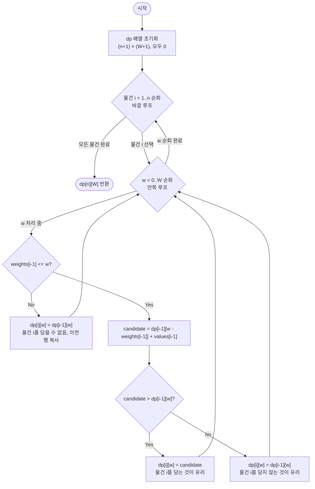

import { AlgorithmSimulation } from "#guide-sim";

# knapsack01 — 0/1 배낭 문제 해설

물건 $n$개를 앞에 두고 "담을까, 말까"를 고민하는 상황을 떠올려 보자. $n$이 100이라면 가능한 조합은 $2^{100} \approx 10^{30}$가지다. 우주의 원자 수보다 많다. 그런데 이 문제에는 숨겨진 구조가 있다. **남은 용량만 같으면, 과거에 어떤 물건을 어떻게 골랐든 앞으로 얻을 수 있는 최선은 동일하다.** 이 한 문장이 $O(2^n)$을 $O(n \cdot W)$로 끊는 유일한 근거다. 이 가이드는 그 구조를 찾아내 솔루션으로 유도하는 전 과정을 생략 없이 보인다.

## 성능 목표 예측

| 제약 | 값 |
|------|-----|
| 물건 수 $n$ | $1 \leq n \leq 100$ |
| 배낭 용량 $W$ | $1 \leq W \leq 10^4$ |
| 물건 무게 $w_i$ | $1 \leq w_i \leq 10^4$ |
| 물건 가치 $v_i$ | $1 \leq v_i \leq 10^4$ |

각 물건을 담거나 담지 않으므로 완전 탐색의 경우의 수는 $2^n$이다. $n = 100$이면 $2^{100} \approx 10^{30}$가지 — 현존하는 어떤 컴퓨터도 열거하지 못한다.

제약을 들여다보면 상태 공간이 보인다. **물건의 인덱스**($n$가지)와 **남은 용량**($W+1$가지)의 조합이 전체 상태다.

$$\text{상태 수} = n \times (W + 1) = 100 \times 10001 \approx 10^6$$

각 상태를 $O(1)$에 처리하면 목표 복잡도는 자연스럽게 나온다.

$$O(n \cdot W) = O(100 \times 10^4) = O(10^6)$$

1초 제한에서 $10^8$~$10^9$ 연산이 가능하므로, $10^6$은 여유 있게 통과한다.

---

## 목표 함수

```ts
function knapsack01(weights: number[], values: number[], W: number): number
```

| 파라미터 | 의미 | 제약 |
|----------|------|------|
| `weights` | 각 물건의 무게 배열 | 길이 $n$, $1 \leq w_i \leq 10^4$ |
| `values` | 각 물건의 가치 배열 | 길이 $n$, $1 \leq v_i \leq 10^4$ |
| `W` | 배낭 최대 용량 | $1 \leq W \leq 10^4$ |
| 반환값 | 얻을 수 있는 최대 가치 | $\geq 0$ |

**엣지케이스**

| 입력 | 기대 출력 | 이유 |
|------|-----------|------|
| `weights=[], values=[], W=100` | `0` | 물건이 없으므로 가치 0 |
| `weights=[5], values=[10], W=3` | `0` | 물건 무게(5)가 용량(3)을 초과 |
| `weights=[1,1,1], values=[1,2,3], W=2` | `5` | 두 번째·세 번째 물건(가치 2+3) 선택 |
| `weights=[1]*100, values=[7]*100, W=10000` | `700` | 최대 입력: 100개 모두 담고 용량 여유 |

---

## 핵심 아이디어

물건을 하나씩 결정할 때 핵심은 **지금 내게 남은 용량**뿐이다. 이전에 어떤 물건을 어떻게 골랐든, 남은 용량이 같다면 앞으로 얻을 수 있는 최대 가치도 같다. 이 독립성이 $O(2^n)$ 지수 탐색을 $O(n \cdot W)$ DP로 끊어내는 유일한 근거다.

### 원형 아이디어와 naive 접근

각 물건에 대해 "담는다" / "담지 않는다"를 선택하는 재귀를 먼저 생각해 보자.

```ts
function knapsack01Naive(weights: number[], values: number[], W: number): number {
  const n = weights.length;

  function solve(i: number, remainW: number): number {
    if (i === n || remainW === 0) return 0;

    const skip = solve(i + 1, remainW);

    const take =
      weights[i]! <= remainW
        ? values[i]! + solve(i + 1, remainW - weights[i]!)
        : 0;

    return Math.max(skip, take);
  }

  return solve(0, W);
}
```

**줄별 설명**

- `const n = weights.length;` — 물건의 총 개수를 `n`에 저장합니다. 재귀 함수 내부에서 종료 조건(`i === n`)을 검사할 때마다 쓰이므로, 배열 길이 조회를 한 번만 수행해 둡니다.
- `function solve(i, remainW)` — 물건 인덱스 `i`부터 `n-1`까지를 검토하고, 현재 배낭에 남은 용량이 `remainW`일 때 얻을 수 있는 최대 가치를 반환하는 내부 재귀 함수입니다. 이 함수를 정의함으로써 큰 문제(`i=0`부터)를 작은 문제(`i+1`부터)로 나눠 풀 수 있습니다.
- `if (i === n || remainW === 0) return 0;` — 기저 조건입니다. 더 이상 검토할 물건이 없거나(`i === n`) 배낭이 이미 가득 찼다면(`remainW === 0`) 추가로 얻을 가치가 없으므로 0을 반환합니다.
- `const skip = solve(i + 1, remainW);` — 물건 `i`를 **담지 않는** 선택입니다. 배낭 용량은 변하지 않고(`remainW` 그대로) 다음 물건(`i + 1`)으로 넘어갑니다.
- `const take = weights[i]! <= remainW ? ... : 0;` — 물건 `i`를 **담는** 선택입니다. 먼저 무게가 남은 용량을 초과하는지 확인합니다. 초과하면 담을 수 없으므로 0입니다. 담을 수 있으면, 이 물건의 가치(`values[i]!`)에 "물건 `i`를 담고 난 뒤 남은 용량(`remainW - weights[i]!`)으로 다음 물건들을 최적화한 결과"를 더합니다.
- `return Math.max(skip, take);` — "담는다"와 "담지 않는다" 두 선택 중 가치가 더 큰 것을 취합니다. 이 한 줄이 0/1 배낭의 핵심 선택 구조입니다.
- `return solve(0, W);` — 물건 0번부터 시작하고, 배낭 용량을 `W` 전체로 두어 탐색을 시작합니다.

이 재귀는 두 가지 문제를 안고 있습니다.

1. **지수 시간**: 선택 트리의 높이가 $n$이고 각 노드에서 분기가 2개이므로 호출 수는 최대 $O(2^n)$입니다.
2. **중복 부분문제**: `solve(3, 50)` 같은 동일한 `(i, remainW)` 쌍이 서로 다른 경로에서 여러 번 호출됩니다.

**다음 단계로 가는 이유**: `(i, remainW)` 쌍은 최대 $n \times (W+1)$가지뿐인데 같은 쌍이 반복 계산됩니다. 이미 계산한 결과를 저장해 두면 $O(2^n) \to O(n \cdot W)$가 됩니다.

### 어떤 관찰이 돌파구가 되는가

- **관찰 1 — 최적 부분구조**: 물건 $i$부터 $n-1$까지만 고려하고 용량이 $w$일 때의 최적값은, 물건 $i+1$부터의 최적값으로 표현됩니다. 큰 문제의 최적해가 작은 문제의 최적해로 구성된다 — DP 적용의 충분조건입니다.

- **관찰 2 — 중복 부분문제**: 상태 `(물건 인덱스 i, 남은 용량 w)`는 $n \times (W+1)$가지뿐입니다. 재귀 트리는 $O(2^n)$이지만 실제로 서로 다른 상태는 $O(n \cdot W)$개뿐입니다. 각 상태를 한 번만 계산하면 됩니다.

- **관찰 3 — 0/1 제약**: 각 물건은 최대 1번만 씁니다. 구현에서 이 제약이 어떻게 반영되는지가 무한 배낭(Unbounded Knapsack)과의 유일한 차이점입니다.

### 관찰을 형식화: 상태/구조 정의

$$dp[i][w] = \text{"물건 } 1 \ldots i \text{까지만 고려하고 배낭 용량이 } w \text{일 때 얻을 수 있는 최대 가치"}$$

초기 조건:

$$dp[0][w] = 0 \quad \forall w \in [0, W]$$

물건을 0개 고려했을 때 가치는 항상 0입니다.

왜 2D 정의여야 하는가? 상태에 "물건 인덱스"가 없으면 "아직 처리하지 않은 물건들과의 상호작용"을 표현할 수 없습니다. 이 2D 정의는 물건 $i$를 포함할지 말지의 두 선택을 이전 행($i-1$)의 값으로 표현할 수 있게 합니다.

### 점화식 또는 핵심 연산

물건 $i$를 고려할 때 두 경우를 분기합니다.

$$dp[i][w] = \begin{cases} dp[i-1][w] & \text{if } w_i > w \\ \max\!\bigl(dp[i-1][w],\; dp[i-1][w - w_i] + v_i\bigr) & \text{otherwise} \end{cases}$$

각 항의 의미:
- $dp[i-1][w]$: 물건 $i$를 **담지 않는** 경우 — 이전 상태 그대로입니다.
- $dp[i-1][w - w_i] + v_i$: 물건 $i$를 **담는** 경우 — 물건 $i$의 무게만큼 용량을 비우고 이전 물건들로 최적화한 결과에 $v_i$를 추가합니다.
- $\max(\cdot)$: 두 선택 중 더 나은 것을 취합니다.

결과: $dp[n][W]$

### 정당성 — 왜 이것이 옳은가

귀납으로 검증합니다.

- **기저**: $dp[0][w] = 0$은 물건이 없으면 가치가 0이므로 자명하게 올바릅니다.
- **귀납 단계**: $dp[i-1][\cdot]$이 물건 $1 \ldots i-1$까지의 최적값이라 가정합시다. 물건 $i$에 대해 "담지 않는다"($dp[i-1][w]$)와 "담는다"($dp[i-1][w - w_i] + v_i$) 두 경우의 최적을 비교하면 $dp[i][w]$가 결정됩니다.

**0/1 제약이 보장되는 이유**: "담는" 경우 참조하는 $dp[i-1][w - w_i]$는 물건 $i$를 포함하지 않은 값이기 때문입니다. 물건 $i$는 딱 한 번만 더해집니다.

### 단계별 코드 진화

코드 진화 사다리: Naive 재귀 $O(2^n)$ → Top-Down Memoization $O(n \cdot W)$ → 2D 바텀업 DP $O(n \cdot W)$.

---

#### 단계 1 — Naive 재귀: $O(2^n)$ 시간

```ts
function knapsack01Naive(weights: number[], values: number[], W: number): number {
  const n = weights.length;
  function solve(i: number, remainW: number): number {
    if (i === n || remainW === 0) return 0;
    const skip = solve(i + 1, remainW);
    const take =
      weights[i]! <= remainW
        ? values[i]! + solve(i + 1, remainW - weights[i]!)
        : 0;
    return Math.max(skip, take);
  }
  return solve(0, W);
}
```

**줄별 설명**

- `const n = weights.length;` — 물건 개수를 변수에 저장합니다. 재귀 종료 조건에서 반복 참조되므로 한 번만 읽어 둡니다.
- `function solve(i, remainW)` — "물건 `i`번부터 끝까지, 남은 용량 `remainW`에서의 최대 가치"를 반환하는 재귀 함수입니다. 이 시그니처가 상태 `(i, remainW)`를 정확히 표현합니다.
- `if (i === n || remainW === 0) return 0;` — **기저 조건**입니다. 물건을 다 검토했거나 용량이 0이면 더 얻을 가치가 없습니다.
- `const skip = solve(i + 1, remainW);` — 물건 `i`를 **건너뛰는** 선택입니다. 용량을 소모하지 않고 다음 인덱스로 넘어갑니다.
- `weights[i]! <= remainW ? ... : 0` — 물건 `i`가 현재 용량에 **들어가는지** 먼저 확인합니다. 들어가지 않으면 담을 수 없으므로 take는 0입니다.
- `values[i]! + solve(i + 1, remainW - weights[i]!)` — 물건 `i`를 **담는** 선택입니다. 이 물건의 가치를 즉시 더하고, 용량을 `weights[i]`만큼 줄여 다음 물건들을 탐색합니다.
- `return Math.max(skip, take);` — "건너뛰기"와 "담기" 중 더 큰 값을 반환합니다. 재귀 트리의 모든 분기점에서 이 판단이 일어납니다.
- `return solve(0, W);` — 물건 0번부터, 배낭 용량 `W` 전부를 쓸 수 있는 상태로 탐색을 시작합니다.

매 호출마다 두 분기, 깊이 최대 $n$ → 호출 수 $\leq 2^n$.

---

#### 단계 2 — Memoized 재귀 (Top-Down DP): $O(n \cdot W)$ 시간

단계 1에서 두 줄만 추가합니다.

```ts
function knapsack01Memo(weights: number[], values: number[], W: number): number {
  const n = weights.length;
  const cache: number[][] = Array.from({ length: n }, () =>
    new Array(W + 1).fill(-1)
  );
  function solve(i: number, remainW: number): number {
    if (i === n || remainW === 0) return 0;
    if (cache[i]![remainW] !== -1) return cache[i]![remainW]!;
    const skip = solve(i + 1, remainW);
    const take =
      weights[i]! <= remainW
        ? values[i]! + solve(i + 1, remainW - weights[i]!)
        : 0;
    cache[i]![remainW] = Math.max(skip, take);
    return cache[i]![remainW]!;
  }
  return solve(0, W);
}
```

**줄별 설명 (단계 1에서 달라진 부분 중심)**

- `const cache: number[][] = Array.from({ length: n }, () => new Array(W + 1).fill(-1));` — $n \times (W+1)$ 크기의 2D 캐시 테이블을 만듭니다. `-1`로 초기화하는 이유는 "아직 계산하지 않음"을 나타내기 위해서입니다. 가치는 0 이상이므로 `-1`은 미계산 상태를 안전하게 표현합니다.
- `if (cache[i]![remainW] !== -1) return cache[i]![remainW]!;` — **메모이제이션의 핵심**입니다. 이 상태 `(i, remainW)`를 이전에 계산한 적이 있다면 저장된 값을 그대로 반환합니다. 재귀 트리에서 이 줄 덕분에 같은 상태를 두 번 이상 계산하지 않습니다.
- `cache[i]![remainW] = Math.max(skip, take);` — 계산 결과를 캐시에 저장합니다. 이후 동일한 `(i, remainW)`로 들어오면 위의 조기 반환이 작동합니다.
- 나머지 줄은 단계 1과 동일합니다.

각 `(i, remainW)` 상태를 정확히 한 번만 계산 → $O(n \cdot W)$.

**다음 단계로 가는 이유**: 재귀 대신 테이블을 순서대로 채우면 콜스택 오버헤드가 사라지고 접근 패턴이 규칙적이 됩니다.

---

#### 단계 3 — 2D 바텀업 DP: $O(n \cdot W)$ 시간, $O(n \cdot W)$ 공간 (현재 구현)

아래가 `knapsack01.ts`의 실제 구현입니다. 이 단계의 트레이스는 아래 시뮬레이션을 참고하세요.

```ts
function knapsack01_dp2(weights: number[], values: number[], W: number): number {
  const dp = Array.from({ length: values.length + 1 }, () =>
    Array.from({ length: W + 1 }, () => 0)
  );

  for (let i = 1; i <= values.length; i++) {
    for (let remainedW = 0; remainedW < W + 1; remainedW++) {
      if (remainedW >= weights[i - 1]!) {
        const value = values[i - 1]!;
        const weight = weights[i - 1]!;
        dp[i]![remainedW] = Math.max(
          dp[i - 1]![remainedW]!,
          dp[i - 1]![remainedW - weight]! + value,
        );
      } else {
        dp[i]![remainedW] = dp[i - 1]![remainedW]!;
      }
    }
  }

  return dp[values.length]![W]!;
}
```

**줄별 설명**

- `const dp = Array.from({ length: values.length + 1 }, () => Array.from({ length: W + 1 }, () => 0));` — $(n+1) \times (W+1)$ 크기의 2D 테이블을 0으로 초기화합니다. 행 인덱스 0은 "물건 0개 고려"를 뜻하는 기저 조건이므로, 행이 $n+1$개 필요합니다. 열 인덱스는 용량 0부터 $W$까지이므로 $W+1$개입니다.
- `for (let i = 1; i <= values.length; i++)` — 외부 루프입니다. 물건을 1번부터 $n$번까지 한 개씩 추가하면서 테이블을 채웁니다. `i`가 DP 테이블의 **행**에 해당합니다. 1부터 시작하는 이유는 행 0이 기저 조건(물건 없음)으로 이미 0으로 채워져 있기 때문입니다.
- `for (let remainedW = 0; remainedW < W + 1; remainedW++)` — 내부 루프입니다. 배낭 용량을 0부터 $W$까지 모든 경우에 대해 값을 채웁니다. 이 루프가 DP 테이블의 **열**을 채웁니다.
- `if (remainedW >= weights[i - 1]!)` — 현재 물건(`i - 1` 번째, 0-indexed)의 무게가 현재 고려 중인 배낭 용량 이하인지 확인합니다. `i - 1`을 쓰는 이유는 `weights` 배열이 0-indexed인데 외부 루프 변수 `i`는 1부터 시작하기 때문입니다. 이 조건이 참이어야 "담는" 선택이 가능합니다.
- `const value = values[i - 1]!;` — 현재 물건의 가치를 꺼냅니다. 마찬가지로 `i - 1`로 0-indexed 배열에 접근합니다. `!`는 TypeScript에게 "이 값은 undefined가 아님"을 알리는 단언(non-null assertion)입니다.
- `const weight = weights[i - 1]!;` — 현재 물건의 무게를 꺼냅니다. 이미 `if` 조건에서 존재를 확인했으므로 undefined가 아님이 보장됩니다.
- `dp[i]![remainedW] = Math.max(dp[i - 1]![remainedW]!, dp[i - 1]![remainedW - weight]! + value);` — **점화식의 핵심**입니다. 두 값 중 큰 것을 선택합니다. `dp[i - 1]![remainedW]!`는 "현재 물건을 담지 않는 경우"(이전 행의 같은 용량), `dp[i - 1]![remainedW - weight]! + value`는 "현재 물건을 담는 경우"(이전 행에서 현재 물건 무게만큼 용량을 뺀 위치의 값에 현재 물건 가치를 더함)입니다.
- `dp[i]![remainedW] = dp[i - 1]![remainedW]!;` — 현재 물건의 무게가 용량을 초과하면 담을 수 없으므로, 이전 행의 값을 그대로 복사합니다. "현재 물건을 포함하지 않을 때"의 최적값이 그대로 유지됩니다.
- `return dp[values.length]![W]!;` — 모든 물건($n$개)을 고려하고 배낭 용량이 $W$일 때의 최대 가치를 반환합니다. `dp[values.length]`는 마지막 행(물건 전체를 고려한 행)이고, `[W]`는 최대 용량 열입니다.

---

### 구현 디테일과 최적화

#### 의존성 범위: 왜 이전 행 하나로 충분한가

$dp[i][w]$를 계산할 때 참조하는 값은 정확히 두 개입니다.

$$dp[i][w] = \max\bigl(\underbrace{dp[i-1][w]}_{\text{담지 않음}},\; \underbrace{dp[i-1][w - w_i]}_{\text{담음}} + v_i\bigr)$$

행 $i$를 계산하는 데 필요한 것은 **행 $i-1$ 전체**뿐이고, $i-2$ 이전 행은 전혀 참조하지 않습니다. 이것이 2D 테이블을 1D 배열로 교체할 수 있는 직접적 근거입니다.

#### 마르코프 속성(Markov Property) — 과거는 잊어도 된다

이 의존성 구조는 **마르코프 속성**과 동형(同形)입니다.

> **마르코프 속성**: 미래 상태($dp[i][\cdot]$)는 현재 상태($dp[i-1][\cdot]$)만으로 결정됩니다. 과거($dp[i-2][\cdot], dp[i-3][\cdot], \ldots$)는 영향을 미치지 않습니다.

직관으로 풀어 쓰면 이렇습니다. "배낭에 어떤 물건을 어떤 순서로 넣었는지는 기억할 필요가 없습니다. 지금 남은 용량과 아직 결정하지 않은 물건들만 알면 앞으로의 최선을 구할 수 있습니다."

이것이 0/1 배낭 DP의 상태를 `(물건 인덱스, 남은 용량)` 단 두 개만으로 정의할 수 있는 이유입니다. 담은 물건 목록 전체를 기억하지 않아도 됩니다 — 남은 용량 하나가 과거 선택의 모든 정보를 요약합니다.

#### 상태 공간 최적화(State Space Optimization) — 차원 압축의 이론

마르코프 속성이 확인되면 **상태 공간 최적화**를 적용할 수 있습니다. DP 테이블에서 더 이상 참조되지 않는 이전 행을 버리고, 현재 계산 중인 행과 직전 행만 유지하는 기법입니다.

0/1 배낭에서는 직전 행 하나만 필요하므로 2D 테이블($O(n \cdot W)$)을 1D 배열($O(W)$)로 압축할 수 있습니다 — 시간 복잡도 $O(n \cdot W)$는 그대로, 공간만 $\frac{1}{n}$으로 줄어듭니다.

이 최적화는 0/1 배낭에만 국한되지 않습니다. LCS(최장 공통 부분수열), 편집 거리(Edit Distance) 등 2D DP 문제에서 점화식의 의존성 범위가 직전 행 하나뿐이면 동일하게 적용할 수 있습니다. **"어느 행에만 의존하는가"를 먼저 분석하는 것이 공간 최적화의 출발점입니다.**

아래는 1D 롤링 배열로 압축한 구현입니다.

```ts
function knapsack01_1D(weights: number[], values: number[], W: number): number {
  const n = weights.length;
  const dp = new Array(W + 1).fill(0);

  for (let i = 0; i < n; i++) {
    for (let w = W; w >= weights[i]!; w--) {
      dp[w] = Math.max(dp[w], dp[w - weights[i]!] + values[i]!);
    }
  }

  return dp[W]!;
}
```

**줄별 설명**

- `const dp = new Array(W + 1).fill(0);` — 길이 $W+1$의 1D 배열을 0으로 초기화합니다. 2D 테이블에서 "이전 행"과 "현재 행"을 단일 배열로 겹쳐 씁니다. 초기 상태는 2D 테이블의 행 0(물건 0개)에 해당합니다.
- `for (let i = 0; i < n; i++)` — 물건을 0번부터 $n-1$번까지 한 개씩 처리합니다. 2D 버전과 달리 배열 인덱스가 0-based이므로 `i`가 바로 물건 배열의 인덱스입니다.
- `for (let w = W; w >= weights[i]!; w--)` — **내림차순 순회**입니다. $W$부터 현재 물건의 무게까지 감소합니다. 이 방향이 0/1 배낭과 무한 배낭을 가르는 핵심입니다(다음 절 참고). 현재 물건 무게보다 작은 용량은 이 물건을 담을 수 없으므로 순회할 필요가 없습니다.
- `dp[w] = Math.max(dp[w], dp[w - weights[i]!] + values[i]!);` — 점화식을 in-place로 적용합니다. `dp[w]`는 "현재 물건을 담지 않는 경우"(갱신 전 값, 2D 테이블의 $dp[i-1][w]$에 해당), `dp[w - weights[i]!] + values[i]!`는 "현재 물건을 담는 경우"(2D 테이블의 $dp[i-1][w - w_i] + v_i$에 해당)입니다. 내림차순 순회 덕분에 `dp[w - weights[i]!]`은 아직 이번 물건 `i`로 갱신되지 않은 상태, 즉 이전 물건까지의 값을 그대로 담고 있습니다.
- `return dp[W]!;` — 모든 물건을 처리한 뒤 배낭 용량 $W$에서의 최대 가치를 반환합니다. 2D 테이블의 `dp[n][W]`와 동일한 값입니다.

#### in-place 갱신: 왜 내림차순인가

1D 배열 `dp`에 행 $i-1$의 값이 들어 있을 때, 행 $i$를 계산해 in-place로 덮어씁니다. 이때 `dp[w - w_i]`를 **읽기 전에** 먼저 덮어씌워지면 안 됩니다. `w - w_i < w`이므로, $w$를 **큰 값에서 작은 값 순서**로 갱신하면 `dp[w - w_i]`는 항상 아직 행 $i-1$ 상태를 유지합니다.

- **내림차순($w = W \downarrow w_i$)**: `dp[w - w_i]`가 행 $i-1$ 값 → 물건 $i$ 1번만 사용 → **0/1 배낭**
- **오름차순($w = w_i \uparrow W$)**: `dp[w - w_i]`가 이미 행 $i$ 값으로 갱신된 상태 → 물건 $i$ 중복 사용 가능 → **무한 배낭(Unbounded Knapsack)**

점화식은 동일하고 순회 방향만 다릅니다. 이것이 두 변형을 가르는 구현상의 유일한 차이입니다.

### 함정과 오해

**함정 1 — 오름차순 순회로 무한 배낭이 되는 경우**

```ts
// ❌ 잘못된 구현 — 오름차순 순회
function knapsack01_Wrong(weights: number[], values: number[], W: number): number {
  const dp = new Array(W + 1).fill(0);
  for (let i = 0; i < weights.length; i++) {
    for (let w = weights[i]!; w <= W; w++) {  // ← 오름차순: 이게 문제
      dp[w] = Math.max(dp[w], dp[w - weights[i]!] + values[i]!);
    }
  }
  return dp[W]!;
}
```

**줄별 설명 (무엇이 잘못됐는가)**

- `for (let w = weights[i]!; w <= W; w++)` — 용량을 **작은 값부터 큰 값으로** 순회합니다. `w = weights[i]`일 때 `dp[w]`를 갱신하면, 나중에 `w = 2 * weights[i]`를 처리할 때 `dp[w - weights[i]]`는 이미 이번 반복에서 갱신된 값입니다. 즉, 같은 물건 `i`를 두 번 담은 결과가 들어 있습니다. 이것이 무한 배낭 동작입니다.

`weights = [2, 3]`, `values = [3, 4]`, `W = 4` 적용 시:

- 물건 0(무게 2, 가치 3) 처리 중 `w=2`에서 `dp[2] = max(0, dp[0]+3) = 3`으로 갱신
- 이어서 `w=4`에서 `dp[4] = max(0, dp[2]+3) = 6` — `dp[2]`가 이미 이번 물건으로 갱신됐으므로 물건 0을 두 번 담은 것과 같습니다.

잘못된 결과: `6`. 정답은 `4`(물건 1 단독 선택, 무게 3, 가치 4).

**함정 2 — `weights[i]` 대신 `weights[i-1]` 접근 오류**

```ts
// ❌ 잘못된 2D 구현 — 인덱스 오류
for (let i = 1; i <= values.length; i++) {
  for (let remainedW = 0; remainedW < W + 1; remainedW++) {
    if (remainedW >= weights[i]!) {       // ← 잘못된 인덱스
      const value = values[i]!;           // ← 잘못된 인덱스
      const weight = weights[i]!;         // ← 잘못된 인덱스
      // ...
    }
  }
}
```

**줄별 설명 (왜 틀렸는가)**

- `weights[i]!` (외부 루프 `i`가 1부터 시작할 때) — `weights` 배열은 0-indexed입니다. `i=1`이면 `weights[1]`은 **두 번째** 물건이고, **첫 번째** 물건(`weights[0]`)을 영원히 건너뜁니다. `i=n`이면 `weights[n]`은 `undefined`이므로 `remainedW >= undefined`는 항상 `false`가 돼 마지막 물건도 무시됩니다. 결과적으로 물건 0을 건너뛰고 물건 $n-1$을 누락합니다.

`weights = [5], values = [42], W = 5` 적용 시:

- `i=1`일 때 `weights[1]`은 `undefined`. `remainedW >= undefined`는 항상 `false` → 물건을 담을 기회가 한 번도 없습니다.

잘못된 결과: `0`. 정답은 `42`.

올바른 코드는 `weights[i - 1]`, `values[i - 1]`처럼 1-indexed 루프 변수에서 1을 빼서 0-indexed 배열에 접근해야 합니다.

---

## 시뮬레이션

> 아래는 **단계 3 (2D 바텀업 DP)** 의 실행 과정입니다. 예시: `weights = [2, 3, 4]`, `values = [3, 4, 5]`, `W = 5`. 각 프레임은 외부 루프(물건 하나)의 한 반복이고, 파란 셀은 해당 물건을 담는 것이 유리해 값이 갱신된 칸입니다. 실제 반환값 `dp[3][5] = 7`이 마지막 프레임의 마지막 칸과 일치합니다.

> 대화형 시뮬레이션은 MDX 런타임에서 표시됩니다.

export const cols = [0, 1, 2, 3, 4, 5];

export const steps = [
  {
    title: "초기화 (물건 0개)",
    detail: "물건을 하나도 고려하지 않으면 모든 용량에서 가치는 0이다.",
    rowLabels: ["0개"], colLabels: cols,
    matrix: [[0, 0, 0, 0, 0, 0]],
    entries: [{ label: "고려 물건", value: "없음" }],
  },
  {
    title: "물건 0 (무게 2, 가치 3)",
    detail: "w>=2인 칸에서 dp[w]=max(0, dp[w-2]+3). w=2..5가 3으로 갱신.",
    rowLabels: ["0개", "물건0"], colLabels: cols,
    matrix: [
      [0, 0, 0, 0, 0, 0],
      [0, 0, 3, 3, 3, 3],
    ],
    cells: [[1, 2], [1, 3], [1, 4], [1, 5]],
    entries: [{ label: "고려 물건", value: "물건0 (w=2,v=3)" }],
  },
  {
    title: "물건 1 (무게 3, 가치 4)",
    detail: "w=3: max(3, dp[0]+4)=4. w=4: max(3, dp[1]+4)=4. w=5: max(3, dp[2]+4)=7.",
    rowLabels: ["0개", "물건0", "물건1"], colLabels: cols,
    matrix: [
      [0, 0, 0, 0, 0, 0],
      [0, 0, 3, 3, 3, 3],
      [0, 0, 3, 4, 4, 7],
    ],
    cells: [[2, 3], [2, 4], [2, 5]],
    entries: [{ label: "고려 물건", value: "물건1 (w=3,v=4)" }],
  },
  {
    title: "물건 2 (무게 4, 가치 5)",
    detail: "w=4: max(4, dp[0]+5)=5. w=5: max(7, dp[1]+5=5)=7 (유지).",
    rowLabels: ["0개", "물건0", "물건1", "물건2"], colLabels: cols,
    matrix: [
      [0, 0, 0, 0, 0, 0],
      [0, 0, 3, 3, 3, 3],
      [0, 0, 3, 4, 4, 7],
      [0, 0, 3, 4, 5, 7],
    ],
    cells: [[3, 4]],
    entries: [{ label: "고려 물건", value: "물건2 (w=4,v=5)" }],
  },
  {
    title: "완료",
    detail: "모든 물건 고려 완료. dp[3][5]=7 (물건0+물건1, 무게 5, 가치 7).",
    rowLabels: ["0개", "물건0", "물건1", "물건2"], colLabels: cols,
    matrix: [
      [0, 0, 0, 0, 0, 0],
      [0, 0, 3, 3, 3, 3],
      [0, 0, 3, 4, 4, 7],
      [0, 0, 3, 4, 5, 7],
    ],
    cells: [[3, 5]],
    entries: [{ label: "최대 가치", value: 7 }],
  },
];

<AlgorithmSimulation view={["matrix", "keyValue"]} steps={steps} title="0/1 배낭 2D DP 표" />

## 수도 코드와 Activity Diagram

> 아래는 **현재 구현(2D 바텀업 DP)** 의 공식화입니다.

### 의사코드

```
function knapsack01(weights, values, W):
    n = weights.length
    dp = (n+1) × (W+1) 크기의 2D 배열, 0으로 초기화
    // 불변식: dp[0][w] = 0 (물건 없음 → 가치 0)

    for i = 1 to n:                             // 외부 루프: 물건을 하나씩 추가
        for w = 0 to W:                         // 내부 루프: 모든 용량 검토
            if weights[i-1] <= w:               // 현재 물건을 담을 수 있는가
                dp[i][w] = max(
                    dp[i-1][w],                 // 담지 않음: 이전 행 그대로
                    dp[i-1][w - weights[i-1]] + values[i-1]  // 담음: 무게 빼고 가치 더함
                )
            else:
                dp[i][w] = dp[i-1][w]           // 담을 수 없음: 이전 행 복사
        // 루프 불변식: dp[i][*]는 물건 0..i-1까지 고려 완료

    return dp[n][W]
```

**줄별 설명**

- `dp = (n+1) × (W+1) 크기의 2D 배열, 0으로 초기화` — 행 0이 기저 조건(물건 없음)이므로 $n+1$개 행이 필요합니다. 열은 용량 0부터 $W$까지 $W+1$개입니다. 0으로 채우는 것이 기저 조건 $dp[0][\cdot] = 0$을 자동으로 설정합니다.
- `for i = 1 to n` — 1-indexed 루프입니다. `i`가 곧 "지금까지 고려한 물건 수"이며 DP 테이블의 행 번호이기도 합니다.
- `if weights[i-1] <= w` — 물건 `i`(0-indexed로는 `i-1`)의 무게가 현재 고려 중인 용량 `w`를 초과하는지 판단합니다. 초과하면 담는 선택 자체가 불가능합니다.
- `dp[i][w] = max(dp[i-1][w], dp[i-1][w - weights[i-1]] + values[i-1])` — 두 선택 중 더 큰 가치를 기록합니다. 첫 번째 항은 "담지 않을 때"(이전 행 동일 열), 두 번째 항은 "담을 때"(이전 행에서 현재 무게를 뺀 열의 값에 현재 가치를 더함)입니다.
- `dp[i][w] = dp[i-1][w]` — 담을 수 없을 때는 이전 행을 그대로 복사합니다. 물건 `i`가 없는 것과 동일한 상태입니다.
- `return dp[n][W]` — $n$개 물건 전부를 고려하고 용량 $W$에서의 최대 가치를 반환합니다.

### Activity Diagram



**핵심 불변식**: 바깥 루프 $i$가 완료된 시점에 $dp[i][w]$는 "물건 $0 \ldots i-1$까지만 고려하고 배낭 용량이 $w$일 때 얻을 수 있는 최대 가치"입니다. 안쪽 루프는 모든 $w$를 독립적으로 채우므로 순서에 무관합니다(2D DP의 장점). 이 독립성이 사라지면 1D 버전에서 내림차순 순회가 필요한 이유이기도 합니다.

---

## 마무리

0/1 배낭 문제는 두 가지 관찰의 산물입니다. 첫째, **최적 부분구조** — 큰 문제의 최적해가 작은 문제의 최적해로 분해됩니다. 둘째, **마르코프 속성** — 미래의 최선은 현재의 남은 용량만으로 결정되고, 과거의 선택 이력은 필요하지 않습니다.

이 두 관찰이 합쳐져 상태 공간 $O(n \cdot W)$와 각 상태 $O(1)$ 전이가 정당화됩니다. 공간을 더 아끼고 싶다면 "의존하는 행이 직전 하나뿐"이라는 사실을 이용해 1D 롤링 배열로 압축할 수 있습니다. 단, 이때 내림차순 순회를 반드시 지켜야 한다는 점을 기억하세요 — 방향 하나가 0/1 배낭과 무한 배낭을 가릅니다.

마르코프 속성이 성립하는지 먼저 확인하는 습관이 DP 공간 최적화의 출발점입니다.

**최종 복잡도**: 시간 $O(n \cdot W)$, 공간 $O(n \cdot W)$ (현재 구현) / $O(W)$ (1D 롤링 최적화 시) — 목표를 달성합니다.
