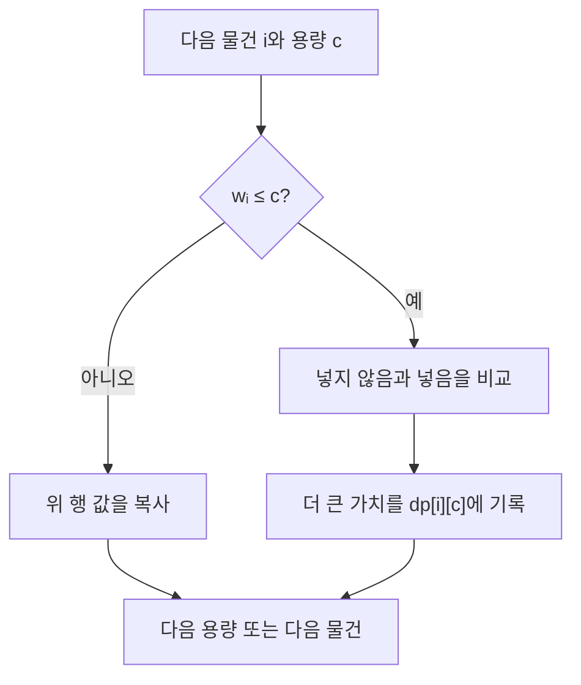

import { AlgorithmSimulation } from "#guide-sim";

# 0/1 배낭 — 남은 용량만 같으면 과거는 잊어도 되는 이유

## 한눈에 보는 컨셉

물건마다 "담을까 말까"를 고르되 같은 물건은 두 번 못 담는 문제예요. 핵심 관찰은 이렇습니다 — 지금까지 몇 번째 물건까지 봤고 배낭에 남은 용량이 얼마인지만 알면, 그 이전에 정확히 *어떤* 물건들을 골랐는지는 몰라도 앞으로의 최선을 계산할 수 있어요. 이 관찰 덕분에 완전탐색 `O(2^n)`이 `O(nW)` 표 채우기로, 다시 `O(W)` 공간의 한 줄짜리 배열로 줄어듭니다.

## 출발점: 가장 순진한 방법부터

먼저 무엇을 풀어야 하는지 함수로 고정할게요.

```ts
function knapsack01(weights: number[], values: number[], W: number): number
```

| 파라미터 | 의미 | 제약 |
|----------|------|------|
| `weights` | 각 물건의 무게 배열 | 길이 $n$, $1 \le n \le 100$, $1 \le w_i \le 10^4$ |
| `values` | 각 물건의 가치 배열 (`weights`와 같은 순서로 대응) | 길이 $n$, $1 \le v_i \le 10^4$ |
| `W` | 배낭 최대 용량 | $1 \le W \le 10^4$ |
| 반환값 | 무게 합이 `W` 이하가 되도록 물건을 골랐을 때 얻을 수 있는 최대 가치 합 | $\ge 0$ |

각 물건은 담거나(1) 안 담거나(0) 둘 중 하나만 고를 수 있어요. 같은 물건을 두 번 담는 건 안 됩니다 — 이름의 "0/1"이 그 뜻입니다.

가치의 **최댓값**을 구하는 문제니까, 가장 정직한 출발은 "가능한 모든 선택을 나열해서 그중 최댓값을 고른다"예요. 물건이 $n$개면 각 물건마다 담음/안담음 두 갈래이므로 전체 조합은 $2^n$가지입니다. 작은 예로 직접 세어 볼게요. 물건 셋 — `A(무게1,가치1)`, `B(무게3,가치4)`, `C(무게4,가치5)` — 이고 `W=5`라고 합시다.

```text
부분집합       무게합   가치합   W=5 이내?
{}              0        0       예
{A}             1        1       예
{B}             3        4       예
{C}             4        5       예
{A,B}           4        5       예
{A,C}           5        6       예  ← 최댓값
{B,C}           7        9       아니오 (초과)
{A,B,C}         8        10      아니오 (초과)

2^3 = 8가지 중 6개만 실현 가능, 그중 최댓값은 {A,C} = 6
```

이 나열을 코드로 그대로 옮기면 이렇습니다.

```ts
function knapsack01Naive(weights: number[], values: number[], W: number): number {
  const n = weights.length;

  function solve(i: number, remainW: number): number {
    if (i === n) return 0; // 더 볼 물건이 없으면 추가로 얻을 가치도 없다

    const skip = solve(i + 1, remainW); // 물건 i를 담지 않는다

    const w = weights[i]!;
    const take = w <= remainW ? values[i]! + solve(i + 1, remainW - w) : -Infinity;
    // w > remainW면 애초에 담을 수 없는 선택이므로 -Infinity로 막아 버린다

    return Math.max(skip, take);
  }

  return solve(0, W);
}
```

작은 예 `weights=[1,3,4], values=[1,4,5], W=5`로 돌리면 위 표와 똑같이 `6`을 반환합니다(뒤에서 실측으로 다시 확인해요).

`n = 100`이면 어떨까요? $2^{100} \approx 1.27 \times 10^{30}$가지입니다. 초당 $10^9$번 계산하는 컴퓨터로도 우주 나이보다 긴 시간이 걸려요. 이 방법은 정확하지만 **쓸 수 없습니다.**

```text
제약에서 목표 복잡도 뽑아내기

  상태의 종류   n × (W+1) ≈ 100 × 10,001 ≈ 10^6 가지
  상태 하나를 O(1) 에 처리할 수 있다면   →   목표 O(nW) ≈ 10^6,  1초 제한에서 여유

  완전탐색이 느린 이유는 상태가 많아서가 아니다.
  solve(i, remainW) 가 같은 (i, remainW) 쌍을 서로 다른 경로에서 몇 번이고 다시 계산한다.
```

이 중복을 없애면 목표에 닿습니다. 그런데 그 전에 **표를 아예 안 그리는 길**이 없는지 먼저 봐야 해요.

### 같은 목표를 노리는 설계가 셋 더 있다 — 전부 그리디이고 전부 진다

지수 폭발을 피하는 가장 싼 길은 **한 번 훑으면서 담을지 말지 그 자리에서 정하는 것**입니다. 무엇을 기준으로 정렬하느냐만 고르면 되고, 셋 다 `O(n log n)`이에요.

```text
가치 큰 순 그리디     비싼 물건부터 담는다.  "제일 비싼 걸 놓치면 손해잖아"
무게 작은 순 그리디   가벼운 물건부터 담는다. "많이 담을수록 좋지 않나"
가성비 큰 순 그리디   v/w 가 큰 물건부터 담는다. "1kg 당 값어치가 기준이지"
```

셋 다 무너집니다. 무게·가치를 1~4, `W`를 1~6으로 두고 **가장 짧은 반례**를 전수 탐색했어요.

| 설계 | 최단 반례 | 그 설계 | 정답 |
| --- | --- | --- | --- |
| 가치 큰 순 | `w=[2,1,1] v=[1,1,1] W=2` | 1 | 2 |
| 무게 작은 순 | `w=[1,1] v=[1,2] W=1` | 1 | 2 |
| 가성비 큰 순 | `w=[2,1] v=[3,2] W=2` | **2** | 3 |

**가성비 그리디의 반례가 물건 두 개짜리라는 것이 요점입니다.** 셋 중 가장 그럴듯한 기준인데도 이렇게 짧은 입력에서 진다는 뜻이에요.

```text
w = [2, 1],  v = [3, 2],  W = 2

가성비:  물건1 = 2/1 = 2.0   물건0 = 3/2 = 1.5      →  물건1 을 먼저 담는다
         물건1 담음(무게1, 남은 용량 1) → 물건0 은 무게 2 라 안 들어감      합 2

정답  :  물건0 하나만 담는다(무게 2, 가치 3)                                합 3
         ↑ 가성비가 낮은 쪽을 담아야 이긴다. 용량을 딱 맞게 쓰는 것이 이기는 자리다
```

**세 그리디의 실패율도 함께 쟀습니다.** 무작위 입력 10만 건을 완전탐색과 대조했어요.

```text
설계                 틀린 횟수          틀렸을 때 평균 손실
점화식 DP             0건 (0.0%)         —
가치 큰 순 그리디       8,883건 (8.9%)     17.3%
무게 작은 순 그리디     36,343건 (36.3%)    27.1%
가성비 큰 순 그리디     12,207건 (12.2%)    12.1%
```

**세 그리디 모두 답을 부풀리는 일은 한 번도 없습니다.** 실제로 담은 물건의 가치 합이라 언제나 정답 이하예요 — 그러니 셋 다 **하한**은 주지만 정답은 아닙니다.

**그런데 가성비 그리디가 왜 그렇게 그럴듯할까요?** 물건을 **쪼갤 수 있으면 실제로 최적이기 때문**입니다. 같은 입력에 쪼갤 자유를 주면 이렇게 갈려요.

| 입력 | 0/1 가성비 그리디 | 0/1 정답 | 분수 배낭(쪼갤 수 있음) |
| --- | --- | --- | --- |
| `w=[1,3,4] v=[1,4,5] W=5` | 5 | 6 | 6.50 |
| `w=[3,2,2] v=[5,3,3] W=4` | 5 | 6 | 6.50 |
| `w=[2,3,4] v=[3,4,5] W=6` | 7 | 8 | 8.25 |

분수 배낭 값이 0/1 정답보다 크거나 같습니다 — 쪼갤 자유가 상한을 올려요. **가성비 그리디는 틀린 알고리즘이 아니라 다른 문제의 정답입니다.** 0/1 제약이 붙는 순간 "조금만 담기"가 불가능해지고, 그 순간 그리디의 근거가 사라집니다.

그래서 **담을지 말지를 그 자리에서 못 정합니다.** 뒤에 무엇이 오는지 봐야 정해지고, 그러려면 "지금까지의 결과"를 들고 다녀야 해요 — 그것이 다음 절의 상태 정의입니다.

## 아이디어 자세히 들여다보기

### 상태를 "남은 용량"으로 요약하기 — 수식과 그림

`solve(i, remainW)`가 반환하는 값에는 이름을 붙일 만합니다. 이 값을 표에 저장해 두겠다는 뜻으로 $dp$라고 씁니다.

$$dp[i][w] = \text{"물건 } 0, 1, \ldots, i-1 \text{까지만 고려했고, 배낭에 남은 용량이 } w \text{일 때 얻을 수 있는 최대 가치"}$$

여기서 "고려했다"는 그 물건을 담았는지 안 담았는지 이미 결정을 마쳤다는 뜻이에요. **어떤** 물건을 골랐는지는 상태에 없고, 오직 **몇 개까지 봤는지**(`i`)와 **얼마나 남았는지**(`w`) 두 숫자만 있습니다.

```text
상태 공간의 크기가 여기서 정해진다

  고른 물건의 조합을 기억한다면        2^n 가지        ← 완전탐색과 같다
  "몇 개까지 봤는지 + 얼마 남았는지"만  (n+1)(W+1) 가지  ← 101 × 10,001 ≈ 10^6
```

잠깐, 확인 하나만 해 볼까요? `weights=[1,3,4], values=[1,4,5]`에서 `dp[2][4]`는 무슨 뜻일까요 — "물건 0, 1(무게 1과 3)까지만 보고 용량 4에서 얻을 수 있는 최선"입니다. 물건 0(가치1)과 물건 1(가치4)을 모두 담으면 무게 4, 가치 5로 딱 맞으니 `dp[2][4] = 5`가 됩니다.

```text
dp[2][4] 가 담고 있는 것과 담고 있지 않은 것

  담고 있다   "물건 0,1 까지만 보고 용량 4 에서 얻을 수 있는 최대 가치" = 5
  안 담는다   그 5 를 만들려고 어떤 물건을 골랐는지
              (여기서는 둘 다 골랐지만, 상태는 그 사실을 기억하지 않는다)

이 "안 담는다"가 상태를 (i, w) 두 숫자로 줄인 값이다 — 기억하지 않기로 한 만큼 작아진다
```

물건 `i`(0-indexed, 무게 $w_i$·가치 $v_i$)를 새로 고려할 때 선택은 두 가지뿐입니다.

$$dp[i][w] = \begin{cases} dp[i-1][w] & w_i > w \quad \text{(담을 수 없음)} \\[4pt] \max\bigl(dp[i-1][w],\;\; dp[i-1][w - w_i] + v_i\bigr) & w_i \le w \quad \text{(담지 않음 vs 담음, 큰 쪽 선택)} \end{cases}$$

같은 예로 표를 채우면 이렇게 나옵니다. `weights=[1,3,4], values=[1,4,5], W=5`. 각 칸이 어떤 판정을 거쳐 그 값이 되는지는 뒤의 트레이스 절에서 값과 함께 따라갑니다.

```text
             w=0  1  2  3  4  5
i=0 (물건없음) 0   0  0  0  0  0
i=1 (무1,가1)  0   1  1  1  1  1
i=2 (무3,가4)  0   1  1  4  5  5
i=3 (무4,가5)  0   1  1  4  5  6   ← dp[3][5] = 6, 답
```

**왜 하필 이 2차원 정의여야 할까요?** 두 가지 대안과 비교해 보면 이유가 뚜렷해집니다.

- **대안 A — 상태를 "남은 용량 `w`"만으로 둔다면?** `dp[w]`만 있으면 "이 용량에서 이미 어떤 물건들을 썼는지"를 표현할 방법이 없습니다. 물건 `i`를 담을지 결정하려면 "물건 `i`를 빼고 나머지로 얻는 최선"이 필요한데, 인덱스 정보가 없으면 방금 담은 물건을 다시 세는 것도 막을 수 없어요(이 문제는 뒤에서 1D 배열로 압축할 때 다시 만납니다 — 그때는 **순회 방향**으로 해결합니다).
- **대안 B — 상태를 "고른 물건들의 부분집합"으로 둔다면?** 정확하지만 부분집합의 가짓수가 $2^n$개라 상태 공간 자체가 완전탐색과 같습니다. 아무것도 줄인 게 없어요.

`(i, w)` 2차원은 "물건 `i`를 넣을지 결정하는 데 필요한 만큼만" 담고 있는, 딱 맞는 크기의 상태입니다.

### 단서를 설명해 주는 이론 — 의존 범위 축소(그리고 마르코프 성질이라는 비유)

위 점화식을 다시 보세요. $dp[i][w]$가 참조하는 항은 정확히 두 개, $dp[i-1][w]$와 $dp[i-1][w-w_i]$뿐입니다. **행 $i-2$, $i-3$, … 이전 행은 단 한 번도 등장하지 않습니다.** 이 사실에 이름을 붙여 두겠습니다.

> **의존 범위(dependency range)**: $dp[i][\cdot]$를 계산하는 데 필요한 전부는 $dp[i-1][\cdot]$ 한 행입니다. 그보다 오래된 행은 계산이 끝나는 즉시 다시 읽히지 않습니다.

이 구조는 확률론에서 말하는 **마르코프 성질**(미래가 현재 상태에만 의존하고 과거 경로와는 무관하다는 성질)과 형태가 닮았습니다. 다만 정확히 짚어야 할 점이 있어요 — 여기 등장하는 $dp[i][\cdot]$는 확률적으로 전이하는 값이 아니라, 정해진 점화식으로 유일하게 결정되는 **결정론적 DP 값**입니다. "마르코프 성질"은 원래 확률과정(다음 상태가 확률분포로 정해지는 계열)을 설명하는 용어이고, 0/1 배낭에는 확률이 전혀 없어요. 그러니 이 문서에서 "마르코프 성질"이라는 말은 **비유**로만 씁니다. 정확한 표현은 이렇습니다.

> **정확한 서술**: $dp[i][w]$는 $dp[i-1][\cdot]$ 전체(행 하나)에만 의존하고, 그보다 앞선 행에는 의존하지 않는다 — 즉 **의존 범위가 직전 행 하나로 국한**된다.

```text
행 i 를 채우는 데 필요한 것

  dp[i-1][w]        같은 용량, 이전 물건까지의 최선     ← 이 물건을 안 담는 경우
  dp[i-1][w - w_i]  줄어든 용량, 이전 물건까지의 최선   ← 이 물건을 담는 경우

  둘 다 행 i-1 에 있다. 행 i-2 이하는 점화식 어디에도 안 나온다
```

왜 이게 중요할까요? 의존 범위가 딱 한 행이라면, 계산이 진행되는 동안 그보다 오래된 행들은 이미 다 쓸모가 없는 죽은 데이터예요. 메모리에 $n+1$개 행을 통째로 들고 있을 필요가 없다는 뜻입니다 — **이전 행 하나만 있으면 다음 행을 채울 수 있습니다.** 이 사실을 기억해 두세요. "더 빠르게 만들 단서 찾기" 절에서 이 관찰을 그대로 다시 소환해 2D 표를 1D 배열로 압축합니다.

### 왜 모순 없이 작동하는가

이 점화식이 항상 옳은 답을 낸다는 것을 귀납으로 확인해 볼게요.

**기저**: $dp[0][w] = 0$ (모든 $w$에 대해). 물건을 하나도 고려하지 않았으면 담은 것이 없고, 담은 것이 없으면 가치 합은 빈 합이라 $0$ 입니다. 용량 $w$ 가 얼마든 이 논증은 달라지지 않으므로 행 전체가 $0$ 입니다.

**귀납 가정**: $dp[i-1][\cdot]$의 모든 칸이 "물건 $0..i-2$까지로 그 용량에서 얻을 수 있는 진짜 최댓값"이라고 가정합니다.

**귀납 단계**: 물건 $i-1$(0-indexed, 위 점화식 표기로는 물건 $i$번째 고려 대상)까지 포함해 용량 $w$에서 최적인 선택을 생각해 보세요. 이 최적해는 물건 $i-1$을 **담거나 담지 않거나** 둘 중 하나입니다 — 그 외의 경우는 없습니다(0/1 제약이 정확히 이 두 가지만 허용하므로 **경우의 완전성**이 보장됩니다).

| 물건 $i-1$ 을 | 남은 문제 | 그 값 | 귀납 가정이 보장하는 것 |
| --- | --- | --- | --- |
| 담지 않는다 | 물건 $0..i-2$ 로 용량 $w$ 채우기 | $dp[i-1][w]$ | 그 값이 진짜 최댓값이다 |
| 담는다 | 물건 $0..i-2$ 로 용량 $w - w_{i-1}$ 채우기 | $dp[i-1][w-w_{i-1}] + v_{i-1}$ | 같음. 거기에 $v_{i-1}$ 은 무조건 얻는다 |

두 경우가 전부이고 각각의 값이 정확하므로, 둘 중 큰 값이 $dp[i][w]$의 진짜 최댓값입니다. 결론을 다시 말하는 게 아니라, "이 두 갈래 말고 다른 경우는 없다"와 "각 갈래의 값이 정확히 그 갈래의 최적값이다"를 둘 다 확인했다는 점이 이 증명의 핵심입니다.

여기서 **헷갈리기 쉬운 포인트**가 둘 있습니다.

- **인덱스 오프셋을 놓치는 것입니다.** $dp$ 표의 행 번호 `i`(1부터 시작)와 배열의 0-indexed 인덱스는 하나 어긋나 있어요 — 행 `i`가 다루는 물건은 `weights[i-1]`, `values[i-1]`입니다. 이걸 헷갈려 `weights[i]`로 접근하면 어떻게 되는지 실제 수치로 보겠습니다. `weights=[5], values=[42], W=5`(물건 1개)일 때, 올바른 구현은 `dp[1][5] = 42`를 거쳐 `42`를 반환해야 합니다. 그런데 루프에서 `weights[i]`(1-indexed 그대로) 를 읽으면 `i=1`일 때 `weights[1]`은 배열 밖이라 `undefined`이고, "담을 수 있는가" 검사가 항상 거짓이 되어 물건을 한 번도 담지 못합니다. 그 결과 `dp[1][5]`가 `dp[0][5]`를 그대로 복사한 `0`으로 남고, 최종 반환값도 `0`입니다(뒤에서 이 값을 실측으로 재현합니다). 정답 `42`와 완전히 다릅니다.

  ```text
  올바름: dp[1][5] = max(dp[0][5], dp[0][0] + 42) = max(0, 42) = 42
  버그(weights[i] 사용): weights[1]이 undefined → "담을 수 있음" 조건이 항상 거짓
            → dp[1][5] = dp[0][5] = 0   ✗  (정답 42를 완전히 놓침)
  ```

- **의존 범위가 "직전 행 하나"라는 사실을 너무 성급하게 "그럼 배열 하나로 덮어써도 되겠네"로 옮기는 것입니다.** 맞는 결론이지만, 덮어쓰는 **순서**를 아무렇게나 정하면 틀립니다. 왜 그런지, 그리고 올바른 순서가 무엇인지는 뒤의 최적화 절에서 정확히 짚습니다 — 지금은 "행을 하나로 합칠 수 있다"는 결론만 옳고, "어떻게 합치느냐"는 아직 정해지지 않았다는 점만 기억해 두세요.

엣지 케이스에서도 정의가 무너지지 않는지 확인해 볼게요.

```text
물건이 0개(weights=[], values=[])         → dp[0][w] = 0 그대로 반환. 담을 물건이 없으니 0은 당연.
W = 0                                     → w_i ≥ 1이므로 어떤 물건도 "담을 수 있음" 조건을 만족 못 함
                                             → dp[i][0] = dp[i-1][0] = ... = dp[0][0] = 0
모든 물건의 무게가 W 초과                   → 모든 i에서 "담을 수 없음" 분기만 타서 dp[n][W] = dp[0][W] = 0
물건이 1개이고 무게가 정확히 W              → dp[1][W] = max(dp[0][W], dp[0][0] + v) = v (그 물건 가치 그대로)
```

## 아이디어를 코드로 옮기기

방금 정의한 점화식을 그대로 이중 반복문으로 옮깁니다.

```ts
function knapsack01_2D(weights: number[], values: number[], W: number): number {
  const n = weights.length;
  const dp: number[][] = Array.from({ length: n + 1 }, () => new Array(W + 1).fill(0));

  for (let i = 1; i <= n; i++) {                                    // ① 반영할 물건이 남았는가
    const w_i = weights[i - 1]!;
    const v_i = values[i - 1]!;
    for (let w = 0; w <= W; w++) {                                  // ② 볼 용량이 남았는가
      if (w >= w_i) {                                               // ③ 이 용량에 들어간다
        dp[i]![w] = Math.max(dp[i - 1]![w]!, dp[i - 1]![w - w_i]! + v_i);
      } else {                                                      // ④ 안 들어간다 — 위 행 복사
        dp[i]![w] = dp[i - 1]![w]!;
      }
    }
  }

  return dp[n]![W]!;
}
```

**가장 실수가 잦은 줄은 `const w_i = weights[i - 1]!;`와 `const v_i = values[i - 1]!;`입니다.** 바깥 루프 `i`는 "몇 번째 행을 채우는가"를 나타내는 1-indexed 값이고, 배열은 0-indexed이므로 반드시 `i - 1`로 접근해야 합니다.

이 절은 코드를 **정적으로** 읽습니다. 실제로 표가 어떻게 채워지는지는 다음 절이 끝까지 보여 줄게요.

```text
초기값        dp 를 (n+1) × (W+1) 로 만들고 0 으로 채운다.
              행 0 이 "물건을 하나도 안 본" 기저 조건을 그대로 표현한다

② 의 범위     w = 0 부터 W 까지 전부 돈다. 2D 에서는 각 칸이 "바로 위 행"만 참조하므로
              같은 행 안에서 어느 방향으로 순회해도 결과가 같다
              (이 성질이 1D 로 압축하면 사라진다 — 최적화 절의 전부가 그 이야기다)

③ 이 가드다   w >= w_i 를 먼저 보고 아니면 ④ 로 빠진다.
              이 가드가 없으면 dp[i-1][w - w_i] 에서 음수 인덱스를 읽는다
```

## 코드를 한 번 끝까지 굴려 보기

고정 입력 `weights = [1, 3, 4]`, `values = [1, 4, 5]`, `W = 5`에 위 2D 구현을 넣고 표를 끝까지 채워 봅니다. 아래 `실행 시각화` 절의 시뮬레이션과 **같은 입력**이에요.

**T1 — 초기화.** ①에 들어가기 전, 기저 행이 이미 서 있습니다.

```text
T1   dp[0] = [0, 0, 0, 0, 0, 0]      물건을 하나도 안 봤으니 어떤 용량에서도 0
```

**T2 — `i = 1`(무게 1, 가치 1)의 ④ 구간.** 용량 0 한 칸만 물건이 안 들어갑니다.

```text
T2   ① 1 <= 3 참 → 진입
     ④ w=0:  0 >= 1 거짓 → 위 행 복사 0
```

**T3 — 같은 행의 ③ 구간.** 나머지 다섯 칸은 전부 담는 쪽이 이깁니다.

```text
T3   ③ w=1:  1 >= 1 참 → max(안 담음 0, 담음 dp[0][0]=0 +1 = 1) = 1   담는 쪽
     ③ w=2:  2 >= 1 참 → max(안 담음 0, 담음 dp[0][1]=0 +1 = 1) = 1   담는 쪽
     ③ w=3:  3 >= 1 참 → max(0, dp[0][2]=0 +1) = 1                    담는 쪽
     ③ w=4:  4 >= 1 참 → max(0, dp[0][3]=0 +1) = 1                    담는 쪽
     ③ w=5:  5 >= 1 참 → max(0, dp[0][4]=0 +1) = 1                    담는 쪽
     ② 6 <= 5 거짓 → 안쪽 루프 탈출.   행 = [0, 1, 1, 1, 1, 1]
```

**T4 — `i = 2`(무게 3, 가치 4)의 ④ 구간.** 이번에는 세 칸이 막힙니다.

```text
T4   ④ w=0:  0 >= 3 거짓 → 위 행 복사 0
     ④ w=1:  1 >= 3 거짓 → 위 행 복사 1
     ④ w=2:  2 >= 3 거짓 → 위 행 복사 1
        ↑ 물건 1 은 무게 3 이라 용량 2 이하에는 못 들어간다. 앞 행 값이 그대로 산다
```

**T5 — 같은 행의 ③ 구간.** 세 칸 전부 담는 쪽이 이기고, 값이 크게 뜁니다.

```text
T5   ③ w=3:  3 >= 3 참 → max(안 담음 1, 담음 dp[1][0]=0 +4 = 4) = 4   담는 쪽
     ③ w=4:  4 >= 3 참 → max(안 담음 1, 담음 dp[1][1]=1 +4 = 5) = 5   담는 쪽
     ③ w=5:  5 >= 3 참 → max(안 담음 1, 담음 dp[1][2]=1 +4 = 5) = 5   담는 쪽
     행 = [0, 1, 1, 4, 5, 5]
```

`w=4`에서 `dp[1][1]=1`을 읽는 것이 **"물건 0 을 이미 담은 상태"** 를 물려받는 자리예요. 어떤 물건이었는지는 안 보고 값만 가져오는데, 그래도 되는 근거가 앞 절의 상태 정의입니다.

**T6 — `i = 3`(무게 4, 가치 5)의 ④ 구간.** 네 칸이 막히고, 그중 `w=3`은 앞 행의 `4`를 그대로 지킵니다.

```text
T6   ④ w=0:  0 >= 4 거짓 → 위 행 복사 0
     ④ w=1:  1 >= 4 거짓 → 위 행 복사 1
     ④ w=2:  2 >= 4 거짓 → 위 행 복사 1
     ④ w=3:  3 >= 4 거짓 → 위 행 복사 4    ← 물건 1 로 얻은 4 가 여기서 보존된다
```

**T7 — 같은 행의 ③ 구간. 마지막 두 칸에서 답이 갈립니다.**

```text
T7   ③ w=4:  4 >= 4 참 → max(안 담음 5, 담음 dp[2][0]=0 +5 = 5) = 5   동률
                                                                       ↑ 어느 쪽을 골라도 5
     ③ w=5:  5 >= 4 참 → max(안 담음 5, 담음 dp[2][1]=1 +5 = 6) = 6   담는 쪽
     행 = [0, 1, 1, 4, 5, 6]
```

**T8 — ① 거짓, 반환.**

```text
T8   ① 4 <= 3 거짓 → 바깥 루프 탈출
     반환 dp[3][5] = 6

     검산  물건 0(무1,가1) + 물건 2(무4,가5) = 무게 5, 가치 6   용량 5 에 딱 맞는다  ✓
           물건 1 + 물건 2 = 무게 7 > 5 이므로 불가
```

네 자리 ①②③④를 참·거짓 양쪽으로 모두 밟았습니다 — ①은 T2~T7에서 참이고 T8에서 거짓, ②는 각 행 안에서 여섯 번 참이고 행 끝마다 거짓, ③은 T3·T5·T7에서, ④는 T2·T4·T6에서 실행됐어요. 반환값 `6`은 아래 시뮬레이션의 마지막 프레임 우하단 칸과 같습니다.

## 더 빠르게 만들 단서 찾기

트레이스의 여섯 구간(**T2~T7**)에서 각 행이 **어느 행을 읽었는지**만 뽑아 봅시다.

```text
        읽은 것                          이 시점에 죽은 행
T2·T3   dp[0] (기저 행)                   —
T4·T5   dp[1]                            dp[0]
T6·T7   dp[2]                            dp[0] · dp[1]
        ↑ 어느 구간도 "바로 위 행" 말고는 안 읽는다
```

**T7이 `dp[2][1]`을 읽을 때 `dp[0]`과 `dp[1]`은 이미 죽었습니다.** 그런데 2D 구현은 그 죽은 행들을 끝까지 메모리에 들고 있어요.

```text
n = 100, W = 10^4 일 때

  표 전체       101 × 10,001 ≈ 10^6 칸   값 하나 8바이트로 잡아도 약 8MB
  살아 있는 것   행 두 개                 약 160KB
```

앞서 "단서를 설명해 주는 이론" 절에서 기억해 두자고 한 사실이 여기서 쓰입니다 — **의존 범위가 직전 행 하나**이므로 두 번째 행을 채우고 나면 그보다 오래된 행은 영원히 참조되지 않습니다. 256MB 제한 안에는 들어가지만, 들고 있을 이유가 없는 것을 들고 있는 것이 낭비 지점이에요.

## 단서를 최적화로 연결하기

행을 통째로 유지하지 말고, **길이 `W+1`짜리 배열 하나**에 "현재 알고 있는 최선"을 계속 덮어쓰면 어떨까요?

```text
Before (2D, 행마다 새 배열):
  dp[0] = [0,0,0,0,0,0]
  dp[1] = [0,1,1,1,1,1]     ← 물건 0 반영, 새 배열
  dp[2] = [0,1,1,4,5,5]     ← 물건 1 반영, 또 새 배열
  dp[3] = [0,1,1,4,5,6]     ← 물건 2 반영, 또 새 배열   (행 4개, 총 24칸)

After (1D, 배열 하나를 계속 덮어쓰기):
  dp = [0,0,0,0,0,0]
  dp = [0,1,1,1,1,1]   ← 물건 0 반영, 같은 배열을 덮어씀
  dp = [0,1,1,4,5,5]   ← 물건 1 반영, 또 같은 배열을 덮어씀
  dp = [0,1,1,4,5,6]   ← 물건 2 반영, 또 같은 배열을 덮어씀   (배열 1개, 6칸)
```

문제는 "덮어쓰는 순서"입니다. `dp[w]`를 새 값으로 갱신하려면 옛(행 `i-1`) 값인 `dp[w]`와 `dp[w - w_i]`가 **둘 다** 아직 덮어써지지 않은 상태여야 합니다. `w - w_i < w`이므로, 지켜야 할 불변식은 이렇습니다.

> **불변식**: `dp[w]`를 갱신하는 시점에 `dp[w - w_i]`는 아직 이번 물건 `i`로 갱신되지 않은, 직전 행의 값이어야 한다.

이걸 지키는 방법은 하나뿐입니다 — 용량 `w`를 **큰 값에서 작은 값 순서(내림차순)**로 순회하는 것입니다. `w`가 `W`부터 `w_i`까지 내려가면서 갱신되므로, `dp[w]`를 갱신하는 시점에 `dp[w - w_i]`(항상 `w`보다 작은 인덱스)는 아직 이번 루프에서 손대지 않은, 직전 행 값 그대로입니다.

## 최적화 코드

바뀌는 부분은 배열을 2차원에서 1차원으로 줄이고, 안쪽 루프를 내림차순으로 도는 것뿐입니다.

```ts
function knapsack01_1D(weights: number[], values: number[], W: number): number {
  const n = weights.length;
  const dp = new Array(W + 1).fill(0);

  for (let i = 0; i < n; i++) {                                     // ① 반영할 물건이 남았는가
    const w_i = weights[i]!;
    const v_i = values[i]!;
    for (let w = W; w >= w_i; w--) { // ②③ 합쳐짐 — 내림차순이 가장 중요한 줄
      dp[w] = Math.max(dp[w], dp[w - w_i]! + v_i);
    }
  }

  return dp[W]!;
}
```

트레이스로 대조하면 **③ 구간만 남고 ④ 구간이 통째로 사라집니다.**

| 트레이스 | 2D 판이 한 일 | 1D 판이 하는 일 |
| --- | --- | --- |
| T2·T4·T6 (④ 구간) | 위 행 값을 아래 행에 복사한다 | **아무것도 안 한다** — 안 건드리면 그것이 곧 복사다 |
| T3·T5·T7 (③ 구간) | `dp[i][w] = max(dp[i-1][w], …)` | `dp[w] = max(dp[w], …)` |
| T5 `w=4` 의 `dp[1][1]` | 위 행의 칸 | 아직 이번 물건으로 안 덮인 `dp[1]` |
| 루프 범위 | `w = 0 … W` | `w = W … w_i` — ④ 구간이 범위에서 빠졌다 |

**②의 하한이 `0`에서 `w_i`로 올라간 것이 ④를 없앤 방법입니다.** 2D에서 ④가 하던 "위 행 복사"는 1D에서 **손대지 않기**로 바뀌고, 그러면 순회할 이유 자체가 없어져요.

**가장 중요한 줄은 `for (let w = W; w >= w_i; w--)`입니다.** 이 방향을 오름차순으로 뒤집으면 어떻게 조용히 틀리는지 실제 수치로 보여드릴게요. `weights=[2,3], values=[3,4], W=4`(정답은 물건 1 단독 선택, 무게 3·가치 4)로 두 방향을 비교합니다.

```text
[올바름 — 내림차순]  w: 4 → 3 → 2 → 1
  물건0(무2,가3) 처리: dp[4]=max(0,dp[2]+3)=3, dp[3]=max(0,dp[1]+3)=3, dp[2]=max(0,dp[0]+3)=3
  물건1(무3,가4) 처리: dp[4]=max(3,dp[1]+4)=3, dp[3]=max(3,dp[0]+4)=4
  최종 dp[4] = 4   ← 정답

[버그 — 오름차순]     w: w_i → W
  물건0(무2,가3) 처리: dp[2]=max(0,dp[0]+3)=3, dp[3]=max(0,dp[1]+3)=3, dp[4]=max(0,dp[2]+3)=6
                        ↑ dp[2]가 이미 "이번 물건으로" 갱신된 값이라 물건0을 두 번 담은 셈
  물건1(무3,가4) 처리: dp[3]=max(3,dp[0]+4)=4, dp[4]=max(6,dp[1]+4)=6
  최종 dp[4] = 6   ✗  (물건0을 두 번 담은 것과 같은 값 — 오답, 정답은 4)
```

오름차순으로 돌면 `dp[w - w_i]`가 **이미 이번 물건으로 갱신된** 값을 가리킬 수 있어서, 같은 물건을 여러 번 담는 효과가 생깁니다 — 이건 0/1 배낭이 아니라 **무한 배낭(Unbounded Knapsack)**의 동작입니다. 점화식은 완전히 똑같은데 순회 방향 하나만 다른 겁니다.

> 기억법: **"큰 데서 작은 데로 — 위에서 아래로 내려오며 옛 값을 지킨다."** 내림차순이면 0/1, 오름차순이면 무한 배낭.

전체 알고리즘을 의사코드로 정리하면 다음과 같습니다.

```text
function knapsack01(weights, values, W):
    n = weights.length
    dp = 길이 W+1 배열, 모두 0으로 초기화        // 물건 0개일 때의 상태

    for i = 0 to n-1:                          // 물건을 하나씩 반영
        for w = W down to weights[i]:          // 반드시 내림차순
            dp[w] = max(dp[w], dp[w - weights[i]] + values[i])
        // w < weights[i]인 칸은 이 물건을 담을 수 없으므로 자동으로 그대로 유지된다

    return dp[W]
```

더 최적화할 여지가 있을까요? 시간 복잡도는 `O(nW)`에서 더 줄지 않습니다 — 0/1 배낭은 NP-hard 문제이고, 여기서 쓴 `O(nW)`는 `W`가 다항식 크기라서 가능한 **의사다항 시간(pseudo-polynomial time)** 해법입니다. `n`이 아주 작고(예: 40 이하) `W`가 극단적으로 클 때는 **meet-in-the-middle**(양쪽을 절반씩 탐색해 `O(2^{n/2})`)이 더 유리할 수 있고, 근사해로 충분하다면 FPTAS 계열의 방법도 존재합니다. 하지만 이 가이드의 제약($n \le 100, W \le 10^4$)에서는 `O(nW) \approx 10^6`인 지금 방법이 이미 목표를 넉넉히 만족하고, 구현도 가장 단순합니다 — 공간까지 `O(W)`로 줄인 지금이 이 접근의 종착점입니다.

## 실행 시각화

아래는 위에서 손으로 채워 본 표와 똑같은 입력, `weights = [1, 3, 4]`, `values = [1, 4, 5]`, `W = 5`에 대한 2D 바텀업 DP(`knapsack01_2D`)의 실행 과정입니다. 행은 "몇 번째 물건까지 고려했는가"(0개 → 3개), 열은 허용 용량(0부터 5까지)이고, 강조된 칸(`cells`)은 그 프레임에서 새로 갱신된 위치예요. 마지막 프레임의 `dp[3][5] = 6`이 실제 반환값이며, 이는 물건 0(무게1·가치1)과 물건 2(무게4·가치5)를 함께 담은 결과(무게 합 5, 가치 합 6)입니다. 프레임마다 대응하는 트레이스 단계를 `trace` 필드에 적어 두었어요. 이 값은 스크래치 스크립트로 세 구현(완전탐색·2D·1D) 모두에서 동일하게 실측되었습니다.

> 대화형 시뮬레이션은 MDX 런타임에서 표시됩니다.

export const knapsackSteps = [
  { trace: "T1", title: "초기화", detail: "물건이 없으면 어떤 용량에서도 가치는 0이다.", matrix: [[0, 0, 0, 0, 0, 0]], rowLabels: ["0개"], colLabels: [0, 1, 2, 3, 4, 5] },
  { trace: "T3", title: "무게 1, 가치 1", detail: "용량 1 이상에서는 이 물건을 한 번 넣어 가치 1을 얻는다.", matrix: [[0, 0, 0, 0, 0, 0], [0, 1, 1, 1, 1, 1]], rowLabels: ["0개", "1개"], colLabels: [0, 1, 2, 3, 4, 5], cells: [[1, 1], [1, 5]] },
  { trace: "T5", title: "무게 3, 가치 4", detail: "용량 4에서는 이전 행의 용량 1 값에 4를 더해 5가 된다.", matrix: [[0, 0, 0, 0, 0, 0], [0, 1, 1, 1, 1, 1], [0, 1, 1, 4, 5, 5]], rowLabels: ["0개", "1개", "2개"], colLabels: [0, 1, 2, 3, 4, 5], cells: [[2, 4]] },
  { trace: "T7", title: "무게 4, 가치 5", detail: "용량 5에서 이전 행의 용량 1 값 1에 5를 더해 최적값 6이 된다.", matrix: [[0, 0, 0, 0, 0, 0], [0, 1, 1, 1, 1, 1], [0, 1, 1, 4, 5, 5], [0, 1, 1, 4, 5, 6]], rowLabels: ["0개", "1개", "2개", "3개"], colLabels: [0, 1, 2, 3, 4, 5], cells: [[3, 5]] },
];

<AlgorithmSimulation view="matrix" steps={knapsackSteps} title="0/1 배낭 DP 표 채우기" />

## 흐름 한눈에 보기


```mermaid
flowchart TD
  A["다음 물건 i와 용량 c"] --> B{"wᵢ ≤ c?"}
  B -- "아니오" --> C["위 행 값을 복사"]
  B -- "예" --> D["넣지 않음과 넣음을 비교"]
  D --> E["더 큰 가치를 dp[i][c]에 기록"]
  C --> F["다음 용량 또는 다음 물건"]
  E --> F
```

## 스스로 점검하기

1. `weights=[1,3,4], values=[1,4,5], W=5`에서 `dp[2][3]`을 손으로 구해 보세요(위 표를 가리지 말고 직접 계산한 뒤 표와 맞춰 보세요). 힌트: 물건 1(무게3,가치4)을 담는 경우와 담지 않는 경우를 각각 계산해 큰 쪽을 고르면 됩니다.
2. 1D 롤링 배열에서 안쪽 루프를 `for (let w = w_i; w <= W; w++)`(오름차순)로 바꾸면 `weights=[2,3], values=[3,4], W=4`에서 어떤 값이 나오는지, 그리고 정확히 어느 시점에 `dp[w - w_i]`가 "이번 물건으로 이미 갱신된" 값을 가리키게 되는지 짚어 보세요.
3. 만약 같은 물건을 여러 번 담을 수 있는 **무한 배낭**으로 문제가 바뀐다면, 1D 롤링 배열 코드에서 무엇을 바꿔야 할까요? (힌트: "최적화 코드" 절에서 순회 방향 하나가 0/1 배낭과 무한 배낭을 갈랐다는 점을 다시 떠올려 보세요.)
