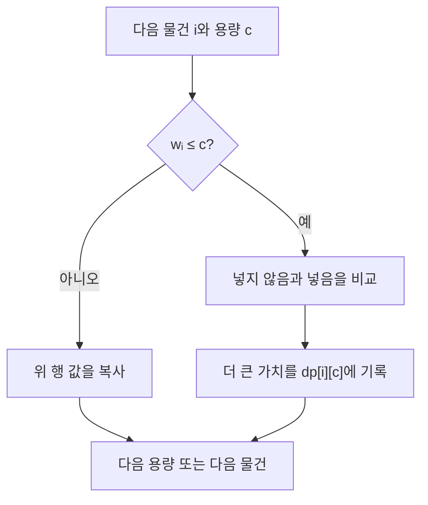

import { AlgorithmSimulation } from "#guide-sim";

# 0/1 배낭 — 같은 물건을 다시 고르지 않는 선택의 기록

## 먼저 문제를 한 문장으로

각 물건을 한 번만 고를 수 있을 때, 총무게가 `W`를 넘지 않도록 골라 가치 합을 최대로 만든다. 여기서 `0/1`은 물건마다 선택 횟수가 0 또는 1이라는 뜻이다.

## 처음 생각해 볼 방법과 막히는 지점

모든 부분집합을 만들어 무게와 가치를 비교하면 정답은 얻는다. 하지만 물건이 `n`개면 선택지가 `2^n`개다. `n = 100`에서는 그 방법을 실행할 수 없다. 탐색에서 이미 계산한 “앞 물건들로 용량 c를 채울 때의 최선”을 재사용해야 한다.

## 돌파구가 되는 관찰

`i`번째 물건까지 고려하고 용량이 `c`일 때의 최선만 알면 충분하다. 이 상태를 `dp[i][c]`로 둔다. 현재 물건 `(w, v)`은 두 선택만 만든다.

- 넣지 않으면 `dp[i - 1][c]`
- 넣을 수 있으면 `dp[i - 1][c - w] + v`

둘 중 큰 값을 고르는 것이 `dp[i][c]`다. “이전 행”만 참조하므로 같은 물건을 두 번 넣지 않는다. 이것이 무한 배낭과 구분되는 핵심이다.

## 실행 시각화

`weights = [1, 3, 4]`, `values = [1, 4, 5]`, `W = 5`를 따른다. 행은 고려한 물건 수, 열은 허용 용량이다. 마지막 `dp[3][5] = 6`은 무게 1·4 물건을 고른 결과다.

> 대화형 시뮬레이션은 MDX 런타임에서 표시됩니다.

export const knapsackSteps = [
  { title: "초기화", detail: "물건이 없으면 어떤 용량에서도 가치는 0이다.", matrix: [[0, 0, 0, 0, 0, 0]], rowLabels: ["0개"], colLabels: [0, 1, 2, 3, 4, 5] },
  { title: "무게 1, 가치 1", detail: "용량 1 이상에서는 이 물건을 한 번 넣어 가치 1을 얻는다.", matrix: [[0, 0, 0, 0, 0, 0], [0, 1, 1, 1, 1, 1]], rowLabels: ["0개", "1개"], colLabels: [0, 1, 2, 3, 4, 5], cells: [[1, 1], [1, 5]] },
  { title: "무게 3, 가치 4", detail: "용량 4에서는 이전 행의 용량 1 값에 4를 더해 5가 된다.", matrix: [[0, 0, 0, 0, 0, 0], [0, 1, 1, 1, 1, 1], [0, 1, 1, 4, 5, 5]], rowLabels: ["0개", "1개", "2개"], colLabels: [0, 1, 2, 3, 4, 5], cells: [[2, 4]] },
  { title: "무게 4, 가치 5", detail: "용량 5에서 이전 행의 용량 1 값 1에 5를 더해 최적값 6이 된다.", matrix: [[0, 0, 0, 0, 0, 0], [0, 1, 1, 1, 1, 1], [0, 1, 1, 4, 5, 5], [0, 1, 1, 4, 5, 6]], rowLabels: ["0개", "1개", "2개", "3개"], colLabels: [0, 1, 2, 3, 4, 5], cells: [[3, 5]] },
];

<AlgorithmSimulation view="matrix" steps={knapsackSteps} title="0/1 배낭 DP 표 채우기" />

## 알고리즘의 흐름 한눈에 보기

## 왜 항상 맞는가

`dp[i][c]`가 첫 `i`개 물건으로 용량 `c` 이하에서 얻을 수 있는 최대 가치라고 가정하자. `i`번째 물건을 쓰지 않는 최적해는 이전 행에 있고, 쓰는 최적해는 남은 용량 `c-w`에서의 최적해에 그 물건 가치를 더한 것이다. 모든 가능한 최적해가 이 둘 중 하나이므로 큰 값을 고르면 된다. 첫 행은 0으로 맞고, 마지막 행 `dp[n][W]`가 요구한 답이다.

## 구현할 때 놓치기 쉬운 점

현재 구현처럼 2차원 표를 쓰면 이 논리가 가장 잘 보이며 시간은 `O(nW)`, 공간도 `O(nW)`다. 한 행으로 줄일 때는 용량을 **큰 쪽에서 작은 쪽으로** 순회해야 한다. 반대로 순회하면 이번 물건으로 막 갱신한 값을 다시 읽어 같은 물건을 여러 번 쓸 수 있다.

## 스스로 점검하기

1. 용량을 앞에서부터 순회하면 왜 무한 배낭처럼 변할까?
2. 무게가 `W`보다 큰 물건은 어떤 상태에도 영향을 줄 수 있을까?
