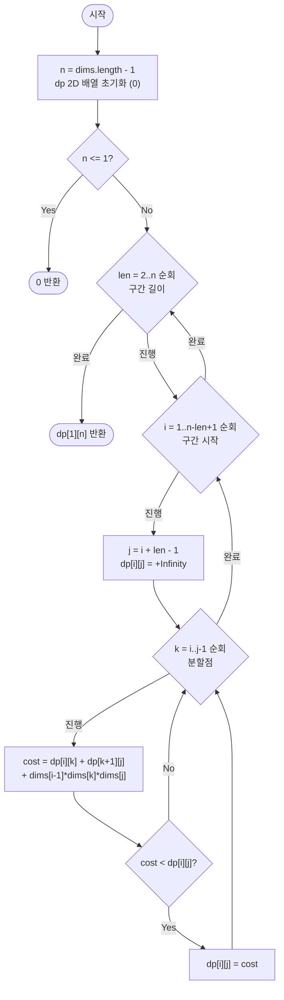

import { AlgorithmSimulation } from "#guide-sim";

# matrixChainMultiplication — 마지막에 나눌 지점 하나만 정하면 전체가 풀리는 이유

## 한눈에 보는 컨셉

여러 개의 행렬을 순서대로 곱할 때, 괄호를 어디에 두느냐(어떤 순서로 묶어서 곱하느냐)에 따라 실제 스칼라 곱셈 횟수가 크게 달라져요. 핵심 관찰은 "어떤 괄호 배치든 반드시 마지막으로 두 덩어리를 합치는 지점 `k`가 하나 존재하고, 그 왼쪽·오른쪽 덩어리도 각각 최적으로 묶여야 전체가 최적"이라는 최적 부분구조입니다. 이 성질 덕분에 구간을 짧은 것부터 긴 것 순서로 채우는 구간 DP로 `O(n^3)` 안에 전역 최적 괄호 배치를 찾을 수 있어요.

## 출발점: 가장 순진한 방법부터

문제를 먼저 정확히 고정할게요.

```ts
function matrixChainMultiplication(dims: number[]): number
```

| 항목 | 의미 | 제약 |
|------|------|------|
| `dims` | 행렬 차원 배열. $A_i$($1 \le i \le n$)의 크기는 $dims[i-1] \times dims[i]$ | 길이 $n+1$, $1 \le |dims| \le 101$ (즉 $0 \le n \le 100$) |
| `dims[i]` | 각 차원 값 | $1 \le dims[i] \le 500$ |
| 반환값 | 행렬 체인 전체를 곱할 때 필요한 최소 스칼라 곱셈 횟수 | $\ge 0$ |
| 순서 제약 | 행렬은 주어진 순서대로만 곱한다(순서 자체는 못 바꾼다). 묶는 방식(괄호 위치)만 자유 | — |

엣지케이스도 먼저 목록으로 잡아 둡니다.

| 입력 | 기대 출력 | 이유 |
|------|-----------|------|
| `dims=[7]` | `0` | 행렬이 아예 없음($n=0$) |
| `dims=[10, 20]` | `0` | 행렬이 1개뿐이라 곱셈 자체가 없음 |
| `dims=[2, 3, 4]` | `24` | 행렬 2개, 묶는 방법이 한 가지뿐: $2\times3\times4=24$ |
| `dims=[10, 100, 5, 50]` | `7500` | 최적 괄호: $((A_1A_2)A_3)$ |

"최소 비용을 찾아야 한다"는 문제를 만나면 가장 정직한 출발은 **가능한 모든 괄호 배치의 비용을 직접 계산해서 비교하는 것**입니다. 행렬 3개짜리 예시 `dims=[10, 100, 5, 50]`을 손으로 따라가 볼게요. $A_1(10\times100)$, $A_2(100\times5)$, $A_3(5\times50)$을 묶는 방법은 두 가지뿐입니다.

```text
((A1 A2) A3) : 10·100·5 + 10·5·50   = 5000 + 2500  = 7500
(A1 (A2 A3)) : 100·5·50 + 10·100·50 = 25000 + 50000 = 75000

같은 세 행렬, 같은 결과값인데 곱셈 횟수는 10배 차이
```

이걸 재귀로 그대로 옮기면 이렇습니다. 구간 `[i, j]`(1-indexed, $A_i \cdots A_j$)를 곱하는 최소 비용을 구하려면, 마지막 분할점 `k`를 `i`부터 `j-1`까지 전부 시도해 보고 제일 싼 걸 고르면 됩니다.

```ts
function mcmNaive(dims: number[]): number {
  const n = dims.length - 1;
  if (n <= 1) return 0;

  function minCost(i: number, j: number): number {
    if (i === j) return 0; // 행렬 하나는 곱셈 비용 없음
    let best = Infinity;
    for (let k = i; k < j; k++) {
      const cost = minCost(i, k) + minCost(k + 1, j) + dims[i - 1] * dims[k] * dims[j];
      if (cost < best) best = cost;
    }
    return best;
  }

  return minCost(1, n);
}
```

문제는 이 방법이 얼마나 느려지느냐입니다. 행렬이 $n$개면 괄호 배치 경우의 수는 카탈란 수(Catalan number) $C_{n-1}$개예요.

```text
n(행렬 수)   경우의 수 C_{n-1}
   1               1
   2               1
   3               2
   4               5
   5              14
   6              42
   ...
  100    227,508,830,794,...,047,340   (57자리, 약 2.28×10^56)
```

$n=100$이면 경우의 수가 57자리 숫자입니다. 완전 탐색으로는 절대 끝나지 않는 규모예요.

그런데 이 재귀를 실제로 펼쳐 보면 낌새가 하나 보입니다. 행렬 4개(`dims=[10,20,30,40,30]`)에서 `minCost(1,4)`를 계산하는 트리 일부를 보면,

```text
minCost(1,4)
 ├─ k=1: minCost(1,1) + minCost(2,4)
 │                        ├─ k=2: minCost(2,2) + minCost(3,4)
 │                        └─ k=3: minCost(2,3) + minCost(4,4)   ← minCost(2,3) 여기서 1번
 ├─ k=2: minCost(1,2) + minCost(3,4)
 └─ k=3: minCost(1,3) + minCost(4,4)
             ├─ k=1: minCost(1,1) + minCost(2,3)                ← minCost(2,3) 여기서 또 1번
             └─ k=2: minCost(1,2) + minCost(3,3)

minCost(2,3)은 서로 다른 경로 두 곳(minCost(2,4)의 k=3 분기, minCost(1,3)의 k=1 분기)에서
독립적으로 호출되어 완전히 똑같은 계산을 두 번 반복한다
```

같은 구간 `[2,3]`을 두 번 계산하는 겁니다. 구간 `[i, j]`의 가짓수는 $O(n^2)$밖에 안 되는데, 재귀는 그걸 모른 채 매번 처음부터 다시 계산해요. **"이미 풀어 둔 구간을 또 풀고 있다"** — 이것이 이번 최적화의 출발 단서입니다.

## 아이디어 자세히 들여다보기

### 마지막 분할점에서 거꾸로 생각하기 — 수식과 그림

구간 $[i, j]$($1 \le i \le j \le n$)를 곱하는 최소 스칼라 곱셈 횟수를 $dp[i][j]$라 정의합니다.

$$dp[i][j] = \text{"행렬 } A_i A_{i+1} \cdots A_j \text{를 곱하는 최소 스칼라 곱셈 횟수"}$$

그림으로 보면 구간을 분할점 `k`에서 왼쪽·오른쪽 두 덩어리로 나누는 모양이에요.

```text
구간 [i, j] = A_i A_{i+1} ... A_j

  [ i ......... k ][ k+1 ......... j ]
     왼쪽 덩어리        오른쪽 덩어리
     dp[i][k]           dp[k+1][j]

  두 덩어리를 결과 행렬로 합치는 비용 = dims[i-1] * dims[k] * dims[j]
  (왼쪽 결과는 dims[i-1]×dims[k] 크기, 오른쪽 결과는 dims[k]×dims[j] 크기)
```

왜 상태를 `i` 하나가 아니라 `(i, j)` 두 개로 잡아야 할까요? "첫 `i`개 행렬을 곱하는 최소 비용"처럼 1D로 정의하면 얼핏 될 것 같지만, 분할점 `k`를 기준으로 나뉘는 오른쪽 덩어리 `[k+1, j]`가 항상 "처음부터 시작하는 구간"은 아니에요. 임의의 중간 구간이 하위 문제로 등장하므로, 시작과 끝을 모두 표현하는 2D 상태가 꼭 필요합니다.

잠깐, 확인 하나 해 볼까요? `dims=[10, 20, 30]`(행렬 2개, $A_1(10\times20)$, $A_2(20\times30)$)일 때 `dp[1][2]`는 얼마일까요? 분할점은 `k=1` 하나뿐이니 $dims[0]\times dims[1]\times dims[2] = 10\times20\times30 = 6000$입니다.

### 왜 모순 없이 작동하는가

이 알고리즘의 점화식은 다음과 같습니다. 구간 길이가 2 이상인 $[i,j]$에 대해, 분할점 $k$($i \le k < j$)를 전부 시도해 가장 싼 것을 고릅니다.

$$dp[i][j] = \min_{i \le k < j} \Bigl( dp[i][k] + dp[k+1][j] + dims[i-1] \cdot dims[k] \cdot dims[j] \Bigr), \qquad dp[i][i] = 0$$

이 점화식이 옳다는 것을 구간 길이에 대한 귀납으로 확인해 봅시다.

- **기저**: 길이 1인 구간, 즉 $dp[i][i]=0$은 행렬 하나에는 곱셈이 필요 없으니 자명하게 옳습니다.
- **귀납 가정**: 길이가 $len$보다 짧은 모든 구간 $[i',j']$에 대해 $dp[i'][j']$가 이미 올바르다고 가정합니다.
- **귀납 단계**: 길이 $len$인 구간 $[i,j]$를 최적으로 괄호 묶는 방법을 하나 고정하면, 그 안에는 반드시 "마지막으로 두 덩어리로 나뉘는" 지점 $k^*$가 존재합니다($i \le k^* < j$ 범위 전체가 후보이므로, 이 열거에서 빠지는 분할 방식은 없습니다 — **경우의 완전성**). 이때 $[i,k^*]$와 $[k^*+1,j]$도 각자 최적으로 묶여야 합니다. 만약 둘 중 하나가 최적이 아니라면, 더 싼 괄호 배치로 바꿔 끼워 전체 비용을 낮출 수 있으므로 애초에 "최적 배치"라는 가정에 모순이기 때문입니다(**각 경우의 최적성**). 두 덩어리의 길이는 모두 $len$보다 짧으므로 귀납 가정에 의해 $dp[i][k^*]$, $dp[k^*+1][j]$는 이미 올바른 값입니다. 점화식은 모든 후보 $k$에 대해 비용을 계산하고 $\min$을 취하므로, $k^*$를 포함한 모든 분할점 중 최솟값을 정확히 찾아냅니다.

여기서 **헷갈리기 쉬운 포인트**가 둘 있습니다.

- **`dp[i][j]`의 초기값은 반드시 $+\infty$여야 합니다.** `min`을 적용할 자리를 `0`으로 잘못 초기화하면 어떻게 될까요? 직접 실행해서 확인해 보면, `dims=[10,100,5,50]`에서 정상 결과는 `7500`인데, `dp[i][j]=0`으로 초기화한 버전은 매 분할점 비교 `cost < dp[i][j]`가 `cost < 0`이 되어 단 한 번도 참이 되지 않고, 결과가 `0`으로 조용히 고정됩니다. 겉보기엔 "그럴싸한 숫자"라 눈치채기 더 어렵습니다.
- **세 곱셈 항의 인덱스를 헷갈리기 쉽습니다.** 결합 비용 항은 `dims[i-1]*dims[k]*dims[j]`인데, 가운데 항을 `dims[k]` 대신 `dims[k+1]`로 잘못 쓰면(왼쪽 결과 행렬의 열 수 대신 오른쪽 시작 행렬의 다음 차원을 참조) 같은 예시에서 결과가 `7500`이 아니라 `25250`으로 바뀝니다 — 컴파일도 되고 실행도 되지만 조용히 틀린 답을 냅니다.

엣지 케이스에서도 정의가 그대로 성립하는지 점검해 둡니다.

```text
n = 0 (dims 길이 1, 행렬 없음)      → 곱할 행렬이 없으므로 0 반환 (dp 테이블 자체를 만들 필요 없음)
n = 1 (dims 길이 2, 행렬 1개)       → dp[1][1] = 0
n = 2 (행렬 2개)                    → 분할점이 k=1 하나뿐, min 탐색은 자명하게 그 값
모든 dims가 동일한 값               → 그래도 분할점에 따라 비용이 달라질 수 있으므로 min 탐색 필요
```

## 아이디어를 코드로 옮기기

점화식을 가장 직접적으로 옮기는 방법은 재귀 그대로에 캐시를 붙이는 것입니다. 어차피 구간 `[i,j]`는 $O(n^2)$가지뿐이니, 한 번 계산한 값을 저장해 두면 재귀 구조를 유지하면서도 중복 계산을 없앨 수 있어요.

```ts
function matrixChainMultiplicationMemo(dims: number[]): number {
  const n = dims.length - 1; // 행렬 수
  if (n <= 1) return 0;

  const memo = new Map<string, number>();

  function minCost(i: number, j: number): number {
    if (i === j) return 0;
    const key = `${i},${j}`;
    const cached = memo.get(key);
    if (cached !== undefined) return cached;

    let best = Infinity;
    for (let k = i; k < j; k++) {
      const cost = minCost(i, k) + minCost(k + 1, j) + dims[i - 1] * dims[k] * dims[j];
      if (cost < best) best = cost;
    }
    memo.set(key, best);
    return best;
  }

  return minCost(1, n);
}
```

**가장 중요한 줄은 `if (cached !== undefined) return cached;`입니다.** 이 한 줄이 지수 시간 재귀를 다항 시간으로 바꿉니다 — 같은 `[i,j]`가 몇 번을 호출되든, 실제로 아래 `for` 루프를 도는 건 처음 한 번뿐이고 이후로는 저장된 값을 즉시 돌려줍니다. 그 밖에 결정 지점은 두 가지예요. 기저 조건 `i === j`를 캐시 확인보다 먼저 두는 것(길이 1 구간은 캐시할 필요조차 없는 자명한 값), 그리고 분할점 범위를 `k < j`로(즉 `k`가 `j`에 도달하지 않도록) 고정하는 것 — `k`가 `j`까지 가면 오른쪽 구간 `[j+1, j]`처럼 원소가 없는 구간을 참조하게 됩니다.

## 더 빠르게 만들 단서 찾기

메모이제이션으로 중복 계산은 사라졌지만, 여전히 함수 호출을 통해 값을 얻습니다. 캐시 적중 하나를 처리하는 데도 문자열 키를 새로 만들고(`` `${i},${j}` ``) 그 문자열을 해시해서 `Map`을 조회하는 비용이 듭니다.

```text
memo.get(`${i},${j}`)   ← 문자열 "1,2"를 매번 새로 생성 + 해시 계산 + Map 버킷 탐색
dp[i][j]                ← 정수 인덱스 두 번, 배열 오프셋 계산만(해시 없음, 할당 없음)
```

게다가 재귀 호출은 "누가 언제 먼저 계산될지"를 함수 호출 순서에 맡깁니다. 실제로는 구간이 짧은 것부터 계산돼야 한다는 걸 우리가 이미 알고 있는데(3.4절의 귀납 순서 그대로), 재귀는 그 지식을 활용하지 않고 매번 "이 값이 캐시에 있나?"부터 확인하는 셈이에요. **계산 순서를 우리가 미리 정해 둘 수 있다면, 캐시 존재 여부를 확인하는 절차 자체가 필요 없어집니다.**

## 단서를 최적화로 연결하기

귀납 단계에서 이미 확인했듯, 길이 $len$인 구간은 길이가 그보다 짧은 구간에만 의존합니다. 그러니 구간 길이를 2부터 $n$까지 **오름차순으로** 순회하면서 `dp` 배열을 직접 채우면, `dp[i][j]`를 계산하는 시점에 필요한 `dp[i][k]`, `dp[k+1][j]`는 이미 확정돼 있다는 게 보장됩니다.

```text
Before (메모이제이션 재귀): 계산 순서를 함수 호출 스택에 위임, 매 호출마다 캐시 조회
  minCost(1,4) 호출 → minCost(2,4) 호출 → minCost(2,3) 호출 → ... (스택이 깊어졌다 되돌아옴)

After (bottom-up 반복문): 길이 순서를 직접 통제, 캐시 조회 없이 배열 인덱싱만
  len=1 전부 채움 → len=2 전부 채움 → len=3 전부 채움 → ... → len=n

불변식: len 루프가 끝난 시점에, 길이 ≤ len인 모든 [i,j]는 이미 최종값이 확정돼 있다
```

## 최적화 코드

메모이제이션 재귀에서 재귀 호출과 `Map` 캐시를 걷어내고, 삼중 반복문으로 바꿉니다.

```ts
function matrixChainMultiplication(dims: number[]): number {
  const n = dims.length - 1;
  if (n <= 1) return 0;

  const dp: number[][] = Array.from({ length: n + 1 }, () => new Array(n + 1).fill(0));

  for (let len = 2; len <= n; len++) {          // 구간 길이: 짧은 것부터
    for (let i = 1; i <= n - len + 1; i++) {    // 구간 시작
      const j = i + len - 1;                    // 구간 끝
      dp[i][j] = Infinity;
      for (let k = i; k < j; k++) {              // 분할점
        const cost = dp[i][k] + dp[k + 1][j] + dims[i - 1] * dims[k] * dims[j];
        if (cost < dp[i][j]) dp[i][j] = cost;
      }
    }
  }

  return dp[1][n];
}
```

**가장 중요한 줄은 `for (let len = 2; ...)`로 시작하는 바깥 루프의 순서입니다.** 길이 우선 순회가 아니라 예를 들어 `i`를 바깥에, `j`를 안에 두고 단순 오름차순으로 돌리면(`for i=1..n: for j=i+1..n`), `dp[i][j]`를 계산할 때 필요한 `dp[k+1][j]`(`k+1 > i`)가 아직 채워지지 않았을 수 있어 조용히 `undefined`나 초기값 `0`을 읽고 틀린 결과를 냅니다. 그다음으로 중요한 건 `dp[i][j] = Infinity` 초기화 줄이에요 — 앞서 본 것처럼 이 초기화를 빠뜨리면 최솟값 비교가 통째로 무너집니다.

> 기억법: **"짧은 구간부터, 그리고 min의 시작점은 항상 무한대."**

더 빠르게 만들 여지가 남아 있을까요? 이 DP 자체는 여전히 $O(n^3)$이고, $n=100$에서 분할점 비교 총 횟수를 세어 보면 정확히 `166,650`회 — 목표로 잡은 $O(n^3)\approx O(10^6)$ 안에 여유 있게 들어옵니다. 점근 복잡도를 더 낮추려면 이 DP와는 다른 결의 관찰이 필요합니다. 사실 분할점 $k^*(i,j)$가 구간이 커짐에 따라 단조 증가한다는 사실(콴그르 부등식, quadrangle inequality)을 이용하면 탐색 범위를 줄여 $O(n^2)$까지 낮추는 **Knuth의 최적화** 기법이 존재합니다. 다만 이는 이 문제 특유의 구조를 활용하는 특화 기법이고, 여기서 배운 구간 DP는 "연속된 원소를 임의 순서로 묶을 때 비용을 최소화한다"는 형태(행렬 곱, 문자열 편집, 돌 합치기 등)라면 어디든 그대로 재사용할 수 있다는 범용성이 강점입니다.

## 실행 시각화

예시 `dims = [10, 100, 5, 50]`(행렬 3개: $A_1$ 10×100, $A_2$ 100×5, $A_3$ 5×50)에 대해 구간 DP를 채우는 과정입니다. matrix 패널의 행은 구간 시작 `i`, 열은 구간 끝 `j`(1-indexed), 셀 값은 `dp[i][j]`(하삼각은 빈 칸)예요. 위 최적화 코드를 그대로 이 입력에 실행하면 `dp[1][3] = 7500`이 반환되며, 아래 시뮬레이션 마지막 프레임의 우상단 칸과 정확히 일치합니다.

> 대화형 시뮬레이션은 MDX 런타임에서 표시됩니다.

export const cols = ["j=1", "j=2", "j=3"];

export const rows = ["i=1", "i=2", "i=3"];

export const N = null;

export const steps = [
  {
    title: "초기화 (len=1)",
    detail: "dp[i][i]=0: 행렬 하나는 곱셈 비용 없음.",
    rowLabels: rows, colLabels: cols,
    matrix: [
      [0, N, N],
      [N, 0, N],
      [N, N, 0],
    ],
    cells: [[0, 0], [1, 1], [2, 2]],
    entries: [{ label: "단계", value: "대각선 0" }],
  },
  {
    title: "len=2: 구간 [1,2]",
    detail: "k=1: dp[1][1]+dp[2][2]+dims[0]*dims[1]*dims[2]=0+0+10*100*5=5000.",
    rowLabels: rows, colLabels: cols,
    matrix: [
      [0, 5000, N],
      [N, 0, N],
      [N, N, 0],
    ],
    cells: [[0, 1]],
    entries: [{ label: "dp[1][2]", value: 5000 }],
  },
  {
    title: "len=2: 구간 [2,3]",
    detail: "k=2: 0+0+dims[1]*dims[2]*dims[3]=100*5*50=25000.",
    rowLabels: rows, colLabels: cols,
    matrix: [
      [0, 5000, N],
      [N, 0, 25000],
      [N, N, 0],
    ],
    cells: [[1, 2]],
    entries: [{ label: "dp[2][3]", value: 25000 }],
  },
  {
    title: "len=3: 구간 [1,3], 분할점 k=1",
    detail: "dp[1][1]+dp[2][3]+dims[0]*dims[1]*dims[3]=0+25000+10*100*50=75000.",
    rowLabels: rows, colLabels: cols,
    matrix: [
      [0, 5000, "75000?"],
      [N, 0, 25000],
      [N, N, 0],
    ],
    cells: [[0, 2]],
    entries: [{ label: "k=1 비용", value: 75000 }],
  },
  {
    title: "len=3: 구간 [1,3], 분할점 k=2",
    detail: "dp[1][2]+dp[3][3]+dims[0]*dims[2]*dims[3]=5000+0+10*5*50=7500 < 75000.",
    rowLabels: rows, colLabels: cols,
    matrix: [
      [0, 5000, 7500],
      [N, 0, 25000],
      [N, N, 0],
    ],
    cells: [[0, 2]],
    entries: [{ label: "k=2 비용", value: 7500 }],
  },
  {
    title: "완료",
    detail: "dp[1][3]=min(75000, 7500)=7500. ((A1·A2)·A3) 반환.",
    rowLabels: rows, colLabels: cols,
    matrix: [
      [0, 5000, 7500],
      [N, 0, 25000],
      [N, N, 0],
    ],
    cells: [[0, 2]],
    entries: [{ label: "반환값", value: 7500 }],
  },
];

<AlgorithmSimulation view={["matrix", "keyValue"]} steps={steps} title="행렬 체인 곱셈 구간 DP" />

## 흐름 한눈에 보기



## 스스로 점검하기

1. `dims=[10, 30, 5, 60]`에 대해 `dp[1][2]`, `dp[2][3]`, `dp[1][3]`을 손으로 채워 보세요. 힌트: 행렬은 $A_1(10\times30)$, $A_2(30\times5)$, $A_3(5\times60)$이고 정답은 `4500`입니다.
2. 최적화 코드에서 바깥 루프를 `len` 대신 `for (let i = 1; i <= n; i++) { for (let j = i + 1; j <= n; j++) { ... } }` 형태로 바꾸면, `dims=[10, 20, 30, 40, 30]`에서 정답 `30000` 대신 `6000`이 나옵니다. 어떤 `[i,j]`를 계산할 때 처음으로 아직 채워지지 않은 `dp[k+1][j]`(기본값 `0`)를 읽는지 짚어 보세요.
3. 만약 문제가 "행렬을 원형으로 배치하고 아무 지점에서나 끊어서 체인으로 만들 수 있다"로 바뀐다면(원형 행렬 체인), 지금의 `dp[i][j]` 상태와 삼중 루프 구조를 어떻게 확장해야 할지 생각해 보세요. (힌트: 시작점 후보를 $n$가지로 늘리고 각각에 대해 지금의 알고리즘을 다시 돌리는 방법을 떠올려 보세요.)
