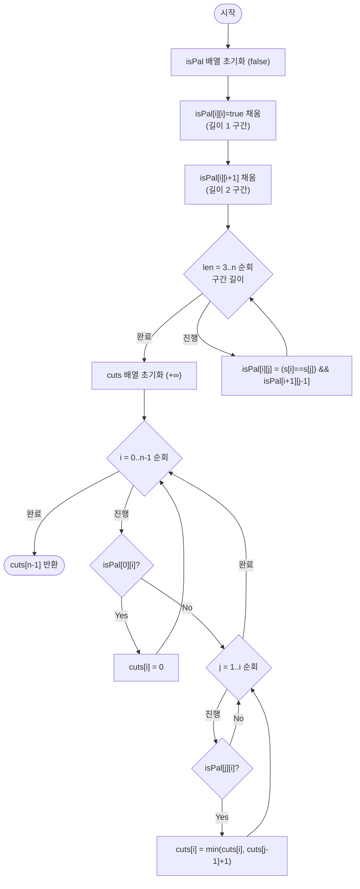

import { AlgorithmSimulation } from "#guide-sim";

# palindromePartitioningMinCut — 팰린드롬 판정을 한 번만 계산해 두면 컷 DP가 왜 O(n²)로 끝나는가

## 한눈에 보는 컨셉

문자열을 팰린드롬(앞에서 읽어도 뒤에서 읽어도 같은 문자열, 예: `"aba"`, `"noon"`) 조각들로 나누는 최소 컷 횟수를 구하는 문제예요. 핵심 관찰은 "구간 `[i,j]`가 팰린드롬인지"를 매번 다시 판정하지 않고 `O(n^2)` 테이블에 한 번만 채워 두면, 최소 컷을 구하는 DP는 그 테이블을 `O(1)`로 조회하며 진행된다는 것입니다. 이 두 단계(판정 전처리 + 컷 DP)를 합쳐 전체를 `O(n^2)`에 끝냅니다.

## 출발점: 가장 순진한 방법부터

문제를 먼저 정확히 잡을게요.

```ts
function palindromePartitioningMinCut(s: string): number
```

| 파라미터 | 의미 | 제약 |
|----------|------|------|
| `s` | 입력 문자열 | $1 \leq |s| \leq 2000$, 영문 소문자만 |
| 반환값 | 모든 조각이 팰린드롬이 되도록 분할할 때의 최소 컷 횟수 | $0 \leq$ 반환값 $\leq |s|-1$ |

엣지케이스를 미리 나열해 두면:

| 입력 | 기대 출력 | 이유 |
|------|-----------|------|
| `"a"` | `0` | 길이 1은 그 자체로 팰린드롬 |
| `"aa"` | `0` | 전체가 팰린드롬 |
| `"ab"` | `1` | `"a"｜"b"`로 자를 수밖에 없음 |
| `"aab"` | `1` | `"aa"｜"b"` |
| `"abcde"` | `4` | 전부 달라 낱개로 잘라야 함 |

가장 정직한 방법은 "어디서 자를지"를 전부 시도해 보는 겁니다. 접두사 하나를 팰린드롬으로 떼어내고, 남은 부분에 대해 같은 문제를 재귀로 반복하는 거예요.

```ts
function isPalindromeNaive(s: string, l: number, r: number): boolean {
  while (l < r) {
    if (s[l] !== s[r]) return false;
    l++;
    r--;
  }
  return true;
}

function minPiecesNaive(s: string, start: number, n: number): number {
  if (start === n) return 0; // 빈 접미사는 조각 0개
  let best = Infinity;
  for (let end = start; end < n; end++) {
    if (isPalindromeNaive(s, start, end)) {
      best = Math.min(best, 1 + minPiecesNaive(s, end + 1, n));
    }
  }
  return best;
}

function palindromePartitioningMinCutNaive(s: string): number {
  return minPiecesNaive(s, 0, s.length) - 1; // 조각 수 - 1 = 컷 횟수
}
```

왜 느린가: `start`마다 뒤에 남은 모든 `end`를 다 시도하니, 매 위치에서 "자른다/안 자른다"의 분기가 생겨 재귀 트리 크기가 $2^{n-1}$입니다. 게다가 `isPalindromeNaive` 자체가 매번 $O(n)$이 걸려요.

```text
n = 2000 일 때

분할 패턴 전부 탐색:  2^(n-1) = 2^1999                → 완전히 불가능
같은 start를 메모이제이션해도:
  상태 O(n) × 매 상태 end 후보 O(n) × 판정 O(n)  = O(n^3)
  = 8 × 10^9 연산                                 → 1초 안에 못 끝냄
```

목표 복잡도는 $O(n^2) = O(4 \times 10^6)$입니다. 낭비는 두 가지예요. 첫째, `isPalindromeNaive(s, start, end)`를 부르는 시점의 `(start, end)` 쌍이 재귀 곳곳에서 겹치는데도 매번 새로 훑습니다. 둘째, 판정 자체가 $O(n)$인데 조회는 $O(1)$이어도 충분한 정보예요. **이 판정을 딱 한 번씩만 계산해서 재사용할 수는 없을까?** — 이것이 다음 절의 출발점입니다.

## 아이디어 자세히 들여다보기

### 팰린드롬 판정을 한 번만 — 수식과 그림

낭비를 없애는 첫 단추는 "구간 `[i,j]`가 팰린드롬인가"라는 질문 자체를 표로 미리 답해 두는 겁니다.

$$isPal[i][j] = \begin{cases} \text{true} & s[i \ldots j] \text{가 팰린드롬} \\ \text{false} & \text{그 외} \end{cases}$$

작은 예시 `s = "aab"`로 직접 채워 볼게요. 대각선(길이 1)은 항상 참, 그다음 길이 2, 길이 3 순서로 채웁니다.

```text
      j=0  j=1  j=2
i=0    T    T    F     ("a")  ("aa")  ("aab")
i=1    ·    T    F             ("a")  ("ab")
i=2    ·    ·    T                     ("b")

· = 하삼각(i>j), 의미 없는 칸이라 채우지 않는다
```

왜 하필 이 형태여야 할까요? "매번 $O(n)$ 판정"과 "표를 $O(n^2)$에 한 번 채우고 $O(1)$ 조회" 중 후자를 고른 건, 이 정보를 뒤에서 여러 번(최소 컷 DP가 각 `i`마다 여러 `j`를 조회) 되풀이해서 쓰기 때문이에요 — 한 번만 쓰고 버릴 정보였다면 표로 만드는 비용이 오히려 손해입니다.

확인 질문 하나: `isPal[2][0]`(즉 $i>j$)은 왜 정의하지 않을까요? 구간 `[2,0]`은 시작이 끝보다 뒤에 있는, 애초에 존재하지 않는 구간이기 때문이에요. 그래서 위 표에서도 하삼각은 비워 둡니다.

이제 이 표를 딛고 최소 컷을 구하는 두 번째 DP를 올립니다.

$$cuts[i] = \text{"} s[0 \ldots i] \text{ 를 모두 팰린드롬 조각으로 자를 때 필요한 최소 컷 수"}$$

`cuts`가 1차원 배열로 충분한 이유는, 어떤 분할이든 접두사를 왼쪽부터 단계적으로 채워 나가는 구조이기 때문이에요. 시작은 항상 `0`으로 고정되어 있으니 끝 위치 `i` 하나로 상태를 표현할 수 있습니다.

같은 예시 `s = "aab"`로 `cuts`를 채워 보면:

```text
cuts[0] : isPal[0][0]=T → 통째로 팰린드롬 → 0
cuts[1] : isPal[0][1]=T ("aa") → 통째로 팰린드롬 → 0
cuts[2] : isPal[0][2]=F ("aab" 아님)
          → j=1: isPal[1][2]=F ("ab" 아님) 스킵
          → j=2: isPal[2][2]=T ("b") → cuts[1]+1 = 0+1 = 1
          → cuts[2] = 1
```

`cuts[2] = 1`이 최종 반환값입니다. 실제로 `"aa"｜"b"` 한 번 자르면 두 조각 모두 팰린드롬이니 앞서 본 대표 예시와 일치해요.

### 단서를 설명해 주는 이론 — 구간 DP (Interval DP)

`isPal[i][j]`를 채우는 순서 — 길이 1 → 길이 2 → 길이 3 → ... — 는 즉흥적으로 고른 게 아니라 **구간 DP(interval DP)**라는 이름이 붙은 일반 기법입니다. 구간 DP는 "구간 `[i,j]`의 답이 그보다 짧은 부분 구간의 답에만 의존할 때, 짧은 구간부터 긴 구간 순서로 채워 나가는" 설계 원칙이에요. 행렬 체인 곱셈, 구간 최적 이진 탐색 트리 같은 고전 문제들이 이 틀을 씁니다.

이 문제에서의 대응은 명확합니다. `isPal[i][j]`는 길이가 2 작은 `isPal[i+1][j-1]`에만 의존하므로, 길이 오름차순으로 채우면 "참조하려는 값이 항상 이미 계산되어 있다"는 것이 자동으로 보장돼요. **"작은 것부터 확정해야 큰 것이 안전하게 참조할 수 있다"**는 이 원칙은 이 문제뿐 아니라 구간 DP 계열 전체를 관통하는데, 뒤에서 최적화를 이야기할 때 같은 원칙이 조금 다른 얼굴로 다시 등장하니 기억해 두세요.

### 왜 모순 없이 작동하는가

**`isPal` 테이블의 정당성**은 귀납으로 보입니다.

- 기저(길이 1, 2): 길이 1은 문자 하나이므로 자명하게 참입니다. 길이 2는 양 끝 문자 비교만으로 결정됩니다(안쪽이 빈 구간이라 항상 참이라고 봐도 무방하니까요).
- 귀납 단계(길이 $> 2$): $isPal[i][j]$가 참이려면 $s[i]=s[j]$이고 안쪽 $[i+1,j-1]$도 팰린드롬이어야 합니다. 경우의 완전성 — 팰린드롬은 "양 끝이 같고 안쪽도 팰린드롬"이라는 조건 외에 다른 정의가 없으므로 이 두 조건이 전부입니다. 정확성 — 길이 순서로 채우고 있으므로 $isPal[i+1][j-1]$(길이가 2 짧음)은 이미 확정된 값이고, 그 값을 그대로 신뢰해 사용할 수 있습니다.

**`cuts` 배열의 정당성**도 귀납입니다.

- 기저: $cuts[0]$은 $s[0]$ 한 글자이므로 $isPal[0][0]$이 항상 참이라 $0$입니다.
- 귀납 단계: $cuts[i]$를 계산할 때 참조하는 $cuts[j-1]$은 항상 $j-1 < i$이므로 이미 확정돼 있습니다. 경우의 완전성 — "마지막 팰린드롬 조각이 어디서 시작하는가"는 $isPal[j][i]$가 참인 모든 $j \in [1,i]$가 전부이고, 이 중 하나도 빠뜨리지 않고 순회합니다. 최적성 — 각 후보에 대해 $cuts[j-1]+1$을 계산해 최솟값을 취하므로, 어떤 마지막 조각을 고르든 그 전까지는 이미 최적으로 자른 값을 재사용하는 셈입니다.

여기서 **헷갈리기 쉬운 포인트**가 둘 있습니다.

- **길이 2 구간의 "안쪽"은 빈 구간입니다.** $isPal[i][i+1]$을 일반식 $isPal[i+1][j-1]$로 그대로 계산하려 하면 $isPal[i+1][i]$, 즉 $i+1 > i$인 존재하지 않는 구간을 참조하게 됩니다. 그래서 길이 1·2는 별도 기저 케이스로 채우고, 일반 점화식은 길이 3부터 적용해야 해요.
- **`cuts[i]`를 구할 때 "통째로 팰린드롬인 경우"($j=0$에 해당)와 "일부만 자르는 경우"($j \geq 1$)를 반드시 분리해야 합니다.** 분리하지 않고 $j=0$부터 $cuts[j-1]$을 균일하게 참조하면 $cuts[-1]$(존재하지 않는 인덱스)을 읽게 됩니다. 실제로 이 분리를 빼고 `s="aab"`에 돌리면 `cuts[0]`부터 `Math.min(Infinity, cuts[-1]+1)` = `Math.min(Infinity, NaN)` = `NaN`이 되어, 최종 반환값도 `1`이 아니라 `NaN`으로 조용히 깨집니다.

엣지 케이스도 점검해 둘게요.

```text
n = 1                → isPal[0][0]=T, cuts[0]=0
모든 문자가 같음("aaaa") → isPal[0][n-1]=T (전체가 팰린드롬), cuts[n-1]=0
모든 문자가 다름("abcde") → 어떤 isPal[i][j](i<j)도 F, cuts[i]=cuts[i-1]+1로 매번 1씩 증가 → cuts[n-1]=n-1
```

## 아이디어를 코드로 옮기기

위 두 단계를 그대로 옮기면 이렇습니다.

```ts
function palindromePartitioningMinCutBasic(s: string): number {
  const n = s.length;

  const isPal: boolean[][] = Array.from({ length: n }, () => new Array(n).fill(false));

  for (let i = 0; i < n; i++) isPal[i]![i] = true;                 // 길이 1
  for (let i = 0; i < n - 1; i++) isPal[i]![i + 1] = s[i] === s[i + 1]; // 길이 2

  for (let len = 3; len <= n; len++) {
    for (let i = 0; i <= n - len; i++) {
      const j = i + len - 1;
      isPal[i]![j] = s[i] === s[j] && isPal[i + 1]![j - 1]!;
    }
  }

  const cuts = new Array<number>(n).fill(Infinity);
  for (let i = 0; i < n; i++) {
    if (isPal[0]![i]) {
      cuts[i] = 0;                       // 통째로 팰린드롬
    } else {
      for (let j = 1; j <= i; j++) {
        if (isPal[j]![i]) {
          cuts[i] = Math.min(cuts[i]!, cuts[j - 1]! + 1);
        }
      }
    }
  }

  return cuts[n - 1]!;
}
```

**가장 실수가 잦은 줄은 `if (isPal[0]![i]) { cuts[i] = 0; } else { for (let j = 1; ...) ... }`의 분기입니다.** 앞서 본 것처럼 이 분기를 빼먹으면 `cuts[-1]` 참조로 `NaN`이 퍼집니다. 그 외 결정 지점은: `isPal` 초기값은 전부 `false`(팰린드롬이 아니라고 가정하고 시작), `cuts` 초기값은 `+Infinity`(아직 아무 방법도 못 찾았다는 뜻이라 `min` 연산이 정상 동작), 바깥 루프는 반드시 길이(`len`) 오름차순입니다.

## 더 빠르게 만들 단서 찾기

방금 만든 코드는 이미 목표 복잡도 $O(n^2)$ 시간을 달성했습니다. 그런데 공간을 한번 봅시다.

```text
isPal 테이블 크기 = n × n 불리언 = n^2 개 셀

n = 2000 일 때: 4,000,000 셀 ≈ 수 MB   → 이 제약에서는 널널함
n = 10^5 이라면: 10^10 셀              → 메모리 한계에 바로 부딪힘
```

$n \leq 2000$인 지금은 문제가 안 되지만, 같은 패턴을 조금만 더 큰 입력에 적용하면 $O(n^2)$ 메모리가 병목이 됩니다. 그런데 다시 보면 `isPal` 표 전체를 저장해 둘 필요가 정말 있을까요? `cuts[i]`를 구할 때 필요한 정보는 "어떤 `j`에 대해 `s[j..i]`가 팰린드롬인가" 뿐이고, 이 정보는 **구간의 중심에서 바깥으로 확장하며 그 자리에서 바로 재구성**할 수 있습니다.

```text
"aab"의 구간 [1,1]("a")은 중심 index=1 에서 반지름 0으로 확장한 것
"aab"의 구간 [0,1]("aa")은 중심 index=0.5(짝수 중심) 에서 반지름 0.5로 확장한 것

즉 모든 팰린드롬 구간은 정확히 하나의 "중심"에서 바깥으로 뻗어 나간 결과다
→ 표를 저장하지 않고, 중심마다 바깥으로 확장하며 그때그때 판정하면 같은 정보를 얻는다
```

## 단서를 최적화로 연결하기

중심에서 바깥으로 확장하는 전략과 `cuts` DP를 합쳐 버립시다. 문자열의 중심은 홀수 길이용 $n$개(각 문자 위)와 짝수 길이용 $n-1$개(문자 사이)로 총 $2n-1$개입니다. 각 중심에서 바깥으로 확장하다가 양 끝 문자가 달라지는 순간 멈추면, 그 중심을 지나는 모든 팰린드롬 구간을 한 번씩 방문하게 돼요.

핵심은 **확장하는 동안 만나는 팰린드롬 구간 `[left, right]`마다 즉시 `cuts[right]`를 갱신**하는 겁니다.

$$cut[right] \leftarrow \begin{cases} 0 & left = 0 \\ \min\bigl(cut[right],\; cut[left-1]+1\bigr) & left > 0 \end{cases}$$

Before / After로 비교하면:

```text
Before (표 방식)  : isPal[i][j] 전부를 O(n^2) 메모리에 저장 → cuts는 그 표를 조회
After (중심 확장) : O(n) 크기의 cut 배열만 유지 → 팰린드롬 여부는 그때그때 확장하며 판정
```

여기서 앞 절의 "작은 것부터 확정" 원칙이 다시 등장합니다. `cut[left-1]`을 읽을 때 그 값이 이미 최종값이어야 하는데, 중심을 `0`부터 `n-1`까지 왼쪽에서 오른쪽으로 훑으면 이게 보장돼요. 왜냐하면 확장에서 다루는 `right`는 항상 해당 확장의 중심 이상이므로($right \geq center$), 인덱스 `p`가 갱신되려면 그 확장의 중심이 $p$ 이하여야 합니다. 현재 처리 중인 중심이 어떤 인덱스 $p < center$를 넘어섰다면, $p$를 갱신할 수 있는 중심(=$p$ 이하인 중심)은 이미 전부 처리를 마친 뒤이므로 $p$는 더 이상 바뀌지 않습니다. 즉 `cut[left-1]`은 읽는 시점에 항상 확정값입니다.

$cut[i]$의 초기값은 $i$로 둡니다. 이는 "모든 글자를 낱개로 자른다"는 자명한 상한이에요 — 어떤 팰린드롬도 못 찾더라도 이 값은 항상 유효한 답이 됩니다.

## 최적화 코드

```ts
function palindromePartitioningMinCutOptimized(s: string): number {
  const n = s.length;

  const cut = new Array<number>(n);
  for (let i = 0; i < n; i++) cut[i] = i; // 상한: 전부 낱개로 자르면 i번 컷

  const expand = (left: number, right: number) => {
    while (left >= 0 && right < n && s[left] === s[right]) {
      cut[right] = left === 0 ? 0 : Math.min(cut[right]!, cut[left - 1]! + 1);
      left--;
      right++;
    }
  };

  for (let center = 0; center < n; center++) {
    expand(center, center);     // 홀수 길이 팰린드롬
    expand(center, center + 1); // 짝수 길이 팰린드롬
  }

  return cut[n - 1]!;
}
```

바뀐 부분은 두 곳입니다. **가장 중요한 줄은 `cut[right] = left === 0 ? 0 : Math.min(cut[right]!, cut[left - 1]! + 1);`입니다.** `left === 0`을 특수 처리하지 않으면 `cut[left - 1]`이 `cut[-1]`(즉 `undefined`)이 되어, `undefined + 1 = NaN`, `Math.min(x, NaN) = NaN`이 그대로 퍼집니다. 실제로 이 분기를 빼고 `"aa"`를 돌리면 `cut[0]`부터 `NaN`이 되어 최종 반환값이 `0`이 아니라 `NaN`으로 조용히 틀립니다.

그 외 놓치기 쉬운 지점: `for (let center = 0; center < n; center++)`가 **왼쪽에서 오른쪽 순서**라는 것 — 이 순서를 뒤집으면 앞 절에서 증명한 "왼쪽부터 확정" 전제가 깨져 `cut[left-1]`이 아직 최종값이 아닐 수 있습니다. 그리고 홀수용 `expand(center, center)`와 짝수용 `expand(center, center + 1)`을 둘 다 호출해야 모든 길이의 팰린드롬을 놓치지 않습니다.

> 기억법: "확정된 왼쪽만 오른쪽이 참조한다 — 중심은 항상 왼쪽에서 오른쪽으로."

이제 $O(n^2)$ 시간에 $O(n)$ 공간까지 확보했습니다. 여기서 더 빠르게 만들 수 있을까요? 시간 쪽을 더 줄이려면 팰린드롬 반지름을 $O(n)$에 전부 구하는 Manacher's algorithm 같은 특화 기법이 존재합니다만, `cuts` DP 자체가 각 위치에서 여러 후보를 검토해야 하는 구조라 반지름 계산만 빨라진다고 전체가 자동으로 $O(n)$이 되지는 않고, 이를 $O(n)$ 근방으로 낮추려면 상당히 정교한 추가 구조(회문 트리 등)가 필요합니다. $n \leq 2000$인 이 문제에서는 $O(n^2) = 4 \times 10^6$ 연산으로 이미 여유 있게 끝나므로, 그 복잡함을 감수할 이유가 없습니다. 그래서 여기서 최적화를 종료합니다 — 이 알고리즘(중심 확장 + 컷 DP)의 가치는 구현이 직관적이고, "조각마다 대칭 조건을 만족해야 하는 최소 분할" 계열 문제 전반에 그대로 재사용된다는 범용성에 있습니다.

## 실행 시각화

예시 `s = "aab"`에 대해 2단계 DP를 수행하는 과정입니다(위 "아이디어를 코드로 옮기기" 절의 `palindromePartitioningMinCutBasic` 실행 과정과 동일). matrix 패널은 팰린드롬 판정 테이블 `isPal[i][j]`(행 i=시작, 열 j=끝, T/F, 하삼각은 빈 칸)이고, keyValue 패널은 최소 컷 배열 `cuts[i]`의 스냅샷입니다. 빨간 셀은 그 단계에서 채워진 `isPal` 칸이에요. 실제 반환값은 `cuts[2] = 1`("aa"｜"b", 컷 1번)이며, 시뮬레이션 마지막 프레임과 일치합니다.

> 대화형 시뮬레이션은 MDX 런타임에서 표시됩니다.

export const cols = ["j=0", "j=1", "j=2"];

export const rows = ["i=0", "i=1", "i=2"];

export const N = null;

export const steps = [
  {
    title: "길이 1 구간 (대각선)",
    detail: "isPal[i][i]=true: 'a','a','b' 모두 단일 문자 팰린드롬.",
    rowLabels: rows, colLabels: cols,
    matrix: [
      ["T", N, N],
      [N, "T", N],
      [N, N, "T"],
    ],
    cells: [[0, 0], [1, 1], [2, 2]],
    entries: [{ label: "cuts", value: "[∞, ∞, ∞]" }],
  },
  {
    title: "길이 2 구간",
    detail: "isPal[0][1]= (s[0]==s[1])= 'a'=='a' = T ('aa'). isPal[1][2]= 'a'=='b' = F ('ab').",
    rowLabels: rows, colLabels: cols,
    matrix: [
      ["T", "T", N],
      [N, "T", "F"],
      [N, N, "T"],
    ],
    cells: [[0, 1], [1, 2]],
    entries: [{ label: "cuts", value: "[∞, ∞, ∞]" }],
  },
  {
    title: "길이 3 구간",
    detail: "isPal[0][2]= (s[0]==s[2]) && isPal[1][1] = ('a'=='b') && T = F ('aab').",
    rowLabels: rows, colLabels: cols,
    matrix: [
      ["T", "T", "F"],
      [N, "T", "F"],
      [N, N, "T"],
    ],
    cells: [[0, 2]],
    entries: [{ label: "cuts", value: "[∞, ∞, ∞]" }],
  },
  {
    title: "cuts[0], cuts[1]",
    detail: "isPal[0][0]=T -> cuts[0]=0. isPal[0][1]=T -> cuts[1]=0 (전체 팰린드롬).",
    rowLabels: rows, colLabels: cols,
    matrix: [
      ["T", "T", "F"],
      [N, "T", "F"],
      [N, N, "T"],
    ],
    cells: [[0, 0], [0, 1]],
    entries: [{ label: "cuts", value: "[0, 0, ∞]" }],
  },
  {
    title: "cuts[2]",
    detail: "isPal[0][2]=F. j=1: isPal[1][2]=F 스킵. j=2: isPal[2][2]=T -> cuts[1]+1=1.",
    rowLabels: rows, colLabels: cols,
    matrix: [
      ["T", "T", "F"],
      [N, "T", "F"],
      [N, N, "T"],
    ],
    cells: [[2, 2]],
    entries: [{ label: "cuts", value: "[0, 0, 1]" }],
  },
  {
    title: "완료",
    detail: "cuts[n-1]=cuts[2]=1 반환 ('aa' | 'b').",
    rowLabels: rows, colLabels: cols,
    matrix: [
      ["T", "T", "F"],
      [N, "T", "F"],
      [N, N, "T"],
    ],
    entries: [{ label: "반환값", value: 1 }],
  },
];

<AlgorithmSimulation view={["matrix", "keyValue"]} steps={steps} title="팰린드롬 분할 최소 컷" />

## 흐름 한눈에 보기

아래 흐름도는 "아이디어를 코드로 옮기기" 절의 2단계 표 기반 알고리즘(팰린드롬 판정 테이블 채우기 → 컷 DP)을 보여줍니다. 최적화 절의 중심 확장 버전은 판정 방식만 바뀔 뿐 "먼저 팰린드롬 정보를 확보하고 그다음 컷을 채운다"는 같은 뼈대를 공유해요.



## 스스로 점검하기

1. `s = "abab"`에 대해 `isPal` 테이블을 직접 그리고 `cuts` 배열을 손으로 채워 보세요. (힌트: `isPal[0][2]`("aba")가 참인지부터 확인해 보세요. 정답은 `cuts[3] = 1`, 예를 들어 `"aba"｜"b"`로 자르면 됩니다.)
2. "최적화 코드" 절에서 `left === 0` 특수 처리를 빼고 `s = "aa"`에 돌리면 `cut` 배열이 어떤 값들을 거쳐 최종적으로 무엇이 되는지 순서대로 추적해 보세요. (`cut[0]`부터 무엇이 되는지 짚는 게 출발점입니다.)
3. 만약 "팰린드롬"이 아니라 "모든 문자가 서로 달라야 한다"는 조건으로 바뀐다면, `isPal[i][j]` 자리에 어떤 판정을 넣어야 같은 두 단계 DP 뼈대를 그대로 재사용할 수 있을까요?
