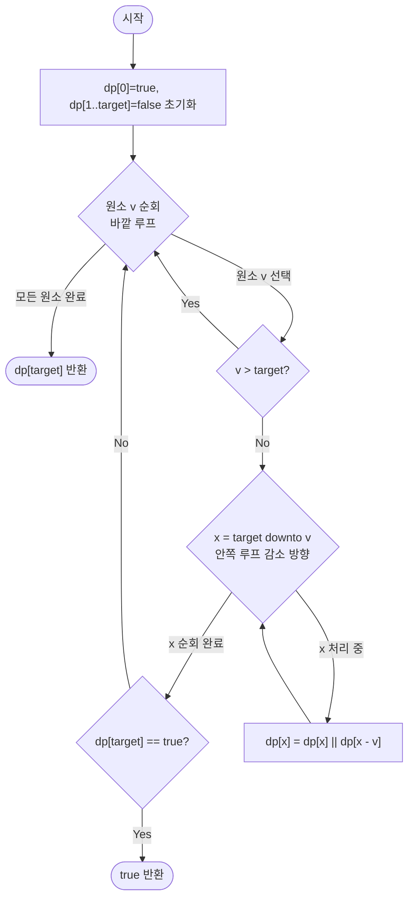

import { AlgorithmSimulation } from "#guide-sim";

# subsetSum — 부분집합을 세지 않고 "만들 수 있는 합의 집합"만 옮겨 다니는 이유

## 한눈에 보는 컨셉

배열에서 몇 개를 골라 합이 정확히 `target`이 되는 부분집합이 있는지 판정하는 문제예요. 핵심 관찰은 이렇습니다 — "어떤 원소들을 골랐는지"는 몰라도 되고, "지금까지 어떤 합들이 달성 가능한가"라는 참/거짓 정보만 `target+1`개의 칸에 들고 있으면 충분해요. 원소 하나를 새로 고려하면, 기존에 달성 가능했던 모든 합에 그 원소의 값만큼 더한 합도 새로 달성 가능해집니다 — 이 "집합의 이동"을 반복하면 `O(2^n)`이던 완전탐색이 `O(n \cdot target)`으로 줄어들어요.

## 출발점: 가장 순진한 방법부터

먼저 무엇을 풀어야 하는지 함수로 고정할게요.

```ts
function subsetSum(nums: number[], target: number): boolean
```

| 파라미터 | 의미 | 제약 |
|----------|------|------|
| `nums` | 비음의 정수 배열 (각 원소는 0번 또는 1번만 사용 가능) | 길이 $n$, $1 \le n \le 1000$, $0 \le nums[i] \le 10^4$ |
| `target` | 만들어야 하는 목표 합 | $0 \le target \le 10^4$ |
| 반환값 | 합이 정확히 `target`인 부분집합이 존재하면 `true`, 없으면 `false` | 부울 |

**존재 여부**를 묻는 문제니까, 가장 정직한 출발은 "모든 부분집합을 실제로 만들어서 그중에 합이 `target`인 게 있는지 확인한다"예요. 작은 예로 직접 세어 볼게요. `nums = [3, 1, 4]`, `target = 4`라고 합시다.

```text
부분집합       합    target=4?
{}              0     아니오
{3}             3     아니오
{1}             1     아니오
{4}             4     예   ← 존재!
{3,1}           4     예   ← 존재!
{3,4}           7     아니오
{1,4}           5     아니오
{3,1,4}         8     아니오

2^3 = 8가지 중 2개가 합 4를 만든다
```

이 나열을 재귀로 그대로 옮기면 이렇습니다. 각 원소마다 "포함한다 / 포함하지 않는다" 두 갈래로 갈라지는 트리를 타고 내려가는 구조예요.

```ts
function subsetSumNaive(nums: number[], target: number): boolean {
  function solve(index: number, remaining: number): boolean {
    if (remaining === 0) return true; // 남은 합이 0이면 지금까지 고른 원소들로 target 달성
    if (index === nums.length || remaining < 0) return false; // 원소가 바닥나거나 이미 초과
    if (solve(index + 1, remaining - nums[index]!)) return true; // 원소 index를 포함
    return solve(index + 1, remaining); // 원소 index를 포함하지 않음
  }
  return solve(0, target);
}
```

`nums=[3,1,4], target=4`로 돌리면 위 표와 똑같이 `true`를 반환합니다(뒤에서 실측으로 다시 확인해요).

`n = 1000`이면 어떨까요? 부분집합의 수는 $2^{1000} \approx 10^{301}$가지입니다. 우주의 나이(약 $10^{18}$초)보다도 훨씬 긴 시간이 걸려요. 이 방법은 정확하지만 **쓸 수 없습니다.**

제약을 다시 보면 목표가 보여요. 재귀가 실제로 만드는 상태는 `(index, remaining)` 쌍이고, 그 가짓수는 최대 $n \times (target+1) \approx 1000 \times 10001 \approx 10^7$가지뿐입니다. 각 상태를 `O(1)`에 처리할 수 있다면 목표 복잡도는 자연스럽게 `O(n \cdot target) \approx 10^7`이 되고, 1초 제한에서 통과 가능한 범위예요. 문제는 `solve(index, remaining)`가 같은 `(index, remaining)` 쌍을 서로 다른 경로(어떤 원소를 이미 포함했는지가 달라도)에서 몇 번이고 다시 계산한다는 점이에요 — 이 중복을 없애면 목표에 닿을 수 있습니다.

## 아이디어 자세히 들여다보기

### 달성 가능한 합의 집합만 추적하기 — 수식과 그림

`solve(index, remaining)`이 참/거짓 중 무엇을 반환하는지를 표에 저장해 두겠다는 뜻으로 $dp$라고 씁니다.

$$dp[i][x] = \text{"원소 } 0, 1, \ldots, i-1 \text{까지만 고려했을 때, 그 부분집합으로 합 } x \text{를 달성할 수 있는가?"}$$

여기서 "고려했다"는 그 원소를 포함했는지 안 했는지 이미 결정을 마쳤다는 뜻이에요. **어떤** 원소를 골랐는지는 상태에 없고, 오직 **몇 개까지 봤는지**(`i`)와 **지금 만들려는 합**(`x`) 두 숫자만 있습니다.

잠깐, 확인 하나만 해 볼까요? `nums=[3,1,4]`에서 `dp[2][4]`는 무슨 뜻일까요 — "원소 0, 1(값 3과 1)까지만 보고 합 4를 만들 수 있는가"입니다. 3과 1을 둘 다 더하면 정확히 4가 되니 `dp[2][4] = T`가 됩니다. 아래 표에서 직접 확인해 보세요.

원소 `i`(0-indexed, 값 $v_i$)를 새로 고려할 때 선택은 두 가지뿐입니다.

$$dp[i][x] = dp[i-1][x] \;\vee\; \bigl(x \ge v_i \;\wedge\; dp[i-1][x - v_i]\bigr)$$

같은 예로 표를 직접 채워 보면 이렇습니다. `nums=[3,1,4], target=4`.

```text
             x=0  1  2  3  4
i=0(원소없음)  T   F  F  F  F
i=1(+3)       T   F  F  T  F
i=2(+3,1)     T   T  F  T  T
i=3(+3,1,4)   T   T  F  T  T   ← dp[3][4] = T, 답
```

`i=2, x=4` 칸을 손으로 따라가 볼게요. 원소 1(값 1)을 포함하지 않으면 `dp[1][4]=F`, 포함하면 `dp[1][4-1] = dp[1][3] = T`. 둘 중 하나라도 참이면 `dp[2][4]=T`가 되고, 실제로 `dp[1][3]=T`이니 `dp[2][4]=T`입니다. 표의 값과 일치하죠.

**왜 하필 이 2차원 정의여야 할까요?** 두 가지 대안과 비교해 보면 이유가 뚜렷해집니다.

- **대안 A — 실제로 고른 원소들의 부분집합 자체를 상태로 둔다면?** 정확하지만 부분집합의 가짓수가 $2^n$개라 상태 공간 자체가 완전탐색과 같습니다. 앞서 본 naive 재귀와 다를 게 없어요.
- **대안 B — 인덱스 `i` 없이 `dp[x]`(달성 가능 여부)만 전역으로 둔다면?** 원소를 몇 번째까지 반영했는지 표현할 방법이 없어서, 같은 원소를 두 번 쓰는 것을 막을 수 없습니다(이 문제는 뒤에서 1D 배열로 압축할 때 다시 만납니다 — 그때는 **순회 방향**으로 해결해요).

`(i, x)` 2차원은 "원소 `i`를 포함할지 결정하는 데 필요한 만큼만" 담고 있는, 딱 맞는 크기의 상태입니다.

### 단서를 설명해 주는 이론 — 의존 범위 축소

위 점화식을 다시 보세요. $dp[i][x]$가 참조하는 항은 정확히 두 개, $dp[i-1][x]$와 $dp[i-1][x-v_i]$뿐입니다. **행 $i-2, i-3, \ldots$ 이전 행은 단 한 번도 등장하지 않습니다.** 이 사실에 이름을 붙여 두겠습니다.

> **의존 범위(dependency range)**: $dp[i][\cdot]$를 계산하는 데 필요한 전부는 $dp[i-1][\cdot]$ 한 행입니다. 그보다 오래된 행은 계산이 끝나는 즉시 다시 읽히지 않습니다.

왜 이게 중요할까요? 의존 범위가 딱 한 행이라면, 계산이 진행되는 동안 그보다 오래된 행들은 이미 다 쓸모가 없는 죽은 데이터예요. 메모리에 $n+1$개 행을 통째로 들고 있을 필요가 없다는 뜻입니다 — **이전 행 하나만 있으면 다음 행을 채울 수 있습니다.** 이 사실을 기억해 두세요. "더 빠르게 만들 단서 찾기" 절에서 이 관찰을 그대로 다시 소환해 2D 표를 1D 배열로 압축합니다.

### 왜 모순 없이 작동하는가

이 점화식이 항상 옳은 답을 낸다는 것을 귀납으로 확인해 볼게요.

**기저**: $dp[0][0] = T$, $dp[0][x] = F$ ($x > 0$). 원소를 하나도 고려하지 않았으니 빈 부분집합의 합인 0만 달성 가능합니다. 자명하게 참입니다.

**귀납 가정**: $dp[i-1][\cdot]$의 모든 칸이 "원소 $0..i-2$까지로 그 합을 실제로 달성할 수 있는지"를 정확히 나타낸다고 가정합니다.

**귀납 단계**: 원소 $i-1$(0-indexed, 위 점화식 표기로는 원소 $i$번째 고려 대상, 값 $v_{i-1}$)까지 포함해 합 $x$를 만들 수 있는지 생각해 보세요. 이 판정은 원소 $i-1$을 **포함하거나 포함하지 않거나** 둘 중 하나로만 갈립니다 — 그 외의 경우는 없습니다(0/1 제약이 정확히 이 두 가지만 허용하므로 **경우의 완전성**이 보장됩니다).

- 포함하지 않는 경우: 나머지 원소 $0..i-2$만으로 합 $x$를 달성할 수 있어야 하고, 귀납 가정에 의해 그 여부는 정확히 $dp[i-1][x]$입니다.
- 포함하는 경우: 원소 $i-1$의 값 $v_{i-1}$을 더해야 하므로, 남은 목표는 $x - v_{i-1}$이고 이를 원소 $0..i-2$로 달성할 수 있어야 합니다. 귀납 가정에 의해 그 여부는 정확히 $dp[i-1][x - v_{i-1}]$입니다(**각 경우의 정확성**, $x \ge v_{i-1}$일 때만 의미가 있습니다).

두 경우가 전부이고 각각의 값이 정확하므로, 둘 중 하나라도 참이면 $dp[i][x]$가 참입니다. 결론을 다시 말하는 게 아니라, "이 두 갈래 말고 다른 경우는 없다"와 "각 갈래의 값이 정확히 그 갈래의 사실이다"를 둘 다 확인했다는 점이 이 증명의 핵심입니다.

여기서 **헷갈리기 쉬운 포인트**가 있습니다. "의존 범위가 직전 행 하나"라는 사실을 너무 성급하게 "그럼 배열 하나로 덮어써도 되겠네"로 옮기는 것입니다. 맞는 결론이지만, 덮어쓰는 **순서**를 아무렇게나 정하면 틀립니다. 구체적으로 `nums=[3], target=6`을 봅시다 — 정답은 `false`입니다(3을 한 번만 쓸 수 있으니 6을 만들 방법이 없어요). 그런데 배열 하나를 **오름차순**(`x = v`부터 `target`까지 증가)으로 갱신하면:

```text
초기: dp = [T,F,F,F,F,F,F]  (x=0..6)

오름차순(v=3), x: 3 → 4 → 5 → 6
  x=3: dp[3] = dp[3] || dp[0] = F || T = T
  x=4: dp[4] = dp[4] || dp[1] = F || F = F
  x=5: dp[5] = dp[5] || dp[2] = F || F = F
  x=6: dp[6] = dp[6] || dp[3] = F || T = T   ← dp[3]이 "이번 원소 3으로 이미 갱신된" 값

최종 dp[6] = T   ✗ (정답 false와 다름 — 원소 3을 두 번 쓴 것과 같은 효과)
```

`x=6`을 갱신할 때 참조한 `dp[3]`이 바로 이 루프의 앞 단계(`x=3`)에서 이미 원소 3으로 갱신된 값이라, 마치 3을 두 번 담은 것 같은 결과가 나옵니다. 이 문제는 뒤의 "단서를 최적화로 연결하기"·"최적화 코드" 절에서 올바른 순회 방향으로 정확히 해소합니다 — 지금은 "행을 하나로 합칠 수 있다"는 결론만 옳고, "어떻게 합치느냐"는 아직 정해지지 않았다는 점만 기억해 두세요.

엣지 케이스에서도 정의가 무너지지 않는지 확인해 볼게요.

```text
nums가 빈 배열, target=0        → dp[0][0]=T 그대로 반환. 빈 부분집합의 합은 0이니 당연.
nums가 빈 배열, target>0        → 더할 원소가 없으므로 dp[0][target]=F 그대로 반환.
target=0 (nums 비어있지 않음)   → dp[i][0]은 모든 i에서 T 유지 (포함 안 하는 선택이 항상 가능)
원소 값 v > target인 원소       → x < v인 칸에서는 애초에 "포함" 분기가 조건을 만족 못 해 기여 없음
원소 값 v = 0인 원소             → dp[i][x] = dp[i-1][x] || dp[i-1][x-0] = dp[i-1][x] || dp[i-1][x], 변화 없음
```

## 아이디어를 코드로 옮기기

방금 정의한 점화식을 그대로 이중 반복문으로 옮깁니다.

```ts
function subsetSum2D(nums: number[], target: number): boolean {
  const n = nums.length;
  const dp: boolean[][] = Array.from({ length: n + 1 }, () =>
    new Array<boolean>(target + 1).fill(false),
  );
  dp[0]![0] = true; // 원소를 하나도 안 쓴 빈 부분집합의 합은 0

  for (let i = 1; i <= n; i++) {
    const v = nums[i - 1]!;
    for (let x = 0; x <= target; x++) {
      dp[i]![x] = dp[i - 1]![x]! || (x >= v && dp[i - 1]![x - v]!);
    }
  }
  return dp[n]![target]!;
}
```

**가장 실수가 잦은 줄은 `const v = nums[i - 1]!;`입니다.** 바깥 루프 `i`는 "몇 번째 행을 채우는가"를 나타내는 1-indexed 값이고, 배열 `nums`는 0-indexed이므로 반드시 `i - 1`로 접근해야 합니다. 그 외 결정 지점은 다음과 같습니다.

- 초기값: `dp`를 `(n+1) × (target+1)` 크기로 만들고 `false`로 채운 뒤 `dp[0][0]`만 `true`로 뒤집습니다. 행 `0`이 "원소를 하나도 안 본" 기저 조건을 정확히 표현합니다.
- 인덱스 경계: `x >= v` 가드가 없으면 `dp[i-1][x-v]`에서 음수 인덱스에 접근하게 됩니다.
- 순회 방향: 안쪽 루프는 `x = 0`부터 `target`까지 **아무 방향**으로 돌아도 결과가 같습니다. 각 칸이 오직 "바로 위 행"(`dp[i-1]`)만 참조하고, 같은 행 안의 다른 칸은 절대 참조하지 않기 때문이에요(이 성질이 뒤에서 1D로 압축할 때는 사라진다는 점을 미리 눈여겨봐 두세요).

## 더 빠르게 만들 단서 찾기

지금 구현은 시간 `O(n \cdot target)`, 공간도 `O(n \cdot target)`입니다. $n=1000, target=10^4$이면 표 전체가 $1001 \times 10001 \approx 10^7$칸이에요. 불리언 하나에 1바이트만 써도 10MB 안팎이라 256MB 제한 안에서는 아직 여유롭지만, 표를 실제로 어떻게 쓰고 있는지 관찰해 볼게요.

```text
행 i를 채우는 순간 실제로 읽는 행:   dp[i-1]  만
행 i를 채우고 나면 다시 읽는 행:     dp[i-1]  두 번 다시 안 읽음
행 i-2, i-3, ..., 0 은?             i행을 채운 뒤로는 완전히 죽은 데이터
```

앞서 "단서를 설명해 주는 이론" 절에서 기억해 두자고 한 사실이 바로 여기서 쓰입니다 — **의존 범위가 직전 행 하나**이므로, 두 번째 행을 채우고 나면 첫 번째 행보다 오래된 행들은 앞으로 영원히 참조되지 않습니다. 그런데도 2D 구현은 그 죽은 행들을 끝까지 메모리에 들고 있어요. 이게 낭비 지점입니다.

## 단서를 최적화로 연결하기

행을 통째로 유지하지 말고, **길이 `target+1`짜리 배열 하나**에 "지금까지 알아낸 달성 가능 여부"를 계속 덮어쓰면 어떨까요?

```text
Before (2D, 행마다 새 배열):
  dp[0] = [T,F,F,F,F]
  dp[1] = [T,F,F,T,F]     ← 원소 3 반영, 새 배열
  dp[2] = [T,T,F,T,T]     ← 원소 1 반영, 또 새 배열
  dp[3] = [T,T,F,T,T]     ← 원소 4 반영, 또 새 배열   (행 4개)

After (1D, 배열 하나를 계속 덮어쓰기):
  dp = [T,F,F,F,F]
  dp = [T,F,F,T,F]   ← 원소 3 반영, 같은 배열을 덮어씀
  dp = [T,T,F,T,T]   ← 원소 1 반영, 또 같은 배열을 덮어씀
  dp = [T,T,F,T,T]   ← 원소 4 반영, 또 같은 배열을 덮어씀   (배열 1개)
```

문제는 앞서 "왜 모순 없이 작동하는가" 절에서 미리 본 "덮어쓰는 순서"입니다. `dp[x]`를 새 값으로 갱신하려면 옛(행 `i-1`) 값인 `dp[x]`와 `dp[x - v]`가 **둘 다** 아직 이번 원소로 덮어써지지 않은 상태여야 합니다. `x - v < x`이므로, 지켜야 할 불변식은 이렇습니다.

> **불변식**: `dp[x]`를 갱신하는 시점에 `dp[x - v]`는 아직 이번 원소 `v`로 갱신되지 않은, 직전 행의 값이어야 한다.

이걸 지키는 방법은 하나뿐입니다 — 합 `x`를 **큰 값에서 작은 값 순서(내림차순)**로 순회하는 것입니다. `x`가 `target`부터 `v`까지 내려가면서 갱신되므로, `dp[x]`를 갱신하는 시점에 `dp[x - v]`(항상 `x`보다 작은 인덱스)는 아직 이번 루프에서 손대지 않은, 직전 행 값 그대로입니다. 앞서 `nums=[3], target=6`에서 오름차순이 만들어 낸 오답(`dp[6]=T`)이 바로 이 불변식을 어긴 결과였어요.

## 최적화 코드

바뀌는 부분은 배열을 2차원에서 1차원으로 줄이고, 안쪽 루프를 내림차순으로 도는 것, 그리고 `target`을 넘는 원소를 건너뛰는 가드와 조기 종료를 더하는 것입니다.

```ts
function subsetSum(nums: number[], target: number): boolean {
  const dp = new Array<boolean>(target + 1).fill(false);
  dp[0] = true;

  for (const v of nums) {
    if (v > target) continue; // target에 기여할 수 없는 원소는 건너뜀
    for (let x = target; x >= v; x--) { // 내림차순 — 여기가 가장 중요한 줄
      dp[x] = dp[x] || dp[x - v]!;
    }
    if (dp[target]) return true; // 조기 종료
  }
  return dp[target]!;
}
```

**가장 중요한 줄은 `for (let x = target; x >= v; x--)`입니다.** 이 방향을 오름차순으로 뒤집으면 어떻게 조용히 틀리는지는 이미 앞에서 `nums=[3], target=6`으로 확인했습니다 — 오름차순으로 돌면 `dp[x - v]`가 **이미 이번 원소로 갱신된** 값을 가리킬 수 있어서, 같은 원소를 여러 번 쓰는 효과가 생겨요. 이건 0/1 제약을 어기는, "각 원소를 무제한 사용할 수 있는" 배낭 문제의 동작입니다. 점화식은 완전히 똑같은데 순회 방향 하나만 다른 거예요.

> 기억법: **"큰 데서 작은 데로 — 위에서 아래로 내려오며 옛 값을 지킨다."** 내림차순이면 0/1(각 원소 최대 1번), 오름차순이면 무제한 사용.

전체 알고리즘을 의사코드로 정리하면 다음과 같습니다.

```text
function subsetSum(nums, target):
    dp = 길이 target+1 배열, 모두 false로 초기화
    dp[0] = true                                // 빈 부분집합의 합은 0

    for v in nums:                               // 원소를 하나씩 반영
        if v > target: continue                  // 기여 불가 원소 생략
        for x = target down to v:                // 반드시 내림차순
            dp[x] = dp[x] || dp[x - v]
        if dp[target]: return true                // 조기 종료(선택적 최적화)

    return dp[target]
```

더 최적화할 여지가 있을까요? 시간 복잡도는 `O(n \cdot target)`에서 점근적으로 더 줄지 않습니다 — subsetSum은 일반적으로 NP-complete인 부분집합 합 문제의 특수 케이스이고, 여기서 쓴 `O(n \cdot target)`은 `target`이 다항식 크기라서 가능한 **의사다항 시간(pseudo-polynomial time)** 해법입니다. 불리언 배열을 64비트 워드의 비트셋으로 표현해 병렬로 갱신하면 상수 인자를 `O(1/64)`로 낮추는 **비트셋 최적화**가 존재하긴 하지만, $n \le 1000, target \le 10^4$인 이 가이드의 제약에서는 `O(n \cdot target) \approx 10^7`인 지금 방법이 이미 1초 제한을 넉넉히 만족하고 구현도 가장 단순합니다 — 공간까지 `O(target)`으로 줄인 지금이 이 접근의 종착점입니다.

## 실행 시각화

예시 `nums = [3, 1, 4]`, `target = 4`에 대해 1D 불리언 DP가 원소를 하나씩 처리하며 "합 x를 만들 수 있는가"를 갱신하는 과정입니다. 각 행은 해당 원소까지 처리한 직후의 `dp[0..4]`(T=달성 가능, F=불가)이고, 열은 합 `x = 0..4`이다. 빨간 셀은 그 원소 처리로 F에서 T로 바뀐 칸이다. 실제 구현은 큰 합부터 내림차순으로 갱신해 각 원소를 1번만 쓴다.

실제 반환값은 `dp[4] = true` 이며 (부분집합 {4} 또는 {3,1}), 시뮬레이션 마지막 프레임 마지막 행 마지막 칸과 일치한다.

> 대화형 시뮬레이션은 MDX 런타임에서 표시됩니다.

export const cols = [0, 1, 2, 3, 4];

export const steps = [
  {
    title: "초기화",
    detail: "dp[0]=T (빈 부분집합), 나머지는 F.",
    rowLabels: ["init"], colLabels: cols,
    matrix: [["T", "F", "F", "F", "F"]],
    entries: [{ label: "처리 원소", value: "없음" }],
  },
  {
    title: "원소 3 처리",
    detail: "x=4..3 내림차순. dp[3]=dp[3]||dp[0]=T. dp[4]=dp[4]||dp[1]=F.",
    rowLabels: ["init", "v=3"], colLabels: cols,
    matrix: [
      ["T", "F", "F", "F", "F"],
      ["T", "F", "F", "T", "F"],
    ],
    cells: [[1, 3]],
    entries: [{ label: "처리 원소", value: "3" }],
  },
  {
    title: "원소 1 처리",
    detail: "x=4..1. dp[4]=dp[4]||dp[3]=T. dp[1]=dp[1]||dp[0]=T.",
    rowLabels: ["init", "v=3", "v=1"], colLabels: cols,
    matrix: [
      ["T", "F", "F", "F", "F"],
      ["T", "F", "F", "T", "F"],
      ["T", "T", "F", "T", "T"],
    ],
    cells: [[2, 1], [2, 4]],
    entries: [{ label: "처리 원소", value: "1" }],
  },
  {
    title: "원소 4 처리",
    detail: "x=4. dp[4]=dp[4]||dp[0]=T (이미 T, 변화 없음).",
    rowLabels: ["init", "v=3", "v=1", "v=4"], colLabels: cols,
    matrix: [
      ["T", "F", "F", "F", "F"],
      ["T", "F", "F", "T", "F"],
      ["T", "T", "F", "T", "T"],
      ["T", "T", "F", "T", "T"],
    ],
    cells: [[3, 4]],
    entries: [{ label: "처리 원소", value: "4" }],
  },
  {
    title: "완료",
    detail: "모든 원소 처리 완료. dp[4]=T -> 합 4인 부분집합 존재.",
    rowLabels: ["init", "v=3", "v=1", "v=4"], colLabels: cols,
    matrix: [
      ["T", "F", "F", "F", "F"],
      ["T", "F", "F", "T", "F"],
      ["T", "T", "F", "T", "T"],
      ["T", "T", "F", "T", "T"],
    ],
    cells: [[3, 4]],
    entries: [{ label: "반환값", value: "true" }],
  },
];

<AlgorithmSimulation view={["matrix", "keyValue"]} steps={steps} title="부분집합 합 DP" />

## 흐름 한눈에 보기



## 스스로 점검하기

1. `nums = [3, 34, 4, 12, 5, 2]`, `target = 9`에서 최종 1D 배열이 `dp[9]`를 `true`로 만드는 원소 조합을 손으로 찾아보세요. (힌트: `4 + 5 = 9`입니다. 원한다면 `dp[0..9]`를 원소를 하나씩 반영하며 직접 채워 보고 답과 맞춰 보세요.)
2. "최적화 코드" 절의 `for (let x = target; x >= v; x--)`를 오름차순(`for (let x = v; x <= target; x++)`)으로 바꾸면 `nums=[3], target=6`에서 어떤 값이 나오는지, 그리고 정확히 어느 시점에 `dp[x - v]`가 "이번 원소로 이미 갱신된" 값을 가리키게 되는지 짚어 보세요.
3. 만약 같은 원소를 여러 번 골라도 되는 문제로 바뀐다면(즉 무제한 사용), 1D 최적화 코드에서 무엇을 바꿔야 할까요? ("최적화 코드" 절에서 순회 방향 하나가 0/1 제약과 무제한 사용을 갈랐다는 점을 다시 떠올려 보세요.)
