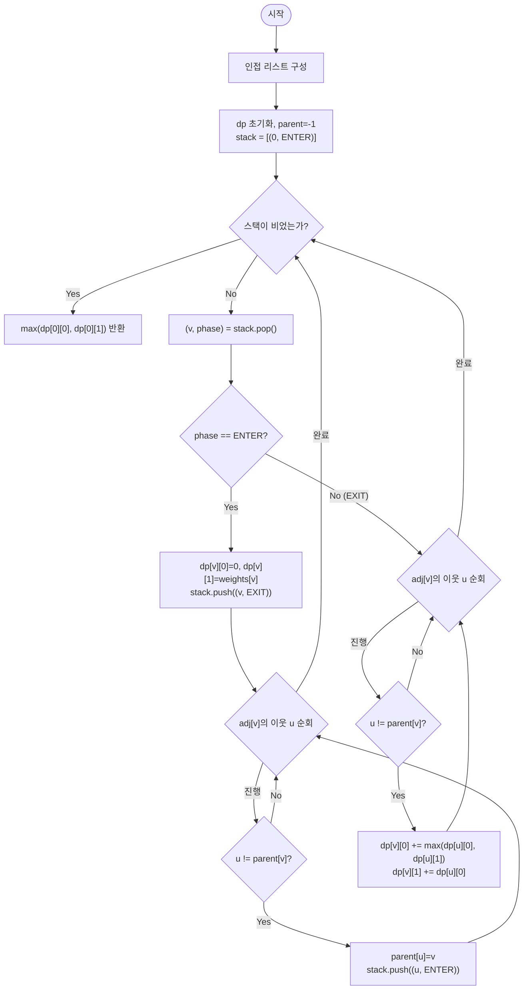

import { AlgorithmSimulation } from "#guide-sim";

# treeMaxIndependentSet — 왜 노드 하나당 값 두 개만 있으면 트리 전체가 풀리는가

## 한눈에 보는 컨셉

트리에서 인접한 두 노드를 동시에 고르지 못한다는 조건 아래 가중치 합을 최대화하는 문제예요. 트리는 서로 다른 자식의 서브트리끼리 간선이 전혀 없다는 성질 덕분에, 각 노드에서 "선택했을 때"와 "선택하지 않았을 때" 딱 두 값만 들고 리프에서 루트로 거슬러 올라가면 전체 최적이 자동으로 맞춰집니다. 일반 그래프라면 NP-완전인 최대 독립집합 문제가, 트리라는 계층 구조 하나 덕분에 `O(n)`으로 풀리는 것이 이번 이야기의 핵심입니다.

## 출발점: 가장 순진한 방법부터

문제를 먼저 정확히 고정할게요.

```ts
function treeMaxIndependentSet(
  n: number,
  edges: [number, number][],
  weights: number[],
): number
```

| 항목 | 의미 | 제약 |
|------|------|------|
| `n` | 노드 수 | $1 \leq n \leq 10^5$ |
| `edges` | 무방향 간선 목록 (트리) | 길이 $n-1$, 사이클 없는 연결 그래프 |
| `weights` | 노드별 가중치 | 길이 $n$, $-10^4 \leq weights[i] \leq 10^4$ |
| 반환값 | 어떤 두 인접 노드도 함께 포함하지 않는 부분집합의 가중치 합 최댓값 | 빈 집합(합 0)도 유효한 후보 |

"최댓값을 구하라"는 문제를 만나면 가장 정직한 첫 반응은 "가능한 후보를 전부 나열해서 조건을 만족하는 것 중 최댓값을 고르자"예요. 여기서 후보는 "독립집합(어떤 두 원소도 인접하지 않는 부분집합)"입니다. 노드가 $n$개면 부분집합은 $2^n$가지이므로, 그대로 코드로 옮기면 이렇습니다.

```ts
function treeMaxIndependentSetNaive(
  n: number,
  edges: [number, number][],
  weights: number[],
): number {
  let best = 0;
  for (let mask = 0; mask < (1 << n); mask++) {
    let independent = true;
    for (const [u, v] of edges) {
      if ((mask & (1 << u)) && (mask & (1 << v))) {
        independent = false; // 인접한 두 노드가 함께 뽑혔다
        break;
      }
    }
    if (!independent) continue;
    let sum = 0;
    for (let i = 0; i < n; i++) if (mask & (1 << i)) sum += weights[i];
    best = Math.max(best, sum);
  }
  return best;
}
```

작은 예로 비용을 직접 세어 봅시다. 별 모양 트리 `n=4, edges=[[0,1],[0,2],[0,3]], weights=[1,10,10,10]`이면 부분집합은 16개예요.

```text
mask(2진)  부분집합        독립?   합
0000       {}              O       0
0001       {0}             O       1
0010       {1}             O       10
1110       {1,2,3}         O       30   ← 최댓값
1111       {0,1,2,3}       X       (0과 1이 인접)
...

n=4  → 2^4  = 16가지, 눈으로도 다 셀 수 있다
n=10^5 → 2^100000가지 → 우주 나이보다 긴 시간, 애초에 표현조차 불가능
```

$n \leq 10^5$인데 시간 제한이 1초라면, 우리가 노려야 할 목표는 각 노드를 상수 번(대략 한 번) 처리하는 정도 — 즉 `O(n)`이에요. 지수 시간에서 선형 시간으로 가려면 $2^n$개의 후보를 개별적으로 검사하는 대신, **후보들 사이의 공통 구조**를 찾아 한 번에 여러 후보를 처리해야 합니다. 그런데 naive 코드를 보면 그래프의 형태(트리라는 사실)를 전혀 쓰지 않고 있어요 — `edges`를 그저 "인접 쌍 목록"으로만 취급하죠. 트리에는 일반 그래프에 없는 특별한 구조(부모-자식 계층)가 있다는 게 다음 절의 출발점입니다.

## 아이디어 자세히 들여다보기

### 선택 여부 두 값만 기억하면 충분하다 — 수식과 그림

트리의 한 노드 $v$를 임의로 루트로 잡으면(이 문제에서는 노드 0), 모든 노드가 유일한 부모를 가지는 계층 구조가 만들어져요. 여기서 결정적인 관찰이 있습니다.

> **서로 다른 자식의 서브트리 사이에는 간선이 없다.** 트리의 정의(사이클 없는 연결 그래프) 때문에, 자식 $u_1$의 서브트리에 속한 어떤 노드도 자식 $u_2$의 서브트리에 속한 노드와 인접할 수 없어요.

```text
        v
      / | \
     u1 u2 u3
    /|  |  |\
   ..  ..  .. ..
   (u1 서브트리)  (u2 서브트리)  (u3 서브트리)

   u1 서브트리 안의 어떤 노드도 u2·u3 서브트리 노드와 간선으로 안 이어져 있다
   → 세 서브트리를 "따로따로" 최적화해서 그냥 더해도 안전하다
```

그렇다면 남은 문제는 하나뿐이에요 — $v$ 자신을 선택하느냐 마느냐가 $v$의 부모와 자식에게만 영향을 미친다는 것. 그래서 각 노드 $v$에 대해 두 값을 정의합니다.

$$dp[v][0] = v \text{를 선택하지 않을 때, } v \text{의 서브트리(자기 자신 포함)에서 얻는 최대 가중치 합}$$

$$dp[v][1] = v \text{를 선택할 때, } v \text{의 서브트리에서 얻는 최대 가중치 합}$$

**왜 값 하나(그 서브트리의 최댓값)로는 부족할까요?** 부모가 $v$를 선택하려면 "$v$가 선택되지 않은 경우의 서브트리 최댓값"이 따로 필요합니다. 값을 하나만 들고 올라가면 그 값이 $v$를 포함하는지 아닌지 부모가 알 수 없어서, 부모가 $v$를 선택했을 때 실수로 $v$까지 포함된 합을 더해 버릴 위험이 있어요. 그래서 "선택함/안 함" 두 갈래를 분리해서 들고 올라가야, 부모가 자신의 상황에 맞는 값을 정확히 골라 쓸 수 있습니다.

작은 예로 확인해 볼까요? 별 모양 트리(`0`이 루트, 자식 `1,2,3`, 가중치 `[1,10,10,10]`)에서 리프 노드 `1`의 값은 $dp[1][0]=0$(선택 안 하면 그 서브트리에 아무도 없으니 합 0), $dp[1][1]=10$(선택하면 자기 가중치)입니다.

**확인 질문 하나** — 리프 노드는 자식이 없으니 항상 $dp[v][0]=0$, $dp[v][1]=weights[v]$가 됩니다. 그렇다면 $n=1$(노드 하나뿐인 트리)일 때 답은 어떻게 나올까요? 정답은 $\max(0, weights[0])$이에요 — 가중치가 음수면 아무도 선택하지 않는 빈 집합(합 0)이 이깁니다.

### 단서를 설명해 주는 이론 — 최적 부분 구조(principle of optimality)

방금 "서브트리를 따로 최적화해서 더해도 안전하다"고 했는데, 이건 동적 계획법 전체를 떠받치는 일반 이론인 **최적 부분 구조(optimal substructure)**, 벨만의 최적성 원리(Bellman's principle of optimality)의 한 사례입니다. 원리를 풀어 쓰면 이렇습니다.

> 전체 문제의 최적해는, 그 문제를 이루는 부분 문제들 각각의 최적해로부터 구성될 수 있다 — 단, 부분 문제들이 서로 독립적이어야 한다(한 부분 문제의 선택이 다른 부분 문제의 선택 가능 범위를 바꾸지 않아야 한다).

일반 그래프에서 최대 독립집합이 NP-완전인 이유가 바로 이 "독립성"이 깨지기 때문이에요 — 임의의 그래프에서는 노드 $v$를 제외해도 남은 그래프의 "부분 문제들"이 복잡하게 서로 얽혀 있어(어떤 두 부분이 서로 인접할 수 있어), 부분해를 단순히 합산할 수 없습니다. 반면 트리는 한 노드를 기준으로 자르면 자식 서브트리들이 간선으로 전혀 연결되지 않으니, 정확히 "부분 문제들이 서로 독립적"이라는 원리의 전제가 성립해요. 그래서 각 서브트리의 최적해(=$dp[u][\cdot]$)를 구해 두고 단순히 더하기만 해도 전체 최적이 보장되는 겁니다. 이 이론은 뒤의 "왜 모순 없이 작동하는가"에서 귀납 증명의 근거로 다시 쓰이니 기억해 두세요.

### 셈을 맡는 자료구조 — 명시적 스택

이 문제는 재귀 DFS로 자연스럽게 풀리지만, 뒤에서 볼 최적화 코드는 재귀 호출 스택을 명시적 스택(explicit stack)으로 직접 흉내 냅니다. 스택이 "현재 어디까지 내려갔다가 어디로 되돌아가야 하는지"를 기억하는 역할을 재귀 호출 스택 대신 떠맡는 셈이에요. 스택 자료구조 자체가 궁금하다면 이 프로젝트의 [stack 가이드](../../../data-structures/linear/stack/stack-guide.mdx)를 참고하세요 — 여기서는 "push/pop이 `O(1)`인 후입선출 저장소"로만 쓰면 충분합니다.

### 왜 모순 없이 작동하는가

귀납적으로 정당화해 봅시다.

**기저(리프 노드)**: 자식이 없는 노드 $v$는 $dp[v][0]=0$(아무도 선택하지 않은 서브트리, 합 0), $dp[v][1]=weights[v]$(자기 자신만 선택)입니다. 자명하게 옳습니다.

**귀납 단계(내부 노드)**: 노드 $v$의 모든 자식 $u \in C(v)$에 대해 $dp[u][0], dp[u][1]$이 각 서브트리에서 정확한 최댓값이라고 가정합니다(귀납 가정). $v$에서 가능한 경우는 딱 둘 — "선택한다" 또는 "선택하지 않는다" — 이고 이 둘이 전부입니다(경우의 완전성: 이분법이라 제3의 선택지가 없어요).

- $v$를 선택하지 않으면, 앞 절의 최적 부분 구조 원리에 의해 서로 독립적인 자식 서브트리 각각을 자유롭게 최적화해도 됩니다 — 자식 $u$는 선택하든 안 하든 상관없으니 $\max(dp[u][0], dp[u][1])$을 고르고, 이걸 모든 자식에 대해 합산한 값이 최적입니다. 이게 $dp[v][0] = \sum_{u \in C(v)} \max(dp[u][0], dp[u][1])$입니다.
- $v$를 선택하면, 인접한 자식들은 전부 배제해야 하므로 각 자식은 반드시 $dp[u][0]$(선택 안 함)만 쓸 수 있습니다. 이게 $dp[v][1] = weights[v] + \sum_{u \in C(v)} dp[u][0]$입니다.

두 경우 모두 "그 경우가 주어졌을 때의 최적"을 정확히 계산했고, 두 경우가 전체 가능성을 남김없이 덮으므로 $\max(dp[v][0], dp[v][1])$이 $v$의 서브트리에서의 전체 최적이 됩니다.

여기서 **헷갈리기 쉬운 포인트**가 하나 있습니다. "$v$를 선택하면 자식만이 아니라 손자(자식의 자식)까지 전부 배제해야 하는 것 아닌가?"라는 오해예요. 답은 "아니오"입니다 — $v$를 선택하면 배제되는 건 **직접 인접한 자식**뿐이고, 손자는 $dp[u][0]$ 안에서 이미 자유롭게 선택 여부가 최적화되어 있어요. 구체적으로 확인해 봅시다.

```text
경로 트리: 0 - 1 - 2,  weights = [5, 1, 5]

dp[2] (리프)  = [0, 5]
dp[1]         : 자식은 {2}뿐
  dp[1][0] = max(dp[2][0], dp[2][1]) = max(0,5) = 5
  dp[1][1] = weights[1] + dp[2][0]   = 1 + 0   = 1
dp[0]         : 자식은 {1}뿐
  dp[0][0] = max(dp[1][0], dp[1][1]) = max(5,1) = 5
  dp[0][1] = weights[0] + dp[1][0]   = 5 + 5   = 10   ← 여기!

답 = max(dp[0][0], dp[0][1]) = max(5, 10) = 10
```

$dp[0][1]=10$은 "노드 0을 선택한 경우"인데, 그 값 안에 노드 2(0의 손자)가 이미 선택되어 있습니다(`dp[1][0]=5`는 노드 1을 선택하지 않고 노드 2를 선택한 결과예요). 즉 노드 0과 노드 2를 동시에 선택한 합 `5+5=10`이 정확히 이 값입니다 — 손자는 배제 대상이 아니라는 뜻이죠. "선택 배제는 딱 한 단계(부모-자식)에서만 전파된다"는 것, 실측으로 확인했으니 잊지 마세요.

엣지 케이스도 짚고 넘어갈게요.

```text
n=1, weights=[5]        →  dp[0]=[0,5]   →  max=5   (혼자면 그대로 선택)
n=1, weights=[-3]       →  dp[0]=[0,-3]  →  max=0   (선택 안 하는 게 이득)
모든 가중치 음수, n=3    →  각 dp[v][1] < 0 →  max=0   (아무도 선택 안 함)
별 모양(n=4, [1,10,10,10]) →  dp[0]=[30,1] →  max=30  (자식 셋 모두 선택)
```

## 아이디어를 코드로 옮기기

앞 절 점화식을 그대로 재귀 DFS로 옮기면 이렇습니다.

```ts
function treeMaxIndependentSet(
  n: number,
  edges: [number, number][],
  weights: number[],
): number {
  const adj: number[][] = Array.from({ length: n }, () => []);
  for (const [u, v] of edges) {
    adj[u].push(v);
    adj[v].push(u);
  }

  // dfs(v, parent)는 [dp[v][0], dp[v][1]]을 반환한다
  function dfs(v: number, parent: number): [number, number] {
    let notTaken = 0;
    let taken = weights[v];
    for (const u of adj[v]) {
      if (u === parent) continue; // 부모 방향은 자식이 아니다
      const [childNotTaken, childTaken] = dfs(u, v);
      notTaken += Math.max(childNotTaken, childTaken);
      taken += childNotTaken;
    }
    return [notTaken, taken];
  }

  const [rootNotTaken, rootTaken] = dfs(0, -1);
  return Math.max(rootNotTaken, rootTaken);
}
```

결정 지점만 짚을게요. `notTaken`은 `0`에서, `taken`은 `weights[v]`에서 시작해야 합니다 — 자식을 아직 하나도 안 본 시점의 초기값이 각 정의($dp[v][0]$은 빈 서브트리 기여 0, $dp[v][1]$은 자기 가중치)와 일치해야 하니까요. 순회 방향은 자식으로만 내려가야 하므로, `adj[v]`에는 부모도 섞여 있다는 걸 잊으면 안 됩니다.

**가장 중요한 줄은 `if (u === parent) continue;`입니다.** 무방향 간선으로 만든 인접 리스트는 부모와 자식을 구분하지 못해요. 이 줄이 없으면 DFS가 부모 방향으로도 내려가려다 무한 재귀에 빠지거나(스택 오버플로), 부모의 미완성 값을 자식의 기여인 것처럼 합산해 답이 틀어집니다.

## 더 빠르게 만들 단서 찾기

이 재귀 DFS는 이미 각 노드를 정확히 한 번 방문하니 시간 복잡도는 목표대로 `O(n)`이에요. 그런데 "빠르다"와 별개로 관찰할 게 하나 더 있습니다 — **재귀 호출 스택의 깊이**입니다.

```text
균형 잡힌 트리라면:      호출 깊이 ≈ log n   → 문제 없음
한쪽으로 치우친 트리라면: 호출 깊이 ≈ n       → 위험!

예: 0-1-2-3-...-99999 인 "사실상 연결 리스트"인 트리(n=100000)
    dfs(0) → dfs(1) → dfs(2) → ... → dfs(99999)
    재귀 호출 100,000단계가 콜스택에 쌓인다
```

실제로 이 경로 모양 트리(n=100,000)에 대해 위 재귀 코드를 그대로 실행해 보면 `RangeError: Maximum call stack size exceeded`가 발생합니다. 시간 복잡도표에는 잡히지 않지만, 알고리즘이 "정답을 내기 전에 죽는" 실전 문제예요. $n \leq 10^5$라는 제약이 바로 이 위험을 가리키고 있습니다. 재귀가 쓰는 콜스택도 결국 스택이니, **재귀 호출을 우리가 직접 관리하는 배열 기반 스택으로 바꾸면** 똑같은 순회를 스택 오버플로 없이 해낼 수 있습니다.

## 단서를 최적화로 연결하기

재귀 함수가 호출될 때마다 언어 런타임이 콜스택에 쌓는 정보(현재 어느 줄까지 실행했는지, 지역 변수 값)를 우리가 직접 배열로 흉내 내면 됩니다. 후위 순회(자식을 모두 처리한 뒤 부모를 처리)를 흉내 내려면 각 노드를 **두 단계**로 스택에 넣습니다.

- **ENTER**: 처음 이 노드에 도달했을 때. `dp[v]` 초기값을 세팅하고, 자식들을 ENTER 단계로 스택에 쌓는다.
- **EXIT**: 모든 자식의 ENTER/EXIT가 끝난 뒤. 자식들의 `dp` 값을 합산해 `dp[v]`를 완성한다.

```text
Before (재귀):                       After (명시적 스택, ENTER/EXIT):

dfs(0)                                stack = [(0,ENTER)]
 └ dfs(1)                             pop (0,ENTER) → push (0,EXIT), push (1,ENTER)
    └ dfs(2)  ← 콜스택이 이만큼 쌓임    stack = [(0,EXIT), (1,ENTER)]
       └ ...                          pop (1,ENTER) → push (1,EXIT), push (2,ENTER)
                                       stack = [(0,EXIT), (1,EXIT), (2,ENTER)]
                                       ...  (콜스택 대신 힙에 할당된 배열이 깊이를 감당)
```

핵심 불변식은 이거예요 — **한 노드의 EXIT 프레임은, 그 노드가 push한 모든 자식 ENTER 프레임보다 스택에서 항상 아래에 깔린다.** LIFO(후입선출) 구조상 위에 쌓인 자식 프레임들이 전부 처리(pop)되어야 그 아래의 EXIT 프레임이 드러나므로, "모든 자식이 끝난 뒤 부모 처리"라는 후위 순회 순서가 자동으로 보장됩니다.

## 최적화 코드

바뀌는 부분은 순회 방식 전체가 재귀에서 반복으로 바뀌지만, 점화식 자체는 그대로예요.

```ts
function treeMaxIndependentSet(
  n: number,
  edges: [number, number][],
  weights: number[],
): number {
  const adj: number[][] = Array.from({ length: n }, () => []);
  for (const [u, v] of edges) {
    adj[u].push(v);
    adj[v].push(u);
  }

  const dp0 = new Array(n).fill(0); // dp[v][0]
  const dp1 = new Array(n).fill(0); // dp[v][1]
  const parent = new Array(n).fill(-1);

  type Frame = { v: number; phase: "ENTER" | "EXIT" };
  const stack: Frame[] = [{ v: 0, phase: "ENTER" }];

  while (stack.length > 0) {
    const { v, phase } = stack.pop()!;
    if (phase === "ENTER") {
      dp0[v] = 0;
      dp1[v] = weights[v];
      stack.push({ v, phase: "EXIT" }); // 자식보다 먼저 예약 — LIFO로 맨 밑에 깔린다
      for (const u of adj[v]) {
        if (u === parent[v]) continue;
        parent[u] = v;
        stack.push({ v: u, phase: "ENTER" });
      }
    } else {
      for (const u of adj[v]) {
        if (u === parent[v]) continue; // 이 줄을 빠뜨리면 부모를 자식으로 오인한다
        dp0[v] += Math.max(dp0[u], dp1[u]);
        dp1[v] += dp0[u];
      }
    }
  }

  return Math.max(dp0[0], dp1[0]);
}
```

**가장 중요한 줄은 `stack.push({ v, phase: "EXIT" })`를 자식들을 push하기 *전*에 실행하는 것입니다.** 순서를 뒤집어 자식들을 먼저 push하고 EXIT를 나중에 push하면, EXIT 프레임이 자식 프레임들보다 위에 쌓여 자식이 끝나기도 전에 부모의 EXIT가 먼저 pop됩니다.

EXIT 블록의 `if (u === parent[v]) continue;`도 여전히 필수입니다. 이걸 빠뜨리면 무슨 일이 벌어지는지 손 검산으로 확인해 볼게요. 경로 트리 `0-1-2, weights=[5,1,5]`(정답 10)에서 이 줄을 지우면, 노드 1의 EXIT 단계가 부모 방향인 노드 0의 (아직 미완성인) `dp0[0], dp1[0]` 값까지 자식인 것처럼 합산해 버려 최종 결과가 `10`이 아니라 **15**로 잘못 나옵니다 — 시간 복잡도표에는 안 잡히지만 조용히 틀리는 전형적인 사례예요.

> 기억법: "EXIT는 자식보다 먼저 예약, 부모는 언제나 continue."

시간 복잡도는 재귀 버전과 동일하게 `O(n)`(노드·간선을 각각 상수 번), 공간 복잡도도 인접 리스트·`dp` 배열·스택이 모두 `O(n)`으로 목표를 그대로 달성했습니다. 트리에서 최대 독립집합을 구하는 한, 모든 노드의 가중치를 적어도 한 번은 읽어야 하므로 `O(n)`은 점근적으로 최선이기도 해요.

더 개선할 여지가 있을까요? 이 문제는 루트가 노드 `0`으로 고정돼 있어서 지금 구조로 충분합니다. 만약 "모든 노드 각각을 루트로 삼았을 때의 답을 전부 구하라"는 문제였다면 트리 리루팅(re-rooting) 기법이 필요한데, 이는 이 프로젝트의 [treeRerooting 가이드](../../tree/treeRerooting/treeRerooting-guide.mdx)에서 다루는 별개의 주제입니다. 지금 문제는 그 정도까지 필요 없다는 점, 즉 "필요한 만큼만 일반화한다"는 것도 이 풀이가 가진 장점입니다.

## 실행 시각화

별 모양 트리 `n = 4`, `edges = [[0,1],[0,2],[0,3]]`, `weights = [1,10,10,10]`(루트 0, 자식 1·2·3)에 대해 후위 순회 트리 DP를 수행하는 과정입니다. tree 패널은 후위 순회 진행 상태(파랑=처리 중/active, 회색=완료/done)를, matrix 패널은 각 노드의 `dp[v][0]`(미선택)·`dp[v][1]`(선택) 값을 보여줍니다. 빨간 셀은 그 단계에서 확정된 dp 값입니다.

실제 반환값은 `max(dp[0][0], dp[0][1]) = max(30, 1) = 30`(자식 1,2,3 선택)이며, 시뮬레이션 마지막 프레임과 일치합니다.

> 대화형 시뮬레이션은 MDX 런타임에서 표시됩니다.

export const rows = ["node 0", "node 1", "node 2", "node 3"];
export const cols = ["미선택 [0]", "선택 [1]"];

export const tree0 = {
  id: 0, label: "0 (w=1)",
  children: [
    { id: 1, label: "1 (w=10)" },
    { id: 2, label: "2 (w=10)" },
    { id: 3, label: "3 (w=10)" },
  ],
};

export const steps = [
  {
    title: "초기화",
    detail: "루트 0에서 후위 순회 시작. dp는 아직 미계산.",
    root: tree0,
    rowLabels: rows, colLabels: cols,
    matrix: [
      [null, null],
      [null, null],
      [null, null],
      [null, null],
    ],
    entries: [{ label: "단계", value: "DFS 시작" }],
  },
  {
    title: "리프 1 처리 (EXIT)",
    detail: "자식 없음. dp[1][0]=0, dp[1][1]=weights[1]=10.",
    root: {
      id: 0, label: "0 (w=1)",
      children: [
        { id: 1, label: "1 (w=10)", status: "active" },
        { id: 2, label: "2 (w=10)" },
        { id: 3, label: "3 (w=10)" },
      ],
    },
    rowLabels: rows, colLabels: cols,
    matrix: [
      [null, null],
      [0, 10],
      [null, null],
      [null, null],
    ],
    cells: [[1, 0], [1, 1]],
    entries: [{ label: "처리 노드", value: "1 (리프)" }],
  },
  {
    title: "리프 2 처리 (EXIT)",
    detail: "dp[2][0]=0, dp[2][1]=10.",
    root: {
      id: 0, label: "0 (w=1)",
      children: [
        { id: 1, label: "1 (w=10)", status: "done" },
        { id: 2, label: "2 (w=10)", status: "active" },
        { id: 3, label: "3 (w=10)" },
      ],
    },
    rowLabels: rows, colLabels: cols,
    matrix: [
      [null, null],
      [0, 10],
      [0, 10],
      [null, null],
    ],
    cells: [[2, 0], [2, 1]],
    entries: [{ label: "처리 노드", value: "2 (리프)" }],
  },
  {
    title: "리프 3 처리 (EXIT)",
    detail: "dp[3][0]=0, dp[3][1]=10.",
    root: {
      id: 0, label: "0 (w=1)",
      children: [
        { id: 1, label: "1 (w=10)", status: "done" },
        { id: 2, label: "2 (w=10)", status: "done" },
        { id: 3, label: "3 (w=10)", status: "active" },
      ],
    },
    rowLabels: rows, colLabels: cols,
    matrix: [
      [null, null],
      [0, 10],
      [0, 10],
      [0, 10],
    ],
    cells: [[3, 0], [3, 1]],
    entries: [{ label: "처리 노드", value: "3 (리프)" }],
  },
  {
    title: "루트 0 처리 (EXIT)",
    detail: "dp[0][0]=Σ max(dp[u][0],dp[u][1])=10+10+10=30. dp[0][1]=1+Σ dp[u][0]=1+0=1.",
    root: {
      id: 0, label: "0 (w=1)", status: "active",
      children: [
        { id: 1, label: "1 (w=10)", status: "done" },
        { id: 2, label: "2 (w=10)", status: "done" },
        { id: 3, label: "3 (w=10)", status: "done" },
      ],
    },
    rowLabels: rows, colLabels: cols,
    matrix: [
      [30, 1],
      [0, 10],
      [0, 10],
      [0, 10],
    ],
    cells: [[0, 0], [0, 1]],
    entries: [
      { label: "dp[0][0]", value: 30 },
      { label: "dp[0][1]", value: 1 },
    ],
  },
  {
    title: "완료",
    detail: "max(dp[0][0], dp[0][1]) = max(30, 1) = 30. 자식 1,2,3 선택.",
    root: {
      id: 0, label: "0 (w=1)", status: "done",
      children: [
        { id: 1, label: "1 (w=10)", status: "done" },
        { id: 2, label: "2 (w=10)", status: "done" },
        { id: 3, label: "3 (w=10)", status: "done" },
      ],
    },
    rowLabels: rows, colLabels: cols,
    matrix: [
      [30, 1],
      [0, 10],
      [0, 10],
      [0, 10],
    ],
    cells: [[0, 0]],
    entries: [{ label: "반환값", value: 30 }],
  },
];

<AlgorithmSimulation view={["tree", "matrix"]} steps={steps} title="트리 최대 가중 독립집합" />

## 흐름 한눈에 보기



## 스스로 점검하기

1. 경로 트리 `n=4, edges=[[0,1],[1,2],[2,3]], weights=[10,1,1,10]`에서 리프부터 손으로 `dp` 표를 채워 보세요. 최종 답은 무엇이고, 어떤 노드들이 선택되었을 때 그 값이 나오나요? (답: `20`, 노드 0과 노드 3을 선택할 때입니다.)
2. 최적화 코드의 EXIT 블록에서 `if (u === parent[v]) continue;`를 지우면 경로 트리 `n=3, edges=[[0,1],[1,2]], weights=[5,1,5]`(정답 `10`)의 결과가 어떻게 달라질까요? 어느 노드의 EXIT 단계에서, 어떤 값이 잘못 더해지는지 단계별로 추적해 보세요.
3. 만약 트리가 아니라 사이클이 정확히 하나 있는 그래프(unicyclic graph, 간선 수가 노드 수와 같은 연결 그래프)라면 이 알고리즘을 어떻게 확장할 수 있을까요? (힌트: 원형으로 배열된 집을 터는 문제에서 쓰는 트릭 — 사이클의 특정 간선 하나를 제거해 트리로 만든 뒤 계산하는 것을 사이클의 각 간선에 대해 반복하거나, 순환을 끊는 노드 하나의 선택 여부를 고정하고 두 번 계산하는 방식을 떠올려 보세요.)
