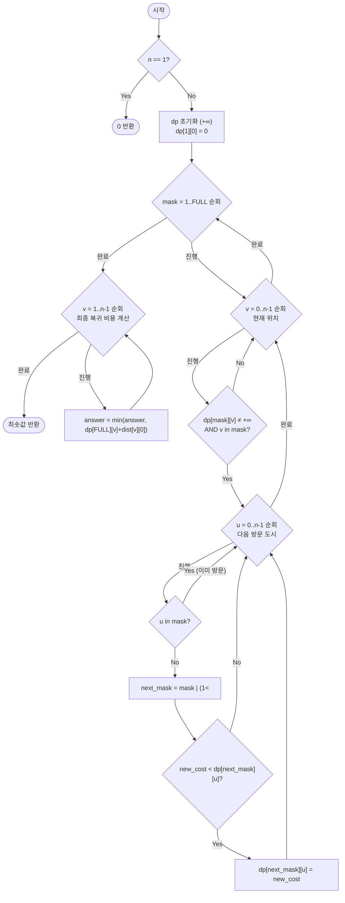

import { AlgorithmSimulation } from "#guide-sim";

# tspBitmask — 방문 순서가 아니라 방문 집합만 기억하면 상태가 n!에서 2ⁿ·n개로 줄어드는 이유

## 한눈에 보는 컨셉

외판원 문제(TSP)는 모든 도시를 한 번씩 들르고 출발지로 돌아오는 최소 비용 경로를 찾는 문제예요. "어떤 순서로 방문했는가"는 사실 남은 계산에 영향을 주지 않고, "지금까지 어떤 도시들을 방문했는가(집합)"와 "지금 어디에 있는가(현재 위치)"만 중요합니다. 이 집합을 `n`비트 정수(비트마스크)로 압축해 `dp[mask][v]`라는 상태로 재사용하면, `(n-1)!`가지 순열을 전부 세던 일이 `O(n^2 \cdot 2^n)`으로 줄어듭니다.

## 출발점: 가장 순진한 방법부터

문제를 먼저 정확히 잡을게요.

```ts
function tspBitmask(dist: number[][]): number
```

| 파라미터 | 의미 | 제약 |
|----------|------|------|
| `dist` | $n \times n$ 거리 행렬, `dist[i][j]`는 도시 $i \to j$ 이동 비용 | $1 \leq n \leq 20$, $0 \leq dist[i][j] \leq 10^6$, $dist[i][i]=0$ |
| 반환값 | 도시 $0$에서 출발해 모든 도시를 정확히 한 번씩 방문하고 도시 $0$으로 복귀하는 최소 비용 | $\geq 0$ |

방향 그래프도 허용됩니다($dist[i][j] \neq dist[j][i]$일 수 있어요). 엣지케이스는 다음과 같습니다.

| 입력 | 기대 출력 | 이유 |
|------|-----------|------|
| `dist=[[0]]` | `0` | 도시 1개, 이동 없음 |
| `dist=[[0,10],[10,0]]` | `20` | 0→1→0: 10+10 |
| `dist=[[0,1,2],[2,0,1],[1,2,0]]` | `3` | 0→1→2→0: 1+1+1 |
| `dist=[[0,1,10],[10,0,1],[1,10,0]]`(비대칭) | `3` | 0→1→2→0: 1+1+1, 방향성 유지 |

"모든 도시를 한 번씩 방문하는 최소 비용 경로"라는 조건을 보면 가장 정직한 접근은 **가능한 방문 순서를 전부 나열해 보는 것**입니다. 도시 0에서 출발해 나머지 도시들의 순열을 하나씩 시도하고 비용을 재는 재귀로 옮기면 이렇게 됩니다.

```ts
function tspNaive(dist: number[][]): number {
  const n = dist.length;
  if (n === 1) return 0;

  function search(current: number, visited: number, cost: number): number {
    if (visited === (1 << n) - 1) {
      return cost + dist[current][0]; // 모두 방문 → 출발지 복귀 비용 추가
    }
    let best = Infinity;
    for (let next = 0; next < n; next++) {
      if (visited & (1 << next)) continue; // 이미 방문한 도시는 건너뜀
      const cand = search(next, visited | (1 << next), cost + dist[current][next]);
      if (cand < best) best = cand;
    }
    return best;
  }

  return search(0, 1, 0);
}
```

4개 도시로 직접 나열해 보면 감이 옵니다. `dist = [[0,10,15,20],[10,0,35,25],[15,35,0,30],[20,25,30,0]]`일 때 도시 0을 고정하고 나머지 `{1,2,3}`의 순열 `3! = 6`가지를 모두 계산하면 이렇습니다(실측).

```text
0->1->2->3->0 = 95
0->1->3->2->0 = 80   ← 최소
0->2->1->3->0 = 95
0->2->3->1->0 = 80
0->3->1->2->0 = 95
0->3->2->1->0 = 95

최소값 80 (경로 0->1->3->2->0)
```

도시가 4개뿐이라 `6`가지로 끝났지만, 도시 수가 늘면 순열 수는 `(n-1)!`로 폭발합니다.

```text
n=20 도시, 도시 0 출발 후 나머지 19개 도시의 순열 탐색:
경우의 수  = 19! ≈ 1.2 × 10^17 가지
경로 하나당 비용 계산 O(n) 를 곱하면 ≈ 2.4 × 10^18 연산
현재 컴퓨터(약 10^9~10^10 연산/초)로도 수십~수백 년 소요
```

TSP는 NP-완전이라 다항 시간 알고리즘 자체가 없습니다. 그런데 잘 보면 `0→1→2→3`에 있을 때와 `0→2→1→3`에 있을 때는 **방문한 집합이 `{0,1,2,3}`으로 같고 현재 위치도 3으로 같습니다** — 이후 남은 도시를 방문하는 최선의 방법도 동일할 수밖에 없어요. 이 중복을 없애는 것이 다음 절의 출발점입니다.

목표 복잡도는 다음과 같습니다.

$$O(n^2 \cdot 2^n) = O(20^2 \times 2^{20}) \approx 4 \times 10^8, \qquad O(n \cdot 2^n) = O(20 \times 2^{20}) \approx 2 \times 10^7 \text{ (공간)}$$

`19!`이 `n^2 \cdot 2^n`로 줄어드는 폭이 이번 절의 핵심 개선입니다.

## 아이디어 자세히 들여다보기

### 지나온 순서가 아니라 지나온 집합만 남기기 — 수식과 그림

핵심 관찰은 이겁니다. **부분 경로의 남은 최선 비용은 "방문 집합"과 "현재 위치"에만 의존하고, 그 집합을 어떤 순서로 채웠는지는 상관없습니다.** 이걸 그대로 상태로 정의합니다.

$$dp[mask][v] = \text{도시 0에서 출발해, 방문 집합이 } mask \text{이고 현재 위치가 } v \text{일 때까지의 최소 비용}$$

여기서 `mask`는 $n$비트 정수로, 비트 $i$가 1이면 도시 $i$를 방문했다는 뜻입니다.

```text
n=3 도시, 도시 0에서 출발

mask 비트:    비트2   비트1   비트0
              (도시2) (도시1) (도시0)

mask = 0b011 = 3  →  {도시0, 도시1} 방문 완료, 도시2는 아직
mask = 0b111 = 7  →  {도시0, 도시1, 도시2} 모두 방문 (FULL)

dp[0b011][1] = "0에서 출발해 {0,1}을 모두 들르고, 지금 도시 1에 있을 때의 최소 비용"
```

**왜 하필 `(mask, v)` 두 개를 같이 상태로 삼아야 할까요?** `mask` 하나만 상태로 삼으면(방문 순서까지 지운 정의) 다음 이동 비용 `dist[v][next]`를 계산할 `v`가 없어져 다음 전이를 만들 수 없습니다. 반대로 "방문한 도시들을 순서까지 기억"하는 정의(사실상 앞 절의 naive)는 상태 수가 그대로 `n!`이라 압축 효과가 없어요. `mask`(무엇을 방문했나) + `v`(지금 어디 있나) 두 값이면 앞으로 어디로 갈 수 있는지, 어디까지 왔는지를 정확히 요약하면서도 상태 수는 $2^n \times n$개로 끝납니다.

초기 조건은 $dp[1 \ll 0][0] = 0$이고(도시 0만 방문, 위치 0, 비용 0), 나머지는 전부 $+\infty$입니다. `dist3 = [[0,1,2],[2,0,1],[1,2,0]]` 예시로 손으로 한 걸음만 채워 보면(실측 확인),

```text
dp[0b001][0] = 0                              (초기값)
dp[0b011][1] = dp[0b001][0] + dist[0][1] = 1   (0→1로 전이)
dp[0b101][2] = dp[0b001][0] + dist[0][2] = 2   (0→2로 전이)
```

**확인 질문 하나 해 볼까요?** `dp[0b101][2]`는 무슨 뜻일까요? `0b101 = {도시0, 도시2}`이고 `v=2`이니 "0에서 출발해 {0,2}를 방문하고 지금 도시 2에 있을 때의 최소 비용"이고, 실제 값은 2입니다(0→2 직행).

전이는 다음과 같습니다. 현재 상태 `(mask, v)`에서 아직 방문 안 한 도시 `u`로 이동하면,

$$dp[mask \mid (1 \ll u)][u] = \min\!\bigl(dp[mask \mid (1 \ll u)][u],\; dp[mask][v] + dist[v][u]\bigr)$$

모든 도시를 방문한 마스크 $FULL = (1 \ll n) - 1$에서, 도시 0이 아닌 각 도시 $v$로부터 복귀하는 비용의 최솟값이 답입니다.

$$\text{answer} = \min_{v=1}^{n-1} \bigl(dp[FULL][v] + dist[v][0]\bigr)$$

### 단서를 설명해 주는 이론 — Held-Karp 알고리즘과 부분집합 DP

방금 쓴 "순서 대신 집합을 상태로 압축한다"는 트릭은 이 문제만의 특별한 재주가 아니라 **부분집합 DP(subset DP, 비트마스크 DP)**라는 일반 설계 기법입니다. 어떤 문제의 상태가 "지금까지 처리한 원소들의 부분집합"으로 요약될 수 있다면, 그 부분집합을 정수 하나(비트마스크)로 인코딩해서 상태 수를 순열의 `n!`에서 부분집합의 `2^n`으로 줄일 수 있어요. 이 기법이 성립하려면 두 조건이 필요합니다.

1. 원소 개수 `n`이 작아야(대략 20~25 이하) `2^n`개 상태를 메모리에 담을 수 있다.
2. 미래 비용이 "어떤 원소가 이미 처리됐는가"의 **집합**에만 의존해야 한다(순서 무관성 — 방금 3.1절에서 확인한 그 성질).

이 조건이 성립하는 문제군에는 TSP 외에도 작업 배정 문제(사람과 작업을 최소 비용으로 1:1 매칭하는 assignment problem), 해밀턴 경로 존재·개수 세기 등이 있습니다.

이 기법을 TSP에 적용한 구체적 결과가 바로 **Held-Karp 알고리즘**입니다. 1962년 Michael Held와 Richard Karp이 제안했고(리처드 벨만도 비슷한 시기 독립적으로 유사한 아이디어를 제시했습니다), 지금 우리가 정의한 `dp[mask][v]`가 바로 그 알고리즘의 상태 정의 자체예요. 당시 `O(n!)` 브루트포스의 벽을 처음으로 깨고 `O(n^2 \cdot 2^n)` 시간·`O(n \cdot 2^n)` 공간에 TSP의 정확한 최적해를 구할 수 있음을 보인 알고리즘으로 알려져 있습니다. 이 사실은 뒤에서 "더 빠르게 만들 여지가 있는가"를 판단할 때 다시 쓸 것이니 기억해 두세요.

### 왜 모순 없이 작동하는가

이 DP가 지키는 불변식은 하나입니다.

> `dp[mask][v]`가 유한한 값이면, 그 값은 "도시 0에서 출발해 `mask`에 속한 도시들을 정확히 모두 방문하고 현재 위치가 `v`인 최소 경로 비용"이다. `v`가 `mask`에 속하지 않으면 `dp[mask][v]`는 도달 불가능한 상태이므로 항상 $+\infty$다.

**기저**: $dp[1][0] = 0$은 자명합니다. `mask={0}`, `v=0`이면 도시 0에서 출발해 도시 0만 방문한 상태이고, 아무 이동도 하지 않았으니 비용이 0인 게 맞습니다.

**귀납 단계**: $|mask'| = k+1$인 상태 $dp[mask'][u]$($u \in mask'$)를 생각해 봅시다. $mask = mask' \setminus \{u\}$는 $|mask| = k$이고, $|mask| = k$인 모든 상태가 이미 올바르다고 가정합니다(귀납 가정).

- *경우의 완전성*: 도시 0에서 출발해 `mask'`을 모두 방문하고 `u`에서 끝나는 어떤 실제 경로든, `u` 바로 직전에 있던 도시 `v`가 반드시 존재하고(`u`는 도시 0이 아니므로 경로 길이가 2 이상, 즉 직전 도시가 있음) $v \in mask$입니다. 우리 코드는 `mask`에 속한 **모든** `v`와 `mask` 밖의 **모든** `u`에 대해 전이를 시도하므로, 실제 경로가 어떤 `v`를 거치든 그 전이 $(mask, v) \to (mask', u)$는 반드시 한 번은 시도됩니다. 빠뜨리는 경우가 없습니다.
- *각 경우의 최적성*: 귀납 가정에 의해 $dp[mask][v]$는 이미 정확한 최솟값이므로, $dp[mask'][u] = \min_{v \in mask} \bigl(dp[mask][v] + dist[v][u]\bigr)$는 "mask'을 방문하고 u에서 끝나는 모든 경로 중 최소"와 정확히 같습니다. 만약 이 값보다 더 작은 실제 경로가 있다면, 그 경로의 앞부분(`u` 이전까지)이 해당 `(mask, v)` 부분문제의 최적이 아니라는 뜻인데, 이는 귀납 가정과 모순입니다.

`mask`를 1부터 `FULL`까지 오름차순으로 순회하는 것은 이 귀납의 순서를 코드로 강제하는 장치입니다. 비트 수가 작은 마스크가 먼저 확정되어야 `dp[mask'][u]`를 계산할 때 필요한 `dp[mask][v]`가 이미 확정돼 있습니다.

여기서 **헷갈리기 쉬운 포인트**가 둘 있습니다.

- **초기값을 왜 $+\infty$로 둬야 하는가.** "그냥 0으로 두면 안 되나?"라는 생각이 들 수 있는데, 0으로 두면 "아직 도달 못 한 상태"와 "비용 0으로 도달한 상태"가 구분되지 않아 `min` 연산이 존재하지도 않는 가짜 경로를 최적으로 골라 버립니다. 실제로 `dist3 = [[0,1,2],[2,0,1],[1,2,0]]`에서 `dp`를 전부 0으로 초기화하고 돌리면 정답 3 대신 **1**이 나옵니다(실측 확인).
- **`u`가 이미 `mask`에 있는지 확인을 빼면 왜 위험한가.** "next_mask는 어차피 그대로일 텐데 무슨 문제냐"고 생각하기 쉬운데, 이는 이미 방문한 도시를 한 번 더 거쳐 지나가는 '가짜 지름길'을 허용하는 것과 같습니다. 4개 도시 `dist = [[0,4,1,6],[3,0,1,3],[4,2,0,1],[4,6,2,0]]`에서 실제 최적값은 10인데, 이 체크를 빼면 **9**가 나옵니다(실측 확인) — 존재하지 않는 경로를 최적이라고 착각한 겁니다.

엣지 케이스도 이 불변식 위에서 점검해 두면,

```text
n=1: FULL=1, dp[1][0]=0, 복귀 루프(v=1..0)가 텅 빈 범위 → 명시적으로 0을 반환해야 함
     (가드를 빼먹으면 answer가 초기값 +∞로 남아 잘못 반환됨 — 실측 확인)
n=2: FULL=3, dp[1][0]=0 → dp[3][1]=dist[0][1] → 복귀 dp[3][1]+dist[1][0]
     dist=[[0,10],[10,0]]이면 10+10=20
방향 그래프(dist[i][j]≠dist[j][i]): 전이식이 항상 dist[v][u] 방향으로만 더하므로
     자동으로 방향성이 보존됨. 별도 처리가 필요 없음
```

## 아이디어를 코드로 옮기기

방금 정의한 `dp[mask][v]`와 전이식을 그대로 옮기면 이렇습니다.

```ts
function tspBitmaskBasic(dist: number[][]): number {
  const n = dist.length;
  if (n === 1) return 0; // 엣지케이스: 도시 1개면 이동 없이 0

  const FULL = (1 << n) - 1;
  const dp: number[][] = Array.from({ length: FULL + 1 }, () => new Array(n).fill(Infinity));
  dp[1][0] = 0; // 도시 0만 방문, 위치 0, 비용 0

  for (let mask = 1; mask <= FULL; mask++) {       // 비트 수 오름차순 자동 보장
    for (let v = 0; v < n; v++) {
      for (let u = 0; u < n; u++) {
        if (mask & (1 << u)) continue;              // u는 이미 방문 — 정확성 필수
        const next = mask | (1 << u);
        const cand = dp[mask][v] + dist[v][u];
        if (cand < dp[next][u]) dp[next][u] = cand;
      }
    }
  }

  let answer = Infinity;
  for (let v = 1; v < n; v++) {                     // v=0 제외 — 0을 경유지로 세지 않음
    const cand = dp[FULL][v] + dist[v][0];
    if (cand < answer) answer = cand;
  }
  return answer;
}
```

**가장 실수가 잦은 줄은 `if (mask & (1 << u)) continue;`입니다.** 이 체크가 빠지면 앞서 확인한 대로 4개 도시 예시에서 정답 10 대신 9가 나옵니다(실측). 그 외에 결정 지점만 짚으면,

- `dp`를 `Infinity`로 초기화하고 `dp[1][0] = 0`만 예외로 둔 것 — "도달 못 함"과 "비용 0"을 구분하기 위한 장치(위 절에서 실측으로 본 이유 그대로입니다).
- `mask`를 1부터 `FULL`까지 오름차순으로 도는 것 — 작은 집합의 답이 큰 집합의 답보다 먼저 확정돼야 하는 의존성을 자동으로 만족시킵니다.
- 마지막 루프가 `v = 1`부터 시작하는 것 — `v = 0`부터 돌면 `dp[FULL][0] + dist[0][0]`을 섞게 되는데, 도시 0은 언제나 처음부터 `mask`에 포함돼 있어 `u=0`으로의 전이 자체가 코드 안에서 한 번도 일어나지 않습니다(`mask & (1 << 0)`이 항상 참이라 continue됨). 그래서 `dp[FULL][0]`은 사실 계속 `Infinity`로 남지만, 굳이 `v=0`을 배제하는 이유는 "도시 0을 경유지로 재방문한다"는 의도 자체가 문제 정의에 없기 때문입니다 — 코드의 의도를 분명히 하는 방어적 조건입니다.

## 더 빠르게 만들 단서 찾기

이 기본 구현이 실제로 얼마나 낭비를 하는지 세어 봅시다. `n=16`인 무작위 거리 행렬로 `mask × v` 조합이 얼마나 유효한지 실측하면 이렇습니다.

```text
n=16 기준, mask×v 전체 순회 = 1,048,560회

v가 mask에 없어 애초에 무효          : 524,272회 (50.0%)  → 비트 검사 한 번이면 거른다
v는 mask에 있지만 아직 도달 못함(∞)   : 278,527회 (26.6%)  → dp 값을 읽어야 알 수 있다
실제로 u-루프까지 도는 유효 계산      : 245,761회 (23.4%)  ← 진짜 필요한 일은 이것뿐
```

절반은 `v`가 `mask`에 속하는지 **비트 연산 하나**만으로 걸러낼 수 있는데, 기본 구현은 이 검사 없이 `dp[mask][v]`를 무조건 읽고 `dist`를 더하는 무의미한 산술을 합니다(`Infinity + dist = Infinity`라 최종 결과는 맞지만, 그 연산과 비교 자체에 비용이 듭니다). 게다가 `Array.from(() => new Array(n).fill(Infinity))`로 만든 2차원 배열은 각 행이 별도의 힙 객체라서, `mask`가 커질수록 메모리 여기저기를 흩어 다니는 접근 패턴이 되어 캐시 지역성이 나쁩니다.

## 단서를 최적화로 연결하기

낭비를 걷어내는 방법은 세 가지입니다.

```text
Before (basic):
for v in 0..n:
  for u in 0..n:
    if u in mask: continue
    cand = dp[mask][v] + dist[v][u]     // v가 mask 밖이면 항상 Infinity+... 로 낭비
    ...

After (최적화):
for v in 0..n:
  if v not in mask: continue            // ① 비트 검사만으로 50% 즉시 컷
  cur = dp[mask*n + v]
  if cur == Infinity: continue          // ② 도달 못한 상태 추가 컷
  for u in 0..n:
    if u in mask: continue
    cand = cur + dist[v][u]
    ...
```

① `v`가 `mask`에 없으면 `u`-루프에 들어가기도 전에 건너뜁니다(비트 연산만으로 저비용 필터). ② `dp[mask][v]`가 아직 `Infinity`(도달 못 한 상태)라면 마찬가지로 건너뜁니다. ③ 중첩 배열 대신 1차원 `Float64Array`에 `mask * n + v` 인덱스로 접근해 메모리를 연속 배치합니다. 이 세 가지는 모두 `dp[mask][v]`의 **결과값을 하나도 바꾸지 않는** 최적화입니다 — 3.4절에서 증명한 불변식은 그대로 유지한 채, 어차피 스킵될 계산을 더 일찍·더 싸게 스킵할 뿐입니다.

## 최적화 코드

```ts
function tspBitmask(dist: number[][]): number {
  const n = dist.length;
  if (n === 1) return 0;
  const FULL = (1 << n) - 1;
  const size = (FULL + 1) * n;
  const dp = new Float64Array(size).fill(Infinity);
  dp[1 * n + 0] = 0;

  for (let mask = 1; mask <= FULL; mask++) {          // 오름차순 순회 — 절대 바꾸면 안 됨
    for (let v = 0; v < n; v++) {
      if (!(mask & (1 << v))) continue;                // v가 mask에 없으면 도달 불가능
      const cur = dp[mask * n + v];
      if (cur === Infinity) continue;                   // 아직 갱신된 적 없는 상태는 건너뜀
      for (let u = 0; u < n; u++) {
        if (mask & (1 << u)) continue;                  // u는 이미 방문 — 정확성 필수
        const next = mask | (1 << u);
        const cand = cur + dist[v][u];
        const idx = next * n + u;
        if (cand < dp[idx]) dp[idx] = cand;
      }
    }
  }

  let answer = Infinity;
  for (let v = 1; v < n; v++) {
    const cand = dp[FULL * n + v] + dist[v][0];
    if (cand < answer) answer = cand;
  }
  return answer;
}
```

**가장 중요한 줄은 `for (let mask = 1; mask <= FULL; mask++)`의 오름차순 방향입니다.** 이 순서를 내림차순으로 바꾸면 3.4절의 귀납이 깨집니다 — 큰 집합을 계산할 때 아직 확정되지 않은(여전히 `Infinity`인) 작은 집합의 값을 참조하게 되기 때문입니다. `dist3 = [[0,1,2],[2,0,1],[1,2,0]]`에서 실제로 `mask`를 `FULL`부터 1까지 내림차순으로 돌리면 정답 3 대신 `Infinity`가 나옵니다(실측 확인) — 답이 조용히 틀리는 게 아니라 아예 계산 자체가 무너지는 겁니다.

> 작은 집합부터, 큰 집합은 작은 집합의 어깨 위에 선다.

`n=16` 무작위 거리 행렬로 기본 구현과 최적화 구현의 실행 시간을 재보면(실행마다 JIT·GC 상황에 따라 오차가 있을 수 있습니다), 기본 구현이 약 30~37ms인 데 비해 최적화 구현은 약 10~14ms로 2.5~3배가량 빠릅니다(반환값은 항상 동일하게 일치 — 실측 확인). 값 자체는 바꾸지 않고 헛수고만 줄인 최적화라는 걸 실행 시간이 보여 줍니다.

여기서 더 나아갈 여지가 있을까요? 점근 복잡도 `O(n^2 \cdot 2^n)` 자체를 낮추는 것은 이 알고리즘의 틀 안에서는 어렵습니다. TSP는 NP-완전이므로 (P≠NP를 가정하면) 다항 시간 정확 알고리즘 자체가 없고, 1962년 Held-Karp 알고리즘 이후 반세기가 넘도록 이 지수 시간 형태를 실용적으로 크게 벗어나는 정확 알고리즘은 나오지 않았습니다(지수의 밑을 이론적으로 아주 조금 낮춘 정교한 결과들은 있지만, 상수 인자가 너무 커서 실전에는 쓰이지 않습니다). 상수 인자를 더 쥐어짜는 것(비트 트릭, SIMD, 메모리 레이아웃 조정)은 가능하지만, 그건 이미 도달한 "지수 시간 중 최선의 형태"를 다듬는 수준입니다. 도시 수가 아주 많아 정확해가 필요 없다면, 거리들이 삼각부등식을 만족하는 metric TSP에서 근사 비율을 보장하는 Christofides 알고리즘이나 분기한정법(branch and bound) 같은 대안이 있습니다. 그럼에도 비트마스크 DP를 배우는 이유는, 이것이 `n ≤ 20` 규모에서 정확한 최적해를 보장하는 가장 단순하고 일반적인 방법이기 때문입니다.

## 실행 시각화

고정 입력은 앞서 코드 검증에서도 쓴 `dist = [[0,1,2],[2,0,1],[1,2,0]]`(3개 도시)입니다. matrix 패널의 행은 방문 집합 `mask`(2진 라벨, 비트 `i` = 도시 `i` 방문), 열은 현재 위치 `v = 0,1,2`이며, 셀 값은 `dp[mask][v]`(미도달은 `∞`)입니다. 빨간 셀(`cells`)은 그 단계에서 새로 갱신된 상태를 가리킵니다. 실제 반환값은 3이며(0→1→2→0 = 1+1+1), 이는 앞선 코드 실행에서도 동일하게 확인한 값입니다.

> 대화형 시뮬레이션은 MDX 런타임에서 표시됩니다.

export const cols = ["v=0", "v=1", "v=2"];

export const rows = ["001", "010", "011", "100", "101", "110", "111"];

export const inf = "∞";

export const steps = [
  {
    title: "초기화",
    detail: "dp[001][0]=0 (도시 0 출발). 나머지 ∞.",
    rowLabels: rows, colLabels: cols,
    matrix: [
      [0, inf, inf],
      [inf, inf, inf],
      [inf, inf, inf],
      [inf, inf, inf],
      [inf, inf, inf],
      [inf, inf, inf],
      [inf, inf, inf],
    ],
    cells: [[0, 0]],
    entries: [{ label: "상태", value: "mask=001, v=0, cost=0" }],
  },
  {
    title: "mask=001, v=0 에서 전이",
    detail: "u=1: dp[011][1]=0+dist[0][1]=1. u=2: dp[101][2]=0+dist[0][2]=2.",
    rowLabels: rows, colLabels: cols,
    matrix: [
      [0, inf, inf],
      [inf, inf, inf],
      [inf, 1, inf],
      [inf, inf, inf],
      [inf, inf, 2],
      [inf, inf, inf],
      [inf, inf, inf],
    ],
    cells: [[2, 1], [4, 2]],
    entries: [{ label: "전이", value: "0->1 (1), 0->2 (2)" }],
  },
  {
    title: "mask=011, v=1 에서 전이",
    detail: "u=2: dp[111][2]=dp[011][1]+dist[1][2]=1+1=2.",
    rowLabels: rows, colLabels: cols,
    matrix: [
      [0, inf, inf],
      [inf, inf, inf],
      [inf, 1, inf],
      [inf, inf, inf],
      [inf, inf, 2],
      [inf, inf, inf],
      [inf, inf, 2],
    ],
    cells: [[6, 2]],
    entries: [{ label: "전이", value: "1->2 (누적 2)" }],
  },
  {
    title: "mask=101, v=2 에서 전이",
    detail: "u=1: dp[111][1]=dp[101][2]+dist[2][1]=2+2=4.",
    rowLabels: rows, colLabels: cols,
    matrix: [
      [0, inf, inf],
      [inf, inf, inf],
      [inf, 1, inf],
      [inf, inf, inf],
      [inf, inf, 2],
      [inf, inf, inf],
      [inf, 4, 2],
    ],
    cells: [[6, 1]],
    entries: [{ label: "전이", value: "2->1 (누적 4)" }],
  },
  {
    title: "복귀 비용 계산",
    detail: "FULL=111. v=1: 4+dist[1][0]=4+2=6. v=2: 2+dist[2][0]=2+1=3. 최소 3.",
    rowLabels: rows, colLabels: cols,
    matrix: [
      [0, inf, inf],
      [inf, inf, inf],
      [inf, 1, inf],
      [inf, inf, inf],
      [inf, inf, 2],
      [inf, inf, inf],
      [inf, 4, 2],
    ],
    cells: [[6, 2]],
    entries: [
      { label: "v=1 복귀", value: "4+2=6" },
      { label: "v=2 복귀", value: "2+1=3" },
      { label: "반환값", value: 3 },
    ],
  },
];

<AlgorithmSimulation view={["matrix", "keyValue"]} steps={steps} title="TSP 비트마스크 DP" />

## 흐름 한눈에 보기



## 스스로 점검하기

1. `dist = [[0,1,10],[10,0,1],[1,10,0]]`(비대칭)에서 `dp[0b011][1]`, `dp[0b101][2]`, 최종 반환값을 손으로 채워 보세요. (답: `dp[0b011][1]=1`, `dp[0b101][2]=10`, 반환값=`3`, 최적 경로 `0→1→2→0`)
2. `u`가 이미 `mask`에 있는지 확인하는 줄(`if (mask & (1 << u)) continue;`)을 지우면 어떻게 될까요? `dist = [[0,4,1,6],[3,0,1,3],[4,2,0,1],[4,6,2,0]]`(4개 도시)에서 정답은 10인데, 이 코드는 몇을 반환하며 왜 그 값이 실제로는 존재하지 않는 경로를 가리키는지 설명해 보세요. (힌트: 9를 반환합니다 — 이미 방문한 도시를 한 번 더 거치며 비용을 슬쩍 아끼는 '가짜 지름길'이 생기기 때문입니다.)
3. "도시 0에서 출발해 모든 도시를 방문하기만 하면 되고, 출발지로 돌아올 필요는 없다"(해밀턴 경로, 왕복 아님)로 문제가 바뀐다면 `dp` 정의와 최종 답 계산식을 어떻게 바꿔야 할까요? (힌트: `dp[mask][v]` 정의 자체는 그대로 쓸 수 있고, 최종 답은 `dist[v][0]`을 더하지 않은 `dp[FULL][v]`의 최솟값을 그대로 취하면 됩니다.)
