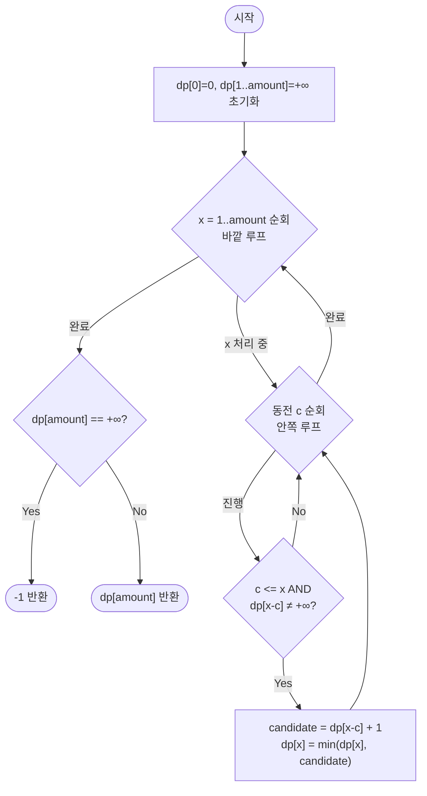

import { AlgorithmSimulation } from "#guide-sim";

# unboundedKnapsack — 금액을 밑에서부터 채우면 같은 동전을 몇 번이든 다시 쓸 수 있는 이유

## 한눈에 보는 컨셉

동전마다 무한히 쓸 수 있는 상황에서, 정확히 목표 금액 `amount`를 만드는 **최소 동전 개수**를 구하는 문제예요. 돌파구는 `dp[x]`("금액 `x`를 만드는 최소 동전 수") 하나만 있으면 충분하고, 금액을 `0`부터 `amount`까지 오름차순으로 채우면 이미 확정된 `dp[x-c]`를 통해 같은 동전을 몇 번이고 자연스럽게 재사용할 수 있다는 관찰입니다. 상태 `amount`개 × 동전 검토 `n`개이므로 `O(n · amount)`에 끝나요.

## 출발점: 가장 순진한 방법부터

문제를 먼저 정확히 잡을게요.

```ts
function unboundedKnapsack(coins: number[], amount: number): number
```

| 파라미터 | 의미 | 제약 |
|----------|------|------|
| `coins` | 사용 가능한 동전 액면가 배열(각 동전 무한 공급) | $1 \leq \lvert coins \rvert \leq 100$, $1 \leq coins[i] \leq 10^4$ |
| `amount` | 만들어야 할 목표 금액 | $0 \leq amount \leq 10^4$ |
| 반환값 | 최소 동전 개수, 불가능하면 $-1$ | 정수 |

| 입력 | 기대 출력 | 이유 |
|------|-----------|------|
| `coins=[1,2,5], amount=0` | `0` | 목표 금액이 0이면 동전이 필요 없음 |
| `coins=[2], amount=3` | `-1` | 짝수 동전만으로 홀수 금액을 만들 수 없음 |
| `coins=[1], amount=10000` | `10000` | 1짜리 동전을 10000개 사용 |
| `coins=[10000], amount=10000` | `1` | 정확히 맞는 동전 한 개 |

**왜 그리디가 아닐까요?** "가장 큰 동전부터 채우자"는 직관이 먼저 떠오를 수 있는데, 이건 일반적인 동전 집합에서 깨집니다. `coins=[1,3,4], amount=6`에서 큰 동전부터 욕심껏 채우면 `4+1+1`로 3개가 필요하지만, 실제 최소는 `3+3`으로 2개예요.

```text
그리디(큰 동전부터): 4 + 1 + 1  = 3개   ✗ (최적 아님)
실제 최소:           3 + 3      = 2개   ✓

동전 4를 먼저 쓰면 남은 2를 1+1로만 채워야 해서 손해를 본다
```

그리디로는 최적성을 보장할 수 없으니, 가장 정직한 출발점은 **모든 동전 조합을 다 시도해보고 그중 최솟값을 고르는 것**입니다.

```ts
function unboundedKnapsackNaive(coins: number[], amount: number): number {
  function solve(remaining: number): number {
    if (remaining === 0) return 0;      // 정확히 다 채운 경우, 동전 0개 더 필요
    if (remaining < 0) return Infinity; // 넘쳐버린 경로는 무효
    let best = Infinity;
    for (const c of coins) {
      const sub = solve(remaining - c); // 동전 c를 하나 쓴 뒤 나머지를 재귀로
      if (sub !== Infinity) best = Math.min(best, sub + 1);
    }
    return best;
  }
  const result = solve(amount);
  return result === Infinity ? -1 : result;
}
```

이 재귀가 얼마나 비싼지 실측해 봤습니다. `coins=[1,2,5]`로 `amount`만 늘려가며 `solve` 호출 횟수를 세어 보면:

```text
amount=20  →  solve 호출 112,981회     (1.76ms)
amount=25  →  solve 호출 1,627,441회   (7.18ms)
amount=30  →  solve 호출 23,442,475회  (75.57ms)

amount이 5씩 늘 때마다 호출 수가 약 14.4배로 불어난다 — 지수적 증가
```

`amount ≤ 10^4`인 이 문제에서 이 속도로는 어림도 없습니다. 원인은 명확해요 — `solve(10)`이 동전 `3`과 `7`을 통해 `solve(7)`을 호출하고, 동전 `4`와 `6`을 통해서도 다시 `solve(7)`을 호출할 수 있습니다. **같은 `remaining` 값이 여러 경로에서 반복 계산**되고 있다는 낌새가 여기서 보입니다. 이 겹치는 부분 문제를 어떻게든 한 번만 계산하고 재사용할 수 있다면 지수적 폭발을 막을 수 있을 것 같습니다.

## 아이디어 자세히 들여다보기

### 동전 종류를 하나씩 반영하며 답을 쌓아 올리기 — 수식과 그림

naive 재귀가 반복 계산하는 대상은 결국 `remaining`(=금액) 하나뿐이라, 사실은 상태를 `dp[x]` 하나로 바로 정의해도 이론적으로는 충분합니다. 하지만 *왜* 충분한지(동전을 무제한으로 재사용해도 안전한 이유)를 눈으로 확인하려면, 0/1 배낭처럼 "지금까지 어떤 동전 종류까지 고려했는가"라는 축을 잠깐 하나 더 세워 2차원 표부터 채워보는 편이 좋습니다. 이 표가 왜, 어떻게 한 줄로 접히는지는 뒤에서 정면으로 다룰게요.

$$dp[i][x] = \text{"동전 } coins[0..i{-}1] \text{까지만 사용 가능할 때, 금액 } x \text{를 만드는 데 필요한 최소 동전 수"} \qquad (dp[i][x] = +\infty \text{이면 불가능})$$

여기서 "사용 가능하다"는 것은 그 동전들을 **몇 번이든** 쓸 수 있다는 뜻이에요 — 무한 배낭이니까요. 점화식은 이렇습니다. 동전 $i$(1-indexed 행 번호, 배열 인덱스로는 `coins[i-1]`)를 고려할 때:

$$dp[i][x] = \begin{cases} dp[i-1][x] & x < coins[i-1] \quad \text{(이 동전은 아직 못 씀)} \\[4pt] \min\bigl(dp[i-1][x],\;\; dp[i][x - coins[i-1]] + 1\bigr) & x \geq coins[i-1] \quad \text{(안 쓰기 vs 방금 이 동전 한 번 더 쓰기)} \end{cases}$$

초기 조건은 $dp[i][0] = 0$(모든 $i$에 대해 — 금액 0은 동전이 필요 없음)이고, $dp[0][x] = +\infty\;(x>0)$(동전을 하나도 못 쓰면 0 말고는 만들 수 없음)입니다.

**두 번째 갈래(`dp[i][x - coins[i-1]] + 1`)를 주목해 주세요 — 참조하는 게 `dp[i-1][...]`(윗 행)이 아니라 `dp[i][...]`(바로 이 행 자신)입니다.** 0/1 배낭이었다면 "이미 동전 $i$를 썼는지"를 구분해야 하니 반드시 윗 행만 봐야 하지만, 여기서는 동전 $i$를 방금 막 썼더라도 그 결과(`dp[i][x-c]`)를 또 참조해서 동전 $i$를 한 번 더 얹을 수 있습니다. **같은 행을 스스로 참조하는 것 자체가 "무제한 재사용"의 정체**예요.

작은 예로 직접 채워 볼게요. `coins=[2,3]`, `amount=7`이면 행은 $i=0,1,2$ 세 개입니다.

```text
        x=0  1   2   3   4   5   6   7
i=0      0   ∞   ∞   ∞   ∞   ∞   ∞   ∞     (동전 없음)
i=1      0   ∞   1   ∞   2   ∞   3   ∞     (동전 2만 가능)
i=2      0   ∞   1   1   2   2   2   3     (동전 2, 3 모두 가능)  ← dp[2][7]=3, 답
```

행 $i=1$(동전 2만 가능)을 보면 홀수 칸은 전부 `∞`이고, 짝수 칸은 `dp[1][x] = dp[1][x-2] + 1`을 계속 같은 행 안에서 연쇄적으로 참조해 채워집니다.

```text
Before: dp[1][0] = 0
After:  dp[1][2] = dp[1][0] + 1 = 1   (동전 2 한 개)
        dp[1][4] = dp[1][2] + 1 = 2   (같은 행을 또 참조 → 동전 2 두 개)
        dp[1][6] = dp[1][4] + 1 = 3   (또 참조 → 동전 2 세 개, 2+2+2)
```

잠깐, 확인 질문 하나만 해볼까요? `dp[2][4]`가 왜 `2`인지 손으로 짚어 보세요. 후보는 두 개입니다 — 동전 3을 안 쓰는 경우 `dp[1][4]=2`(동전 2 두 개), 동전 3을 (한 번 더) 쓰는 경우 `dp[2][1]+1`인데 `dp[2][1]=∞`라 무효. 둘 중 작은 `2`가 답이 됩니다. 위 표의 값과 정확히 일치하죠.

이 표는 뒤에서 "정말 행이 다 필요할까?"라는 질문으로 이어집니다 — 지금은 답을 미리 말하지 않고, 다음 절에서 표 자체가 그 답을 스스로 보여주게 할게요.

### 왜 모순 없이 작동하는가

이 점화식이 지키는 불변식은 다음과 같습니다.

> 행 $i$를 다 채운 시점에, $dp[i][0..amount]$는 모두 "$coins[0..i-1]$까지 사용 가능할 때 그 금액을 만드는 최소 동전 수"의 최종 확정값이다.

이중 귀납으로 검증해 볼게요 — 바깥은 행 $i$에 대한 귀납, 안쪽은 같은 행 안에서 금액 $x$에 대한 귀납입니다.

**기저($i=0$)**: $dp[0][0]=0$, $dp[0][x>0]=+\infty$는 정의 그대로 자명하게 참입니다.

**바깥 귀납 가정**: 행 $i-1$까지는 불변식이 성립한다고 가정합니다($dp[i-1][\cdot]$ 확정).

**안쪽 귀납(행 $i$ 내부)**: 행 $i$도 $x$가 작은 값부터 채워지므로, $dp[i][x]$를 계산하는 시점엔 $dp[i][0..x-1]$이 이미 이 행 안에서 최종값으로 확정돼 있다고 가정할 수 있습니다.

금액 $x$를 $coins[0..i-1]$만으로 만드는 최적해는 "동전 $coins[i-1]$을 한 번이라도 쓰는가"로 정확히 두 갈래로 나뉩니다(그 외의 경우는 없으므로 경우의 완전성이 보장됩니다).

- **안 쓴다**: 나머지는 정확히 $coins[0..i-2]$만으로 $x$를 만든 최적해이고, 바깥 귀납 가정에 의해 그 값은 정확히 $dp[i-1][x]$입니다.
- **적어도 한 번 쓴다**: 그중 하나를 떼어내면 나머지는 (동전 $coins[i-1]$을 또 써도 되는) $coins[0..i-1]$로 $x - coins[i-1]$을 만든 최적해입니다. $x - coins[i-1] < x$이므로 안쪽 귀납 가정에 의해 그 값은 정확히 $dp[i][x-coins[i-1]]$이고, 방금 뗀 동전 하나를 더하면 이 갈래의 값은 $dp[i][x-coins[i-1]]+1$입니다.

두 갈래가 전부이고 각각의 값이 정확하므로(각 경우의 정확성), 둘 중 작은 값이 $dp[i][x]$의 진짜 최적값입니다. $coins[i-1] > x$라 애초에 그 동전을 쓸 수 없으면 두 번째 갈래가 성립하지 않아 $dp[i][x]=dp[i-1][x]$만 남는데, 이는 점화식의 첫 번째 경우와 정확히 일치합니다. $x$를 어떤 조합으로도 만들 수 없다면 두 후보 모두 $+\infty$로 남아 $dp[i][x]$도 $+\infty$이고, 최종적으로 $dp[n][amount]=+\infty$이면 $-1$을 반환합니다.

여기서 **헷갈리기 쉬운 포인트**가 둘 있습니다.

- **`x >= coins[i-1]` 가드를 빼먹는 경우.** 이 조건 없이 `dp[i][x - c]`에 바로 접근하면 `x < c`일 때 음수 인덱스에 접근해 `undefined`가 나오고, `undefined + 1 = NaN`이 섞여 들어갑니다. `coins=[2,3], amount=7`에 이 가드를 빼고 돌리면 실제로 이렇게 오염됩니다.

  ```text
  i=0: [0, ∞,   ∞,   ∞,   ∞,   ∞,   ∞,   ∞]
  i=1: [0, NaN, 1,   NaN, 2,   NaN, 3,   NaN]     (홀수 칸이 음수 인덱스 접근으로 NaN)
  i=2: [0, NaN, NaN, NaN, NaN, NaN, NaN, NaN]     (Math.min에 NaN이 한 번 섞이면 그 뒤로 전부 NaN)
  ```

  `dp[1][1]`이 `dp[1][-1]`(=`undefined`)을 참조하며 `NaN`이 되고, 행 2에서는 `Math.min(dp[1][x], NaN)`이 항상 `NaN`이라 `dp[2][0]`(직접 `0`으로 초기화한 칸) 딱 하나만 빼고 행 전체가 `NaN`으로 뒤덮입니다.

- **행 인덱스 오프셋(`i`와 `i-1`)을 헷갈리는 경우.** 배열 `coins`는 0-indexed인데 행 번호 `i`는 1-indexed라, 자칫 `coins[i-1]` 대신 `coins[i]`를 읽기 쉽습니다. `coins=[7], amount=7`(동전 1개)로 실측하면, 올바른 코드는 `dp[1][7]=1`을 반환하지만, `coins[i]`로 잘못 읽은 코드는 `i=1`일 때 `coins[1]`이 배열 밖이라 `undefined`가 되어 "이 동전을 쓸 수 있는가" 판정이 항상 거짓이 되고, 결국 아무 동전도 못 써서 `dp[1][7]=dp[0][7]=∞`, 최종 반환값도 `-1`입니다(정답 `1`과 완전히 다릅니다).

엣지 케이스도 이 불변식 위에서 점검해 둘게요.

```text
amount = 0                        → dp[i][0] = 0 (모든 행에서 자명)
coins의 모든 원소가 amount보다 큼   → coins=[5,10], amount=3 → 모든 dp[i][1..3] = ∞ → -1
동전이 amount의 약수가 아님        → coins=[2], amount=3 → dp[1][3] = ∞ → -1
동전 하나가 amount와 정확히 일치   → coins=[10000], amount=10000 → dp[1][10000] = 1
```

## 아이디어를 코드로 옮기기

방금 정의한 2차원 점화식을 그대로 이중 반복문으로 옮깁니다.

```ts
function unboundedKnapsack2D(coins: number[], amount: number): number {
  const n = coins.length;
  const dp: number[][] = Array.from({ length: n + 1 }, () => new Array(amount + 1).fill(Infinity));
  for (let i = 0; i <= n; i++) dp[i]![0] = 0; // 금액 0은 항상 동전 0개로 만들 수 있다

  for (let i = 1; i <= n; i++) {
    const c = coins[i - 1]!;
    for (let x = 1; x <= amount; x++) {
      dp[i]![x] = dp[i - 1]![x]!;                   // 동전 i를 쓰지 않는 경우부터 복사(윗 행)
      if (x >= c && dp[i]![x - c] !== Infinity) {    // ← 가장 중요한 줄
        dp[i]![x] = Math.min(dp[i]![x]!, dp[i]![x - c]! + 1); // 같은 행 재참조 = 동전 i 재사용
      }
    }
  }

  return dp[n]![amount] === Infinity ? -1 : dp[n]![amount]!;
}
```

**가장 중요한 줄은 `if (x >= c && dp[i]![x - c] !== Infinity)`입니다.** 앞 절 "헷갈리기 쉬운 포인트"에서 본 `NaN` 오염 버그가 정확히 이 가드를 빼먹었을 때 생깁니다. 그 외 결정 지점은 다음과 같습니다.

- `const c = coins[i - 1]!;`: 행 번호 `i`(1-indexed)와 배열 인덱스(0-indexed)가 하나 어긋나 있으므로 반드시 `i - 1`로 접근합니다 — 이 줄이 앞 절의 두 번째 함정(오프셋 버그)이 실제로 발생하는 지점입니다.
- 초기값: `dp[i][0] = 0`을 모든 행에 먼저 세팅해 "금액 0은 항상 만들 수 있다"는 기저를 자동으로 표현합니다.
- 안쪽 루프 방향: `x`는 `1`부터 `amount`까지 오름차순으로 돕니다. 같은 행 안에서 `dp[i][x-c]`(항상 `x`보다 작은 인덱스)를 참조해야 하므로, 그 값이 **이미 이번 행에서 확정된 뒤**여야 하기 때문입니다.

이 2D 구현의 비용은 시간 `O(n · amount)`, 공간도 `O(n · amount)`입니다 — 첫 절에서 세운 목표 복잡도는 이미 시간 쪽에서 달성했습니다. 하지만 공간은 아직 더 줄일 여지가 있어 보입니다.

## 더 빠르게 만들 단서 찾기

표를 실제로 어떻게 참조하고 있는지 관찰해 볼게요. `coins=[1,5,6], amount=11`처럼 행이 3개 이상인 예시로 보면 더 뚜렷합니다.

```text
i=0: [0, ∞, ∞, ∞, ∞, ∞, ∞, ∞, ∞, ∞, ∞, ∞]
i=1: [0, 1, 2, 3, 4, 5, 6, 7, 8, 9, 10, 11]
i=2: [0, 1, 2, 3, 4, 1, 2, 3, 4, 5, 2, 3]
i=3: [0, 1, 2, 3, 4, 1, 1, 2, 3, 4, 2, 2]   ← dp[3][11]=2, 답
```

```text
행 i를 채우는 동안 실제로 읽는 값:   dp[i-1][x](바로 위 행) 와 dp[i][x-c](지금 채우는 행, 왼쪽 칸)만
행 i를 채우고 나면 다시 읽는 행:     dp[i-1]은 두 번 다시 안 읽힘
행 i-2, i-3, ... 은?                i-1행을 채운 순간부터 이미 죽은 데이터
게다가 x < coins[i-1]인 칸은?       계산 없이 dp[i-1][x]를 그대로 복사만 함(새 정보 없음)
```

앞 절에서 짚었던 "같은 행 재참조"가 여기서 낭비의 정체를 알려줍니다 — **행 $i$를 계산하는 데 필요한 건 바로 위 행 하나와, 지금 채우고 있는 이 행 자기 자신뿐**입니다. 그보다 오래된 행은 물론이고, 사실 행이라는 개념 자체가 최종적으로 원하는 값(`dp[n][amount]`)을 얻는 데 굳이 별도로 유지할 필요가 없어 보입니다. `coins`가 100종이면 표 전체는 $101 \times 10001 \approx 10^6$칸이지만, 실제로 "살아있는" 정보는 그중 극히 일부(직전 행 + 현재 행)뿐이라는 뜻이에요.

## 단서를 최적화로 연결하기

행을 통째로 유지하지 말고, **길이 `amount+1`짜리 배열 하나**로 접어보면 어떨까요?

```text
Before (2D, 행마다 새 배열):
  dp[0] = [0,∞,∞,∞,∞,∞,∞,∞]
  dp[1] = [0,∞,1,∞,2,∞,3,∞]     ← 동전 2 반영, 새 배열
  dp[2] = [0,∞,1,1,2,2,2,3]     ← 동전 3 반영, 또 새 배열   (행 3개, 총 24칸)

After (1D, 배열 하나를 계속 덮어쓰기):
  dp = [0,∞,∞,∞,∞,∞,∞,∞]
  dp = [0,∞,1,∞,2,∞,3,∞]   ← 동전 2 반영, 같은 배열을 덮어씀
  dp = [0,∞,1,1,2,2,2,3]   ← 동전 3 반영, 또 같은 배열을 덮어씀   (배열 1개, 8칸)
```

여기서 결정적인 차이가 하나 있습니다. 0/1 배낭에서 2D→1D로 접을 때는 "옛(윗 행) 값을 덮어쓰기 전에 보존해야" 했지만(그래서 내림차순), 여기서는 애초에 행이라는 구분 자체가 결과에 영향을 주지 않았습니다 — 위 절에서 확인했듯 $dp[i][x]$는 "동전을 몇 종류까지 봤는가"와 무관하게, 그 시점까지 반영된 동전들로 만들 수 있는 최선일 뿐입니다. 그러니 아예 행을 나누지 않고, 금액 `x`를 채울 때마다 **그 순간 쓸 수 있는 동전을 전부 한 번에 검토**해도 결과가 같습니다. 다만 지켜야 할 불변식이 하나 있습니다.

> **불변식**: `dp[x]`를 갱신하는 시점에 `dp[x-c]`는 이미 "지금까지 확정된 최선"이어야 한다. 즉 `x`보다 작은 금액은 전부 먼저 확정돼 있어야 한다.

`x - c < x`이므로, 이 불변식을 지키는 방법은 하나뿐입니다 — 금액 `x`를 **작은 값에서 큰 값 순서(오름차순)**로 순회하는 것. `x`가 `1`부터 `amount`까지 올라가면서 갱신되므로, `dp[x]`를 갱신하는 시점에 `dp[x-c]`(항상 `x`보다 작은 인덱스)는 이미 확정된 값입니다 — 그리고 그 값이 "이번 갱신에서 같은 동전으로 이미 한 번 더 늘어난" 값일 수도 있다는 점이 바로 무한 재사용을 만드는 지점입니다(앞서 2D 표에서 본 "같은 행 재참조"가 1D에서는 "같은 배열의 왼쪽 칸 재참조"로 그대로 이어집니다).

**0/1 배낭과 정확히 대비되는 지점이 여기입니다.** 0/1 배낭은 각 물건을 "이미 썼는지" 구분해야 해서, 갱신 시점에 `dp[w-w_i]`가 **아직 이번 물건으로 손대지 않은 옛 값**이어야 합니다 — 그래서 금액(용량)을 큰 값에서 작은 값으로 내림차순으로 돕니다. 반면 이 문제는 애초에 "몇 번 썼는지" 구분할 필요가 없으므로, 오히려 **방금 갱신한 값을 그대로 다시 참조**해도 되고, 그러려면 오름차순으로 돌아야 합니다.

```text
coins=[1,5,6], amount=6 (정답=단일 동전 6, 1개), 0/1 패턴(내림차순)을 잘못 가져오면 -> 1   (우연히 일치!)
coins=[1,5,6], amount=11 (정답=6+5, 2개), 0/1 패턴(내림차순)을 잘못 가져오면 -> -1   (불일치 — 재사용이 막혀서 11을 못 채움)
coins=[1], amount=5 (정답 5), 0/1 패턴(내림차순)을 잘못 가져오면 -> -1
coins=[2], amount=6 (정답 3), 0/1 패턴(내림차순)을 잘못 가져오면 -> -1
```

작은 케이스 하나만 돌려보면 우연히 값이 맞아떨어질 수 있어(`amount=6` 사례처럼) 착각하기 쉽지만, `amount=11` 같은 다른 입력에서 바로 깨집니다 — 방향 하나가 "몇 번이든 재사용 가능"과 "딱 한 번만 사용 가능"을 가릅니다.

> 기억법: **"큰 데서 작은 데로 내려오며 옛 값을 지키면 0/1, 작은 데서 큰 데로 올라가며 새 값을 되쓰면 무한 배낭."**

## 최적화 코드

행 차원을 완전히 접은 1차원 배열로 다시 씁니다.

```ts
function unboundedKnapsack(coins: number[], amount: number): number {
  const dp = new Array<number>(amount + 1).fill(Infinity);
  dp[0] = 0;
  for (let x = 1; x <= amount; x++) {          // 금액을 작은 값부터 — 가장 중요한 줄
    for (const c of coins) {
      if (c <= x && dp[x - c] !== Infinity) {
        dp[x] = Math.min(dp[x], dp[x - c] + 1);
      }
    }
  }
  return dp[amount] === Infinity ? -1 : dp[amount];
}
```

**가장 중요한 줄은 `for (let x = 1; x <= amount; x++)`(오름차순)입니다.** 방향을 내림차순으로 뒤집으면 앞 절에서 실측한 것처럼 `coins=[1,5,6], amount=11`이 `2`가 아니라 `-1`로 조용히 틀립니다. `c <= x && dp[x - c] !== Infinity` 가드의 역할은 2D 코드와 같습니다 — `c <= x`가 없으면 음수 인덱스가 `NaN`을 만들고, `dp[x-c] !== Infinity` 검사는 `Infinity + 1 = Infinity`(JS에서 오버플로 없음)라 없어도 정확성엔 무해하지만 의도를 분명히 하려고 남겨 둡니다.

행을 접었어도 시간 복잡도는 여전히 `O(n · amount)`로 2D 구현과 동일합니다 — 이번 최적화로 줄어든 건 시간이 아니라 **공간**입니다(`O(n · amount)` → `O(amount)`). 시간 쪽은 이미 첫 절의 목표를 달성한 상태였고, 상태 수 자체가 `amount`개이므로 모든 상태를 적어도 한 번은 봐야 한다는 하한이 있어 더 줄지 않습니다. 일반적인 동전 집합에 대해 이보다 점근적으로 더 나은 알려진 알고리즘도 없습니다(그리디는 앞서 보았듯 최적성을 보장하지 못합니다). 공간까지 `O(amount)`로 줄인 지금이 이 접근의 종착점입니다.

## 실행 시각화

입력 `coins = [1, 5, 6]`, `amount = 11`에 대해 1D DP 배열 `dp[x]`("금액 `x`를 만드는 최소 동전 수")를 작은 금액부터 채우는 과정입니다. matrix 패널은 1행짜리 `dp[0..11]`(`∞`는 아직 미달성)이고, 열은 금액 `x`예요. 빨간 셀은 그 프레임에서 새로 확정된 금액이고, keyValue 패널은 그 프레임에서 계산에 쓰인 값을 보여줍니다. 실제 반환값은 `unboundedKnapsack([1,5,6], 11) === 2`(동전 `6+5`)이며, 시뮬레이션 마지막 프레임과 일치합니다.

> 대화형 시뮬레이션은 MDX 런타임에서 표시됩니다.

export const cols = [0, 1, 2, 3, 4, 5, 6, 7, 8, 9, 10, 11];

export const inf = "∞";

export const steps = [
  {
    title: "초기화",
    detail: "dp[0]=0, 나머지는 ∞.",
    rowLabels: ["dp"], colLabels: cols,
    matrix: [[0, inf, inf, inf, inf, inf, inf, inf, inf, inf, inf, inf]],
    cells: [[0, 0]],
    entries: [{ label: "coins", value: "[1, 5, 6]" }],
  },
  {
    title: "x = 1..4 (동전 1만 사용 가능)",
    detail: "x<5에서는 동전 1만 적용. dp[x]=dp[x-1]+1.",
    rowLabels: ["dp"], colLabels: cols,
    matrix: [[0, 1, 2, 3, 4, inf, inf, inf, inf, inf, inf, inf]],
    cells: [[0, 1], [0, 2], [0, 3], [0, 4]],
    entries: [{ label: "dp[1..4]", value: "1,2,3,4" }],
  },
  {
    title: "x = 5",
    detail: "min(dp[4]+1=5, dp[0]+1=1)=1. 동전 5 한 개.",
    rowLabels: ["dp"], colLabels: cols,
    matrix: [[0, 1, 2, 3, 4, 1, inf, inf, inf, inf, inf, inf]],
    cells: [[0, 5]],
    entries: [{ label: "dp[5]", value: 1 }],
  },
  {
    title: "x = 6",
    detail: "min(dp[5]+1=2, dp[1]+1=2, dp[0]+1=1)=1. 동전 6 한 개.",
    rowLabels: ["dp"], colLabels: cols,
    matrix: [[0, 1, 2, 3, 4, 1, 1, inf, inf, inf, inf, inf]],
    cells: [[0, 6]],
    entries: [{ label: "dp[6]", value: 1 }],
  },
  {
    title: "x = 7..9",
    detail: "dp[7]=min(dp[6]+1,dp[2]+1,dp[1]+1)=2. dp[8]=3, dp[9]=4.",
    rowLabels: ["dp"], colLabels: cols,
    matrix: [[0, 1, 2, 3, 4, 1, 1, 2, 3, 4, inf, inf]],
    cells: [[0, 7], [0, 8], [0, 9]],
    entries: [{ label: "dp[7..9]", value: "2,3,4" }],
  },
  {
    title: "x = 10",
    detail: "min(dp[9]+1=5, dp[5]+1=2, dp[4]+1=5)=2. 5+5.",
    rowLabels: ["dp"], colLabels: cols,
    matrix: [[0, 1, 2, 3, 4, 1, 1, 2, 3, 4, 2, inf]],
    cells: [[0, 10]],
    entries: [{ label: "dp[10]", value: 2 }],
  },
  {
    title: "x = 11",
    detail: "min(dp[10]+1=3, dp[6]+1=2, dp[5]+1=2)=2. 6+5.",
    rowLabels: ["dp"], colLabels: cols,
    matrix: [[0, 1, 2, 3, 4, 1, 1, 2, 3, 4, 2, 2]],
    cells: [[0, 11]],
    entries: [{ label: "dp[11]", value: 2 }],
  },
  {
    title: "완료",
    detail: "dp[11]=2 (동전 6+5). 최소 동전 개수 반환.",
    rowLabels: ["dp"], colLabels: cols,
    matrix: [[0, 1, 2, 3, 4, 1, 1, 2, 3, 4, 2, 2]],
    cells: [[0, 11]],
    entries: [{ label: "반환값", value: 2 }],
  },
];

<AlgorithmSimulation view={["matrix", "keyValue"]} steps={steps} title="언바운드 배낭(동전 최소 개수) DP" />

## 흐름 한눈에 보기



## 스스로 점검하기

1. `coins=[2,3], amount=7`일 때 `dp[0..7]`을 손으로 채워 보세요. (정답: `dp = [0, ∞, 1, 1, 2, 2, 2, 3]`이고, 특히 `dp[4]`는 `dp[2]+1`로 동전 `2`를 두 번 재사용해서 나온 값입니다.)
2. "동전 바깥, 금액 안쪽 내림차순" 루프(0/1 배낭 패턴)를 이 문제에 그대로 적용하면 `coins=[1], amount=5`에서 왜 `-1`이 나오는지, 어느 시점에 동전 `1`의 재사용이 막히는지 짚어 보세요.
3. 만약 "최소 동전 개수"가 아니라 "정확히 `amount`를 만드는 조합의 가짓수"(`coinChangeWays`)를 구하는 문제로 바뀐다면, 이 코드에서 무엇을 바꿔야 할까요? (힌트: 루프 순서가 결과의 정확성에 영향을 주기 시작합니다 — 동전을 바깥, 금액을 안쪽에 두어야 같은 조합이 중복으로 세어지지 않습니다.)
