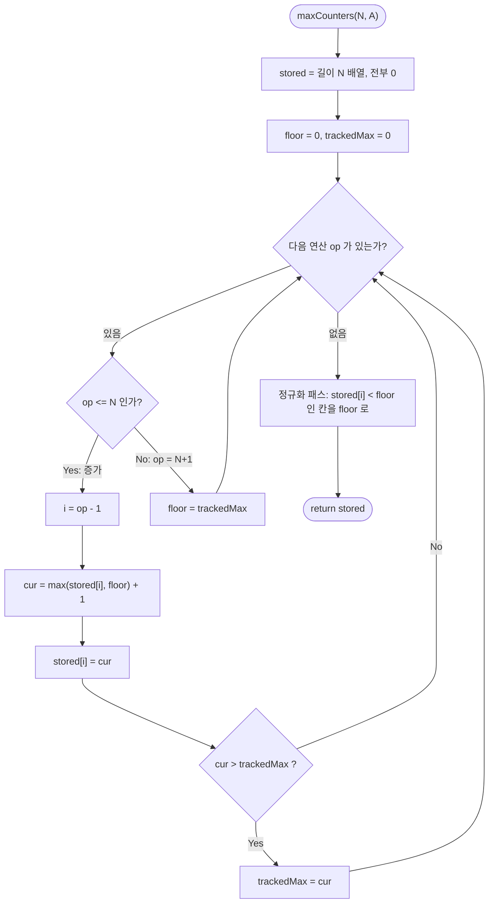

import { AlgorithmSimulation } from "#guide-sim";

# Max Counters — 전체 갱신을 숫자 하나로 접어 두면 훑기가 사라지는 이유

## 한눈에 보는 컨셉

카운터 `N`개를 놓고 "한 칸만 1 올리기"와 "전부 최댓값으로 맞추기"가 섞여 들어오는 문제예요. 전부 맞추기를 실제로 다 쓰지 않고 **바닥값** 하나에 접어 두었다가 각 칸을 건드리는 순간에만 반영하면 `O(N·M)`이 `O(N+M)`으로 내려갑니다. 이 알고리즘이 하는 일은 하나입니다 — **쓰기를 미뤄 두고 마지막에 한 번에 갚기.**

## 출발점: 가장 순진한 방법부터

문제부터 정확히 고정할게요.

```ts
function maxCounters(N: number, A: number[]): number[]
```

`N`은 카운터 개수고 `A`는 연산 기록입니다. `A[K]`가 1과 `N` 사이면 그 번호의 카운터를 1 올리고, `N+1`이면 모든 카운터를 현재 최댓값으로 맞춥니다. 카운터는 전부 0에서 시작하며 반환값은 연산을 다 처리한 뒤의 길이 `N` 배열이에요. `N`과 `M`(`A`의 길이)은 각각 최대 `100,000`이고 시간 제한은 1초입니다.

목표 복잡도부터 짚고 갑시다. `N·M`은 최악에 `10^10`이라 1초에 어림도 없고 `N+M`은 `2×10^5`라 여유가 큽니다. **노릴 지점은 `O(N+M)`입니다.**

문제가 시키는 대로 그대로 옮기는 게 정직한 출발이에요. 카운터 배열을 만들어 놓고 연산을 하나씩 처리합니다. `N+1`을 만나면 현재 최댓값을 알아야 하니 배열을 한 번 훑고, 그 값을 모든 칸에 쓰느라 또 한 번 훑습니다.

```text
N=5, A = [3, 4, 4, 6, 1, 4, 4]        (N+1 = 6 이 전체 갱신)

초기            (0, 0, 0, 0, 0)        누적 쓰기 0
A=3  → +1       (0, 0, 1, 0, 0)                 1
A=4  → +1       (0, 0, 1, 1, 0)                 2
A=4  → +1       (0, 0, 1, 2, 0)                 3
A=6  → 전체     (2, 2, 2, 2, 2)                 8   ← 한 번에 5칸을 쓴다
A=1  → +1       (3, 2, 2, 2, 2)                 9
A=4  → +1       (3, 2, 2, 3, 2)                10
A=4  → +1       (3, 2, 2, 4, 2)                11

반환 [3, 2, 2, 4, 2]
```

비용이 어디로 튀는지 보이시죠. 전체 갱신 한 번이 `N`칸을 씁니다. 최악은 `A`가 전부 `N+1`인 입력이에요.

```text
A = [N+1, N+1, ..., N+1]   (M 개)

전체 갱신 M 번 × 한 번에 N 칸 = N·M
N = M = 100,000            →  10^10 회
```

실제로 재 보면 이 벽이 그대로 드러납니다. `N = M = 100,000`에서 증가와 전체 갱신을 번갈아 준 입력(`A = [1, N+1, 1, N+1, …]`)을 돌리면 순진한 풀이는 **1,090 ms**가 걸려요. 제한 시간을 넘깁니다.

다만 훑기 두 번 중 하나는 금방 없앨 수 있어 보입니다. 최댓값을 알겠다고 매번 배열을 뒤지는 건 아무래도 낭비 같거든요. **최댓값이 언제 변하는가** — 이것이 이번 유도의 출발 단서입니다.

## 아이디어 자세히 들여다보기

### 최댓값은 증가할 때만 자란다 — 수식과 그림

직관부터 말하면 이래요. 전체 갱신은 낮은 칸을 최댓값까지 끌어올릴 뿐이라 **최댓값 자체는 건드리지 못합니다.** 최댓값이 커지는 통로는 증가 연산 하나뿐이에요.

상태를 정식으로 적어 봅시다. 카운터를 $C = (c_1, c_2, \ldots, c_N)$라 하고 현재 최댓값을 $\mu = \max_i c_i$로 둡니다. 두 연산의 정의는 이렇습니다.

$$\text{increase}(k):\; c_k \leftarrow c_k + 1 \qquad\qquad \text{maxCounter}:\; c_i \leftarrow \mu \;\; (\forall i)$$

각 연산이 $\mu$를 어떻게 바꾸는지 봅니다.

$$\text{increase}(k) \Rightarrow \mu' = \max(\mu,\; c_k + 1) \qquad\qquad \text{maxCounter} \Rightarrow \mu' = \mu$$

전체 갱신 쪽이 핵심이에요. 모든 칸이 $\mu$가 되니 새 최댓값도 $\mu$입니다. 훑어서 다시 구할 이유가 없습니다.

```text
전체 갱신 전   (0, 0, 1, 2, 0)   μ = 2
전체 갱신 후   (2, 2, 2, 2, 2)   μ = 2      ← 그대로

배열은 평평해졌는데 꼭대기 높이는 안 변했다
```

**왜 $\mu$를 변수로 들고 다니는가**를 대안과 견줘 볼게요. 최댓값을 그때그때 $\max_i c_i$로 다시 계산하는 정의도 틀리지는 않습니다. 다만 그 정의는 값 하나를 얻는 데 매번 `N`번의 비교를 요구해요. 위 갱신식은 같은 값을 비교 한 번으로 줍니다. **정의를 결과가 아니라 변화량으로 다시 쓴 것**이고 이 사고방식이 유도 전체를 관통합니다.

작은 입력으로 직접 채워 보죠. `N=3, A=[1, 4, 2, 4, 3]`입니다.

```text
연산     C              μ (증분 유지)
---------------------------------------
초기     (0, 0, 0)      0
A=1      (1, 0, 0)      max(0, 1) = 1
A=4      (1, 1, 1)      1              ← 전체 갱신, μ 그대로
A=2      (1, 2, 1)      max(1, 2) = 2
A=4      (2, 2, 2)      2              ← 그대로
A=3      (2, 2, 3)      max(2, 3) = 3

반환 [2, 2, 3]
```

잠깐, 확인 하나만 해 볼까요? 마지막 `A=3` 바로 앞에 `A=4`를 한 번 더 끼워 넣으면 반환값이 달라질까요? 답은 "안 달라진다"입니다. 이미 평평한 배열에 같은 최댓값을 다시 쓰는 일이라 아무것도 안 바뀌어요. `A=[1, 4, 2, 4, 4, 3]`의 반환값도 `[2, 2, 3]`입니다.

### 왜 모순 없이 작동하는가

증분으로 유지한 $\mu$가 진짜 최댓값과 늘 같다는 약속을 지켜야 합니다.

> 어느 시점이든 $\mu = \max_i c_i$ 가 성립한다.

**기저**: 모든 카운터가 0이고 $\mu$도 0이니 등식이 성립합니다.

**귀납 단계**: 직전까지 $\mu = \max_i c_i$였다고 가정하고 연산 하나를 처리해요. 계약이 $1 \le A[K] \le N+1$이라 경우는 정확히 둘이고 그 밖의 입력은 애초에 들어오지 않습니다.

- **증가 연산**: 값이 오른 칸은 $c_k$ 하나뿐입니다. 나머지 칸이 만드는 최댓값은 여전히 $\mu$이므로 새 최댓값은 둘 중 큰 쪽인 $\max(\mu, c_k + 1)$이에요.
- **전체 갱신**: 모든 칸이 $\mu$가 됩니다. 최댓값도 $\mu$고 $\mu$를 그대로 두는 처리가 정확합니다.

여기서 **헷갈리기 쉬운 포인트**는 전체 갱신이 최댓값을 밀어 올린다고 오해하는 것입니다. 전부를 최댓값으로 만드니 최댓값도 따라 커질 것 같거든요. 반례를 그려 보면 바로 풀립니다.

```text
오해:  (0, 0, 1, 2, 0) --전체 갱신--> μ 가 2 보다 커진다?

실제:  칸 번호        1    2    3    4    5
       갱신 전 값     0    0    1    2    0
       갱신 후 값     2    2    2    2    2

       μ=2 를 만든 칸은 4 번이다. 이미 2 라서 더 오를 데가 없다.
       3 번 칸은 1 에서 2 로 오르지만 딱 2 까지다.
       그래서 갱신 후에도 μ = 2 — 꼭대기는 제자리다.
```

경계 입력에서도 확인해 둡시다.

```text
N=1, A=[2]        → 전체 갱신 한 번, 증가가 없어 μ=0.  반환 [0]
N=3, A=[4,4,4]    → 증가가 아예 없어 μ=0 고정.         반환 [0,0,0]
N=2, A=[3,1,2]    → 빈 상태에서 전체 갱신부터 시작.     반환 [1,1]
N=3, A=[1,2,3,4]  → 마지막이 전체 갱신, 이미 전부 1.    반환 [1,1,1]
```

## 아이디어를 코드로 옮기기

```ts
function maxCountersNaive(N: number, A: number[]): number[] {
  const counters = new Array<number>(N).fill(0);
  let max = 0;

  for (const op of A) {
    if (op <= N) {
      const i = op - 1;
      counters[i] = counters[i]! + 1;
      if (counters[i]! > max) max = counters[i]!;
    } else {
      for (let i = 0; i < N; i++) counters[i] = max; // 남은 훑기 한 번
    }
  }

  return counters;
}
```

결정 지점만 짚을게요. 모든 카운터가 0에서 출발하니 `max`의 초기값도 0입니다. 가드를 `op <= N`으로 쓴 건 계약 덕분이에요 — `A[K]`가 `1`부터 `N+1` 사이라고 보장되니 `N` 이하가 아니면 남는 값은 `N+1` 하나뿐입니다.

**가장 실수가 잦은 줄은 `if (counters[i]! > max)` 입니다.** 이 비교는 반드시 증가 **뒤에** 와야 해요. 순서를 뒤집어 증가 전 값과 비교하면 `max`가 늘 1씩 뒤처집니다. 그런데 이 오류는 조용해요. 전체 갱신이 한 번도 안 나오는 입력에서는 `max`를 읽는 자리가 없어서 테스트가 통과해 버리거든요.

이 구현의 복잡도는 여전히 `O(N·M)`입니다. 훑기를 두 번에서 한 번으로 줄여 상수를 절반으로 깎았을 뿐이에요.

## 더 빠르게 만들 단서 찾기

남은 훑기 한 번을 관찰해 봅시다. 전체 갱신 직후의 배열은 **완전히 평평합니다.** 모든 칸이 같은 값이에요. 그 뒤에 증가 연산이 건드린 칸만 그 평면에서 솟아오릅니다.

```text
전체 갱신 직후   (2, 2, 2, 2, 2)      ← 평평하다
증가 3 번 후     (3, 2, 2, 4, 2)      ← 솟은 칸은 2 개뿐
                  ↑        ↑
다음 전체 갱신   (4, 4, 4, 4, 4)      ← 5 칸을 하나씩 다시 쓴다

평평한 칸 3 개는 서로 구별되지도 않는데 각자 한 번씩 쓰인다
```

두 번의 전체 갱신 사이에 솟는 칸은 몇 개나 될까요? 그 사이에 들어온 증가 연산 수를 넘지 못합니다. 실제 수치를 하나 재 봤어요. 이 문제의 성능 테스트가 쓰는 입력(`N = M = 100,000`, 세 번에 한 번꼴로 전체 갱신)에서 전체 갱신은 33,334번 일어나고 그 사이에 솟은 칸은 **평균 2개**입니다. 카운터가 10만 개인데요.

**낭비의 정체가 잡혔습니다.** 한 덩어리로 함께 움직이는 칸 99,998개를 매번 하나씩 쓰고 있어요.

## 단서를 최적화로 연결하기

덩어리는 덩어리로 다루면 됩니다. 평평한 부분의 높이를 **바닥값** 하나로 들고, 배열에는 그 바닥에서 솟은 칸만 진짜 값으로 남겨요.

상태를 둘로 나눕니다.

- `stored[i]` — 배열에 실제로 적혀 있는 값
- `floor` — 마지막 전체 갱신이 정한 바닥 높이

그리고 이 약속을 끝까지 지킵니다.

> 카운터 `i` 의 진짜 값은 언제나 $v_i = \max(\text{stored}[i],\, \text{floor})$ 다.

배열을 직접 읽지 않고 이 식을 거쳐 읽는다는 뜻이에요. 두 연산을 이 약속 위에서 다시 씁니다.

```text
Before (기본 구현)                    After (지연 반영)

[전체 갱신]                           [전체 갱신]
  N 칸을 하나씩 max 로 덮어쓴다          floor = trackedMax   한 줄, O(1)

  (0,0,1,2,0) → (2,2,2,2,2)           stored (0,0,1,2,0) 은 그대로 두고 floor=2
                                       읽으면 max(stored[i], 2) = (2,2,2,2,2)

[증가 k]                              [증가 k]
  counters[k]++                        stored[k] = max(stored[k], floor) + 1
                                       ← 만지는 이 칸에만 바닥을 실제로 반영한다
```

`trackedMax`는 앞 절의 $\mu$ 그대로입니다. 전체 갱신이 최댓값을 못 바꾼다는 사실을 이미 증명해 뒀으니 `floor = trackedMax` 한 줄이 안전해요.

**이 최적화가 성립하는 근거**는 갱신의 성질에 있습니다. 전체 갱신은 더하기가 아니라 **덮어쓰기**예요. 덮어쓰기를 연달아 두 번 하면 나중 것만 살아남습니다. 그래서 미뤄 둔 갱신이 아무리 쌓여도 스칼라 하나로 표현돼요. 세그먼트 트리의 지연 전파(lazy propagation)가 구간 태그를 노드에 걸어 두었다가 내려보내는 것과 같은 성질이고, 여기서는 갱신 구간이 언제나 배열 전체라 태그를 걸 자리가 변수 하나면 충분합니다.

미뤄 둔 빚은 마지막에 갚습니다. 루프가 끝나면 아직 바닥을 못 받은 칸들에 `floor`를 한 번에 반영해요. 이 정규화 패스가 `O(N)`이고 뒤에서 복잡도를 셀 때 실제로 들어가는 항입니다.

## 최적화 코드

```ts
function maxCounters(N: number, A: number[]): number[] {
  const stored = new Array<number>(N).fill(0);
  let floor = 0;      // 마지막 전체 갱신이 정한 바닥 높이
  let trackedMax = 0; // 지금까지의 진짜 최댓값

  for (const op of A) {
    if (op <= N) {
      const i = op - 1;
      const cur = Math.max(stored[i]!, floor) + 1; // 만지는 순간에만 바닥을 반영
      stored[i] = cur;
      if (cur > trackedMax) trackedMax = cur;
    } else {
      floor = trackedMax; // 전체 갱신을 스칼라 대입 한 줄로
    }
  }

  for (let i = 0; i < N; i++) {          // 정규화 패스
    if (stored[i]! < floor) stored[i] = floor;
  }

  return stored;
}
```

**가장 중요한 줄은 `const cur = Math.max(stored[i]!, floor) + 1;` 입니다.** `Math.max`를 빼고 `stored[i]! + 1`로 쓰면 어떻게 될까요. 아직 바닥을 못 받은 칸이 낡은 값에서 1만 오릅니다. `stored`가 `(0, 0, 1, 2, 0)`이고 `floor`가 2인 상태에서 `stored[1]`을 올려 보면 진짜 값은 3이어야 하는데 1이 나와요. 이 오류도 조용합니다. `N=5, A=[3,4,4,6,1,4,4]`에서는 `[2,2,2,4,2]`가 나와 틀리지만, 전체 갱신이 없는 `N=3, A=[1,2,3,1]`에서는 `floor`가 0이라 정답 `[2,1,1]`이 그대로 나오거든요.

정규화 패스의 조건을 빠뜨리는 실수도 같은 종류예요. `if (stored[i]! < floor)`를 지우고 전부 `floor`로 덮으면 마지막 전체 갱신 이후에 솟은 칸이 도로 눌립니다. `N=3, A=[1,2,3,4]`처럼 전체 갱신으로 끝나는 입력은 멀쩡히 `[1,1,1]`을 내놓고, 앞의 `N=5` 입력은 `[2,2,2,2,2]`로 조용히 무너져요.

> 바닥은 접어 두고, 칸을 만질 때 갚는다.

이제 복잡도를 정리합니다. **위 `O(N+M)`은 어느 비용을 센 값인지 밝혀 둘게요.** 비용이 나는 자리는 셋입니다. 배열 초기화 `O(N)`, 연산 루프 `O(M)`, 마지막 정규화 패스 `O(N)`이에요. 총식을 정확히 쓰면 `O(2N + M)`이고 상수배를 흡수해 `O(N+M)`으로 적습니다. 정규화 패스는 지배항과 같은 `O(N)`이라 표기에서 흔히 사라지지만 **없앨 수 없는 항**이에요. 미뤄 둔 빚을 갚는 자리라 이 패스를 지우면 답이 틀립니다.

연산 하나하나의 비용도 짚고 갑시다. 증가와 전체 갱신 모두 **최악 기준 `O(1)`**입니다. 평균만 그렇다는 기대값도 아니고 여러 연산에 걸쳐 나눠 갚는 상환값도 아니에요. 카운터 번호가 1부터 `N`까지 조밀하게 차 있어서 배열 인덱스로 바로 꽂을 수 있고, 배열 접근에는 해시 충돌 같은 최악 시나리오가 없거든요. 번호가 듬성듬성해서 `Map`을 써야 했다면 이야기가 달라집니다 — `Map` 갱신은 **기대** `O(1)`일 뿐 최악을 보장하지 않아요. 그때는 좌표 압축으로 번호를 촘촘히 눌러 담아야 최악까지 `O(1)`로 조여집니다.

목표는 달성했습니다. `naive` 절에서 예측한 `O(N+M)`에 정확히 도달했고 실측으로도 `N = M = 100,000`에서 **0.5 ms**가 나와요. 같은 입력에서 순진한 풀이가 1,090 ms였습니다.

더 줄일 여지가 있을까요? 없습니다. 어떤 풀이든 길이 `M`인 연산 기록을 전부 읽어야 하고 길이 `N`인 배열을 전부 채워 반환해야 해요. 입출력을 만지는 것만으로 `Ω(N+M)`입니다. 어떤 풀이도 이보다 빠를 수 없다는 하한이고 이 알고리즘은 거기에 딱 붙어 있어요. 구간 갱신 도구를 꺼내 세그먼트 트리에 지연 전파를 붙여도 답은 나오지만 연산당 `O(log N)`이라 전체가 `O(M log N)`으로 밀리고 코드도 몇 배로 불어나요. 갱신 구간이 늘 배열 전체라는 이 문제의 특수성이 트리를 변수 하나로 접어 준 셈입니다.

## 실행 시각화

입력 `N = 5`, `A = [3, 4, 4, 6, 1, 4, 4]`에 대한 진행입니다. array 패널은 배열에 실제로 적힌 `stored` 값이고 빨강(`highlight`)은 이번 연산이 만진 칸, 회색(`marked`)은 아직 바닥을 못 받아 낡은 값이 남아 있는 칸이에요. keyValue 패널의 `진짜 값`은 $\max(\text{stored}[i], \text{floor})$로 계산한 카운터 상태입니다. 최종 반환값은 `[3, 2, 2, 4, 2]`이고 마지막 프레임과 일치해요.

> 대화형 시뮬레이션은 MDX 런타임에서 표시됩니다.

export const steps = [
  {
    title: "초기화",
    detail: "stored 는 전부 0. floor=0, trackedMax=0.",
    array: [0, 0, 0, 0, 0],
    entries: [
      { label: "floor", value: 0 },
      { label: "trackedMax", value: 0 },
      { label: "진짜 값", value: "(0, 0, 0, 0, 0)" },
    ],
  },
  {
    title: "A[0]=3 → 증가",
    detail: "i=2. cur = max(0, 0) + 1 = 1. trackedMax 가 1 로 오른다.",
    array: [0, 0, 1, 0, 0],
    highlight: [2],
    entries: [
      { label: "floor", value: 0 },
      { label: "trackedMax", value: 1 },
      { label: "진짜 값", value: "(0, 0, 1, 0, 0)" },
    ],
  },
  {
    title: "A[1]=4 → 증가",
    detail: "i=3. cur = max(0, 0) + 1 = 1. trackedMax 는 1 그대로.",
    array: [0, 0, 1, 1, 0],
    highlight: [3],
    entries: [
      { label: "floor", value: 0 },
      { label: "trackedMax", value: 1 },
      { label: "진짜 값", value: "(0, 0, 1, 1, 0)" },
    ],
  },
  {
    title: "A[2]=4 → 증가",
    detail: "i=3. cur = max(1, 0) + 1 = 2. trackedMax 가 2 로 오른다.",
    array: [0, 0, 1, 2, 0],
    highlight: [3],
    entries: [
      { label: "floor", value: 0 },
      { label: "trackedMax", value: 2 },
      { label: "진짜 값", value: "(0, 0, 1, 2, 0)" },
    ],
  },
  {
    title: "A[3]=6 → 전체 갱신",
    detail: "N+1=6. floor = trackedMax = 2. 배열은 한 칸도 안 건드린다. 회색 칸이 낡은 값.",
    array: [0, 0, 1, 2, 0],
    marked: [0, 1, 2, 4],
    entries: [
      { label: "floor", value: 2 },
      { label: "trackedMax", value: 2 },
      { label: "진짜 값", value: "(2, 2, 2, 2, 2)" },
    ],
  },
  {
    title: "A[4]=1 → 증가",
    detail: "i=0. cur = max(0, 2) + 1 = 3 — 낡은 0 이 아니라 바닥 2 에서 오른다.",
    array: [3, 0, 1, 2, 0],
    highlight: [0],
    marked: [1, 2, 4],
    entries: [
      { label: "floor", value: 2 },
      { label: "trackedMax", value: 3 },
      { label: "진짜 값", value: "(3, 2, 2, 2, 2)" },
    ],
  },
  {
    title: "A[5]=4 → 증가",
    detail: "i=3. cur = max(2, 2) + 1 = 3. trackedMax 는 3 그대로.",
    array: [3, 0, 1, 3, 0],
    highlight: [3],
    marked: [1, 2, 4],
    entries: [
      { label: "floor", value: 2 },
      { label: "trackedMax", value: 3 },
      { label: "진짜 값", value: "(3, 2, 2, 3, 2)" },
    ],
  },
  {
    title: "A[6]=4 → 증가",
    detail: "i=3. cur = max(3, 2) + 1 = 4. trackedMax 가 4 로 오른다.",
    array: [3, 0, 1, 4, 0],
    highlight: [3],
    marked: [1, 2, 4],
    entries: [
      { label: "floor", value: 2 },
      { label: "trackedMax", value: 4 },
      { label: "진짜 값", value: "(3, 2, 2, 4, 2)" },
    ],
  },
  {
    title: "정규화 패스 → 반환",
    detail: "floor=2 보다 작은 칸 1·2·4 를 2 로 올린다. 미뤄 둔 빚을 여기서 갚는다.",
    array: [3, 2, 2, 4, 2],
    marked: [0, 1, 2, 3, 4],
    entries: [
      { label: "floor", value: 2 },
      { label: "반환값", value: "[3, 2, 2, 4, 2]" },
    ],
  },
];

<AlgorithmSimulation view={["array", "keyValue"]} steps={steps} title="Max Counters: N=5, A=[3,4,4,6,1,4,4]" />

## 흐름 한눈에 보기



## 스스로 점검하기

1. `N = 4`, `A = [2, 5, 5, 3, 5, 1]`을 최적화 코드로 손 추적해 보세요. 각 연산 뒤의 `stored`·`floor`·`trackedMax`를 적고 정규화 패스까지 마친 반환값을 구하면 됩니다. (반환값은 `[3, 2, 2, 2]`입니다. `floor`가 두 번 그대로 머무는 구간이 어디인지도 함께 보세요.)
2. 정규화 패스를 `for (let i = 0; i < N; i++) stored[i] = floor;`로 바꿔도 `N=3, A=[1,2,3,4]`는 정답 `[1,1,1]`을 냅니다. 그런데 `N=5, A=[3,4,4,6,1,4,4]`는 `[2,2,2,2,2]`로 틀려요. 두 입력의 무엇이 갈랐는지 마지막 전체 갱신의 위치로 설명해 보세요.
3. 전체 갱신이 "최댓값으로 맞추기"가 아니라 "전부 0으로 리셋"이라면 같은 틀을 어떻게 고쳐야 할까요? (힌트: `floor` 하나로는 부족합니다. 리셋은 값을 **낮추는** 연산이라 $\max$로 읽어 낼 수 없어요. 각 칸이 마지막으로 손댄 시점을 함께 들고 다녀야 합니다.)
