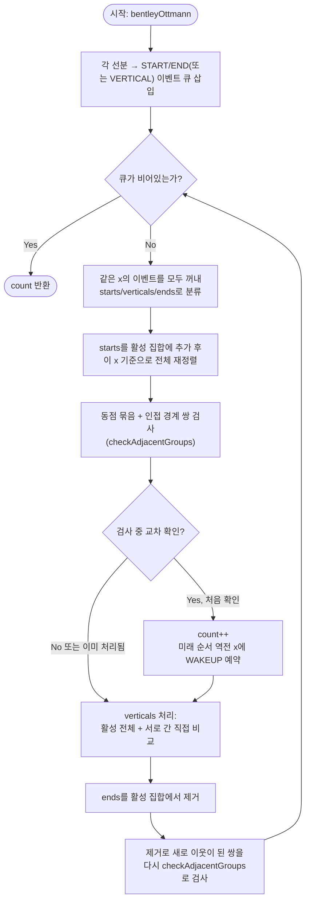

import { AlgorithmSimulation } from "#guide-sim";

# bentleyOttmann — 교차 직전엔 반드시 이웃해 있다는 사실 하나로 O(n²)을 줄이는 스위프 라인

## 한눈에 보는 컨셉

$n$개의 선분 중 교차하는 쌍의 수를 셀 때, 모든 쌍을 비교할 필요는 없어요. 두 선분이 교차하려면 교차 **직전**에 반드시 스위프 라인(가상의 수직선) 위에서 서로 **이웃**해 있어야 하기 때문입니다. Bentley-Ottmann은 이 사실을 이용해 선분의 시작·끝·교차라는 세 종류의 "사건"이 벌어질 때만 이웃 쌍을 검사하고, 멀리 있는 쌍은 아예 비교조차 하지 않아요. 그 결과 $O(n^2)$이던 비교 횟수가 $O((n+k)\log n)$으로 줄어듭니다($k$는 실제 교차 쌍의 수).

## 출발점: 가장 순진한 방법부터

문제를 먼저 정확히 잡을게요.

```ts
type Point = [number, number];
type Segment = [Point, Point];

function bentleyOttmann(segments: Segment[]): number
```

| 항목 | 내용 |
|------|------|
| `segments` | 선분 배열. 각 원소는 `[[x1,y1],[x2,y2]]` |
| 반환 | 교차하는 선분 **쌍**의 개수 ($\geq 0$인 정수) |
| 선분 수 $n$ | $0 \leq n \leq 10^5$ |
| 좌표 범위 | $-10^9 \leq x, y \leq 10^9$ (정수) |
| 교차 기준 | 내부 교차·끝점 공유·T자·공선 겹침 모두 "교차"로 카운트. $k$개가 한 점에서 만나면 $\binom{k}{2}$쌍 |

$$\text{count}(S) = \bigl|\{(i, j) \mid i < j,\; s_i \cap s_j \neq \emptyset\}\bigr|$$

가장 정직한 접근은 두 선분이 교차하는지 판정하는 함수 하나를 만들어 모든 쌍에 적용하는 겁니다. "교차 여부"는 두 선분의 네 끝점이 서로 상대 선분을 기준으로 어느 쪽에 있는지(방향 판정)로 나눗셈 없이 정확하게 판정할 수 있어요 — 이 판정 자체는 이 프로젝트의 [segmentsIntersect 가이드](../segmentsIntersect/segmentsIntersect-guide.mdx)가 상세히 다루므로, 여기서는 그 결론만 가져와 씁니다.

```ts
function cross(a: Point, b: Point, c: Point): number {
  return (b[0] - a[0]) * (c[1] - a[1]) - (b[1] - a[1]) * (c[0] - a[0]);
}
function onSegment(a: Point, b: Point, p: Point): boolean {
  return (
    Math.min(a[0], b[0]) <= p[0] && p[0] <= Math.max(a[0], b[0]) &&
    Math.min(a[1], b[1]) <= p[1] && p[1] <= Math.max(a[1], b[1])
  );
}
function sign(x: number): -1 | 0 | 1 {
  return x > 0 ? 1 : x < 0 ? -1 : 0;
}
function segsIntersect(s1: Segment, s2: Segment): boolean {
  const [p1, p2] = s1;
  const [p3, p4] = s2;
  const d1 = cross(p3, p4, p1), d2 = cross(p3, p4, p2);
  const d3 = cross(p1, p2, p3), d4 = cross(p1, p2, p4);
  const sd1 = sign(d1), sd2 = sign(d2), sd3 = sign(d3), sd4 = sign(d4);
  if (sd1 !== 0 && sd2 !== 0 && sd1 !== sd2 && sd3 !== 0 && sd4 !== 0 && sd3 !== sd4) return true;
  if (d1 === 0 && onSegment(p3, p4, p1)) return true;
  if (d2 === 0 && onSegment(p3, p4, p2)) return true;
  if (d3 === 0 && onSegment(p1, p2, p3)) return true;
  if (d4 === 0 && onSegment(p1, p2, p4)) return true;
  return false;
}

function bentleyOttmannNaive(segments: Segment[]): number {
  let count = 0;
  for (let i = 0; i < segments.length; i++) {
    for (let j = i + 1; j < segments.length; j++) {
      if (segsIntersect(segments[i]!, segments[j]!)) count++;
    }
  }
  return count;
}
```

비용을 수치로 체감해 볼게요.

```text
선분 6개 → 쌍의 수 = C(6,2) = 15
선분 n개 → 쌍의 수 = C(n,2) = n(n-1)/2 = O(n²)

n = 10^5 이면  ≈ 5 × 10^9 쌍 비교  →  1초 제한에 명백히 초과
```

$$T_{\text{naive}}(n) = \binom{n}{2} = O(n^2)$$

**목표 복잡도**: $O((n + k) \log n)$ — 이벤트 $O(n+k)$번 처리, 각 처리마다 $O(\log n)$ 자료구조 연산.
**공간 복잡도**: $O(n + k)$.

폭발 지점은 "공간적으로 멀리 떨어진 쌍도 무조건 비교한다"는 것입니다. 선분 $A$가 왼쪽 구석에, 선분 $Z$가 오른쪽 구석에 있으면 둘이 교차할 리 없다는 걸 사람은 한눈에 알 수 있는데, naive 코드는 그런 정보를 전혀 쓰지 않아요. **"가까이 있는 쌍만 비교할 방법이 없을까?"** — 이것이 다음 절의 출발 단서입니다.

## 아이디어 자세히 들여다보기

### 스위프 라인과 이웃 관계 — 수식과 그림

핵심 관찰은 이겁니다. **가상의 수직선(스위프 라인)을 왼쪽에서 오른쪽으로 이동시키면서, 그 순간 스위프 라인과 만나는 선분들을 $y$좌표 오름차순으로 나열해 보면 — 두 선분이 교차하려면 교차 직전에 반드시 이 나열에서 서로 이웃해야 합니다.**

```text
x = 1                  x = 3                  x = 5(교차 직후)
                                                
  s2 ---\                 s2                        s1
  s1 --- \---            /  s1                  \  / s2
          \--- s0       /--- s0                   \/
                                                    /\
활성 선분(위→아래): s2,s1,s0    s1,s0이 접근 중       s1,s0이 교차하며 순서가 뒤바뀜
```

왜 이 형태여야 할까요? 만약 $s_a$와 $s_b$가 서로 교차하는데 그 사이에 $s_c$가 끼어 있다면(즉 스위프 라인 위에서 $s_a, s_c, s_b$ 순서), $s_a$가 $s_b$와 같은 $y$에 도달하려면 반드시 $s_c$의 $y$값을 먼저 지나야 하고, 이는 $s_a$와 $s_c$가 먼저 순서를 바꾼다는 뜻이에요. 즉 **비인접 쌍의 순서 역전은 항상 인접 쌍의 순서 역전을 거쳐야만 일어납니다.** 그래서 인접 쌍만 검사해도 모든 교차를 놓치지 않아요.

이걸 형식화하면, 활성 선분 집합 $A(x)$(스위프 라인 $x$와 교차하는 모든 선분)에 대해 정렬 키는 각 선분이 그 $x$에서 갖는 $y$값입니다.

$$y_s(x) = y_{\text{left}} + (y_{\text{right}} - y_{\text{left}}) \cdot \frac{x - x_{\text{left}}}{x_{\text{right}} - x_{\text{left}}}$$

작은 예로 확인해 볼까요? $s_0=(0,0)\text{-}(6,6)$, $s_1=(0,3)\text{-}(6,0)$일 때 $x=2$에서 $y_{s_0}(2) = 0 + 6\cdot\frac{2}{6} = 2$, $y_{s_1}(2) = 3 + (-3)\cdot\frac{2}{6} = 2$ — 정확히 같아요. 이 $x=2$가 바로 두 선분이 만나는 지점입니다.

잠깐, 확인 하나만 해 볼까요? $x=0$에서는 $y_{s_0}(0)=0$, $y_{s_1}(0)=3$이라 $s_0$이 아래에 있는데, $x=6$에서는 $y_{s_0}(6)=6$, $y_{s_1}(6)=0$이라 $s_1$이 아래로 내려와 있습니다 — 두 선분의 위아래가 뒤바뀐 거예요. 이 역전이 일어나는 정확한 $x$가 바로 교차점입니다.

### 단서를 설명해주는 이론 — 방향 판정(Orientation Predicate)

두 선분이 실제로 이웃해졌을 때 "정말로 교차하는가"를 판정하는 도구가 필요합니다. 이때 쓰는 것이 계산기하학의 표준 primitive인 **방향 판정(orientation predicate)**이에요. 세 점 $a,b,c$에 대해

$$\mathrm{cross}(a,b,c) = (b_x-a_x)(c_y-a_y) - (b_y-a_y)(c_x-a_x)$$

의 부호가 $c$가 직선 $ab$의 왼쪽(+)·오른쪽(-)·위(0) 중 어디에 있는지를 나눗셈 없이 알려줍니다. 두 선분 $s_1=(p_1,p_2)$, $s_2=(p_3,p_4)$이 교차하려면, $p_1,p_2$가 직선 $p_3p_4$의 서로 다른 쪽에 있고 **동시에** $p_3,p_4$가 직선 $p_1p_2$의 서로 다른 쪽에 있어야 해요(위 naive 코드의 `segsIntersect`가 정확히 이 판정입니다). 공선(방향값이 0)인 경우는 bounding box 겹침(`onSegment`)으로 대신 판정하고요.

이 판정 하나가 Bentley-Ottmann 안에서 두 번 쓰입니다. 첫째는 "두 선분이 실제로 교차하는가"(방금 본 것), 둘째는 뒤에서 볼 "언제 순서가 뒤집히는가"를 계산할 때의 보조 도구로요. 좌표가 $10^9$까지 커지면 곱셈이 안전 정수 범위를 넘어설 수 있다는 점까지 포함해, 이 판정의 유도·정밀도 논의는 [segmentsIntersect 가이드](../segmentsIntersect/segmentsIntersect-guide.mdx)를 참고하세요. 이 가이드는 좌표가 작은 예시 위주로 다루므로 `number` 연산을 그대로 씁니다.

### 셈을 맡는 자료구조 — 이벤트 큐와 상태 구조

Bentley-Ottmann은 자료구조 두 개를 협력시킵니다.

- **이벤트 큐**: $x$좌표가 작은 순서로 "이 $x$에서 무슨 일이 일어나는가"를 꺼내 주는 최소 우선순위 큐예요. 매번 전체를 다시 훑지 않고 다음으로 처리할 $x$를 빠르게 뽑아내는 역할입니다. 이 프로젝트의 [priorityQueue 가이드](../../../data-structures/heap/priorityQueue/priorityQueue-guide.mdx)가 힙 기반 구현을 자세히 다루니, 여기서는 "최솟값을 빠르게 꺼내는 상자"로만 알고 있어도 충분해요.
- **상태 구조**: 현재 스위프 라인과 만나는 활성 선분들을 $y$좌표 순으로 유지하는 구조입니다. 이웃 조회·삽입·삭제가 잦으므로, 이 프로젝트의 [avlTree 가이드](../../../data-structures/tree/avlTree/avlTree-guide.mdx) 같은 균형 이진 탐색 트리를 쓰면 각 연산을 $O(\log n)$에 처리할 수 있어요. 이 가이드의 코드에서는 이해를 쉽게 하려고 **정렬된 배열**로 상태 구조를 대신하고, 실전에서 균형 BST로 바꾸면 무엇이 좋아지는지는 최적화 절 끝에서 다시 짚습니다.

### 왜 모순 없이 작동하는가

**불변식**: 어느 시점이든, 방금 처리한 이벤트의 $x$를 기준으로 상태 구조는 활성 선분들을 $y$좌표 오름차순으로 정확히 반영한다.

**기저**: 선분이 하나도 활성이 아닌 시작 시점에는 불변식이 공허하게 참입니다.

**귀납 단계**: 불변식이 성립하는 상태에서 다음 이벤트 $x$를 처리한다고 합시다. 이 $x$에서 일어날 수 있는 일은 정확히 세 가지뿐입니다 — 어떤 선분이 시작하거나(START), 끝나거나(END), 이미 활성인 두 선분의 순서가 뒤집힐 예정이거나(WAKEUP). 이 셋 이외의 "상태가 바뀌는 방식"은 없습니다(경우의 완전성) — 활성 집합의 원소 수는 START·END로만 바뀌고, 원소들의 상대 순서는 두 직선이 만나는 점을 지날 때만 바뀌기 때문이에요. 각 경우 처리 후 활성 선분들을 이 $x$ 기준으로 다시 정렬하면, 새로 정렬된 배열이 곧 불변식이 요구하는 상태이므로 귀납이 유지됩니다(각 경우의 정확성).

**완전성(모든 교차가 발견되는 이유)**: 두 선분 $s_a, s_b$가 실제로 교차한다고 합시다. 스위프 라인과 관찰(위 "스위프 라인과 이웃 관계" 절)에 의해, 교차 직전 어느 순간엔 $s_a, s_b$가 상태 구조에서 반드시 이웃입니다. 그 이웃 관계는 (1) 두 선분이 둘 다 활성인 동안 계속 이웃이었거나, (2) 셋째 선분이 시작·종료하며 새로 이웃이 되었거나, (3) 다른 쌍의 순서 역전으로 새로 이웃이 되었거나— 이 세 경로 중 하나로 반드시 발생합니다. 이 알고리즘은 START·END 처리 직후, 그리고 순서 역전(WAKEUP) 처리 직후마다 **그 순간의 인접 쌍을 전부** 검사하므로, 위 세 경로 중 어느 것으로 이웃이 됐든 검사망에 걸립니다.

여기서 **헷갈리기 쉬운 포인트**가 둘 있습니다.

**포인트 1 — 셋 이상이 정확히 한 점에서 만나면 "인접한 쌍"만 봐서는 부족합니다.** 선분 3개가 한 점에서 만나면 $y$값이 정확히 같은 3개가 나란히 정렬되는데, 이때 "바로 옆끼리만" 비교하면 양 끝 쌍을 놓칩니다. 구체적으로 확인해 볼게요.

```text
s0 = (0,0)-(2,0)   s1 = (2,0)-(0,1)   s2 = (3,3)-(2,0)
세 선분 모두 점 (2,0)을 공유 → 실제 교차 쌍은 (s0,s1),(s0,s2),(s1,s2) = 3쌍

x=2에서 세 선분의 y값이 모두 0으로 동점 → 정렬 순서는 [s1, s0, s2] (기울기 순)

"바로 옆끼리만" 비교하면:  (s1,s0) 검사 ✓,  (s0,s2) 검사 ✓,  (s1,s2)는 서로 옆이 아니므로 검사 안 함 ✗
→ count = 2  (틀림, 정답은 3)

올바른 방법: 정확히 같은 y로 묶인 구간(s1,s0,s2 전체)을 통째로 서로 짝지어 검사
→ (s1,s0),(s1,s2),(s0,s2) 모두 검사 → count = 3  ✓
```

**포인트 2 — 선분이 사라질 때(END)도 다시 인접 검사를 해야 합니다.** 선분 하나가 스위프 라인을 벗어나 제거되면, 그 위아래에 있던 두 선분이 처음으로 이웃이 됩니다. 이 재검사를 빼먹으면 두 선분이 실제로 교차하는데도 **단 한 번도 이웃으로 확인되지 않아** 통째로 누락됩니다.

```text
s0=(3,4)-(4,2), s1=(4,5)-(0,4), s2=(2,6)-(3,3), s3=(2,5)-(0,5)
실제 교차 쌍은 (s1,s2) 하나뿐(count=1)이지만, s1과 s2는 s3·s0이 사이를
막고 있는 동안에는 한 번도 직접 이웃이 되지 않는다.

END에서 재검사를 빼먹으면: s3 제거 직후 s1-s2가 새로 이웃이 됐다는 사실을
확인할 기회를 놓쳐 → count = 0 (틀림, 정답은 1)

END 처리 후 다시 인접 검사를 하면: s3 제거 직후 [s1, s2] 순서를 확인해
(s1,s2)를 즉시 검사 → count = 1  ✓
```

엣지 케이스를 불변식 위에서 점검해 보면:

```text
n = 0                         → 이벤트가 없어 루프가 돌지 않고 0 반환
n = 1                         → 짝이 없어 0 반환
끝점 공유(L자)                 → START가 END보다 먼저 처리되므로 공유 순간에 이웃으로 잡힘
수직 선분(x1=x2)               → "왼쪽 x, 오른쪽 x"가 없어 별도 취급이 필요(코드 절에서 설명)
공선 겹침                      → 방향 판정이 항상 0이라 순서 역전 계산은 못 하지만,
                                  bounding box 겹침으로 교차 자체는 정확히 잡힌다
```

## 아이디어를 코드로 옮기기

먼저 선분을 다루기 쉬운 형태로 정규화합니다. 수직 선분($x_1=x_2$)은 "왼쪽 끝·오른쪽 끝"이 없어 위의 $y_s(x)$ 공식을 쓸 수 없으므로 따로 표시해 둡니다.

```ts
interface Seg {
  id: number;
  raw: Segment;
  vertical: boolean;
  left: Point;   // 비수직: x가 작은 끝점
  right: Point;  // 비수직: x가 큰 끝점
  slope: number; // 비수직: (ry-ly)/(rx-lx)
  x: number;     // 수직: x 좌표
}

function buildSeg(id: number, raw: Segment): Seg {
  const [p, q] = raw;
  if (p[0] === q[0]) {
    return { id, raw, vertical: true, left: p, right: q, slope: NaN, x: p[0] };
  }
  const [left, right] = p[0] < q[0] ? [p, q] : [q, p];
  const slope = (right[1] - left[1]) / (right[0] - left[0]);
  return { id, raw, vertical: false, left, right, slope, x: NaN };
}

function yAt(seg: Seg, x: number): number {
  const [lx, ly] = seg.left;
  const [rx, ry] = seg.right;
  return ly + ((ry - ly) * (x - lx)) / (rx - lx);
}
```

두 선분이 미래의 어느 $x$에서 순서를 뒤집을지는, naive 코드에서 쓴 것과 같은 직선 교차 공식으로 구합니다. 평행·공선이거나 두 선분의 실제 범위 밖에서 만나면(교차점이 각 선분 위에 있지 않으면) `null`을 반환해요. `EPS`는 $t, u$가 $[0,1]$ 경계에 딱 걸치는 경우의 부동소수 오차를 흡수하는 여유이고, `TIE_EPS`는 뒤에서 상태 구조를 정렬할 때 "거의 같은 $y$"를 동점으로 묶는 데 씁니다.

```ts
const EPS = 1e-9;
const TIE_EPS = 1e-6;

function properCrossingX(s1: Seg, s2: Seg): number | null {
  const [p1, p2] = s1.raw;
  const [p3, p4] = s2.raw;
  const rX = p2[0] - p1[0], rY = p2[1] - p1[1];
  const sX = p4[0] - p3[0], sY = p4[1] - p3[1];
  const denom = rX * sY - rY * sX;
  if (denom === 0) return null;
  const t = ((p3[0] - p1[0]) * sY - (p3[1] - p1[1]) * sX) / denom;
  const u = ((p3[0] - p1[0]) * rY - (p3[1] - p1[1]) * rX) / denom;
  if (t < -EPS || t > 1 + EPS || u < -EPS || u > 1 + EPS) return null;
  return p1[0] + t * rX;
}
```

잠깐 — `properCrossingX`의 `rX * sY`, `rY * sX` 같은 곱도 앞서 방향 판정에서 짚은 것과 똑같은 안전 정수 범위 문제를 그대로 물려받습니다. 좌표가 $10^9$ 근방이면 이 곱은 $10^{18}$ 자리까지 커져 `number`의 안전 정수 범위($2^{53} \approx 9 \times 10^{15}$)를 넘어서고, 곧이어 `/ denom` 나눗셈까지 겹쳐 오차가 누적돼요. 이 가이드는 작은 좌표 예시로만 검증하므로 `number`를 그대로 쓰지만, 큰 좌표를 그대로 다루려면 [segmentsIntersect 가이드](../segmentsIntersect/segmentsIntersect-guide.mdx)가 다루는 안전 정수 연산(또는 BigInt) 전략을 여기에도 그대로 가져와야 합니다.

이벤트 큐는 우선 "가장 단순하게" 만듭니다 — 배열에 밀어 넣고, 꺼낼 때마다 전체를 훑어 최솟값을 찾는 방식이에요. `type` 우선순위는 같은 $x$에서 START(0) < VERTICAL(1) < WAKEUP(2) < END(3) 순으로 처리되도록 정합니다(START가 END보다 먼저여야 끝점 공유가 잡힌다는 것을 앞의 "왜 모순 없이 작동하는가" 절에서 봤죠).

```ts
type EvType = 0 | 1 | 2 | 3;
interface Ev { x: number; type: EvType; id: number } // WAKEUP은 id=-1

function evLess(u: Ev, v: Ev): boolean {
  if (u.x !== v.x) return u.x < v.x;
  return u.type < v.type;
}
class EventQueue {
  private items: Ev[] = [];
  get size() { return this.items.length; }
  push(e: Ev) { this.items.push(e); }
  private minIndex(): number {
    let bi = 0;
    for (let i = 1; i < this.items.length; i++) {
      if (evLess(this.items[i]!, this.items[bi]!)) bi = i;
    }
    return bi;
  }
  pop(): Ev { return this.items.splice(this.minIndex(), 1)[0]!; }
  peek(): Ev | undefined { return this.items.length ? this.items[this.minIndex()] : undefined; }
}
```

이제 본체입니다. `checkPair`가 이 알고리즘의 핵심 결정을 담당해요 — **교차 여부 카운트와 "언제 다시 정렬할지" 예약을 분리**합니다. 두 선분이 교차하는지는 `segsIntersect`로 언제 확인하든 같은 답이 나오는 사실이라, 지금 당장 세도 됩니다. 대신 상태 구조의 순서를 언제 뒤집어야 하는지만 WAKEUP으로 예약해 둡니다.

```ts
function bentleyOttmann(segments: Segment[]): number {
  const n = segments.length;
  if (n < 2) return 0;
  const segs = segments.map((s, i) => buildSeg(i, s));

  let sweepX = -Infinity;
  let active: number[] = []; // 비수직 활성 선분 id (정렬 상태는 이벤트마다 새로 계산)

  const processed = new Set<string>();
  const wakeupAt = new Set<number>(); // 이미 예약한 교차 x(반올림 키)
  const pairKey = (a: number, b: number) => (a < b ? `${a}_${b}` : `${b}_${a}`);
  let count = 0;
  const heap = new EventQueue();

  function checkPair(a: number, b: number) {
    if (a === b) return;
    const k = pairKey(a, b);
    if (!processed.has(k) && segsIntersect(segs[a]!.raw, segs[b]!.raw)) {
      processed.add(k);
      count++;
    }
    if (!segs[a]!.vertical && !segs[b]!.vertical) {
      const cx = properCrossingX(segs[a]!, segs[b]!);
      if (cx !== null && cx > sweepX + EPS) {
        const key = Math.round(cx * 1e6);
        if (!wakeupAt.has(key)) {
          wakeupAt.add(key);
          heap.push({ x: cx, type: 2, id: -1 });
        }
      }
    }
  }

  // 정확히 같은 y로 묶인 연속 구간은 통째로 서로 짝지어 검사하고,
  // 그다음 묶음과의 경계만 평범한 인접 쌍으로 검사한다("왜 모순 없이 작동하는가" 절의 포인트 1).
  function checkAdjacentGroups(sortedArr: number[], x: number) {
    let gi = 0;
    while (gi < sortedArr.length) {
      let gj = gi;
      while (
        gj + 1 < sortedArr.length &&
        Math.abs(yAt(segs[sortedArr[gj + 1]!]!, x) - yAt(segs[sortedArr[gi]!]!, x)) < TIE_EPS
      ) gj++;
      for (let p = gi; p <= gj; p++) {
        for (let q = p + 1; q <= gj; q++) checkPair(sortedArr[p]!, sortedArr[q]!);
      }
      if (gj + 1 < sortedArr.length) checkPair(sortedArr[gj]!, sortedArr[gj + 1]!);
      gi = gj + 1;
    }
  }

  function sortedByY(ids: number[], x: number): number[] {
    return [...ids].sort((p, q) => {
      const yp = yAt(segs[p]!, x), yq = yAt(segs[q]!, x);
      if (Math.abs(yp - yq) >= TIE_EPS) return yp - yq;
      const sp = segs[p]!.slope, sq = segs[q]!.slope;
      if (sp !== sq) return sp - sq;
      return p - q;
    });
  }

  for (const s of segs) {
    if (s.vertical) heap.push({ x: s.x, type: 1, id: s.id });
    else {
      heap.push({ x: s.left[0], type: 0, id: s.id });
      heap.push({ x: s.right[0], type: 3, id: s.id });
    }
  }

  while (heap.size > 0) {
    const x = heap.peek()!.x;
    const starts: number[] = [], verticals: number[] = [], ends: number[] = [];
    while (heap.size > 0 && heap.peek()!.x === x) {
      const e = heap.pop();
      if (e.type === 0) starts.push(e.id);
      else if (e.type === 1) verticals.push(e.id);
      else if (e.type === 3) ends.push(e.id);
      // type === 2 (WAKEUP)는 재정렬을 유도할 뿐 담을 대상이 없다.
    }
    sweepX = x;

    for (const id of starts) active.push(id);
    active = sortedByY(active, x);
    checkAdjacentGroups(active, x);

    for (let vi = 0; vi < verticals.length; vi++) {
      const vid = verticals[vi]!;
      for (const aid of active) checkPair(vid, aid);
      for (let vj = vi + 1; vj < verticals.length; vj++) checkPair(vid, verticals[vj]!);
    }

    if (ends.length > 0) {
      const endSet = new Set(ends);
      active = active.filter((id) => !endSet.has(id));
      checkAdjacentGroups(active, x); // 포인트 2: 제거 후 새 이웃도 검사
    }
  }

  return count;
}
```

**가장 중요한 부분은 `checkAdjacentGroups`를 START 처리 직후와 END 처리 직후, 이렇게 두 번 부른다는 것입니다.** START 직후는 "새로 삽입된 선분과 그 이웃", END 직후는 "제거로 새로 노출된 이웃"을 잡기 위해서예요. 어느 한쪽만 빼먹으면 "왜 모순 없이 작동하는가" 절의 포인트 2에서 본 것처럼 교차를 통째로 놓칩니다.

그 외에 놓치기 쉬운 지점:
- `TIE_EPS`로 "거의 같은 $y$"까지 동점으로 묶는 이유는, 정렬 비교에서 부동소수 나눗셈으로 계산한 $y$값에 아주 미세한 반올림 오차가 낄 수 있기 때문입니다. 정확히 `===`로만 동점을 판정하면, 교차 지점 바로 그 $x$에서 노이즈 때문에 "아직 동점 아님"으로 오판해 기울기 tiebreak으로 못 넘어가고 순서가 안 뒤집히는 경우가 생겨요. 구체적으로, 좌표 $(44,38)\text{-}(2,28)$, $(40,49)\text{-}(33,0)$, $(43,38)\text{-}(13,40)$, $(27,29)\text{-}(40,23)$ 네 선분에서 이 여유를 빼면 실제 답 3쌍 중 2쌍만 세어집니다.
- `checkPair`에서 카운트와 WAKEUP 예약을 **분리**한 것이 핵심입니다. 두 선분이 지금 당장 이웃이 아니더라도, 언젠가 이웃으로 확인되는 순간 `segsIntersect`는 항상 같은 답을 주므로 그때 세면 됩니다. 반대로 "언제 순서를 뒤집을지"는 시점이 중요해서 별도로 예약해야 해요.
- 수직 선분(VERTICAL) 처리 줄 `for (const aid of active) checkPair(vid, aid);`은 사실 이 절 서두의 "이웃 쌍만 검사한다"는 원칙에서 일부러 벗어난 지점입니다. 수직 선분은 $y_s(x)$ 공식이 없어 활성 배열 안에서 정렬 위치를 매길 수 없으므로, 여기서는 정확성을 우선해 **활성 전체와 직접 비교**합니다 — 그만큼 수직 선분이 많은 입력에서는 이 부분이 $O(n)$개 비교를 유발해 전체 시간·공간 모두 목표 복잡도 $O((n+k)\log n)$·$O(n+k)$를 넘어설 수 있어요. 표준 구현에서는 상태 구조가 $y$ 범위 질의(range query)를 지원하도록 만들어, 수직 선분의 $[y_{\min}, y_{\max}]$ 구간에 걸치는 활성 선분만 뽑아 비교합니다.

## 더 빠르게 만들 단서 찾기

`EventQueue.pop`을 다시 봅시다. 이벤트를 하나 꺼낼 때마다 **남은 이벤트 전체**를 훑어 최솟값을 찾습니다.

```text
이벤트 총 개수 E = O(n + k)
pop 한 번        = O(E) (전체 스캔)
pop을 E번 반복    = O(E²)

n=10^5, k가 조금만 커져도 E² 이 감당 안 되는 규모로 커진다
```

이벤트를 "꺼낼 때마다 전체를 다시 본다"는 게 낭비의 정체입니다. 매번 새로 찾는 대신, 항상 최솟값이 맨 위에 오도록 **구조를 유지**할 수 있다면 어떨까요?

## 단서를 최적화로 연결하기

이진 최소 힙(binary min-heap)을 쓰면 됩니다. 배열을 완전 이진 트리로 취급해, 부모가 항상 두 자식보다 작은 값을 갖도록 유지하는 자료구조예요([priorityQueue 가이드](../../../data-structures/heap/priorityQueue/priorityQueue-guide.mdx) 참고). 삽입·추출 모두 트리의 높이인 $O(\log E)$ 안에 끝납니다.

```text
Before(선형 스캔):  pop마다 배열 전체 O(E) 스캔
After(이진 힙):     pop마다 뿌리 하나 꺼내고 O(log E)로 재정렬

불변식: 힙 배열의 모든 인덱스 i에 대해 h[i]는 h[2i+1], h[2i+2]보다 작거나 같다
```

## 최적화 코드

바뀌는 곳은 이벤트 큐 클래스 하나뿐입니다. `EventQueue`를 이진 힙 `EventHeap`으로 바꾸고, 본체 코드의 `new EventQueue()`를 `new EventHeap()`로 교체하면 끝이에요.

```ts
class EventHeap {
  private h: Ev[] = [];
  get size() { return this.h.length; }
  private less(u: Ev, v: Ev): boolean {
    if (u.x !== v.x) return u.x < v.x;
    return u.type < v.type;
  }
  push(e: Ev) {
    const h = this.h;
    h.push(e);
    let i = h.length - 1;
    while (i > 0) {
      const p = (i - 1) >> 1;
      if (this.less(h[i]!, h[p]!)) { [h[i], h[p]] = [h[p]!, h[i]!]; i = p; }
      else break;
    }
  }
  pop(): Ev {
    const h = this.h;
    const top = h[0]!;
    const last = h.pop()!;
    if (h.length > 0) {
      h[0] = last;
      let i = 0;
      const n = h.length;
      for (;;) {
        let smallest = i;
        const l = i * 2 + 1, r = i * 2 + 2;
        if (l < n && this.less(h[l]!, h[smallest]!)) smallest = l;
        if (r < n && this.less(h[r]!, h[smallest]!)) smallest = r;
        if (smallest === i) break;
        [h[i], h[smallest]] = [h[smallest]!, h[i]!];
        i = smallest;
      }
    }
    return top;
  }
  peek(): Ev | undefined { return this.h[0]; }
}
```

**가장 중요한 줄은 `push`의 `while (i > 0)` 루프와 `pop`의 `for (;;)` 루프입니다.** 삽입은 맨 끝에 넣고 부모와 비교하며 위로 올리고(sift-up), 추출은 뿌리를 꺼낸 뒤 마지막 원소를 뿌리로 옮기고 작은 자식과 비교하며 아래로 내립니다(sift-down). 둘 다 트리의 높이만큼만 움직이므로 $O(\log E)$예요. 순서를 바꿔 부모·자식 비교를 빼먹으면 힙 불변식이 조용히 깨지고, 이후 `pop`이 최솟값이 아닌 값을 반환하는데도 에러 없이 그냥 틀린 값을 돌려줍니다.

> 기억법: 힙은 "완전히 정렬된 배열"이 아니라 "부모가 자식보다 작다"는 국소 규칙만 지키는 느슨한 구조예요. 그래서 삽입·추출이 $O(\log E)$로 끝나는 대신, 두 번째로 작은 값이 어디 있는지는 알 수 없습니다.

이벤트 큐는 이제 $O(\log E)$입니다. 그런데 상태 구조(`active`)는 여전히 매 이벤트마다 배열을 통째로 다시 정렬(`sortedByY`)하고, `checkAdjacentGroups`도 이 정렬 결과 전체를 다시 훑습니다 — 활성 선분이 $m$개면 이벤트 하나당 $O(m \log m)$이에요.

여기서 짚어야 할 것은, 목표 복잡도에 도달하려면 **자료구조만 바꿔서는 부족하다**는 점입니다. `sortedByY`(전체 재정렬)와 `checkAdjacentGroups`(전체 인접쌍 재검사)를 그대로 둔 채 배열만 [avlTree](../../../data-structures/tree/avlTree/avlTree-guide.mdx) 같은 균형 이진 탐색 트리로 바꾸면, "매번 트리 전체를 다시 만들고 전체를 훑는" 셈이라 여전히 $O(m \log m)$입니다. 목표에 도달하려면 갱신 방식 자체를 국소화해야 해요 — START/END는 그 지점 하나만 삽입·삭제(각각 $O(\log n)$), WAKEUP은 순서가 뒤집히는 **두 이웃 노드만** 맞바꾸고 그 결과로 새로 이웃해진 쌍만 검사합니다. "삽입 위치 찾기·이웃 조회·인접 노드 맞바꾸기"가 각각 $O(\log n)$인 트리 연산으로 이 국소 갱신을 구현해야 비로소 $O((n+k)\log n)$에 도달해요. 이 가이드는 배열 기반의 "전체 재정렬 + 전체 인접쌍 재검사"가 스위프 라인의 핵심 아이디어(인접 쌍만 본다, 카운트와 재정렬을 분리한다)를 더 선명하게 보여준다고 판단해 여기서 멈추고, 국소 갱신으로의 전환은 균형 이진 탐색 트리 자료구조 자체의 몫으로 남겨 둡니다.

더 특화된 해법도 있습니다. 교차 "개수"만 필요하고 좌표 열거가 필요 없다면 오프라인 divide-and-conquer 기법으로 상수를 더 줄일 수 있지만, 구현이 훨씬 복잡해요. Bentley-Ottmann의 가치는 최고 속도가 아니라 **범용성**입니다 — 교차 쌍의 좌표까지 열거하거나, 수직선·다각형 경계 같은 특수한 선분 집합을 다룰 때도 같은 틀(이벤트 + 상태 구조)을 그대로 재사용할 수 있어요.

## 실행 시각화

예시 선분 3개로 스위프 라인을 실행해 교차 쌍 수를 셉니다. `s0=(0,0)-(6,6)`, `s1=(0,3)-(6,0)`, `s2=(0,5)-(6,4)`. 세 선분 모두 START 이벤트가 $x=0$에 몰려 있어, $x=0$에서 한꺼번에 삽입되고 그 자리에서 바로 인접 검사가 이뤄집니다. keyValue 패널은 현재 스위프 `x`, 상태 구조(활성 선분의 아래→위 순서), 누적 `count`를 보여줘요.

실제 반환값은 `2`이며, 시뮬레이션 마지막 프레임의 `count`와 일치합니다(위 스크래치 코드로 직접 실행해 확인했습니다).

> 대화형 시뮬레이션은 MDX 런타임에서 표시됩니다.

export const steps = [
  {
    title: "이벤트 큐 구성",
    detail: "세 선분 모두 START(x=0), END(x=6) 이벤트를 큐에 넣는다. 같은 x에서는 START가 END보다 먼저 처리된다.",
    entries: [
      { label: "선분", value: "s0,s1,s2" },
      { label: "상태 구조", value: "(비어 있음)" },
      { label: "count", value: 0 },
    ],
  },
  {
    title: "x=0: START 세 선분 삽입 + 인접쌍 검사",
    detail: "y 순서로 아래→위 정렬: s0(y=0), s1(y=3), s2(y=5). 인접 쌍 검사: s0-s1은 교차(segsIntersect=true)로 즉시 카운트, s1-s2는 교차 없음.",
    entries: [
      { label: "sweep_x", value: 0 },
      { label: "상태 구조(아래→위)", value: "[s0, s1, s2]" },
      { label: "WAKEUP 예약", value: "x=2 (s0-s1 순서 역전)" },
      { label: "count", value: 1 },
    ],
  },
  {
    title: "x=2: WAKEUP — 상태 구조 재정렬",
    detail: "예약된 x=2에서 활성 선분을 다시 정렬하면 s0과 s1의 순서가 뒤집힌다. 새로 인접한 s0-s2를 검사해 교차를 확인, 즉시 카운트.",
    entries: [
      { label: "sweep_x", value: 2 },
      { label: "상태 구조(아래→위)", value: "[s1, s0, s2]" },
      { label: "WAKEUP 예약", value: "x≈4.29 (s0-s2 순서 역전)" },
      { label: "count", value: 2 },
    ],
  },
  {
    title: "x≈4.29: WAKEUP — 다시 재정렬",
    detail: "s0과 s2의 순서가 뒤집힌다. 새로 인접한 s1-s2, s2-s0을 검사하지만 이미 처리된 쌍이거나 교차가 없어 count는 그대로.",
    entries: [
      { label: "sweep_x", value: "≈4.29" },
      { label: "상태 구조(아래→위)", value: "[s1, s2, s0]" },
      { label: "count", value: 2 },
    ],
  },
  {
    title: "x=6: END 세 선분 제거",
    detail: "남은 이벤트는 END뿐. 제거 후 다시 인접 검사를 하지만 활성 선분이 남지 않아 추가로 셀 쌍이 없다.",
    entries: [
      { label: "sweep_x", value: 6 },
      { label: "상태 구조", value: "[] (모두 제거)" },
      { label: "count", value: 2 },
    ],
  },
  {
    title: "완료: count = 2",
    detail: "큐가 비어 종료. 교차하는 선분 쌍은 s0-s1, s0-s2 두 쌍(s1-s2는 교차하지 않음).",
    entries: [
      { label: "반환값 count", value: 2 },
    ],
  },
];

<AlgorithmSimulation view="keyValue" steps={steps} title="Bentley-Ottmann 스위프 라인" />

## 흐름 한눈에 보기



**핵심 불변식**: 방금 처리한 이벤트의 $x$를 기준으로, 활성 선분들은 항상 $y$좌표 오름차순으로 정렬돼 있다. 이 불변식이 성립하는 한 인접 쌍(과 동점 묶음) 검사만으로 모든 교차를 놓치지 않는다. `count`는 단조 증가하며, `processed` 집합이 중복 카운트를 막는다.

## 스스로 점검하기

1. 선분 `s0=(0,0)-(4,0)`, `s1=(2,0)-(6,0)`(공선 겹침)에 대해 `properCrossingX(s0,s1)`이 어떤 값을 반환할지 먼저 생각해 보고, 그래도 `count`가 1이 되는 이유를 `checkPair`의 어느 부분이 책임지는지 짚어 보세요. (힌트: 두 선분이 같은 직선 위에 있으면 `denom`이 0입니다.)
2. `checkAdjacentGroups`를 END 처리 직후에는 부르지 않도록 코드를 바꾼다면, 본문의 `s0=(3,4)-(4,2)`, `s1=(4,5)-(0,4)`, `s2=(2,6)-(3,3)`, `s3=(2,5)-(0,5)` 네 선분 예시에서 정확히 어느 시점에 `s1-s2` 쌍이 영원히 검사되지 않는지 이벤트 순서를 따라가며 추적해 보세요.
3. 이 알고리즘을 "교차하는 쌍의 개수"가 아니라 "모든 교차점의 좌표를 열거하라"는 문제로 바꾸려면 어떤 부분을 손봐야 할까요? (힌트: 지금은 `checkPair`가 교차 사실만 기록하고 좌표는 버립니다.)
