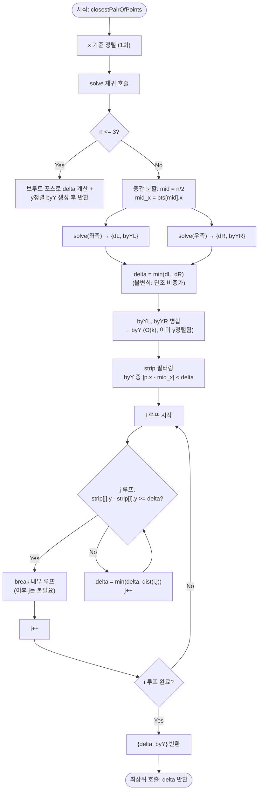

import { AlgorithmSimulation } from "#guide-sim";

# closestPairOfPoints — 절반으로 나눠도 경계선 근처만 다시 보면 되는 이유

## 한눈에 보는 컨셉

2차원 평면 위에 흩어진 점들 중 가장 가까운 두 점의 거리를 구하는 문제예요. 모든 쌍을 비교하면 `O(n^2)`이지만, 점을 x좌표로 정렬한 뒤 절반씩 나누고 "분할선 근처 좁은 스트립"만 추가로 살피면 `O(n log n)`에 끝낼 수 있어요. 핵심 관찰은 하나입니다 — 이미 찾은 최솟값 δ보다 멀리 떨어진 점 쌍은 애초에 답이 될 수 없으니, 분할선에서 δ 폭 안쪽만 다시 보면 충분하다는 것이에요.

## 출발점: 가장 순진한 방법부터

먼저 문제를 정확히 잡을게요.

```ts
type Point = [number, number];

function closestPairOfPoints(points: Point[]): number
```

| 파라미터/반환 | 의미 | 제약 |
|---|---|---|
| `points` | `[x, y]` 형태의 2차원 점 배열 | 길이 $n$, $2 \leq n \leq 10^5$, $-10^9 \leq x, y \leq 10^9$ |
| 반환값 | 가장 가까운 두 점 사이의 유클리드 거리 | $\geq 0$인 부동소수. 같은 좌표의 점이 둘 이상이면 $0$ |

가장 가까운 쌍을 찾으라는 말을 들으면 제일 정직한 반응은 "모든 쌍을 다 재보자"예요. 점이 $n$개면 쌍은 $\binom{n}{2}$개니까, 그걸 다 계산해서 최솟값을 고르면 됩니다.

```ts
function dist(a: Point, b: Point): number {
  const dx = a[0] - b[0];
  const dy = a[1] - b[1];
  return Math.sqrt(dx * dx + dy * dy);
}

function bruteForce(points: Point[]): number {
  let best = Infinity;
  for (let i = 0; i < points.length; i++) {
    for (let j = i + 1; j < points.length; j++) {
      const d = dist(points[i], points[j]);
      if (d < best) best = d;
    }
  }
  return best;
}
```

짚어 둘 게 하나 있어요. `dx * dx + dy * dy`는 좌표가 $\pm 10^9$까지 갈 수 있는 이 문제에서 최대 $8 \times 10^{18}$까지 커지는데, JS `number`가 정수를 오차 없이 표현하는 한계는 $2^{53} \approx 9 \times 10^{15}$이에요. 즉 이 제곱합 자체는 딱 떨어지는 정수로 저장되지 않을 수 있습니다. 다행히 최종적으로 쓰는 건 `Math.sqrt`를 거친 근사 거리값끼리의 대소 비교라 실전 입력에서 순위가 뒤집히는 사고는 드물지만, 극단적으로 촘촘한 좌표를 다뤄야 한다면 제곱거리를 `BigInt`로 정수 그대로 비교하는 대안도 있다는 것만 기억해 두세요.

작은 예로 직접 세어 봅시다. 점 6개 `[(0,0),(1,1),(2,0),(4,1),(5,0),(6,1)]`이 있다면 쌍의 개수는 이렇습니다.

```text
점 6개:     쌍의 개수 = C(6,2) = 15                → 사람이 손으로도 셀 만함
점 10^5개:  쌍의 개수 ≈ 5 × 10^9                    → 1초 제한에 도저히 안 됨
```

$n = 10^5$이면 약 $5 \times 10^9$번의 거리 계산이 필요해서 제한 시간을 훌쩍 넘겨요. 문제는 단순히 "느리다"가 아니라, 이 방법에는 **"이미 찾은 최솟값보다 먼 쌍은 건너뛴다"는 장치가 아예 없다**는 점입니다. 점 A와 점 B가 아주 멀리 떨어져 있어도, 루프는 어김없이 둘의 거리를 계산해요.

그런데 점들을 x좌표로 한 번 정렬해 놓으면 낌새가 보입니다. **가까운 두 점은 x좌표도 가까울 수밖에 없다**는 거예요. 정렬된 배열을 절반으로 쪼개면, 각 절반 안의 답은 재귀로 구하면 되고, 남는 건 "절반의 경계를 가로지르는 쌍"뿐입니다. 목표 복잡도는 이 재귀 구조에서 나오는 $T(n) = 2T(n/2) + O(n)$의 해인 `O(n log n)`이에요.

## 아이디어 자세히 들여다보기

### 분할선 근처만 의심하기 — 수식과 그림

점 배열 $P$를 x좌표로 정렬한 뒤, 인덱스 중간값 `mid`로 왼쪽 $P_L$과 오른쪽 $P_R$을 나눕니다.

$$P_L = \{p \in P \mid \text{idx}(p) < \text{mid}\}, \qquad P_R = \{p \in P \mid \text{idx}(p) \geq \text{mid}\}$$

정렬돼 있으므로 $P_L$의 모든 점은 $P_R$의 모든 점보다 x좌표가 작거나 같습니다. 분할선의 x좌표를 $x_m = P[\text{mid}].x$라 하면, 재귀로 양쪽 최솟값을 구한 뒤 다음을 계산해요.

$$\delta_L = d^*(P_L), \quad \delta_R = d^*(P_R), \quad \delta = \min(\delta_L, \delta_R)$$

이제 남은 건 "왼쪽에서 하나, 오른쪽에서 하나를 뽑은 쌍" 중 $\delta$보다 가까운 게 있는지 확인하는 일입니다. 그런데 이런 쌍이 있다면, 두 점 모두 분할선에서 $\delta$ 이내에 있어야만 해요 — 그렇지 않으면 x좌표 차이만으로 이미 거리가 $\delta$ 이상이 되니까요. 그래서 검사 대상을 이 좁은 영역, **스트립(strip)** 으로 줄일 수 있습니다.

$$\text{Strip} = \{p \in P \mid |p_x - x_m| < \delta\}$$

그림으로 보면 이렇습니다. 앞서 본 6개 점 예시를 그대로 씁니다.

```text
x:        0    1    2         4    5    6
점:      (0,0)(1,1)(2,0)  |  (4,1)(5,0)(6,1)
                 P_L        x_m=4    P_R

δ = min(δ_L, δ_R) = √2 ≈ 1.4142 라고 하면:

x:        0    1    2    [2.59      5.41]    6
                          └── |x-4|<δ 스트립 ──┘
스트립 안 점: (4,1), (5,0)          ← 이 둘만 추가로 비교하면 끝
```

**왜 하필 폭이 δ여야 할까요?** 폭을 δ보다 좁게 잡으면, 실제로 δ보다 가까운 교차 쌍이 스트립 밖으로 밀려나 놓칠 수 있어요. 반대로 폭을 넓게 잡으면(예: $2\delta$) 정확성은 그대로 유지되지만 — 놓치는 후보가 없으니까요 — 스트립 안 점 개수가 불필요하게 늘어나서, 뒤에서 도출할 "점당 비교 후보 최대 7개"라는 값이 더 느슨한 상수로 커집니다. 딱 $\delta$가 "놓치지 않으면서 가장 좁은" 경계예요.

> 확인 질문 하나: 스트립 폭을 $\delta$ 대신 $2\delta$로 넉넉하게 잡으면 정답이 달라질까요? 정답은 "아니요, 정확성은 그대로입니다"입니다 — $\delta$보다 넓은 영역이니 필요한 후보를 하나도 놓치지 않아요. 다만 다음 절에서 구할 "점당 비교 후보 수"라는 상수가 더 커집니다.

### 단서를 설명해 주는 이론 — 비둘기집 원리

"스트립 안 점들을 그냥 다 서로 비교하면 되지 않나?"라는 생각이 들 수 있어요. 스트립 크기가 최악의 경우 $n$에 가까울 수 있으니, 이대로면 다시 $O(n^2)$이 될 위험이 있습니다. 여기서 구원투수로 등장하는 게 **비둘기집 원리(pigeonhole principle)** 예요 — "칸이 $k$개인데 비둘기가 $k+1$마리면, 어느 칸엔가 비둘기가 두 마리 이상 들어간다"는 그 원리입니다.

스트립을 y좌표로 정렬해 두면, 점 $p$와 비교해야 할 상대는 $y$ 차이가 $\delta$ 미만인 점들뿐입니다(그 이상 벌어지면 이후 점은 전부 더 멀다는 게 정렬로 보장돼요). $p$ 자신과 이 후보들을 모두 모으면, 분할선을 중심으로 폭 $2\delta$, 높이 $\delta$인 직사각형 $R$ 안에 들어갑니다 — $p$도 $R$의 원소입니다(뒤에서 "$p$ 자신을 빼면 7개"라고 할 때, 그 $p$가 바로 이 $R$ 안에 있는 점이에요). 여기서 $R$을 $P_L$ 소속점들의 영역인 $\delta \times \delta$ 정사각형 $L'$과 $P_R$ 소속점들의 영역인 $\delta \times \delta$ 정사각형 $R'$, 딱 두 조각으로 나눠 봅시다(분할선 근처에 $x=x_m$인 점이 여러 개 있어도, 그 점이 $P_L$인지 $P_R$인지는 정렬 인덱스 `mid`로 이미 정해져 있으니 나누는 데 모호함이 없어요).

```text
        δ         δ
   ┌─────────┬─────────┐   높이 δ
   │   L'    │   R'    │
   │ (P_L 쪽)│ (P_R 쪽)│
   └─────────┴─────────┘
          ↑ 분할선 x_m
```

$L'$은 다시 $\frac{\delta}{2} \times \frac{\delta}{2}$ 크기 4칸으로 쪼갭니다.

```text
   ┌────┬────┐
   │    │    │   δ
   ├────┼────┤
   │    │    │
   └────┴────┘
    δ/2   δ/2
```

$L'$ 안의 두 점은 **정의상 둘 다 $P_L$ 소속**입니다($L'$을 애초에 $P_L$ 소속점들의 영역으로 정했으니까요). 이 둘이 같은 칸에 있다면, 칸의 대각선 길이가 $\frac{\delta}{2}\sqrt{2} \approx 0.707\delta < \delta$이므로 두 점의 거리도 $\delta$ 미만이 되는데, 이는 "$P_L$ 안에서 가장 가까운 두 점의 거리가 $\delta_L \geq \delta$"라는 재귀 결과와 모순됩니다. 그래서 **한 칸에는 $P_L$의 점이 최대 1개**만 있을 수 있고, 4칸이니 $L'$ 전체에는 최대 4개의 점만 있습니다. 오른쪽 $R'$도 완전히 같은 논리로(이번엔 $\delta_R \geq \delta$를 근거 삼아) 최대 4개예요.

합치면 직사각형 $R$ 안에는 점이 최대 $4 + 4 = 8$개뿐이고, 그중 하나가 $p$ 자신이니 **$p$와 비교할 상대는 최대 7개**로 묶입니다.

> 확인 질문 하나 더: "그냥 $R$ 전체를 $\frac{\delta}{2}\times\frac{\delta}{2}$ 크기 8칸으로 쪼개서 칸마다 최대 1개라고 하면 더 간단하지 않나요?" — 그렇게 하면 안 됩니다. 한 칸에 왼쪽 점과 오른쪽 점이 섞여 들어갈 수 있는데, 서로 다른 쪽 점 사이의 거리는 애초에 "$\delta$ 이상"이라는 보장이 없어요(그런 쌍을 찾는 게 바로 지금 하는 일이니까요). 모순을 만들려면 반드시 "같은 쪽" 두 점끼리만 비교해야 하고, 그래서 왼쪽·오른쪽을 먼저 나눈 뒤 각각 따로 쪼개야 합니다.

> 기억해 두세요: "왼쪽 4칸 + 오른쪽 4칸 = 최대 8개, 나 빼면 7명"이라는 그림입니다. 이 상수 경계 덕분에 y로 정렬해 두고 **가까운 이웃 몇 개만 확인**하면 스트립 전체가 $O(k)$에 끝나요($k$는 스트립 크기). 이 사실은 뒤에서 "왜 병합이 정렬보다 나은가"를 이야기할 때 그대로 다시 쓰입니다.

실제 구현에서는 "y 차이가 $\delta$ 미만인 점만"이라는 조건을, 정렬된 배열에서 `strip[j].y - strip[i].y < delta`일 때만 안쪽 루프를 돌고 그 외엔 `break`하는 방식으로 구현합니다. 그리고 이 조건을 만족하는 `j`의 범위가 바로 앞서 본 직사각형 $R$ 그 자체입니다 — 스트립이 이미 $y$로 정렬돼 있으니, `strip[i]`부터 이 조건을 만족하는 연속 구간만 스캔하면 그게 곧 $R$ 안의 점들이고, 그 개수는 최대 7개로 묶여 있으니 안쪽 `j` 루프는 `i`마다 최대 7번만 돌고 멈춥니다.

### 왜 모순 없이 작동하는가

이 알고리즘의 정당성은 **귀납법**으로 봅니다.

**기저**: $n \leq 3$이면 브루트 포스로 모든 쌍(최대 3쌍)을 직접 비교하니 당연히 정확합니다.

**귀납 단계**: $n > 3$일 때, $P_L$과 $P_R$ 각각에 대해 재귀 호출이 정확한 $\delta_L$, $\delta_R$을 돌려준다고 가정해요(귀납 가설). 이제 전체 $P$에서 가장 가까운 쌍이 있을 수 있는 경우는 **정확히 세 가지**뿐입니다.

1. 두 점이 모두 $P_L$ 안에 있다 → $\delta_L$이 이미 잡아냄.
2. 두 점이 모두 $P_R$ 안에 있다 → $\delta_R$이 이미 잡아냄.
3. 한 점은 $P_L$, 한 점은 $P_R$에 있다(경계를 가로지른다) → 이런 쌍이 $\delta = \min(\delta_L, \delta_R)$보다 가까우려면, 앞서 본 것처럼 두 점 모두 분할선에서 $\delta$ 이내여야 하므로 반드시 스트립 안에 있다.

이 세 경우 말고 다른 경우는 없습니다(모든 점은 $P_L$ 아니면 $P_R$에 속하니까요) — 경우의 완전성이 이렇게 보장됩니다. 그리고 각 경우의 최적성은 1·2번은 귀납 가설로, 3번은 스트립을 y로 정렬한 뒤 비둘기집 경계 안에서 빠짐없이 비교하는 것으로 보장돼요. 세 경우의 최솟값을 취하면, 그게 곧 전체의 답입니다.

여기서 **헷갈리기 쉬운 포인트**가 두 가지 있습니다.

- **`delta = min(dL, dR)`을 빠뜨리는 실수.** "왼쪽 재귀가 이미 답을 냈으니 그걸로 충분하지 않을까"라고 생각해서 오른쪽 결과를 min에 반영하지 않으면, 오른쪽 절반 안에 있던 진짜 정답을 그대로 잃어버립니다. 실제로 확인해 볼게요. 점 `[(0,0),(1,50),(100,0),(102,0),(500,0),(501,0)]`(이미 x정렬)에서 왼쪽은 듬성듬성(`dL ≈ 50.01`), 오른쪽 끝에 진짜로 가까운 쌍(`(500,0)-(501,0)`, 거리 `1`)이 숨어 있어요.

  ```text
  mid=3, midX=102
  dL(bruteForce) ≈ 50.01     dR(bruteForce) = 1     전체 정답 = 1

  올바른 버전: delta = min(50.01, 1) = 1
    → 스트립 |x-102|<1 → 스트립에 점이 (102,0) 하나뿐이라 비교할 상대가 없어(비교 불필요) 그대로 답 1 유지  ✓

  버그 버전: delta = dL = 50.01 (dR 누락)
    → 스트립 |x-102|<50.01 → (100,0),(102,0)만 포함, (500,0)-(501,0)은 범위 밖!
    → 스트립 안 최소 거리 2로 갱신 → 최종 답 2  ✗ (정답은 1인데 2가 나옴)
  ```

  스트립 자체는 옳게 계산했는데도, **애초에 스트립 폭을 정하는 δ가 틀려서** 진짜 정답이 있는 오른쪽 절반의 결과를 아예 반영하지 못한 채 끝나버립니다. `min(dL, dR)`은 생략 가능한 디테일이 아니라 정확성의 핵심입니다.

- **스트립 안 비교를 "그냥 이중 루프"로 착각하는 것.** y로 정렬한 뒤 `break` 조건 없이 스트립 안 모든 쌍을 비교해도 **답은 똑같이 맞습니다** — 하지만 비교 횟수가 폭발해요. 모든 점이 같은 x좌표에 정수 간격 y로 놓인 최악 케이스(n=4000)를 실측하면, `break` 조건이 있는 버전은 스트립 내부 비교가 **단 한 번도 필요 없었던(0회)** 반면(간격이 이미 δ와 같아서 첫 비교에서 바로 조건을 벗어남), `break` 없이 전부 비교하는 버전은 **15,970,032번**이나 헛수고를 합니다. 결과가 같다고 안심하면 안 되는 이유예요 — 시간 제한 안에서는 이 차이가 곧 정답과 시간 초과를 가릅니다.

엣지 케이스도 확인해 둡시다.

```text
n = 2, 서로 다른 점                 → 두 점 거리 그대로 반환
동일 좌표 점 (3,3),(3,3)            → 거리 0 반환                (실측: 0.0000)
모든 점이 같은 x (간격 3)           → 인접 쌍 비교로 자연 처리    (실측: 3.0000)
모든 점이 같은 y (간격 3)           → 스트립이 전부를 포함해도 y차 조건으로 처리 (실측: 3.0000)
```

## 아이디어를 코드로 옮기기

지금까지의 아이디어를 그대로 옮기면 이렇습니다. 재귀마다 스트립을 다시 골라 y로 **다시 정렬**하는, 가장 직역에 가까운 구현이에요.

```ts
function solveBasic(pts: Point[]): number {
  const n = pts.length;
  if (n <= 3) return bruteForce(pts); // 기저 케이스: 재귀가 무한히 깊어지는 것을 방지

  const mid = n >> 1;
  const midX = pts[mid][0]; // 분할선 x좌표

  const dL = solveBasic(pts.slice(0, mid));
  const dR = solveBasic(pts.slice(mid));
  let delta = Math.min(dL, dR);

  const strip = pts.filter((p) => Math.abs(p[0] - midX) < delta);
  strip.sort((a, b) => a[1] - b[1]); // 매 레벨마다 처음부터 다시 정렬

  for (let i = 0; i < strip.length; i++) {
    for (let j = i + 1; j < strip.length && strip[j][1] - strip[i][1] < delta; j++) {
      const d = dist(strip[i], strip[j]);
      if (d < delta) delta = d;
    }
  }
  return delta;
}

function closestPairOfPointsBasic(points: Point[]): number {
  const pts = [...points].sort((a, b) => a[0] - b[0]); // 최초 1회만 정렬
  return solveBasic(pts);
}
```

**가장 중요한 줄은 `let delta = Math.min(dL, dR);`입니다.** 앞 절의 헷갈리는 포인트에서 본 것처럼, 이 줄을 빠뜨리거나 한쪽만 쓰면 스트립 폭 자체가 잘못 계산되어 조용히 틀린 값을 반환해요. 그다음으로 눈여겨볼 지점 둘을 짚어 둘게요.

- `midX = pts[mid][0]`은 **정렬된 배열의 중간 인덱스**에서 뽑아야 합니다. 정렬 전 배열에서 뽑으면 분할선이 뒤죽박죽이 됩니다.
- `points.sort(...)`가 `closestPairOfPointsBasic`에서 **딱 한 번만** 호출된다는 점도 중요합니다. 이 정렬은 전체 실행에서 $O(n \log n)$ 한 번이면 충분한데, 이걸 잊고 `solveBasic` 안에서 재귀마다 전체를 다시 정렬하면 정렬 비용이 레벨마다 쌓여 전체가 $O(n \log^2 n)$까지 올라갑니다(왜 그렇게 되는지는 바로 다음 절에서 자세히 유도해요).

## 더 빠르게 만들 단서 찾기

이 구현이 목표였던 $T(n) = 2T(n/2) + O(n)$을 정말 만족하는지 다시 볼게요. 문제는 `strip.sort(...)` 한 줄입니다. 비둘기집 원리 덕분에 스트립 **비교** 자체는 $O(k)$지만, 스트립을 y로 **정렬**하는 비용은 $O(k \log k)$예요. 재귀의 모든 레벨에서 이 정렬을 매번 새로 하면, 정렬 비용이 쌓입니다.

최악의 경우(모든 점이 같은 x좌표)로 추적해 보면 낭비가 눈에 보여요. 점 12개짜리 예시를 재귀 깊이별로 찍어 보면 이렇습니다.

```text
분할: n=12, midX=0
  분할: n=6, midX=0
    기저: n=3 → bruteForce
    기저: n=3 → bruteForce
  strip 크기=6 (전체 n=6) → 다시 정렬(strip.sort) 호출
  분할: n=6, midX=0
    기저: n=3 → bruteForce
    기저: n=3 → bruteForce
  strip 크기=6 (전체 n=6) → 다시 정렬(strip.sort) 호출
strip 크기=12 (전체 n=12) → 다시 정렬(strip.sort) 호출
```

레벨마다 스트립 크기가 그 레벨의 부분배열 크기와 **똑같습니다** — 즉 매 레벨에서 부분배열 전체를 다시 정렬하는 셈이에요. 이걸 재귀식으로 정확히 따져봅시다. 한 레벨의 비용은 "분할 $O(1)$ + 스트립 골라내기 $O(k)$ + 스트립 정렬 $O(k \log k)$"인데 정렬 비용이 지배항이라, 재귀식은 $T(n) = 2T(n/2) + O(n \log n)$이 됩니다. 재귀 트리를 층별로 펼쳐 보면: 깊이 $d$에는 노드가 $2^d$개, 각 노드 크기는 $n/2^d$이므로 그 레벨의 비용 합은

$$2^d \cdot O\!\left(\frac{n}{2^d}\log\frac{n}{2^d}\right) = O\big(n(\log n - d)\big)$$

이고, 깊이는 $d=0$부터 $\log_2 n$까지 있으니 전체 비용은

$$\sum_{d=0}^{\log_2 n} O(n(\log n - d)) = O\!\left(n \sum_{k=1}^{\log_2 n} k\right) = O\!\left(n \cdot \frac{(\log n)(\log n + 1)}{2}\right) = O(n \log^2 n)$$

으로 정리됩니다. 목표였던 $O(n \log n)$보다 로그 인자가 하나 더 붙는다는 게 수식으로 바로 나와요. 이걸 실측으로도 확인해 볼게요. "정렬 비용의 합(각 레벨의 $k \log_2 k$를 전부 더한 값)"과 "$n \log_2 n$"의 비율을 n을 키워가며 재 보았습니다.

```text
n       실측 Σ(k·log₂k)   n·log₂n     비율(실측 / n·log₂n)
2,000       129,102        21,932        5.89
4,000       306,066        47,863        6.39
8,000       715,859       103,726        6.90
16,000    1,655,170       223,453        7.41
32,000    3,789,246       478,905        7.91
64,000    8,600,302     1,021,810        8.42
```

표의 비율이 n이 커질수록 계속 늘어나는 모습은, 방금 재귀식으로 유도한 $O(n \log^2 n)$과 정확히 들어맞는 실측 확인입니다 — 정말 $O(n \log n)$이라면 비율은 어떤 상수 근처에서 멈췄어야 하니까요. 실용적으로는 이 정도도 웬만한 입력에서 시간 안에 들어오지만, 애초에 세웠던 목표 $O(n \log n)$에는 못 미칩니다.

## 단서를 최적화로 연결하기

낭비의 정체는 "정렬을 매번 처음부터 다시 한다"는 것이었죠. 그런데 잘 생각해 보면, 왼쪽 재귀와 오른쪽 재귀는 **이미 y로 정렬된 결과를 갖고 있어요** — 재귀 호출 안에서 각자 자기 몫을 이미 정렬했을 테니까요. 이 정렬된 두 리스트를 병합 정렬(merge sort)의 병합 단계처럼 **합치기만** 하면, 처음부터 다시 정렬할 필요가 없습니다. 정렬된 두 리스트를 합치는 데는 $O(k)$면 충분해요(각 리스트에서 포인터를 하나씩 들고 더 작은 쪽을 번갈아 뽑으면 됩니다).

```text
Before (재정렬 방식)
  매 레벨마다:
    strip = 후보 골라내기        O(k)
    strip.sort(y기준)            O(k log k)   ← 매번 처음부터 다시 정렬

After (병합 방식)
  매 레벨마다:
    byY_left  ← 왼쪽 재귀가 "이미 y로 정렬해서" 반환한 리스트
    byY_right ← 오른쪽 재귀가 "이미 y로 정렬해서" 반환한 리스트
    byY = merge(byY_left, byY_right)     O(k)   ← 합치기만 하면 끝
    strip = byY 중 |x-midX|<delta 인 것만 필터   O(k)
```

**불변식**: 재귀 함수가 최소 거리 `delta` 하나만 반환하던 것을, `{ delta, byY }`로 바꿔서 "이 부분집합을 y로 정렬한 결과"도 함께 들고 올라오게 만듭니다. 이렇게 하면 매 레벨은 "정렬"이 아니라 "병합"만 하면 되고, 병합은 각 레벨에서 $O(k)$예요. 비둘기집 원리로 스트립 비교도 $O(k)$였으니, 이제 레벨당 비용이 정말로 $O(n)$이 되어 $T(n) = 2T(n/2) + O(n)$ 재귀식이 그대로 성립합니다.

## 최적화 코드

바뀌는 곳은 반환 타입과 "정렬"이 "병합"으로 바뀌는 부분입니다.

```ts
function solveOptimized(pts: Point[]): { delta: number; byY: Point[] } {
  const n = pts.length;
  if (n <= 3) {
    const byY = [...pts].sort((a, b) => a[1] - b[1]); // 기저에서 y정렬을 "처음" 만든다
    return { delta: bruteForce(pts), byY };
  }

  const mid = n >> 1;
  const midX = pts[mid][0];

  const { delta: dL, byY: byYL } = solveOptimized(pts.slice(0, mid));
  const { delta: dR, byY: byYR } = solveOptimized(pts.slice(mid));
  let delta = Math.min(dL, dR);

  // byYL, byYR는 이미 y로 정렬돼 있다 — 병합만 하면 O(k)
  const byY: Point[] = [];
  let i = 0, j = 0;
  while (i < byYL.length && j < byYR.length) {
    if (byYL[i][1] <= byYR[j][1]) byY.push(byYL[i++]);
    else byY.push(byYR[j++]);
  }
  while (i < byYL.length) byY.push(byYL[i++]);
  while (j < byYR.length) byY.push(byYR[j++]);

  const strip = byY.filter((p) => Math.abs(p[0] - midX) < delta); // 이미 y정렬된 배열에서 필터링
  for (let a = 0; a < strip.length; a++) {
    for (let b = a + 1; b < strip.length && strip[b][1] - strip[a][1] < delta; b++) {
      const d = dist(strip[a], strip[b]);
      if (d < delta) delta = d;
    }
  }
  return { delta, byY };
}

function closestPairOfPoints(points: Point[]): number {
  const pts = [...points].sort((a, b) => a[0] - b[0]);
  return solveOptimized(pts).delta;
}
```

**가장 중요한 줄은 병합 루프의 `byYL[i][1] <= byYR[j][1]` 비교입니다.** `byYL`, `byYR`이 각각 이미 $y$순으로 정렬돼 있다는 불변식을 믿고, 둘 중 더 작은 쪽을 하나씩 뽑아 `byY`에 쌓기만 하면 전체가 정렬된 상태로 만들어집니다. 여기서 흔한 실수는 **`strip`을 `byY`가 아니라 원래 `pts`(x정렬만 된 배열)에서 필터링하는 것**입니다 — 그러면 필터링 결과가 다시 $y$순이 아니게 되어, "최적화했다"고 믿으면서 결국 `strip.sort()`를 도로 붙이게 되는 조용한 퇴행이 일어납니다. `strip`은 반드시 이미 $y$정렬된 `byY`에서 뽑아야 합니다. 또 하나, 기저 케이스(`n <= 3`)에서 `byY`를 정렬해서 반환하는 걸 빼먹으면, 그 바로 위 레벨의 병합이 "이미 정렬된 두 리스트"라는 전제를 위반해 조용히 잘못된 순서의 결과를 만들어냅니다.

> 기억법: "정렬은 바닥에서 한 번, 그 위로는 계속 합치기만."

이제 재귀의 모든 레벨이 $O(n)$이라는 목표를 실제로 달성했습니다. $T(n) = 2T(n/2) + O(n)$을 Master Theorem으로 풀면 $a=2, b=2, f(n)=O(n)$이고 $n^{\log_b a} = n^{\log_2 2} = n^1$이므로 $f(n) = \Theta(n^1)$인 **Case 2**에 해당해 $T(n) = \Theta(n \log n)$입니다 — 처음 "출발점"에서 세운 목표를 그대로 달성했어요.

다만 시간 복잡도와 별개로 공간 비용도 짚어 둘게요. `pts.slice(0, mid)`와 `pts.slice(mid)`는 매 재귀 호출마다 부분 배열을 새로 복사합니다 — 레벨마다 복사되는 원소 수를 모두 더하면 $O(n)$이고, 재귀 깊이가 $O(\log n)$이니 전체 복사 비용은 $O(n \log n)$개 원소만큼 추가 메모리를 할당하는 셈이에요. 시간 복잡도 $O(n \log n)$은 그대로 유지되지만, 이 구현은 원본 배열을 제자리에서 공유하는 방식이 아니라서(제자리 병합이 아니라서) 큰 입력에서는 이 복사 비용이 실측 성능에 눈에 띄게 영향을 줄 수 있습니다.

여기서 더 빠르게 만들 여지가 있을까요? 비교 기반(점의 좌표를 대소 비교해서만 판단하는) 모델에서는 사실상 여기가 한계입니다. "n개의 실수 중 중복이 있는가?"를 판별하는 **원소 유일성(element uniqueness)** 문제는 이 최근접 쌍 문제로 환원되고(중복이 있으면 최근접 거리가 정확히 $0$), 원소 유일성 문제는 대수적 결정 트리 모델에서 $\Omega(n \log n)$ 하한을 갖는다고 알려져 있습니다. 즉 지금 도달한 $O(n \log n)$은 이 모델 안에서 점근적으로 최적이에요. 참고로 좌표를 해시 격자에 놓고 점을 무작위 순서로 하나씩 추가하는 **무작위 증분(randomized incremental) 알고리즘**은 기댓값 $O(n)$까지 내려가는 특화 해법으로 알려져 있습니다. 다만 이는 무작위성과 해시 충돌 없음이라는 가정에 기댄 기댓값이고, 이 가이드의 분할 정복 해법은 **최악의 경우에도** $O(n \log n)$을 결정론적으로 보장하며, 차원 수를 고정해 두면(예: 3차원) 같은 분할 정복 뼈대가 그대로 확장된다는 실용적 가치를 지닙니다(차원 자체가 입력 크기의 일부로 커지는 일반적인 경우까지 보장하는 것은 아니에요).

## 실행 시각화

고정 입력 `points = [(0,0),(1,1),(2,0),(4,1),(5,0),(6,1)]`(이미 x 정렬된 상태)에 대해 최적화 버전 `closestPairOfPoints`를 실행하는 과정이에요. `keyValue` 패널은 현재 재귀 단계의 핵심 상태 — 분할선 `mid_x`, 좌우 최소 거리 `dL`/`dR`, 누적 최소 거리 `delta`, 스트립 구성 — 을 보여줍니다. 실제로 이 입력에 `closestPairOfPoints(points)`를 실행하면 `√2 ≈ 1.4142`가 반환되고, 이는 시뮬레이션 마지막 프레임의 `delta` 값과 정확히 일치해요.

> 대화형 시뮬레이션은 MDX 런타임에서 표시됩니다.

export const steps = [
  {
    title: "정렬 후 최상위 호출",
    detail: "x 기준 정렬 완료. n = 6 > 3 이므로 분할한다. mid = 3, mid_x = 4.",
    entries: [
      { label: "points (x정렬)", value: "(0,0)(1,1)(2,0)|(4,1)(5,0)(6,1)" },
      { label: "분할선 mid_x", value: 4 },
      { label: "delta", value: "INF" },
    ],
  },
  {
    title: "왼쪽 재귀 [(0,0),(1,1),(2,0)]",
    detail: "n = 3 → 브루트 포스. AB=√2, AC=2, BC=√2. 최소 dL = √2.",
    entries: [
      { label: "왼쪽 점", value: "(0,0)(1,1)(2,0)" },
      { label: "dL", value: "√2 ≈ 1.4142" },
    ],
  },
  {
    title: "오른쪽 재귀 [(4,1),(5,0),(6,1)]",
    detail: "n = 3 → 브루트 포스. DE=√2, DF=2, EF=√2. 최소 dR = √2.",
    entries: [
      { label: "오른쪽 점", value: "(4,1)(5,0)(6,1)" },
      { label: "dR", value: "√2 ≈ 1.4142" },
    ],
  },
  {
    title: "delta = min(dL, dR)",
    detail: "delta = min(√2, √2) = √2. 이제 분할선을 가로지르는 쌍만 스트립으로 검사한다.",
    entries: [
      { label: "dL", value: "√2" },
      { label: "dR", value: "√2" },
      { label: "delta", value: "√2 ≈ 1.4142" },
    ],
  },
  {
    title: "스트립 추출",
    detail: "|x - 4| < √2 → x in (2.59, 5.41). 해당 점은 (4,1), (5,0)뿐. y로 정렬.",
    entries: [
      { label: "스트립 |x-4| < δ", value: "(4,1) (5,0)" },
      { label: "delta", value: "√2 ≈ 1.4142" },
    ],
  },
  {
    title: "스트립 내 비교",
    detail: "dist((4,1),(5,0)) = √2. delta = min(√2, √2) = √2 → 개선 없음.",
    entries: [
      { label: "검사 쌍", value: "(4,1)-(5,0) = √2" },
      { label: "delta", value: "√2 ≈ 1.4142" },
    ],
  },
  {
    title: "완료: delta = √2 ≈ 1.4142",
    detail: "재귀 종료. 가장 가까운 쌍의 거리는 √2.",
    entries: [
      { label: "반환값 delta", value: "√2 ≈ 1.4142" },
    ],
  },
];

<AlgorithmSimulation view="keyValue" steps={steps} title="분할 정복 최근접 점 쌍" />

## 흐름 한눈에 보기



## 스스로 점검하기

1. 점 `[(1,1),(2,4),(5,1),(6,4),(9,1)]`(이미 x정렬)에 대해 손으로 따라가 보세요. `mid`와 `midX`는 얼마인가요? 왼쪽/오른쪽 브루트 포스 결과 `dL`, `dR`은? 그 값으로 만든 스트립에는 어떤 점이 남고, y로 정렬하면 어떤 순서가 되나요? 최종 `delta`는? (힌트: `mid=2, midX=5`. `dL = dR = √10 ≈ 3.1623`이고, 스트립은 `(2,4),(5,1),(6,4)`예요. 최종 답은 `√10 ≈ 3.1623`입니다 — 전체 브루트 포스로 확인해도 같은 값이 나와요.)
2. "왜 모순 없이 작동하는가"에서 본 함정처럼, `delta = Math.min(dL, dR)` 대신 실수로 `delta = dL`만 쓴다면 점 `[(0,0),(1,50),(100,0),(102,0),(500,0),(501,0)]`에서 무슨 값이 나올까요? 왜 그 값이 틀렸는지, 어느 지점에서 정답이 사라졌는지 짚어 보세요. (정답은 `1`이어야 하지만, 버그 버전은 `2`를 반환합니다 — 오른쪽 절반에 있던 진짜 정답이 스트립 계산 이전에 버려지기 때문이에요.)
3. 이 알고리즘을 그대로 "가장 **먼** 두 점(최댓값)을 찾아라"는 문제에 적용할 수 있을까요? 분할 정복의 어떤 성질이 깨지는지 설명해 보세요. (힌트: 가장 가까운 쌍은 항상 "국소적"이라 분할선 근처의 좁은 스트립만 보면 됐지만, 가장 먼 쌍은 배열 양 끝처럼 서로 아주 멀리 떨어진 두 점일 수 있어서 "좁은 후보군으로 좁히는" 전략 자체가 성립하지 않습니다.)
