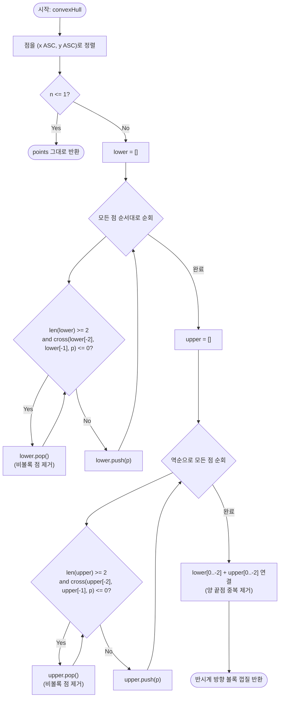

import { AlgorithmSimulation } from "#guide-sim";

# convexHull 해설 — Andrew's Monotone Chain

## 성능 목표 예측

| 제약 항목 | 값 |
|-----------|-----|
| 점 수 $n$ | $1 \leq n \leq 10^5$ |
| 좌표 범위 | $-10^9 \leq x, y \leq 10^9$ |

**naive 접근과 그 한계**

가장 직관적인 접근은 Gift Wrapping(Jarvis March)이다. 현재 점에서 "가장 오른쪽으로 꺾이는" 점을 하나씩 찾아 껍질을 확장한다. 각 단계에서 나머지 $n$개 점을 모두 비교하고, 껍질 꼭짓점 수 $h$번 반복하므로 $O(nh)$다. $h$가 $n$에 가까운 경우 $O(n^2)$이 되어 $n = 10^5$에서 $10^{10}$ 연산으로 제한을 초과한다.

또 다른 접근인 Graham Scan은 $O(n \log n)$이지만, 극좌표 정렬의 기준점 선택과 공선 처리가 까다롭다.

**목표 복잡도**: $O(n \log n)$ — 정렬이 지배하는 항. 껍질 구성 자체는 $O(n)$.

**공간 복잡도**: $O(n)$ — 하한선·상한선 스택 각각 최대 $n$개의 점을 보관한다.

**메모리 트레이드오프**: 출력 배열 크기가 $h \leq n$이므로 추가 메모리가 $O(n)$ 이하다.

---

## 목표 함수

```typescript
function convexHull(points: Point[]): Point[]
```

| 파라미터 | 타입 | 의미 | 제약 |
|----------|------|------|------|
| `points` | `Point[]` | 2차원 점 배열 | $1 \leq n \leq 10^5$, 좌표 $[-10^9, 10^9]$ |

**반환값**: 볼록 껍질의 꼭짓점을 반시계(CCW) 방향으로 정렬한 배열. 공선 중간 점은 제외된다.

**엣지케이스**:
1. **$n = 1$**: 점 1개짜리 배열을 그대로 반환.
2. **$n = 2$**: 두 점 반환 (선분이 껍질).
3. **모든 점 공선**: 외곽 두 점만 반환.
4. **중복 점 포함**: $\mathrm{cross} \leq 0$ 조건이 공선을 제거하므로 중복은 자동 처리된다.

---

## 핵심 아이디어

**핵심 아이디어**: "정렬된 점을 왼→오른쪽으로 쌓으면서 우회전하면 즉시 버린다 — 두 번의 단조 패스로 볼록 껍질이 완성된다."

점들을 $x$, $y$ 순으로 정렬하면 볼록 껍질을 아래쪽 체인(하한선)과 위쪽 체인(상한선)으로 나눌 수 있다. 각 체인은 정렬 순서대로 점을 스택에 쌓되, 연속 세 점의 외적이 0 이하(우회전 또는 공선)이면 중간 점을 버리면 된다. 각 점은 스택에 최대 한 번 들어가고 한 번 나오므로 체인 구성 자체는 $O(n)$이고, 정렬 $O(n \log n)$이 전체를 지배한다.

**풀이 구조**
1. 점을 $(x\ \text{오름차순},\ y\ \text{오름차순})$으로 정렬한다.
2. 왼→오른쪽 순으로 하한선 스택을 구성한다(우회전/공선 점 제거).
3. 오른→왼쪽 역순으로 상한선 스택을 구성한다(같은 규칙).
4. 양 끝점 중복을 제거하고 두 체인을 이어 반시계 방향 껍질을 반환한다.

**조건**: 점이 1개 이상이어야 한다. 공선 점을 껍질에서 제외하려면 `cross ≤ 0` 조건을 사용하고, 포함하려면 `cross < 0`만 사용한다.

**대표 예시**: 항구를 감싸는 울타리 최소화
$n$개의 창고 위치 중 외곽에 울타리를 칠 때 필요한 최소 꼭짓점 집합을 구하는 문제다. 정렬 후 두 번의 단조 패스만으로 $O(n \log n)$에 볼록 껍질 꼭짓점 목록이 완성되어, 울타리 길이나 면적 계산에 바로 활용할 수 있다.

**언제 쓰나**
"주어진 점들의 볼록 껍질을 구하라", 또는 회전 캘리퍼스·지름 계산처럼 볼록 껍질이 전처리로 필요한 문제에서 사용한다. 구현이 단순하고 정수 연산만으로 수치 오차가 없어 경쟁 프로그래밍에서 표준 도구로 쓰인다.

---

### 원형 아이디어와 naive 접근

가장 단순한 생각은 "볼록 껍질에 속하는 점은 다른 어떤 점들의 볼록 결합(convex combination)으로도 표현되지 않는 점"이라는 정의에서 출발한다. 이를 확인하려면 각 점에 대해 나머지 모든 점의 볼록 결합인지 체크하므로 $O(n^3)$ 또는 $O(n^2)$이 된다. 폭발 지점은 자명하다.

한 단계 개선한 Jarvis March도 껍질 꼭짓점마다 전체 탐색을 하므로 $O(nh)$다. $h = O(n)$인 경우 여전히 불충분하다.

### 어떤 관찰이 돌파구가 되는가

- **관찰 1**: 점들을 $x$좌표(동률 시 $y$좌표)로 정렬하면 볼록 껍질을 "하한선(lower hull)"과 "상한선(upper hull)" 두 단조 체인으로 분해할 수 있다. 각 체인은 정렬된 순서대로 왼쪽→오른쪽으로 단조 증가한다.
- **관찰 2**: 단조 체인을 구성할 때, 연속 세 점의 외적이 $\leq 0$이면 중간 점이 볼록 껍질의 경계에 있을 수 없다(우회전 또는 공선). 이 점을 제거하면 체인이 볼록 상태를 유지한다.
- **관찰 3**: 각 점은 스택에 최대 한 번 삽입되고 한 번 제거되므로, 체인 구성 전체가 $O(n)$이다. 정렬 $O(n \log n)$이 지배 항이 된다.

### 관찰을 형식화: 상태/구조 정의

**외적(Cross Product)**:

$$\mathrm{cross}(a, b, c) = (b_x - a_x)(c_y - a_y) - (b_y - a_y)(c_x - a_x)$$

- $> 0$: $a \to b \to c$가 반시계(좌회전). $c$는 직선 $ab$의 왼쪽.
- $= 0$: 세 점 공선.
- $< 0$: 시계(우회전). $c$는 직선 $ab$의 오른쪽.

**하한선(Lower Hull)**: 정렬된 점을 왼쪽→오른쪽 순서로 스택에 쌓으며, 스택의 마지막 두 점과 새 점의 외적이 $\leq 0$이면 스택 상단을 제거한다.

**상한선(Upper Hull)**: 정렬된 점을 오른쪽→왼쪽 역순으로 동일하게 처리한다.

이 형태여야 하는 근거: 정렬에 의해 $x$ 좌표가 단조 증가하므로, 하한선은 정렬 순서대로 처리할 때 자연스럽게 최하단 경계를 형성한다. 스택 불변식이 유지되는 한, 스택에 남아 있는 점들은 모두 볼록 경계 위에 있다.

### 점화식 또는 핵심 연산

**유도 과정**:

점 집합 $p_1, p_2, \ldots, p_n$ (x 좌표 정렬)에 대해 하한선을 구성한다. 점 $p_k$를 처리할 때:

$$\text{while } |\text{stack}| \geq 2 \;\land\; \mathrm{cross}(\text{stack}[-2], \text{stack}[-1], p_k) \leq 0: \text{stack.pop()}$$
$$\text{stack.push}(p_k)$$

**왜 $\leq 0$ 조건인가**:
- $< 0$ (우회전)이면 중간 점이 경계 밖에 있으므로 제거.
- $= 0$ (공선)이면 중간 점이 두 이웃 사이에 있어 껍질 꼭짓점이 될 필요가 없으므로 제거.

**상한선**: $p_n, p_{n-1}, \ldots, p_1$ 역순으로 동일한 과정.

**합치기**: `lower[0..(h_L-2)] + upper[0..(h_U-2)]`. 양 끝점($p_1$, $p_n$)이 두 체인에서 중복되므로 마지막 원소를 제거한 뒤 연결한다.

**각 항의 의미**:
- `cross ≤ 0` 조건: 비볼록 또는 공선인 중간 점을 제거하는 필터.
- 하한선 + 상한선: 반시계 방향 볼록 껍질을 두 단조 체인으로 표현.
- 양 끝점 중복 제거: 최솟값 점과 최댓값 점이 두 체인에서 공유되는 것을 해소.

### 정당성 — 왜 이것이 옳은가

**스택 불변식**: 하한선 스택의 임의의 연속 세 점 $a, b, c$에 대해 항상 $\mathrm{cross}(a, b, c) > 0$ (엄격한 반시계)이 성립한다. 이 불변식이 유지되는 한 스택의 모든 점은 볼록 체인 위에 있다.

**귀납 증명**: $k$개의 점을 처리한 후 스택이 불변식을 만족한다고 가정하자. $p_{k+1}$을 처리할 때, cross ≤ 0인 점을 모두 제거하면 스택 상위 두 점과 $p_{k+1}$의 외적이 양수가 된다. 따라서 $k+1$개를 처리한 후에도 불변식이 성립한다.

**까다로운 케이스**:
- **$n \leq 1$**: 스택이 2개 미만이면 while 루프가 실행되지 않으므로, 모든 점이 스택에 그대로 남는다. 별도 처리 불필요.
- **공선 처리**: $\mathrm{cross} = 0$ 조건을 포함하지 않으면(strict $< 0$만 체크), 공선 중간 점이 껍질에 포함된다. 문제에서 "공선 중간 점 제외"를 요구하므로 $\leq 0$이 맞다.
- **반시계 방향 보장**: 하한선이 왼쪽→오른쪽, 상한선이 오른쪽→왼쪽으로 연결되면 전체가 반시계 방향이 된다.

### 구현 디테일과 최적화

- **정렬 기준**: `(x ASC, y ASC)`. $x$가 같을 때 $y$ 오름차순으로 처리하면 공선 처리가 자연스럽다.
- **중복 제거 연결**: `lower.slice(0, -1).concat(upper.slice(0, -1))`으로 양 끝 중복을 제거.
- **정수 연산**: 외적은 정수 좌표에서 정확한 정수 결과를 준다. 부동소수 오차 없음.
- **함정**: 상한선을 구성할 때 역순으로 정렬된 배열을 사용하거나, 기존 정렬 배열을 역방향으로 순회하는 두 가지 방법이 있다. 어떤 방법을 써도 결과는 같지만, 인덱스 방향을 헷갈리지 않도록 주의해야 한다.
- **$h = 2$인 경우**: 모든 점이 공선이면 하한선과 상한선이 동일한 두 끝점만 가지게 된다. 중복 제거 후 배열이 올바른 크기(2)를 갖는지 확인해야 한다.

---

## 시뮬레이션

예시 점 집합 `points = [(0,0), (1,2), (2,0), (2,2), (0,2), (1,1)]`에 대해 Andrew's Monotone Chain을 실행하는 과정이다. 먼저 `(x, y)` 오름차순으로 정렬하면 `A(0,0), B(0,2), C(1,1), D(1,2), E(2,0), F(2,2)` 순이 된다. array 패널은 하한선 스택에 쌓인 점들을 보여주며, 연속 세 점의 외적이 0 이하이면 직전 점을 pop 한다(빨간 하이라이트가 검사/제거 대상).

실제 반환값은 반시계 볼록 껍질 `[(0,0), (2,0), (2,2), (0,2)]` 이며, 시뮬레이션 마지막 프레임의 껍질과 일치한다.

> 대화형 시뮬레이션은 MDX 런타임에서 표시됩니다.

export const steps = [
  {
    title: "정렬 완료",
    detail: "(x, y) 오름차순: A(0,0) B(0,2) C(1,1) D(1,2) E(2,0) F(2,2). 하한선 스택은 비어 있다.",
    array: [],
  },
  {
    title: "A 푸시",
    detail: "스택에 A(0,0)를 넣는다.",
    array: ["A(0,0)"],
    highlight: [0],
  },
  {
    title: "B 푸시",
    detail: "스택 크기 1 < 2 → 검사 없이 B(0,2)를 넣는다.",
    array: ["A(0,0)", "B(0,2)"],
    highlight: [1],
  },
  {
    title: "C 검사 → B pop",
    detail: "cross(A,B,C) = -2 <= 0 이므로 B를 제거한다. 이후 C(1,1)를 푸시.",
    array: ["A(0,0)", "C(1,1)"],
    highlight: [1],
  },
  {
    title: "D 푸시",
    detail: "cross(A,C,D) = 1 > 0 → 유지. D(1,2)를 푸시.",
    array: ["A(0,0)", "C(1,1)", "D(1,2)"],
    highlight: [2],
  },
  {
    title: "E 검사 → D, C 연속 pop",
    detail: "cross(C,D,E) = -1 <= 0 → D 제거. cross(A,C,E) = -2 <= 0 → C 제거. 이후 E(2,0) 푸시.",
    array: ["A(0,0)", "E(2,0)"],
    highlight: [1],
  },
  {
    title: "F 푸시 → 하한선 완성",
    detail: "cross(A,E,F) = 4 > 0 → 유지. F(2,2) 푸시. 하한선 = [A, E, F].",
    array: ["A(0,0)", "E(2,0)", "F(2,2)"],
    highlight: [2],
  },
  {
    title: "상한선 구성 (역순 F..A)",
    detail: "같은 규칙으로 상한선 = [F(2,2), B(0,2), A(0,0)]을 얻는다.",
    array: ["F(2,2)", "B(0,2)", "A(0,0)"],
  },
  {
    title: "완료: 껍질 = [(0,0),(2,0),(2,2),(0,2)]",
    detail: "lower[0..-2] + upper[0..-2] = [A, E] + [F, B] → 반시계 볼록 껍질.",
    array: ["(0,0)", "(2,0)", "(2,2)", "(0,2)"],
    marked: [0, 1, 2, 3],
  },
];

<AlgorithmSimulation view="array" steps={steps} title="Monotone Chain: 하한선 스택 구성" />

## 수도 코드와 Activity Diagram

### 의사코드

```
function cross(a, b, c):
  return (b.x - a.x) * (c.y - a.y) - (b.y - a.y) * (c.x - a.x)

function convexHull(points):
  sort points by (x ASC, y ASC)
  n = len(points)
  if n <= 1: return points

  // 하한선 구성 (왼쪽 → 오른쪽)
  // 불변식: lower의 임의 연속 세 점은 cross > 0 (엄격한 반시계)
  lower = []
  for p in points:
    while len(lower) >= 2 and cross(lower[-2], lower[-1], p) <= 0:
      lower.pop()  // 비볼록 또는 공선 점 제거
    lower.push(p)

  // 상한선 구성 (오른쪽 → 왼쪽)
  // 불변식: upper의 임의 연속 세 점은 cross > 0 (엄격한 반시계)
  upper = []
  for p in reversed(points):
    while len(upper) >= 2 and cross(upper[-2], upper[-1], p) <= 0:
      upper.pop()  // 비볼록 또는 공선 점 제거
    upper.push(p)

  // 양 끝점 중복 제거 후 연결
  // lower[-1] == upper[0] (최댓값 점), lower[0] == upper[-1] (최솟값 점)
  return lower[0..-2] + upper[0..-2]
```

### Activity Diagram



**핵심 불변식**: 스택의 임의 연속 세 점 $a, b, c$에 대해 $\mathrm{cross}(a, b, c) > 0$이 항상 성립한다. 이 불변식이 유지되는 한, 스택에 남은 모든 점은 볼록 경계 위에 있다.
