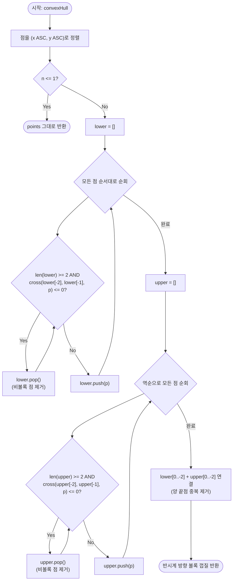

import { AlgorithmSimulation } from "#guide-sim";

# convexHull — 점을 좌표로 한 번만 정렬하면 두 번의 단조 스캔으로 껍질이 완성되는 이유

## 한눈에 보는 컨셉

2D 평면 위 점들을 모두 감싸는 **최소 볼록 다각형**의 꼭짓점을 구하는 문제예요. 점을 `x`좌표(동률이면 `y`좌표) 기준으로 딱 한 번 정렬해 두면, 왼쪽에서 오른쪽으로 훑는 패스와 오른쪽에서 왼쪽으로 훑는 패스 — 이렇게 **단조(monotone) 스캔 두 번**만으로 볼록 껍질이 완성됩니다. 각 스캔은 "방금 넣은 점이 오목하게 꺾이면 즉시 버린다"는 규칙만 반복하므로 껍질을 쌓는 과정 자체는 `O(n)`이고, 정렬 비용 `O(n log n)`이 전체를 지배해요.

## 출발점: 가장 순진한 방법부터

문제를 먼저 정확히 잡을게요.

```ts
type Point = [number, number];

function convexHull(points: Point[]): Point[]
```

| 항목 | 내용 |
|------|------|
| `points` | 2D 점 배열, `[x, y]` 형태 |
| 반환 | 볼록 껍질 꼭짓점을 **반시계(CCW)** 방향으로 정렬한 배열. 변 위의 공선 중간 점은 제외 |
| 점 수 $n$ | $1 \leq n \leq 10^5$ |
| 좌표 범위 | $-10^9 \leq x, y \leq 10^9$ |
| 참고 | 입력에 중복 좌표가 섞여 있을 수 있다 |

여기서 좌표 범위를 눈여겨봐 둘게요. 두 좌표의 차는 최대 $2 \times 10^9$까지 벌어질 수 있고, 아래에서 쓸 `cross`의 곱셈 항은 최대 $4 \times 10^{18}$까지 커질 수 있어요. JS `number`가 오차 없이 표현하는 안전한 정수 범위는 $2^{53}-1 \approx 9 \times 10^{15}$이니, 이 범위를 넘는 극단적 입력에서는 `number` 계산이 정밀도를 잃습니다. 이 가이드의 코드는 설명을 단순하게 유지하려고 `number`로 `cross`/`dist2`를 계산하지만, 실제로 좌표가 이 정도로 크게 들어오는 입력을 안전하게 처리하려면 `cross`/`dist2`를 `BigInt`로 계산하거나 좌표를 미리 스케일 다운해야 합니다.

볼록 껍질의 정의를 그대로 따라가 볼까요? "껍질 꼭짓점이란, 다각형을 시계 반대 방향으로 감쌀 때 계속 왼쪽으로만 꺾이는 점들"이라는 정의에서 출발하면, 가장 자연스러운 구현은 **선물 포장하듯 감싸기(Gift Wrapping)** — 일명 **Jarvis March**예요. 현재 꼭짓점에서 "다른 모든 점이 왼쪽(또는 선분 위)에 있도록 만드는" 다음 점을 하나씩 찾아 나가는 방식입니다.

```ts
function cross(p: Point, q: Point, r: Point): number {
  return (q[0] - p[0]) * (r[1] - p[1]) - (q[1] - p[1]) * (r[0] - p[0]);
}

function dist2(a: Point, b: Point): number {
  const dx = a[0] - b[0];
  const dy = a[1] - b[1];
  return dx * dx + dy * dy;
}

function convexHullJarvis(rawPoints: Point[]): Point[] {
  // 중복 좌표를 하나로 합쳐 둔다 (같은 점을 두 번 방문해 무한 루프에 빠지는 것을 방지)
  const seen = new Set<string>();
  const points: Point[] = [];
  for (const p of rawPoints) {
    const key = `${p[0]},${p[1]}`;
    if (!seen.has(key)) { seen.add(key); points.push(p); }
  }
  const n = points.length;
  if (n < 3) return points.slice();

  let start = 0; // 가장 왼쪽(동률이면 가장 아래) 점에서 출발
  for (let i = 1; i < n; i++) {
    const cand = points[i]!, best = points[start]!;
    if (cand[0] < best[0] || (cand[0] === best[0] && cand[1] < best[1])) start = i;
  }

  const hull: Point[] = [];
  let current = start;
  do {
    hull.push(points[current]!);
    let next = (current + 1) % n;
    for (let i = 0; i < n; i++) {
      if (i === current) continue;
      const c = cross(points[current]!, points[next]!, points[i]!);
      // i가 current→next 선분의 오른쪽에 있으면 next를 i로 교체
      if (c < 0 || (c === 0 && dist2(points[current]!, points[i]!) > dist2(points[current]!, points[next]!))) {
        next = i;
      }
    }
    current = next;
  } while (current !== start);

  return hull;
}
```

각 단계에서 나머지 점 전부를 훑어 "가장 바깥쪽으로 도는" 후보를 찾고, 이 과정을 껍질 꼭짓점 수 $h$번 반복합니다. 그러니 비용은 $O(nh)$예요.

```text
n = 2,000개 점이 원 둘레 근처에 흩어져 있어 h = 256 (실측)

Jarvis March :  n × h  =  2,000 × 256  ≈  512,000  →  실측 약 2.7~4ms
Monotone Chain: n log n ≈ 2,000 × 11   ≈    22,000  →  실측 약 0.4~0.7ms  (뒤에서 다룰 최종 해법)

h가 커질수록 격차가 벌어진다 — 원 모양처럼 "거의 모든 점이 껍질 위"인 입력이 최악
(정확한 ms 값은 실행 환경마다 다르지만, 6회 반복 측정에서 Jarvis March가
 일관되게 6~7배가량 느렸다 — 두 코드를 직접 실행해 확인해 볼 수 있다)
```

여기서 "점이 원 둘레 근처에 있으면 거의 다 껍질 위에 있어야 하는 거 아닌가?" 싶을 수 있어요. 맞는 직관이지만, 이 벤치마크는 좌표를 정수로 반올림해서 만든 원이라 곡률이 완만한 구간에서는 이웃한 샘플들이 반올림 후 거의 일직선이 되어 pop됩니다 — 실제로 각도순 이웃 삼각형 2,000개 중 1,360개가 `cross <= 0`(공선 또는 오목)으로 나옵니다(실측 확인). 그래서 각도상으로는 둘레에 고르게 퍼져 있어도 실제 껍질 꼭짓점은 그보다 훨씬 적은 $h=256$으로 줄어들어요.

이제 제약의 상한을 대입해 봅시다. $n = 10^5$이고 최악의 경우 $h$도 $n$에 가깝다면 $nh \approx 10^{10}$ 연산이에요. 1초 제한에서 감당할 수 있는 연산량(대략 $10^8 \sim 10^9$)을 훌쩍 넘습니다.

여기서 낌새가 하나 보입니다. **"매번 나머지 점을 전부 다시 훑는 게 낭비 아닐까? 점들을 미리 한 번 정리해 두면 어떨까?"** 이 단서를 어떻게 살릴지가 다음 절의 주제예요.

## 아이디어 자세히 들여다보기

방금 든 낌새를 살려 봅시다. "점을 미리 정리해 둔다"의 가장 직접적인 형태는 **현재 점을 기준으로 나머지 점들을 각도(극각) 순으로 정렬**해 두는 겁니다. 이렇게 하면 한 번의 정렬 뒤에는 다시 훑지 않고 스택 하나로 껍질을 쌓을 수 있어요 — 이것이 **Graham Scan**입니다.

```ts
function convexHullGraham(points: Point[]): Point[] {
  const n = points.length;
  if (n < 3) return points.slice();

  let pivotIdx = 0; // y가 가장 작은(동률이면 x가 가장 작은) 점을 기준점으로
  for (let i = 1; i < n; i++) {
    const cand = points[i]!, best = points[pivotIdx]!;
    if (cand[1] < best[1] || (cand[1] === best[1] && cand[0] < best[0])) pivotIdx = i;
  }
  const pivot = points[pivotIdx]!;

  const rest = points.filter((_, i) => i !== pivotIdx);
  rest.sort((a, b) => {
    const c = cross(pivot, a, b);
    if (c !== 0) return -c;                    // 기준점에서 본 각도 오름차순
    return dist2(pivot, a) - dist2(pivot, b);   // 각도가 같으면 가까운 점 먼저
  });

  const stack: Point[] = [pivot];
  for (const p of rest) {
    while (stack.length >= 2 && cross(stack[stack.length - 2]!, stack[stack.length - 1]!, p) <= 0) {
      stack.pop();
    }
    stack.push(p);
  }
  return stack;
}
```

점근 복잡도는 정렬 `O(n log n)` + 스캔 `O(n)`으로 Jarvis March보다 확실히 개선됐어요. 그런데 이 방법, 실제로 짜 보면 손이 많이 갑니다.

- **기준점(pivot)을 따로 골라야** 합니다 — 그리고 그 기준점은 정렬 대상에서 빼야 해요.
- 극각이 **같은 점(기준점과 일직선)** 들끼리는 "가까운 점 먼저"로 순서를 또 정해야, 스택 규칙이 중간 점을 올바르게 걸러냅니다.
- 기준점이 잘못 골라지면(예: 최소 `y`가 여러 개인데 `x` 동률 처리를 빠뜨리면) 각도 기준 자체가 흔들립니다.

즉 Graham Scan은 "정렬 후 스캔"이라는 방향은 옳지만, **기준점 선택 + 극각 동률 처리**라는 부가 조건이 늘 따라붙는 구조예요. **여기서 헷갈리기 쉬운 포인트는, 극각 정렬이 "각도"라는 개념에 의존한다는 점입니다** — 각도는 결국 `atan2` 같은 삼각함수나 기준점 기준 상대 위치로 정의해야 하고, 기준점이 껍질 안쪽 점이 아니라 반드시 껍질 위의 점이어야 한다는 전제까지 깔고 갑니다. 기준점 선택 자체가 통째로 필요 없다면 어떨까요? 다음 절에서 바로 그 지점을 파고듭니다.

### 정렬 기준을 각도 대신 좌표로 — 수식과 그림

**돌파구는 기준점을 아예 없애는 것**입니다. 극각 대신 **좌표 자체**로 정렬하면 어떨까요? 점을 $(x\ \text{오름차순},\ y\ \text{오름차순})$으로 한 번 정렬하면, 볼록 껍질은 **하한선(lower hull)** 과 **상한선(upper hull)**, 두 개의 단조 체인으로 저절로 나뉩니다. 각 체인은 정렬된 순서를 따라가며 왼쪽에서 오른쪽으로(또는 그 반대로) $x$가 단조 증가하는 경계선이에요. 이 방법을 **Andrew's Monotone Chain**이라고 부릅니다.

핵심 연산은 세 점의 방향을 판별하는 **외적(cross product)** 하나입니다.

$$\mathrm{cross}(p, q, r) = (q_x - p_x)(r_y - p_y) - (q_y - p_y)(r_x - p_x)$$

- $\mathrm{cross} > 0$: $p \to q \to r$이 반시계(좌회전). $r$은 직선 $pq$의 왼쪽.
- $\mathrm{cross} = 0$: 세 점이 공선.
- $\mathrm{cross} < 0$: 시계(우회전). $r$은 직선 $pq$의 오른쪽.

```text
p=(0,0), q=(2,0), r=(1,1)  → cross = (2-0)(1-0) - (0-0)(1-0) = 2   >0 → 좌회전(반시계)
p=(0,0), q=(2,0), r=(1,-1) → cross = (2-0)(-1-0) - (0-0)(1-0) = -2  <0 → 우회전(시계)
p=(0,0), q=(2,0), r=(1,0)  → cross = (2-0)(0-0) - (0-0)(1-0) = 0    → 공선
```

**하한선 구성 규칙**: 정렬된 점을 왼쪽 → 오른쪽 순서로 스택에 쌓되, 스택의 마지막 두 점 `a, b`와 새 점 `c`에 대해 $\mathrm{cross}(a,b,c) \leq 0$이면(우회전 또는 공선) `b`를 스택에서 뺍니다. **상한선**은 정렬된 배열을 오른쪽 → 왼쪽 역순으로 훑으며 동일한 규칙을 적용합니다.

실제 점 `A(0,0), B(0,2), C(1,1), D(1,2), E(2,0), F(2,2)`(이미 `x,y` 오름차순으로 정렬된 상태)로 하한선을 손으로 채워 봅시다.

```text
스택: []
A 푸시           → [A]
B 푸시(크기<2)    → [A, B]
cross(A,B,C) = -2 <= 0 → B pop, C 푸시 → [A, C]
cross(A,C,D) =  1  > 0 → 유지, D 푸시   → [A, C, D]
cross(C,D,E) = -1 <= 0 → D pop
cross(A,C,E) = -2 <= 0 → C pop, E 푸시  → [A, E]
cross(A,E,F) =  4  > 0 → 유지, F 푸시   → [A, E, F]   ← 하한선 완성
```

잠깐, 확인 하나만 해 볼까요? `cross(A, B, C)`를 직접 계산하면 $A=(0,0), B=(0,2), C=(1,1)$이니 $(0-0)(1-0) - (2-0)(1-0) = 0 - 2 = -2$가 나옵니다. 표에 적힌 값과 정확히 같죠?

`E(2,0)`를 검사하는 순간만 떼어서 Before/After로 보면, 연속 pop이 스택을 어떻게 줄이는지 더 선명합니다.

```text
Before: 스택 = [A, C, D],  새 점 E 검사
        cross(C,D,E) = -1 <= 0 → D pop
        cross(A,C,E) = -2 <= 0 → C pop  (다시 크기 2 이상이라 재검사)
        cross 조건을 더 어길 점이 없으면 멈추고 E push
After:  스택 = [A, E]
```

**왜 하필 이 형태여야 할까요?** 극각 정렬(Graham Scan)은 "기준점에서 본 각도"라는 상대적 개념을 정의해야 하고, 그 정의 안에 이미 기준점 선택이라는 또 다른 결정이 숨어 있습니다. 반면 $(x, y)$ 좌표 정렬은 두 실수를 비교하는 것뿐이라 기준점도, 각도 정의도 필요 없어요. 그 대가로 체인을 하한선·상한선 **둘로 나눠 두 번** 훑어야 하지만, 각 스캔의 규칙은 완전히 동일합니다.

### 단서를 설명해 주는 이론 — 정렬 하한과 결정 트리 모델

Jarvis March의 $O(nh)$에서 Monotone Chain의 $O(n \log n)$까지 왔는데, 여기서 자연스러운 질문이 남습니다. **더 빠르게, 이를테면 $O(n)$까지 줄일 수는 없을까요?**

답은 "비교 기반 알고리즘으로는 불가능하다"이고, 여기엔 이미 이론화된 근거가 있습니다. **정렬(sorting)은 비교 기반 모델에서 $\Omega(n \log n)$번의 비교가 필요하다**는 사실은 잘 알려져 있죠. 그런데 볼록 껍질 계산은 **정렬 문제를 특수한 경우로 포함**합니다.

숫자 $a_1, \ldots, a_n$을 정렬하고 싶다고 해 봅시다. 각 숫자를 포물선 $y = x^2$ 위의 점 $p_i = (a_i, a_i^2)$로 옮기면 어떻게 될까요? 포물선은 **엄격하게 볼록(strictly convex)** 한 곡선이라, 이 곡선 위의 점은 **전부** 다른 점들의 볼록 결합으로 표현되지 않습니다 — 즉 모든 점이 껍질 꼭짓점이 되고, 껍질 경계를 $x$ 오름차순으로 읽으면 그대로 **원래 숫자의 정렬 순서**가 나옵니다.

```text
숫자 목록: [3, 1, 4, 5, 9, 2, 6]
파라볼라 매핑: (3,9) (1,1) (4,16) (5,25) (9,81) (2,4) (6,36)

convexHull(파라볼라 점들) = [(1,1),(2,4),(3,9),(4,16),(5,25),(6,36),(9,81)]  ← 실측
hull 순서의 x값:            [1, 2, 3, 4, 5, 6, 9]
실제 오름차순 정렬:          [1, 2, 3, 4, 5, 6, 9]                            ← 일치
```

즉 "볼록 껍질을 구하는 알고리즘"이 있으면 그걸로 정렬도 할 수 있다는 뜻이에요. 정렬이 (비교 기반 모델에서) $\Omega(n \log n)$ 아래로 내려갈 수 없으므로, 볼록 껍질도 (점 개수 $n$에 대해, 같은 비교 기반 모델에서) $\Omega(n \log n)$ 아래로 내려갈 수 없습니다. **Monotone Chain의 $O(n \log n)$은 이 하한과 정확히 맞닿아 있다**는 뜻이죠 — 나중에 "더 최적화할 여지가 있는가"를 판단할 때 이 논증을 다시 불러오겠습니다. 기억해 두세요.

### 셈을 맡는 자료구조 — 모노토닉 스택

하한선·상한선을 쌓는 규칙 — "새 점을 넣기 전에, 조건을 어기는 마지막 원소를 계속 pop한다" — 은 **모노토닉 스택(monotonic stack)** 패턴 그 자체입니다. 이 알고리즘에서는 "스택에 남은 연속 세 점이 항상 좌회전(반시계)"이라는 조건을 유지하도록 pop을 반복하는 역할로 쓰여요. 모노토닉 스택 자체의 동작 원리와 다른 활용 예는 이 프로젝트의 [monotonicStack 가이드](../../../data-structures/linear/monotonicStack/monotonicStack-guide.mdx)를 참고하세요 — 여기서는 "조건을 어기면 즉시 꺼내는 스택"으로만 쓰면 충분합니다.

잠깐, "`while`이 한 점을 처리하면서 여러 번 pop할 수도 있는데, 왜 전체는 여전히 `O(n)`일까요?"라는 의문이 남아요. 답은 점 하나하나의 "예산"을 따라가면 보입니다 — 각 점은 하한선(또는 상한선) 스캔에서 **최대 한 번만 push**되고, pop되는 대상도 **이미 push된 적 있는 점뿐**이라 총 pop 횟수는 총 push 횟수($=n$)를 넘을 수 없습니다. 어떤 한 점을 처리할 때 `while`이 여러 번 도는 것처럼 보여도, 그건 이전 점들이 아직 쓰지 않은 pop 예산을 이번에 몰아 쓰는 것뿐이라 전체 합산은 그대로 $O(n)$이에요(상각 분석, amortized analysis).

### 왜 모순 없이 작동하는가

이 알고리즘이 끝까지 지키는 불변식은 하나입니다.

> 하한선(또는 상한선) 스택의 임의의 연속 세 점 $a, b, c$에 대해 항상 $\mathrm{cross}(a, b, c) > 0$(엄격한 좌회전)이 성립한다.

**기저(base case)**: 스택에 점이 0개 또는 1개일 때는 "연속 세 점"이 존재하지 않으므로 불변식이 공허하게 참입니다.

**귀납 단계**: $k$개의 점을 처리한 뒤 스택이 불변식을 만족한다고 가정합시다. $(k+1)$번째 점 $p$를 처리할 때 벌어질 수 있는 경우는 딱 두 가지입니다.

1. **스택 상위 두 점과 $p$가 좌회전** ($\mathrm{cross} > 0$): while 조건이 거짓이므로 그대로 $p$를 push합니다. 새로 생긴 연속 세 점(상위 두 점과 $p$)이 좌회전이므로 불변식 유지, 그 아래쪽은 손대지 않았으니 그대로 유지됩니다.
2. **우회전 또는 공선** ($\mathrm{cross} \leq 0$): 상위 점을 pop합니다. pop 후 스택 크기가 다시 2 이상이면 같은 검사를 반복하고, 2 미만이 되거나 좌회전을 만나면 멈추고 $p$를 push합니다. pop이 끝난 시점에는 남은 상위 두 점과 $p$가 좌회전 관계이므로(반복 조건이 거짓이 되어 멈췄으므로) 다시 불변식을 만족합니다.

이 두 경우가 $\mathrm{cross}$의 부호(양수·음수·0)가 가질 수 있는 경우를 전부 나열한 것이고(제3의 경우는 없음), 각 경우에서 불변식이 정확히 유지되므로 $k+1$개를 처리한 후에도 불변식이 성립합니다. 이 불변식이 마지막까지 유지된다는 것은, 스택에 남은 모든 점이 실제로 볼록 경계 위에 있다는 뜻이에요.

그런데 "연속 세 점이 항상 좌회전"이라는 **지역적** 성질만으로 "스택이 지금까지 처리한 점들의 하한선 전체와 정확히 같다"는 **전역적** 결론까지 보장될까요? 됩니다 — 두 가지만 더 확인하면 돼요. 첫째, 점을 정렬 순서대로 처리하므로 새로 들어오는 점은 항상 $x$가 가장 크고, pop 판정은 오직 "스택 맨 위 두 점과 새 점"만 보므로 그 판정은 아직 등장하지 않은 미래의 점과 무관하게 그 순간 확정됩니다. 둘째, 한 번 pop된 점 $b$는 다시 스택으로 돌아오지 않습니다 — pop된다는 것은 $b$가 그 양옆 점을 잇는 선분보다 오목한 쪽(또는 그 위)에 있어 하한선 후보에서 완전히 탈락했다는 뜻인데, 이후 등장하는 점은 전부 $x$가 더 큰 쪽에 있을 뿐이라 $b$를 다시 경계로 되돌릴 새 정보가 생기지 않습니다. 이 둘을 합치면 "연속 세 점 좌회전"이라는 지역 불변식은 "스택 = 지금까지 본 점들의 하한선"이라는 전역 성질과 정확히 같은 뜻이 됩니다.

**여기서 헷갈리기 쉬운 포인트는 "왜 $\leq 0$이지 $< 0$이 아닌가"입니다.** 문제는 "공선 중간 점을 껍질에서 제외"하라고 요구합니다. 만약 조건을 $< 0$(엄격한 우회전만 pop)으로 바꾸면, $\mathrm{cross} = 0$인 공선 점은 pop되지 않고 살아남아 버립니다.

```text
입력: [(0,0), (2,0), (4,0), (4,4), (0,4)]   ← (2,0)은 (0,0)-(4,0) 선분의 중간 점

<= 0 (올바름): convexHull 결과 = [(0,0), (4,0), (4,4), (0,4)]           ← (2,0) 제외
<  0 (함정):   결과 = [(0,0), (2,0), (4,0), (4,4), (0,4)]                ← (2,0)이 살아남음 ✗ (실측 확인됨)
```

**두 번째 헷갈리기 쉬운 포인트는 상한선 방향입니다.** 상한선은 정렬 배열을 **역순으로** 훑어야 합니다. 만약 정렬 순서 그대로 훑으면 하한선과 똑같은 체인이 나와 상한선의 의미가 없어지고, 두 체인을 이었을 때 다각형이 아니라 같은 선을 왕복하는 모양이 됩니다.

> 하한선은 왼쪽→오른쪽, 상한선은 오른쪽→왼쪽 — 같은 규칙을 방향만 뒤집어 두 번 돌린다.

엣지 케이스도 짚어 둘게요.

```text
n = 1                → 정렬·스캔 없이 그 점 하나만 반환
n = 2                → 두 점 모두 반환 (하한선 push 두 번, while 조건 size>=2가 거짓이라 pop 없음)
모든 점이 한 직선 위   → 중간 점은 전부 cross=0으로 pop, 양 끝 2점만 남는다
중복 좌표(다른 점들과 섞여 있음)      → cross<=0 pop 규칙에 걸려 중복은 자동으로 걸러진다 (실측 확인)
입력 전체가 완전히 같은 좌표(n>=2)    → 하한선·상한선에 각각 2개씩 남은 뒤 끝점 pop을 1번씩만 하므로
                      결과에 같은 점이 2개 남는다 — "무조건 1개로 줄어든다"는 이 경우엔 성립하지 않는다 (실측 확인)
```

## 아이디어를 코드로 옮기기

앞 절의 규칙을 그대로 옮기면 이렇습니다.

```ts
function convexHull(points: Point[]): Point[] {
  const n = points.length;
  if (n <= 1) return points.slice();

  const sorted = points.slice().sort((a, b) => a[0] - b[0] || a[1] - b[1]);

  const lower: Point[] = [];
  for (const p of sorted) {
    while (lower.length >= 2 && cross(lower[lower.length - 2]!, lower[lower.length - 1]!, p) <= 0) {
      lower.pop();
    }
    lower.push(p);
  }

  const upper: Point[] = [];
  for (let i = sorted.length - 1; i >= 0; i--) {
    const p = sorted[i]!;
    while (upper.length >= 2 && cross(upper[upper.length - 2]!, upper[upper.length - 1]!, p) <= 0) {
      upper.pop();
    }
    upper.push(p);
  }

  lower.pop(); // 최댓값 점(상한선의 시작점과 중복)
  upper.pop(); // 최솟값 점(하한선의 시작점과 중복)
  return lower.concat(upper);
}
```

**가장 실수가 잦은 줄은 `while (... cross(...) <= 0)`의 비교 연산자입니다.** `<=`를 `<`로 바꾸면 앞서 실측으로 확인한 것처럼 공선 중간 점이 조용히 살아남습니다. 그 외 결정 지점은 다음과 같아요.

- **정렬 기준 `a[0] - b[0] || a[1] - b[1]`**: `x`가 같을 때 `y`로 동률을 깨야, 하한선·상한선이 같은 시작점·끝점을 정확히 공유합니다.
- **상한선 루프는 `i`를 `sorted.length - 1`부터 역순으로**: 방향을 헷갈려 정순으로 돌면 상한선이 하한선의 복사본이 되어 버립니다.
- **`lower.pop()` / `upper.pop()`**: 정렬 배열의 최솟값 점과 최댓값 점이 하한선·상한선 양쪽에 모두 등장하므로, 이어 붙이기 전에 각 체인의 마지막 원소(중복되는 반대쪽 끝점)를 한 번씩 제거해야 합니다.

여기서 이 알고리즘의 "더 빠르게 만들 여지"를 검토해 볼 차례인데, 답은 이미 몇 절 전에 준비해 뒀습니다. **정렬 하한 절에서 본 파라볼라 반례**가 바로 그 근거예요 — 볼록 껍질 계산은 정렬 문제로 환원되므로 (비교 기반 모델에서) $\Omega(n \log n)$ 아래로는 내려갈 수 없고, Monotone Chain의 $O(n \log n)$은 이 하한과 정확히 일치합니다. 그러니 이 알고리즘 자체를 더 다듬어 점근 복잡도를 낮출 자연스러운 사다리는 없습니다.

다만 공정하게 말하면, **출력 크기 $h$(껍질 꼭짓점 수)에 민감한 특화 해법**은 존재합니다. Kirkpatrick–Seidel 알고리즘이나 Chan's 알고리즘은 $O(n \log h)$에 동작해서, $h \ll n$인 입력(예: 점 대부분이 내부에 몰려 있고 껍질은 몇 개뿐인 경우)에서는 이론상 더 빠릅니다. 그럼에도 Monotone Chain을 표준으로 쓰는 이유는 **구현이 단순하고, 좌표 비교만으로 동작해 (좌표가 안전한 정수 범위 안에 있는 한) 부동소수점 오차 없이 정확하며, $h$의 크기와 무관하게 항상 같은 두 번의 선형 스캔으로 끝난다는 예측 가능성** 때문입니다. 다만 앞서 짚었듯 이 문제의 좌표 범위($\pm 10^9$)를 정면으로 받아들이려면 `cross`/`dist2` 계산을 `BigInt`로 바꿔야 이 정확성 주장이 그대로 성립합니다. 경쟁 프로그래밍이나 실무에서 "일단 이것부터" 꺼내 쓰는 도구인 이유가 여기 있어요.

## 실행 시각화

예시 점 집합 `points = [(0,0), (1,2), (2,0), (2,2), (0,2), (1,1)]`에 대해 Monotone Chain을 실행하는 과정입니다. 먼저 `(x, y)` 오름차순으로 정렬하면 `A(0,0), B(0,2), C(1,1), D(1,2), E(2,0), F(2,2)` 순이 됩니다(위 절의 손 계산과 같은 입력·같은 결과예요). array 패널은 하한선 스택에 쌓인 점들을 보여주며, 연속 세 점의 외적이 0 이하이면 직전 점을 pop 합니다(빨간 하이라이트가 검사/제거 대상).

실제 반환값은 반시계 볼록 껍질 `[(0,0), (2,0), (2,2), (0,2)]`이며(실측 확인), 시뮬레이션 마지막 프레임의 껍질과 일치합니다.

> 대화형 시뮬레이션은 MDX 런타임에서 표시됩니다.

export const steps = [
  {
    title: "정렬 완료",
    detail: "(x, y) 오름차순: A(0,0) B(0,2) C(1,1) D(1,2) E(2,0) F(2,2). 하한선 스택은 비어 있다.",
    array: [],
  },
  {
    title: "A 푸시",
    detail: "스택에 A(0,0)를 넣는다.",
    array: ["A(0,0)"],
    highlight: [0],
  },
  {
    title: "B 푸시",
    detail: "스택 크기 1 < 2 → 검사 없이 B(0,2)를 넣는다.",
    array: ["A(0,0)", "B(0,2)"],
    highlight: [1],
  },
  {
    title: "C 검사 → B pop",
    detail: "cross(A,B,C) = -2 <= 0 이므로 B를 제거한다. 이후 C(1,1)를 푸시.",
    array: ["A(0,0)", "C(1,1)"],
    highlight: [1],
  },
  {
    title: "D 푸시",
    detail: "cross(A,C,D) = 1 > 0 → 유지. D(1,2)를 푸시.",
    array: ["A(0,0)", "C(1,1)", "D(1,2)"],
    highlight: [2],
  },
  {
    title: "E 검사 → D, C 연속 pop",
    detail: "cross(C,D,E) = -1 <= 0 → D 제거. cross(A,C,E) = -2 <= 0 → C 제거. 이후 E(2,0) 푸시.",
    array: ["A(0,0)", "E(2,0)"],
    highlight: [1],
  },
  {
    title: "F 푸시 → 하한선 완성",
    detail: "cross(A,E,F) = 4 > 0 → 유지. F(2,2) 푸시. 하한선 = [A, E, F].",
    array: ["A(0,0)", "E(2,0)", "F(2,2)"],
    highlight: [2],
  },
  {
    title: "상한선 구성 (역순 F..A)",
    detail: "같은 규칙으로 상한선 = [F(2,2), B(0,2), A(0,0)]을 얻는다.",
    array: ["F(2,2)", "B(0,2)", "A(0,0)"],
  },
  {
    title: "완료: 껍질 = [(0,0),(2,0),(2,2),(0,2)]",
    detail: "lower[0..-2] + upper[0..-2] = [A, E] + [F, B] → 반시계 볼록 껍질.",
    array: ["(0,0)", "(2,0)", "(2,2)", "(0,2)"],
    marked: [0, 1, 2, 3],
  },
];

<AlgorithmSimulation view="array" steps={steps} title="Monotone Chain: 하한선 스택 구성" />

## 흐름 한눈에 보기


```mermaid
flowchart TD
    A([시작: convexHull]) --> B["점을 (x ASC, y ASC)로 정렬"]
    B --> C{"n <= 1?"}
    C -->|Yes| R([points 그대로 반환])
    C -->|No| D["lower = []"]
    D --> E{"모든 점 순서대로 순회"}
    E --> F{"len(lower) >= 2 AND<br/>cross(lower[-2], lower[-1], p) <= 0?"}
    F -->|Yes| G["lower.pop()<br/>(비볼록 점 제거)"]
    G --> F
    F -->|No| H["lower.push(p)"]
    H --> E
    E -->|완료| I["upper = []"]
    I --> J{"역순으로 모든 점 순회"}
    J --> K{"len(upper) >= 2 AND<br/>cross(upper[-2], upper[-1], p) <= 0?"}
    K -->|Yes| L["upper.pop()<br/>(비볼록 점 제거)"]
    L --> K
    K -->|No| M["upper.push(p)"]
    M --> J
    J -->|완료| N["lower[0..-2] + upper[0..-2] 연결<br/>(양 끝점 중복 제거)"]
    N --> O([반시계 방향 볼록 껍질 반환])
```

## 스스로 점검하기

1. 점 집합 `[(0,0), (4,0), (2,3), (2,1)]`에 대해 정렬 순서와 하한선·상한선 스택의 변화를 직접 손으로 채워 최종 껍질을 구해 보세요. (힌트: `(2,1)`은 삼각형 내부라 어느 체인에서도 살아남지 못합니다. 정답은 `[(0,0), (4,0), (2,3)]`입니다.)
2. 본문의 while 조건을 `cross(...) < 0`으로 바꾸면 `[(0,0), (2,0), (4,0), (4,4), (0,4)]`에서 정확히 어느 시점에 `(2,0)`이 살아남는지, 그리고 최종 반환 배열이 어떻게 달라지는지 추적해 보세요.
3. 만약 점들이 3차원 좌표(x, y, z)이고 z는 모두 같은 평면 위에 있다는 보장이 없다면, 지금의 정렬+2패스 스캔 아이디어를 그대로 재사용할 수 있을까요? (힌트: 2D의 "왼쪽/오른쪽" 판별은 3D에서 "평면의 어느 쪽"이라는 개념으로 확장해야 하고, 하한선·상한선이라는 두 체인 분해 자체가 더 이상 성립하지 않습니다 — 3D 볼록 껍질은 별도의 알고리즘이 필요해요.)
