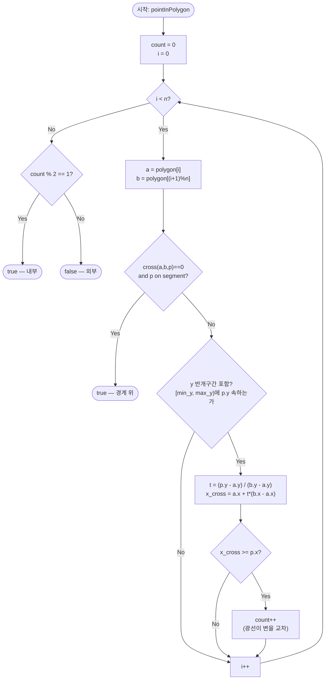

import { AlgorithmSimulation } from "#guide-sim";

# pointInPolygon — 광선을 쏘아 교차 횟수의 홀짝으로 안팎을 가르는 이유

## 한눈에 보는 컨셉

점에서 오른쪽(+x 방향)으로 무한히 긴 광선을 하나 쏘고, 그 광선이 다각형의 변과 몇 번 교차하는지 셉니다. 교차 횟수가 홀수면 점은 내부, 짝수면 외부예요 — 다각형을 볼록·오목으로 나눌 필요도, 미리 잘게 쪼갤 필요도 없습니다. 변 하나하나를 딱 한 번씩만 검사하면 되므로 `O(n)` 시간, 추가 메모리는 카운터 하나뿐이라 `O(1)` 공간으로 끝납니다.

## 출발점: 가장 순진한 방법부터

문제를 먼저 정확히 잡을게요.

```ts
type Point = [number, number];

function pointInPolygon(p: Point, polygon: Point[]): boolean
```

| 항목 | 의미 | 제약 |
|------|------|------|
| `p` | 판정할 점 `[x, y]` | $-10^9 \leq x, y \leq 10^9$ |
| `polygon` | 단순 다각형의 정점 배열. 경계를 따라 순서대로(시계 또는 반시계 방향, 어느 쪽이든 무방) 나열하며 첫 정점을 배열 끝에 다시 넣지 않음 — 마지막과 첫 정점은 자동으로 이어짐 | $3 \leq n \leq 10^5$, 자기교차 없음, 볼록·오목 모두 가능 |
| 반환값 | 점이 내부 또는 경계 위면 `true`, 외부면 `false` | — |

**엣지케이스**: 점이 변 위에 정확히 있으면 `true`, 정점과 좌표가 같아도 `true`, 오목한 부분의 빈 공간은 `false`, 정점이 시계·반시계 어느 순서로 주어져도 결과는 같아야 합니다.

점이 도형 안에 있는지를 확인해야 한다면 제일 먼저 떠오르는 생각은 이거예요. **"다각형을 삼각형 여러 개로 쪼갠 다음, 점이 그중 어느 삼각형 안에 들어가는지 보면 되지 않을까?"** 삼각형 내부 판정은 이미 잘 알려진 계산이니(같은 변 쪽에 있는지를 부호로 확인) 여기에 기대는 건 자연스러운 출발입니다.

가장 간단히 구현하려면 정점 0번을 고정하고 거기서 부채꼴로 삼각형을 만듭니다. `polygon[0], polygon[i], polygon[i+1]` 세 점이 이루는 삼각형들로 다각형을 덮는 거예요.

```ts
function signedArea2(a: Point, b: Point, c: Point): number {
  return (b[0] - a[0]) * (c[1] - a[1]) - (b[1] - a[1]) * (c[0] - a[0]);
}

function pointInTriangle(p: Point, a: Point, b: Point, c: Point): boolean {
  const d1 = signedArea2(a, b, p);
  const d2 = signedArea2(b, c, p);
  const d3 = signedArea2(c, a, p);
  const hasNeg = d1 < 0 || d2 < 0 || d3 < 0;
  const hasPos = d1 > 0 || d2 > 0 || d3 > 0;
  return !(hasNeg && hasPos); // 세 변에 대해 부호가 안 섞이면 삼각형 내부
}

function pointInPolygonNaiveFan(p: Point, polygon: Point[]): boolean {
  const n = polygon.length;
  for (let i = 1; i + 1 < n; i++) {
    if (pointInTriangle(p, polygon[0], polygon[i], polygon[i + 1])) return true;
  }
  return false;
}
```

작은 볼록 도형에는 잘 맞습니다. 정사각형 `[(0,0),(4,0),(4,4),(0,4)]`에서 점 `(2,2)`를 넣으면 `true`, `(5,5)`를 넣으면 `false`가 정확히 나와요. 그런데 오목한 도형에서 문제가 터집니다. 십자(+) 모양 다각형 `[(2,0),(4,0),(4,2),(6,2),(6,4),(4,4),(4,6),(2,6),(2,4),(0,4),(0,2),(2,2)]`에서 점 `(1,1)`을 확인해 보면:

```text
십자 모양은 세로 막대(x∈[2,4])와 가로 막대(y∈[2,4])의 합집합이다.
점 (1,1): x=1은 [2,4] 밖, y=1도 [2,4] 밖  →  두 막대 어디에도 없다  →  실제로는 외부(false)

그런데 정점0=(2,0)에서 부채꼴을 그리면, (2,0)과 반대편 정점들이 만드는
삼각형 하나가 오목하게 파인 구석 (1,1)까지 뒤덮어 버린다.

pointInPolygonNaiveFan((1,1), 십자) → true   ✗ (실측값, 정답은 false)
```

정점 하나에서 그은 부채꼴이 다각형 전체를 정확히 덮으려면 그 정점이 도형의 모든 지점을 "직선으로 가려짐 없이 볼 수 있어야" 합니다(별 모양·star-shaped 조건). 오목한 도형은 대체로 이 조건을 만족하지 못해서, 부채꼴이 원래 도형 바깥의 공간까지 삼각형에 포함시켜 버려요. 이를 피하려면 귀 자르기(ear clipping) 같은 일반 삼각분할이 필요합니다. 흔히 쓰는 귀 자르기 구현은 `O(n^2)`이고(이론적으로는 `O(n)` 삼각분할 알고리즘도 존재하지만 구현이 매우 복잡해 실무에서 거의 쓰이지 않습니다), 어느 쪽이든 `n`이 최대 `10^5`인 이 문제에서 겨우 점 하나 판정하자고 다각형 전체를 미리 삼각분할하는 건 배보다 배꼽이 더 큰 선택이에요.

```text
naive(삼각분할):  귀 자르기 전처리 O(n^2) ~ (10^5)^2 = 10^10  +  점 위치 찾기
목표(광선 캐스팅): 전처리 없음, 변을 한 번씩만 봄            →  O(n) = 10^5
```

**목표 복잡도**: `O(n)` — 모든 변을 한 번씩 순회. **공간 복잡도**: `O(1)` — 카운터와 임시 변수만 사용.

다각형을 쪼개는 대신, 점 하나에서 선 하나만 그어서 검사할 수는 없을까요? 다음 절에서 이 아이디어를 다듬어 봅니다.

## 아이디어 자세히 들여다보기

### 광선을 쏘아 세기 — 수식과 그림

가장 단순한 형태부터 생각해 봅시다. 점 $p$에서, 다각형 바깥에 있는 게 확실한 임의의 점 $q$까지 선분을 하나 긋고, 이 선분이 다각형의 변과 교차하는 횟수를 셉니다. 교차 횟수가 홀수면 내부, 짝수면 외부라고 판정하는 거예요.

```text
정사각형 [(0,0),(4,0),(4,4),(0,4)], 점 p=(2,2)

  p에서 훨씬 오른쪽 바깥의 q로 선을 그으면:
  0,4 ---- 4,4
   |    p   |  --------- q (다각형 밖)
   |        |
  0,0 ---- 4,0

  이 선은 오른쪽 변(4,0)-(4,4) 딱 한 번과 교차 → 홀수 → 내부(true)
```

잠깐, 확인 하나 해 볼까요? 만약 $q$를 정수평 오른쪽 대신 오른쪽 아래 대각선 방향에 잡으면 어떻게 될까요 — 교차하는 변이 달라질 뿐, 교차 "횟수의 홀짝"은 동일하게 나옵니다. 정사각형은 볼록 도형이라 안에서 바깥으로 나가는 직선은 경계를 딱 한 번만 지나거든요(직접 그려 보면 여전히 변 하나와만 만나요). 이 홀짝성이 방향에 상관없이 일정하다는 사실 자체가 다음 절의 정리(Jordan 곡선 정리)가 보장해 주는 내용이에요 — 다만 이 보장은 경로가 정점을 스치거나 변과 겹치지 않고 매번 깔끔하게 가로지르는 "일반 위치"일 때 성립합니다. 방향을 아무렇게나 잡다 보면 하필 정점을 정확히 통과하는 각도가 나올 수도 있는데, 그 특수한 경우가 바로 다음에 살펴볼 폭발 지점이에요.

그런데 이 원형 아이디어는 광선이 다각형의 정점을 정확히 통과할 때 폭발합니다.

```text
정점을 지나는 광선:  ... v_k ...  ← 광선이 정확히 이 정점을 스친다
  정점 v_k를 공유하는 두 변 각각에서 "교차했다"고 세면 2번 카운트된다
  → 실제로는 광선이 그 근방을 스치듯 지나갈 뿐인데 짝수만큼 더해져 판정이 뒤집힐 수 있다
```

또한 광선이 어느 변과 완전히 겹치는(collinear) 경우도 "교차"의 정의 자체가 애매해집니다. 이 두 가지가 원형 아이디어의 폭발 지점이에요.

여기서 광선의 방향을 아무렇게나 두지 않고 **$+x$ 수평으로 고정**하면 이야기가 단순해집니다. 각 변과의 교차 판정이 "이 변의 $y$ 범위가 $p_y$를 포함하는가 + 교차점의 $x$가 $p_x$ 이상인가"라는 산술 비교로 줄어들거든요. 다만 이 비교는 나눗셈으로 구한 $x_{\text{cross}}$ 값을 그대로 쓰기 때문에, 좌표가 극단적으로 크거나 변이 거의 수평에 가까울 때는 부동소수 오차가 판정에 영향을 줄 수 있습니다 — 나눗셈 없이 정수 연산만으로 비교하려면 두 외적의 부호를 비교하는 방식으로 바꿀 수 있어요(뒤에서 볼 경계 체크가 바로 그 방식의 예시입니다).

**광선의 정의**: 점 $p = (x_0, y_0)$에서 $+x$ 방향으로 뻗는 반직선

$$\{(x, y_0) \mid x \geq x_0\}$$

**변 $\overline{v_i v_{i+1}}$과의 교차 조건**:

$$\min(v_{i,y}, v_{i+1,y}) \leq y_0 < \max(v_{i,y}, v_{i+1,y}) \quad \text{그리고} \quad x_{\text{cross}} \geq x_0$$

$y$ 범위를 **반개구간** $[\min_y, \max_y)$로 잡은 이유가 바로 위에서 본 정점 통과 문제 때문이에요. 정점 $v_k$가 $y_0$와 같은 높이라면, 그 정점을 공유하는 두 변 중 하나에서는 $v_k$가 구간의 최댓값(제외)이 되고 다른 하나에서는 최솟값(포함)이 되어, 정확히 한 번만 카운트됩니다.

교차점의 $x$좌표는 변을 매개변수화해서 구합니다. $(x, y) = v_i + t(v_{i+1} - v_i)$, $0 \leq t \leq 1$이고, $y = y_0$로 놓으면:

$$t = \frac{y_0 - v_{i,y}}{v_{i+1,y} - v_{i,y}}, \qquad x_{\text{cross}} = v_{i,x} + t\,(v_{i+1,x} - v_{i,x})$$

**대안과의 대비**: 교차점 $x$좌표 대신 winding number(다각형 주위를 도는 방향까지 누적하는 값)를 쓰는 방법도 있습니다. Winding number는 자기교차 다각형에도 확장되는 장점이 있지만, 매 변마다 각도 계산 또는 사분면 전이를 추적해야 해서 구현이 더 무겁습니다. 이 문제는 "단순 다각형"이 전제이므로, 더 가벼운 반개구간 방식으로 충분해요.

### 단서를 설명해 주는 이론 — Jordan 곡선 정리

앞서 "광선 방향에 상관없이 홀짝성이 일정하다"고 확인한 관찰을, 일반 이론의 언어로 승격해 봅시다.

**Jordan 곡선 정리**: 평면 위의 단순 닫힌 곡선(시작점과 끝점이 같고 스스로 교차하지 않는 곡선)은 평면을 정확히 두 영역 — 내부와 외부 — 으로 나눕니다. 그리고 내부의 한 점에서 외부의 한 점까지 이어지는 연속 경로 중, 곡선과 접하거나 정점을 스치거나 변을 따라 겹치지 않고 매번 깔끔하게 가로지르기만 하는(**일반 위치**) 경로는, 그 곡선과 반드시 **홀수 번** 교차합니다. 반대로 외부의 두 점을 잇는 일반 위치의 경로는 곡선과 **짝수 번**(0번 포함) 교차합니다. (정점을 정확히 지나거나 변과 겹치는 경로는 "교차 횟수" 자체가 애매해지므로 이 진술에서 제외됩니다 — mod 2 교차수라고 생각하면 편해요.)

단순 다각형의 변들이 바로 이 "단순 닫힌 곡선"입니다. 점 $p$에서 시작해 다각형 바깥의 아무 점까지 뻗는 광선은 하나의 연속 경로이므로, 이 정리에 따라 $p$가 내부이면 경계와 홀수 번, 외부이면 짝수 번 만납니다. 우리가 $+x$ 방향으로 광선의 방향을 고정한 것은 이 정리가 성립하는 조건(임의의 방향)을 만족하는 여러 선택지 중 계산이 가장 쉬운 하나를 고른 것뿐이에요 — 정리 자체는 방향을 어떻게 잡아도 성립한다는 것을 보장해 줍니다. 이 대응 관계는 뒤에서 정확성을 논증할 때 그대로 다시 쓰입니다.

그런데 앞 절에서 봤듯, 광선이 하필 정점을 정확히 지나가면 그 경로는 더 이상 "일반 위치"가 아니어서 정리의 전제를 벗어납니다 — 그 정점을 공유하는 두 변 중 어느 쪽 교차로 셀지 애매해지는 거예요. 반개구간 $[\min_y, \max_y)$ 규칙은 이 애매함을 없애는 정규화 장치입니다: 정점을 그 정점이 $\min_y$인 변에만 포함시키고 $\max_y$인 변에서는 제외시켜서, 광선이 정점을 스쳐도 "실제로 한 번 가로지른 횡단"을 정확히 1번만 세도록 강제해요. 그 결과 알고리즘이 실제로 세는 교차는 항상 일반 위치의 횡단과 대응하게 되고, Jordan 곡선 정리를 그대로 적용할 수 있게 됩니다.

### 왜 모순 없이 작동하는가

**불변식**: 알고리즘이 지키는 약속은 하나입니다.

> 변을 $k$개 처리한 시점의 `count`는, $+x$ 광선이 그 $k$개의 변과 만나는 교차 횟수와 정확히 같다.

**기저**: $k=0$일 때 아직 어떤 변도 보지 않았으므로 `count = 0`이고, 처리한 변이 0개이니 교차 횟수도 당연히 0입니다. 성립합니다.

**귀납 단계**: $k$개를 처리해 불변식이 성립한다고 가정하고, $(k+1)$번째 변을 검사합니다. 이 변에서 벌어질 수 있는 경우는 정확히 셋뿐입니다(경우의 완전성 — 변은 항상 이 셋 중 하나에 속합니다).

1. **경계 위**: $p$가 이 변 위에 정확히 있다 (`cross == 0` 이고 `bounding box` 안). 이 경우 즉시 `true`를 반환하므로 이후 카운트는 의미가 없어지고, 판정 자체가 "경계는 내부로 간주"라는 문제의 계약과 정확히 일치합니다.
2. **반개구간에 포함, 오른쪽에 교차점**: $\min_y \leq y_0 < \max_y$이고 $x_{\text{cross}} \geq x_0$. 이때만 `count`를 늘립니다 — 이 변이 광선과 실제로 만나고, 그 교차점이 $p$의 오른쪽(광선이 뻗는 방향)에 있다는 뜻이므로 늘리는 게 맞습니다.
3. **그 외(수평 변, $y_0$가 범위 밖, 또는 교차점이 왼쪽)**: `count`를 그대로 둡니다 — 이 변은 광선과 만나지 않거나, 만나더라도 광선이 뻗는 방향의 반대쪽이라 우리가 정의한 반직선과는 무관하기 때문입니다.

2번 경우를 조금 더 풀어볼게요. $y$ 반개구간 조건 $\min_y \leq y_0 < \max_y$는 "수평선 $y = y_0$이 이 변과 정확히 한 점에서 만난다"를 보장합니다 — 변을 $t \in [0, 1]$로 매개변수화하면 $y$좌표는 $t$에 대해 단조(증가하든 감소하든 한 방향으로만 움직임)이므로, $y = y_0$를 만족하는 $t$가 그 구간 안에 유일하게 존재하거든요. 그 유일한 교점의 $x$좌표가 $x_{\text{cross}}$이고, $x_{\text{cross}} \geq x_0$는 "그 교점이 $p$와 같거나 오른쪽에 있다" — 즉 $+x$ 광선이 실제로 그 점을 지난다는 뜻입니다. 변이 증가하는 방향($v_{i,y} < v_{i+1,y}$)이든 감소하는 방향($v_{i+1,y} < v_{i,y}$)이든 이 논리는 그대로 적용돼요 — $t$ 공식의 분모 $(v_{i+1,y} - v_{i,y})$의 부호만 바뀔 뿐, $\min_y \leq y_0 < \max_y$ 조건과 $t \in [0, 1]$의 대응 관계는 두 경우 모두 동일하게 성립하기 때문입니다.

세 경우 모두 `count`가 "$k+1$개 변까지의 실제 교차 횟수"와 일치하게 갱신되므로, 귀납 단계가 성립합니다. 모든 변을 다 본 뒤(n번째), `count`는 전체 교차 횟수와 같고, Jordan 곡선 정리에 의해 그 홀짝이 내부/외부를 정확히 가릅니다.

**여기서 헷갈리기 쉬운 포인트는 반개구간을 닫힌 구간으로 착각하는 것입니다.** "어차피 $y$ 범위 안이면 포함이지, 양 끝을 다 넣으면 더 안전하지 않을까?"라고 생각하기 쉬운데, 정확히 반대입니다. 정점을 공유하는 두 변에서 양쪽 다 그 정점을 포함시키면 같은 교차가 2번 세어져 버립니다.

L자 모양 `[(0,0),(4,0),(4,2),(2,2),(2,4),(0,4)]`에서 점 `(1,2)`로 확인해 보면:

```text
변 e1=(4,0)-(4,2): y범위 [0,2]. 닫힌 구간이면 y=2 포함 → 카운트  (버그)
변 e3=(2,2)-(2,4): y범위 [2,4]. 닫힌 구간이면 y=2 포함 → 카운트  (버그)
                                       ↳ 정점 (·,2)가 양쪽에서 다 세어져 count=2 (짝수) → false ✗

실제로 (1,2)는 L자 좌측 기둥 안이라 true가 정답인데,
닫힌 구간 버전은 count=2로 false를 반환한다 (실측값).

반개구간 [min,max)이면: e1은 y=2가 max라서 제외, e3은 y=2가 min이라서 포함
                                       ↳ count=1 (홀수) → true ✓ (실측값, 정답과 일치)
```

엣지 케이스도 점검해 둡니다.

```text
n=3 (삼각형, 최소 크기): 변이 3개뿐이어도 위 세 경우 분류가 그대로 적용된다.
점이 정점과 정확히 일치: cross==0 이고 bounding box 경계이므로 boundary 체크에서 true.
수평 변(v_i.y == v_{i+1}.y): min==max라 반개구간 조건이 항상 거짓 → 자동으로 스킵(정확한 동작).
오목 부분의 빈 공간: 광선이 요철을 들어갔다 나오며 count가 +1, +1로 짝수 상쇄되어 정확히 외부로 판정.
```

## 아이디어를 코드로 옮기기

```ts
function cross(a: Point, b: Point, p: Point): number {
  return (b[0] - a[0]) * (p[1] - a[1]) - (b[1] - a[1]) * (p[0] - a[0]);
}

function onSegment(a: Point, b: Point, p: Point): boolean {
  return (
    Math.min(a[0], b[0]) <= p[0] && p[0] <= Math.max(a[0], b[0]) &&
    Math.min(a[1], b[1]) <= p[1] && p[1] <= Math.max(a[1], b[1])
  );
}

function pointInPolygon(p: Point, polygon: Point[]): boolean {
  const n = polygon.length;
  let count = 0;

  for (let i = 0; i < n; i++) {
    const a = polygon[i];
    const b = polygon[(i + 1) % n];

    if (cross(a, b, p) === 0 && onSegment(a, b, p)) return true; // 경계 위는 즉시 확정

    if ((a[1] <= p[1] && p[1] < b[1]) || (b[1] <= p[1] && p[1] < a[1])) {
      const t = (p[1] - a[1]) / (b[1] - a[1]);
      const xCross = a[0] + t * (b[0] - a[0]);
      if (xCross >= p[0]) count++;
    }
  }

  return count % 2 === 1;
}
```

**가장 중요한 줄은 반개구간 조건입니다.**

```ts
(a[1] <= p[1] && p[1] < b[1]) || (b[1] <= p[1] && p[1] < a[1])
```

두 개의 `<=`/`<` 짝이 비대칭인 게 핵심이에요 — 어느 쪽이 "위"이든 아래쪽 끝은 포함(`<=`), 위쪽 끝은 제외(`<`)로 두어야 앞서 본 이중 카운트 버그를 피합니다. 양쪽 다 `<=`로 쓰면(닫힌 구간) 바로 위에서 본 L자 `(1,2)` 버그가 재현됩니다.

그 외에 놓치기 쉬운 지점:

- `boundary` 체크(`cross === 0 && onSegment`)를 먼저 두는 이유는 이 체크가 실수 나눗셈을 전혀 쓰지 않기 때문입니다 — 나눗셈에서 비롯되는 반올림 오차가 끼어들 여지가 없어요. 다만 좌표가 이 문제 제약의 상한($10^9$)에 가까울 만큼 크면, `cross`가 계산하는 두 곱의 차 자체가 JavaScript `Number`의 안전한 정수 범위($2^{53}-1 \approx 9 \times 10^{15}$)를 넘어설 수 있어 정밀도가 깨질 수 있습니다 — 그런 극단적으로 큰 좌표까지 정확히 다뤄야 한다면 `BigInt`로 바꾸거나 좌표 스케일을 미리 줄여야 안전해요.
- `(i + 1) % n`으로 마지막 정점과 첫 정점을 자동으로 잇습니다. 이걸 빠뜨리면 마지막 변이 통째로 누락됩니다.
- `t`의 분모 `(b[1] - a[1])`는 반개구간 조건을 통과한 변에서만 계산되므로, 이 지점에서는 항상 0이 아닙니다(수평 변은 애초에 조건을 만족하지 못해 걸러졌기 때문).

지금 이 구현은 모든 변을 정확히 한 번씩만 훑으므로 이미 `O(n)` 시간, `O(1)` 공간입니다. 이 가이드가 다루는 입력 모델 — 다각형을 매번 새로 받아 전처리 없이 단일 질의를 답하는 모델 — 에서는, 어떤 점 하나를 판정하려면 그 점 근처의 변만 봐서는 안 되고(오목한 도형은 반대편 변이 안팎을 뒤집을 수 있으므로) 최소한 한 번은 전체 변을 읽어야 합니다. 입력을 한 번도 안 읽은 변이 남아 있다면 그 변의 값을 바꿔치기해 정답을 뒤집을 수 있으므로, 이 모델에서는 이보다 더 빠른 점근 복잡도로 내려갈 여지가 없습니다. 그래서 이 알고리즘 위에 또 다른 속도 최적화 단계를 쌓을 자연스러운 여지는 없습니다. (여러 점을 반복 질의하는 상황이라면 다각형을 한 번 전처리해 질의당 `O(log n)`으로 줄이는 별도의 자료구조 기반 기법이 존재하지만, 이는 "다중 질의"라는 다른 문제를 푸는 것이고 이 가이드가 다루는 단일 질의 `pointInPolygon`의 최적해는 이미 `O(n)`입니다.)

## 실행 시각화

정사각형 `polygon = [(0,0), (4,0), (4,4), (0,4)]`와 점 `p = (2,2)`로 위 최종 코드를 그대로 실행한 과정입니다. `p`에서 `+x` 방향 광선을 쏘고, 각 변이 반개구간 `[min_y, max_y)`로 `p.y=2`를 포함하면서 교차점 `x`가 `p.x=2` 이상인지 검사해 `count`를 셉니다. keyValue 패널은 현재 변, `y` 포함 여부, 교차점 `x`, 누적 `count`를 보여줘요. 실제 반환값은 `true`(count=1, 홀수 → 내부)이며, 아래 시뮬레이션의 마지막 프레임과 정확히 일치합니다.

> 대화형 시뮬레이션은 MDX 런타임에서 표시됩니다.

export const steps = [
  {
    title: "초기화",
    detail: "count = 0. p=(2,2)에서 +x 광선. 변 4개를 순회한다.",
    entries: [
      { label: "p", value: "(2,2)" },
      { label: "count", value: 0 },
    ],
  },
  {
    title: "변 e0: (0,0)-(4,0)",
    detail: "y 범위 [0,0) → p.y=2 포함 안 함(수평 변). 스킵.",
    entries: [
      { label: "현재 변", value: "(0,0)-(4,0)" },
      { label: "y 반개구간 포함?", value: "아니오" },
      { label: "count", value: 0 },
    ],
  },
  {
    title: "변 e1: (4,0)-(4,4)",
    detail: "[0,4)가 p.y=2 포함. t=0.5, x_cross=4. x_cross=4 >= p.x=2 → 교차. count=1.",
    entries: [
      { label: "현재 변", value: "(4,0)-(4,4)" },
      { label: "y 반개구간 포함?", value: "예" },
      { label: "x_cross", value: 4 },
      { label: "count", value: 1 },
    ],
  },
  {
    title: "변 e2: (4,4)-(0,4)",
    detail: "y 범위 [4,4) → p.y=2 포함 안 함(수평 변). 스킵.",
    entries: [
      { label: "현재 변", value: "(4,4)-(0,4)" },
      { label: "y 반개구간 포함?", value: "아니오" },
      { label: "count", value: 1 },
    ],
  },
  {
    title: "변 e3: (0,4)-(0,0)",
    detail: "[0,4)가 p.y=2 포함. t=0.5, x_cross=0. x_cross=0 >= p.x=2 거짓 → 카운트 안 함.",
    entries: [
      { label: "현재 변", value: "(0,4)-(0,0)" },
      { label: "y 반개구간 포함?", value: "예" },
      { label: "x_cross", value: 0 },
      { label: "count", value: 1 },
    ],
  },
  {
    title: "완료: count=1 (홀수) → true",
    detail: "count % 2 == 1 이므로 점은 다각형 내부에 있다.",
    entries: [
      { label: "count", value: 1 },
      { label: "반환값", value: "true (내부)" },
    ],
  },
];

<AlgorithmSimulation view="keyValue" steps={steps} title="Ray Casting 내외부 판정" />

## 흐름 한눈에 보기



## 스스로 점검하기

1. 삼각형 `[(0,0),(6,0),(3,6)]`과 점 `(3,2)`에 대해, 변 `(6,0)-(3,6)`과 변 `(3,6)-(0,0)` 각각의 `t`와 `x_cross`를 손으로 구하고 최종 `count`와 반환값을 맞혀 보세요. (힌트: 변 `(6,0)-(3,6)`에서 `t=1/3`, `x_cross=5`이고, 변 `(3,6)-(0,0)`에서 `t=2/3`, `x_cross=1`입니다. `x_cross >= p.x=3`을 만족하는 쪽만 세어 보면 `count=1`, 반환값은 `true`예요.)
2. 반개구간 대신 닫힌 구간 `[min_y, max_y]`을 쓰면 L자 모양 `[(0,0),(4,0),(4,2),(2,2),(2,4),(0,4)]`의 점 `(1,2)`에서 정확히 어느 두 변이 중복으로 카운트되는지, 그래서 최종 `count`와 반환값이 어떻게 달라지는지 짚어 보세요.
3. 만약 광선의 방향을 `+x` 대신 `+y`(위쪽)로 바꾼다면, 반개구간 조건의 비교 대상(`y` 대신 `x`)과 부등호 방향은 어떻게 다시 써야 할까요?
