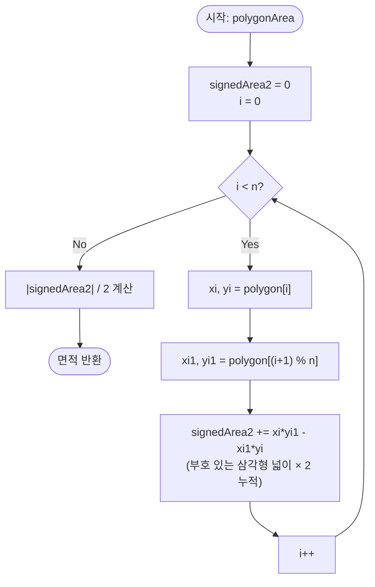

import { AlgorithmSimulation } from "#guide-sim";

# polygonArea — 원점 하나를 공유하면 다각형 바깥이 저절로 지워지는 이유

## 한눈에 보는 컨셉

다각형의 넓이를 구할 때, 정점을 삼각형으로 잘게 나눠 하나씩 더하는 대신 **원점을 공통 꼭짓점으로 고정하고 각 변마다 부호 있는 삼각형 넓이를 누적**하면 다각형 바깥을 덮는 항들이 자동으로 상쇄돼요. 이 관찰 덕분에 정점을 단 한 번만 순회하면 되고, 볼록·오목을 가릴 필요도 없습니다. 복잡도는 정점 수 `n`에 대해 `O(n)` 시간·`O(1)` 공간이에요.

## 출발점: 가장 순진한 방법부터

문제를 먼저 정확히 잡을게요.

```ts
type Point = [number, number];

function polygonArea(polygon: Point[]): number
```

| 파라미터 | 타입 | 의미 | 제약 |
|----------|------|------|------|
| `polygon` | `Point[]` | 자기교차 없는 단순 다각형의 정점 배열 (마지막 점과 첫 점은 자동으로 이어짐) | $3 \leq n \leq 10^5$ |

각 좌표는 $-10^9 \leq x, y \leq 10^9$ 범위의 정수이고, 정점 순서는 시계 방향·반시계 방향 모두 유효한 입력이에요. 반환값은 항상 $\geq 0$인 넓이입니다.

"다각형의 넓이"라고 하면 가장 먼저 떠오르는 발상은 **아는 도형(삼각형)으로 잘게 쪼개서 더하기**예요. 오목하지 않은 삼각형("귀", ear)을 하나 찾아 잘라내고, 남은 다각형에 같은 일을 반복하는 **귀 자르기(Ear Clipping)** 방식이 대표적입니다.

```text
n = 6인 육각형에서:
  1) 귀 하나를 찾는다      → 다른 모든 정점이 그 삼각형 밖에 있는지 확인해야 함 (정점마다 검사)
  2) 삼각형 하나를 떼어낸다 → 남은 정점 n-1개로 다시 1)부터

귀 하나 찾는 비용: O(n)   ×   반복 횟수: O(n)   =   O(n²)
n = 10^5 이면 10^10 연산   →   1초 제한에 명백히 초과
```

정점이 많아질수록 "지금 이 삼각형이 정말 안전하게 잘라도 되는 귀인지" 확인하는 비용이 매 단계 쌓입니다. 게다가 오목한 모서리가 있으면 아무 삼각형이나 잘라내면 안 되고, 어떤 정점이 귀에 해당하는지 판별하는 로직 자체가 까다로워요.

여기서 낌새 하나를 짚고 넘어갈게요. 삼각형을 "인접한 정점 셋"으로만 만들어야 할 이유가 있을까요? **꼭 다각형 위의 점이 아니어도, 아무 점 하나를 고정하고 그 점과 다각형의 각 변으로 삼각형을 만들면 어떨까요?** 이 질문이 이번 알고리즘의 출발점입니다.

## 아이디어 자세히 들여다보기

### 원점을 기준점 삼아 부채꼴로 쪼개기 — 수식과 그림

원점 $O = (0, 0)$을 고정하고, 다각형의 각 변 $\overline{v_i v_{i+1}}$과 원점을 이어 삼각형 $O$–$v_i$–$v_{i+1}$을 만들어 봅시다. 이 삼각형의 **부호 있는 넓이**를 다음처럼 정의합니다.

$$S_{\text{signed}}(O, v_i, v_{i+1}) = \frac{1}{2}(x_i\, y_{i+1} - x_{i+1}\, y_i)$$

정점 $(x_i, y_i)$와 $(x_{i+1}, y_{i+1})$만으로 계산되고, 원점의 좌표는 애초에 $(0,0)$이라 식에 나타나지도 않아요. 왜 하필 "원점"을 기준점으로 쓸까요? 다각형의 한 꼭짓점(예: $v_0$)을 기준점으로 잡아도(팬 삼각분할, fan triangulation) **부호 있는 넓이를 더하는 한** 오목 다각형에서도 정확한 값이 나옵니다 — 뒤에서 증명할 불변식이 기준점의 위치를 전혀 가리지 않기 때문이에요. 그런데도 굳이 원점을 쓰는 이유는 순전히 계산의 단순함에 있습니다. $v_0$을 기준점으로 삼으면 매 항마다 $(x_i - x_0)(y_{i+1}-y_0) - (y_i-y_0)(x_{i+1}-x_0)$처럼 뺄셈이 하나씩 더 끼어들고, "배열의 몇 번째 정점을 기준으로 잡을지" 결정도 따로 필요합니다. 원점은 좌표가 이미 $(0,0)$이라 이 뺄셈이 통째로 사라지고, 어떤 정점을 특별 취급할 필요도 없어집니다. **원점을 기준점으로 삼으면 계산이 가장 단순해지고, 정점 하나를 특별 취급하지 않아도 됩니다** — 뒤에서 그 이유를 증명으로 보일게요.

작은 예로 직접 채워 봅시다. 가로 4, 세로 3인 직사각형 `[[0,0],[4,0],[4,3],[0,3]]`입니다.

```text
       y
       |
    (0,3)---------(4,3)
       |            |
       |   폴리곤    |
       |            |
    (0,0)---------(4,0)---- x
       ↑
      원점 O는 이 사각형의 한 꼭짓점과 겹쳐 있다 (특별할 것 없는 우연)

변 (0,0)->(4,0): 삼각형 O-A-B가 선분 위에 퍼져 넓이 0 (원점과 한 직선)
변 (4,0)->(4,3): 삼각형 넓이 = ½(4·3 - 4·0) = 6   → 실제로 채우는 영역
변 (4,3)->(0,3): 삼각형 넓이 = ½(4·3 - 0·3) = 6   → 실제로 채우는 영역
변 (0,3)->(0,0): 삼각형 O-A-B가 선분 위에 퍼져 넓이 0 (원점과 한 직선)

합 = 0 + 6 + 6 + 0 = 12  →  직사각형 넓이 4×3 = 12 와 일치
```

잠깐, 확인 질문 하나 — 원점이 다각형 **바깥**에 있으면 이 합이 틀리지 않을까요? 예를 들어 방금 그 직사각형을 오른쪽 위로 옮겨 `[[10,10],[14,10],[14,13],[10,13]]`로 만들면, 원점 $(0,0)$은 이제 다각형에서 한참 떨어진 바깥에 있습니다. 실제로 계산해 보면(뒤에서 코드로도 검증합니다) 그래도 넓이는 그대로 `12`가 나와요. 다음 절에서 이게 왜 항상 성립하는지 짚어 보겠습니다.

### 단서를 설명해 주는 이론 — Green의 정리

방금 본 "원점이 어디에 있든 상쇄된다"는 현상은 우연이 아니라 **Green의 정리**라는 일반 이론의 특수한 경우예요. Green의 정리는 평면 위 닫힌 곡선 $C$로 둘러싸인 영역의 넓이를, 영역 내부를 채우는 대신 **경계를 한 바퀴 도는 선적분**만으로 구할 수 있다고 말합니다.

$$A = \frac{1}{2}\oint_C (x\,dy - y\,dx)$$

```text
     ___________
    /           \
   |   내부 A     |   ← 이 영역 전체를 채우지 않고도
    \___________/
         ↺
    경계를 한 바퀴 돌면서 (x dy - y dx) 를 더하기만 하면 A가 나온다
```

다각형은 이 곡선을 직선 $n$개로 근사한 특수한 경우예요. 변 $v_i \to v_{i+1}$ 위에서 위 선적분을 직접 계산하면 정확히 $x_i y_{i+1} - x_{i+1} y_i$가 나옵니다. 즉 **"경계만 한 바퀴 돌면 내부 전체를 채우지 않아도 넓이가 나온다"**는 Green의 정리의 성질과, 우리가 앞 절에서 관찰한 "원점 어디에 있든 상쇄된다"는 현상은 같은 사실을 연속(적분)과 이산(합)의 언어로 각각 표현한 것입니다. 다각형 넓이 공식(Shoelace Formula)은 이 일반 정리를 선분 $n$개짜리 곡선에 적용한 특수 사례로 볼 수 있어요 — 다만 이 이산 버전은 적분을 몰라도 순수 대수만으로 직접 증명됩니다(핵심은 "기준점을 옮겨도 합이 변하지 않는다"는 사실 하나예요). 그 증명은 바로 다음 절에서 보여드릴게요.

### 왜 모순 없이 작동하는가

이 알고리즘이 지키는 불변식은 하나입니다.

> 변 $i$개를 처리한 시점의 누적값(`signedArea2`)은 부채꼴 도형 $O$–$v_0$–$v_1$–$\cdots$–$v_i$의 부호 있는 넓이의 2배와 정확히 같다.

**기저**: $i = 0$일 때 아직 어떤 변도 처리하지 않았으므로 `signedArea2 = 0`이고, 부채꼴은 점 $v_0$ 하나뿐이라 넓이도 0입니다. 불변식이 성립해요.

**귀납 단계**: $i$번째 변까지 처리해 불변식이 성립한다고 합시다. 반복문은 매 단계 정확히 삼각형 $O$–$v_i$–$v_{i+1}$ 하나에 해당하는 항만 누적값에 더하도록 짜여 있으므로("원점을 기준점 삼아 부채꼴로 쪼개기" 절에서 정의한 식 $x_i y_{i+1} - x_{i+1} y_i$ 그대로), 이번 단계에 더해지는 값이 다른 무언가로 갈라질 여지 자체가 없습니다 — 경우는 "이 항 하나를 더한다"는 것뿐이에요. 이 항을 누적값에 더하면 새 부채꼴의 부호 있는 넓이의 2배가 됩니다. 마지막 변($v_{n-1} \to v_0$, 순환 인덱스)까지 더하면 이렇게 누적된 값은 다각형 전체의 부호 있는 넓이의 2배와 정확히 같아집니다 — 이 등식이 원점의 위치와 무관하게 성립하는 이유는 바로 아래에서 짚어 볼게요.

여기서 **헷갈리기 쉬운 포인트**가 세 가지 있습니다.

- **"삼각형 넓이는 원래 양수니까, 매번 절댓값을 취해서 더하면 더 안전하지 않나?"** — 아니요, 이게 바로 오목 다각형에서 조용히 틀린 값을 내는 가장 흔한 실수입니다. 오목 오각형 `[[0,0],[2,2],[4,0],[4,4],[0,4]]`(정답 넓이 `12`, 정점 $(2,2)$가 오목 꼭짓점)을 $v_0=(0,0)$ 기준 팬 삼각분할로 풀어 봅시다. 세 삼각형의 **부호 있는** 넓이는 각각 `-4, 8, 8`인데, 첫 삼각형이 음수인 이유는 오목 꼭짓점 쪽 삼각형이 다각형 영역을 "거꾸로" 덮기 때문이에요. 이걸 부호 그대로 더하면 `-4+8+8=12`로 정답이지만, 매번 절댓값부터 씌워서 `4+8+8=20`으로 더하면 실제로 있지도 않은 면적 `8`이 두 번 더해져 오답이 나옵니다. **절댓값은 개별 삼각형이 아니라 전체 합산이 끝난 뒤 딱 한 번만 취해야 합니다.**
- **"원점이 다각형 밖에 있으면 안 되지 않나?"** — 아니요, 상관없습니다. 이게 그 예시 하나에서만 우연히 맞아떨어진 게 아니라는 걸 대수적으로 짚어 볼게요. 기준점을 원점 대신 임의의 점 $p = (p_x, p_y)$로 바꿔서 $\sum_i \big[(x_i-p_x)(y_{i+1}-p_y) - (x_{i+1}-p_x)(y_i-p_y)\big]$를 전개하면, $p_x, p_y$가 낀 항들은 정점을 한 바퀴 순환하며 정확히 짝을 지어 사라지고(각 정점이 "다음 변의 끝점"과 "이번 변의 시작점"으로 정확히 한 번씩 들어갔다 나가기 때문에) 남는 건 원래의 $\sum_i (x_i y_{i+1} - x_{i+1} y_i)$ 그대로입니다. 즉 이 합은 **기준점이 무엇이든 값이 똑같이 나오도록 되어 있는 식**이라, 원점이 다각형 안에 있든 밖에 있든 결과가 달라질 이유가 애초에 없는 거예요. 위에서 본 이동된 직사각형 예시가 정확히 이 경우입니다 — 원점 $(0,0)$이 다각형 `[[10,10],[14,10],[14,13],[10,13]]`의 바깥에 있지만(직접 실행해도 `signedArea2 = 24`로 원래 예시와 동일하게 나옵니다), 부호가 반대인 항들이 서로 상쇄되어 결과는 그대로 `12`입니다.
- **"정점 순서가 시계 방향이면 결과가 달라지지 않나?"** — 부호는 달라지지만 절댓값은 같습니다. 앞의 직사각형을 반시계 대신 시계 방향으로 나열한 `[[0,0],[0,3],[4,3],[4,0]]`으로 누적하면 `signedArea2 = -24`가 나와요(양수 `24`가 아니라 부호가 뒤집힘). 마지막에 절댓값을 취하지 않으면 이 경우 `area = -12`라는 말이 안 되는 값을 반환하게 됩니다. 반드시 `Math.abs(signedArea2) / 2`로 마무리해야 하는 이유가 이것입니다.

```text
헷갈리는 예 1: "삼각형마다 절댓값을 씌워서 더하면 더 안전하지 않나?"

오목 오각형 (0,0)-(2,2)-(4,0)-(4,4)-(0,4), 정답 넓이 = 12
  삼각형별 부호 있는 넓이:  -4,  8,  8   → 그대로 합산 -4+8+8 = 12  ✓
  삼각형마다 절댓값 먼저:   4,  8,  8   → 합산 4+8+8 = 20         ✗ (오목 꼭짓점 쪽을 이중으로 더함)

헷갈리는 예 2: "부호가 음수면 뭔가 잘못된 것 아닌가?"

반시계(올바른 방향 가정): signedArea2 =  24  → area =  24/2 = 12
시계(반대 방향):          signedArea2 = -24  → area = |-24|/2 = 12  (절댓값 없으면 -12로 오답)
```

엣지 케이스도 이 불변식 위에서 점검해 두겠습니다.

```text
n = 3 (최소 삼각형)         → 일반 삼각형 넓이 공식과 동일한 결과
모든 정점이 한 직선 위       → 모든 삼각형이 퇴화(밑변 0)해 넓이 0
오목 다각형                 → 일부 부채꼴 조각이 다각형 밖을 덮지만 최종 합에서 상쇄되어 정확
변 위의 중간 정점 포함      → 그 정점이 만드는 삼각형도 퇴화해 넓이에 영향 없음
자기교차 다각형 (입력 범위 밖) → 공식 자체는 계산되지만 그 값은 겹치는 영역을 이중으로 세거나 상쇄한 부호 있는 합(대수적 면적)이라 일반적으로 기대하는 "다각형의 면적"과 다름 — 이 알고리즘은 단순 다각형 전제
```

> 기억법: "원점 두고 부채꼴, 마지막에 절댓값." 원점 위치는 신경 쓰지 마세요 — 상쇄가 알아서 처리합니다.

## 아이디어를 코드로 옮기기

```ts
type Point = [number, number];

function polygonArea(polygon: Point[]): number {
  const n = polygon.length;
  let signedArea2 = 0; // 불변식: 처리한 변까지의 부채꼴 부호 있는 넓이 × 2

  for (let i = 0; i < n; i++) {
    const [xi, yi] = polygon[i];
    const [xi1, yi1] = polygon[(i + 1) % n]; // 순환 인덱스: 마지막 변 v[n-1] -> v[0] 자동 처리
    signedArea2 += xi * yi1 - xi1 * yi;
  }

  return Math.abs(signedArea2) / 2;
}
```

**가장 중요한 줄은 `signedArea2 += xi * yi1 - xi1 * yi;`입니다.** 이 한 줄이 앞 절에서 증명한 귀납 단계 그 자체예요 — 부채꼴에 삼각형 하나를 붙이는 연산이 코드에서는 덧셈 한 번으로 끝납니다. 그 외에 결정 지점만 짚어 볼게요.

- **인덱스 순환 `(i + 1) % n`**: 배열에 $v_n = v_0$을 직접 추가하지 않고 나머지 연산으로 마지막 변을 처리합니다. 만약 `polygon`에 첫 점을 복사해 붙여 넣고 평범한 인덱스로 순회하면, 마지막 변이 중복 계산되거나(배열 길이를 헷갈리면) 아예 안 닫히는 실수가 생기기 쉬워요.
- **나눗셈은 마지막에 한 번만**: 매 항마다 2로 나누지 않고 전체 합산 후 딱 한 번 나눕니다. 부동소수 나눗셈을 $n$번 반복하면 반올림 오차가 누적될 수 있는데, 마지막에 한 번만 나누면 이 누적을 피할 수 있어요.
- **초기값 `signedArea2 = 0`**: 앞서 본 "왜 모순 없이 작동하는가" 절의 귀납 증명 기저(부채꼴이 점 하나뿐일 때 넓이 0)와 정확히 대응합니다.

이 구현은 정점을 정확히 한 번씩만 훑으므로 이미 `O(n)` 시간, 추가로 쓰는 메모리는 누적 변수 하나뿐이라 `O(1)` 공간이에요 — 첫 절에서 세운 목표를 도달과 동시에 달성합니다. 다각형의 넓이를 구하려면 정점 정보를 적어도 한 번은 전부 읽어야 하므로 `Ω(n)`이 하한이고, 그래서 여기서 더 점근적으로 빨라질 여지는 없습니다. `Shoelace Formula`로 가는 과정은 귀 자르기처럼 "일단 동작하는 안을 잡고 조금씩 다듬는" 형태가 아니라, 애초에 계산 대상 자체를 바꾼(영역을 직접 채우는 대신 경계의 부호합만 본다) 결과라 이 문제에서는 곧바로 이 아이디어로 가는 편이 가장 직선적입니다. 이 알고리즘이 유효한 범위는 자기교차 없는 단순 다각형이라는 점만 항상 기억해 두세요 — 입력이 이를 보장하지 않는 상황이라면 사전 검증이 별도로 필요합니다.

한 가지 덧붙이면, 정수 좌표가 $10^9$ 근처로 크면 각 항 $|x_i y_{i+1}|$이 최대 $10^{18}$까지 커지고, 상쇄가 거의 일어나지 않는 배치(예: 모든 항의 부호가 같은 경우)라면 `signedArea2` 자체가 항 $n$개를 그대로 더한 $10^{23}$ 근처까지 커질 수 있습니다. 이는 JavaScript `number`의 안전 정수 범위($2^{53} \approx 9 \times 10^{15}$)를 몇 자릿수나 넘어서는 값이라, 이 문제가 제시한 제약($n \leq 10^5$, 좌표 $10^9$)을 그대로 받는 상황이라면 `number` 누적만으로는 값이 조용히 어긋날 수 있습니다. 상쇄로 합이 작게 나오는 입력도 실제로 많지만 그건 우연이지 보장이 아니므로, 이 제약 범위를 온전히 감당하려면 누적을 `BigInt`로 바꾸는 것이 사실상 필수예요.

## 실행 시각화

예시 다각형 `polygon = [[0,0], [4,0], [4,3], [0,3]]`(가로 4, 세로 3 직사각형)에 대해 신발끈 공식을 실행하는 과정입니다. 각 변 `v[i] -> v[(i+1)%n]`마다 외적 항 `x_i * y_(i+1) - x_(i+1) * y_i`를 `signed_area2`에 누적해요. keyValue 패널은 현재 처리 중인 변, 이번 항의 값, 누적 합을 보여줍니다. 실제 반환값은 `12`이며, 시뮬레이션 마지막 프레임의 `|signed_area2| / 2`와 일치합니다(본문 코드를 추출해 직접 실행해 확인했습니다).

> 대화형 시뮬레이션은 MDX 런타임에서 표시됩니다.

export const steps = [
  {
    title: "초기화",
    detail: "signed_area2 = 0. 정점 4개를 순환하며 각 변의 외적을 누적한다.",
    entries: [
      { label: "polygon", value: "[[0,0],[4,0],[4,3],[0,3]]" },
      { label: "signed_area2", value: 0 },
    ],
  },
  {
    title: "i = 0: 변 (0,0) -> (4,0)",
    detail: "항 = x0*y1 - x1*y0 = 0*0 - 4*0 = 0. 누적 0 + 0 = 0.",
    entries: [
      { label: "현재 변", value: "(0,0) -> (4,0)" },
      { label: "이번 항", value: 0 },
      { label: "signed_area2", value: 0 },
    ],
  },
  {
    title: "i = 1: 변 (4,0) -> (4,3)",
    detail: "항 = x1*y2 - x2*y1 = 4*3 - 4*0 = 12. 누적 0 + 12 = 12.",
    entries: [
      { label: "현재 변", value: "(4,0) -> (4,3)" },
      { label: "이번 항", value: 12 },
      { label: "signed_area2", value: 12 },
    ],
  },
  {
    title: "i = 2: 변 (4,3) -> (0,3)",
    detail: "항 = x2*y3 - x3*y2 = 4*3 - 0*3 = 12. 누적 12 + 12 = 24.",
    entries: [
      { label: "현재 변", value: "(4,3) -> (0,3)" },
      { label: "이번 항", value: 12 },
      { label: "signed_area2", value: 24 },
    ],
  },
  {
    title: "i = 3: 변 (0,3) -> (0,0)",
    detail: "순환 인덱스로 마지막 변. 항 = x3*y0 - x0*y3 = 0*0 - 0*3 = 0. 누적 24 + 0 = 24.",
    entries: [
      { label: "현재 변", value: "(0,3) -> (0,0)" },
      { label: "이번 항", value: 0 },
      { label: "signed_area2", value: 24 },
    ],
  },
  {
    title: "완료: 면적 = 12",
    detail: "루프 종료. |signed_area2| / 2 = |24| / 2 = 12.",
    entries: [
      { label: "signed_area2", value: 24 },
      { label: "반환값 |s|/2", value: 12 },
    ],
  },
];

<AlgorithmSimulation view="keyValue" steps={steps} title="신발끈 공식: 직사각형 면적" />

## 흐름 한눈에 보기



## 스스로 점검하기

1. `polygon = [[0,0],[5,0],[5,5],[0,5]]`(5×5 정사각형)에 대해 본문과 같은 방식으로 각 변의 항을 손으로 계산하고, 최종 넓이가 `25`인지 확인해 보세요.
2. 마지막에 `Math.abs`를 빼고 그냥 `signedArea2 / 2`만 반환하도록 코드를 바꾸면, 정점 순서가 시계 방향인 입력(`[[0,0],[0,3],[4,3],[4,0]]`)에서 정확히 어떤 값이 나오고 왜 틀린 값인지 짚어 보세요.
3. 다각형의 정점이 이미 원점을 지나지 않는 임의의 위치(예: 좌표가 전부 `[100, 100]` 근처)에 있어도 이 알고리즘이 그대로 통하는 이유를, "왜 모순 없이 작동하는가" 절의 불변식(그리고 기준점이 무엇이든 합이 변하지 않는다는 사실)을 근거로 한 문장으로 설명해 보세요.
