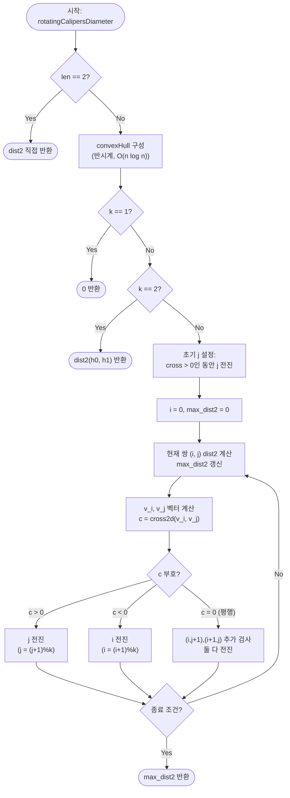

import { AlgorithmSimulation } from "#guide-sim";

# rotatingCalipersDiameter — 두 평행 지지선을 함께 돌리면 볼록 껍질 위 후보 쌍을 한 바퀴 만에 다 훑는 이유

## 한눈에 보는 컨셉

2D 평면 위 점들 중 가장 멀리 떨어진 두 점 사이 거리(지름)를 구하는 문제예요. 핵심 관찰은 두 가지입니다 — 지름을 만드는 두 점은 항상 **볼록 껍질(convex hull)** 위에 있고, 그중에서도 두 개의 평행한 지지선(supporting line)이 동시에 닿는 **antipodal pair**에서만 지름이 나옵니다. 볼록 껍질을 `O(n log n)`에 구한 뒤, 두 지지선을 함께 반 바퀴 회전시키며 antipodal pair를 `O(h)`에 전부 훑으면(`h`는 껍질 크기) — 전체가 `O(n log n)`에 끝나요.

## 출발점: 가장 순진한 방법부터

문제를 먼저 정확히 잡을게요.

```ts
type Point = [number, number];

function rotatingCalipersDiameter(points: Point[]): number
```

| 항목 | 내용 |
|------|------|
| `points` | 2D 점 배열, `[x, y]` 형태 |
| 반환 | 가장 멀리 떨어진 두 점 사이 거리의 **제곱** (부동소수 `sqrt` 없이 정수 결과) |
| 점 수 $n$ | $2 \leq n \leq 10^5$ |
| 좌표 범위 | $-10^9 \leq x, y \leq 10^9$ (정수) |

좌표 차이가 최대 $2\times10^9$이므로 제곱 거리는 최대 $4\times10^{18}$까지 커집니다. JS의 `number`(배정밀도 부동소수)는 정수를 $2^{53}$(약 $9\times10^{15}$)까지만 정확히 표현하도록 보장하므로, 이 범위를 넘는 곱셈에서는 이론상 오차가 생길 수 있어요. 그런데 이 오차는 `dist2`의 반환값만 살짝 흔드는 수준이 아닙니다 — 볼록 껍질을 만드는 `cross`(좌표 차 곱셈이 같은 규모로 커짐)와 캘리퍼스 전진 방향을 정하는 `cross2d`도 정확히 같은 크기의 곱셈을 수행하므로, 좌표가 극단적으로 크면 **껍질의 turn 판정이 뒤집히거나 캘리퍼스가 엉뚱한 포인터를 전진시켜 알고리즘 자체가 틀린 답을 낼 수 있습니다.** 즉 정수 안전성은 "값이 조금 흔들리는" 보조 문제가 아니라, 이 알고리즘이 정당하게 작동하기 위한 전제 조건입니다. 이 가이드의 코드는 설명 목적상 `number`를 그대로 쓰지만, 실전 채점 환경에서 좌표가 큰 입력을 다룬다면 `BigInt`나 64비트 정수 타입을 쓰는 편이 안전합니다.

"가장 멀리 떨어진 두 점"을 구하는 가장 정직한 방법은 모든 점 쌍의 거리를 다 재보는 겁니다.

```ts
function dist2(a: Point, b: Point): number {
  const dx = a[0] - b[0];
  const dy = a[1] - b[1];
  return dx * dx + dy * dy;
}

function diameterNaive(points: Point[]): number {
  let best = 0;
  for (let i = 0; i < points.length; i++) {
    for (let j = i + 1; j < points.length; j++) {
      best = Math.max(best, dist2(points[i]!, points[j]!));
    }
  }
  return best;
}
```

작은 예로 직접 나열해 봅시다. `points = [(0,0), (10,0), (5,5), (4,3), (6,2)]`(5개)이면 $\binom{5}{2}=10$쌍을 전부 재고, 그중 `(0,0)-(10,0)`이 제곱 거리 `100`으로 최대예요.

```text
쌍 10개: (0,0)-(10,0)=100  (0,0)-(5,5)=50  (0,0)-(4,3)=25  (0,0)-(6,2)=40
         (10,0)-(5,5)=50  (10,0)-(4,3)=45 (10,0)-(6,2)=20
         (5,5)-(4,3)=5    (5,5)-(6,2)=10  (4,3)-(6,2)=5
최댓값 = 100  ((0,0)과 (10,0))
```

이 방식을 $n$을 키워 그대로 밀어붙이면 비용이 이렇게 자랍니다.

```text
점 5개:    쌍 10개                       →  즉시 끝
점 10^5개: 쌍 ≈ 5×10^9개  →  1초 제한 안에 못 끝난다 (TLE)
```

**목표 복잡도**: $O(n \log n)$ — 볼록 껍질 구성이 지배하고, 나머지는 그보다 작은 항이어야 합니다.

그런데 위 5개 점 예시를 다시 보면 낌새가 하나 보여요. `(5,5)`, `(4,3)`, `(6,2)`는 애초에 최댓값 후보가 될 수 없어 보입니다 — 다 안쪽에 몰려 있고, 바깥 두 점 `(0,0)`, `(10,0)`이 답을 만들었죠. **"안쪽 점은 애초에 비교할 필요가 없지 않을까?"** 이것이 이번 알고리즘의 출발 단서입니다.

## 아이디어 자세히 들여다보기

이 알고리즘은 `convexHull` 위에 쌓입니다. 볼록 껍질을 반시계(CCW) 방향으로 구성하는 과정 자체의 상세한 유도는 [convexHull 가이드](../convexHull/convexHull-guide.mdx)를 참고하세요 — 여기서는 "반시계로 정렬된 볼록 껍질 정점 배열"이라는 결과만 가져다 씁니다.

### 볼록 껍질과 antipodal pair — 수식과 그림

**관찰 1 (내부 점은 후보가 아니다)**: 점 $p$가 볼록 껍질의 두 꼭짓점 $a, b$를 잇는 변 위(또는 껍질 내부)에 있다고 합시다. $p = t\cdot a + (1-t)\cdot b$ ($0 \le t \le 1$)로 쓸 수 있고, 임의의 점 $q$에 대해 제곱 거리 함수 $f(x) = \|x-q\|^2$는 볼록 함수이므로

$$f(p) = f(t\cdot a + (1-t)\cdot b) \leq t\cdot f(a) + (1-t)\cdot f(b) \leq \max(f(a), f(b))$$

즉 $p$가 만드는 거리는 항상 $a$나 $b$ 중 하나가 만드는 거리보다 작거나 같습니다. 이 논증을 모든 내부 점에 적용하면, **지름은 항상 볼록 껍질 위 두 점 사이에서 나온다**는 결론이 나옵니다. 위 5점 예시로 확인하면, 껍질은 `(0,0)-(10,0)-(5,5)`(삼각형)이고 내부 점 `(4,3)`, `(6,2)`는 정확히 이 논증대로 후보에서 빠집니다.

```text
        (5,5)
       /  ⋅(4,3)   ← 내부 점 (후보 아님)
      /  ⋅(6,2)
(0,0)-------(10,0)
```

이제 껍질 위 점들끼리 비교하면 됩니다. 하지만 껍질 크기 $h$가 $n$에 가까울 수도 있어서(뒤에서 바로 볼 거예요), 모든 쌍을 또 비교하면 $O(h^2)$가 됩니다. 여기서 두 번째 관찰이 필요해요.

**관찰 2 (antipodal pair만 지름 후보다)**: 볼록 다각형 $\mathcal{H} = h_0, h_1, \ldots, h_{k-1}$(반시계)에서, 변 $\overrightarrow{h_i h_{i+1}}$에 대해 **가장 먼 정점**을 그 변의 antipodal 정점이라고 부릅니다. "가장 먼"의 척도는 밑변이 고정된 삼각형의 넓이(부호 있는 외적의 절댓값)로 잽니다.

$$\text{far}(i) = \arg\max_{m} \big|\,\mathrm{cross}(h_i,\, h_{i+1},\, h_m)\,\big|, \qquad \mathrm{cross}(a,b,c) = (b_x-a_x)(c_y-a_y) - (b_y-a_y)(c_x-a_x)$$

지름의 두 끝점을 $h_i, h_j$라 합시다(둘 다 볼록 껍질 위 정점이라는 건 관찰 1에서 이미 확인했죠). $h_i$를 지나며 선분 $h_ih_j$에 **수직**인 직선 $\ell_i$를 그어 보세요. 만약 $\ell_i$의 $h_j$ 반대편에 껍질의 점 $r$이 있다면, 피타고라스 정리로 $\mathrm{dist}(r, h_j) > \mathrm{dist}(h_i, h_j)$가 되어 $(h_i,h_j)$가 지름이라는 가정과 모순됩니다. 그러므로 $\ell_i$는 볼록 껍질 전체를 한쪽에 두는 **지지선**이어야 합니다. 같은 논증이 $h_j$를 지나는 수직선 $\ell_j$에도 그대로 적용되죠. 즉 $\ell_i \parallel \ell_j$(둘 다 $h_ih_j$에 수직)인 두 지지선이 각각 $h_i$, $h_j$에서 볼록 껍질을 지지합니다 — 이것이 바로 antipodal pair의 정의(두 평행 지지선이 동시에 닿는 정점 쌍)입니다. 회전 캘리퍼스가 $\theta=0$부터 $\pi$까지 모든 지지선 방향을 훑는 동안, $h_ih_j$에 수직인 방향도 반드시 지나가므로 — 그 순간의 접점이 정확히 $(h_i, h_j)$입니다. 정리하면, **모든 지름은 어느 변에 대해서든 $h_j = \text{far}(i)$를 만족하는 antipodal pair로 나타난다**는 뜻이고, 볼록 다각형에서 antipodal pair는 최대 $O(h)$개뿐이라 이 사실 하나로 후보가 $O(h^2)$에서 확 줄어듭니다.

잠깐, 확인 하나만 해 볼까요? 정사각형 `(0,0)-(4,0)-(4,4)-(0,4)`에서 변 `(0,0)→(4,0)`에 대한 antipodal 정점은 어디일까요? 이 변에서 가장 먼 점은 반대쪽 변 위의 `(4,4)`와 `(0,4)`가 똑같이 멀어요(둘 다 넓이 16) — 이렇게 **여러 정점이 동시에 antipodal**이 될 수 있다는 점을 기억해 두세요. 뒤에서 이 경우를 따로 처리합니다.

### 단서를 설명해 주는 이론 — 회전하는 지지선(rotating calipers)

antipodal pair를 "각 변마다 처음부터 다시 찾기"는 여전히 $O(h)$ 개 변 $\times$ $O(h)$ 스캔이라 $O(h^2)$입니다. 이걸 $O(h)$로 낮추는 이론이 바로 **rotating calipers**예요.

볼록 다각형을 두 개의 평행한 지지선(caliper의 두 팔이라고 생각하면 됩니다)으로 사이에 끼운다고 상상해 보세요. 이 두 선을 각도 $\theta = 0$에서 $\theta = \pi$까지 **함께, 같은 각속도로** 회전시키면, 두 선이 다각형에 닿는 접점은 다음 정점으로 "점프"하며 이동합니다. 핵심 주장은 이거예요.

> **이 회전이 만드는 접점 쌍의 나열이 정확히 모든 antipodal pair의 나열이다.**

이걸 계산으로 구현하려면 "다음에 어느 지지선을 먼저 넘길지"를 정해야 합니다. 두 포인터 $i$(한쪽 접점), $j$(반대쪽 접점)가 각각 변 $\overrightarrow{h_i h_{i+1}}$, $\overrightarrow{h_j h_{j+1}}$을 대표한다고 하면, 각 변의 방향각 $\theta_i, \theta_j$ 중 **더 작은 쪽**이 다음에 지지선에 닿을 차례입니다. 두 방향각을 직접 비교하는 대신 외적 부호로 판정합니다.

$$c = \mathrm{cross2d}(\vec v_i, \vec v_j), \qquad \vec v_i = h_{(i+1)\%k} - h_i,\ \ \vec v_j = h_{(j+1)\%k} - h_j$$

- $c > 0$: $\vec v_i$가 $\vec v_j$보다 각도가 크다 → $j$ 전진 (뒤처진 쪽을 따라잡는다)
- $c < 0$: 반대로 $i$ 전진
- $c = 0$: 두 변이 평행 → 이번 변 전체가 동시에 지지선에 닿는 순간이므로, 앞서 확인한 "여러 정점이 동시에 antipodal" 상황입니다. $i$, $j$ 둘 다 전진시키되, 그 사이 조합 $(i, j{+}1)$과 $(i{+}1, j)$도 후보로 검사해야 놓치지 않습니다.

이 부호 판정 규칙을 기억해 두세요 — 뒤 최적화 절에서 그대로 다시 씁니다.

### 왜 모순 없이 작동하는가

먼저 이 알고리즘이 지키는 불변식을 적어볼게요.

> 루프의 매 순간, $(i, j)$는 어떤 회전 각도 $\theta$에서 두 평행 지지선이 동시에 닿는 antipodal pair다.

**기저**: 시작 시점의 $j_0$는 "변 $\overrightarrow{h_0 h_1}$에 대해 $c > 0$인 동안 전진"해서 찾습니다 — 이는 $\theta = 0$(변 $\overrightarrow{h_0h_1}$ 방향)에서의 antipodal 정점을 정확히 찾는 절차이므로, $(i, j) = (0, j_0)$은 유효한 antipodal pair입니다.

**귀납 단계**: $(i,j)$가 각도 $\theta$에서 유효한 antipodal pair — 즉 $h_i$를 지나는 지지선과 $h_j$를 지나는 지지선이 서로 평행하며 방향이 $\theta$ — 라고 합시다. 다음 각도로 넘어갈 때 벌어질 수 있는 경우는 $c=\mathrm{cross2d}(\vec v_i, \vec v_j)$의 부호 — 양수, 음수, 0 — 세 가지뿐이고 이 셋이 전부입니다(외적은 실수이므로 부호 삼분법이 경우의 전부를 덮습니다).

1. **$c>0$일 때 $j$만 전진해야 하는 이유**: $c>0$은 변 $\overrightarrow{h_ih_{i+1}}$의 방향각이 변 $\overrightarrow{h_jh_{j+1}}$의 방향각보다 크다는 뜻입니다 — $j$ 쪽 지지선이 다음 정점 $h_{j+1}$ 방향에 더 가까이 다다라 있으므로, 각도가 조금만 늘어도 먼저 접점이 바뀌는 쪽은 $j$입니다. $i$ 쪽 지지선은 여전히 $h_i$에 닿아 있으니 그대로 두고 $j$만 다음 정점으로 넘겨야 두 지지선의 평행 관계(antipodal 정의)가 유지됩니다. $c<0$이면 대칭적으로 $i$만 전진합니다.
2. **$c=0$일 때 둘 다 전진해도 놓치지 않는 이유**: $c=0$은 두 변이 평행하다는 뜻이라, 각도가 조금만 늘어도 $i$ 쪽과 $j$ 쪽 지지선이 동시에 다음 정점으로 넘어갑니다. 이 순간 실제로는 $(h_i,h_j)$, $(h_i,h_{j+1})$, $(h_{i+1},h_j)$, $(h_{i+1},h_{j+1})$ 네 조합 모두가 같은 방향 구간의 antipodal 후보인데, $(h_i,h_j)$는 이번 반복 맨 앞에서 이미 검사했고, $(h_i,h_{j+1})$·$(h_{i+1},h_j)$는 평행 분기에서 직접 검사하며, $(h_{i+1},h_{j+1})$은 두 포인터를 전진시킨 뒤 다음 반복 맨 앞에서 자동으로 검사됩니다 — 네 조합이 중복도 누락도 없이 정확히 한 번씩 방문되는 거예요.
3. **경우의 완전성**: 위 세 갈래(양수·음수·0)가 실수 부호의 전부이므로, 다음 각도에서도 $(i,j)$가 여전히 유효한 antipodal pair임이 모든 경우에 보장됩니다.

두 포인터의 전진 합은 매 단계 최소 1(때로는 2)씩 늘고 각 포인터는 한 바퀴에 최대 $k$번 전진하므로, 전체 루프는 총 전진 합이 $2k$를 넘기 전에 시작 위치 $(i_0, j_0)$로 돌아와 종료합니다 — $O(k)$ 단계. 그리고 각도가 $\theta=0$부터 $\pi$(반 바퀴 — 지지선의 방향은 $\pi$ 주기이므로, 반 바퀴만 돌려도 가능한 모든 지지선 방향을 빠짐없이 훑습니다)까지 단조 증가하며 훑히므로, 그 사이 존재하는 모든 antipodal pair가 어느 시점엔가 $(i,j)$로 방문됩니다.

여기서 **헷갈리기 쉬운 포인트**가 하나 있습니다. "그냥 $i=0, j=1$(인접 정점)에서 시작해도 되지 않을까?"라는 생각이 들기 쉬운데, 이러면 종료 조건(`i === i0 && j === j0`)을 영영 만나지 못해 **무한 루프**에 빠질 수 있습니다. 정사각형 `(0,0)-(4,0)-(4,4)-(0,4)`에서 직접 확인해 봅시다.

```text
잘못된 시작: i0=0, j0=1 (헌팅 없이 바로 인접 정점)

step0: (i=0,j=1) → c>0 → j 전진
step1: (i=0,j=2)
step2: (i=1,j=3)
step3: (i=2,j=0)
step4: (i=3,j=1)
step5: (i=0,j=2)  ← 다시 여기로! (0,1)은 두 번 다시 등장하지 않는다

순환 궤도: (0,2) → (1,3) → (2,0) → (3,1) → (0,2) → ...
종료 조건 i==0 && j==1 은 이 궤도 위에 없다  →  무한 루프
```

올바른 구현(제대로 헌팅해서 $j_0=2$로 시작)이면 궤도가 정확히 $(0,2)\to(1,3)\to(2,0)\to(3,1)\to(0,2)$이고, 시작점이 궤도 위에 있으므로 한 바퀴만에 멈춥니다. **초기 $j$를 제대로 찾는 헌팅 루프는 장식이 아니라 종료를 보장하는 조건**이라는 걸 기억해 두세요.

엣지 케이스도 짚어 둡니다.

```text
n = 2                     → 두 점의 dist2를 바로 반환 (껍질 계산 불필요)
모든 점이 한 직선 위       → 껍질 크기 h=2, 양 끝점 dist2 반환
모든 점이 같은 좌표        → 껍질 크기 h=1, 0 반환
껍질 크기 h=3 (삼각형)     → while 루프가 그대로 동작 (특별 처리 불필요)
```

## 아이디어를 코드로 옮기기

관찰 1·2를 그대로 옮기면 "볼록 껍질을 구하고, 각 변마다 antipodal 정점을 처음부터 다시 스캔해서 찾는다"는 구현이 나옵니다.

```ts
type Point = [number, number];

function dist2(a: Point, b: Point): number {
  const dx = a[0] - b[0];
  const dy = a[1] - b[1];
  return dx * dx + dy * dy;
}

function cross(a: Point, b: Point, c: Point): number {
  return (b[0] - a[0]) * (c[1] - a[1]) - (b[1] - a[1]) * (c[0] - a[0]);
}

// 표준 monotone chain (Andrew's algorithm) — 반시계, 공선 정점 제외
function buildConvexHull(points: Point[]): Point[] {
  const pts = [...points].sort((a, b) => a[0] - b[0] || a[1] - b[1]);
  const n = pts.length;
  if (n < 2) return pts;

  const lower: Point[] = [];
  for (const p of pts) {
    while (lower.length >= 2 && cross(lower[lower.length - 2]!, lower[lower.length - 1]!, p) <= 0) {
      lower.pop();
    }
    lower.push(p);
  }
  const upper: Point[] = [];
  for (let i = n - 1; i >= 0; i--) {
    const p = pts[i]!;
    while (upper.length >= 2 && cross(upper[upper.length - 2]!, upper[upper.length - 1]!, p) <= 0) {
      upper.pop();
    }
    upper.push(p);
  }
  lower.pop();
  upper.pop();
  return lower.concat(upper);
}

function diameterAntipodalBrute(points: Point[]): number {
  if (points.length === 2) return dist2(points[0]!, points[1]!);

  const hull = buildConvexHull(points);
  const k = hull.length;
  if (k === 1) return 0;
  if (k === 2) return dist2(hull[0]!, hull[1]!);

  let maxDist2 = 0;
  for (let i = 0; i < k; i++) {
    const a = hull[i]!;
    const b = hull[(i + 1) % k]!;
    let far = 0;
    for (let m = 1; m < k; m++) { // 이 변마다 전체 정점을 처음부터 다시 스캔
      if (Math.abs(cross(a, b, hull[m]!)) > Math.abs(cross(a, b, hull[far]!))) far = m;
    }
    maxDist2 = Math.max(maxDist2, dist2(a, hull[far]!), dist2(b, hull[far]!));
  }
  return maxDist2;
}
```

**가장 중요한 부분은 안쪽 `for (let m = 1; m < k; m++)` 루프입니다.** 변 하나마다 정점 $k$개를 처음부터 다시 훑어 가장 먼 점(`far`)을 찾으므로, 바깥 루프($k$번)와 곱해져 $O(h^2)$가 됩니다. 그 외 결정 지점:

- `far`의 초기값은 인덱스 `0`(즉 `hull[0]`)입니다. 실제로는 `cross(a, b, hull[0])`이 자기 자신 근처라 작을 수밖에 없어서, 첫 몇 번의 비교에서 바로 갱신됩니다.
- `k < 3`인 경우(선분 또는 한 점)는 while 루프에 들어가지도 않게 앞에서 따로 반환합니다 — 이 가드가 없으면 `(i+1)%k`가 자기 자신을 가리켜 변이 정의되지 않습니다.

## 더 빠르게 만들 단서 찾기

이 구현이 어디서 시간을 낭비하는지 직접 추적해 봅시다. 사다리꼴 `(0,0)-(10,0)-(6,4)-(2,4)`(이미 볼록 껍질, $k=4$)에서 각 변의 `far`를 구해 보면 이렇습니다.

```text
edge i=0 (0,0)→(10,0)  : far = 2 → (6,4)   candDist2 = 52
edge i=1 (10,0)→(6,4)  : far = 0 → (0,0)   candDist2 = 100
edge i=2 (6,4)→(2,4)   : far = 0 → (0,0)   candDist2 = 52
edge i=3 (2,4)→(0,0)   : far = 1 → (10,0)  candDist2 = 100

최댓값 = 100  (edge 1과 edge 3에서 발견)
```

`far` 인덱스가 `2 → 0 → 0 → 1`로 움직입니다. `0`이 `2` 다음에 다시 나온 건 되돌아간 게 아니라, 원형으로 `2 → 3 → 0`을 지나 도착한 겁니다 — **`far` 포인터는 한 방향으로만 움직이고 절대 거꾸로 가지 않습니다.** 그런데 `diameterAntipodalBrute`는 이 사실을 모른 채, `edge i=1`을 처리할 때도 `m=1`부터(사실상 인덱스 `0`부터) 또 처음부터 훑습니다. 바로 직전 답 근처에서 이어가면 될 걸, 매번 원점에서 다시 찾는 셈이에요.

```text
edge 0 스캔:  |----k칸 전부 스캔----|
edge 1 스캔:              |----k칸 전부 스캔 (또!)----|   ← far는 사실 거의 그대로인데
edge 2 스캔:                          |----k칸 전부 스캔----|
```

## 단서를 최적화로 연결하기

`far` 포인터가 한 방향으로만 움직인다는 사실은 우연이 아니라, 앞서 이론 절에서 본 "두 지지선이 함께, 같은 방향으로만 회전한다"는 성질 그 자체입니다. 그렇다면 매 변마다 `far`를 처음부터 다시 찾을 필요가 없습니다 — **직전 위치에서 이어받아, 외적 부호 규칙대로 필요한 만큼만 전진**시키면 됩니다.

이때 "변 인덱스 `i`"와 "그 변의 `far`"를 서로 다른 방식으로 다루던 걸 그만두고, **두 포인터 `i`, `j`를 완전히 같은 자격으로** 다룹니다 — 어느 쪽이 뒤처졌는지는 그때그때 외적 부호로 정하고, 뒤처진 쪽만(또는 평행이면 둘 다) 전진시킵니다.

```text
Before(브루트): 변 i 확정 → far를 0부터 k-1까지 재스캔 → 다음 변으로   (O(h) × O(h))
After(캘리퍼스): i, j 두 포인터가 각자 변의 각도를 비교해 뒤처진 쪽만 전진   (총 전진 ≤ 2h)
```

전체 루프 동안 $i$와 $j$의 전진 횟수 합은 최대 $2k$번(각 포인터가 한 바퀴)이므로, 재스캔 없이 **총 $O(h)$**에 모든 antipodal pair를 방문합니다.

## 최적화 코드

바뀌는 부분은 "각 변마다 재스캔"을 "두 포인터를 이어서 전진"으로 바꾸는 것입니다. `dist2`, `cross`, `buildConvexHull`은 그대로 두고, 지름을 구하는 함수만 다시 씁니다.

```ts
function sub(a: Point, b: Point): Point {
  return [a[0] - b[0], a[1] - b[1]];
}

function cross2d(v1: Point, v2: Point): number {
  return v1[0] * v2[1] - v1[1] * v2[0];
}

function rotatingCalipersDiameter(points: Point[]): number {
  if (points.length === 2) return dist2(points[0]!, points[1]!);

  const hull = buildConvexHull(points);
  const k = hull.length;
  if (k === 1) return 0;
  if (k === 2) return dist2(hull[0]!, hull[1]!);

  // 초기 j 헌팅: 변 h0->h1에 대해 가장 먼 antipodal 정점을 찾는다
  let j = 1;
  while (cross2d(sub(hull[1]!, hull[0]!), sub(hull[(j + 1) % k]!, hull[j]!)) > 0) {
    j = (j + 1) % k;
  }

  let maxDist2 = 0;
  let i = 0;
  const i0 = 0;
  const j0 = j;

  while (true) {
    maxDist2 = Math.max(maxDist2, dist2(hull[i]!, hull[j]!));

    const vi = sub(hull[(i + 1) % k]!, hull[i]!);
    const vj = sub(hull[(j + 1) % k]!, hull[j]!);
    const c = cross2d(vi, vj);

    if (c > 0) {
      j = (j + 1) % k;
    } else if (c < 0) {
      i = (i + 1) % k;
    } else {
      maxDist2 = Math.max(
        maxDist2,
        dist2(hull[i]!, hull[(j + 1) % k]!),
        dist2(hull[(i + 1) % k]!, hull[j]!),
      );
      i = (i + 1) % k;
      j = (j + 1) % k;
    }

    if (i === i0 && j === j0) break;
  }

  return maxDist2;
}
```

헌팅 조건이 왜 저 식이어야 하는지 짚고 넘어갈게요. 변 $\overrightarrow{h_0h_1}$에서 정점 $m$까지의 "넓이 척도"를 $A(m) = \mathrm{cross}(h_0, h_1, h_m)$이라 하면, 인접 정점 사이의 증분은

$$A(j+1) - A(j) = \mathrm{cross2d}\big(\overrightarrow{h_1 h_0}\text{ 방향 벡터},\ \overrightarrow{h_j h_{j+1}}\big) = \mathrm{cross2d}(\vec v_{01},\, \vec v_{j,j+1})$$

로 쓸 수 있습니다(볼록 다각형이라 $m$을 늘려 가는 동안 $A(m)$은 증가하다 최댓값을 찍고 감소하는 단봉(unimodal) 모양이에요). 즉 `cross2d(...) > 0`은 "아직 넓이가 증가하는 중"이라는 뜻이고, 코드의 `while (cross2d(...) > 0) j = (j+1) % k;`는 그 증가 구간 동안 `j`를 계속 전진시켜, 증가가 멈추는(넓이가 최대인) 지점에서 정확히 멈추는 헌팅입니다 — 관찰 2에서 정의한 $\text{far}(0)$을 찾는 절차 그 자체예요.

**가장 중요한 줄은 이 초기 `j` 헌팅 루프(`while (cross2d(...) > 0) j = (j+1)%k;`)입니다.** 이 줄을 빼고 `j = 1`로 바로 시작하면, 앞 절의 "왜 모순 없이 작동하는가"에서 직접 확인했듯 정사각형 예시가 **무한 루프**에 빠집니다. 그 외 실수 포인트:

- `if (c > 0)` / `else if (c < 0)` / `else`(평행) 순서를 바꾸면 안 됩니다. 평행 케이스는 반드시 "둘 다 전진 + 교차쌍 검사"로 처리해야 하고, 이걸 `c > 0`이나 `c < 0` 분기로 흡수해 버리면 교차쌍 `(i,j+1)`, `(i+1,j)` 검사가 통째로 빠집니다.
- 종료 조건은 `i === i0 && j === j0`입니다. `i === i0 || j === j0`(OR)로 잘못 쓰면 한쪽만 시작 위치로 돌아와도 루프가 끝나 버려, 아직 방문하지 않은 antipodal pair를 놓칩니다.

> 기억법: "먼저 자리를 잡고(헌팅), 뒤처진 쪽만 밀어준다(부호 판정), 평행이면 둘 다 밀고 교차쌍도 본다."

이제 목표 복잡도 $O(n \log n)$을 달성했습니다 — 볼록 껍질 구성 $O(n \log n)$이 지배하고, 캘리퍼스 회전은 $O(h) \subseteq O(n)$이라 이보다 작습니다. 더 줄일 여지가 있을까요? **입력이 미리 정렬돼 있지 않은 임의의 점 집합이고, 비교·대수 연산만 허용하는 결정 트리(comparison/algebraic decision tree) 계산 모델**이라는 전제 아래에서는, 점 집합의 지름을 정확히 계산하는 문제가 정렬 문제로 환원되어 $\Omega(n \log n)$ 하한이 성립한다고 알려져 있습니다(element uniqueness류의 논증과 같은 계열). 그 모델 안에서는 이 알고리즘이 점근적으로 이미 최적이에요 — 다만 볼록 껍질이 이미 다른 단계에서 계산돼 반시계로 주어진다면(자기 점검 문제 3번에서 다룰 상황이죠) 캘리퍼스 회전 $O(h)$만 남아 전체가 $O(n)$까지 내려갈 수 있다는 점도 기억해 두세요. (좌표가 정수이고 범위가 제한적이라면 계수 정렬 등으로 상수를 더 줄일 여지는 있지만, 점근 복잡도는 그대로예요.)

## 실행 시각화

정사각형 `points = [(0,0), (4,0), (4,4), (0,4)]`에 대해 회전 캘리퍼스를 실행하는 과정입니다. 볼록 껍질은 반시계 방향 `h0(0,0) h1(4,0) h2(4,4) h3(0,4)`(k = 4)이고, 초기 헌팅으로 `j = 2`를 찾습니다. **프레임 하나가 `while (true)` 루프의 반복 한 번과 정확히 대응**하도록 구성했습니다(설정 프레임 1개 + 반복 4개 + 완료 프레임 1개). keyValue 패널은 두 캘리퍼스 포인터 `i`, `j`, 현재 쌍의 제곱 거리, `c`의 부호, 누적 최대 `max_dist2`를 보여줘요. 정사각형은 마주 보는 변이 모두 평행이라 네 번의 반복 내내 `c = 0`(평행 분기)만 타는 특수한 경우입니다 — `c > 0`/`c < 0` 분기가 등장하는 모습은 자기 점검 문제 1의 사다리꼴 예시에서 직접 추적해 보세요. 실제 반환값은 `32`(대각선 (0,0)-(4,4)의 제곱 거리)이며, 시뮬레이션 마지막 프레임의 `max_dist2`와 일치합니다.

> 대화형 시뮬레이션은 MDX 런타임에서 표시됩니다.

export const steps = [
  {
    title: "볼록 껍질 + 초기 j",
    detail: "껍질 h0..h3 (k=4). h0->h1 변에 대해 가장 먼 점을 찾아 j = 2로 초기화. i = 0.",
    entries: [
      { label: "hull", value: "h0(0,0) h1(4,0) h2(4,4) h3(0,4)" },
      { label: "포인터 i, j", value: "i=0, j=2" },
      { label: "max_dist2", value: 0 },
    ],
  },
  {
    title: "반복 1: 쌍 (h0, h2) — 평행, 둘 다 전진",
    detail: "dist2(h0,h2) = 4²+4² = 32 → max_dist2 = 32. v_i=h1-h0=(4,0), v_j=h3-h2=(-4,0) → c=0(평행) → 추가 쌍 (h0,h3)=16, (h1,h2)=16 검사(개선 없음) → i,j 함께 전진.",
    entries: [
      { label: "포인터 i, j", value: "i=0, j=2" },
      { label: "현재 쌍 dist2", value: 32 },
      { label: "c", value: "0 (평행)" },
      { label: "추가 쌍", value: "(h0,h3)=16, (h1,h2)=16" },
      { label: "max_dist2", value: 32 },
      { label: "다음 i, j", value: "i=1, j=3" },
    ],
  },
  {
    title: "반복 2: 쌍 (h1, h3) — 평행, 둘 다 전진",
    detail: "dist2(h1,h3) = 4²+4² = 32. v_i=h2-h1=(0,4), v_j=h0-h3=(0,-4) → c=0(평행) → 추가 쌍 (h1,h0)=16, (h2,h3)=16 검사(개선 없음) → i,j 함께 전진.",
    entries: [
      { label: "포인터 i, j", value: "i=1, j=3" },
      { label: "현재 쌍 dist2", value: 32 },
      { label: "c", value: "0 (평행)" },
      { label: "추가 쌍", value: "(h1,h0)=16, (h2,h3)=16" },
      { label: "max_dist2", value: 32 },
      { label: "다음 i, j", value: "i=2, j=0" },
    ],
  },
  {
    title: "반복 3: 쌍 (h2, h0) — 평행, 둘 다 전진",
    detail: "dist2(h2,h0) = 4²+4² = 32. v_i=h3-h2=(-4,0), v_j=h1-h0=(4,0) → c=0(평행) → 추가 쌍 (h2,h1)=16, (h3,h0)=16 검사(개선 없음) → i,j 함께 전진.",
    entries: [
      { label: "포인터 i, j", value: "i=2, j=0" },
      { label: "현재 쌍 dist2", value: 32 },
      { label: "c", value: "0 (평행)" },
      { label: "추가 쌍", value: "(h2,h1)=16, (h3,h0)=16" },
      { label: "max_dist2", value: 32 },
      { label: "다음 i, j", value: "i=3, j=1" },
    ],
  },
  {
    title: "반복 4: 쌍 (h3, h1) — 평행, 둘 다 전진 후 시작 위치 복귀",
    detail: "dist2(h3,h1) = 4²+4² = 32. v_i=h0-h3=(0,-4), v_j=h2-h1=(0,4) → c=0(평행) → 추가 쌍 (h3,h2)=16, (h0,h1)=16 검사(개선 없음) → i,j 함께 전진하면 (i,j)=(0,2)=(i0,j0) → 종료 조건 충족.",
    entries: [
      { label: "포인터 i, j", value: "i=3, j=1" },
      { label: "현재 쌍 dist2", value: 32 },
      { label: "c", value: "0 (평행)" },
      { label: "추가 쌍", value: "(h3,h2)=16, (h0,h1)=16" },
      { label: "max_dist2", value: 32 },
      { label: "다음 i, j", value: "i=0, j=2 (= i0, j0 → 종료)" },
    ],
  },
  {
    title: "완료: max_dist2 = 32",
    detail: "포인터가 (i0,j0)=(0,2)로 정확히 복귀해 while 루프가 끝났습니다. 네 번의 반복 내내 c=0이었고(정사각형이라 마주 보는 변이 항상 평행), 첫 반복에서 이미 최댓값 32에 도달해 이후로는 갱신되지 않았습니다. 지름의 제곱 거리는 32.",
    entries: [
      { label: "반환값 max_dist2", value: 32 },
    ],
  },
];

<AlgorithmSimulation view="keyValue" steps={steps} title="회전 캘리퍼스 지름" />

## 흐름 한눈에 보기



## 스스로 점검하기

1. 사다리꼴 `[(0,0), (10,0), (6,4), (2,4)]`에 대해 초기 `j` 헌팅부터 시작해 `rotatingCalipersDiameter`의 포인터 궤적을 손으로 따라가 보세요. 최종 `max_dist2`는 얼마인가요? (힌트: 이 사각형은 정사각형과 달리 도중에 `c > 0`, `c < 0` 분기도 등장합니다. 정답은 `100`이고, `(10,0)-(0,0)` 쌍에서 나옵니다.)
2. 정사각형 예시에서 초기 `j` 헌팅을 생략하고 `j = 1`로 바로 시작하면 어떤 문제가 생기는지, 포인터 궤적을 단계별로 적어 설명해 보세요. (힌트: 본문의 "헷갈리기 쉬운 포인트" 표를 다시 짚어 보면, 어떤 상태 쌍이 다시는 등장하지 않는지가 보입니다.)
3. 만약 `convexHull`이 이미 반시계로 정렬된 채로 주어진 상황이라면(예: 다른 함수가 미리 구해 뒀다면), `rotatingCalipersDiameter`를 어떻게 고쳐야 볼록 껍질을 중복으로 계산하지 않을 수 있을까요? 그리고 점들이 전부 한 직선 위에 있어 껍질 크기가 `2`인 경우, 지금 코드의 `if (k === 2)` 분기가 왜 `while (true)` 루프까지 갈 필요 없이 바로 답을 내는지도 함께 설명해 보세요.
