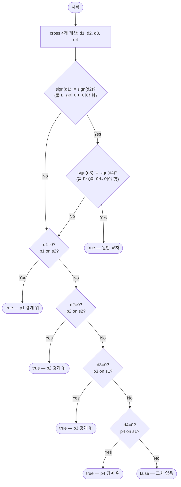

import { AlgorithmSimulation } from "#guide-sim";

# segmentsIntersect — 교점을 몰라도 "어느 쪽"만 알면 교차를 판별할 수 있는 이유

## 한눈에 보는 컨셉

두 선분이 교차하는지 알고 싶을 때, 실제 교점 좌표까지 구할 필요는 없어요. 각 선분의 두 끝점이 상대 선분을 지나는 직선을 기준으로 서로 반대편에 있는지만 보면 되고, 이 "어느 쪽인가"는 외적(cross product)의 부호 하나로 결정됩니다. 입력이 선분 2개로 고정돼 있으니 목표는 처음부터 `O(1)`이고, 진짜 승부는 속도가 아니라 좌표가 `10^9`까지 커져도 부호 판정이 정확한가— 즉 수치적 정확도예요.

## 출발점: 가장 순진한 방법부터

문제를 먼저 정확히 잡을게요.

```ts
type Point = [number, number];
type Segment = [Point, Point];

function segmentsIntersect(s1: Segment, s2: Segment): boolean
```

- `s1 = [p1, p2]`, `s2 = [p3, p4]` — 각각 두 끝점으로 정의된 선분.
- 좌표 범위: $-10^9 \leq x, y \leq 10^9$ (정수). 선분은 길이가 0인 점(`p1 = p2`)도 유효합니다.
- 반환값: 두 선분이 한 점이라도 공유하면 `true`, 완전히 분리되어 있으면 `false`. X자·T자·끝점 접촉·공선 겹침 모두 "공유"로 봅니다.

입력 선분이 딱 2개뿐이라 이 문제는 규모가 늘어나는 걱정이 없어요. 목표 복잡도는 애초부터 `O(1)`로 정해져 있습니다. 그렇다면 무엇을 최적화해야 할까요? 여기서는 **정확성**이 그 자리를 대신 차지합니다 — 좌표가 `10^9`까지 커지는 극단값에서도 판정이 틀리지 않아야 해요.

가장 직관적인 풀이는 두 선분을 매개변수 직선 방정식으로 세우고 연립하는 겁니다.

$$s_1: P = p_1 + t(p_2 - p_1), \quad s_2: P = p_3 + u(p_4 - p_3), \qquad 0 \leq t, u \leq 1$$

```text
교점을 실제로 구해서 그 자리가 두 선분 안인지 본다는 발상

   s1 위의 점:  t = 0 이면 p1,  t = 1 이면 p2,  그 사이면 선분 안
   s2 위의 점:  u = 0 이면 p3,  u = 1 이면 p4

   두 식을 같다고 놓고 t, u 를 푼다  →  둘 다 [0,1] 안이면 교차
                          ─────────
                          여기에 나눗셈이 들어간다
```

그대로 코드로 옮기면 이렇습니다.

```ts
function segmentsIntersectNaive(s1: Segment, s2: Segment): boolean {
  const [p1, p2] = s1;
  const [p3, p4] = s2;
  const rX = p2[0] - p1[0], rY = p2[1] - p1[1];
  const sX = p4[0] - p3[0], sY = p4[1] - p3[1];
  const denom = rX * sY - rY * sX;

  if (denom === 0) {
    // 평행(또는 공선) — naive 버전은 이 갈래를 제대로 못 채운다
    return false;
  }

  const t = ((p3[0] - p1[0]) * sY - (p3[1] - p1[1]) * sX) / denom;
  const u = ((p3[0] - p1[0]) * rY - (p3[1] - p1[1]) * rX) / denom;

  return t >= 0 && t <= 1 && u >= 0 && u <= 1;
}
```

왜 이게 막히는가를 구체적인 입력으로 확인해 봅시다. $s_1 = (0,0)$-$(3,0)$, $s_2 = (2,0)$-$(5,0)$은 같은 직선 $y=0$ 위에서 $[2,3]$ 구간을 공유하니 정답은 `true`여야 합니다.

```text
s1 = (0,0)-(3,0), s2 = (2,0)-(5,0)   같은 직선 위, [2,3] 구간을 공유 → 정답은 true

denom = rX*sY - rY*sX = (3-0)*(0-0) - (0-0)*(5-2) = 0   → "평행"으로 오판
segmentsIntersectNaive(s1, s2) → false                   ✗ 오답 (실측 확인됨)
```

`denom === 0`일 때 "평행이니까 안 만난다"고 넘겨버렸는데, 이건 틀렸습니다. 두 선분이 같은 직선 위에서 겹치는 경우도 `denom = 0`이거든요. `denom != 0`인 정상 갈래에서도 `t`, `u`가 부동소수라서, 경계값(`t`가 정확히 0 또는 1이어야 하는 순간) 근처에서 반올림 오차가 낄 여지가 남습니다.

폭발 지점은 "공선이면서 겹침" 케이스와 "부동소수 나눗셈"입니다.

### "그럼 epsilon 을 두면 되지 않나" — 경쟁 설계를 세워 본다

부동소수가 문제라면 **오차 허용치(epsilon)를 두고 비교하는 것**이 가장 먼저 떠오르는 처방입니다. 실제로 기하 코드에서 흔히 쓰는 방식이고, 교점을 구하지 않고 외적만 쓰는 개선까지 얹으면 꽤 그럴듯해 보여요.

```ts
const EPS = 1e-9;
function crossNumber(a: Point, b: Point, c: Point): number {
  return (b[0] - a[0]) * (c[1] - a[1]) - (b[1] - a[1]) * (c[0] - a[0]);
}
function signEps(x: number): -1 | 0 | 1 {
  return Math.abs(x) < EPS ? 0 : x > 0 ? 1 : -1;   // 작으면 0(공선)으로 본다
}
```

나눗셈은 사라졌습니다. **그런데 같은 입력에서 정수 외적과 부호가 갈립니다.**

```text
s1 = (0,0)-(999999000, 999999041),  점 C = (48780439, 48780441)

   정수 외적(BigInt) :  cross = 1     → sign = +1   C 는 직선 밖
   number + eps      :  cross = 0     → sign =  0   "공선" 으로 오판

   무작위 20,000 건에서 두 방식의 부호가 갈린 횟수:  551 건 (2.8%)
```

**epsilon 을 키우거나 줄여서 고칠 수 없습니다.** 참값이 `1`인데 `number` 곱셈 단계에서 이미 `0`이 나와 버렸기 때문이에요 — 비교 시점에 손댈 값 자체가 소실된 상태입니다. `10^9` 짜리 좌표를 곱하면 $10^{18}$ 규모가 되는데 IEEE 754 배정밀도의 안전 정수 한계는 $2^{53} \approx 9 \times 10^{15}$ 입니다.

즉 고칠 자리는 **비교**가 아니라 **곱셈**입니다. 나눗셈을 걷어내는 것만으로는 부족하고, 곱셈 자체를 오차 없는 세계로 옮겨야 해요. 이것이 다음 절의 출발 단서입니다.

## 아이디어 자세히 들여다보기

### 방향을 재는 잣대 — 외적과 CCW 판정

핵심 관찰은 이겁니다. **두 선분이 교차하려면, 각 선분의 두 끝점이 상대 선분을 포함하는 직선을 기준으로 서로 반대편에 있어야 한다.**

```text
s2 의 직선을 잣대로 놓고 s1 의 두 끝점이 어느 쪽인지 본다

   교차한다                      교차하지 않는다
        p1 ●                          p1 ●  p2 ●     ← 둘 다 같은 쪽
   ─────╲──────  s2 직선        ────────────────  s2 직선
          ╲ p2 ●                       (반대편이 없다)
     서로 반대편

   "어느 쪽인가" 만 알면 되고, 교점 좌표는 몰라도 된다
```

"어느 쪽인가"는 나눗셈 없이 외적의 부호만으로 알 수 있어요. 세 점 $a, b, c$에 대해 방향 함수를 이렇게 정의합니다.

$$\mathrm{cross}(a, b, c) = (b_x - a_x)(c_y - a_y) - (b_y - a_y)(c_x - a_x)$$

- $> 0$: $a \to b \to c$가 반시계(좌회전). $c$는 직선 $ab$의 왼쪽.
- $= 0$: 세 점이 공선. $c$는 직선 $ab$ 위.
- $< 0$: 시계(우회전). $c$는 직선 $ab$의 오른쪽.

정의를 세웠으니 바로 손으로 한 번 돌려 보죠. $a=(0,0), b=(2,0)$으로 잣대를 고정하고 $c$만 위·아래·선 위로 옮겨 봅니다.

```text
a = (0,0)  b = (2,0)          cross = (2-0)(cy-0) - (0-0)(cx-0) = 2·cy

   c = (1, 1)  위쪽  →  2·1  =  2  > 0   반시계, 왼쪽
   c = (1, 0)  선 위  →  2·0  =  0        공선
   c = (1,-1)  아래쪽 →  2·(-1) = -2 < 0  시계, 오른쪽

   cx 는 결과에 아예 안 들어왔다 — 잣대가 수평이면 높이만이 방향을 정한다
```

왜 하필 이 형태여야 할까요? 이 식은 사실 **삼각형 $abc$의 부호 있는 넓이의 2배**입니다($\mathrm{cross}(a,b,c) = 2 \cdot \text{signedArea}(a,b,c)$). 넓이의 부호가 곧 회전 방향이므로, 나눗셈이나 각도 계산 없이 정수 곱셈·뺄셈만으로 "어느 쪽"이 정해집니다.

작은 예로 직접 확인해 볼게요. $p_1=(0,0), p_2=(4,4)$인 선분과 $p_3=(0,4), p_4=(4,0)$인 선분(대각선 X자 모양)을 봅시다.

```text
y
4 | p3•        •p2
  |    \      /
  |     \    /
2 |      \  /   (중심 (2,2) 부근에서 교차)
  |      /  \
  |     /    \
0 | p1•        •p4
  +------------------ x
    0    2    4
```

`s2`의 직선을 잣대로 삼아 `p1`·`p2`가 각각 어느 쪽인지 재 봅니다.

```text
d1 = cross(p3,p4,p1) = (4-0)(0-4) - (0-4)(0-0) = -16 - 0   = -16   → 오른쪽
d2 = cross(p3,p4,p2) = (4-0)(4-4) - (0-4)(4-0) =   0 + 16  =  16   → 왼쪽
                                                             ─────
                              부호가 다르다 → p1, p2 는 s2 직선의 반대편
```

**잠깐, 확인 하나만 해 볼까요?** $p_1=(1,1), p_2=(5,5), p_3=(1,5), p_4=(5,1)$처럼 도형 전체를 $(1,1)$만큼 옮기면 $\mathrm{cross}(p_3,p_4,p_1)$의 부호가 바뀔까요?

```text
평행이동 후:  (5-1)(1-5) - (1-5)(1-1) = -16 - 0 = -16   ← 그대로 음수

좌표는 전부 달라졌는데 값이 같다 — 이 식이 재는 것은 절대 좌표가 아니라 상대 위치다
```

같은 잣대를 반대 방향으로도 댑니다. 이번엔 `s1`의 직선에서 `p3`·`p4`를 봅니다.

```text
d3 = cross(p1,p2,p3) =  16   → 왼쪽
d4 = cross(p1,p2,p4) = -16   → 오른쪽
                       ─────
     역시 부호가 다르다 → p3, p4 도 s1 직선의 반대편

   양쪽이 서로를 반대편에서 걸치고 있다 ⟹ 두 선분은 가로질러 교차한다
```

식으로 쓰면 이렇습니다.

$$d_1 \cdot d_2 < 0 \;\land\; d_3 \cdot d_4 < 0 \implies \text{일반 위치 교차}$$

공선인 경우(외적 $=0$)는 방향만으로 답이 안 나옵니다. 그때는 그 값을 0으로 만든 끝점이 상대 선분의 bounding box 안에 있는지로 대신 판별하고, 넷 중 하나라도 성립하면 공유점이 있는 것이에요.

```text
주의: onSegment 는 공선 여부를 검사하지 않는다.

   d_i === 0 으로 공선이 확인된 뒤에만 호출되는 2차 보조 판정이고,
   "그 점이 상대 선분의 사각형 범위 안인가" 만 본다.
   순서를 뒤집어 onSegment 부터 보면 직선 밖의 점도 통과해 버린다.
```

$$\mathrm{onSegment}(a, b, p) \iff \min(a_x,b_x) \leq p_x \leq \max(a_x,b_x) \;\land\; \min(a_y,b_y) \leq p_y \leq \max(a_y,b_y)$$

### 단서를 설명해주는 이론 — 방향 판정(Orientation Predicate)

방금 쓴 $\mathrm{cross}(a,b,c)$의 부호 판정은 "이 문제만의 트릭"이 아니라 계산기하학 전체를 떠받치는 표준 primitive예요. **방향 판정(orientation predicate)** 또는 CCW 판정이라고 부릅니다.

```text
입력: 점 셋 (a, b, c)          출력: 셋 중 하나

   반시계(+1)      일직선(0)       시계(-1)
      c                              a───b
      ↑             a──b──c             ╲
   a──→b                                 c

   각도도 넓이도 나눗셈도 없이, 정수 곱셈 2번과 뺄셈 1번으로 끝난다
```

이 판정 하나가 다음과 같은 훨씬 큰 알고리즘들의 최소 단위로 재사용됩니다.

- **볼록 껍질(convex hull)의 Graham scan**: 스택에 쌓인 마지막 두 점과 다음 후보점이 좌회전인지 우회전인지로 "꺾어야 하는가"를 결정합니다.
- **점이 다각형 안에 있는가(point-in-polygon)**: 각 변에 대해 점이 어느 쪽인지를 누적해 안/밖을 가릅니다.
- **Bentley-Ottmann 스윕라인**: 수많은 선분 쌍의 교차를 찾을 때, 두 선분이 교차하는지 자체를 지금 우리가 쓰는 것과 똑같은 CCW 판정으로 검사합니다.

즉 지금 배우는 "외적 부호로 어느 쪽인지 판별하기"는 **선분 교차라는 국소 문제를 넘어, 계산기하학에서 각도·넓이·나눗셈을 피하고 순수 정수 연산으로 기하 판정을 내리는 표준 전략**이에요. 뒤에서 코드를 다듬을 때 이 판정을 "완전히 정수답게" 만드는 게 왜 중요한지 다시 소환할 테니 기억해 두세요.

### 왜 모순 없이 작동하는가

**불변식**: 두 선분이 만나는 자리는 항상 다음 두 상태 중 하나입니다 — (1) 일반 위치에서 서로의 직선을 가로지르거나, (2) 어느 한쪽 끝점이 상대 선분을 포함하는 직선 위에 놓이는 경계 접촉이거나(양쪽이 완전히 공선이면서 구간이 겹치는 경우도 이 범주에 포함됩니다). 이 둘 이외의 "교차 방식"은 존재하지 않습니다.

**기저**: 선분 하나가 점으로 퇴화한 경우($p_1 = p_2$)를 봅시다. 이때 $d_3 = \mathrm{cross}(p_1,p_2,p_3)$와 $d_4$는 $p_1=p_2$이므로 방향 벡터 $(p_2-p_1)$이 영벡터가 되어 항상 $0$입니다. 자동으로 공선 분기로 들어가고, `onSegment`가 "그 점이 상대 선분 범위 안에 있는가"를 정확히 검사합니다. 가장 작은 경우에서부터 올바르게 처리됩니다.

**귀납 단계**: 일반 위치(모든 $d_i \neq 0$)와 경계 접촉($d_i = 0$인 항이 하나라도 있음 — T자 접촉처럼 네 점 전체가 공선이 아니어도 성립할 수 있습니다)은 서로 배타적이고 합쳐서 전체 경우를 남김없이 덮습니다(경우의 완전성). 일반 위치에서는 $d_1 \cdot d_2 < 0 \land d_3 \cdot d_4 < 0$이 정확히 "두 선분이 서로를 가로지름"과 동치입니다 — 두 직선이 평행하지 않는 한(조건이 성립한 이상 평행일 수 없습니다. 평행한 두 직선 위의 점들은 항상 상대 직선의 같은 쪽에 있어 부호가 갈리지 않으니까요) 두 직선은 유일한 교점 하나를 가집니다. $p_1, p_2$가 직선 $p_3p_4$의 반대편에 있다는 것은 그 유일한 교점이 $s_1$ 구간 $[p_1, p_2]$ 안에 있다는 뜻이고, 동시에 $p_3, p_4$가 직선 $p_1p_2$의 반대편에 있다는 것은 같은 교점이 $s_2$ 구간 안에도 있다는 뜻입니다 — 하나뿐인 교점에 대해 두 조건이 동시에 성립하므로, 그 교점은 두 선분 모두의 구간 안에 놓입니다(각 경우의 정확성). 경계 접촉인 경우는 방향 정보가 없으므로 대신 bounding box로 "겹치는 구간이 있는가"를 직접 검사하며, 이는 1차원으로 축소된 문제라 각 좌표축의 min/max 비교만으로 완전합니다.

여기서 **헷갈리기 쉬운 포인트**가 둘 있습니다.

**포인트 1 — 조건 하나만으로는 부족합니다.** "$d_1, d_2$ 부호가 다르면 교차"라고 생각하기 쉬운데, 이것만으로는 두 직선이 만난다는 것만 보장할 뿐, 그 교차점이 상대 선분의 범위 안에 있다는 보장은 없습니다. 구체적으로 확인해 봅시다.

```text
s1 = (0,0)-(10,10),  s2 = (5,0)-(5,4)

d1 = cross(p3,p4,p1) =  20   ┐
d2 = cross(p3,p4,p2) = -20   ┘ 부호 다름 → s1의 두 끝점은 직선 x=5의 반대편  (조건 1 성립)

d3 = cross(p1,p2,p3) = -50   ┐
d4 = cross(p1,p2,p4) = -10   ┘ 부호 같음 → s2의 두 끝점이 모두 직선 y=x 아래쪽 (조건 2 불성립)

s1의 직선(y=x)이 x=5에서 만나는 지점은 y=5인데, s2는 y=0..4까지만 뻗어 있어 닿지 못한다
→ 조건 1만 보고 true라 답하면 오답. 반드시 조건 1 AND 조건 2 둘 다 확인해야 한다.
```

**포인트 2 — "정수 연산이라 오차가 없다"는 말은 좌표 범위를 넘으면 깨집니다.** 앞 절에서 "외적은 순수 정수 연산이라 오차가 없다"고 했는데, 이건 그 정수 연산이 JavaScript의 **안전 정수 범위**($2^{53} \approx 9.007 \times 10^{15}$) 안에서 이뤄질 때만 참입니다. 이 문제의 좌표는 $\pm 10^9$까지 갈 수 있고, $\mathrm{cross}$의 각 곱셈 항은 $(2\times10^9)\times(2\times10^9) = 4\times10^{18}$까지 커질 수 있어요 — 안전 정수 범위를 가뿐히 넘습니다. 실제로 좌표 $\pm10^9$ 범위에서 고정 시드로 뽑은(재현 가능한) 무작위 삼각형 2만 개를 일반 숫자(`number`)로 계산한 외적과 참값(`BigInt`로 계산)을 대조해 보면 **19,331개(약 96.7%)에서 값 자체가 어긋났고, 최대 오차는 566**이었습니다(실측, `bun`으로 재실행해도 항상 같은 수치가 나옵니다). 다만 이 2만 개 표본에서는 부호까지 뒤집힌 경우는 한 건도 없었습니다 — 값이 어긋나는 것과 부호가 뒤집히는 것은 다른 문제이고, 이 표본은 전자만 광범위하게 보여줍니다. 그런데 참값이 0에 아주 가까운(사실상 공선에 가까운) 배치에서는 이야기가 달라집니다 — 바로 다음 코드 절에서 참값이 정확히 `1`인데 `number`가 이를 `0`으로 뭉개 "공선"으로 오판하는 실제 사례를 보여드릴게요. 무작위 표본에는 거의 걸리지 않지만 실전에서는 반드시 대비해야 하는 함정입니다.

엣지 케이스를 불변식 위에서 점검해 보면:

```text
점으로 퇴화(p1=p2), 상대 선분 위     → onSegment 경로로 true       (검증됨)
점으로 퇴화(p1=p2), 상대 선분 밖     → onSegment 경로로 false      (검증됨)
양쪽 다 점으로 퇴화, 같은 점        → 모든 d_i=0, onSegment(점=점)=true → true (검증됨)
양쪽 다 점으로 퇴화, 다른 점        → 모든 d_i=0, onSegment(점≠점)=false → false (검증됨)
완전 동일 선분                       → 양끝 모두 onSegment → true  (검증됨)
평행하지만 떨어진 두 선분            → 모든 d_i=0, onSegment 전부 false → false (검증됨)
끝점끼리만 닿음(T자/L자)             → 닿는 점의 d_i=0, onSegment=true → true (검증됨)
```

## 아이디어를 코드로 옮기기

관찰을 그대로 옮기면 이런 모습이 됩니다. 아직은 `number`만 씁니다.

```ts
function crossNumber(a: Point, b: Point, c: Point): number {
  return (b[0] - a[0]) * (c[1] - a[1]) - (b[1] - a[1]) * (c[0] - a[0]);
}

function onSegment(a: Point, b: Point, p: Point): boolean {
  return (
    Math.min(a[0], b[0]) <= p[0] && p[0] <= Math.max(a[0], b[0]) &&
    Math.min(a[1], b[1]) <= p[1] && p[1] <= Math.max(a[1], b[1])
  );
}

function sign(x: number): -1 | 0 | 1 {
  return x > 0 ? 1 : x < 0 ? -1 : 0;
}

function segmentsIntersectV2(s1: Segment, s2: Segment): boolean {
  const [p1, p2] = s1;
  const [p3, p4] = s2;
  const d1 = crossNumber(p3, p4, p1);
  const d2 = crossNumber(p3, p4, p2);
  const d3 = crossNumber(p1, p2, p3);
  const d4 = crossNumber(p1, p2, p4);

  const sd1 = sign(d1), sd2 = sign(d2), sd3 = sign(d3), sd4 = sign(d4);
  if (sd1 !== 0 && sd2 !== 0 && sd1 !== sd2 && sd3 !== 0 && sd4 !== 0 && sd3 !== sd4) {
    return true;
  }

  if (d1 === 0 && onSegment(p3, p4, p1)) return true;
  if (d2 === 0 && onSegment(p3, p4, p2)) return true;
  if (d3 === 0 && onSegment(p1, p2, p3)) return true;
  if (d4 === 0 && onSegment(p1, p2, p4)) return true;
  return false;
}
```

여기서 **가장 중요한 줄은 `sd1 !== sd2`처럼 부호만 따로 비교하는 부분입니다.** `d1 * d2 < 0`으로 직접 곱해서 비교하고 싶은 유혹이 드는데, `d1`과 `d2`가 둘 다 0이 아닌 한 이 비교는(곱셈의 부호는 두 부호를 곱한 것과 같으므로) 사실 `sign(d1) !== sign(d2)`와 같은 답을 냅니다 — 곱셈 단계가 부호를 새로 왜곡시키지는 않아요(다만 `d1`이나 `d2`가 정확히 0이면 두 방식이 갈립니다 — `0 * d2 < 0`은 항상 거짓이지만 `sign(0) !== sign(d2)`는 `d2 ≠ 0`이면 참이 되거든요. 그래서 `sd1 !== 0 && sd2 !== 0` 가드로 0을 먼저 걸러내는 겁니다). `sign()`을 따로 쓰는 또 다른 이유는 불필요하게 큰 중간값(`d1 * d2`)을 만들지 않는 것입니다.

**진짜 문제는 부호 비교 방식이 아니라, `crossNumber` 자체가 돌려주는 값이 이미 틀릴 수 있다는 데 있습니다.** 앞 절에서 실측한 대로, 좌표가 $\pm10^9$에 가까우면 `crossNumber`가 반환하는 값 자체가 참값과 어긋날 수 있어요. 아주 구체적인 사례로 확인해 봅시다.

```text
s1 = (0,0)-(999999000,999999041)
점 C = (48780439, 48780441)

참값(BigInt로 계산):  cross(p1,p2,C) = 1        → C는 s1의 직선 위가 아니다 (아주 살짝 벗어남)
number로 계산:        crossNumber(p1,p2,C) = 0  → "공선"으로 오판!

segmentsIntersectV2(s1, [C, C])  →  true   (오답: onSegment 분기를 잘못 타서 true)
참값 기준 정답                    →  false  (C는 s1 위에 있지 않으므로 점 C와 s1은 교차하지 않는다)
```

`number`로는 도저히 못 피하는 오차입니다. `sign()` 트릭은 "부호 비교 곱셈"의 오버플로우만 막을 뿐, `cross` 계산 자체의 정밀도 손실은 막지 못해요. 이 문제를 근본적으로 없애려면 `cross`의 계산 자체를 임의 정밀도 정수로 승격해야 합니다. TypeScript/JavaScript에서는 `BigInt`가 그 역할을 합니다.

```ts
function cross(a: Point, b: Point, c: Point): bigint {
  const [ax, ay] = [BigInt(a[0]), BigInt(a[1])];
  const [bx, by] = [BigInt(b[0]), BigInt(b[1])];
  const [cx, cy] = [BigInt(c[0]), BigInt(c[1])];
  return (bx - ax) * (cy - ay) - (by - ay) * (cx - ax);
}

function segmentsIntersect(s1: Segment, s2: Segment): boolean {
  const [p1, p2] = s1;
  const [p3, p4] = s2;
  const d1 = cross(p3, p4, p1);
  const d2 = cross(p3, p4, p2);
  const d3 = cross(p1, p2, p3);
  const d4 = cross(p1, p2, p4);

  if (                                                    // ① 일반 교차 — 네 값이 전부 0이 아니고 양쪽 부호가 갈린다
    d1 !== 0n && d2 !== 0n && (d1 > 0n) !== (d2 > 0n) &&
    d3 !== 0n && d4 !== 0n && (d3 > 0n) !== (d4 > 0n)
  ) {
    return true;
  }

  if (d1 === 0n && onSegment(p3, p4, p1)) return true;    // ② p1이 s2 위
  if (d2 === 0n && onSegment(p3, p4, p2)) return true;    // ③ p2가 s2 위
  if (d3 === 0n && onSegment(p1, p2, p3)) return true;    // ④ p3가 s1 위
  if (d4 === 0n && onSegment(p1, p2, p4)) return true;    // ⑤ p4가 s1 위
  return false;                                           // ⑥ 어느 쪽도 아니다
}
```

`onSegment`은 그대로 재사용합니다 — 좌표 자체(최대 $10^9$)는 안전 정수 범위 안이라 `Math.min`/`Math.max` 비교에는 오차가 없어요(이건 이 문제의 좌표가 정수라는 전제가 있어야 성립하는 얘기입니다 — 좌표가 실수라면 곱셈 없는 비교도 안전을 다시 따져봐야 해요). 정밀도가 필요한 곳은 **곱셈이 들어가는 `cross`뿐**입니다. `BigInt`는 자릿수 제한 없이 정확한 정수 연산을 하므로, `d1 > 0n`처럼 직접 비교해도 `sign()` 같은 별도 안전장치가 필요 없어졌다는 점도 눈여겨보세요 — 애초에 오버플로우가 불가능하기 때문입니다.

**가장 실수가 잦은 지점은 ②③④⑤에서 `onSegment` 검사를 빼먹는 것입니다.** `d1 === 0n`이면 이미 공선이니 교차 아니냐고 생각하기 쉬운데, **공선은 "같은 직선 위"일 뿐 "선분이 겹친다"가 아닙니다.**

```text
s1 = (0,0)-(2,2),  s2 = (5,5)-(9,9)     둘 다 직선 y = x 위, 선분은 떨어져 있다

   d3 = cross(p1,p2,p3) = 0             → 공선인 것은 맞다
   ④ d3===0n && onSegment(...)          → onSegment 가 false 라 통과 못 함 → 정답 false
   ④ d3===0n 만 보면                     → true  ✗ 떨어진 선분을 교차라고 답한다
```

`onSegment`가 빠지면 **평행하기만 하면 아무리 멀어도 교차**가 됩니다. `d_i === 0n` 은 "이 점이 상대 직선 위"까지만 말하고, "상대 **선분** 위"는 `onSegment`가 말합니다.

`BigInt(a[0])`처럼 좌표 하나하나를 변환하는 순서도 함께 짚어 둘게요. 뺄셈보다 먼저 `BigInt`로 바꿔야 합니다 — `BigInt(b[0] - a[0])`처럼 먼저 `number`로 뺀 다음 변환하면, 뺄셈 자체는 안전하더라도 그다음 곱셈에서 다시 `number` 세계로 새어 나갑니다. 그 결과가 앞 절에서 본 그 오판이에요.

```text
BigInt 곱셈 :  cross(0,0 → 999999000,999999041, C) = 1   → 교차 아님(정답)
number 곱셈 :  같은 입력                            = 0   → 교차(오답)
```

`BigInt`가 공짜는 아니라는 점도 짚고 갈게요. 임의 정밀도 연산은 CPU 네이티브 정수 곱셈이 아니라 소프트웨어로 자릿수를 관리하며 계산하기 때문에, 같은 곱셈이어도 `number`보다 비용이 더 듭니다. 이 문제는 호출 한 번에 곱셈 몇 개만 하면 끝이라 그 비용이 무시할 수준이지만, 이런 판정이 수백만 번 반복 호출되는 상황이라면 좌표 범위를 미리 좁혀 `number`로 충분한지부터 따져 보거나, 좌표가 정수가 아니라 실수라면 오차 한계를 분석해 필요할 때만 정밀도를 끌어올리는 adaptive-precision 기법(예: Shewchuk의 강건한 기하 predicate)을 대안으로 고려할 만합니다.

## 코드를 한 번 끝까지 굴려 보기

`s1 = (0,0)-(4,4)`, `s2 = (0,4)-(4,0)`을 넣고 최종 구현을 굴려 볼게요. 아래 `실행 시각화` 절과 **같은 입력**입니다.

```text
        p3(0,4)          p2(4,4)
            ╲            ╱
             ╲          ╱
              ╲   ✕    ╱          두 선분이 (2,2)에서 X자로 만난다
             ╱ ╲      ╱
            ╱   ╲    ╱
        p1(0,0)      p4(4,0)
```

**T1 — 네 외적을 계산한다.** `d1`·`d2`는 "`s2`의 직선에서 볼 때 `p1`·`p2`가 어느 쪽인가", `d3`·`d4`는 그 반대입니다.

```text
T1   d1 = cross(p3,p4,p1) = (4-0)(0-4) - (0-4)(0-0) = -16 - 0   = -16
     d2 = cross(p3,p4,p2) = (4-0)(4-4) - (0-4)(4-0) =   0 + 16  =  16
     d3 = cross(p1,p2,p3) = (4-0)(4-0) - (4-0)(0-0) =  16 - 0   =  16
     d4 = cross(p1,p2,p4) = (4-0)(0-0) - (4-0)(4-0) =   0 - 16  = -16
```

**T2 — ①의 조건을 하나씩 평가합니다.** 여섯 개가 `&&`로 묶여 있으니 전부 참이어야 들어갑니다.

```text
T2   d1 !== 0n            : -16 ≠ 0   참
     d2 !== 0n            :  16 ≠ 0   참
     (d1>0n) !== (d2>0n)  : false ≠ true   참   ← p1·p2 가 s2 의 반대편
     d3 !== 0n            :  16 ≠ 0   참
     d4 !== 0n            : -16 ≠ 0   참
     (d3>0n) !== (d4>0n)  : true ≠ false   참   ← p3·p4 가 s1 의 반대편
     → 여섯 다 참이므로 ① 로 들어간다
```

**T3 — ①에서 `return true`.** ②③④⑤⑥은 실행되지 않습니다. 앞 절 「왜 모순 없이 작동하는가」의 *"양쪽이 서로를 가로지르면 반드시 만난다"*가 여기서 쓰인 자리예요.

```text
T3   return true          ②~⑥ 은 도달하지 않는다
```

세 단계로 끝났습니다. 그런데 이 입력만으로는 **여섯 갈래 중 ①과 그 안의 `true` 하나만** 밟았어요. 나머지가 언제 열리는지 보려면 입력을 바꿔야 합니다.

**T4~T6 — `d4 = 0`이 되는 입력.** `s1 = (0,0)-(4,0)`, `s2 = (2,3)-(2,0)`으로 바꿉니다. `p4 = (2,0)`이 `s1` 위에 정확히 얹힌 T자 모양이에요.

```text
T4   d1 = -6,  d2 = 6,  d3 = 12,  d4 = 0
T5   ① 평가: d1≠0 참, d2≠0 참, 부호 갈림 참, d3≠0 참, d4≠0 **거짓**
     → d4 가 0 이라 ① 이 막힌다. ② 로 내려간다
T6   ② d1===0n?  -6 ≠ 0 → 거짓, 넘어간다
     ③ d2===0n?   6 ≠ 0 → 거짓, 넘어간다
     ④ d3===0n?  12 ≠ 0 → 거짓, 넘어간다
     ⑤ d4===0n?   0 = 0 → 참, 그리고 onSegment((0,0),(4,0),(2,0)) 도 참
       → return true
```

`d4 = 0`이라는 **같은 값**이 ①을 막고 ⑤를 여는 것을 보세요. 끝점이 상대 선분에 얹히면 "가로지름"은 성립하지 않지만 "닿음"은 성립합니다 — 이 두 경우를 갈라 놓은 것이 ①과 ②~⑤의 분업이에요.

**T7~T8 — `⑥`으로 떨어지는 입력.** `s1 = (0,0)-(1,1)`, `s2 = (2,2)-(3,3)`. 네 점이 전부 같은 직선 위라 외적이 모두 0인데, 선분끼리는 떨어져 있습니다.

```text
T7   d1 = d2 = d3 = d4 = 0
     ① : d1≠0 이 거짓 → 막힘
T8   ② d1===0n 참, 그런데 onSegment((2,2),(3,3),(0,0)) 은 거짓 (0 < 2)
     ③ 참, onSegment((2,2),(3,3),(1,1)) 거짓
     ④ 참, onSegment((0,0),(1,1),(2,2)) 거짓
     ⑤ 참, onSegment((0,0),(1,1),(3,3)) 거짓
     → 전부 통과하지 못하고 ⑥ return false
```

**T9 — ②③④가 열리는 입력.** 위에서 ②③④는 조건이 참이어도 `onSegment`에서 걸렸어요. 실제로 열리려면 겹치는 공선이면 됩니다.

```text
T9   s1=(2,2)-(6,6), s2=(0,0)-(4,4) → d1=0, onSegment((0,0),(4,4),(2,2)) 참 → ② true
     s1=(0,0)-(4,4), s2=(2,2)-(6,6) → d1=0 이지만 onSegment 거짓, d2=0 이고 참 → ③ true
     s1=(0,0)-(4,0), s2=(2,0)-(2,3) → d3=0, onSegment((0,0),(4,0),(2,0)) 참 → ④ true
```

여섯 갈래 ①②③④⑤⑥을 모두 밟았습니다. **공선(외적 0)이라고 해서 교차인 것이 아니라, 공선이면서 `onSegment`까지 참이어야 교차**라는 것이 T8과 T9의 차이예요.

## 실행 시각화

예시 두 선분 `s1 = (0,0)-(4,4)`(p1, p2)와 `s2 = (0,4)-(4,0)`(p3, p4)에 대해 외적 4개로 교차를 판정합니다. 앞 절 T1~T3과 같은 입력입니다. X자로 가운데 (2,2)에서 만나는 형태예요. keyValue 패널은 각 외적 값 `d1..d4`와 부호 판정 결과를 보여줍니다. 이 값들은 좌표가 작아 `BigInt`와 `number` 계산이 정확히 일치하는 구간이라, 위에서 다룬 정밀도 문제와는 무관하게 안전합니다.

실제 반환값은 `true`(일반 위치 교차)이며, 시뮬레이션 마지막 프레임과 일치합니다.

> 대화형 시뮬레이션은 MDX 런타임에서 표시됩니다.

export const steps = [
  {
    title: "입력",
    detail: "s1 = p1(0,0)-p2(4,4), s2 = p3(0,4)-p4(4,0). 외적 4개를 계산한다.",
    entries: [
      { label: "s1", value: "(0,0)-(4,4)" },
      { label: "s2", value: "(0,4)-(4,0)" },
    ],
  },
  {
    title: "d1 = cross(p3, p4, p1)",
    detail: "p1(0,0)이 직선 p3p4 기준 어느 쪽인가. d1 = -16 (오른쪽).",
    entries: [
      { label: "d1", value: -16 },
    ],
  },
  {
    title: "d2 = cross(p3, p4, p2)",
    detail: "p2(4,4)가 직선 p3p4 기준 어느 쪽인가. d2 = 16 (왼쪽).",
    entries: [
      { label: "d1", value: -16 },
      { label: "d2", value: 16 },
    ],
  },
  {
    title: "d1, d2 반대 부호 확인",
    detail: "d1 = -16, d2 = 16 → 부호 다름. p1, p2가 직선 p3p4를 가로지른다.",
    entries: [
      { label: "d1, d2", value: "-16, 16 (반대)" },
      { label: "조건 1", value: "성립" },
    ],
  },
  {
    title: "d3 = cross(p1, p2, p3), d4 = cross(p1, p2, p4)",
    detail: "p3(0,4)와 p4(4,0)가 직선 p1p2 기준 어느 쪽인가. d3 = 16, d4 = -16.",
    entries: [
      { label: "d3", value: 16 },
      { label: "d4", value: -16 },
    ],
  },
  {
    title: "d3, d4 반대 부호 확인",
    detail: "d3 = 16, d4 = -16 → 부호 다름. p3, p4가 직선 p1p2를 가로지른다.",
    entries: [
      { label: "d3, d4", value: "16, -16 (반대)" },
      { label: "조건 2", value: "성립" },
    ],
  },
  {
    title: "완료: 두 조건 모두 성립 → true",
    detail: "sign(d1) != sign(d2) 이고 sign(d3) != sign(d4) 이므로 일반 위치 교차. 반환값 true.",
    entries: [
      { label: "조건 1 and 조건 2", value: "true" },
      { label: "반환값", value: "true (교차)" },
    ],
  },
];

<AlgorithmSimulation view="keyValue" steps={steps} title="CCW 외적 선분 교차 판정" />

## 흐름 한눈에 보기



정리해 볼게요. 입력이 선분 두 개로 고정돼 있어서 이 알고리즘은 애초에 목표했던 `O(1)`을 그대로 달성합니다 — `cross` 호출 4번과 `onSegment` 호출 최대 4번, 전부 상수 개의 곱셈·뺄셈·비교뿐이에요. 그리고 이 문제의 진짜 승부처였던 정밀도는 외적 계산을 `number`에서 `BigInt`로 승격해서 해결했습니다 — 좌표가 $\pm10^9$까지 커져도 중간값이 안전 정수 범위를 넘어설 일이 없으니, 부호 판정이 항상 참값과 일치합니다. 속도(`O(1)`)와 정확성(오차 없는 정수 연산)을 동시에 챙긴 셈이에요.

## 스스로 점검하기

1. `s1 = (0,0)-(3,0)`, `s2 = (2,0)-(5,0)`(공선, 구간 일부 겹침)에 대해 $d_1, d_2, d_3, d_4$를 직접 계산해 보세요. 넷 다 0이 나오는 이유와, 그런데도 `onSegment` 검사로 `true`가 나오는 과정을 짚어 보세요. (힌트: 세 점이 모두 같은 직선 $y=0$ 위에 있으므로 모든 외적이 0입니다. $p_3=(2,0)$가 $s_1=(0,0)$–$(3,0)$의 bounding box 안에 있어 `onSegment(p1,p2,p3)`이 `true`가 됩니다.)
2. "조건 1($d_1, d_2$ 반대 부호)만 확인하고 조건 2는 생략해도 되지 않을까?"라는 생각이 왜 틀렸는지, 본문의 `s1=(0,0)-(10,10)`, `s2=(5,0)-(5,4)` 예시를 이용해 $d_3, d_4$ 값과 함께 설명해 보세요.
3. 이 알고리즘을 그대로 3차원 공간의 두 선분에 적용할 수 있을까요? (힌트: 2차원에서는 "직선 하나가 평면을 두 쪽으로 나눈다"는 사실이 핵심이었는데, 3차원에서 직선 하나는 공간을 두 쪽으로 나누지 못합니다 — 같은 틀이 그대로 통하지 않는 이유를 생각해 보세요.)
