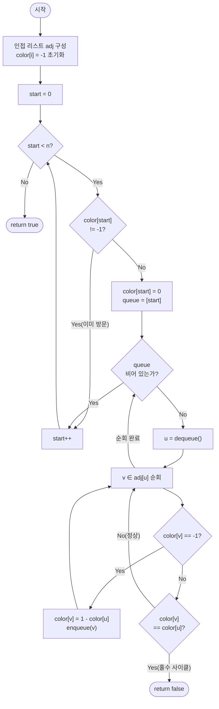

import { AlgorithmSimulation } from "#guide-sim";

# isBipartite — 그래프를 두 색으로 칠할 수 있으면 사이클을 몰라도 답이 나오는 이유

## 한눈에 보는 컨셉

무방향 그래프의 정점을 색 0과 색 1로 번갈아 칠할 수 있으면 그 그래프는 이분 그래프예요. BFS로 출발 정점에서 레이어를 따라가며 색을 자동으로 배정하면, 인접한 두 정점이 같은 색이 되는 순간이 곧 홀수 사이클이 존재한다는 증거가 됩니다. 이 관찰 덕분에 사이클을 일일이 찾아 길이를 재지 않고도 `O(V + E)`에 이분 여부를 판정할 수 있어요.

## 출발점: 가장 순진한 방법부터

문제를 정확히 잡고 갈게요.

```ts
function isBipartite(n: number, edges: [number, number][]): boolean
```

| 매개변수 | 의미 | 제약 |
|----------|------|------|
| `n` | 정점 개수 $V$ (번호: $0 \ldots n-1$) | $1 \leq n \leq 10^5$ |
| `edges` | 무방향 간선 `[u, v]` 목록 | $0 \leq E \leq 2 \times 10^5$ |
| 반환값 | 이분 그래프이면 `true`, 아니면 `false` | 비연결 그래프는 모든 컴포넌트가 이분이어야 `true` |

이분 그래프는 "정점을 두 그룹 $A$, $B$로 나눠서 모든 간선이 $A$와 $B$ 사이만 잇도록 만들 수 있는가"를 묻는 문제예요. 가장 정직하게 접근하면, 정점마다 그룹을 0 또는 1로 배정하는 **모든 조합을 다 시도**해 보고, 그중 하나라도 모든 간선을 만족하면 `true`라고 답하면 됩니다.

```ts
function isBipartiteNaive(n: number, edges: [number, number][]): boolean {
  const total = 1 << n; // 정점마다 색 0/1을 고르는 모든 조합 (비트마스크)
  for (let mask = 0; mask < total; mask++) {
    let ok = true;
    for (const [u, v] of edges) {
      const cu = (mask >> u) & 1;
      const cv = (mask >> v) & 1;
      if (cu === cv) { ok = false; break; } // 같은 색이 인접 → 이 배정은 탈락
    }
    if (ok) return true;
  }
  return false;
}
```

`mask`의 $i$번째 비트가 정점 $i$의 색이라고 두면, `mask`를 0부터 $2^n - 1$까지 훑는 것이 "가능한 모든 2-색 배정"을 훑는 것과 같아요. 자기 루프 `[u, u]`도 `cu === cv`가 항상 참이라 자동으로 걸러집니다. 문제는 조합의 개수 자체가 정점 수에 지수적으로 늘어난다는 점입니다.

```text
n(정점)   2^n(색 배정 조합 수)     × E(간선 검사) ≈ 비용
   3              8                   ×3        →       24
  10           1,024                  ×15       →   15,360
  20       1,048,576                  ×40       →  41,943,040
 100    2^100 ≈ 1.27×10^30            ...       →  현실적으로 열거 불가능

n = 10^5이면 2^n은 우주에 존재하는 원자 수보다 많다 → 완전 탐색은 시도조차 못 한다
```

$V = 10^5$, $E = 2 \times 10^5$ 규모에서는 $2^V$가 애초에 계산 가능한 수가 아니에요. 반면 $V + E \leq 3 \times 10^5$는 정점과 간선을 딱 한 번씩만 훑으면 되는 크기입니다. 그래서 목표는 **정점 하나, 간선 하나를 각각 상수 번만 만지는 $O(V + E)$ 방법**을 찾는 것입니다. 모든 색 배정을 나열하는 대신, "하나의 배정을 규칙적으로 만들어 가면서 모순이 생기는 순간만 잡아낸다"는 낌새가 필요해 보이네요.

## 아이디어 자세히 들여다보기

### 인접한 정점은 반대 색 — 상태와 그림

배정을 무작위로 나열하지 않고 **규칙**으로 만들어 봅시다. 시작 정점에 색 0을 주고, 그 이웃은 무조건 색 1, 그 이웃의 이웃은 다시 색 0으로 전파하면 어떨까요? 이렇게 하면 하나의 색 배정만 만들어지지만, 그 배정이 모든 간선을 만족하는지는 전파하는 과정에서 바로바로 확인할 수 있습니다.

상태 변수는 이렇게 둡니다.

$$\text{color}: V \to \{-1, 0, 1\}$$

- $-1$: 아직 방문하지 않은 정점(미착색)
- $0$: 그룹 $A$에 배정
- $1$: 그룹 $B$에 배정

작은 그래프로 직접 칠해 볼게요. `n = 5`, 간선은 `0-1`, `1-2`, `2-0`, `2-3`, `3-4`입니다.

```text
그래프:        0 --- 1
                 \   /
                  \ /
                   2 --- 3 --- 4

색 전파 시도:
  color[0] = 0                         (시작 정점)
  color[1] = 1   0의 이웃 → 반대 색
  color[2] = 1   0의 이웃 → 반대 색
  이제 1과 2를 보면... 간선 1-2가 있는데 color[1] = color[2] = 1  → 충돌!
```

삼각형 `0-1-2` 안에서 0이 1과 2를 모두 반대 색(1)으로 만들었는데, 정작 1과 2끼리도 간선으로 연결돼 있어서 같은 색끼리 부딪힙니다. 이게 바로 "삼각형(홀수 사이클)은 두 색으로 못 칠한다"는 사실이 알고리즘 위에서 드러나는 순간이에요.

여기서 확인 질문 하나. 만약 정점 3에 색 0을 줬다면, 정점 4는 무슨 색이어야 할까요? 간선 `3-4`가 있으니 무조건 반대 색인 1이어야 합니다 — 이렇게 색은 항상 이웃 관계로부터 강제로 결정됩니다.

**왜 하필 `color` 배열(0/1/−1)일까요?** 그룹 $A$, $B$를 각각 `Set<number>`로 담는 방법도 있지만, 그러면 "이 정점이 어느 그룹인지"를 알기 위해 두 Set을 오가며 확인해야 하고 "아직 미배정"이라는 상태를 표현하려면 별도의 방문 배열이 하나 더 필요합니다. `color` 배열은 인덱스로 바로 $O(1)$ 조회가 되면서 `-1`이 "미방문"과 "그룹 미배정"을 동시에 표현해 주므로, 방문 배열과 그룹 배열을 하나로 합친 셈이 됩니다.

### 단서를 설명해 주는 이론 — 이분 그래프의 홀수 사이클 특성화 정리

방금 삼각형에서 본 현상은 우연이 아니라 그래프 이론에서 이미 정리된 사실입니다(쾨니그, 1936년경 정식화).

> **정리.** 무방향 그래프 $G$가 이분 그래프이다 $\iff$ $G$에 길이가 홀수인 사이클이 존재하지 않는다.

**($\Rightarrow$) 이분 그래프면 홀수 사이클이 없다.** $G$가 이분 그래프라면 정점을 $A$, $B$로 나눌 수 있고 모든 간선은 $A$-$B$ 사이만 잇습니다. 사이클 위의 정점을 순서대로 따라가면 $A \to B \to A \to B \to \cdots$처럼 그룹이 매번 바뀌어야 하고, 출발점으로 되돌아오려면 짝수 번 바뀌어야 해요. 그룹이 바뀌는 횟수가 곧 사이클 길이이므로, 사이클 길이는 항상 짝수입니다.

**($\Leftarrow$) 홀수 사이클이 없으면 이분 그래프다.** 이 방향이 바로 우리가 짜려는 알고리즘 그 자체예요. 임의의 정점에서 시작해 색을 0, 1로 교대 전파하면서 이미 착색된 이웃과 충돌하는지만 보면 되고(앞 절에서 한 것), 충돌이 한 번도 없다면 그 색 배정이 곧 $A$, $B$ 분할의 증거가 됩니다. 즉 "충돌 없이 끝까지 칠할 수 있다"는 것과 "홀수 사이클이 없다"는 것은 같은 말이에요.

이 정리 덕분에 우리는 사이클을 열거하는 대신 **색칠이 끝까지 성공하는지**만 확인하면 됩니다 — 뒤에서 다룰 "왜 모순 없이 작동하는가"에서 이 정리의 양방향을 각각 다시 소환할 테니 기억해 두세요.

### 셈을 맡는 자료구조 — 인접 리스트

BFS가 "정점 $u$의 이웃들"을 반복해서 물어보므로, 간선 목록 `edges`를 매번 훑기보다는 `u`에서 바로 이웃 배열을 꺼낼 수 있는 구조가 필요합니다. 이 역할을 인접 리스트가 맡습니다. 이 프로젝트에는 인접 리스트 자체를 다루는 가이드가 따로 있으니, 구축 방식이 궁금하다면 [graphAdjList 가이드](../../../data-structures/graph-repr/graphAdjList/graphAdjList-guide.mdx)를 참고하세요 — 여기서는 "간선 $E$개를 양방향으로 등록하면 이웃 조회가 평균 $O(1)$이 되는 배열의 배열"로만 쓰면 충분합니다.

### 왜 모순 없이 작동하는가

BFS 색칠이 항상 옳은 이분 판정을 낸다는 것을 귀납적으로 보일게요.

**기저.** BFS 시작 정점 `start`에 `color[start] = 0`을 주는 것은 항상 안전합니다. 아직 아무 정점도 색이 없으므로 어떤 색을 줘도 모순이 생길 수 없어요.

**귀납 단계.** 큐에서 정점 $u$를 꺼냈을 때 $u$의 색이 이미 올바르게 확정돼 있다고 가정합니다. $u$의 이웃 $v$는 딱 두 경우뿐입니다(경우의 완전성 — 정점의 색 상태는 미착색 아니면 착색, 세 번째 경우는 없습니다).

- **$v$가 미착색인 경우:** `color[v] = 1 - color[u]`로 반대 색을 주고 큐에 넣습니다. $u$-$v$ 간선은 이제 서로 다른 색을 잇게 되므로 이 간선에 대해서는 조건을 만족합니다.
- **$v$가 이미 착색된 경우:** $v$의 색이 `color[u]`와 다르면(정상) 그대로 지나가고, 같으면(`color[v] == color[u]`) 즉시 `false`를 반환합니다. 같은 색이 인접했다는 것은 앞 절 정리의 ($\Rightarrow$) 방향에 의해 홀수 사이클이 존재한다는 뜻이므로, 이분 그래프일 수 없다는 결론이 정확합니다.

두 경우 모두에서 "이미 색이 정해진 정점들 사이에는 항상 다른 색끼리만 인접한다"는 불변식이 깨지지 않은 채로 유지되므로, BFS가 끝까지(즉 모든 컴포넌트에서 충돌 없이) 진행되면 실제로 정리의 ($\Leftarrow$) 방향이 성립하는 상황이고, `true`를 반환하는 것이 정당합니다.

여기서 **헷갈리기 쉬운 포인트**가 두 가지 있습니다.

- **간선을 한쪽 방향으로만 등록하면 조용히 틀립니다.** 무방향 간선 `[u, v]`를 `adj[u]`에만 넣고 `adj[v]`에는 안 넣으면 어떻게 될까요? 4-사이클(이분 그래프, 정답 `true`) `n = 4`, 간선을 `[[1,0], [1,2], [3,2], [3,0]]`이라는 순서로 등록했다고 해봅시다. 정방향만 저장하면 `adj[0] = []`, `adj[2] = []`가 되어 정점 0과 2는 이웃이 하나도 없는 것처럼 보입니다.

  ```text
  실제 그래프(무방향): 0-1-2-3-0 (4-사이클, 이분 O)

  정방향만 등록:  adj[1]=[0,2], adj[3]=[2,0], adj[0]=[], adj[2]=[]

  BFS 진행:
    start=0: color[0]=0, 처리 → adj[0]이 비어 있어 아무 일도 안 일어남
    start=1: color[1]이 아직 -1이므로 "새 컴포넌트"로 착각해 color[1]=0 부여
             처리 → adj[1]=[0,2] 중 0을 봄 → color[0]=0, color[1]=0 → 같은 색! → false 반환

  실측: 정상 구현(양방향 등록)은 true, 이 버그 버전은 false를 반환한다 (실제 실행 확인됨)
  ```

  진짜 이분 그래프인데 `false`가 나오는 이유는, 0과 1이 실제로는 간선으로 이어져 있는데도 `adj[0]`이 비어 있어서 BFS가 그 연결을 못 보고 1을 "새로운 독립 컴포넌트의 시작점"으로 잘못 취급했기 때문입니다. 무방향 간선은 반드시 `adj[u]`와 `adj[v]` 양쪽에 등록해야 합니다.

- **비연결 그래프에서 정점 0만 탐색하면 다른 컴포넌트의 홀수 사이클을 놓칩니다.** `n = 5`, 간선 `[[0,1], [2,3], [3,4], [4,2]]`를 봅시다. 컴포넌트 `{0,1}`은 간선 하나뿐이라 이분이지만, 컴포넌트 `{2,3,4}`는 삼각형이라 홀수 사이클을 품고 있어 전체 답은 `false`여야 합니다.

  ```text
  BFS를 정점 0에서만 실행하면:
    color[0]=0, color[1]=1로 끝 (컴포넌트 {0,1} 처리 완료)
    정점 2, 3, 4는 한 번도 큐에 들어가지 못함 → color가 계속 -1
    루프가 끝나면 "충돌을 못 봤으니" true를 반환

  실측: 정상 구현(모든 미착색 정점에서 BFS 재시작)은 false, 정점 0만 도는 버그 버전은 true를 반환한다 (실제 실행 확인됨)
  ```

  삼각형 `{2,3,4}`를 아예 방문조차 안 했으니 그 안의 충돌을 볼 기회 자체가 없었던 거예요. `for start in 0..n-1` 형태로 미착색 정점마다 BFS를 다시 시작해야 모든 컴포넌트가 빠짐없이 검사됩니다.

엣지 케이스도 짚고 갈게요.

```text
간선 없음 (E=0)        → 모든 정점이 고립 → 각자 다른 그룹에 넣어도 무방 → true
n = 1                  → 이웃이 없으므로 충돌 불가능 → true
자기 루프 [u, u]       → color[u]와 color[u]는 항상 같음 → 즉시 false
비연결 그래프          → 컴포넌트별 독립 판정, 하나라도 실패하면 전체 false
```

## 아이디어를 코드로 옮기기

```ts
function isBipartite(n: number, edges: [number, number][]): boolean {
  const adj: number[][] = Array.from({ length: n }, () => []);
  for (const [u, v] of edges) {
    adj[u]!.push(v);
    adj[v]!.push(u); // 무방향 간선이므로 양쪽에 등록
  }

  const color = new Array<number>(n).fill(-1);

  for (let start = 0; start < n; start++) {
    if (color[start] !== -1) continue; // 이미 다른 컴포넌트에서 착색됨

    color[start] = 0;
    const queue: number[] = [start];
    let head = 0;

    while (head < queue.length) {
      const u = queue[head++]!;
      for (const v of adj[u]!) {
        if (color[v] === -1) {
          color[v] = 1 - color[u]!; // 미착색 이웃 → 반대 색
          queue.push(v);
        } else if (color[v] === color[u]) {
          return false; // 이미 착색된 이웃이 같은 색 → 홀수 사이클
        }
      }
    }
  }

  return true;
}
```

결정 지점만 짚을게요. `color`의 초기값은 `-1`로 두어 "미방문"을 표현합니다. `for start in 0..n-1` 바깥 루프는 비연결 그래프의 모든 컴포넌트를 빠뜨리지 않기 위한 것이고, `if (color[start] !== -1) continue`는 이미 처리된 컴포넌트를 다시 도는 낭비를 막는 가드입니다. `adj[u].push(v)`와 `adj[v].push(u)`가 반드시 짝을 이뤄야 한다는 것, 그리고 `else if (color[v] === color[u])` 분기가 `if (color[v] === -1)` 분기와 상호 배타적으로 정확히 짝지어져야 한다는 것이 **가장 실수가 잦은 부분**입니다. 바로 앞 절의 두 헷갈리기 쉬운 포인트가 정확히 이 두 줄(양방향 등록, 바깥 `for` 루프)에서 벌어지는 실수예요 — 하나라도 빠뜨리면 위에서 실측한 것처럼 `true`/`false`가 뒤바뀐 채로 조용히 반환됩니다.

> 기억법: "확정된 이웃은 무조건 반대색, 확정 안 된 컴포넌트는 반드시 다시 시작."

이 BFS 착색은 이미 점근적으로 최적입니다. 그래프가 이분인지 판정하려면 모든 간선을 최소 한 번은 확인해야 해요 — 확인하지 않은 간선이 하나라도 있으면 그 간선이 만드는 충돌을 놓칠 수 있기 때문입니다(하한 논증). 따라서 $O(V + E)$ 아래로는 내려갈 수 없고, 이 구현은 정점과 간선을 각각 딱 한 번씩만 처리하므로 그 하한에 정확히 맞닿아 있습니다. DFS로 같은 2-착색을 해도 점근 복잡도는 동일하며, Union-Find로 "이웃끼리는 반드시 다른 집합"이라는 제약을 표현하는 방식도 있지만 시간 복잡도상 이 방법보다 더 빨라지지는 않습니다. 그래서 이 문제에는 별도의 "더 빠르게 만들 단서 찾기" 단계가 없습니다 — 자연스러운 최적화 사다리가 이미 여기서 끝나 있는 셈이에요.

## 실행 시각화

고정 입력은 `n = 5`, `edges = [[0,1], [1,2], [2,0], [2,3], [3,4]]`입니다(위 "인접한 정점은 반대 색" 절에서 손으로 색칠해 본 그래프와 동일해요). graph 패널의 빨간색은 지금 처리 중인 정점(active), 노란색은 큐에 들어가 다음 차례를 기다리는 정점(frontier), 회색은 처리를 마친 정점(visited)입니다. keyValue 패널은 매 순간의 `color` 배열과 큐 상태를 보여줍니다. 실제 반환값은 `false`이며(간선 `1-2`에서 같은 색 충돌), 마지막 프레임에서 그 결과가 그대로 확인됩니다.

> 대화형 시뮬레이션은 MDX 런타임에서 표시됩니다.

export const nodes = [
  { id: 0, label: "0", x: 25, y: 25 },
  { id: 1, label: "1", x: 58, y: 25 },
  { id: 2, label: "2", x: 40, y: 55 },
  { id: 3, label: "3", x: 70, y: 72 },
  { id: 4, label: "4", x: 92, y: 85 },
];

export const edges = [
  { from: 0, to: 1, directed: false },
  { from: 1, to: 2, directed: false },
  { from: 2, to: 0, directed: false },
  { from: 2, to: 3, directed: false },
  { from: 3, to: 4, directed: false },
];

export const steps = [
  {
    title: "초기화",
    detail: "color 모두 -1(미착색). 정점 0부터 BFS 시작.",
    nodes, edges,
    nodeStatus: {},
    nodeValue: { 0: "−", 1: "−", 2: "−", 3: "−", 4: "−" },
    entries: [
      { label: "color", value: "[-, -, -, -, -]" },
      { label: "큐", value: "[]" },
    ],
  },
  {
    title: "0에 색 0 부여",
    detail: "color[0]=0, 큐에 0을 넣는다.",
    nodes, edges,
    nodeStatus: { 0: "frontier" },
    nodeValue: { 0: 0, 1: "−", 2: "−", 3: "−", 4: "−" },
    entries: [
      { label: "color", value: "[0, -, -, -, -]" },
      { label: "큐", value: "[0]" },
    ],
  },
  {
    title: "0 처리 → 1, 2에 색 1",
    detail: "0의 이웃 1, 2는 미착색 → 반대 색 1 부여, 큐에 삽입.",
    nodes, edges,
    nodeStatus: { 0: "active", 1: "frontier", 2: "frontier" },
    nodeValue: { 0: 0, 1: 1, 2: 1, 3: "−", 4: "−" },
    entries: [
      { label: "color", value: "[0, 1, 1, -, -]" },
      { label: "큐", value: "[1, 2]" },
    ],
  },
  {
    title: "1 처리 → 간선 1-2 충돌!",
    detail: "1의 이웃 2는 이미 색 1. color[2]=1 == color[1]=1 → 홀수 사이클, 이분 불가.",
    nodes, edges,
    nodeStatus: { 0: "visited", 1: "active", 2: "frontier" },
    nodeValue: { 0: 0, 1: 1, 2: 1, 3: "−", 4: "−" },
    activeEdge: { from: 1, to: 2 },
    entries: [
      { label: "color", value: "[0, 1, 1, -, -]" },
      { label: "충돌", value: "color[2] == color[1] = 1" },
    ],
  },
  {
    title: "결과: false",
    detail: "같은 색 인접이 발견되어 즉시 false 반환. 삼각형 0-1-2가 홀수 사이클이다.",
    nodes, edges,
    nodeStatus: { 0: "visited", 1: "active", 2: "active" },
    nodeValue: { 0: 0, 1: 1, 2: 1, 3: "−", 4: "−" },
    entries: [
      { label: "반환값", value: "false" },
      { label: "원인", value: "홀수 사이클 0-1-2" },
    ],
  },
];

<AlgorithmSimulation view={["graph", "keyValue"]} steps={steps} title="이분 그래프 판정 (BFS 2-착색)" />

## 흐름 한눈에 보기



## 스스로 점검하기

1. `n = 6`, `edges = [[0,1], [1,2], [2,3], [3,4], [4,5], [5,0]]`(6-사이클)에 대해 BFS 2-착색을 손으로 따라가며 `color[0]`부터 `color[5]`까지 적어 보세요. 이분 그래프인가요? (힌트: 짝수 사이클은 색이 `0,1,0,1,...`로 깔끔하게 한 바퀴 돌아 제자리로 옵니다. 정답: `[0,1,0,1,0,1]`, `true`.)
2. 본문의 "간선을 한쪽 방향으로만 등록" 함정 그래프(`n=4`, 등록 순서 `[[1,0],[1,2],[3,2],[3,0]]`)를 다시 보세요. `adj[0]`이 비어 있는 상태에서 `start` 루프가 1로 넘어갈 때, 큐에 어떤 정점이 들어가고 왜 `color[1] = 0`으로 "새로 시작"하게 되는지 순서대로 짚어 보세요.
3. 만약 정점 몇 개가 이미 특정 그룹으로 확정된 상태(부분 착색)에서 나머지를 이어서 판정해야 한다면, `color` 배열의 초기화 방식과 바깥 `for` 루프를 어떻게 바꿔야 할까요?
