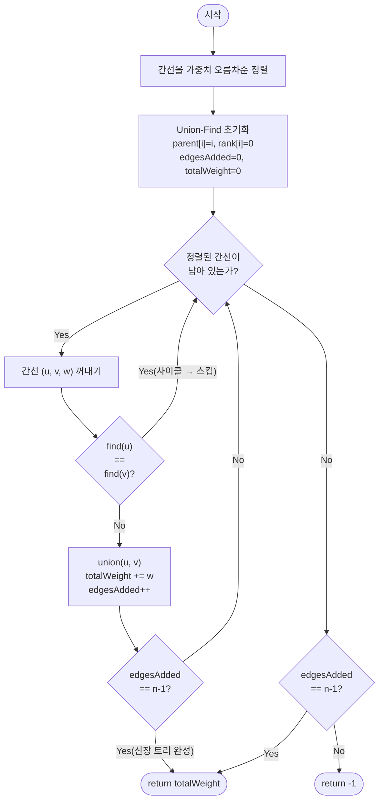

import { AlgorithmSimulation } from "#guide-sim";

# kruskalMst 해설

## 성능 목표 예측

| 항목     | 값                            |
| -------- | ----------------------------- |
| 정점 V   | $1 \leq V \leq 10^5$          |
| 간선 E   | $0 \leq E \leq 2 \times 10^5$ |
| 가중치 w | $0 \leq w \leq 10^9$          |

**naive 접근의 문제점:**
모든 신장 트리(spanning tree)를 열거해 가중치 합이 최소인 것을 찾는 방법을 생각해 볼 수 있다.
신장 트리의 수는 최대 $V^{V-2}$ (Cayley 공식)이므로 $V = 10^5$에서는 계산이 불가능하다.
또는 Prim을 단순 배열로 구현할 경우 $O(V^2) = 10^{10}$ → 시간 초과.

**목표 복잡도:** $O(E \log E)$ 시간, $O(V + E)$ 공간.

**근거:** $E \leq 2 \times 10^5$이면 $E \log E \approx 2 \times 10^5 \times 18 \approx 3.6 \times 10^6$ 연산으로 충분히 빠르다.
간선 정렬이 $O(E \log E)$를 지배하고, Union-Find(경로 압축 + 랭크 병합)의 연산당 비용은
$O(\alpha(V)) \approx O(1)$이므로 전체 Union-Find 비용은 $O(E \cdot \alpha(V)) \approx O(E)$이다.

**공간 복잡도:** 간선 배열 $O(E)$, Union-Find 배열 $O(V)$. 1D 구조만으로 충분하다.

---

## 목표 함수

```ts
kruskalMst(n: number, edges: [number, number, number][]): number
```

| 매개변수 | 의미                                     | 제약                   |
| -------- | ---------------------------------------- | ---------------------- |
| `n`      | 정점 개수 $V$ (인덱스: $0 \ldots n-1$)   | $1 \leq n \leq 10^5$   |
| `edges`  | 무방향 간선 `[u, v, w]` 목록             | $E \leq 2 \times 10^5$ |
| 반환값   | MST 가중치 합; 연결 그래프가 아니면 $-1$ | —                      |

**엣지케이스:**

1. **$n = 1$ (단일 정점):** 신장 트리는 간선 0개. 가중치 합 `0`을 반환한다.
2. **비연결 그래프:** 간선을 모두 처리해도 추가된 간선 수가 $n-1$에 미치지 못하면 `-1`을 반환한다.
3. **가중치 0 포함:** 합이 `0`이어도 유효한 MST일 수 있다. `-1`(비연결)과 혼동하지 말 것.
4. **중복 간선(같은 `[u, v]` 쌍이 여러 개):** 정렬 후 가중치가 작은 것이 먼저 처리되므로 자동으로 최적 선택된다.
5. **최대 입력:** $V = 10^5$, $E = 2 \times 10^5$, $w = 10^9$일 때 총합이 $10^{14}$ 수준이므로 `number` 타입의 부동소수점 정밀도를 주의한다. 필요시 `BigInt` 또는 누적 시 중간 검사를 고려한다.

---

## 핵심 아이디어

**핵심 아이디어**: "가중치가 작은 간선부터 하나씩 보되, 사이클이 생기지 않을 때만 추가한다 — 탐욕 선택이 컷 성질에 의해 항상 최적을 보장한다."

MST를 구하는 가장 직관적인 탐욕 전략은 전체 간선을 가중치 오름차순으로 정렬한 뒤, 각 간선이 이미 같은 컴포넌트에 속한 두 정점을 잇는지(사이클 여부)만 확인해 추가하는 것이다. 컴포넌트 관리는 Union-Find(경로 압축 + 랭크 병합)로 $O(\alpha(V)) \approx O(1)$에 처리된다. $n-1$개의 간선이 모이면 신장 트리가 완성된다.

**풀이 구조**

1. 간선을 가중치 오름차순으로 정렬한다.
2. Union-Find 배열을 초기화한다(`parent[i] = i`, `rank[i] = 0`).
3. 각 간선 $(u, v, w)$에 대해 `find(u) != find(v)`이면 MST에 추가하고 `union(u, v)`.
4. 추가된 간선 수가 $n-1$이 되면 조기 종료한다.
5. 간선 수가 $n-1$에 미치지 못하면 비연결 그래프이므로 `-1`을 반환한다.

**조건**: 무방향 가중치 그래프여야 한다. 연결 그래프이면 MST 가중치 합을, 비연결이면 `-1`을 반환한다.

**대표 예시**: 도시를 최소 비용으로 연결하는 도로망 설계
$n$개의 도시와 도로 건설 비용이 주어졌을 때, 모든 도시를 연결하는 최소 비용 도로 집합을 구하는 문제다. 가장 저렴한 간선부터 사이클 없이 추가하면 자연스럽게 최소 신장 트리가 완성되며, Union-Find 덕분에 $O(E \log E)$로 처리된다.

**언제 쓰나**
"최소 신장 트리(MST)를 구하라" 또는 "모든 정점을 연결하는 최소 비용을 구하라"는 문제에서 사용한다. 간선 수가 많고 정점 수가 적을 때는 Prim 대신 Kruskal이 구현이 단순하고 직관적이다.

### 보완 설명

크루스칼 알고리즘은 최소 신장 트리(MST)를 찾는 그리디 알고리즘입니다. 핵심 아이디어는 간단합니다: 모든 간선을 가중치 오름차순으로 정렬한 뒤, 가벼운 간선부터 하나씩 골라 사이클을 만들지 않으면 채택하는 것을 반복합니다.

여기서 가장 어려운 부분이 "이 간선을 추가하면 사이클이 생기는가?"를 판단하는 것이고, 그걸 해결해주는 자료구조가 바로 **유니온-파인드(Union-Find / Disjoint Set)**입니다. 질문하신 find, union, parent, rank가 전부 여기에 속합니다.

## 네 가지 개념

**parent (부모 배열)**
각 노드가 자기 그룹에서 "누구를 가리키는지" 저장하는 배열입니다. `parent[x]`는 x의 부모 노드를 의미하고, 자기 자신을 가리키면(`parent[x] == x`) 그 노드가 그룹의 대표(루트)입니다. 처음에는 모든 노드가 각자 따로 떨어진 그룹이므로 `parent[i] = i`로 초기화합니다.

**find (찾기)**
어떤 노드가 속한 그룹의 **대표(루트)를 찾는** 연산입니다. parent를 타고 위로 계속 올라가서 자기 자신을 가리키는 루트에 도달하면 그게 답입니다. 두 노드를 find했을 때 같은 루트가 나오면 **이미 같은 그룹**이라는 뜻이고, 간선을 추가하면 사이클이 생깁니다.

```
find(x):
    if parent[x] == x: return x
    parent[x] = find(parent[x])   # 경로 압축
    return parent[x]
```

여기서 `parent[x] = find(...)`가 **경로 압축(path compression)**입니다. 한 번 루트를 찾았으면 가는 길에 있던 노드들을 전부 루트에 직접 연결해서 다음 탐색을 빠르게 만듭니다.

**union (합치기)**
서로 다른 두 그룹을 **하나로 합치는** 연산입니다. 각 노드의 루트를 find로 찾은 뒤, 한 루트를 다른 루트의 자식으로 붙입니다.

**rank (랭크)**
트리의 대략적인 **높이(깊이)**를 저장하는 값입니다. union할 때 무작정 합치면 트리가 한쪽으로 길게 늘어져 find가 느려집니다. 그래서 **랭크가 낮은 트리를 높은 트리 밑에 붙입니다**(union by rank). 이렇게 하면 트리 높이가 잘 안 자라서 find가 빨라집니다. 랭크가 같을 때만 합쳐진 쪽의 랭크가 1 증가합니다.

```
union(a, b):
    ra, rb = find(a), find(b)
    if ra == rb: return False       # 이미 같은 그룹 → 사이클
    if rank[ra] < rank[rb]: ra, rb = rb, ra
    parent[rb] = ra
    if rank[ra] == rank[rb]: rank[ra] += 1
    return True
```

경로 압축과 union by rank를 함께 쓰면 연산당 거의 상수 시간(역아커만 함수)이 됩니다.

핵심을 한 문장으로 정리하면: **find로 "같은 그룹인지" 묻고, 다르면 union으로 합치며, 그 그룹 정보는 parent에 저장되고, rank는 트리가 한쪽으로 길어지지 않게 합치는 방향을 정해줍니다.**

---

### 원형 아이디어와 naive 접근

가장 단순한 접근: 모든 $2^E$개의 간선 부분집합을 탐색해 신장 트리를 이루는 것 중 가중치 합이 최소인 것을 찾는다.

```
naive:
  minWeight = INF
  for each subset S of edges:
    if S forms a spanning tree:
      minWeight = min(minWeight, sum of weights in S)
  return minWeight
```

$E = 2 \times 10^5$이면 $2^E$는 천문학적 수치로 시간/공간 모두 폭발한다.
"신장 트리를 이루는지" 판단에도 $O(V + |S|)$의 DFS/BFS가 필요하다.

**낭비의 정체:** 대부분의 부분집합은 사이클을 포함하거나 연결되지 않아 신장 트리가 아니다.
유효하지 않은 후보들을 모두 검사하는 것이 낭비다.

### 어떤 관찰이 돌파구가 되는가

- **관찰 1 (컷 성질, Cut Property):** 그래프의 임의 컷 $(S, V \setminus S)$에서 그 컷을 건너는 간선 중 가중치가 최소인 간선은 반드시 어떤 MST에 포함된다.
  이 성질은 MST가 "탐욕적으로" 구성될 수 있음을 보장한다.

- **관찰 2:** 가중치가 가장 작은 간선부터 검토하면, 그 간선이 연결하는 두 정점이 아직 같은 컴포넌트에 속하지 않을 때만 추가하면 된다. 이것이 정확히 컷 성질을 모든 간선에 전역 적용한 것이다.

- **관찰 3 (사이클 감지):** 두 끝점이 이미 같은 연결 컴포넌트에 있으면 이 간선을 추가하면 사이클이 생긴다. 컴포넌트 관리를 효율적으로 수행하는 자료구조가 Union-Find이다.

### 관찰을 형식화: 상태/구조 정의

**Union-Find 배열:**

- `parent[v]`: 정점 $v$가 속하는 컴포넌트 트리의 부모. 루트이면 `parent[v] = v`.
- `rank[v]`: 컴포넌트 트리의 높이 상한 (랭크 기반 병합에 사용).

**`find(v)`:** 경로 압축을 적용해 $v$의 루트를 반환한다. 경로 상의 모든 정점이 루트를 직접 가리키도록 갱신해 이후 연산을 빠르게 만든다.

**`union(u, v)`:** 두 루트를 비교해 랭크가 낮은 트리를 높은 트리 아래로 붙인다. 랭크 병합은 트리 높이를 $O(\log V)$ 이하로 유지한다.

이 정의가 두 배열(parent, rank)인 이유: 단순 `parent`만으로는 선형 체인이 형성될 수 있어 `find`가 $O(V)$로 퇴화한다. 랭크까지 관리해야 트리 높이가 대수적으로 제한된다.

### 점화식 또는 핵심 연산

정렬된 간선 배열 $e_1, e_2, \ldots, e_E$ (가중치 오름차순)에 대해:

$$
\text{MST 포함 여부}(e_i = (u, v, w)) =
\begin{cases}
\text{포함} & \text{if } \text{find}(u) \neq \text{find}(v) \\
\text{제외 (사이클)} & \text{if } \text{find}(u) = \text{find}(v)
\end{cases}
$$

누적 가중치:

$$
W_{\text{MST}} = \sum_{\substack{e_i \text{ 포함} \\ i = 1, \ldots, E}} w(e_i)
$$

- `find(u) != find(v)`: $u$와 $v$가 다른 컴포넌트에 있음 → 이 간선이 두 컴포넌트를 잇는 최소 비용 간선임이 보장됨 (이미 가중치 오름차순으로 처리 중이므로).
- 포함 후 `union(u, v)`: 두 컴포넌트를 하나로 합쳐 이후 같은 컴포넌트 내 간선이 다시 선택되지 않도록 한다.

### 정당성 — 왜 이것이 옳은가

**교환 논증(Exchange Argument):** Kruskal이 선택한 간선 집합 $T$가 최적 MST $T^*$와 다르다고 가정한다.
$T$에 있지만 $T^*$에 없는 간선 중 가장 먼저 선택된 간선 $e = (u, v, w)$를 $T^*$에 추가하면 사이클이 생긴다.
그 사이클 위에는 $T^*$에 있지만 $T$에 없는 간선 $e'$이 반드시 존재한다.
$e$는 $e'$보다 먼저 정렬됐으므로 $w(e) \leq w(e')$이다.
$e'$을 $e$로 교체해도 $T^*$는 신장 트리 조건을 유지하고 가중치가 줄어들거나 같아진다.
이를 반복하면 $T$가 $T^*$보다 나쁘지 않음이 증명된다.

**사이클 없음 보장:** `find(u) == find(v)`일 때 간선을 건너뛰므로 사이클이 절대 추가되지 않는다.

**연결성 보장:** 정확히 $n-1$개 간선이 추가되면 $n$개 정점이 트리로 연결된다. 이보다 적으면 비연결 그래프이다.

### 구현 디테일과 최적화

- **조기 종료:** `edgesAdded == n - 1`이 되는 순간 루프를 탈출한다. 남은 간선을 처리할 필요가 없으므로 실제 수행 시간이 단축된다.

- **경로 압축:** `find`에서 재귀적으로 `parent[x] = find(parent[x])`를 적용한다. 이후 같은 정점에 대한 `find` 비용이 사실상 $O(1)$로 줄어든다.

- **랭크 병합:** `rank[rx] < rank[ry]`이면 `rx`를 `ry` 아래로 붙인다. 항상 키가 낮은 트리를 큰 트리 아래로 붙여야 높이 증가를 억제한다. 반대로 붙이면 $O(V)$ 높이가 될 수 있다.

- **함정 — 정렬 없이 탐욕 적용:** 간선을 정렬하지 않으면 더 비싼 간선이 먼저 선택될 수 있어 MST가 아닌 신장 트리를 반환할 수 있다.

- **함정 — union 반환값 무시:** `union(u, v)` 후 별도로 `find`를 다시 호출해 같은지 검사하는 방식은 중복 계산이다. `union`이 성공 여부를 반환하도록 설계하고 그 결과로 분기하는 것이 효율적이다.

---

## 시뮬레이션

예시 그래프 `n = 5`, `edges = [[0,1,1], [0,2,3], [1,2,2], [1,3,4], [2,3,5], [3,4,6]]`에 대해 `kruskalMst`를 실행하는 과정이다. 간선을 가중치 오름차순으로 정렬한 뒤 하나씩 보며, 두 끝점의 루트가 다르면(`find(u) != find(v)`) MST에 채택하고 `union`한다. 그래프에서 빨간 간선은 현재 검토 중인 간선, 회색(visited) 노드/굵은 간선은 MST에 채택된 간선이다. `keyValue` 패널은 정렬된 간선 큐와 parent 배열, 누적 가중치를 보여준다.

실제 반환값은 `13` (채택 간선 `(0,1,1), (1,2,2), (1,3,4), (3,4,6)`, 합 13)이며, 시뮬레이션 마지막 프레임과 일치한다.

> 대화형 시뮬레이션은 MDX 런타임에서 표시됩니다.

export const nodes = [
  { id: 0, label: "0", x: 18, y: 30 },
  { id: 1, label: "1", x: 50, y: 14 },
  { id: 2, label: "2", x: 50, y: 60 },
  { id: 3, label: "3", x: 82, y: 30 },
  { id: 4, label: "4", x: 82, y: 80 },
];

export const edges = [
  { from: 0, to: 1, weight: 1, directed: false },
  { from: 0, to: 2, weight: 3, directed: false },
  { from: 1, to: 2, weight: 2, directed: false },
  { from: 1, to: 3, weight: 4, directed: false },
  { from: 2, to: 3, weight: 5, directed: false },
  { from: 3, to: 4, weight: 6, directed: false },
];

export const steps = [
  {
    title: "초기화",
    detail: "간선을 가중치 오름차순으로 정렬. parent[i]=i, rank=0, totalWeight=0, edgesAdded=0.",
    nodes, edges,
    nodeStatus: {},
    entries: [
      { label: "정렬된 간선", value: "(0,1,1) (1,2,2) (0,2,3) (1,3,4) (2,3,5) (3,4,6)" },
      { label: "parent", value: "[0, 1, 2, 3, 4]" },
      { label: "totalWeight / edgesAdded", value: "0 / 0" },
    ],
  },
  {
    title: "간선 (0,1,w=1) 검토",
    detail: "find(0)=0, find(1)=1 → 다른 컴포넌트. 채택하고 union(0,1).",
    nodes, edges,
    nodeStatus: { 0: "active", 1: "active" },
    activeEdge: { from: 0, to: 1 },
    entries: [
      { label: "find(0) vs find(1)", value: "0 != 1 → 채택" },
      { label: "parent", value: "[1, 1, 2, 3, 4]" },
      { label: "totalWeight / edgesAdded", value: "1 / 1" },
    ],
  },
  {
    title: "(0,1) 채택 완료",
    detail: "컴포넌트 {0,1} 형성. totalWeight=1.",
    nodes, edges,
    nodeStatus: { 0: "visited", 1: "visited" },
    entries: [
      { label: "컴포넌트", value: "{0,1} {2} {3} {4}" },
      { label: "parent", value: "[1, 1, 2, 3, 4]" },
      { label: "totalWeight / edgesAdded", value: "1 / 1" },
    ],
  },
  {
    title: "간선 (1,2,w=2) 검토",
    detail: "find(1)=1, find(2)=2 → 다른 컴포넌트. 채택하고 union(1,2).",
    nodes, edges,
    nodeStatus: { 0: "visited", 1: "active", 2: "active" },
    activeEdge: { from: 1, to: 2 },
    entries: [
      { label: "find(1) vs find(2)", value: "1 != 2 → 채택" },
      { label: "parent", value: "[1, 1, 1, 3, 4]" },
      { label: "totalWeight / edgesAdded", value: "3 / 2" },
    ],
  },
  {
    title: "(1,2) 채택 완료",
    detail: "컴포넌트 {0,1,2} 형성. totalWeight=3.",
    nodes, edges,
    nodeStatus: { 0: "visited", 1: "visited", 2: "visited" },
    entries: [
      { label: "컴포넌트", value: "{0,1,2} {3} {4}" },
      { label: "parent", value: "[1, 1, 1, 3, 4]" },
      { label: "totalWeight / edgesAdded", value: "3 / 2" },
    ],
  },
  {
    title: "간선 (0,2,w=3) 검토 → 사이클",
    detail: "find(0)=1, find(2)=1 → 같은 컴포넌트. 추가하면 사이클이므로 건너뛴다.",
    nodes, edges,
    nodeStatus: { 0: "active", 1: "visited", 2: "active" },
    activeEdge: { from: 0, to: 2 },
    entries: [
      { label: "find(0) vs find(2)", value: "1 == 1 → 스킵(사이클)" },
      { label: "parent", value: "[1, 1, 1, 3, 4]" },
      { label: "totalWeight / edgesAdded", value: "3 / 2" },
    ],
  },
  {
    title: "간선 (1,3,w=4) 검토",
    detail: "find(1)=1, find(3)=3 → 다른 컴포넌트. 채택하고 union(1,3).",
    nodes, edges,
    nodeStatus: { 0: "visited", 1: "active", 2: "visited", 3: "active" },
    activeEdge: { from: 1, to: 3 },
    entries: [
      { label: "find(1) vs find(3)", value: "1 != 3 → 채택" },
      { label: "parent", value: "[1, 1, 1, 1, 4]" },
      { label: "totalWeight / edgesAdded", value: "7 / 3" },
    ],
  },
  {
    title: "(1,3) 채택 완료",
    detail: "컴포넌트 {0,1,2,3} 형성. totalWeight=7.",
    nodes, edges,
    nodeStatus: { 0: "visited", 1: "visited", 2: "visited", 3: "visited" },
    entries: [
      { label: "컴포넌트", value: "{0,1,2,3} {4}" },
      { label: "parent", value: "[1, 1, 1, 1, 4]" },
      { label: "totalWeight / edgesAdded", value: "7 / 3" },
    ],
  },
  {
    title: "간선 (2,3,w=5) 검토 → 사이클",
    detail: "find(2)=1, find(3)=1 → 같은 컴포넌트. 사이클이므로 건너뛴다.",
    nodes, edges,
    nodeStatus: { 0: "visited", 1: "visited", 2: "active", 3: "active" },
    activeEdge: { from: 2, to: 3 },
    entries: [
      { label: "find(2) vs find(3)", value: "1 == 1 → 스킵(사이클)" },
      { label: "parent", value: "[1, 1, 1, 1, 4]" },
      { label: "totalWeight / edgesAdded", value: "7 / 3" },
    ],
  },
  {
    title: "간선 (3,4,w=6) 검토",
    detail: "find(3)=1, find(4)=4 → 다른 컴포넌트. 채택하고 union(3,4).",
    nodes, edges,
    nodeStatus: { 0: "visited", 1: "visited", 2: "visited", 3: "active", 4: "active" },
    activeEdge: { from: 3, to: 4 },
    entries: [
      { label: "find(3) vs find(4)", value: "1 != 4 → 채택" },
      { label: "parent", value: "[1, 1, 1, 1, 1]" },
      { label: "totalWeight / edgesAdded", value: "13 / 4" },
    ],
  },
  {
    title: "조기 종료: edgesAdded == n-1 == 4",
    detail: "신장 트리 완성. 남은 간선을 처리하지 않고 totalWeight=13을 반환한다.",
    nodes, edges,
    nodeStatus: { 0: "visited", 1: "visited", 2: "visited", 3: "visited", 4: "visited" },
    entries: [
      { label: "MST 간선", value: "(0,1,1) (1,2,2) (1,3,4) (3,4,6)" },
      { label: "parent", value: "[1, 1, 1, 1, 1] (단일 컴포넌트)" },
      { label: "반환값", value: "13" },
    ],
  },
];

<AlgorithmSimulation view={["graph", "keyValue"]} steps={steps} title="Kruskal MST: n=5" />

## 수도 코드와 Activity Diagram

### 의사코드

```
function kruskalMst(n, edges):
    // 1. 간선 가중치 오름차순 정렬
    sort edges by w ascending          // 불변식: edges[i].w ≤ edges[i+1].w

    // 2. Union-Find 초기화
    parent[0..n-1] = [0, 1, ..., n-1] // 불변식: parent[i]는 i가 속한 트리의 루트
    rank[0..n-1]   = [0, 0, ..., 0]   // 불변식: rank[i]는 트리 높이 상한

    function find(x):
        if parent[x] != x:
            parent[x] = find(parent[x])   // 경로 압축: 루트를 직접 가리키게 갱신
        return parent[x]

    function union(x, y):
        rx = find(x);  ry = find(y)
        if rx == ry: return false          // 이미 같은 컴포넌트 → 사이클
        if rank[rx] < rank[ry]: swap(rx, ry)
        parent[ry] = rx                    // 낮은 랭크 트리를 높은 랭크 아래로
        if rank[rx] == rank[ry]: rank[rx]++
        return true

    // 3. 탐욕 간선 선택
    totalWeight = 0
    edgesAdded  = 0                        // 불변식: edgesAdded ≤ n-1

    for (u, v, w) in sorted edges:
        if union(u, v):                    // 사이클 없이 추가 가능?
            totalWeight += w               // 불변식: totalWeight는 현재까지 선택된 MST 부분의 합
            edgesAdded  += 1
            if edgesAdded == n - 1: break  // 조기 종료: 신장 트리 완성

    // 4. 결과
    if edgesAdded == n - 1:
        return totalWeight
    else:
        return -1                          // 비연결 그래프

// 핵심 불변식:
//   루프 매 반복 후, 선택된 edgesAdded개의 간선은 MST의 부분집합을 이룬다.
```

### Activity Diagram



**핵심 불변식:** 루프의 각 반복에서 `edgesAdded`개의 간선으로 이루어진 포레스트는 최소 신장 포레스트의 부분집합이다. `find(u) == find(v)` 검사가 항상 사이클 추가를 차단하므로, 트리 성질(간선 수 = 정점 수 - 1, 사이클 없음)이 유지된다.
