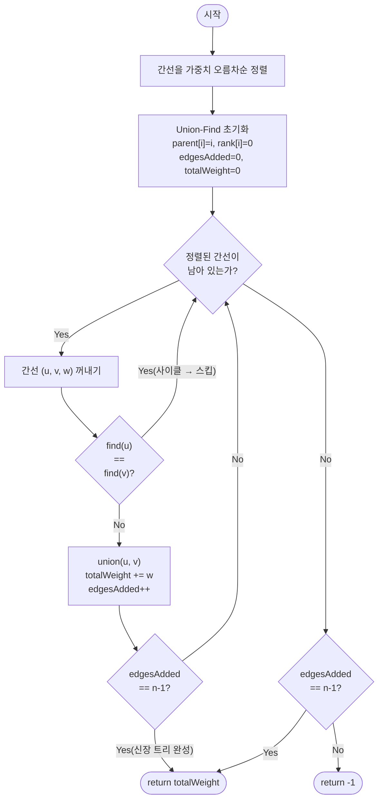

import { AlgorithmSimulation } from "#guide-sim";

# kruskalMst — 컷을 넘는 가장 싼 간선은 항상 정답에 포함된다

## 한눈에 보는 컨셉

여러 마을을 가장 싼 값으로 몽땅 연결하고 싶을 때, 후보 도로를 값싼 순서로 늘어놓고 하나씩 살펴보며 "이미 연결된 두 마을을 또 잇는 것"만 걸러내면 그게 곧 최소 비용 연결망이에요. 이 "걸러내는 판단"(사이클 검사)을 Union-Find로 `O(\alpha(V)) \approx O(1)`에 처리하면, 전체는 간선 정렬이 지배하는 `O(E \log E)`에 끝납니다. 핵심은 "값싼 간선부터 욕심껏 고르는 것이 결과적으로 항상 최적"이라는 사실이고, 이걸 보장하는 이론이 바로 컷 성질(Cut Property)이에요.

## 출발점: 가장 순진한 방법부터

문제를 먼저 정확히 잡을게요.

```ts
function kruskalMst(n: number, edges: [number, number, number][]): number
```

| 매개변수 | 의미                                    | 제약                             |
| -------- | --------------------------------------- | --------------------------------- |
| `n`      | 정점 개수 (인덱스 $0 \ldots n-1$)       | $1 \leq n \leq 10^5$              |
| `edges`  | 무방향 간선 `[u, v, w]` 목록             | $0 \leq E \leq 2 \times 10^5$, $0 \leq w \leq 10^9$ |
| 반환값   | MST 가중치 합; 연결 그래프가 아니면 `-1` | —                                 |

"모든 정점을 잇는 간선 조합 중 가중치 합이 최소인 것을 찾아라"라는 문장을 그대로 코드로 옮기면 가장 정직한 접근이 나옵니다 — **후보 조합을 전부 나열해서 하나씩 검사하는 것**이에요. 신장 트리는 정점 `n`개짜리 그래프에서 정확히 `n-1`개의 간선으로 이루어지므로, 간선 집합 `edges`에서 `n-1`개를 고르는 모든 부분집합을 만들고, 그중 "연결되어 있고 사이클이 없는" 것만 골라 가중치 합의 최솟값을 취하면 됩니다.

```ts
function kruskalMstNaive(n: number, edges: [number, number, number][]): number {
  const E = edges.length;
  let best = Infinity;

  for (let mask = 0; mask < (1 << E); mask++) {
    const chosen: [number, number, number][] = [];
    let weightSum = 0;
    for (let i = 0; i < E; i++) {
      if (mask & (1 << i)) {
        chosen.push(edges[i]);
        weightSum += edges[i][2];
      }
    }
    if (chosen.length !== n - 1) continue; // 신장 트리는 간선 정확히 n-1개

    // 연결 + 무사이클 확인 (여기서도 결국 컴포넌트 관리가 필요하다)
    const parent = Array.from({ length: n }, (_, i) => i);
    const find = (x: number): number =>
      parent[x] === x ? x : (parent[x] = find(parent[x]));
    let ok = true;
    for (const [u, v] of chosen) {
      const ru = find(u), rv = find(v);
      if (ru === rv) { ok = false; break; }
      parent[ru] = rv;
    }
    if (ok) best = Math.min(best, weightSum);
  }

  return best === Infinity ? -1 : best;
}
```

실측해 보면 아주 작은 입력(`n=5`, `E=6`)에서는 이 함수도 정답(`13`)을 맞게 돌려줍니다. 문제는 규모예요.

```text
간선 부분집합 전체 개수 = 2^E

E = 6   (예시 그래프)     : 2^6   =        64개        →  순식간에 끝남
E = 20                    : 2^20  ≈  100만개           →  이미 느려짐
E = 2×10^5 (제약 최댓값)  : 2^(2×10^5)                  →  우주의 원자 수보다 많음
```

`E \leq 2 \times 10^5`인 제약에서 $2^E$는 계산 자체가 불가능한 수준으로 폭발합니다. 게다가 "이 조합이 신장 트리인가?"를 판단하는 데도 컴포넌트 관리(위 코드의 `find`)가 필요한데, 이건 이미 이 문제의 정답으로 가는 실마리이기도 해요. 나열해서 검사하는 대신, **애초에 사이클을 만들지 않는 조합만 골라 나가면** 후보를 줄일 수 있지 않을까요? 대부분의 부분집합이 애초에 사이클을 포함하거나 연결이 끊겨 있다는 사실이 다음 절의 출발점입니다.

## 아이디어 자세히 들여다보기

간선을 값싼 순서로 늘어놓고, 이미 이어진 두 정점을 다시 잇는 간선만 건너뛰면서 하나씩 채택해 나가면 그게 곧 최소 신장 트리가 됩니다. 직관적으로는 "가장 싼 것부터 챙기되 낭비(사이클)만 피한다"는 욕심쟁이 전략인데, 신기하게도 이 단순한 전략이 항상 전역 최적해를 만들어냅니다. 왜 그런지 하나씩 짚어볼게요.

### 값싼 간선부터, 사이클만 피하며 — 수식과 그림

정렬된 간선 열 $e_1, e_2, \ldots, e_E$ (가중치 오름차순, $w(e_1) \leq w(e_2) \leq \cdots$)에 대해, 각 간선 $e_i = (u, v, w)$를 다음 규칙으로 처리합니다.

$$
\text{MST 포함 여부}(e_i) =
\begin{cases}
\text{채택} & \text{if } \mathrm{find}(u) \neq \mathrm{find}(v) \\
\text{제외 (사이클)} & \text{if } \mathrm{find}(u) = \mathrm{find}(v)
\end{cases}
$$

여기서 $\mathrm{find}(x)$는 $x$가 속한 컴포넌트(연결된 정점들의 그룹)의 대표를 돌려주는 함수예요. 채택된 간선의 가중치를 모두 더하면 답입니다.

$$
W_{\text{MST}} = \sum_{e_i \text{ 채택}} w(e_i)
$$

`n=5`, `edges=[[0,1,1],[0,2,3],[1,2,2],[1,3,4],[2,3,5],[3,4,6]]` 예시로 그림을 그려 보면 이렇습니다.

```text
정렬된 간선: (0,1,w1) (1,2,w2) (0,2,w3) (1,3,w4) (2,3,w5) (3,4,w6)

Step 1: (0,1,1) 채택          Step 2: (1,2,2) 채택          Step 3: (0,2,3) 스킵
  0 --1-- 1    2   3   4        0 --1-- 1 --2-- 2   3   4      0 --1-- 1 --2-- 2   3   4
  [0,1]는 서로 다른 컴포넌트    [0,1]과 {2}는 다른 컴포넌트     0과 2가 이미 같은 컴포넌트!
                                                                (0-1-2로 이미 연결됨) → 사이클
```

**잠깐, 확인 하나만 해 볼까요?** 위 Step 3에서 `find(0)`과 `find(2)`가 같다는 걸 어떻게 압니까 — Step 1, 2에서 `union(0,1)`, `union(1,2)`를 거치며 0, 1, 2가 이미 한 그룹으로 묶였기 때문입니다. 그래서 `(0,2,3)`을 추가하면 이미 연결된 두 정점을 또 잇는, 즉 원을 만드는 간선이 되는 거예요.

**왜 하필 이 정의여야 할까요?** "간선이 사이클을 만드는가"를 매번 DFS/BFS로 그래프 전체를 순회해 확인할 수도 있어요(연결 여부만 보면 되니까). 하지만 그러면 간선 하나당 $O(V+E)$가 들어 전체가 $O(E(V+E))$로 나빠집니다. `find`/`union` 기반 정의는 "지금까지 처리한 간선들이 만든 컴포넌트 구조"만 들고 다니면서 매 간선을 $O(\alpha(V))$에 판정할 수 있다는 점에서 같은 질문에 훨씬 싼 답을 줍니다.

### 단서를 설명해 주는 이론 — 컷 성질(Cut Property)

방금 "값싼 간선부터 욕심껏 고르면 항상 최적"이라고 했는데, 이게 우연이 아니라는 걸 보장하는 정리가 있습니다.

> **컷 성질(Cut Property).** 그래프의 정점 집합을 두 그룹 $S$와 $V \setminus S$로 나누는 임의의 컷(cut)에서, 그 컷을 가로지르는 간선들 중 가중치가 최소인 간선 $e$는 (동률이 없다면) 모든 최소 신장 트리에 포함된다.

직관은 이렇습니다. $e$를 뺀 어떤 신장 트리 $T$가 있다면, $S$와 $V \setminus S$를 잇는 다른 간선 $e'$이 $T$ 안에 반드시 있어야 하는데(그래야 두 그룹이 연결되니까), $e$가 컷을 가로지르는 최소 가중치 간선이므로 $w(e) \leq w(e')$입니다. $e'$을 빼고 $e$를 넣어도 여전히 신장 트리이고 가중치는 줄거나 같아지므로, $e$가 빠진 트리는 최적일 수 없거나 $e$를 넣은 트리와 동점입니다.

이 정리를 우리 알고리즘에 대응시켜 볼게요. 간선을 가중치 오름차순으로 보다가 $\mathrm{find}(u) \neq \mathrm{find}(v)$인 순간, 그 간선은 "$u$가 속한 컴포넌트"와 "나머지 정점들" 사이의 컷을 가로지르는 간선 중 **지금까지 본 것 중 가장 싼 것**입니다(이미 오름차순으로 처리했으니까요). 컷 성질에 의해 이 간선은 반드시 어떤 MST에 포함될 자격이 있고, 그래서 채택해도 안전합니다. 즉 **Kruskal이 하는 일은 컷 성질을 모든 간선에 대해 순서대로 적용한 것**이에요. 이 대응은 뒤에서 정당성을 따질 때 다시 소환할 테니 기억해 두세요.

### 셈을 맡는 자료구조 — Union-Find(합집합-찾기)

여기서 "두 정점이 이미 같은 컴포넌트에 있는가"를 빠르게 답해주는 자료구조가 필요합니다. 각 정점이 어느 컴포넌트에 속하는지 관리하고, 두 컴포넌트를 합치는 연산까지 지원하는 것이 Union-Find(Disjoint Set)예요. 이 문제에서 Union-Find의 역할은 정확히 하나입니다 — **"간선을 추가하면 사이클이 생기는가"를 $O(\alpha(V))$에 판정하는 것**.

Union-Find 자체의 원리(parent 배열, 경로 압축, 랭크 병합)는 이 프로젝트에 독립된 가이드가 있으니 그쪽을 참고하세요: [unionFind 가이드](../../../data-structures/disjoint-set/unionFind/unionFind-guide.mdx). 이 가이드에서는 "Kruskal 안에서 Union-Find를 어떻게 조합해 써야 전체 목표 복잡도 $O(E \log E)$가 유지되는가"에 집중합니다 — 뒤 5~7절에서 바로 이 지점을 다룹니다.

### 왜 모순 없이 작동하는가

이 알고리즘이 지키는 불변식은 하나예요.

> 루프의 매 반복 시점에서, 지금까지 채택된 간선 집합은 **어떤 MST의 부분집합**이다.

**기저**: 아무 간선도 채택하지 않은 시작 시점, 빈 집합은 당연히 모든 MST의 부분집합입니다.

**귀납 단계**: 채택된 집합이 어떤 MST $T^*$의 부분집합이라고 가정하고, 다음으로 처리할 간선 $e_i = (u, v, w)$를 봅니다. 이때 가능한 경우는 정확히 둘뿐입니다(다른 경우가 없다는 점이 중요해요 — `find(u)`와 `find(v)`는 반드시 같거나 다르거나 둘 중 하나니까요).

- **경우 1: $\mathrm{find}(u) = \mathrm{find}(v)$ (같은 컴포넌트).** $e_i$를 추가하면 이미 연결된 두 정점 사이에 또 다른 경로가 생겨 사이클이 됩니다. 트리는 사이클이 없어야 하므로 $e_i$는 어떤 신장 트리에도(따라서 어떤 MST에도) 지금 이 컴포넌트 구조 위에서는 추가될 수 없습니다. 건너뛰는 것이 옳습니다.
- **경우 2: $\mathrm{find}(u) \neq \mathrm{find}(v)$ (다른 컴포넌트).** 앞 절 컷 성질에서 본 것처럼, $u$의 컴포넌트와 나머지를 가르는 컷을 가로지르는 간선 중 $e_i$가 지금까지 본 것 중 가장 싸므로, $e_i$는 (그 컷을 기준으로) 어떤 MST에 포함될 자격이 있습니다. $e_i$가 $T^*$에 이미 있다면 그대로 부분집합 성질이 유지되고, 없다면 $T^*$에서 그 컷을 가로지르는 다른 간선을 $e_i$로 교체해도 가중치가 늘지 않는 새 MST $T^{**}$를 얻을 수 있어 부분집합 성질이 유지됩니다. 채택하는 것이 옳습니다.

두 경우를 빠짐없이 다뤘고 각각에서 불변식이 유지됨을 보였으니, 루프가 끝났을 때(즉 `n-1`개를 채웠을 때) 채택된 집합은 크기 `n-1`짜리 사이클 없는 부분집합이면서 어떤 MST의 부분집합이에요. 크기가 같으므로 둘은 일치합니다 — 즉 우리가 채택한 집합이 곧 MST입니다.

**여기서 헷갈리기 쉬운 포인트는 "사이클만 안 만들면 순서는 상관없지 않나?"입니다.** 정렬을 생략하고 원래 입력 순서대로 Union-Find만 돌려도 사이클 없는 신장 트리 하나는 만들어지긴 해요. 하지만 그건 **아무 신장 트리**이지 **최소** 신장 트리가 아닙니다. 실제로 확인해 볼게요. 같은 예시(`n=5`, `edges=[[0,1,1],[0,2,3],[1,2,2],[1,3,4],[2,3,5],[3,4,6]]`)를 원래 순서 그대로(정렬 없이) 처리하면:

```text
순서대로 처리 (정렬 X):
  (0,1,1) 채택 → total=1        (0,2,3) 채택 → total=4
  (1,2,2) 스킵(사이클: 0-1-2)    (1,3,4) 채택 → total=8
  (2,3,5) 스킵(사이클)           (3,4,6) 채택 → total=14   ← n-1=4개 채움, 종료

정렬 O: total = 13   (0,1,1)+(1,2,2)+(1,3,4)+(3,4,6)
정렬 X: total = 14   (0,1,1)+(0,2,3)+(1,3,4)+(3,4,6)   ← 더 싼 (1,2,2) 대신 (0,2,3)이 끼어들었다
```

가중치가 작은 `(1,2,2)`가 채택 순서에서 늦게 오는 바람에, 그보다 비싼 `(0,2,3)`이 먼저 컴포넌트를 묶어 버려 `(1,2,2)`를 스킵당하게 만들었습니다. 컷 성질이 "가장 싼 간선"을 전제로 하기 때문에, 정렬 없이는 그 전제가 깨져 정당성 증명 전체가 무너집니다.

**또 하나 헷갈리기 쉬운 포인트는 "가중치 합이 `0`이면 실패(비연결)로 착각하는 것"입니다.** 모든 간선의 가중치가 `0`인 그래프라도 연결만 되어 있으면 MST 가중치 합은 정당하게 `0`이에요. 비연결은 `-1`이라는 **별개의 신호**로 구분되고, `0`과 혼동하면 안 됩니다.

엣지 케이스도 짚어 둘게요.

```text
n = 1 (정점 하나)          → 신장 트리는 간선 0개, 합 = 0 (실측: kruskalMst(1, []) === 0)
비연결 그래프              → n-1개를 채우지 못하고 루프 종료 → -1 (실측: kruskalMst(3, [[0,1,5]]) === -1)
평행 간선(같은 u,v 여러 개) → 정렬 후 가벼운 것이 먼저 오므로 자동으로 최적 선택
                              (실측: kruskalMst(2, [[0,1,100],[0,1,1]]) === 1)
```

## 아이디어를 코드로 옮기기

이제 아이디어를 그대로 옮긴 기본 구현을 봅시다. Union-Find는 가장 단순한 형태 — parent 체인을 그냥 따라가는 `find`와, 랭크를 따지지 않고 무조건 붙이는 `union` — 로 시작합니다.

```ts
function findNaive(v: number, parent: number[]): number {
  while (parent[v] !== v) v = parent[v];
  return v;
}

function unionNaive(u: number, v: number, parent: number[]): boolean {
  const ru = findNaive(u, parent);
  const rv = findNaive(v, parent);
  if (ru === rv) return false; // 이미 같은 컴포넌트 → 사이클
  parent[ru] = rv; // u쪽 루트를 v쪽 루트 아래로 붙인다 (크기·높이는 신경 쓰지 않는다)
  return true;
}

function kruskalMstBase(n: number, edges: [number, number, number][]): number {
  const sorted = [...edges].sort((a, b) => a[2] - b[2]); // ① 가중치 오름차순 정렬
  const parent = Array.from({ length: n }, (_, i) => i);

  let totalWeight = 0;
  let edgesAdded = 0;

  for (const [u, v, w] of sorted) {
    if (unionNaive(u, v, parent)) {          // ② 사이클 없으면 채택
      totalWeight += w;
      edgesAdded++;
      if (edgesAdded === n - 1) break;        // ③ 조기 종료
    }
  }

  return edgesAdded === n - 1 ? totalWeight : -1; // ④ n-1개 못 채우면 비연결
}
```

**가장 중요한 줄은 ①의 정렬입니다.** 방금 정당성 절에서 확인했듯, 정렬을 빼먹으면 코드가 죽지는 않지만 조용히 틀린 값(위 예시에서 `13` 대신 `14`)을 돌려줍니다. 그다음으로 중요한 지점은 ②의 `if (unionNaive(...))`예요 — `union`이 성공했는지(사이클 없이 합쳐졌는지) 여부를 그대로 분기 조건으로 씁니다. `union`을 호출한 뒤 별도로 `find`를 다시 불러 같은 컴포넌트인지 검사하는 건 이미 `union` 안에서 계산한 값을 버리고 다시 계산하는 중복 작업이라 비효율적입니다.

## 더 빠르게 만들 단서 찾기

방금 짠 `unionNaive`를 다시 보면, `parent[ru] = rv`로 항상 무조건 붙입니다. 랭크나 트리 크기를 전혀 신경 쓰지 않아요. 이게 어떤 문제를 일으키는지 작은 예로 확인해 봅시다. `n=5`인 그래프에서 간선을 `(0,1),(1,2),(2,3),(3,4)` 순서로 `union`하면:

```text
union(0,1): parent[0]=1           0→1
union(1,2): parent[1]=2           0→1→2
union(2,3): parent[2]=3           0→1→2→3
union(3,4): parent[3]=4           0→1→2→3→4   (한 줄로 늘어진 체인!)

find(0) 실측: 0→1→2→3→4, 총 4홉 (parent 배열 = [1, 2, 3, 4, 4])
```

간선이 이런 식으로(정점 번호가 이어지는 순서로) 계속 들어오면 parent 체인이 한 방향으로 계속 길어져서, `n`개 정점이면 `find`가 최악 $O(n)$까지 늘어질 수 있어요. 이 관찰을 문제 규모로 확장해 보면 심각합니다.

```text
n = V = 10^5,  E = 2×10^5 인 최악 입력을 가정하면:

find 한 번의 비용        : 최악 O(V) = 10^5
find/union 호출 횟수     : 간선마다 최대 2번 → O(E) = 2×10^5 번
전체 비용                : O(E · V) = 2×10^5 × 10^5 = 2×10^10   ← 목표 O(E log E) ≈ 3.6×10^6을 한참 넘는다
```

정렬 비용 $O(E \log E)$는 그대로 감당할 만한데, Union-Find 쪽이 체인 때문에 목표를 무너뜨릴 수 있다는 게 이번 단서예요. 3.3에서 링크한 [unionFind 가이드](../../../data-structures/disjoint-set/unionFind/unionFind-guide.mdx)가 정확히 이 문제(트리가 편향되는 문제)를 다루고 있으니, 그 해법을 이 문제에 그대로 가져와 봅시다.

## 단서를 최적화로 연결하기

체인이 생기는 원인은 두 가지예요. 하나는 "루트를 찾을 때 지나간 길을 기억해 두지 않는 것"(매번 처음부터 다시 걷는다), 다른 하나는 "합칠 때 어느 쪽을 밑에 둘지 무작위인 것"(작은 트리를 큰 트리 위에 올릴 수도 있다). 각각을 고치는 기법이 **경로 압축(path compression)**과 **랭크 병합(union by rank)**입니다.

```text
Before (경로 압축 없음):        After (경로 압축 적용):
  0→1→2→3→4                      0→4, 1→4, 2→4, 3→4
  find(0) 호출마다 4홉을 매번      find(0) 호출 한 번으로 경로 위 모든 노드가
  다시 걷는다                     루트 4를 직접 가리키도록 갱신 → 다음부터 1홉
```

$$
\mathrm{find}(v) = \begin{cases} v & \text{if } \mathrm{parent}[v] = v \\ \mathrm{parent}[v] \leftarrow \mathrm{find}(\mathrm{parent}[v]) & \text{otherwise, 재귀 반환값을 } \mathrm{parent}[v] \text{에도 기록} \end{cases}
$$

랭크 병합의 불변식은 "**항상 랭크(트리 높이 상한)가 낮은 쪽을 높은 쪽 밑에 붙인다**"예요. 이렇게 하면 트리 높이가 합칠 때마다 최대 1씩만 늘고, 그것도 두 트리의 랭크가 같을 때만 늘어나므로 높이가 $O(\log V)$ 이하로 묶입니다.

$$
\mathrm{union}(u, v):\quad \mathrm{rank}[\mathrm{root}] < \mathrm{rank}[\text{other}] \implies \text{root를 other 밑으로}
$$

두 기법을 함께 쓰면(경로 압축이 트리를 계속 납작하게 만들고, 랭크 병합이 애초에 높이가 커지는 것을 막으므로) `find`/`union` 한 번의 분할 상환 비용이 역아커만 함수 $\alpha(V)$로 줄어듭니다. $\alpha(V) \leq 4$ ($V \leq 10^{600}$ 범위에서)이므로 사실상 $O(1)$이에요. 자세한 분할 상환 분석(둘을 함께 써야 하는 이유, $\alpha$의 유도)은 [unionFind 가이드](../../../data-structures/disjoint-set/unionFind/unionFind-guide.mdx)에 있으니, 여기서는 이 결과를 Kruskal의 전체 복잡도에 대입하는 데 집중할게요.

$$
O(E \log E) \;+\; O(E \cdot \alpha(V)) \;=\; O(E \log E)
$$

정렬 비용이 Union-Find 비용을 압도하므로, 경로 압축과 랭크 병합을 넣으면 목표였던 $O(E \log E)$가 그대로 달성됩니다.

## 최적화 코드

바뀌는 곳은 `find`와 `union` 두 함수뿐입니다.

```ts
function find(v: number, parent: number[]): number {
  if (parent[v] !== v) {
    parent[v] = find(parent[v], parent); // 경로 압축: 재귀 결과를 그대로 기록
  }
  return parent[v];
}

function union(u: number, v: number, parent: number[], rank: number[]): boolean {
  let ru = find(u, parent);
  let rv = find(v, parent);
  if (ru === rv) return false;              // 이미 같은 컴포넌트 → 사이클
  if (rank[ru] < rank[rv]) [ru, rv] = [rv, ru]; // 랭크 낮은 쪽이 ru가 되도록 swap
  parent[rv] = ru;                          // 낮은 랭크 트리를 높은 랭크 트리 아래로
  if (rank[ru] === rank[rv]) rank[ru]++;    // 랭크가 같았을 때만 1 증가
  return true;
}

export function kruskalMst(n: number, edges: [number, number, number][]): number {
  const sorted = [...edges].sort((a, b) => a[2] - b[2]);
  const parent = Array.from({ length: n }, (_, i) => i);
  const rank = new Array(n).fill(0);

  let totalWeight = 0;
  let edgesAdded = 0;

  for (const [u, v, w] of sorted) {
    if (union(u, v, parent, rank)) {
      totalWeight += w;
      edgesAdded++;
      if (edgesAdded === n - 1) break;
    }
  }

  return edgesAdded === n - 1 ? totalWeight : -1;
}
```

**가장 중요한 줄은 `parent[v] = find(parent[v], parent)`입니다.** 단순히 재귀 호출만 하고 대입을 빼먹으면(`return find(parent[v], parent)`로만 쓰면) 루트는 올바르게 찾지만 parent 배열이 갱신되지 않아 경로 압축 효과가 전혀 없습니다 — 다음 `find` 호출도 여전히 체인 전체를 걸어야 해요. 그다음으로 중요한 지점은 랭크 비교 순서입니다. `if (rank[ru] < rank[rv])`를 반대로(`>`) 쓰면 항상 낮은 트리 밑에 높은 트리를 붙이는 꼴이 되어, 경로 압축이 없다면 5~7절 앞부분에서 본 체인 문제가 그대로 재현됩니다.

> 기억법: "가벼운 쪽이 무거운 쪽 밑으로" — 랭크가 낮은(가벼운) 루트를 랭크가 높은(무거운) 루트 아래에 붙인다.

더 최적화할 여지가 있을까요? 이 시점에서 전체 비용은 정렬 $O(E \log E)$가 지배하고 Union-Find 부분은 사실상 $O(E)$로 줄어 있습니다. 가중치가 임의의 정수(비교만 가능, $0 \leq w \leq 10^9$)인 한 비교 기반 정렬의 하한은 $\Omega(E \log E)$이므로, 이 구조 위에서 점근적으로 더 줄이기는 어렵습니다(값의 범위가 훨씬 좁다면 기수 정렬 같은 비교 없는 정렬로 $O(E)$까지 줄일 여지는 있지만, $w \leq 10^9$인 이 문제에서는 이득이 제한적이에요). 참고로 최소 신장 트리 자체는 Borůvka의 알고리즘이나 개선된 Prim(피보나치 힙) 등으로 $O(E \log V)$ 혹은 $O(E + V \log V)$까지 낼 수 있는 특화 구현도 존재합니다. 그럼에도 Kruskal을 배우는 이유는 **구현이 단순하고, "정렬 + 사이클 검사"라는 뼈대가 그래프가 아니라 간선 리스트만 주어져도(정점 간 인접 정보 없이도) 그대로 작동한다는 범용성**에 있어요.

## 실행 시각화

예시 그래프 `n = 5`, `edges = [[0,1,1], [0,2,3], [1,2,2], [1,3,4], [2,3,5], [3,4,6]]`에 대해 `kruskalMst`를 실행하는 과정입니다. 간선을 가중치 오름차순으로 정렬한 뒤 하나씩 보며, 두 끝점의 루트가 다르면(`find(u) != find(v)`) MST에 채택하고 `union`합니다. 그래프에서 빨간 간선은 현재 검토 중인 간선, 회색(visited) 노드/굵은 간선은 MST에 채택된 간선이에요. `keyValue` 패널은 정렬된 간선 큐와 parent 배열, 누적 가중치를 보여줍니다. 실제 반환값은 `13`(채택 간선 `(0,1,1), (1,2,2), (1,3,4), (3,4,6)`, 합 13)이며, 시뮬레이션 마지막 프레임과 일치합니다.

> 대화형 시뮬레이션은 MDX 런타임에서 표시됩니다.

export const nodes = [
  { id: 0, label: "0", x: 18, y: 30 },
  { id: 1, label: "1", x: 50, y: 14 },
  { id: 2, label: "2", x: 50, y: 60 },
  { id: 3, label: "3", x: 82, y: 30 },
  { id: 4, label: "4", x: 82, y: 80 },
];

export const edges = [
  { from: 0, to: 1, weight: 1, directed: false },
  { from: 0, to: 2, weight: 3, directed: false },
  { from: 1, to: 2, weight: 2, directed: false },
  { from: 1, to: 3, weight: 4, directed: false },
  { from: 2, to: 3, weight: 5, directed: false },
  { from: 3, to: 4, weight: 6, directed: false },
];

export const steps = [
  {
    title: "초기화",
    detail: "간선을 가중치 오름차순으로 정렬. parent[i]=i, rank=0, totalWeight=0, edgesAdded=0.",
    nodes, edges,
    nodeStatus: {},
    entries: [
      { label: "정렬된 간선", value: "(0,1,1) (1,2,2) (0,2,3) (1,3,4) (2,3,5) (3,4,6)" },
      { label: "parent", value: "[0, 1, 2, 3, 4]" },
      { label: "totalWeight / edgesAdded", value: "0 / 0" },
    ],
  },
  {
    title: "간선 (0,1,w=1) 검토",
    detail: "find(0)=0, find(1)=1 → 다른 컴포넌트. 채택하고 union(0,1).",
    nodes, edges,
    nodeStatus: { 0: "active", 1: "active" },
    activeEdge: { from: 0, to: 1 },
    entries: [
      { label: "find(0) vs find(1)", value: "0 != 1 → 채택" },
      { label: "parent", value: "[1, 1, 2, 3, 4]" },
      { label: "totalWeight / edgesAdded", value: "1 / 1" },
    ],
  },
  {
    title: "(0,1) 채택 완료",
    detail: "컴포넌트 {0,1} 형성. totalWeight=1.",
    nodes, edges,
    nodeStatus: { 0: "visited", 1: "visited" },
    entries: [
      { label: "컴포넌트", value: "{0,1} {2} {3} {4}" },
      { label: "parent", value: "[1, 1, 2, 3, 4]" },
      { label: "totalWeight / edgesAdded", value: "1 / 1" },
    ],
  },
  {
    title: "간선 (1,2,w=2) 검토",
    detail: "find(1)=1, find(2)=2 → 다른 컴포넌트. 채택하고 union(1,2).",
    nodes, edges,
    nodeStatus: { 0: "visited", 1: "active", 2: "active" },
    activeEdge: { from: 1, to: 2 },
    entries: [
      { label: "find(1) vs find(2)", value: "1 != 2 → 채택" },
      { label: "parent", value: "[1, 1, 1, 3, 4]" },
      { label: "totalWeight / edgesAdded", value: "3 / 2" },
    ],
  },
  {
    title: "(1,2) 채택 완료",
    detail: "컴포넌트 {0,1,2} 형성. totalWeight=3.",
    nodes, edges,
    nodeStatus: { 0: "visited", 1: "visited", 2: "visited" },
    entries: [
      { label: "컴포넌트", value: "{0,1,2} {3} {4}" },
      { label: "parent", value: "[1, 1, 1, 3, 4]" },
      { label: "totalWeight / edgesAdded", value: "3 / 2" },
    ],
  },
  {
    title: "간선 (0,2,w=3) 검토 → 사이클",
    detail: "find(0)=1, find(2)=1 → 같은 컴포넌트. 추가하면 사이클이므로 건너뛴다.",
    nodes, edges,
    nodeStatus: { 0: "active", 1: "visited", 2: "active" },
    activeEdge: { from: 0, to: 2 },
    entries: [
      { label: "find(0) vs find(2)", value: "1 == 1 → 스킵(사이클)" },
      { label: "parent", value: "[1, 1, 1, 3, 4]" },
      { label: "totalWeight / edgesAdded", value: "3 / 2" },
    ],
  },
  {
    title: "간선 (1,3,w=4) 검토",
    detail: "find(1)=1, find(3)=3 → 다른 컴포넌트. 채택하고 union(1,3).",
    nodes, edges,
    nodeStatus: { 0: "visited", 1: "active", 2: "visited", 3: "active" },
    activeEdge: { from: 1, to: 3 },
    entries: [
      { label: "find(1) vs find(3)", value: "1 != 3 → 채택" },
      { label: "parent", value: "[1, 1, 1, 1, 4]" },
      { label: "totalWeight / edgesAdded", value: "7 / 3" },
    ],
  },
  {
    title: "(1,3) 채택 완료",
    detail: "컴포넌트 {0,1,2,3} 형성. totalWeight=7.",
    nodes, edges,
    nodeStatus: { 0: "visited", 1: "visited", 2: "visited", 3: "visited" },
    entries: [
      { label: "컴포넌트", value: "{0,1,2,3} {4}" },
      { label: "parent", value: "[1, 1, 1, 1, 4]" },
      { label: "totalWeight / edgesAdded", value: "7 / 3" },
    ],
  },
  {
    title: "간선 (2,3,w=5) 검토 → 사이클",
    detail: "find(2)=1, find(3)=1 → 같은 컴포넌트. 사이클이므로 건너뛴다.",
    nodes, edges,
    nodeStatus: { 0: "visited", 1: "visited", 2: "active", 3: "active" },
    activeEdge: { from: 2, to: 3 },
    entries: [
      { label: "find(2) vs find(3)", value: "1 == 1 → 스킵(사이클)" },
      { label: "parent", value: "[1, 1, 1, 1, 4]" },
      { label: "totalWeight / edgesAdded", value: "7 / 3" },
    ],
  },
  {
    title: "간선 (3,4,w=6) 검토",
    detail: "find(3)=1, find(4)=4 → 다른 컴포넌트. 채택하고 union(3,4).",
    nodes, edges,
    nodeStatus: { 0: "visited", 1: "visited", 2: "visited", 3: "active", 4: "active" },
    activeEdge: { from: 3, to: 4 },
    entries: [
      { label: "find(3) vs find(4)", value: "1 != 4 → 채택" },
      { label: "parent", value: "[1, 1, 1, 1, 1]" },
      { label: "totalWeight / edgesAdded", value: "13 / 4" },
    ],
  },
  {
    title: "조기 종료: edgesAdded == n-1 == 4",
    detail: "신장 트리 완성. 남은 간선을 처리하지 않고 totalWeight=13을 반환한다.",
    nodes, edges,
    nodeStatus: { 0: "visited", 1: "visited", 2: "visited", 3: "visited", 4: "visited" },
    entries: [
      { label: "MST 간선", value: "(0,1,1) (1,2,2) (1,3,4) (3,4,6)" },
      { label: "parent", value: "[1, 1, 1, 1, 1] (단일 컴포넌트)" },
      { label: "반환값", value: "13" },
    ],
  },
];

<AlgorithmSimulation view={["graph", "keyValue"]} steps={steps} title="Kruskal MST: n=5" />

## 흐름 한눈에 보기


```mermaid
flowchart TD
    A([시작]) --> B["간선을 가중치 오름차순 정렬"]
    B --> C["Union-Find 초기화<br/>parent[i]=i, rank[i]=0<br/>edgesAdded=0, totalWeight=0"]
    C --> D{"정렬된 간선이<br/>남아 있는가?"}
    D -- No --> E{"edgesAdded<br/>== n-1?"}
    D -- Yes --> F["간선 (u, v, w) 꺼내기"]
    F --> G{"find(u)<br/>==<br/>find(v)?"}
    G -- "Yes(사이클 → 스킵)" --> D
    G -- No --> H["union(u, v)<br/>totalWeight += w<br/>edgesAdded++"]
    H --> I{"edgesAdded<br/>== n-1?"}
    I -- "Yes(신장 트리 완성)" --> J([return totalWeight])
    I -- No --> D
    E -- Yes --> J
    E -- No --> K([return -1])
```

## 스스로 점검하기

1. `n=4`, `edges=[[0,1,2],[1,2,2],[2,3,2],[0,3,2],[0,2,1]]`에 대해 간선을 가중치 오름차순으로 손으로 정렬하고, 어떤 간선이 채택/스킵되는지 표시하며 MST 가중치 합을 구해 보세요. (정렬 순서는 `(0,2,1) → (0,1,2) → (1,2,2) → (2,3,2) → (0,3,2)`이고, `(1,2,2)`를 검토할 때 `find(1)`과 `find(2)`가 이미 같아 스킵됩니다. 답은 `5`예요.)
2. 본문의 "정렬을 생략하면" 시나리오(`13` 대신 `14`)를 다시 보세요. 정확히 몇 번째로 처리된 간선이 `(1,2,2)`를 밀어냈는지, 그리고 그게 컷 성질의 어떤 전제를 깨는지 한 문장으로 설명해 보세요.
3. 최소 대신 **최대** 신장 트리(비용이 가장 큰 트리)를 구하려면 최적화 코드에서 정확히 어느 한 줄만 바꾸면 될까요? (힌트: 정렬 방향, 또는 가중치 부호.)
