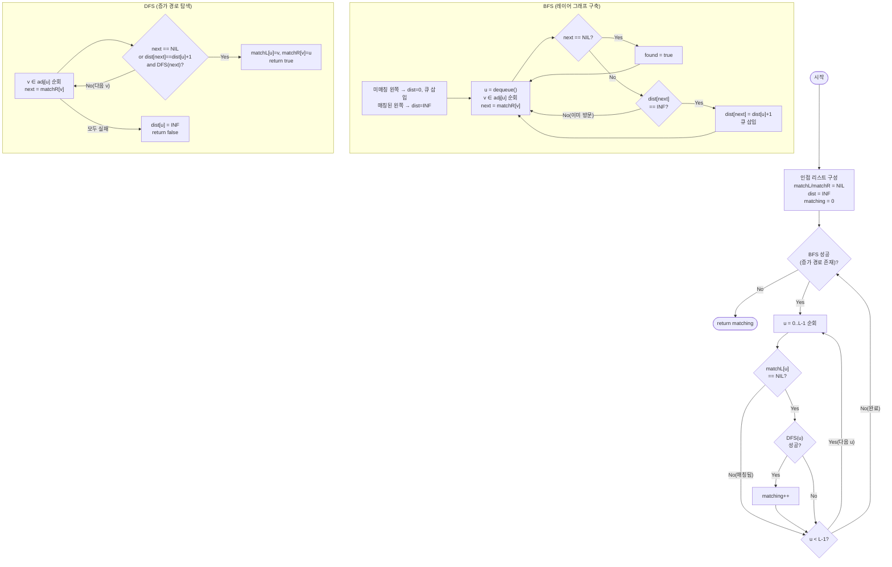

import { AlgorithmSimulation } from "#guide-sim";

# maxBipartiteMatching — 증가 경로를 한 번에 몇 개씩 찾을 수 있을까

## 한눈에 보는 컨셉

이분 그래프의 최대 매칭은 미매칭 왼쪽 정점마다 증가 경로(augmenting path)를 찾아 매칭을 하나씩 늘려 가면 구할 수 있어요. 문제는 매번 경로 하나만 찾으면 최대 매칭 크기만큼 반복해야 한다는 점인데, Hopcroft-Karp는 BFS로 레이어를 세워 같은 길이의 최단 증가 경로를 한 라운드에서 한꺼번에 처리합니다. 이 배치 처리 덕분에 반복 라운드 수가 `O(√V)`로 줄어, 전체 시간이 `O(E√V)`가 돼요.

## 출발점: 가장 순진한 방법부터

문제를 먼저 정확히 잡을게요.

```ts
function maxBipartiteMatching(
  left: number,
  right: number,
  edges: [number, number][],
): number
```

| 매개변수 | 의미 | 제약 |
|----------|------|------|
| `left` | 왼쪽 정점 수 $L$ (번호: $0 \ldots L-1$) | $1 \leq L \leq 10^3$ |
| `right` | 오른쪽 정점 수 $R$ (번호: $0 \ldots R-1$) | $1 \leq R \leq 10^3$ |
| `edges` | 이분 간선 목록 `[u, v]` ($u$: 왼쪽, $v$: 오른쪽) | $0 \leq E \leq L \times R \leq 10^6$ |
| 반환값 | 최대 매칭의 크기 $\lvert M \rvert$ | — |

매칭 $M$은 "어떤 두 간선도 끝점을 공유하지 않는 간선 부분집합"이에요. 왼쪽 정점 하나는 매칭에서 최대 하나의 오른쪽 정점과, 오른쪽 정점 하나도 최대 하나의 왼쪽 정점과만 이어집니다.

가장 정직하게 접근하면 이렇습니다: 조건은 "끝점을 공유하지 않는다"는 것뿐이니, 간선의 모든 부분집합을 만들어서 이 조건을 만족하는 것 중 크기가 가장 큰 걸 고르면 됩니다.

```text
edges = 5개라면 부분집합 2^5 = 32개
edges = E개라면 부분집합 2^E개, E ≤ 10^6이면 2^(10^6)  →  우주가 끝나도 못 센다
```

작은 예시라면 실제로 돌려서 답을 확인할 수 있어요.

```ts
function maxBipartiteMatchingBrute(
  left: number,
  right: number,
  edges: [number, number][],
): number {
  const E = edges.length;
  let best = 0;
  for (let mask = 0; mask < 1 << E; mask++) {
    const usedL = new Set<number>();
    const usedR = new Set<number>();
    let ok = true;
    let size = 0;
    for (let i = 0; i < E; i++) {
      if (!(mask & (1 << i))) continue;
      const [u, v] = edges[i]!;
      if (usedL.has(u) || usedR.has(v)) { ok = false; break; }
      usedL.add(u);
      usedR.add(v);
      size++;
    }
    if (ok) best = Math.max(best, size);
  }
  return best;
}
```

`edges = [[0,0],[0,1],[1,0],[1,2],[2,2]]` (왼쪽 3개, 오른쪽 3개)에 돌려 보면 `3`이 나옵니다 — 실제로 $2^5=32$가지 부분집합을 다 검사해서 얻은 값이라 신뢰할 수 있는 기준점이에요. 하지만 이 함수는 $E$가 20만 넘어도 이미 $2^{20}\approx10^6$가지를 만들어야 해서 문제 규모($E \le 10^6$)에서는 애초에 실행조차 못 합니다.

그렇다면 부분집합을 통째로 만드는 대신, 매칭을 **하나씩 늘려 가는** 쪽은 어떨까요? 매칭 안 된 왼쪽 정점 하나를 골라 오른쪽으로 이어지는 "쓸 수 있는 길"을 찾아 매칭에 끼워 넣는 방식이요. 다음 절에서 이 길의 정체를 정의합니다.

## 아이디어 자세히 들여다보기

### 증가 경로로 매칭을 하나씩 뒤집기 — 수식과 그림

매칭 $M$이 주어졌을 때, 정점 $u$가 $M$의 어떤 간선의 끝점이면 "매칭됐다(matched)"고 하고, 아니면 "미매칭(unmatched)"이라고 해요.

**교대 경로(alternating path)**: 간선이 $M$에 속함/안 속함을 번갈아 가며 잇는 경로.

**증가 경로(augmenting path)**: 양 끝이 모두 미매칭 정점인 교대 경로. 즉

$$
v_0 \xrightarrow{e_1 \notin M} v_1 \xrightarrow{e_2 \in M} v_2 \xrightarrow{e_3 \notin M} \cdots \xrightarrow{e_k \notin M} v_k
$$

여기서 $v_0$은 미매칭 왼쪽 정점, $v_k$는 미매칭 오른쪽 정점이고, 첫 간선과 마지막 간선은 항상 $M$에 없는 간선입니다.

증가 경로를 찾으면 경로 위의 간선들을 전부 뒤집어요 — $M$에 있던 간선은 빼고, $M$에 없던 간선은 넣습니다. 그러면 매칭 크기가 정확히 1 늘어납니다.

`edges = [[0,0],[0,1],[1,0],[1,2],[2,2]]`에서 직접 그려 볼게요. 처음엔 매칭이 `{(0,0)}`(L0-R0) 하나뿐이라고 합시다.

```text
Before: L0=R0 매칭, L1은 미매칭

  L0 --(matched)-- R0
  L1 ------------- R0   (L1도 R0을 원하지만 이미 매칭됨)
  L1 ------------- R2   (L1의 다른 이웃, 미매칭)

증가 경로: L1 --(비매칭)--> R0 --(매칭)--> L0 --(비매칭)--> R1

After: 경로 위 간선을 뒤집는다
  (L1,R0) 비매칭 → 매칭   (L0,R0) 매칭 → 비매칭   (L0,R1) 비매칭 → 매칭

  L0=R1 매칭, L1=R0 매칭   ← 매칭 크기 1 → 2
```

L0이 R0을 "양보"하고 R1로 옮겨 감으로써 L1이 들어올 자리가 생겼죠? 이게 재배치(rematch)예요.

**왜 하필 이 정의여야 할까요?** "그냥 순서대로 비어 있는 오른쪽 정점을 잡는" 단순 그리디와 비교해 봅시다. 같은 예시에서 그리디(재배치 없음)로 왼쪽 정점을 `0,1,2` 순서로 처리하면:

```text
L0: 첫 이웃 R0이 비어 있음 → L0-R0 확정
L1: 첫 이웃 R0은 이미 참(L0) → 다음 이웃 R2가 비어 있음 → L1-R2 확정
L2: 유일한 이웃 R2가 이미 참(L1) → 배정 실패

그리디 결과: 매칭 2개 (L0-R0, L1-R2)
```

실제로 실행해 보면 그리디는 `2`, 증가 경로(재배치 허용)는 `3`을 냅니다. 재배치를 허용하지 않으면 먼저 온 정점이 자리를 "선점"해 버려서 최댓값을 놓칠 수 있어요. 증가 경로 정의가 "미매칭 정점에서 시작해서 미매칭 정점으로 끝나는 교대 경로"인 이유가 바로 이것입니다 — 경로 중간의 매칭 간선을 풀었다가 다시 잇는 걸 허용해야 이미 배정된 정점을 다른 자리로 밀어내고 빈자리를 만들 수 있거든요.

잠깐, 확인 하나 해 볼까요? 증가 경로의 길이(간선 수)는 항상 홀수일까요, 짝수일까요? — 시작과 끝이 모두 미매칭이고 간선이 "비매칭, 매칭, 비매칭, …, 비매칭"으로 교대하니, 비매칭 간선이 매칭 간선보다 정확히 하나 많습니다. 그래서 길이는 **항상 홀수**예요.

### 단서를 설명해 주는 이론 — Berge의 정리

앞서 "증가 경로를 찾아서 뒤집으면 매칭이 는다"는 걸 봤는데, 그럼 **언제 멈춰야 할까요?** 이 질문에 정확한 답을 주는 게 Berge의 정리(Berge's theorem, 1957)입니다.

> **정리.** 그래프 $G$의 매칭 $M$이 최대 매칭이다 $\iff$ $G$에 $M$-증가 경로가 존재하지 않는다.

**($\Rightarrow$) 최대이면 증가 경로가 없다**: 만약 증가 경로가 있다면 그걸 뒤집어서 $\lvert M \rvert + 1$짜리 매칭을 만들 수 있으니, $M$이 최대였다는 가정과 모순이에요.

**($\Leftarrow$) 증가 경로가 없으면 최대다**: 이 방향이 핵심인데, 대우로 보면 쉬워요 — $M$이 최대가 아니라면(더 큰 매칭 $M^*$가 존재한다면) 반드시 $M$-증가 경로가 존재합니다. $M \oplus M^*$(대칭차, 두 매칭에서 정확히 한쪽에만 속하는 간선들)를 보면, 이 간선들은 각 정점에서 차수가 최대 2인 경로/사이클의 모임으로 쪼개져요. $\lvert M^* \rvert > \lvert M \rvert$이므로 어느 한 성분은 $M^*$ 간선을 $M$ 간선보다 많이 갖고 있고, 그런 성분은 양 끝이 $M$에 대해 미매칭인 $M$-증가 경로가 됩니다.

이 정리가 바로 우리 알고리즘의 종료 조건이에요: **증가 경로를 더 못 찾으면 그 자리가 최대 매칭입니다.** 뒤에서 최적화 코드의 `while` 루프가 왜 멈춰도 안전한지 설명할 때 이 정리를 다시 불러올게요.

### 왜 모순 없이 작동하는가

"증가 경로를 찾을 때마다 매칭을 뒤집는다"는 절차 자체가 항상 올바른 답에 수렴하는지 귀납적으로 확인해 봅시다.

**기저**: 매칭이 없는 상태($M = \emptyset$, 크기 0)에서 시작합니다. 간선이 하나도 없다면 증가 경로도 없으니 Berge의 정리에 의해 $M=\emptyset$이 이미 최대(크기 0)입니다.

**귀납 단계**: 크기 $k$인 매칭 $M_k$가 주어졌다고 합시다. 가능한 경우는 정확히 둘뿐입니다(완전성 — 세 번째 경우는 없어요, 그래프에 증가 경로가 있거나 없거나 둘 중 하나니까).

- **증가 경로가 있는 경우**: 경로를 뒤집어 $M_{k+1}$을 만들면 $\lvert M_{k+1} \rvert = k+1$입니다. $M_{k+1}$이 여전히 유효한 매칭인 이유는, 경로가 교대 경로라서 뒤집은 뒤에도 각 정점이 경로 위에서 최대 한 번만 매칭 간선에 닿기 때문이에요(교대 구조가 깨지지 않는 한 정점당 매칭 간선 1개 제약이 유지됩니다).
- **증가 경로가 없는 경우**: Berge의 정리에 의해 $M_k$가 곧 최대 매칭이므로 절차를 멈춥니다.

두 경우 모두에서 "다음 상태가 여전히 유효한 매칭이고, 크기는 늘거나(첫째) 이미 최대(둘째)"라는 사실이 성립하므로, 이 절차를 반복하면 유한 번(최대 $\min(L,R)$번) 안에 최대 매칭에 도달합니다.

여기서 **헷갈리기 쉬운 포인트**는 "오른쪽 정점이 이미 매칭돼 있으면 그 정점으로는 더 갈 수 없다"고 생각하는 것입니다. 실제로는 그 반대예요 — 이미 매칭된 오른쪽 정점이라도, 거기 물려 있는 왼쪽 정점을 다른 자리로 밀어낼 수 있다면 경로가 계속 이어집니다. 위에서 실행한 트레이스가 정확히 이 반례예요.

```text
L1이 R0을 봤을 때: matchR[0] = L0 (이미 매칭됨)

"막혔다"고 오해하면:        matching은 1에서 멈춤 (L0-R0만)
실제로는:  L0을 따라가 L0의 다른 이웃 R1이 비어 있는지 확인
           → 있다! L0을 R1로 재배치, L1이 R0을 차지
           → matching이 2로 증가 (그리고 다음 L2까지 처리하면 3)
```

엣지 케이스도 이 논리 위에서 그대로 성립하는지 짚어 볼게요(제약상 $L,R\ge1$입니다).

```text
L=1, R=1, edges=[]        → 증가 경로 자체가 없음 → matching = 0
L=1, R=1, edges=[[0,0]]   → L0→R0 경로 1개 → matching = 1
완전 이분(L=3,R=3, 9간선) → 증가 경로를 계속 찾아 matching = min(L,R) = 3
단방향(L=1,R=3, 간선 3개) → 왼쪽이 하나뿐이라 matching = 1 (더 늘어날 여지가 없음)
중복 간선(같은 (u,v) 반복) → 인접 리스트에 중복 등록돼도 matchR로 중복이 걸러져 matching에는 영향 없음
```

## 아이디어를 코드로 옮기기

앞 절의 아이디어를 그대로 함수로 옮기면 이렇습니다 — 미매칭 왼쪽 정점마다 DFS로 증가 경로를 찾아 매칭을 뒤집는, "단순 헝가리안(Hungarian) 알고리즘"이에요.

```ts
function maxBipartiteMatchingBasic(
  left: number,
  right: number,
  edges: [number, number][],
): number {
  const adj: number[][] = Array.from({ length: left }, () => []);
  for (const [u, v] of edges) adj[u]!.push(v);

  const matchR = new Array<number>(right).fill(-1); // NIL = -1

  function tryAugment(u: number, visited: boolean[]): boolean {
    for (const v of adj[u]!) {
      if (visited[v]) continue;
      visited[v] = true;
      if (matchR[v] === -1 || tryAugment(matchR[v]!, visited)) {
        matchR[v] = u;
        return true;
      }
    }
    return false;
  }

  let matching = 0;
  for (let u = 0; u < left; u++) {
    const visited = new Array<boolean>(right).fill(false); // u마다 새로 초기화
    if (tryAugment(u, visited)) matching++;
  }
  return matching;
}
```

**가장 중요한 줄은 `matchR[v] === -1 || tryAugment(matchR[v]!, visited)`입니다.** `v`가 비어 있으면 바로 매칭하고, 이미 매칭돼 있으면 그 자리를 차지한 `matchR[v]`(왼쪽 정점)를 재귀로 다시 재배치해 봅니다. 성공하면 그제서야 `matchR[v] = u`로 자리를 바꿔치기해요 — 이 한 줄이 "재배치"의 전부입니다.

**함정 — `visited`를 매번 새로 만들지 않으면 어떻게 될까요?** `visited` 배열을 `u`마다 초기화하지 않고 함수 바깥에서 한 번만 만들면, 이전 `u`의 탐색에서 "방문했다"고 표시된 오른쪽 정점을 다음 `u`가 영영 재검토하지 못합니다. `edges = [[0,0],[0,1],[1,0],[1,2],[2,2]]`에 실제로 돌려 보면:

```text
정상(visited 매번 리셋):     matching = 3
버그(visited 한 번만 생성): matching = 2   ← L2가 R2에 도달하지 못해 조용히 누락
```

같은 오른쪽 정점을 여러 왼쪽 정점의 탐색에서 **각자 독립적으로** 재검토할 수 있어야 재배치 체인이 끊기지 않습니다.

## 더 빠르게 만들 단서 찾기

이 기본 구현이 하는 일을 다시 보면, 왼쪽 정점 `u`마다 `visited`를 새로 채우고 인접 리스트를 처음부터 훑습니다. 최악의 경우 매 `u`마다 $O(E)$이고 이걸 $L$번 반복하니 총 $O(L \cdot E)$예요.

```text
L=1000, E=10^6 (문제 최대 규모)
O(L·E) = 1000 × 1,000,000 = 1,000,000,000  ← 10^9, 1초 안에 위험
```

낭비 지점을 짚어 보면: `u=0`이 증가 경로를 찾아 매칭을 뒤집고 나면, `u=1`은 처음부터 새로운 DFS를 돕니다. 그런데 `u=0`이 방금 만든 매칭 구조(레이어)는 `u=1`의 탐색에서도 거의 그대로 재사용할 수 있는 정보예요 — 매번 갈아엎을 필요가 없다는 뜻입니다.

더 결정적인 관찰은 이겁니다. Berge의 정리는 "증가 경로가 없으면 끝"이라고만 말할 뿐, "경로를 몇 개씩 처리해야 하는가"는 말해 주지 않아요. 그런데 **같은 라운드에서 찾을 수 있는 가장 짧은 증가 경로들은 서로 정점을 공유하지 않습니다.** 왜냐하면 서로 다른 두 최단 증가 경로가 정점을 공유한다면, 그 공유 지점에서 경로를 바꿔 타는 게 항상 더 짧은(또는 같은 길이의) 경로를 만들 수 있어 "최단"이라는 전제와 어긋나기 때문이에요. 즉 **한 라운드에서 여러 개의 최단 증가 경로를 동시에 찾아 동시에 뒤집어도 서로 충돌하지 않습니다.**

## 단서를 최적화로 연결하기

정점을 공유하지 않는 최단 증가 경로들을 "한꺼번에" 찾으려면, 먼저 BFS로 각 왼쪽 정점이 몇 번째 교대 단계(레이어)에 있는지 계산해야 합니다. 미매칭 왼쪽 정점을 레이어 0으로 두고, 매칭 간선을 타고 한 칸씩 나아갈 때마다 레이어를 하나씩 올리는 겁니다.

```text
Before (기본 구현): 한 번에 경로 하나만 찾고 뒤집는다
  u=0 →(DFS, O(E))→ 매칭+1
  u=1 →(DFS, O(E))→ 매칭+1     ← 매번 새로 처음부터
  u=2 →(DFS, O(E))→ 매칭+1
  총 L번의 O(E) DFS

After (Hopcroft-Karp): BFS로 레이어를 세우고, 같은 레이어 안의 경로를 한 라운드에서 모두 처리
  라운드1: BFS로 레이어 배정 → 레이어를 지키는 DFS들이 정점-서로소로 동시 진행
  라운드2: 못 늘어난 정점만 다시 BFS → 이번엔 더 긴 레이어가 나옴
  ...
  라운드 수가 O(√V)에서 끝난다
```

실제로 `edges = [[0,0],[0,1],[1,0],[1,2],[2,2]]`를 Hopcroft-Karp로 돌리면 라운드가 정확히 이렇게 진행됩니다(실측):

```text
라운드1: BFS 후 dist = [0, 0, 0]   (L0,L1,L2 모두 미매칭이라 레이어 0)
         이 라운드에서 증가 경로 2개 발견 → matching 0 → 2
         matchL = [0, 2, -1]   (L0-R0, L1-R2 확정, L2는 아직 실패)

라운드2: BFS 후 dist = [2, 1, 0]   (L2가 0, L1이 1, L0이 2 — 재배치 체인 길이)
         이 라운드에서 증가 경로 1개 발견 → matching 2 → 3
         matchL = [1, 0, 2]   (L0-R1, L1-R0, L2-R2로 재배치되며 종료)
```

라운드마다 최단 증가 경로 길이가 늘어나는 걸 보세요(1단계 경로들이 다 소진된 뒤에야 3단계 경로가 나타납니다). **왜 하필 $\sqrt{V}$번일까요?** 증가 경로의 최대 길이는 $2\min(L,R)-1$이고, 매 라운드가 끝날 때마다 최단 증가 경로 길이가 최소 2씩 늘어난다는 사실이 알려져 있습니다(증가 경로 길이가 라운드 수의 절반보다 짧을 수 없다는 조합적 논증에서 나와요). 그래서 라운드 수는 $O(\sqrt{V})$로 묶이고, 라운드 하나의 비용이 $O(E)$이니 전체는 $O(E\sqrt{V})$가 됩니다.

```text
E = 10^6, V = L+R ≤ 2000, √V ≈ 44.72
O(E√V) ≈ 1,000,000 × 44.72 ≈ 44,721,360   ← 약 4.5×10^7, 1초 안에 통과 가능
```

> 기억법: "레이어가 하나 오를 때만 한 걸음 나아간다." DFS는 `dist[next] == dist[u] + 1`인 이웃으로만 이동합니다 — 레이어를 건너뛰거나 같은 레이어로 옆질러가는 순간 최단 경로가 아니게 돼요.

## 최적화 코드

바뀌는 부분을 정리하면, 매칭 정보를 양방향(`matchL`, `matchR`)으로 들고, DFS 전에 BFS로 `dist` 레이어를 계산한 뒤, 그 레이어를 지키면서만 DFS가 움직이게 만드는 것입니다.

```ts
function maxBipartiteMatching(
  left: number,
  right: number,
  edges: [number, number][],
): number {
  const NIL = -1;
  const adj: number[][] = Array.from({ length: left }, () => []);
  for (const [u, v] of edges) adj[u]!.push(v);

  const matchL = new Array<number>(left).fill(NIL);
  const matchR = new Array<number>(right).fill(NIL);
  const dist = new Array<number>(left).fill(Infinity);

  function bfs(): boolean {
    const queue: number[] = [];
    for (let u = 0; u < left; u++) {
      if (matchL[u] === NIL) {
        dist[u] = 0;
        queue.push(u);
      } else {
        dist[u] = Infinity;
      }
    }
    let found = false;
    let qi = 0;
    while (qi < queue.length) {
      const u = queue[qi++]!;
      for (const v of adj[u]!) {
        const next = matchR[v]!;
        if (next === NIL) {
          found = true; // 미매칭 오른쪽 도달 — 계속 순회해 같은 레이어의 다른 경로도 찾는다
        } else if (dist[next] === Infinity) {
          dist[next] = dist[u]! + 1;
          queue.push(next);
        }
      }
    }
    return found;
  }

  function dfs(u: number): boolean {
    for (const v of adj[u]!) {
      const next = matchR[v]!;
      if (next === NIL || (dist[next] === dist[u]! + 1 && dfs(next))) {
        matchL[u] = v;
        matchR[v] = u;
        return true;
      }
    }
    dist[u] = Infinity; // 실패 표시 — 이 라운드에서 다시 방문하지 않는다(데드엔드 제거)
    return false;
  }

  let matching = 0;
  while (bfs()) {
    for (let u = 0; u < left; u++) {
      if (matchL[u] === NIL && dfs(u)) matching++; // 바깥에서만 카운트
    }
  }
  return matching;
}
```

**가장 중요한 줄은 `else if (dist[next] === Infinity) { dist[next] = dist[u]! + 1; ... }`와 `dist[next] === dist[u]! + 1 && dfs(next)`입니다.** 앞의 것이 "최단 레이어만 기록한다"(BFS의 본질), 뒤의 것이 "그 레이어를 지키는 경로만 따라간다"(DFS의 본질)예요. 이 두 조건이 없으면 그냥 기본 구현과 다를 게 없어집니다.

**함정 — `matching++`를 `dfs` 안에서 재귀 성공마다 세면 어떻게 될까요?** 재배치 체인 하나가 성공하면 실제로 늘어나는 매칭은 딱 1개인데, 체인 위의 모든 재귀 호출마다(즉 기존 매칭을 옮기는 동작까지) 카운트해 버리면 중복 계산이 생깁니다. 같은 3×3 예시에서:

```text
정상(바깥 루프에서만 카운트):     matching = 3
버그(dfs 내부에서 매번 카운트):  matching = 5   ← 재배치된 기존 매칭까지 "새로 생긴 매칭"으로 오산
```

`matchL[u] === NIL`인 최초 호출에서만, 그것도 DFS 전체가 성공을 반환했을 때 딱 한 번만 세야 합니다.

여기서 더 최적화할 여지가 있을까요? 일반적인 이분 그래프에 대해 Hopcroft-Karp가 달성하는 $O(E\sqrt{V})$는 오랫동안 실무적으로 최선으로 쓰여 온 상한이라, 이 알고리즘 자체로는 더 손댈 곳이 마땅치 않습니다(참고로 2020년대 들어 거의 선형에 가까운 이론적 개선이 연구됐지만 구현이 훨씬 복잡해 일반적인 코딩 테스트/실무 범위를 넘어섭니다). 또한 "이분"이 아닌 일반 그래프의 최대 매칭에는 홀수 사이클(blossom)을 접어야 하는 Edmonds의 blossom 알고리즘이 따로 필요합니다. Hopcroft-Karp를 배우는 이유는 **이분 그래프라는 제약 안에서 범용적이고 구현이 상대적으로 단순한 최선의 균형점**이기 때문이에요.

## 실행 시각화

아래 시각화는 **기본 구현(단순 헝가리안 DFS, 위 4단계 코드)**이 `left = 3`, `right = 3`, `edges = [[0,0], [0,1], [1,0], [1,2], [2,2]]`를 처리하는 과정을 그대로 보여줍니다. Hopcroft-Karp(최적화 코드)는 이 재배치 로직을 BFS 라운드로 묶어 여러 개를 동시에 처리한다는 차이가 있을 뿐, "미매칭 정점을 만나면 매칭, 매칭된 정점을 만나면 그 정점을 재배치해 본다"는 개별 경로의 뒤집기 방식 자체는 동일합니다. 왼쪽 정점은 `L0,L1,L2`, 오른쪽 정점은 `R0,R1,R2`로 표기합니다(그래프 노드 id `0,1,2`는 왼쪽, `10,11,12`는 오른쪽). `keyValue` 패널은 `matchL`(왼쪽→오른쪽), `matchR`(오른쪽→왼쪽), 현재 매칭 크기를 보여줘요.

실제 반환값은 `3`(매칭 `L0-R1, L1-R0, L2-R2`)이며, 실행 트레이스(`u=0`→`u=1`→`u=2` 순서로 성공)와 시뮬레이션 마지막 프레임이 정확히 일치합니다.

> 대화형 시뮬레이션은 MDX 런타임에서 표시됩니다.

export const nodes = [
  { id: 0, label: "L0", x: 25, y: 20 },
  { id: 1, label: "L1", x: 25, y: 50 },
  { id: 2, label: "L2", x: 25, y: 80 },
  { id: 10, label: "R0", x: 75, y: 20 },
  { id: 11, label: "R1", x: 75, y: 50 },
  { id: 12, label: "R2", x: 75, y: 80 },
];

export const edges = [
  { from: 0, to: 10, directed: false },
  { from: 0, to: 11, directed: false },
  { from: 1, to: 10, directed: false },
  { from: 1, to: 12, directed: false },
  { from: 2, to: 12, directed: false },
];

export const steps = [
  {
    title: "초기화",
    detail: "matchL, matchR 모두 NIL(-1). matching=0. 미매칭 왼쪽 정점부터 증가 경로를 찾는다.",
    nodes, edges,
    nodeStatus: {},
    entries: [
      { label: "matchL", value: "[-1, -1, -1]" },
      { label: "matchR", value: "[-1, -1, -1]" },
      { label: "matching", value: "0" },
    ],
  },
  {
    title: "L0 탐색: L0-R0 증가 경로",
    detail: "L0의 이웃 R0이 미매칭(NIL). 증가 경로 L0→R0 발견 → 매칭.",
    nodes, edges,
    nodeStatus: { 0: "active", 10: "active" },
    activeEdge: { from: 0, to: 10 },
    entries: [
      { label: "matchL", value: "[0, -1, -1]" },
      { label: "matchR", value: "[0, -1, -1]" },
      { label: "matching", value: "1" },
    ],
  },
  {
    title: "L0-R0 매칭 확정",
    detail: "matchL[0]=0, matchR[0]=0. matching=1.",
    nodes, edges,
    nodeStatus: { 0: "visited", 10: "visited" },
    entries: [
      { label: "matchL", value: "[0, -1, -1]" },
      { label: "matchR", value: "[0, -1, -1]" },
      { label: "matching", value: "1" },
    ],
  },
  {
    title: "L1 탐색: R0은 이미 매칭됨",
    detail: "L1의 이웃 R0은 matchR[0]=L0으로 매칭됨. L0을 재배치할 수 있는지 따라간다(교대 경로).",
    nodes, edges,
    nodeStatus: { 1: "active", 10: "active", 0: "visited" },
    activeEdge: { from: 1, to: 10 },
    entries: [
      { label: "matchL", value: "[0, -1, -1]" },
      { label: "matchR", value: "[0, -1, -1]" },
      { label: "matching", value: "1" },
    ],
  },
  {
    title: "증가 경로 L1→R0→L0→R1",
    detail: "L0의 다른 이웃 R1이 미매칭. 경로를 뒤집어 L0-R1, L1-R0으로 재배치.",
    nodes, edges,
    nodeStatus: { 1: "active", 10: "active", 0: "active", 11: "active" },
    activeEdge: { from: 0, to: 11 },
    entries: [
      { label: "matchL", value: "[1, 0, -1]" },
      { label: "matchR", value: "[1, 0, -1]" },
      { label: "matching", value: "2" },
    ],
  },
  {
    title: "L0-R1, L1-R0 매칭 확정",
    detail: "교대 경로로 매칭이 하나 늘어났다. matching=2.",
    nodes, edges,
    nodeStatus: { 0: "visited", 1: "visited", 10: "visited", 11: "visited" },
    entries: [
      { label: "matchL", value: "[1, 0, -1]" },
      { label: "matchR", value: "[1, 0, -1]" },
      { label: "matching", value: "2" },
    ],
  },
  {
    title: "L2 탐색: L2-R2 증가 경로",
    detail: "L2의 이웃 R2가 미매칭(NIL). 증가 경로 L2→R2 발견 → 매칭.",
    nodes, edges,
    nodeStatus: { 2: "active", 12: "active", 0: "visited", 1: "visited", 10: "visited", 11: "visited" },
    activeEdge: { from: 2, to: 12 },
    entries: [
      { label: "matchL", value: "[1, 0, 2]" },
      { label: "matchR", value: "[1, 0, 2]" },
      { label: "matching", value: "3" },
    ],
  },
  {
    title: "완료: 최대 매칭 = 3",
    detail: "모든 왼쪽 정점이 매칭됨. 더 이상 증가 경로가 없어 종료. matching=3.",
    nodes, edges,
    nodeStatus: { 0: "visited", 1: "visited", 2: "visited", 10: "visited", 11: "visited", 12: "visited" },
    entries: [
      { label: "matchL", value: "[1, 0, 2] (L0-R1, L1-R0, L2-R2)" },
      { label: "matchR", value: "[1, 0, 2]" },
      { label: "반환값", value: "3" },
    ],
  },
];

<AlgorithmSimulation view={["graph", "keyValue"]} steps={steps} title="최대 이분 매칭: L=3, R=3" />

## 흐름 한눈에 보기



**핵심 불변식**: 각 BFS 라운드 종료 시점에서 `dist` 배열은 미매칭 왼쪽 정점으로부터의 최단 교대 경로 레이어를 정확히 기록합니다. DFS가 `matchL[u]=v`와 `matchR[v]=u`를 항상 같이 갱신하므로, 매칭 배열의 양방향 일관성이 어느 시점에서도 깨지지 않습니다.

## 스스로 점검하기

1. `left = 3`, `right = 2`, `edges = [[0,0], [0,1], [1,0], [2,0]]`에 대해 기본 구현(4단계 코드)이 `u=0,1,2` 순서로 처리할 때 각 단계의 `matchR`을 손으로 따라가며 최종 매칭 크기를 구해 보세요. (힌트: `L0-R0`, 이어서 `L1`이 `R0`을 재배치해 `L0-R1, L1-R0`이 됩니다. 마지막 `L2`는 유일한 이웃이 `R0`뿐인데 `R0`은 이미 이 라운드에서 방문 처리돼 있어 더 갈 곳이 없습니다 — 답은 `2`입니다.)
2. "아이디어를 코드로 옮기기" 절의 함정에서, `visited` 배열을 `u`마다 새로 만들지 않으면 같은 3×3 예시에서 `matching`이 `3`이 아니라 `2`로 나왔습니다. `u=2`의 탐색이 정확히 어느 시점에 실패하는지(어떤 오른쪽 정점이 "이미 방문됨"으로 잘못 걸러지는지) 코드를 손으로 따라가며 짚어 보세요.
3. 만약 이 문제가 간선마다 가중치가 있고 "가중치 합이 최대인 매칭"을 구하는 문제로 바뀐다면, 지금 이 알고리즘을 그대로 쓸 수 있을까요? 왜 안 되는지 한 문장으로, 그리고 대신 어떤 계열의 알고리즘을 찾아봐야 하는지 이름만 짚어 보세요. (힌트: 증가 경로 탐색이 "아무 경로나 상관없다"는 전제로 동작한다는 점을 떠올려 보세요.)
