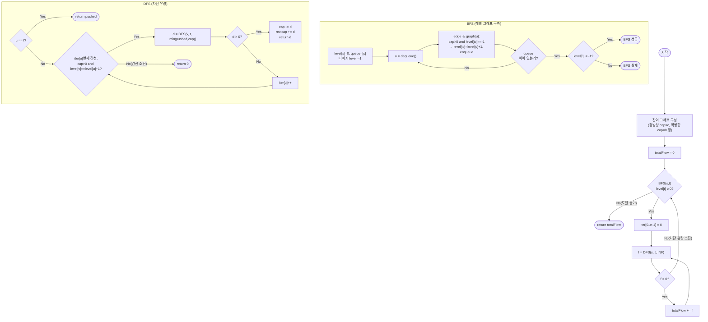

import { AlgorithmSimulation } from "#guide-sim";

# 최대 유량(Dinic's Algorithm) — 레이어 그래프로 최단 경로들을 한꺼번에 비우면 라운드 수가 V로 묶이는 이유

## 한눈에 보는 컨셉

유량 네트워크에서 소스 `s`부터 싱크 `t`까지 흘릴 수 있는 최댓값을 구하는 문제예요. 핵심 관찰은 두 가지입니다 — 되돌릴 수 있는 역방향 간선으로 잘못 흘린 유량을 취소할 자유를 확보하고, `BFS`로 만든 레이어 그래프 안의 모든 최단 증가 경로를 `DFS`로 한 라운드에 몽땅 소진하는 것이죠. 이렇게 하면 라운드가 거듭될 때마다 최단 경로 길이가 반드시 늘어나 라운드 수가 최대 `O(V)`로 묶이고, 전체는 `O(V^2 E)`에 끝납니다.

## 출발점: 가장 순진한 방법부터

문제를 먼저 정확히 잡을게요.

```ts
function maxFlow(
  n: number,
  edges: [number, number, number][],
  source: number,
  sink: number,
): { flow: number }
```

| 매개변수 | 의미 | 제약 |
|----------|------|------|
| `n` | 정점 개수 (인덱스 `0..n-1`) | $2 \leq n \leq 500$ |
| `edges` | 방향 간선 `[u, v, c]` (용량 `c`) | $0 \leq E \leq 10^4$, $0 \leq c \leq 10^6$ |
| `source` | 소스 `s` | $0 \leq s < n$, $s \neq t$ |
| `sink` | 싱크 `t` | $0 \leq t < n$, $s \neq t$ |
| 반환값 | `{ flow }`: `s`에서 `t`로의 최대 유량 | — |

최댓값을 구하는 문제를 처음 마주하면 가장 정직한 접근은 이겁니다 — 아무 `s → t` 경로나 하나 찾아서, 그 경로가 버틸 수 있는 만큼(경로 위 최소 용량, 즉 병목)만 흘리고, 더 흘릴 경로가 없을 때까지 반복하는 것이죠. 이게 Ford-Fulkerson입니다.

```ts
function maxFlowNaive(
  n: number,
  edges: [number, number, number][],
  source: number,
  sink: number,
): { flow: number } {
  type Edge = { to: number; cap: number; rev: number };
  const graph: Edge[][] = Array.from({ length: n }, () => []);
  const addEdge = (u: number, v: number, c: number) => {
    graph[u].push({ to: v, cap: c, rev: graph[v].length });
    graph[v].push({ to: u, cap: 0, rev: graph[u].length - 1 }); // 역방향, 초기 용량 0
  };
  for (const [u, v, c] of edges) addEdge(u, v, c);

  function dfs(u: number, t: number, pushed: number, visited: boolean[]): number {
    if (u === t) return pushed;
    visited[u] = true;
    for (const edge of graph[u]) {
      if (edge.cap > 0 && !visited[edge.to]) {
        const d = dfs(edge.to, t, Math.min(pushed, edge.cap), visited);
        if (d > 0) {
          edge.cap -= d;
          graph[edge.to][edge.rev].cap += d;
          return d;
        }
      }
    }
    return 0;
  }

  let totalFlow = 0;
  while (true) {
    const visited = new Array(n).fill(false);
    const f = dfs(source, sink, Infinity, visited);
    if (f === 0) break; // 더 흘릴 경로가 없다
    totalFlow += f;
  }
  return { flow: totalFlow };
}
```

문제는 "아무 경로나"입니다. 어떤 간선을 먼저 만나느냐에 따라 반복 횟수가 크게 갈려요. 소스 `s`, 중간 정점 `a`, `b`, 싱크 `t`로 이루어지고 `s-a`, `s-b`, `a-t`, `b-t` 용량이 모두 4이며 `a-b`를 잇는 용량 1짜리 다리가 하나 있는 그래프로 직접 확인해 봤습니다(진짜 최대 유량은 `s-a-t`로 4, `s-b-t`로 4를 보내는 8입니다).

```text
간선을 [s→a, a→t, s→b, b→t, a→b] 순서로 만나면(다리를 마지막에 만남):
  DFS 반복 2회로 flow=8 (s-a-t로 4, s-b-t로 4) — 실측

간선을 [s→a, s→b, a→b, b→t, a→t] 순서로 만나면(다리를 먼저 만남):
  1) s-a-b-t (+1, 다리가 병목)
  2) s-a-t   (+3, 남은 a-t 용량)
  3) s-b-a-t (+1, 역방향 간선으로 다리를 "되돌려" 사용)
  4) s-b-t   (+3, 남은 b-t 용량)
  DFS 반복 4회로 같은 flow=8 — 실측
```

같은 그래프, 같은 답인데 간선을 만나는 순서만 달라도 반복 횟수가 2배로 뛰었습니다. 이건 아주 작은 예일 뿐이고, 정점 500개·용량 $10^6$ 규모로 커지면 이 순서 의존성이 반복 횟수를 최대 $|f^*|$(최대 유량 값)까지 밀어 올릴 수 있다는 것이 표준적으로 알려진 결과예요. 최대 유량은 소스에서 나가는 총 용량을 넘을 수 없으므로 $|f^*| = O(V \cdot c) = O(500 \times 10^6) = O(5 \times 10^8)$ 수준까지 갈 수 있고, 반복마다 그래프를 훑는 비용까지 곱하면 시간 제한(1초) 안에 들어올 수 없습니다.

**낌새**: 반복 횟수를 순서에 휘둘리지 않게 만들려면 "아무 경로"가 아니라 "가장 짧은 경로"를 체계적으로 골라야 하지 않을까요? 그리고 한 번 훑은 그래프에서 짧은 경로를 하나만 쓰고 버리는 것도 아까워 보입니다.

## 아이디어 자세히 들여다보기

### 잔여 그래프와 역방향 간선 — 수식과 그림

naive 코드에 이미 잔여 그래프(residual graph)가 등장했습니다. 정식으로 정의해 볼게요. 원래 간선 $(u \to v, c)$마다 인접 리스트에 두 항목을 짝지어 넣습니다.

$$
\text{정방향}: \{\text{to}: v,\ \text{cap}: c,\ \text{rev}: i_v\}, \qquad
\text{역방향}: \{\text{to}: u,\ \text{cap}: 0,\ \text{rev}: i_u\}
$$

여기서 $i_v, i_u$는 서로의 인접 리스트 안 위치(인덱스)이고, `cap`은 "지금 이 방향으로 더 흘릴 수 있는 여유"를 뜻합니다. 대표 예시 `n=4`, `edges=[[0,1,3],[0,2,2],[1,2,1],[1,3,2],[2,3,3]]`, `source=0`, `sink=3`로 그림을 그려 보면 이렇습니다.

```text
초기 잔여 그래프 (실측):
  0 --3--> 1        0 --2--> 2        1 --1--> 2        1 --2--> 3        2 --3--> 3
  1 <-0-- 0(역)      2 <-0-- 0(역)      2 <-0-- 1(역)      3 <-0-- 1(역)      3 <-0-- 2(역)

경로 0→1→3에 2단위를 흘린 뒤(Before → After):
  Before: cap(0→1)=3, cap(1→0)=0, cap(1→3)=2, cap(3→1)=0
  After : cap(0→1)=1, cap(1→0)=2, cap(1→3)=0, cap(3→1)=2
```

이 표현이 "왜 하필 이 형태여야 하는가"를 짚어 볼게요. 대안으로 `f(u,v)` 하나만 따로 배열에 저장해 두고 매번 `c(u,v) - f(u,v)`를 계산하는 방식도 생각해 볼 수 있습니다. 하지만 이러면 병렬 간선(같은 `u→v` 쌍이 여러 개)을 구분할 수 없고, 역방향 갱신 시 어떤 원래 간선에 대응하는지 찾으려면 매번 탐색이 필요해요. `rev` 인덱스로 정방향·역방향을 짝지어 두면 유량을 흘릴 때 `edge.cap -= d; graph[edge.to][edge.rev].cap += d;` 단 두 줄로 양쪽을 $O(1)$에 갱신할 수 있고, 병렬 간선도 각각 독립된 객체라 자연스럽게 처리됩니다.

확인 질문 하나만 해 볼까요? 위 예시에서 `0→2`로 아직 아무것도 안 흘렸다면, `2→0` 방향의 잔여 용량은 얼마일까요? (정답: 역방향 간선은 초기 용량이 항상 0이므로, 0입니다 — 아직 취소할 유량 자체가 없으니까요.)

### 단서를 설명해 주는 이론 — 레이어 그래프와 최단 증가 경로

두 번째 단서("한 번 훑은 그래프에서 최단 경로를 여러 개 한꺼번에 쓰고 싶다")를 해소하는 재료는 이미 이론화되어 있습니다.

**최단 증가 경로 정리(Edmonds-Karp의 핵심)**: 매 반복마다 `BFS`로 "지금 잔여 그래프에서 가장 짧은" `s → t` 경로를 골라 흘리면, 한 경로를 처리할 때마다 잔여 그래프에서의 최단 경로 길이가 절대 줄어들지 않고, 증가하는 시점이 반드시 유한 번(최대 `O(V)`번) 존재합니다. 이 사실만으로 반복 횟수를 `O(VE)`로 묶을 수 있어요(Edmonds-Karp는 `O(VE^2)`, 매 반복 BFS 비용 `O(E)`를 곱해서).

Dinic's algorithm은 여기서 한 걸음 더 나갑니다. "가장 짧은 경로 하나"만 쓰고 버리는 대신, `BFS`로 소스에서 각 정점까지의 최단 거리를 레벨로 매겨 **레이어 그래프**(같은 레벨 차이 1인 간선만 남긴 부분 그래프)를 만들고, 그 안에 있는 **모든** 최단 증가 경로를 `DFS`로 한 라운드에 전부 소진합니다(이를 차단 유량, blocking flow라 불러요). 레이어 그래프 안의 경로를 다 쓰고 나면 다시 `BFS`로 레벨을 새로 매기는데, 이때 최단 경로 길이가 반드시 한 단계 이상 늘어난다는 것이 핵심 정당성입니다(왜 그런지는 다음 절에서 귀납적으로 보입니다). 이 사실 덕분에 `BFS` 라운드 수 자체가 최대 `V-1`회로 제한되고, 한 라운드 안에서 여러 경로를 동시에 처리하니 Edmonds-Karp보다 실전에서 훨씬 빠릅니다. **이 "레벨이 고정된 라운드 안에서는 실패한 간선이 다시 성공할 수 없다"는 성질을 기억해 두세요** — 뒤의 최적화 절에서 다시 씁니다.

### 셈을 맡는 자료구조 — 인접 리스트(잔여 그래프)

이 문제에서 필요한 보조 자료구조는 잔여 그래프를 저장하는 인접 리스트입니다. 정점마다 이어지는 간선 목록을 배열로 들고 있고, 각 간선 객체가 `rev` 인덱스로 자신의 역방향 짝을 직접 가리켜야 위에서 본 $O(1)$ 갱신이 가능해요. 인접 리스트 자체의 일반적인 성질(순회 비용, 인접 행렬 대비 장단점)은 이 프로젝트의 [graphAdjList 가이드](../../../data-structures/graph-repr/graphAdjList/graphAdjList-guide.mdx)를 참고하세요 — 여기서는 "정점당 나가는 간선을 $O(\deg(u))$에 순회할 수 있는 목록"으로만 쓰면 충분합니다.

### 왜 모순 없이 작동하는가

이 알고리즘이 지키는 약속은 하나입니다.

> 잔여 그래프에 `s → t` 경로가 더 이상 없으면, 지금까지 흘린 `totalFlow`가 곧 최대 유량이다.

**기저**: 라운드를 아예 시작하기 전, 잔여 그래프는 원래 그래프와 같습니다. 이 상태에서 `BFS`가 `t`에 도달하지 못하면(`level[t] = -1`) 애초에 `s`에서 `t`로 가는 경로 자체가 없다는 뜻이므로 `totalFlow = 0`이 곧 최대 유량입니다(경로가 없으니 더 늘릴 수도 없어요).

**귀납 단계**: 라운드 $r$에서 `BFS`가 만든 최단 거리가 $d_r$이고, 그 레이어 그래프 안의 차단 유량을 `DFS`로 모두 소진했다고 합시다. 다음 라운드 $r+1$의 `BFS`가 만드는 최단 거리 $d_{r+1}$은 반드시 $d_{r+1} > d_r$이거나, `t`에 아예 도달하지 못합니다 — 이 두 가지 말고 다른 경우는 없습니다(거리는 정수이고 이전 라운드보다 줄어들 수는 없으니까요 — 줄어들려면 레이어 그래프에 없던 더 짧은 간선이 새로 생겨야 하는데, 라운드 안에서 새로 생기는 간선은 오직 역방향 간선뿐이고 역방향 간선은 항상 "레벨이 1 낮은 정점"으로만 이어져 있어 더 짧은 지름길을 만들지 못합니다).
- **도달 못 하는 경우**: 기저와 같은 논리로 지금의 `totalFlow`가 최대 유량입니다.
- **거리가 늘어나는 경우**: 레이어 그래프 안의 모든 최단 경로를 차단 유량으로 소진했으므로, 다음으로 남은 `s → t` 경로가 있다면 그 경로 위 최소 한 구간은 이전 레벨 배치로는 갈 수 없던 (한 단계 이상 우회하는) 구간이어야 합니다. 즉 다음 최단 경로는 반드시 더 길어요. 거리는 최대 $n-1$까지만 커질 수 있으므로, 이 과정은 최대 $n-1$번만 반복되고 반드시 멈춥니다. 멈추는 순간은 "도달 못 하는 경우"이므로 그때 `totalFlow`가 최대 유량임이 보장됩니다.

**여기서 헷갈리기 쉬운 포인트는 역방향 간선이 그냥 구현 디테일이 아니라 정답 자체를 좌우한다는 것입니다.** `s=0,a=1,b=2,t=3`이고 `s-a=1, s-b=1, a-b=1, a-t=1, b-t=1`인 그래프로 직접 실측해 보면(진짜 최대 유량은 `s-a-t`로 1, `s-b-t`로 1을 더해 2입니다):

```text
역방향 간선을 정상적으로 갱신 →           { flow: 2 }   (정답)
역방향 간선의 cap을 절대 늘리지 않음(취소 불가) → { flow: 1 }   (오답)
```

무슨 일이 벌어진 걸까요? DFS가 먼저 `s-a-b-t` 경로(다리 `a-b`가 병목, 1단위)를 흘려버리면 `a-t`와 `b-t`는 아직 안 썼는데도 `a-b` 다리가 막혀 버립니다. 역방향 간선 `b→a`가 없으면 `s`에서 `b`로 간 다음 되돌아 나갈 방법이 `b-t`(이미 이 경로에선 안 쓰임)뿐이라 막다른 길이고, 알고리즘은 `flow=1`에서 멈춰 버려요. 역방향 간선이 있으면 `s-b-a-t`(다리를 거꾸로 "취소"하며 지나가는 경로)로 1단위를 더 보내 `flow=2`에 도달합니다.

**두 번째 헷갈리기 쉬운 포인트는 `cap > 0` 검사를 `BFS`와 `DFS` 양쪽에서 빠뜨리면 안 된다는 것입니다.** 위 대표 예시에서 두 번째 라운드가 끝나면 `0→1` 간선은 완전히 포화(`cap=0`)됩니다. 이때 `cap > 0` 체크 없이 `BFS`가 진행되면 포화된 `0→1` 간선을 타고도 `level[1]=1`을 매겨 버리고, `DFS`는 그 레벨을 믿고 `0→1`을 다시 시도하지만 실제로는 `cap=0`이라 항상 `d=0`만 돌려줍니다 — 유량은 하나도 늘지 않는데 그 레벨 배치 자체가 거짓이 되어 위 귀납 논증("레벨이 실제 잔여 그래프의 최단 거리와 일치한다")이 깨집니다.

엣지 케이스도 실측으로 확인해 둘게요.

```text
source === sink (문제 제약상 오지 않지만 방어)  → { flow: 0 }
간선이 아예 없음                                → { flow: 0 }
간선은 있으나 싱크로 가는 경로가 없음            → { flow: 0 }
같은 u→v 쌍의 병렬 간선(cap 3, cap 4)           → { flow: 7 }  (용량이 합산되는 효과)
```

## 아이디어를 코드로 옮기기

위 아이디어(잔여 그래프 + `BFS` 레이어 + `DFS` 차단 유량)를 그대로 옮기면 이렇습니다. 아직 최적화는 하지 않은 기본 구현이에요.

```ts
function maxFlowDinicBasic(
  n: number,
  edges: [number, number, number][],
  source: number,
  sink: number,
): { flow: number } {
  if (source === sink) return { flow: 0 }; // 방어: 유량 정의상 0
  type Edge = { to: number; cap: number; rev: number };
  const graph: Edge[][] = Array.from({ length: n }, () => []);
  const addEdge = (u: number, v: number, c: number) => {
    graph[u].push({ to: v, cap: c, rev: graph[v].length });
    graph[v].push({ to: u, cap: 0, rev: graph[u].length - 1 });
  };
  for (const [u, v, c] of edges) addEdge(u, v, c);

  function bfsLevel(s: number): number[] {
    const level = new Array(n).fill(-1);
    level[s] = 0;
    const queue = [s];
    let qi = 0;
    while (qi < queue.length) {
      const u = queue[qi++]!;
      for (const edge of graph[u]) {
        if (edge.cap > 0 && level[edge.to] === -1) {
          level[edge.to] = level[u] + 1;
          queue.push(edge.to);
        }
      }
    }
    return level;
  }

  function dfs(u: number, t: number, pushed: number, level: number[]): number {
    if (u === t) return pushed;
    for (const edge of graph[u]) {
      if (edge.cap > 0 && level[edge.to] === level[u] + 1) {
        const d = dfs(edge.to, t, Math.min(pushed, edge.cap), level);
        if (d > 0) {
          edge.cap -= d;
          graph[edge.to][edge.rev].cap += d;
          return d;
        }
      }
    }
    return 0;
  }

  let totalFlow = 0;
  while (true) {
    const level = bfsLevel(source);
    if (level[sink] === -1) break; // 더 이상 s→t 경로 없음 → 종료
    while (true) {
      const f = dfs(source, sink, Infinity, level);
      if (f === 0) break; // 이 레이어 그래프의 차단 유량 소진
      totalFlow += f;
    }
  }
  return { flow: totalFlow };
}
```

가장 실수가 잦은 부분은 `dfs` 안의 필터 조건 `edge.cap > 0 && level[edge.to] === level[u] + 1`입니다. 둘 중 하나라도 빠뜨리면 조용히 틀립니다 — `cap > 0`을 빼면 포화된 간선을 타고 거짓 레벨/거짓 경로를 만들고, `level` 조건을 빼면 레이어 그래프를 벗어난(최단이 아닌) 경로까지 흘려 보내 앞 절의 "거리가 반드시 늘어난다"는 논증이 깨집니다. 그 다음으로 중요한 지점은 `level`을 라운드마다(바깥 `while`이 한 번 돌 때마다) 새로 계산한다는 것이에요 — 이전 라운드의 `level`을 재사용하면 이미 소진된 레이어 그래프를 계속 파게 됩니다.

## 더 빠르게 만들 단서 찾기

이 기본 구현을 그대로 큰 그래프에 돌려 보면 낭비가 보입니다. `dfs`가 호출될 때마다 `graph[u]`를 **처음(인덱스 0)부터** 훑어요. 그런데 앞 절 이론에서 짚었듯, 같은 라운드 안에서는 레벨이 고정돼 있으므로 한 번 `cap > 0 && level 조건`을 만족하지 못해 실패한 간선은 그 라운드가 끝날 때까지 다시 시도해도 똑같이 실패합니다. 이걸 무시하고 매번 처음부터 훑으면 이미 실패로 판명 난 간선을 계속 다시 확인하는 셈이죠.

정점 30개, 간선 135개짜리 중간 밀도 그래프로 실측해 보면 이 낭비가 뚜렷합니다(최종 `flow`는 15로 동일).

```text
기본 구현(매번 처음부터 재스캔):   간선 시도 횟수 = 12081회
iter 포인터로 이어서 스캔(다음 절):  간선 시도 횟수 = 1020회

같은 답, 같은 라운드 수인데 간선을 "보는" 횟수가 약 12배 차이난다
```

## 단서를 최적화로 연결하기

정점마다 "다음에 시도할 간선의 인덱스"를 별도 배열 `iter[u]`로 들고 다니면 됩니다. 실패한 간선은 건너뛰고 다시는 보지 않는 거예요. 라운드가 바뀔 때(레벨이 새로 계산될 때)만 `iter`를 전부 0으로 되돌립니다 — 새 레이어 그래프에서는 이전에 실패했던 간선이 다시 유효할 수 있으니까요.

```text
Before (매 dfs 호출마다 0부터):
  dfs(u) 호출1: iter 무시,  graph[u][0], graph[u][1], graph[u][2](성공) 순서로 확인
  dfs(u) 호출2: iter 무시,  graph[u][0](실패, 재확인), graph[u][1](실패, 재확인), graph[u][2](포화) ...

After (iter[u]가 다음 시작점을 기억):
  dfs(u) 호출1: iter[u]=0에서 시작, graph[u][2]에서 성공 → iter[u]는 2에 머무름
  dfs(u) 호출2: iter[u]=2부터 시작 → graph[u][0], [1]은 다시 보지 않는다
```

불변식은 "`iter[u]`는 한 라운드 안에서 단조 증가하며, `iter[u]`보다 작은 인덱스의 간선은 이 라운드에서 이미 실패했거나 포화됐다"입니다. 이 불변식 덕분에 한 라운드에서 정점 `u`가 훑는 간선의 총합은 최대 $\deg(u)$번이고, 모든 정점을 더하면 라운드당 간선 스캔 비용이 $O(E)$로 줄어듭니다.

## 최적화 코드

바뀌는 곳은 `iter` 배열 추가, `dfs`의 순회 방식, 그리고 라운드 시작 시 `iter` 초기화 세 곳입니다.

```ts
const level = new Array(n).fill(-1);
const iter = new Array(n).fill(0); // 정점별 "다음에 시도할 간선 인덱스"

function dfs(u: number, t: number, pushed: number): number {
  if (u === t) return pushed;
  for (; iter[u] < graph[u].length; iter[u]++) { // 이어서 스캔, 실패해야만 전진
    const edge = graph[u][iter[u]]!;
    if (edge.cap > 0 && level[edge.to] === level[u] + 1) {
      const d = dfs(edge.to, t, Math.min(pushed, edge.cap));
      if (d > 0) {
        edge.cap -= d;
        graph[edge.to][edge.rev].cap += d;
        return d; // 성공 시 iter[u]는 그대로 — 같은 간선이 아직 여유 있을 수 있다
      }
    }
  }
  return 0;
}

// 바깥 루프: 라운드가 바뀔 때만 iter를 초기화한다
let totalFlow = 0;
bfs(source);
while (level[sink] !== -1) {
  iter.fill(0); // 새 레이어 그래프 → 이전 라운드의 실패 기록은 무의미
  let f: number;
  while ((f = dfs(source, sink, Infinity)) > 0) totalFlow += f;
  bfs(source);
}
```

**가장 중요한 줄은 `for (; iter[u] < graph[u].length; iter[u]++)`입니다.** 이걸 예전처럼 `for (const edge of graph[u])`로 되돌리면 코드는 여전히 "정답은" 냅니다 — 그런데 조용히 라운드당 `O(V·E)`짜리 재스캔으로 되돌아가는 성능 회귀입니다. 겉보기엔 멀쩡한데 큰 입력에서만 느려지는 함정이라 테스트로 잡기 어려워요.

> 기억법: 라운드가 바뀔 때만 `iter`를 0으로, 라운드 안에서는 절대 되돌리지 않는다.

**추가로 최적화할 여지가 있을까요?** Dinic's algorithm 자체로는 여기가 사실상 끝입니다. `iter` 포인터로 한 라운드의 간선 재스캔 비용을 `O(E)`로 눌렀고, 앞서 증명한 대로 라운드 수는 최대 `V-1`번이므로 전체는 `O(V^2 E)`입니다. $n=500, E=10^4$ 대입 시 이론적 상한은 $O(500^2 \times 10^4) = O(2.5 \times 10^9)$로 커 보이지만, 실제로는 라운드마다 차단 유량이 훨씬 빨리 소진되고(레이어 그래프가 진행될수록 좁아짐) 단위 용량 그래프에서는 `O(E\sqrt{V})`가 보장되는 등, 실전 성능은 이론적 상한보다 훨씬 낫습니다. 참고로 "최대 유량"이라는 문제 자체에는 링크-컷 트리를 쓰는 `O(VE \log V)` 변형이나 Push-Relabel 계열(`O(V^2\sqrt{E})`) 같은 더 정교한 특화 해법도 존재합니다. 그럼에도 Dinic's를 표준으로 배우는 이유는 **일반성과 구현 난이도의 균형**이에요 — 특수한 자료구조 없이 인접 리스트와 배열 두 개(`level`, `iter`)만으로 이론적으로도, 실전에서도 충분히 빠른 답을 냅니다.

## 실행 시각화

방향 네트워크 `n = 4`, `edges = [[0,1,3], [0,2,2], [1,2,1], [1,3,2], [2,3,3]]`, `source = 0`, `sink = 3`에 대해 최적화된 Dinic's로 최대 유량을 구하는 과정입니다. 그래프 패널의 간선 가중치는 현재 잔여 용량이고, `activeEdge`(빨강)는 현재 증가 경로에서 유량을 흘리는 간선, `nodeValue`는 `BFS` 레벨입니다. `keyValue` 패널은 누적 유량과 현재 증가 경로 스냅샷이에요. 실제 반환값은 `{ flow: 5 }`이며(위 최적화 코드로 직접 실행해 확인했습니다), 시뮬레이션 마지막 프레임의 `totalFlow`와 일치합니다.

> 대화형 시뮬레이션은 MDX 런타임에서 표시됩니다.

export const nodes = [
  { id: 0, label: "s(0)", x: 12, y: 50 },
  { id: 1, label: "1", x: 45, y: 18 },
  { id: 2, label: "2", x: 45, y: 82 },
  { id: 3, label: "t(3)", x: 80, y: 50 },
];

export const mkEdges = (c01, c02, c12, c13, c23) => [
  { from: 0, to: 1, weight: c01, directed: true },
  { from: 0, to: 2, weight: c02, directed: true },
  { from: 1, to: 2, weight: c12, directed: true },
  { from: 1, to: 3, weight: c13, directed: true },
  { from: 2, to: 3, weight: c23, directed: true },
];

export const steps = [
  {
    title: "초기화: 잔여 그래프",
    detail: "각 간선에 정방향(cap=c)·역방향(cap=0) 쌍 추가. totalFlow=0.",
    nodes, edges: mkEdges(3, 2, 1, 2, 3),
    nodeStatus: { 0: "active", 3: "frontier" },
    entries: [
      { label: "totalFlow", value: "0" },
      { label: "잔여 (01,02,12,13,23)", value: "3,2,1,2,3" },
    ],
  },
  {
    title: "BFS 레벨 (라운드 1)",
    detail: "level: s=0, 1=1, 2=1, t=2. t 도달 가능 → 레이어 그래프 구성.",
    nodes, edges: mkEdges(3, 2, 1, 2, 3),
    nodeStatus: { 0: "visited", 1: "frontier", 2: "frontier", 3: "frontier" },
    nodeValue: { 0: 0, 1: 1, 2: 1, 3: 2 },
    entries: [
      { label: "level", value: "[0, 1, 1, 2]" },
      { label: "totalFlow", value: "0" },
    ],
  },
  {
    title: "증가 경로 0→1→3 (+2)",
    detail: "병목 min(cap 0-1=3, 1-3=2)=2. 유량 2를 흘림. 잔여: 0-1=1, 1-3=0.",
    nodes, edges: mkEdges(1, 2, 1, 0, 3),
    nodeStatus: { 0: "active", 1: "active", 3: "active" },
    nodeValue: { 0: 0, 1: 1, 2: 1, 3: 2 },
    activeEdge: { from: 1, to: 3 },
    entries: [
      { label: "경로", value: "0 → 1 → 3 (+2)" },
      { label: "totalFlow", value: "2" },
    ],
  },
  {
    title: "증가 경로 0→2→3 (+2)",
    detail: "병목 min(cap 0-2=2, 2-3=3)=2. 유량 2를 흘림. 잔여: 0-2=0, 2-3=1.",
    nodes, edges: mkEdges(1, 0, 1, 0, 1),
    nodeStatus: { 0: "active", 2: "active", 3: "active" },
    nodeValue: { 0: 0, 1: 1, 2: 1, 3: 2 },
    activeEdge: { from: 2, to: 3 },
    entries: [
      { label: "경로", value: "0 → 2 → 3 (+2)" },
      { label: "totalFlow", value: "4" },
    ],
  },
  {
    title: "라운드 1 차단 유량 소진",
    detail: "레이어 그래프 내 더 흘릴 경로 없음(0-1만 잔여, 1-3 포화). 다시 BFS.",
    nodes, edges: mkEdges(1, 0, 1, 0, 1),
    nodeStatus: { 0: "visited", 1: "visited", 2: "visited", 3: "visited" },
    nodeValue: { 0: 0, 1: 1, 2: 1, 3: 2 },
    entries: [
      { label: "totalFlow", value: "4" },
      { label: "상태", value: "라운드 1 종료" },
    ],
  },
  {
    title: "BFS 레벨 (라운드 2)",
    detail: "잔여로 재탐색. level: s=0, 1=1, 2=2(1→2), t=3(2→3). 더 긴 경로 등장.",
    nodes, edges: mkEdges(1, 0, 1, 0, 1),
    nodeStatus: { 0: "visited", 1: "frontier", 2: "frontier", 3: "frontier" },
    nodeValue: { 0: 0, 1: 1, 2: 2, 3: 3 },
    entries: [
      { label: "level", value: "[0, 1, 2, 3]" },
      { label: "totalFlow", value: "4" },
    ],
  },
  {
    title: "증가 경로 0→1→2→3 (+1)",
    detail: "병목 min(0-1=1, 1-2=1, 2-3=1)=1. 유량 1을 흘림. 잔여 0-1=0.",
    nodes, edges: mkEdges(0, 0, 0, 0, 0),
    nodeStatus: { 0: "active", 1: "active", 2: "active", 3: "active" },
    nodeValue: { 0: 0, 1: 1, 2: 2, 3: 3 },
    activeEdge: { from: 2, to: 3 },
    entries: [
      { label: "경로", value: "0 → 1 → 2 → 3 (+1)" },
      { label: "totalFlow", value: "5" },
    ],
  },
  {
    title: "BFS 라운드 3: t 도달 불가",
    detail: "0의 정방향 잔여 용량이 모두 0 → level[t]=-1. 루프 종료.",
    nodes, edges: mkEdges(0, 0, 0, 0, 0),
    nodeStatus: { 0: "active", 1: "default", 2: "default", 3: "default" },
    entries: [
      { label: "level[t]", value: "-1 (도달 불가)" },
      { label: "totalFlow", value: "5" },
    ],
  },
  {
    title: "완료: flow = 5",
    detail: "소스 컷(0-1, 0-2) 합 3+2=5 = 싱크 컷(1-3, 2-3) 합 2+3=5. 최대 유량 5.",
    nodes, edges: mkEdges(0, 0, 0, 0, 0),
    nodeStatus: { 0: "visited", 1: "visited", 2: "visited", 3: "visited" },
    entries: [
      { label: "반환값", value: "{ flow: 5 }" },
    ],
  },
];

<AlgorithmSimulation view={["graph", "keyValue"]} steps={steps} title="Dinic's Max Flow: s=0, t=3" />

## 흐름 한눈에 보기



**핵심 불변식**: `BFS` 이후 `level[t]`는 현재 잔여 그래프에서 `s → t` 최단 거리를 나타내며, `DFS`는 `level[v] == level[u]+1`인 간선만 따라갑니다. `iter[u]`의 단조 증가로 각 차단 유량 라운드의 총 `DFS` 비용은 `O(V·E)`가 아닌 `O(E)`로 제한됩니다.

## 스스로 점검하기

1. `n=3`, `edges=[[0,1,5],[1,2,3],[0,2,1]]`, `source=0`, `sink=2`일 때 최대 유량을 손으로 구해 보세요. (힌트: `0→1→2` 경로와 `0→2` 직접 경로를 함께 써야 합니다. 정답은 4입니다 — `0→1→2`로 3, `0→2`로 1.)
2. 위 대표 예시(`n=4`)에서 `cap > 0` 체크를 `DFS`에서만 빼고 `BFS`에는 남겨 두면 어떤 일이 벌어질까요? 라운드 2가 끝난 뒤 `0→1` 간선(`cap=0`)을 `DFS`가 다시 밟으려 시도하는 지점을 짚고, 그 시도가 왜 매번 `d=0`으로 끝나는지 설명해 보세요.
3. 만약 간선이 무방향(양방향 모두 용량 `c`만큼 흘릴 수 있음)이라면, 이 알고리즘의 잔여 그래프 표현을 어떻게 바꿔야 할까요? (힌트: 무방향 간선 하나를 방향 간선 두 개로 쪼개어 넣는 방법과, 그때 역방향 간선의 초기 용량이 0이 아니라 `c`가 되어야 하는 이유를 생각해 보세요.)
