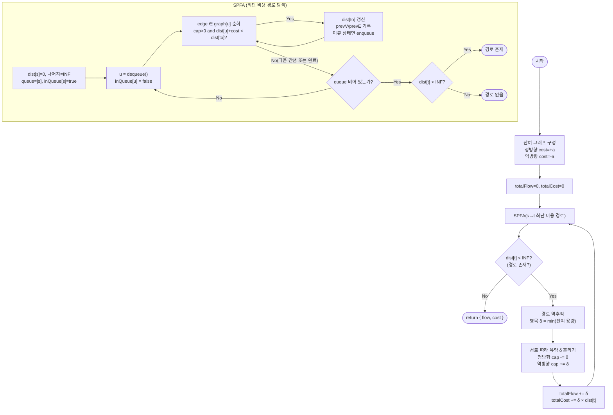

import { AlgorithmSimulation } from "#guide-sim";

# minCostMaxFlow — 가장 싼 경로부터 채우면 전체 비용이 최소가 되는 이유

## 한눈에 보는 컨셉

용량과 단위 비용이 함께 붙은 유량 네트워크에서, **최대 유량을 유지하면서 총 비용을 최소화**하는 문제예요. 핵심 관찰은 하나입니다 — 매 반복마다 잔여 그래프에서 가장 저렴한 `s → t` 경로를 찾아 병목만큼 흘리고, 이를 더 흘릴 경로가 없을 때까지 반복하면 결과가 항상 최적이라는 것입니다. 기본 구현은 `O(K·V·E)`(`K`는 반복 횟수), 뒤에서 만들 최적화 버전은 `O(K·E log V)`까지 좁혀집니다.

## 출발점: 가장 순진한 방법부터

문제를 먼저 정확히 잡을게요.

```ts
function minCostMaxFlow(
  n: number,
  edges: [number, number, number, number][],
  source: number,
  sink: number,
): { flow: number; cost: number }
```

| 매개변수 | 의미 | 제약 |
|----------|------|------|
| `n` | 정점 개수 (인덱스 `0..n-1`) | `2 ≤ n ≤ 200` |
| `edges` | 방향 간선 `[u, v, c, a]` (용량 `c`, 단위 비용 `a`) | `0 ≤ E ≤ 2000`, `0 ≤ c, a ≤ 10^4` |
| `source` / `sink` | 소스 / 싱크 | `source ≠ sink` |
| 반환값 | `{ flow, cost }` | 최대 유량과 그 유량을 만드는 최소 비용 |

경로가 없으면 `{ flow: 0, cost: 0 }`을 돌려줍니다. 원래 간선에 음수 비용은 없다고 가정해요(음수 사이클 방지).

시간 제한 1초 안에서 이 규모가 감당되는지 미리 가늠해 볼게요. `V ≤ 200`, `E ≤ 2000`이니 SPFA 한 라운드는 최악 `V·E = 200 × 2000 = 4×10^5`번의 완화 연산입니다. SSP 반복 횟수 `K`(경로를 찾아 흘리는 횟수)가 수백 회 수준이면 총 연산은 `10^8` 안쪽으로 들어와 1초 제한을 통과할 수 있어요. 뒤에서 SPFA를 포텐셜 기반 Dijkstra로 바꾸면 라운드당 비용이 `O(E log V)`(약 `2000 × log(200) ≈ 1.5×10^4`)로 더 줄어듭니다.

앞으로 계속 쓸 작은 네트워크 하나를 정해 둘게요.

```text
edges (u -> v : cap, cost)

        (1,1)         (1,4)
   0 ─────────► 1 ─────────► 3
   │             │             ▲
   │(2,1)        │(1,1)        │
   │             ▼             │(3,1)
   └───────────► 2 ────────────┘
```

가장 정직한 방법은 "최대 유량을 만드는 모든 유량 함수를 나열하고 그중 비용이 최소인 것을 고른다"입니다.

```
naive:
  for each feasible flow f with |f| = |f*|:
    minCost = min(minCost, cost(f))
  return minCost
```

이 네트워크만 봐도 최대 유량 `3`을 만드는 경로 조합이 하나가 아닙니다. `0→1→3`(용량 1), `0→2→3`(용량 2), `0→1→2→3`(용량 1, 앞 두 경로와 간선을 나눠 씀)이 서로 경쟁하고, 조합 방식에 따라 비용이 달라져요. 용량이 커지고 간선이 늘어나면 조합 수는 지수적으로 불어나 열거가 불가능해집니다(용량 $c$, 간선 $E$ 기준 최악 $O(c^E)$ 수준).

**낭비의 정체는 순서에도 있습니다.** 비용을 고려하지 않고 아무 증가 경로나 잡아 흘리면, 값싼 자원을 비싼 조합에 먼저 써버려서 나중에 더 쌀 수도 있었던 조합을 놓칩니다. 예를 들어 DFS로 처음 찾아지는 경로를 그냥 흘려 보면:

```text
1차 시도(경로 우선순위 없이): 0→1→3 (cap1) 먼저 발견 → 1단위 흘림, 비용 1+4=5
                          0→2→3 (cap2) 다음 발견 → 2단위 흘림, 비용 (1+1)×2=4
                          총 flow=3, cost=5+4=9

같은 최대 유량 3인데, 경로 순서만 바꾸면?
최단 비용 우선: 0→2→3 (cap2, 단위비용2) 먼저 → 2단위, 비용 4
             0→1→2→3 (cap1, 단위비용3) 다음 → 1단위, 비용 3
             총 flow=3, cost=4+3=7   ← 더 싸다!
```

같은 최대 유량 `3`인데 순서만 바꿔도 비용이 `9`와 `7`로 갈립니다(둘 다 `bun`으로 실측 확인한 값이에요). **"매번 가장 싼 경로부터 흘리면 이 차이가 사라지지 않을까?"** — 이것이 이번 알고리즘의 출발 단서입니다.

## 아이디어 자세히 들여다보기

### 잔여 그래프와 최단 비용 경로 — 수식과 그림

먼저 비용을 정식으로 적어 둘게요. 유량 함수 $f$의 총 비용은

$$
\text{cost}(f) = \sum_{(u,v) \in E} a(u,v) \cdot f(u,v)
$$

이고, 우리가 원하는 답은 최대 유량 $|f^*|$을 만드는 유량 함수들 중 이 비용이 최소인 것입니다.

$$
\text{minCostMaxFlow}(G, s, t) = \min_{\substack{f \text{ feasible} \\ |f| = |f^*|}} \text{cost}(f)
$$

이 최소화를 직접 풀지 않고, **잔여 그래프(residual graph)** 위에서 최단 비용 경로를 반복해서 찾는 쪽으로 바꿉니다. 각 원래 간선 $(u \to v, c, a)$마다 정방향과 역방향을 쌍으로 넣어요.

- 정방향: `{ to: v, cap: c, cost: +a }`
- 역방향: `{ to: u, cap: 0, cost: -a }`

역방향 비용이 왜 $-a$여야 하는지가 여기서 첫 번째로 헷갈리기 쉬운 지점이에요. 역방향으로 유량을 흘리는 것은 "이미 흘려 둔 정방향 유량을 취소한다"는 뜻이고, 취소는 원래 지불한 비용 $a$를 돌려받는 일입니다. 만약 역방향 비용을 $+a$로 두면 "취소하는데 또 돈을 낸다"는 잘못된 모델이 됩니다.

앞서 정한 네트워크에서 `0→2→3`으로 2단위를 흘린 직후 잔여 그래프를 그려 보면 이렇습니다.

```text
Before (초기 잔여 그래프, 0→2 cap2 cost1 / 2→3 cap3 cost1):
  0 --(cap2,cost+1)--> 2 --(cap3,cost+1)--> 3
  2 --(cap0,cost-1)--> 0    3 --(cap0,cost-1)--> 2

After (0→2→3 로 2단위 흘린 뒤):
  0 --(cap0,cost+1)--> 2 --(cap1,cost+1)--> 3
  2 --(cap2,cost-1)--> 0    3 --(cap2,cost-1)--> 2
```

잔여 용량이 정방향에서 빠져나간 만큼 역방향에 그대로 쌓이죠. 잠깐, 확인 하나만 해 볼까요? 이 상태에서 `0→1→2→3`으로 1단위를 더 흘리면 `2→3` 잔여 용량은 얼마가 될까요? — 답은 `1 - 1 = 0`입니다(방금 `After`에서 `2→3` 잔여가 1로 줄어 있었으니까요). 실제로 이 경로를 흘린 뒤 알고리즘은 더 이상 `s→t` 경로를 찾지 못하고 멈춥니다.

**경로 선택 규칙(SSP, Successive Shortest Paths)**: 매 반복에서 잔여 그래프의 `s→t` 최단 비용 경로를 찾아 병목 $\delta$만큼 흘리고, 경로가 없으면 종료합니다. 이 규칙이 왜 항상 최적을 주는지는 뒤 "왜 모순 없이 작동하는가"에서 짚습니다.

### 단서를 설명해 주는 이론 — SPFA(Bellman-Ford 변형)

역방향 간선의 비용이 음수라는 사실이 두 번째 단서를 만듭니다. 최단 경로를 구하는 가장 익숙한 도구는 Dijkstra인데, Dijkstra는 **음수 가중치 간선이 하나라도 있으면 정답을 보장하지 않습니다**(한 번 확정한 정점의 거리를 나중에 더 줄일 수 있다는 전제가 깨지기 때문이에요). 그래서 음수 가중치를 다루는 일반 이론인 Bellman-Ford 계열을 가져와야 합니다.

Bellman-Ford의 아이디어는 단순합니다. 모든 간선에 대해 "완화(relaxation)" 연산

$$
\text{if } \text{dist}[u] + \text{cost}(u,v) < \text{dist}[v]: \quad \text{dist}[v] = \text{dist}[u] + \text{cost}(u,v)
$$

를 정점 수 $V$번 반복하면, 음수 사이클만 없다면 모든 정점의 최단 거리가 정확히 수렴합니다. 매번 모든 간선을 훑는 대신, **거리가 갱신된 정점만 큐에 넣고 그 정점에서 나가는 간선만 다시 확인**하도록 최적화한 것이 SPFA(Shortest Path Faster Algorithm)입니다. 최악의 경우 여전히 $O(V \cdot E)$이지만, 갱신이 잦아드는 대부분의 실행에서는 훨씬 빠르게 끝나요.

이 문제에 대응시키면, `dist[v]`는 "잔여 그래프에서 $s$부터 $v$까지의 현재 최단 비용"이고, 완화 조건의 `cost(u,v)`는 잔여 용량이 있는 간선(정방향이든 역방향이든)의 비용입니다. 원래 간선에 음수 비용이 없다는 제약 덕분에 음수 사이클도 생기지 않아 SPFA가 안전하게 수렴합니다. **이 이론은 뒤 "더 빠르게 만들 단서 찾기"에서 다시 불러올 거예요** — SPFA가 굳이 필요한 이유(음수 간선)를 없앨 수 있다면 더 빠른 Dijkstra로 돌아갈 길이 열리기 때문입니다.

### 왜 모순 없이 작동하는가

이 알고리즘이 지키는 불변식은 하나입니다.

> $k$번째 반복이 끝난 시점의 유량 $f_k$는, 그 유량 값 $|f_k|$을 만드는 모든 가능한 유량 함수 중 비용이 최소다.

**기저**: $k=0$일 때 $f_0$은 모든 간선의 유량이 0인 함수입니다. $|f_0| = 0$을 만드는 유일한 유량은 이것뿐이므로 자명하게 최소 비용입니다.

**귀납 단계**: $f_k$가 불변식을 만족한다고 가정합니다. 최소 비용 유량 이론의 표준 결과 하나를 씁니다 — *유량 $f$가 그 값에서 최소 비용이려면, 잔여 그래프 $G_f$에 음수 사이클이 없어야 하고, 이는 필요충분조건입니다.* $f_k$가 최소 비용이므로 $G_{f_k}$에는 음수 사이클이 없습니다. 여기에 $s \to t$ **최단** 비용 경로 $P$를 따라 $\delta$만큼 흘려 $f_{k+1}$을 만들면, $G_{f_{k+1}}$에도 음수 사이클이 생기지 않습니다. 만약 새 음수 사이클이 생겼다면 그 사이클은 반드시 $P$의 역방향 간선을 하나 이상 포함해야 하는데(원래 그래프엔 음수 간선이 없으니까요), 그 역방향 간선을 다시 $P$의 해당 구간으로 바꿔치기하면 $P$보다 짧은 $s \to t$ 경로가 나와 "$P$가 최단"이라는 가정과 모순됩니다. 따라서 $G_{f_{k+1}}$도 음수 사이클이 없고, $f_{k+1}$은 $|f_k| + \delta$에서 최소 비용입니다.

경로가 더 이상 없을 때 반복이 끝나므로, 종료 시점의 $f$는 그 유량 값(=최대 유량, 더 흘릴 경로가 없다는 것은 최대 유량 조건과 동치입니다)에서 최소 비용 — 즉 우리가 원하는 답입니다.

여기서 **헷갈리기 쉬운 포인트**가 하나 더 있습니다. 병목 $\delta$가 1보다 클 때, "여러 단위를 한꺼번에 흘려도 되나?"라는 의문이 들 수 있어요. 답은 됩니다 — 경로 위의 모든 단위는 정확히 같은 단위 비용 `dist[t]`를 지불하므로, `δ`단위를 한 번에 흘리나 1단위씩 `δ`번 흘리나 총 비용은 `δ × dist[t]`로 동일합니다. 나눠 흘려도 매번 같은 경로가 여전히 최단이라 결과가 달라지지 않습니다.

엣지 케이스도 확인해 둘게요(모두 `bun`으로 실측한 값입니다).

```text
경로 없음:  minCostMaxFlow(3, [[0,1,10,5]], 0, 2) → { flow: 0, cost: 0 }
비용 0 간선: minCostMaxFlow(2, [[0,1,1,0]], 0, 1) → { flow: 1, cost: 0 }
용량 0 간선: SPFA 완화 조건의 cap>0 검사에서 자동으로 제외되어 탐색되지 않는다
```

## 아이디어를 코드로 옮기기

```ts
type Edge = { to: number; cap: number; cost: number; rev: number };

function minCostMaxFlowBase(
  n: number,
  edges: [number, number, number, number][],
  source: number,
  sink: number,
): { flow: number; cost: number } {
  const graph: Edge[][] = Array.from({ length: n }, () => []);
  const addEdge = (u: number, v: number, cap: number, cost: number) => {
    graph[u].push({ to: v, cap, cost, rev: graph[v].length });
    graph[v].push({ to: u, cap: 0, cost: -cost, rev: graph[u].length - 1 });
  };
  for (const [u, v, c, a] of edges) addEdge(u, v, c, a);

  let totalFlow = 0;
  let totalCost = 0;

  while (true) {
    const dist = new Array(n).fill(Infinity);
    const inQueue = new Array(n).fill(false);
    const prevV = new Array(n).fill(-1);
    const prevE = new Array(n).fill(-1);
    dist[source] = 0;
    const queue: number[] = [source];
    inQueue[source] = true;

    while (queue.length > 0) {
      const u = queue.shift()!;
      inQueue[u] = false;
      for (let i = 0; i < graph[u].length; i++) {
        const e = graph[u][i];
        if (e.cap > 0 && dist[u] + e.cost < dist[e.to]) {
          dist[e.to] = dist[u] + e.cost;
          prevV[e.to] = u;
          prevE[e.to] = i;
          if (!inQueue[e.to]) {
            queue.push(e.to);
            inQueue[e.to] = true;
          }
        }
      }
    }

    if (dist[sink] === Infinity) break; // 더 흘릴 경로 없음 → 종료

    let delta = Infinity;
    let v = sink;
    while (v !== source) {
      const e = graph[prevV[v]][prevE[v]];
      delta = Math.min(delta, e.cap);
      v = prevV[v];
    }

    v = sink;
    while (v !== source) {
      const e = graph[prevV[v]][prevE[v]];
      e.cap -= delta;
      graph[v][e.rev].cap += delta;
      v = prevV[v];
    }

    totalFlow += delta;
    totalCost += delta * dist[sink];
  }

  return { flow: totalFlow, cost: totalCost };
}
```

우리 예시 네트워크(`0→1` cap1 cost1, `0→2` cap2 cost1, `1→3` cap1 cost4, `2→3` cap3 cost1, `1→2` cap1 cost1)에 이 함수를 그대로 돌리면 1회차는 `dist = [0, 1, 1, 2]`로 경로 `0→2→3`을 찾아 2단위(비용 4), 2회차는 `dist = [0, 1, 2, 3]`으로 경로 `0→1→2→3`을 찾아 1단위(비용 3)를 흘려 `{ flow: 3, cost: 7 }`로 끝납니다 — 앞서 손으로 짚은 최적 조합과 정확히 일치해요.

**가장 실수가 잦은 줄은 `prevV[e.to] = u; prevE[e.to] = i;` 두 줄입니다.** `prevV`만 저장하면 두 정점 사이에 간선이 여러 개(병렬 간선)일 때 어떤 간선을 타고 왔는지 알 수 없어 잔여 용량 갱신이 불가능해집니다. 그다음으로 중요한 줄은 `totalCost += delta * dist[sink]`입니다 — `dist[sink]`는 "이 경로로 1단위를 흘릴 때의 비용"이므로, `δ`단위를 흘렸다면 반드시 곱해 줘야 합니다. 곱셈을 빼먹고 `totalCost += dist[sink]`로만 짰다면, 우리 예시에서 1회차는 `delta=2, dist[sink]=2`인데 `2`만 더해(정답은 `2×2=4`), 2회차도 `delta=1, dist[sink]=3`이라 `3`을 더해(이번엔 `δ=1`이라 우연히 안 틀립니다) 최종 `2+3=5`가 나옵니다 — 정답 `7`보다 작게 나오는데, `δ=1`인 반복에서는 버그가 숨어 있다는 사실조차 드러나지 않는다는 점이 더 위험합니다.

## 더 빠르게 만들 단서 찾기

SPFA는 최악의 경우 정점을 큐에 여러 번 다시 넣습니다. 우리 문제에서 실제로 "다시 넣는" 이유를 뜯어보면, 그 원인은 딱 하나 — **역방향 간선의 음수 비용**입니다. 원래 간선의 비용 `a`는 제약상 항상 `a ≥ 0`이라, 만약 그래프에 정방향 간선만 있었다면 애초에 Dijkstra로 충분했을 거예요.

```text
SPFA가 정점을 몇 번이나 다시 방문하는지 관찰해 보면:

  정방향 간선만 있는 라운드 → 거리가 단조 증가, Dijkstra처럼 한 번씩만 확정돼도 충분
  역방향(음수) 간선이 섞인 라운드 → 이미 확정한 줄 알았던 거리가 나중에 또 줄어들 수 있어
                                  같은 정점이 큐에 여러 번 들어간다 (이 부분이 O(V·E)의 근원)
```

그런데 음수 비용이 있는 곳은 "이미 유량이 흐른 적 있는 간선의 역방향"뿐이고, 그 크기도 원래 간선의 비용 `a`를 넘지 않습니다. **직전 라운드에서 계산해 둔 최단 거리를 정점마다 하나씩 "보정값"으로 들고 있으면, 이번 라운드의 간선 비용을 전부 0 이상으로 바꿔치기할 수 있지 않을까?** 이것이 최적화의 단서입니다. 앞 절에서 예고했던 SPFA(Bellman-Ford) 이론이 여기서 다시 등장해요 — 우리는 SPFA 자체를 버리는 게 아니라, "왜 SPFA가 필요했는가(음수 간선)"의 원인을 없애서 Dijkstra로 돌아가려는 겁니다.

## 단서를 최적화로 연결하기

정점마다 **포텐셜(potential)** `h[v]`를 두고, 간선 `(u, v)`의 실제 비용 `cost(u,v)` 대신 **환산 비용(reduced cost)**

$$
\text{cost}'(u,v) = \text{cost}(u,v) + h[u] - h[v]
$$

을 씁니다. `h[v]`를 "이전 라운드까지 SPFA/Dijkstra가 찾아낸 $s \to v$ 최단 거리의 누적"으로 유지하면, 이 환산 비용은 잔여 용량이 있는 모든 간선에서 **항상 0 이상**이 됩니다(존슨의 재가중치 기법, Johnson's reweighting). 0 이상이라는 것이 확인되면 그다음부터는 Dijkstra를 그대로 쓸 수 있어요.

우리 예시로 Before/After를 확인해 볼게요. 1회차가 끝난 뒤(`0→2→3`으로 2단위를 흘린 뒤) `h = [0, 1, 1, 2]`가 됩니다(이 라운드의 `dist`를 그대로 누적한 값이에요). 2회차의 환산 비용을 계산하면:

```text
Before (라운드2 시작 시점, 잔여 용량이 남은 간선과 원래 비용만 나열):
  0→1 cap1 cost+1     1→2 cap1 cost+1     1→3 cap1 cost+4
  2→3 cap1 cost+1     2→0 cap2 cost-1(역방향)     3→2 cap2 cost-1(역방향)

After (환산 비용 = cost + h[u] - h[v], h=[0,1,1,2]):
  0→1: 1 + 0 - 1 = 0     1→2: 1 + 1 - 1 = 1     1→3: 4 + 1 - 2 = 3
  2→3: 1 + 1 - 2 = 0     2→0: -1 + 1 - 0 = 0     3→2: -1 + 2 - 1 = 0
```

음수였던 `2→0`(원래 -1)이 환산 후 0으로, 나머지도 전부 0 이상으로 바뀌었죠. 이 상태에서 Dijkstra를 돌리면 SPFA와 똑같은 경로(`0→1→2→3`)를 찾아내면서도, 큐 재삽입 없이 각 정점을 한 번씩만 확정합니다.

라운드가 끝날 때마다 `h[v] += dist[v]`로 **누적**해야 하는 이유는, 이번 라운드의 `dist`가 이미 "환산된" 거리라서, 그다음 라운드의 진짜 최단 거리를 재구성하려면 이전 포텐셜 위에 계속 쌓아야 하기 때문입니다. 원래 간선 비용이 전부 `a ≥ 0`이라는 제약 덕분에 `h`를 전부 0으로 시작한 첫 라운드도 이미 환산 비용이 원래 비용과 같아 Dijkstra가 바로 통하고, 별도의 초기 Bellman-Ford 패스가 필요 없습니다.

## 최적화 코드

바뀌는 부분은 최단 경로 계산을 SPFA에서 포텐셜 기반 Dijkstra(이진 힙)로 바꾸고, 포텐셜 배열 `h`를 유지하는 것입니다. 이진 힙 자체의 원리(삽입/추출 시 `O(log n)` 재정렬)가 궁금하다면 이 프로젝트의 [minHeap 가이드](../../../data-structures/heap/minHeap/minHeap-guide.mdx)를 참고하세요 — 여기서는 `[거리, 정점]` 쌍을 다루는 최소 힙으로만 쓰면 충분합니다.

```ts
class MinHeap {
  private heap: [number, number][] = []; // [dist, node]
  get size() {
    return this.heap.length;
  }
  push(item: [number, number]) {
    const h = this.heap;
    h.push(item);
    let i = h.length - 1;
    while (i > 0) {
      const p = (i - 1) >> 1;
      if (h[p][0] <= h[i][0]) break;
      [h[p], h[i]] = [h[i], h[p]];
      i = p;
    }
  }
  pop(): [number, number] | undefined {
    const h = this.heap;
    if (h.length === 0) return undefined;
    const top = h[0];
    const last = h.pop()!;
    if (h.length > 0) {
      h[0] = last;
      let i = 0;
      for (;;) {
        const l = 2 * i + 1;
        const r = 2 * i + 2;
        let smallest = i;
        if (l < h.length && h[l][0] < h[smallest][0]) smallest = l;
        if (r < h.length && h[r][0] < h[smallest][0]) smallest = r;
        if (smallest === i) break;
        [h[smallest], h[i]] = [h[i], h[smallest]];
        i = smallest;
      }
    }
    return top;
  }
}

function minCostMaxFlow(
  n: number,
  edges: [number, number, number, number][],
  source: number,
  sink: number,
): { flow: number; cost: number } {
  const graph: Edge[][] = Array.from({ length: n }, () => []);
  const addEdge = (u: number, v: number, cap: number, cost: number) => {
    graph[u].push({ to: v, cap, cost, rev: graph[v].length });
    graph[v].push({ to: u, cap: 0, cost: -cost, rev: graph[u].length - 1 });
  };
  for (const [u, v, c, a] of edges) addEdge(u, v, c, a);

  const h = new Array(n).fill(0); // 포텐셜. h[source]는 항상 0으로 유지된다
  let totalFlow = 0;
  let totalCost = 0;

  while (true) {
    const dist = new Array(n).fill(Infinity);
    const prevV = new Array(n).fill(-1);
    const prevE = new Array(n).fill(-1);
    const visited = new Array(n).fill(false);
    dist[source] = 0;
    const pq = new MinHeap();
    pq.push([0, source]);

    while (pq.size > 0) {
      const [d, u] = pq.pop()!;
      if (visited[u]) continue;
      if (d > dist[u]) continue;
      visited[u] = true;
      for (let i = 0; i < graph[u].length; i++) {
        const e = graph[u][i];
        if (e.cap <= 0) continue;
        const reduced = e.cost + h[u] - h[e.to]; // 환산 비용, 항상 0 이상
        if (dist[u] + reduced < dist[e.to]) {
          dist[e.to] = dist[u] + reduced;
          prevV[e.to] = u;
          prevE[e.to] = i;
          pq.push([dist[e.to], e.to]);
        }
      }
    }

    if (dist[sink] === Infinity) break;

    for (let v = 0; v < n; v++) {
      if (dist[v] < Infinity) h[v] += dist[v]; // 다음 라운드를 위한 누적, 대입(=)이 아니다
    }

    let delta = Infinity;
    let v = sink;
    while (v !== source) {
      const e = graph[prevV[v]][prevE[v]];
      delta = Math.min(delta, e.cap);
      v = prevV[v];
    }

    v = sink;
    while (v !== source) {
      const e = graph[prevV[v]][prevE[v]];
      e.cap -= delta;
      graph[v][e.rev].cap += delta;
      v = prevV[v];
    }

    totalFlow += delta;
    totalCost += delta * (h[sink] - h[source]); // h[sink]가 이 라운드까지의 실제 최단 거리
  }

  return { flow: totalFlow, cost: totalCost };
}
```

**가장 중요한 줄은 `h[v] += dist[v]`입니다.** `+=`가 아니라 `h[v] = dist[v]`로 대입해 버리면 조용히 틀립니다. 우리 예시로 확인해 보면, 2회차의 `dist`(환산 거리)는 `[0, 0, 1, 1]`이에요. 대입으로 잘못 짰다면 `h = [0, 0, 1, 1]`이 되어 `totalCost += delta * (h[sink] - h[source])`가 `1 * (1 - 0) = 1`을 더해 누적 비용이 `4 + 1 = 5`로 끝나버립니다(정답은 `4 + 3 = 7`). 올바른 누적(`h_after = h_before + dist = [0,1,1,2] + [0,0,1,1] = [0,1,2,3]`)을 쓰면 `h[sink] - h[source] = 3`이 되어 정확히 `4 + 3 = 7`이 나옵니다.

두 번째로 챙길 부분은 `if (dist[v] < Infinity)` 가드입니다. 이번 라운드에 도달하지 못한 정점까지 `h[v] += Infinity`로 갱신해 버리면 그 정점의 포텐셜이 영영 `Infinity`로 오염되어, 나중 라운드에 그 정점이 다시 연결되어도 환산 비용 계산이 깨집니다.

> 기억법: "포텐셜은 쌓는 것이지, 새로 칠하는 것이 아니다."

더 최적화할 여지가 있을까요? 이 조합(SSP + 포텐셜 Dijkstra)은 `s`-`t` 최단 경로 기반 MCMF의 사실상 표준형이고, 여기서 더 밀어붙이려면 알고리즘 계열 자체를 바꿔야 합니다 — 예를 들어 용량을 이진수 자릿수로 나눠 처리하는 capacity scaling이나, 네트워크 단체법(network simplex), cost-scaling push-relabel 같은 특화 기법들은 이론적으로 더 나은 점근 복잡도를 내지만 구현 복잡도가 크게 뜁니다. 이 문제의 제약(`n ≤ 200`, `E ≤ 2000`)에서는 `O(K·E log V)`만으로도 1초 제한을 넉넉히 만족하므로, 이 지점에서 최적화를 멈춥니다.

## 실행 시각화

방향 네트워크 `n = 4`, `edges = [[0,1,2,1], [0,2,2,3], [1,3,2,1], [2,3,2,1], [1,2,1,1]]`(각 간선은 `[u, v, 용량, 단위비용]`, 앞서 손으로 짚은 예시와는 다른 네트워크입니다), `source = 0`, `sink = 3`에 대해 SSP(Successive Shortest Paths)로 최소 비용 최대 유량을 구하는 과정이에요. 그래프 패널의 간선 가중치는 현재 잔여 용량, `activeEdge`(빨강)는 현재 증가 경로의 간선, `nodeValue`는 SPFA 최단 비용 거리 `dist`입니다. `keyValue` 패널은 누적 `flow`와 `cost` 스냅샷이에요.

실제 반환값은 `{ flow: 4, cost: 12 }`이며, 시뮬레이션 마지막 프레임의 `totalFlow`/`totalCost`와 일치합니다.

> 대화형 시뮬레이션은 MDX 런타임에서 표시됩니다.

export const nodes = [
  { id: 0, label: "s(0)", x: 12, y: 50 },
  { id: 1, label: "1", x: 45, y: 18 },
  { id: 2, label: "2", x: 45, y: 82 },
  { id: 3, label: "t(3)", x: 80, y: 50 },
];

export const mkEdges = (c01, c02, c13, c23, c12) => [
  { from: 0, to: 1, weight: c01, directed: true },
  { from: 0, to: 2, weight: c02, directed: true },
  { from: 1, to: 3, weight: c13, directed: true },
  { from: 2, to: 3, weight: c23, directed: true },
  { from: 1, to: 2, weight: c12, directed: true },
];

export const steps = [
  {
    title: "초기화: 잔여 그래프",
    detail: "정방향 cost=+a, 역방향 cost=-a, cap=0 쌍 추가. flow=0, cost=0. 비용: 01=1,02=3,13=1,23=1,12=1.",
    nodes, edges: mkEdges(2, 2, 2, 2, 1),
    nodeStatus: { 0: "active", 3: "frontier" },
    entries: [
      { label: "totalFlow / totalCost", value: "0 / 0" },
      { label: "잔여용량 (01,02,13,23,12)", value: "2,2,2,2,1" },
    ],
  },
  {
    title: "SPFA 1: 최소 비용 경로",
    detail: "dist: s=0, 1=1, 2=2(0→1→2), t=2(0→1→3). 최저 비용 경로 0→1→3 (단위비용 2).",
    nodes, edges: mkEdges(2, 2, 2, 2, 1),
    nodeStatus: { 0: "visited", 1: "frontier", 2: "frontier", 3: "frontier" },
    nodeValue: { 0: 0, 1: 1, 2: 2, 3: 2 },
    entries: [
      { label: "dist", value: "[0, 1, 2, 2]" },
      { label: "최단 경로", value: "0 → 1 → 3" },
    ],
  },
  {
    title: "증가 1: 0→1→3 흘리기",
    detail: "병목 δ=min(0-1=2, 1-3=2)=2. cap 0-1=0, 1-3=0. flow+=2, cost+=2·dist[t]=2·2=4.",
    nodes, edges: mkEdges(0, 2, 0, 2, 1),
    nodeStatus: { 0: "active", 1: "active", 3: "active" },
    nodeValue: { 0: 0, 1: 1, 2: 2, 3: 2 },
    activeEdge: { from: 1, to: 3 },
    entries: [
      { label: "δ", value: "2" },
      { label: "totalFlow / totalCost", value: "2 / 4" },
    ],
  },
  {
    title: "SPFA 2: 최소 비용 경로",
    detail: "0-1, 1-3 포화. 남은 경로 0→2→3 (단위비용 3+1=4). dist[t]=4.",
    nodes, edges: mkEdges(0, 2, 0, 2, 1),
    nodeStatus: { 0: "visited", 2: "frontier", 3: "frontier" },
    nodeValue: { 0: 0, 1: "∞", 2: 3, 3: 4 },
    entries: [
      { label: "dist", value: "[0, ∞, 3, 4]" },
      { label: "최단 경로", value: "0 → 2 → 3" },
    ],
  },
  {
    title: "증가 2: 0→2→3 흘리기",
    detail: "병목 δ=min(0-2=2, 2-3=2)=2. cap 0-2=0, 2-3=0. flow+=2, cost+=2·dist[t]=2·4=8.",
    nodes, edges: mkEdges(0, 0, 0, 0, 1),
    nodeStatus: { 0: "active", 2: "active", 3: "active" },
    nodeValue: { 0: 0, 1: "∞", 2: 3, 3: 4 },
    activeEdge: { from: 2, to: 3 },
    entries: [
      { label: "δ", value: "2" },
      { label: "totalFlow / totalCost", value: "4 / 12" },
    ],
  },
  {
    title: "SPFA 3: 경로 없음",
    detail: "0의 정방향 잔여 0-1=0, 0-2=0 → dist[t]=∞. 더 흘릴 경로 없음, 종료.",
    nodes, edges: mkEdges(0, 0, 0, 0, 1),
    nodeStatus: { 0: "active", 3: "default" },
    nodeValue: { 0: 0, 1: "∞", 2: "∞", 3: "∞" },
    entries: [
      { label: "dist[t]", value: "∞ (경로 없음)" },
      { label: "totalFlow / totalCost", value: "4 / 12" },
    ],
  },
  {
    title: "완료: flow=4, cost=12",
    detail: "최대 유량 4, 그 최소 비용 12 (경로 0-1-3 비용 4 + 경로 0-2-3 비용 8).",
    nodes, edges: mkEdges(0, 0, 0, 0, 1),
    nodeStatus: { 0: "visited", 1: "visited", 2: "visited", 3: "visited" },
    entries: [
      { label: "반환값", value: "{ flow: 4, cost: 12 }" },
    ],
  },
];

<AlgorithmSimulation view={["graph", "keyValue"]} steps={steps} title="Min Cost Max Flow (SSP): s=0, t=3" />

## 흐름 한눈에 보기



## 스스로 점검하기

1. 이 가이드의 작은 네트워크(`0→1` cap1 cost1, `0→2` cap2 cost1, `1→3` cap1 cost4, `2→3` cap3 cost1, `1→2` cap1 cost1)에서, 만약 `1→2` 간선이 아예 없었다면 최적 비용은 얼마가 될까요? (힌트: `0→1→2→3` 경로 자체가 사라지므로 `0→1→3`과 `0→2→3`만 남습니다. 직접 손으로 계산해서 `7`보다 커지는지 확인해 보세요.)
2. 최적화 코드의 `h[v] += dist[v]`를 `h[v] = dist[v]`로 바꾸면 어떤 입력에서, 어느 시점에 값이 잘못되기 시작하는지 이 가이드의 트레이스를 다시 따라가며 짚어 보세요.
3. 만약 문제에서 "최대 유량"이 아니라 "정확히 주어진 유량 값 `F`를 최소 비용으로 흘려라"로 바뀐다면, 이 가이드의 알고리즘을 어디에서 멈추도록 바꿔야 할까요?
