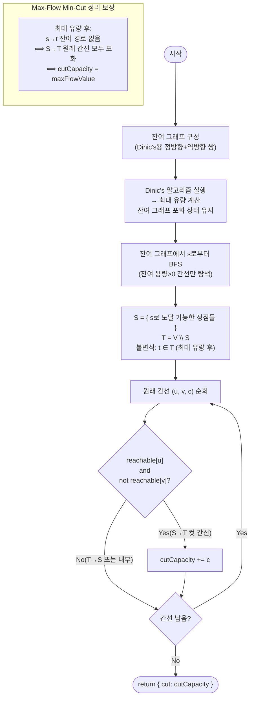

import { AlgorithmSimulation } from "#guide-sim";

# minCut — 컷을 세지 않고 최대 유량 하나로 찾는 최소 컷

## 한눈에 보는 컨셉

정점 집합을 소스 쪽 `S`와 싱크 쪽 `T`로 나누는 모든 방법 중, `S`에서 `T`로 넘어가는 간선 용량의 합이 가장 작은 분할을 찾는 문제예요. 이 분할을 직접 나열하는 대신, **Max-Flow Min-Cut 정리** 덕분에 최대 유량 값 하나만 계산하면 그 값이 곧 최소 컷 용량이라는 사실을 이용합니다. 최대 유량을 구한 뒤 잔여 그래프에서 소스로부터 도달 가능한 정점을 BFS로 표시하기만 하면, 실제 컷에 포함되는 간선까지 `O(V+E)` 추가 비용으로 알아낼 수 있어요.

## 출발점: 가장 순진한 방법부터

문제를 정확히 잡고 갈게요.

```ts
function minCut(
  n: number,
  edges: [number, number, number][],
  source: number,
  sink: number,
): { cut: number }
```

정점 번호는 `0 ~ n-1`이고, `edges`의 각 원소 `[u, v, c]`는 `u`에서 `v`로 향하는 용량 `c`짜리 방향 간선입니다. 반환값 `{ cut }`은 `source`와 `sink`를 분리하는 최소 컷의 용량 합이에요. 제약은 `2 ≤ n ≤ 500`, `0 ≤ E ≤ 10^4`, `0 ≤ c ≤ 10^6`, `source ≠ sink`입니다.

컷의 정의부터 짚고 갈게요. 정점 집합을 두 그룹 `S`(소스 쪽), `T`(싱크 쪽)로 나누되 `source ∈ S`, `sink ∈ T`가 되도록 분할하면, 그 분할의 **컷 용량**은 `S`에서 `T`로 향하는 간선들의 용량 합이에요.

$$c(S, T) = \sum_{\substack{(u,v,c) \in E \\ u \in S,\, v \in T}} c$$

가장 정직한 방법은 가능한 모든 분할 `(S, T)`를 만들어 보고 컷 용량을 계산해서 최솟값을 취하는 것입니다.

```ts
function minCutNaive(
  n: number,
  edges: [number, number, number][],
  s: number,
  t: number,
): { cut: number } {
  let best = Infinity;
  for (let mask = 0; mask < (1 << n); mask++) {
    const inS = (v: number) => ((mask >> v) & 1) === 1;
    if (!inS(s) || inS(t)) continue; // 불변식: s ∈ S, t ∈ T
    let cutVal = 0;
    for (const [u, v, c] of edges) {
      if (inS(u) && !inS(v)) cutVal += c;
    }
    best = Math.min(best, cutVal);
  }
  return { cut: best };
}
```

작은 예로 직접 나열해 볼게요. `n=4`, `edges=[[0,1,3],[0,2,2],[1,2,1],[1,3,2],[2,3,3]]`, `source=0`, `sink=3`이면 `source`와 `sink`의 소속은 이미 고정돼 있으니, 나머지 정점 `1, 2`만 자유롭게 `S`/`T`에 배정하면 됩니다. 분할이 `2^2 = 4`가지뿐이라 전부 손으로 셀 수 있어요.

```text
S = {0}       → cut = c(0,1)+c(0,2)             = 3+2   = 5
S = {0,1}     → cut = c(0,2)+c(1,2)+c(1,3)      = 2+1+2 = 5
S = {0,2}     → cut = c(0,1)+c(2,3)             = 3+3   = 6
S = {0,1,2}   → cut = c(1,3)+c(2,3)             = 2+3   = 5
                                        최소값 = 5  ✓
```

문제는 정점이 `n = 500`개까지 늘어난다는 거예요. `source`, `sink`를 뺀 나머지 `498`개 정점을 자유롭게 배정하는 경우의 수는 `2^498`이고, 이는 우주 전체의 원자 수(약 `10^80`)보다도 훨씬 큰 숫자입니다.

```text
n = 4    → 자유 정점 2개  → 2^2   = 4 가지         → 순식간
n = 500  → 자유 정점 498개 → 2^498 ≈ 10^149.9 가지  → 완전히 불가능
```

참고로 "분할을 나열하는 대신 아예 제거할 간선의 부분집합을 나열하자"는 대안도 있지만, 이건 `2^E`가지라 `E = 10^4`에서는 더 절망적이에요. 두 naive 모두 "가능한 답의 후보를 전부 만들어 비교한다"는 구조를 벗어나지 못하는 게 근본 낭비입니다. 목표는 이 나열을 걷어내고 다항 시간 — 구체적으로는 `O(V^2 \cdot E)` 수준 — 안에 답을 내는 것이에요.

그런데 위 표를 다시 보면 낌새가 하나 보입니다. `S = {0}`과 `S = {0,1,2}`처럼 완전히 다른 분할인데 컷 값이 똑같이 `5`로 나와요. **분할을 일일이 비교하지 않고도 이 최솟값 `5`를 곧바로 알아낼 방법은 없을까?** 이것이 이번 문제의 출발 단서입니다.

## 아이디어 자세히 들여다보기

### 정점을 갈라놓는 컷 — 정의와 그림

앞서 쓴 컷의 정의를 정식으로 다시 쓰면 이렇습니다.

$$S \cup T = V,\quad S \cap T = \emptyset,\quad \text{source} \in S,\quad \text{sink} \in T$$

이 조건을 만족하는 분할 하나하나가 **s-t 컷**이고, 그 값이 위에서 정의한 `c(S, T)`예요. `S = {0}`인 경우를 그림으로 그려 보면 이렇습니다.

```text
      S = {0}                 T = {1, 2, 3}
     ┌─────┐        3       ┌─────┐
     │  0  │ ──────────────▶│  1  │
     └──┬──┘                └─────┘
        │           2       ┌─────┐
        └──────────────────▶│  2  │
                             └─────┘
   컷 간선(S→T만): 0→1(3), 0→2(2)  →  c(S,T) = 5
   1→2, 1→3, 2→3은 양 끝이 모두 T 안에 있어 컷에 포함되지 않는다
```

**왜 하필 "정점을 두 편으로 가르는" 형태로 정의할까요?** 앞서 언급한 "제거할 간선 부분집합을 직접 고르는" 정의도 같은 최적값을 주긴 합니다(어떤 분할 `(S,T)`든, 그 경계 간선들만 제거하면 `s`와 `t`가 분리되니까요). 하지만 간선 집합 기준 정의는 "어떤 간선을 제거할지"를 조합적으로 탐색해야 해서 실마리가 안 보여요. 반면 정점 분할 기준 정의는 뒤에 볼 최대 유량 이론과 곧바로 이어지는 구조를 갖고 있습니다 — 이 연결고리가 다음 절의 핵심이에요.

확인 질문 하나만 해 볼까요? `S = {0, 2}`라면 컷에 포함되는 간선은 무엇일까요? (위 표를 보면 `0→1(3)`과 `2→3(3)`, 합 `6`이죠 — `1`이 `T`에 남아 있으니 `1→2`, `1→3`은 `u`가 `T`라서 제외됩니다.)

### 단서를 설명해 주는 이론 — Max-Flow Min-Cut 정리

분할을 일일이 세지 않고도 최소 컷을 알아낼 수 있다는 낌새는 이미 이론화되어 있어요. 바로 **Max-Flow Min-Cut 정리**입니다: "$s$에서 $t$로 흘릴 수 있는 최대 유량 = $s$-$t$ 컷 중 최소 용량". 이 정리는 두 방향의 부등식이 만나 등호가 되는 구조로 증명됩니다.

**1단계(약한 쌍대성, 항상 성립)**: 임의의 유량 $f$와 임의의 컷 $(S,T)$에 대해, $f$가 $s$에서 $t$로 흘러가려면 반드시 $S \to T$ 경계를 건너야 해요. 그 경계의 용량 합이 $c(S,T)$이니,

$$|f| \leq c(S, T) \quad \text{(임의의 유량, 임의의 컷 쌍에 대해)}$$

이 부등식은 어떤 유량·어떤 컷을 골라도 항상 성립하는 기저 사실입니다. 따라서 최대 유량 $\leq$ 최소 컷도 자동으로 따라와요.

**2단계(강한 쌍대성, 등호를 만드는 특정 구성)**: 이제 $f^*$를 최대 유량이라 하고, 잔여 그래프에서 소스 $s$로부터 도달 가능한 정점 집합을 $S^*$로 정의합니다. 최대 유량이 흐르는 순간이므로 $s$에서 $t$로의 잔여 경로가 없고, 따라서 $t \notin S^*$가 강제돼요(즉 $t \in T^* = V \setminus S^*$, 유효한 컷). 이때 $S^* \to T^*$ 방향의 **원래 간선**은 전부 포화 상태(잔여 용량 0)입니다 — 그렇지 않다면 그 간선을 타고 더 나아갈 수 있어 도달 가능 집합에 모순이 생기니까요. 포화됐다는 건 흘린 유량이 원래 용량과 같다는 뜻이니,

$$c(S^*, T^*) = \sum_{u \in S^*, v \in T^*} c(u,v) = \sum_{u \in S^*, v \in T^*} f(u,v) = |f^*|$$

1단계에서 $|f^*| \leq c(S^*,T^*)$였는데, 2단계에서 $c(S^*,T^*) = |f^*|$인 특정 컷을 찾았으니, 이 컷이 곧 최소 컷이고 그 값은 최대 유량과 정확히 같습니다.

$$\min_{(S,T)} c(S,T) = \max f = |f^*|$$

이 등식이 이번 풀이의 전부예요 — **최대 유량을 구하는 어떤 알고리즘이든 그대로 가져다 쓰고**, 잔여 그래프에서 도달 가능 집합 $S^*$를 BFS로 찾은 뒤 원래 간선 중 $S^* \to T^*$ 방향의 용량만 더하면 됩니다. 최대 유량 계산에는 이 프로젝트의 [maxFlow 가이드](../maxFlow/maxFlow-guide.mdx)에서 다루는 Dinic's 알고리즘을 그대로 재사용해요(레벨 그래프·차단 유량 같은 Dinic's 내부 동작 자체는 그 가이드가 훨씬 자세히 다룹니다). 목표 복잡도는 Dinic's의 `O(V^2 \cdot E)`에 BFS 한 번의 `O(V+E)`를 더한 것으로, `V ≤ 500`, `E ≤ 10^4` 규모에서 충분히 빠릅니다. 이 "$\text{cut} = \text{flow}$" 등식은 코드 절의 자기 검증에도 그대로 쓰이니 기억해 두세요.

### 왜 모순 없이 작동하는가

이 알고리즘이 옳다는 걸 다시 한 문장으로 요약하면 이렇습니다.

> 최대 유량을 구한 뒤 잔여 그래프에서 도달 가능한 집합 $S^*$를 잡으면, $S^* \to T^*$ 방향의 원래 간선은 전부 포화 상태이고, 그 용량 합은 앞 절의 두 부등식이 만나 등호가 되는 지점 — 즉 최대 유량과 정확히 같다.

기저(1단계: 임의의 유량-컷 쌍은 $|f| \leq c(S,T)$)와 핵심 단계(2단계: 종료 시점의 $S^*$가 등호를 달성)를 합치면, 이 알고리즘이 반환하는 값이 반드시 최소 컷임이 보장돼요. 다른 컷을 시도할 필요가 없는 이유도 여기 있습니다 — $S^*$보다 작은 컷은 1단계에 의해 존재할 수 없거든요.

여기서 **헷갈리기 쉬운 포인트**가 둘 있어요.

- **컷 용량을 셀 때 `!reachable[v]` 조건을 빠뜨리면 안 됩니다.** "u가 S에 있으면 u에서 나가는 간선은 다 컷이다"라고 착각하기 쉬운데, 그 간선의 도착점 `v`가 여전히 `S` 안에 있을 수도 있어요. `n=3`, `edges=[[0,1,10],[1,2,5]]`, `source=0`, `sink=2`를 예로 들면, 최대 유량 계산 후 잔여 그래프에서 `reachable = {0, 1}`이 됩니다(`0→1`은 잔여 용량 `5`가 남아 `1`까지 도달 가능, `1→2`는 포화라 `2`엔 못 감).

```text
reachable = {0, 1},  T = {2}

틀린 방법(v 체크 누락): u ∈ S인 간선을 전부 더함
  → c(0,1) + c(1,2) = 10 + 5 = 15   ✗ (0→1은 S 내부 간선인데 포함시킴)

맞는 방법(u ∈ S, v ∈ T 모두 확인):
  → c(1,2) = 5                       ✓ (실제 최소 컷과 일치)
```

- **원래 간선의 용량을 더해야지, 잔여 용량을 더하면 안 됩니다.** 같은 원리로 "포화된 간선의 잔여 용량을 더하면 되겠지"라고 생각하면 정반대로 틀려요. 앞의 `n=4` 예시(`source=0`, `sink=3`, 최대 유량 `5`)에서 `reachable = {0}`뿐이고, 컷 간선 `0→1`, `0→2`는 최대 유량 후 둘 다 포화(잔여 용량 `0`)돼 있습니다.

```text
틀린 방법(잔여 용량을 더함): 0 + 0 = 0            ✗
맞는 방법(원래 edges 배열의 c를 더함): 3 + 2 = 5   ✓
```

> 기억법: "컷은 **원래 간선**으로, 방향은 **S→T로만**." 잔여 그래프는 도달 가능 집합을 찾는 데만 쓰고, 합산은 항상 입력으로 받은 `edges`로 되돌아갑니다.

엣지 케이스에서도 이 틀이 그대로 작동하는지 점검해 볼게요.

```text
간선 없음 (edges=[])            → reachable={s}뿐, 컷 간선 0개 → cut = 0
s-t가 원래부터 단절            → t 도달 불가 → 최대 유량 0 → cut = 0
s→t 간선 하나뿐 (cap=10)        → 최대 유량 10 → reachable={s} → cut = 10
병렬 간선 (0→1 cap 3, 0→1 cap 4) → 둘 다 S→T 컷 간선 → cut = 3+4 = 7
```

## 아이디어를 코드로 옮기기

먼저 잔여 그래프를 만들고 Dinic's로 최대 유량을 구합니다. Dinic's 자체의 상세 설명(레벨 배열, 차단 유량, `iter` 포인터의 역할)은 [maxFlow 가이드](../maxFlow/maxFlow-guide.mdx)에서 다루므로, 여기서는 컷 문제에 맞춰 그대로 재사용한다는 것만 확인하고 넘어갈게요.

```ts
type ResidualEdge = { to: number; cap: number; rev: number };

function buildResidualGraph(
  n: number,
  edges: [number, number, number][],
): ResidualEdge[][] {
  const graph: ResidualEdge[][] = Array.from({ length: n }, () => []);
  const addEdge = (u: number, v: number, c: number) => {
    graph[u].push({ to: v, cap: c, rev: graph[v].length });
    graph[v].push({ to: u, cap: 0, rev: graph[u].length - 1 });
  };
  for (const [u, v, c] of edges) addEdge(u, v, c);
  return graph;
}

function dinicMaxFlow(
  graph: ResidualEdge[][],
  n: number,
  s: number,
  t: number,
): number {
  let totalFlow = 0;
  const level = new Array<number>(n).fill(-1);
  const iter = new Array<number>(n).fill(0);

  const bfs = (): boolean => {
    level.fill(-1);
    level[s] = 0;
    const queue = [s];
    let qi = 0;
    while (qi < queue.length) {
      const u = queue[qi++]!;
      for (const e of graph[u]!) {
        if (e.cap > 0 && level[e.to] === -1) {
          level[e.to] = level[u]! + 1;
          queue.push(e.to);
        }
      }
    }
    return level[t] !== -1;
  };

  const dfs = (u: number, pushed: number): number => {
    if (u === t) return pushed;
    for (; iter[u]! < graph[u]!.length; iter[u]!++) {
      const e = graph[u]![iter[u]!]!;
      if (e.cap > 0 && level[e.to] === level[u]! + 1) {
        const d = dfs(e.to, Math.min(pushed, e.cap));
        if (d > 0) {
          e.cap -= d;
          graph[e.to]![e.rev]!.cap += d;
          return d;
        }
      }
    }
    return 0;
  };

  while (bfs()) {
    iter.fill(0);
    let f: number;
    while ((f = dfs(s, Infinity)) > 0) totalFlow += f;
  }
  return totalFlow;
}
```

여기까지는 최대 유량만 구합니다. 이번 문제의 진짜 알맹이는 그다음 두 단계 — 잔여 그래프 BFS와 원래 간선 합산 — 이에요.

```ts
function minCut(
  n: number,
  edges: [number, number, number][],
  source: number,
  sink: number,
): { cut: number } {
  const graph = buildResidualGraph(n, edges);
  const maxFlowValue = dinicMaxFlow(graph, n, source, sink);

  const reachable = new Array<boolean>(n).fill(false);
  reachable[source] = true;
  const queue = [source];
  let qi = 0;
  while (qi < queue.length) {
    const u = queue[qi++]!;
    for (const e of graph[u]!) {
      if (e.cap > 0 && !reachable[e.to]) {
        reachable[e.to] = true;
        queue.push(e.to);
      }
    }
  }

  let cutCapacity = 0;
  for (const [u, v, c] of edges) {
    if (reachable[u] && !reachable[v]) cutCapacity += c;
  }

  console.assert(
    cutCapacity === maxFlowValue,
    `Max-Flow Min-Cut 불일치: cut=${cutCapacity}, flow=${maxFlowValue}`,
  );

  return { cut: cutCapacity };
}
```

**가장 중요한 줄은 `if (e.cap > 0 && !reachable[e.to])`와 `if (reachable[u] && !reachable[v])` 두 곳입니다.** 앞의 것은 BFS가 "잔여 용량이 남은 간선만" 따라가게 강제해서(포화된 간선은 건너뜀) 정확한 도달 가능 집합을 만들고, 뒤의 것은 앞 절에서 짚은 두 함정(`v` 체크 누락, 잔여 용량 사용)을 동시에 막습니다 — `reachable[u]`로 시작점이 `S`인지, `!reachable[v]`로 도착점이 정말 `T`인지 확인한 뒤에야 **원래 용량 `c`**를 더해요. 그 밖에 놓치기 쉬운 지점은 `graph[u].push(...)`와 `graph[v].push(...)`의 `rev` 값입니다 — 정방향을 넣기 *전에* `graph[v].length`를 미리 읽어 역방향의 `rev`로 쓰고, 역방향을 넣은 *후에* `graph[u].length - 1`을 정방향의 `rev`로 씁니다. 순서를 바꾸면 두 간선이 서로 다른 짝을 가리켜 유량 갱신이 조용히 어긋나요.

## 실행 시각화

방향 네트워크 `n = 4`, `edges = [[0,1,3], [0,2,2], [1,2,1], [1,3,2], [2,3,3]]`, `source = 0`, `sink = 3`에 대해 Max-Flow Min-Cut으로 최소 컷을 구하는 과정입니다. 먼저 Dinic's로 최대 유량을 흘린 뒤, 잔여 그래프에서 `s`로부터 BFS로 도달 집합 `S`를 찾고 `S→T` 원래 간선 용량을 합산해요. 그래프 패널의 간선 가중치는 잔여 용량이고, 노드 색은 `S`(visited)·`T`(default)·컷 정점(active), `activeEdge`는 합산 중인 컷 간선입니다.

실제 반환값은 `{ cut: 5 }`(최대 유량 `5`와 동일, 컷은 `{s}` → 나머지)이며, 시뮬레이션 마지막 프레임의 `cutCapacity`와 일치합니다.

> 대화형 시뮬레이션은 MDX 런타임에서 표시됩니다.

export const nodes = [
  { id: 0, label: "s(0)", x: 12, y: 50 },
  { id: 1, label: "1", x: 45, y: 18 },
  { id: 2, label: "2", x: 45, y: 82 },
  { id: 3, label: "t(3)", x: 80, y: 50 },
];

export const mkEdges = (c01, c02, c12, c13, c23) => [
  { from: 0, to: 1, weight: c01, directed: true },
  { from: 0, to: 2, weight: c02, directed: true },
  { from: 1, to: 2, weight: c12, directed: true },
  { from: 1, to: 3, weight: c13, directed: true },
  { from: 2, to: 3, weight: c23, directed: true },
];

export const steps = [
  {
    title: "1단계: 최대 유량 계산",
    detail: "Dinic's로 maxFlow 실행. 최대 유량 = 5. 잔여 그래프가 포화 상태로 남는다.",
    nodes, edges: mkEdges(3, 2, 1, 2, 3),
    nodeStatus: { 0: "active", 3: "frontier" },
    entries: [
      { label: "maxFlowValue", value: "5" },
      { label: "초기 용량", value: "01=3, 02=2, 13=2, 23=3" },
    ],
  },
  {
    title: "최대 유량 후 잔여 그래프",
    detail: "유량 5를 흘린 뒤 잔여: 0-1=0, 0-2=0(소스 간선 포화), 1-2=0, 1-3=0, 2-3=0.",
    nodes, edges: mkEdges(0, 0, 0, 0, 0),
    nodeStatus: { 0: "default", 1: "default", 2: "default", 3: "default" },
    entries: [
      { label: "잔여 (01,02,12,13,23)", value: "0,0,0,0,0" },
      { label: "역방향 잔여", value: "10=3,20=2,...(생략)" },
    ],
  },
  {
    title: "2단계: s에서 BFS",
    detail: "s=0의 정방향 간선 0-1, 0-2 잔여 0 → 더 진행 불가. reachable = {0}만.",
    nodes, edges: mkEdges(0, 0, 0, 0, 0),
    nodeStatus: { 0: "active", 1: "default", 2: "default", 3: "default" },
    entries: [
      { label: "reachable", value: "{0}" },
      { label: "t 도달?", value: "false (t ∈ T)" },
    ],
  },
  {
    title: "S / T 결정",
    detail: "S = {0}, T = {1, 2, 3}. 최대 유량 후라 t는 반드시 T에 속한다.",
    nodes, edges: mkEdges(0, 0, 0, 0, 0),
    nodeStatus: { 0: "visited", 1: "default", 2: "default", 3: "default" },
    entries: [
      { label: "S", value: "{0}" },
      { label: "T", value: "{1, 2, 3}" },
    ],
  },
  {
    title: "컷 간선 0→1 합산",
    detail: "원래 간선 (0,1,3): reachable[0]=true, reachable[1]=false → 컷 간선. cut += 3.",
    nodes, edges: mkEdges(3, 2, 1, 2, 3),
    nodeStatus: { 0: "visited", 1: "active", 2: "default", 3: "default" },
    activeEdge: { from: 0, to: 1 },
    entries: [
      { label: "+ c(0,1)", value: "3" },
      { label: "cutCapacity", value: "3" },
    ],
  },
  {
    title: "컷 간선 0→2 합산",
    detail: "원래 간선 (0,2,2): reachable[0]=true, reachable[2]=false → 컷 간선. cut += 2.",
    nodes, edges: mkEdges(3, 2, 1, 2, 3),
    nodeStatus: { 0: "visited", 1: "active", 2: "active", 3: "default" },
    activeEdge: { from: 0, to: 2 },
    entries: [
      { label: "+ c(0,2)", value: "2" },
      { label: "cutCapacity", value: "5" },
    ],
  },
  {
    title: "나머지 간선 검사",
    detail: "1-2, 1-3, 2-3은 u가 T에 속하므로 컷 간선 아님. 합산 제외.",
    nodes, edges: mkEdges(3, 2, 1, 2, 3),
    nodeStatus: { 0: "visited", 1: "default", 2: "default", 3: "default" },
    entries: [
      { label: "컷 간선", value: "0→1, 0→2" },
      { label: "cutCapacity", value: "5" },
    ],
  },
  {
    title: "완료: cut = 5",
    detail: "컷 용량 3+2=5 = 최대 유량 5 (Max-Flow Min-Cut 정리). { cut: 5 } 반환.",
    nodes, edges: mkEdges(3, 2, 1, 2, 3),
    nodeStatus: { 0: "visited", 1: "active", 2: "active", 3: "active" },
    entries: [
      { label: "cut == maxFlow", value: "5 == 5 ✓" },
      { label: "반환값", value: "{ cut: 5 }" },
    ],
  },
];

<AlgorithmSimulation view={["graph", "keyValue"]} steps={steps} title="Min Cut (Max-Flow Min-Cut): s=0, t=3" />

## 흐름 한눈에 보기



## 스스로 점검하기

1. `n=4`, `edges=[[0,1,100],[1,2,100],[2,3,1]]`, `source=0`, `sink=3`에서 `reachable` 집합과 `cut` 값을 손으로 구해 보세요. (힌트: 병목은 `2→3`의 용량 `1`뿐이라 `0→1`, `1→2`는 최대 유량 후에도 잔여 용량이 남습니다. 답: `reachable = {0,1,2}`, `cut = 1`.)
2. `n=3`, `edges=[[0,1,10],[1,2,5]]`, `source=0`, `sink=2`에서 "`u ∈ S`인 간선을 전부 더한다"는 잘못된 규칙을 쓰면 몇이 나올까요? 왜 실제 정답 `5`보다 커지는지, `reachable` 집합을 근거로 설명해 보세요.
3. 만약 정점에도 "이 정점을 지나는 유량은 얼마를 넘을 수 없다"는 용량이 붙는다면(정점 컷), 지금까지 배운 `minCut`을 어떻게 고쳐야 할까요? (힌트: 정점 `v`를 `v_in`, `v_out` 두 개로 쪼개고 그 사이에 정점 용량만큼의 간선을 하나 추가하면, 정점 컷 문제가 다시 지금 배운 간선 컷 문제로 환원됩니다.)
