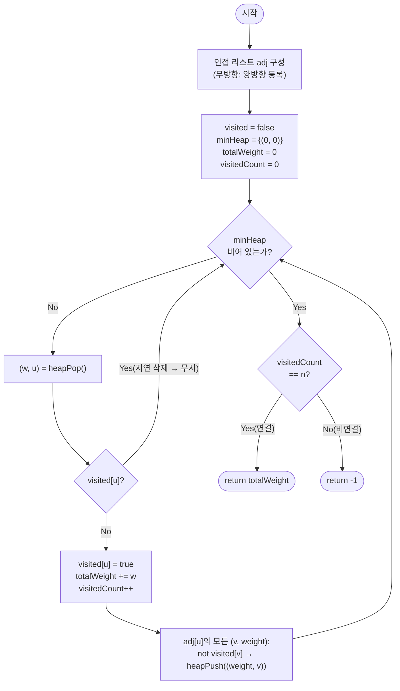

import { AlgorithmSimulation } from "#guide-sim";

# Prim MST — 컷을 넘는 가장 싼 간선을 힙으로 즉시 찾아내는 이유

## 한눈에 보는 컨셉

정점 하나에서 트리를 시작해, 매 순간 "트리 안"과 "트리 밖"을 가르는 경계(컷)를 넘는 간선 중 가장 싼 것을 골라 트리에 붙여 나가는 탐욕 알고리즘이에요. 이 선택이 항상 안전하다는 근거가 **컷 성질(Cut Property)**이고, "가장 싼 경계 간선"을 매번 훑는 대신 최소 힙에서 즉시 꺼내면 전체가 `O((V+E) log V)`에 끝납니다. 핵심은 단 하나 — **정점을 트리에 추가할 때마다 그 이웃을 힙에 흘려 넣어, 힙이 항상 "다음에 가장 싸게 붙일 수 있는 정점"을 들고 있게 만드는 것**입니다.

## 출발점: 가장 순진한 방법부터

문제를 먼저 정확히 잡을게요.

```ts
function primMst(n: number, edges: [number, number, number][]): number
```

| 매개변수 | 의미 | 제약 |
|----------|------|------|
| `n` | 정점 개수 $V$ (번호 $0 \ldots n-1$) | $1 \leq n \leq 10^4$ |
| `edges` | 무방향 간선 `[u, v, w]` 목록 | $0 \leq E \leq V(V-1)/2$, $0 \leq w \leq 10^9$ |
| 반환값 | 최소 신장 트리(MST)의 가중치 합. 그래프가 연결되지 않으면 `-1` | — |

자기 루프 `[v, v, w]`는 신장 트리에 절대 들어갈 수 없으니 무시하고, 평행 간선(같은 두 정점을 잇는 여러 간선)이 있으면 그중 가벼운 것만 의미가 있습니다.

가장 정직한 방법은 "모든 신장 트리를 나열하고 가중치 합이 최소인 것을 고른다"입니다.

```text
naive:
  minWeight = INF
  for each spanning tree T of G:
    minWeight = min(minWeight, sum of weights in T)
  return minWeight
```

신장 트리의 개수는 Cayley 공식으로 $V^{V-2}$개입니다. $V = 10^4$이면 이 수는 상상하기도 어려운 크기라 첫 시도부터 막힙니다.

두 번째로 정직한 방법을 생각해 볼게요. "트리를 정점 하나에서 시작해서, 트리와 인접한 미방문 정점 중 가장 가까운 것을 매번 찾아 붙인다"는 아이디어는 자연스럽습니다 — 신장 트리는 결국 정점을 하나씩 늘려 가며 만드니까요. 이를 그대로 배열로 구현한 것이 `naive_prim`입니다.

```ts
function primMstNaive(n: number, edges: [number, number, number][]): number {
  const adj: [number, number][][] = Array.from({ length: n }, () => []);
  for (const [u, v, w] of edges) {
    if (u === v) continue; // 자기 루프는 신장 트리에 포함되지 않음
    adj[u].push([v, w]);
    adj[v].push([u, w]);
  }

  const visited = new Array<boolean>(n).fill(false);
  const minEdge = new Array<number>(n).fill(Infinity); // 각 미방문 정점까지의 최소 연결 비용
  minEdge[0] = 0;
  let totalWeight = 0;
  let visitedCount = 0;

  for (let iter = 0; iter < n; iter++) {
    let u = -1;
    for (let v = 0; v < n; v++) {
      if (!visited[v] && (u === -1 || minEdge[v] < minEdge[u])) u = v;
    }
    if (u === -1 || minEdge[u] === Infinity) break; // 더 이상 연결 가능한 정점이 없음
    visited[u] = true;
    totalWeight += minEdge[u];
    visitedCount++;
    for (const [v, w] of adj[u]) {
      if (!visited[v] && w < minEdge[v]) minEdge[v] = w;
    }
  }

  return visitedCount === n ? totalWeight : -1;
}
```

`minEdge[v]`는 "현재 트리와 $v$를 잇는 간선들 중 지금까지 알려진 최소 가중치"를 저장해 둔 배열입니다. 매 반복마다 미방문 정점 전체를 훑어 `minEdge`가 가장 작은 정점을 고르는데, 이 훑기가 $O(V)$이고 $n$번 반복하니 $O(V^2)$입니다. 고정 입력 `n=4`, `edges=[[0,1,4],[0,2,1],[2,1,2],[1,3,1],[2,3,5]]`로 실제 스캔 횟수를 세어 보면 이렇습니다.

```text
반복 1: 미방문 4개 전체 스캔 → minEdge=[0,∞,∞,∞] → u=0 선택 (비용 0)
반복 2: 미방문 3개 전체 스캔 → minEdge=[0,4,1,∞]  → u=2 선택 (비용 1)
반복 3: 미방문 2개 전체 스캔 → minEdge=[0,2,1,5]  → u=1 선택 (비용 2)
반복 4: 미방문 1개 전체 스캔 → minEdge=[0,2,1,1]  → u=3 선택 (비용 1)

총 스캔 = 4+3+2+1 = O(V^2), totalWeight = 0+1+2+1 = 4
```

$V = 10^4$이면 총 스캔은 대략 $V^2/2 = 5 \times 10^7$이고, 최악의 형태로 보면 $O(V^2) = 10^8$까지 커집니다. 시간 제한 1초 안에서 경계에 걸리거나 넘칠 수 있는 크기예요. **낭비의 정체**는 매 반복마다 이미 알고 있는 `minEdge` 값들 중 최솟값을 처음부터 다시 훑는다는 데 있습니다 — 값 자체는 이웃이 갱신될 때만 바뀌는데, "누가 최솟값인지"를 찾는 절차는 매번 $O(V)$를 다 씁니다. 최솟값을 즉시 꺼내는 자료구조가 있다면 이 훑기를 없앨 수 있지 않을까요?

## 아이디어 자세히 들여다보기

### 컷을 넘는 최소 간선 — 수식과 그림

트리에 이미 들어간 정점 집합을 $S$라고 둘게요. $S$와 나머지 정점 $V \setminus S$를 가르는 경계를 **컷(cut)** $(S, V \setminus S)$이라 부르고, 그 경계를 건너는 간선들을 다음과 같이 정의합니다.

$$\text{crossing}(S) = \{ (u, v, w) \in E : u \in S,\; v \in V \setminus S \}$$

Prim이 매 단계에서 하는 일은 정확히 이 집합에서 최소 가중치 간선을 고르는 것입니다.

$$e^{*} = \operatorname*{arg\,min}_{(u,v,w) \,\in\, \text{crossing}(S)} w$$

**왜 하필 "컷을 넘는 간선" 중에서 골라야 할까요?** 신장 트리는 모든 정점을 연결해야 하므로, $S$가 아직 전체 정점이 아닌 한 반드시 $S$ 밖으로 나가는 간선을 언젠가는 선택해야 합니다. "지금 당장 가장 싼 간선"이 아니라 "지금 당장 트리를 확장할 수 있는 간선 중 가장 싼 것"으로 후보를 좁히는 것이 핵심 차이예요 — crossing(S) 밖의 간선(양 끝이 모두 $S$ 안에 있는 간선)을 골라도 트리가 커지지 않으니 애초에 후보가 아닙니다.

앞서 손으로 훑었던 고정 입력으로 $S$가 자라는 과정을 그대로 표로 채워 볼게요.

```text
S = {0}                       crossing(S) = { (0,1,4), (0,2,1) }
   0 --- 1                    최소값 e* = (0,2,1)
   |
   2 --- 3

S = {0,2}                     crossing(S) = { (0,1,4), (2,1,2), (2,3,5) }
   0 --- 1                    최소값 e* = (2,1,2)
   |
   2 --- 3
```

| 단계 | $S$ | $\text{crossing}(S)$ | 선택된 $e^{*}$ |
|---|---|---|---|
| 1 | $\{0\}$ | $(0,1,4),\ (0,2,1)$ | $(0,2,1)$ |
| 2 | $\{0,2\}$ | $(0,1,4),\ (2,1,2),\ (2,3,5)$ | $(2,1,2)$ |
| 3 | $\{0,1,2\}$ | $(1,3,1),\ (2,3,5)$ | $(1,3,1)$ |
| 4 | $\{0,1,2,3\}$ | $\emptyset$ | — (완료) |

선택된 간선의 가중치를 더하면 $1 + 2 + 1 = 4$로, 앞의 `naive_prim` 실행 결과와 정확히 일치합니다. 잠깐 확인해 볼까요? 3단계에서 $\text{crossing}(S)$에 $(0,1,4)$가 왜 빠졌을까요 — $S = \{0,1,2\}$가 되면서 정점 1이 이미 $S$ 안에 들어갔기 때문에, $(0,1,4)$는 양 끝이 모두 $S$ 안에 있는 간선이 되어 더 이상 경계를 넘지 않기 때문입니다.

### 단서를 설명해 주는 이론 — 컷 성질(Cut Property)

방금 "경계를 넘는 최소 간선을 고르면 될 것 같다"는 감을 잡았는데, 이 감이 실제로 정당한지는 그래프 이론에 이미 이름이 붙어 있는 정리로 설명됩니다.

> **컷 성질(Cut Property).** 그래프 $G = (V, E, w)$의 임의의 컷 $(S, V \setminus S)$($\emptyset \neq S \neq V$)에 대해, $\text{crossing}(S)$에서 가중치가 가장 작은 간선 $e^{*}$는 반드시 어떤 최소 신장 트리(MST)에 포함된다.

증명의 골자는 "교환 논증(exchange argument)"입니다. 어떤 MST $T$가 $e^{*}$를 포함하지 않는다고 가정해 봅시다. $T$는 신장 트리이므로 $S$와 $V \setminus S$를 잇는 간선을 적어도 하나는 갖고 있어야 하는데(그래야 연결되니까요), 그 간선을 $f$라고 하면 $w(f) \geq w(e^{*})$입니다($e^{*}$가 crossing(S)의 최솟값이므로). 이때 $T$에서 $f$를 빼고 $e^{*}$를 더해도 여전히 신장 트리이고, 가중치 합은 늘어나지 않습니다. 즉 $e^{*}$를 포함하는 신장 트리도 최소이거나 그보다 작을 수 없으므로 여전히 MST입니다. (증명 전체는 그래프 이론 교재의 표준 내용이라 여기서는 이 정도로 갈음할게요.)

이 정리를 Prim에 대응시키면 이렇습니다. Prim이 매 단계에서 쓰는 컷은 정확히 $(T, V \setminus T)$ — $T$는 지금까지 만든 트리의 정점 집합입니다. 매 단계마다 $\text{crossing}(T)$의 최소 간선을 고르는 것이 곧 컷 성질을 반복 적용하는 것이고, 이 반복이 정확성을 보장한다는 사실을 기억해 두세요 — 잠시 뒤 "왜 모순 없이 작동하는가" 절에서 이 성질을 귀납의 핵심 축으로 다시 씁니다.

### 셈을 맡는 자료구조 — 최소 힙(min-heap)

앞서 낭비로 짚은 지점은 "$\text{crossing}(S)$의 최솟값을 매번 처음부터 훑는다"는 것이었죠. 이 훑기를 없애려면 "지금까지 알려진 crossing 후보들을 항상 정렬된 상태로 들고 있다가, 최솟값만 즉시 꺼내 주는" 저장소가 필요합니다. 이 역할을 최소 힙이 맡습니다 — 삽입과 최솟값 추출을 각각 $O(\log V)$에 처리해 주는 자료구조예요.

이 프로젝트에 최소 힙을 전용으로 다루는 가이드가 있으니, 힙 내부 구현(sift-up/sift-down)이 궁금하다면 [minHeap 가이드](../../../data-structures/heap/minHeap/minHeap-guide.mdx)를 참고하세요. 여기서는 "`(weight, vertex)` 쌍을 넣으면 가중치가 가장 작은 쌍을 $O(\log V)$에 꺼내 주는 상자"로만 쓰면 충분합니다.

### 왜 모순 없이 작동하는가

**귀납으로 정당화하기.** 기저 사례: $T = \{0\}$(시작 정점 하나)은 자명하게 어떤 MST의 부분집합입니다(정점 하나짜리 트리는 항상 모든 신장 트리에 공통으로 들어 있으니까요). 귀납 단계: $T$가 $k$개의 정점을 가지며 어떤 MST의 부분집합을 이룬다고 가정합니다. Prim은 $\text{crossing}(T)$의 최소 간선 $e^{*} = (u, v, w)$를 골라 $v$를 $T$에 추가합니다. 컷 성질에 의해 $e^{*}$는 어떤 MST에 포함되므로, $T \cup \{v\}$와 지금까지 고른 간선들 역시 어떤 MST의 부분집합을 유지합니다. 여기서 "경우의 완전성"도 짚고 넘어갈게요 — $\text{crossing}(T)$가 비어 있다면 그래프가 비연결이라는 뜻이고(더 이상 확장할 간선이 없음), 비어 있지 않다면 위 논증이 항상 적용되므로 두 경우 외에 다른 가능성은 없습니다. 이를 $n-1$번 반복하면(또는 비연결이면 중간에 확장이 멈추면) 논증이 끝납니다.

**힙과 지연 삭제가 컷 성질을 정확히 구현하는 이유.** 힙에는 같은 정점이 여러 가중치로 중복 삽입될 수 있습니다(정점 $v$가 서로 다른 트리 정점의 이웃으로 여러 번 나올 수 있으니까요). 힙에서 꺼낸 `(w, u)`가 이미 `visited[u] = true`라면 무시하는 것이 지연 삭제인데, 이렇게 해도 정확한 이유는 **$u$에 대해 힙에 남아 있는 항목 중 아직 꺼내지 않은 최솟값이 항상 $\text{crossing}(T)$에서 $u$가 기여하는 최소 비용과 일치**하기 때문입니다. 같은 정점이 가중치 $w_1 < w_2$로 두 번 들어갔다면 힙 성질상 $w_1$이 먼저 나오고, 그 순간 $u$가 방문 처리되므로 $w_2$ 항목은 나중에 나와도 항상 무시됩니다.

여기서 **헷갈리기 쉬운 포인트**가 둘 있습니다.

- **`totalWeight === 0`으로 "비연결인지" 판단하면 안 됩니다.** 가중치가 전부 0인 그래프는 정상적으로 연결돼도 `totalWeight`가 0입니다. 실제로 `primMst(3, [[0,1,0],[1,2,0]])`는 연결 그래프이고 정답은 `0`이지만, `primMst(2, [])`(간선이 아예 없는 비연결 그래프)의 정답은 `-1`입니다. 두 결과 모두 `totalWeight`만 보면 구분할 수 없어요 — 반드시 `visitedCount === n` 같은 별도 카운터로 연결 여부를 판단해야 합니다.

- **힙 항목의 순서를 `(vertex, weight)`로 뒤바꾸면 조용히 틀립니다.** 힙은 첫 번째 원소를 기준으로 정렬되므로, `(weight, vertex)` 대신 `(vertex, weight)` 순서로 넣으면 힙이 "가중치가 작은 순"이 아니라 "정점 번호가 작은 순"으로 정렬됩니다. 고정 입력 `n=4, edges=[[0,1,4],[0,2,1],[2,1,2],[1,3,1],[2,3,5]]`에 이 실수를 그대로 적용해 실행해 보면 이렇게 됩니다.

```text
Before (정상, weight 우선):  0(w=0) → 2(w=1) → 1(w=2) → 3(w=1)   totalWeight = 4
After  (오염, vertex 우선):  0(w=0) → 1(w=4) → 2(w=1) → 3(w=5)   totalWeight = 10  ✗
```

정점 번호가 작다는 이유만으로 정점 1(가중치 4)이 정점 2(가중치 1)보다 먼저 뽑혀 버립니다. 컷 성질이 보장하는 것은 "가중치가 최소인 간선을 고르면 안전하다"는 것이지 "번호가 작은 정점을 고르면 안전하다"는 것이 아니므로, 이 순서 실수는 값을 아예 다른 답(4 대신 10)으로 조용히 바꿔 버립니다.

엣지 케이스도 짚어 둘게요.

```text
n = 1, edges = []            → 신장 트리는 간선 0개, 반환 0
n = 3, edges = [[0,1,5]]     → 정점 2가 고립, crossing이 빌 때 visitedCount=2 < 3 → 반환 -1
평행 간선 [0,1,100],[0,1,1]  → 힙이 둘 다 넣지만 지연 삭제로 최솟값 1만 채택됨 → 반환 1
자기 루프 [0,0,100]          → 인접 리스트 구성 단계에서 아예 걸러짐(u===v)
```

## 아이디어를 코드로 옮기기

컷 성질과 최소 힙을 그대로 코드로 옮기면 이렇습니다.

```ts
type HeapItem = [number, number]; // [weight, vertex]

class MinHeap {
  private data: HeapItem[] = [];

  get size(): number {
    return this.data.length;
  }

  push(item: HeapItem): void {
    this.data.push(item);
    let i = this.data.length - 1;
    while (i > 0) {
      const parent = (i - 1) >> 1;
      if (this.data[parent][0] <= this.data[i][0]) break;
      [this.data[parent], this.data[i]] = [this.data[i], this.data[parent]];
      i = parent;
    }
  }

  pop(): HeapItem | undefined {
    if (this.data.length === 0) return undefined;
    const top = this.data[0];
    const last = this.data.pop();
    if (this.data.length > 0 && last !== undefined) {
      this.data[0] = last;
      let i = 0;
      const n = this.data.length;
      while (true) {
        const l = i * 2 + 1;
        const r = i * 2 + 2;
        let smallest = i;
        if (l < n && this.data[l][0] < this.data[smallest][0]) smallest = l;
        if (r < n && this.data[r][0] < this.data[smallest][0]) smallest = r;
        if (smallest === i) break;
        [this.data[smallest], this.data[i]] = [this.data[i], this.data[smallest]];
        i = smallest;
      }
    }
    return top;
  }
}

function primMst(n: number, edges: [number, number, number][]): number {
  const adj: [number, number][][] = Array.from({ length: n }, () => []);
  for (const [u, v, w] of edges) {
    if (u === v) continue; // 자기 루프는 신장 트리에 포함되지 않음
    adj[u].push([v, w]);
    adj[v].push([u, w]);
  }

  const visited = new Array<boolean>(n).fill(false);
  const heap = new MinHeap();
  heap.push([0, 0]); // (가중치=0, 시작 정점=0)

  let totalWeight = 0;
  let visitedCount = 0;

  while (heap.size > 0) {
    const [w, u] = heap.pop()!;
    if (visited[u]) continue; // 지연 삭제: 이미 방문한 정점은 무시

    visited[u] = true;
    totalWeight += w;
    visitedCount++;

    for (const [v, weight] of adj[u]) {
      if (!visited[v]) heap.push([weight, v]);
    }
  }

  return visitedCount === n ? totalWeight : -1;
}
```

**가장 실수가 잦은 줄은 `heap.push([0, 0])`과 `heap.push([weight, v])`입니다.** 둘 다 `(weight, vertex)` 순서를 지켜야 힙이 가중치 기준으로 정렬됩니다 — 바로 위 절에서 본 것처럼 순서가 뒤바뀌면 값이 조용히 틀립니다. 그다음으로 중요한 결정 지점은 `if (visited[u]) continue;`의 위치예요. 이 검사는 반드시 `totalWeight += w`보다 **먼저** 실행되어야 합니다. 순서를 바꿔서 먼저 더하고 나중에 검사하면, 이미 방문한 정점을 향한 무효 항목(지연 삭제 대상)의 가중치까지 합산에 끼어들어 `totalWeight`가 실제보다 커집니다.

이 구현은 이미 목표로 삼았던 $O((V+E) \log V)$에 도달했습니다. 여기서 한 단계 더 밀어붙일 수 있을까요? 힙에서 같은 정점이 중복으로 쌓이는 대신, 힙 내부 항목을 직접 갱신하는 decrease-key를 지원하는 피보나치 힙을 쓰면 이론상 $O(E + V \log V)$까지 개선됩니다. 하지만 피보나치 힙은 각 노드의 부모·자식·형제 포인터를 관리하는 구현 자체가 매우 복잡해서, 상수 배 개선을 얻는 대가로 코드의 신뢰성과 가독성을 크게 잃습니다. 이 문제의 제약($V \le 10^4$)에서는 이진 힙 + 지연 삭제만으로도 충분히 실용적이라, 이 가이드는 여기서 최적화를 마칩니다. 이진 힙 버전의 진짜 가치는 속도만이 아니라 **구현이 단순해서 실수할 지점이 적다**는 데 있습니다 — 앞서 짚은 순서 실수 두 가지만 피하면 됩니다.

## 실행 시각화

고정 입력 `n = 4`, 무방향 `edges = [[0,1,4], [0,2,1], [2,1,2], [1,3,1], [2,3,5]]`에 대해 `primMst`를 정점 0에서 시작해 실행하는 과정입니다. `graph` 패널에서 노란색은 힙에 후보로 올라온 정점(frontier), 빨간색은 방금 트리에 편입된 정점(active), 회색은 확정(visited)입니다. 굵게 강조된 간선이 MST로 채택된 간선이고, 아래 `priorityQueue` 패널은 최소 힙 `(weight, vertex)` 내용입니다. 실제 반환값은 `4`(MST 간선 0-2(1), 2-1(2), 1-3(1))이며, 시뮬레이션 마지막 프레임의 totalWeight와 일치합니다.

> 대화형 시뮬레이션은 MDX 런타임에서 표시됩니다.

export const nodes = [
  { id: 0, label: "0", x: 24, y: 24 },
  { id: 1, label: "1", x: 76, y: 24 },
  { id: 2, label: "2", x: 24, y: 76 },
  { id: 3, label: "3", x: 76, y: 76 },
];

export const edges = [
  { from: 0, to: 1, weight: 4 },
  { from: 0, to: 2, weight: 1 },
  { from: 2, to: 1, weight: 2 },
  { from: 1, to: 3, weight: 1 },
  { from: 2, to: 3, weight: 5 },
];

export const steps = [
  {
    title: "초기화",
    detail: "인접 리스트(양방향) 구성. 힙에 (0, 0) 삽입. totalWeight=0, visitedCount=0.",
    nodes, edges,
    nodeStatus: { 0: "frontier" },
    heap: [{ label: "v0", key: 0 }],
  },
  {
    title: "정점 0 편입 (w=0)",
    detail: "(0,0) 추출, 미방문 → visited. totalWeight=0, count=1. 이웃 1(w=4), 2(w=1) 힙에 삽입.",
    nodes, edges,
    nodeStatus: { 0: "active", 1: "frontier", 2: "frontier" },
    heap: [{ label: "v2", key: 1 }, { label: "v1", key: 4 }],
  },
  {
    title: "정점 2 편입 (w=1)",
    detail: "최소 (1,2) 추출 → visited. 간선 0-2 채택, totalWeight=1, count=2. 이웃 1(w=2), 3(w=5) 삽입.",
    nodes, edges,
    nodeStatus: { 0: "visited", 1: "frontier", 2: "active", 3: "frontier" },
    activeEdge: { from: 0, to: 2 },
    heap: [{ label: "v1", key: 2 }, { label: "v1", key: 4 }, { label: "v3", key: 5 }],
  },
  {
    title: "정점 1 편입 (w=2)",
    detail: "최소 (2,1) 추출 → visited. 간선 2-1 채택, totalWeight=3, count=3. 이웃 3(w=1) 삽입.",
    nodes, edges,
    nodeStatus: { 0: "visited", 1: "active", 2: "visited", 3: "frontier" },
    activeEdge: { from: 2, to: 1 },
    heap: [{ label: "v3", key: 1 }, { label: "v1", key: 4 }, { label: "v3", key: 5 }],
  },
  {
    title: "정점 3 편입 (w=1)",
    detail: "최소 (1,3) 추출 → visited. 간선 1-3 채택, totalWeight=4, count=4. 미방문 이웃 없음.",
    nodes, edges,
    nodeStatus: { 0: "visited", 1: "visited", 2: "visited", 3: "active" },
    activeEdge: { from: 1, to: 3 },
    heap: [{ label: "v1", key: 4 }, { label: "v3", key: 5 }],
  },
  {
    title: "(4, v1) 추출 → 지연 삭제",
    detail: "정점 1은 이미 visited → 무시(skip). 힙에서 제거만 한다.",
    nodes, edges,
    nodeStatus: { 0: "visited", 1: "visited", 2: "visited", 3: "visited" },
    heap: [{ label: "v3", key: 5 }],
  },
  {
    title: "(5, v3) 추출 → 지연 삭제",
    detail: "정점 3은 이미 visited → 무시. 힙이 비었다.",
    nodes, edges,
    nodeStatus: { 0: "visited", 1: "visited", 2: "visited", 3: "visited" },
    heap: [],
  },
  {
    title: "완료: return 4",
    detail: "힙 소진, visitedCount=4=n → 연결 그래프. MST 가중치 합 = 1+2+1 = 4.",
    nodes, edges,
    nodeStatus: { 0: "visited", 1: "visited", 2: "visited", 3: "visited" },
    activeEdge: { from: 0, to: 2 },
    heap: [],
  },
];

<AlgorithmSimulation view={["graph", "priorityQueue"]} steps={steps} title="Prim MST: start=0" />

## 흐름 한눈에 보기



## 스스로 점검하기

1. `n = 3`, `edges = [[0,1,3], [1,2,1], [0,2,5]]`에서 정점 0을 시작으로 컷 성질을 직접 적용해 보세요. $S = \{0\}$부터 시작해 $\text{crossing}(S)$와 선택되는 간선을 단계별로 적고, 최종 MST 가중치 합을 구해 보세요. (정답: `4` — 선택되는 간선은 $(0,1,3)$과 $(1,2,1)$입니다.)
2. 본문에서 힙 항목을 `(vertex, weight)` 순서로 뒤바꾸면 고정 입력에서 `totalWeight`가 `4` 대신 `10`이 된다고 했습니다. 방문 순서가 `0 → 1 → 2 → 3`으로 바뀌는 이유를 "힙이 무엇을 기준으로 정렬되는가"로 설명해 보세요.
3. 이번엔 **최대** 신장 트리(가중치 합이 가장 큰 신장 트리)를 구하려면 본문 코드의 어느 부분을 어떻게 바꿔야 할지 생각해 보세요. (힌트: 컷 성질은 최댓값 방향으로도 대칭적으로 성립합니다 — "가장 싼 경계 간선" 대신 "가장 비싼 경계 간선"을 고르면 됩니다.)
